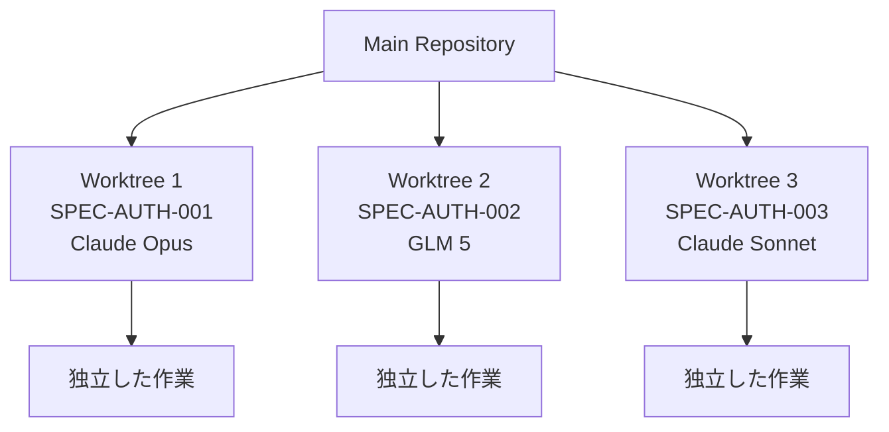
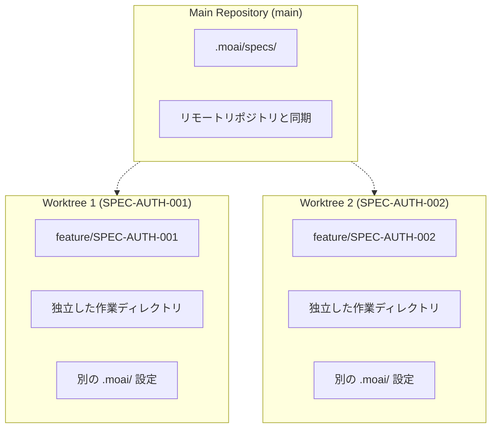
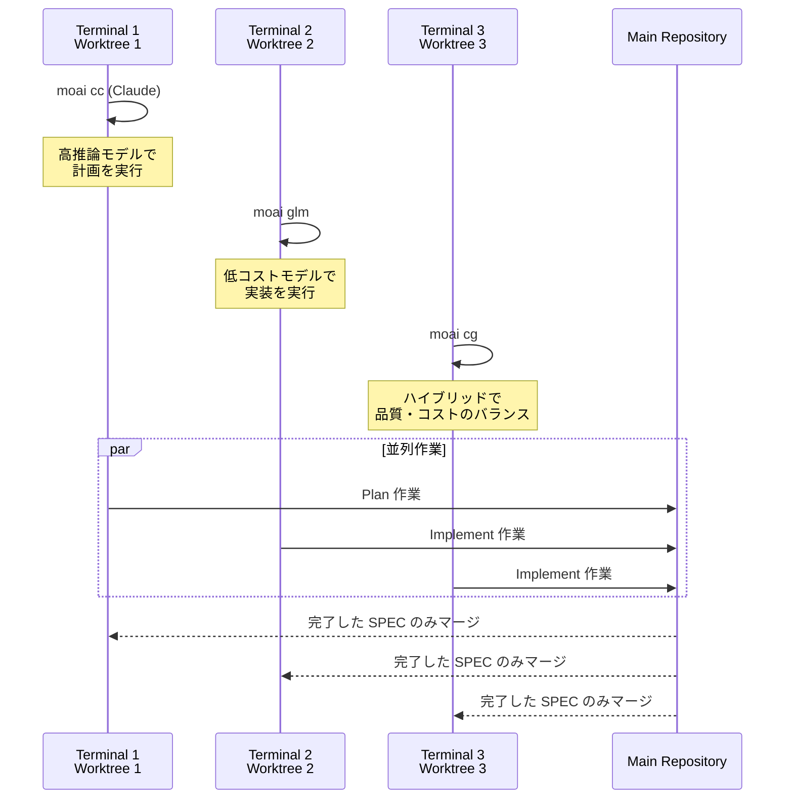
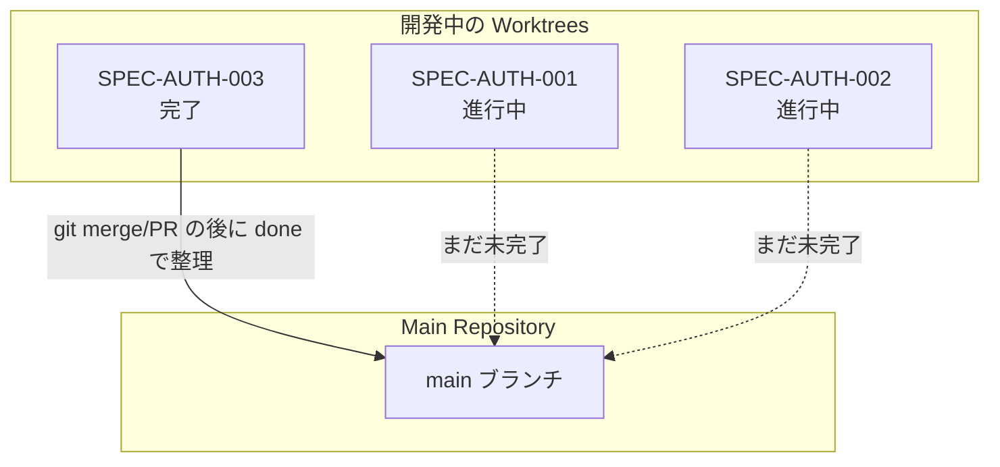

 <strong>所属バリュー</strong>:  エージェンティック・ハーネス

<!-- @value: agentic-harness -->

Git Worktree は MoAI-ADK 並列開発の土台です。SPEC ごとに完全に独立した作業
空間を作り、異なる Git 状態と異なる LLM 設定を同時に保てるようにしてくれます。


3 つの核心のうち **エージェンティック・ハーネス** (品質統制) の側から見ると、Worktree は
SPEC ごとに作業空間を完全に分ける統制装置です。エージェントが並列に動いても互いの作業を
上書きせず、完了した SPEC だけが main へマージされることを保証します。コスト
(トークノミクス) 面の利点も後からついてきます。worktree ごとに LLM 実行モードを個別に
指定できるので、計画ターミナルでは推論の強い Claude モデルを、実装ターミナルでは低コストの
GLM を使うというように、ステップごとにモデルを振り分けられます。

## なぜ Worktree が必要ですか?

### 問題: LLM 設定がセッション間で共有される

Worktree なしに `moai glm` や `moai cc` で LLM バックエンドを変えると、同じプロジェクトで
**開いているすべてのセッションに同じ設定がかかります**。その結果:

- **SPEC 間の干渉** — ある SPEC で変えた LLM 設定が別の SPEC の作業まで揺さぶります
- **並列開発が不可能** — 複数の SPEC を異なる条件で同時に進められません
- **トークンの浪費** — 単純な実装作業まですべて高コストのモデルで回ります

### 解決: 完全な隔離

Git Worktree を使うと、SPEC ごとに **Git 状態と LLM 設定が互いに独立して動きます**:


```mermaid
graph TB
    A[Main Repository] --> B[Worktree 1<br/>SPEC-AUTH-001<br/>Claude Opus]
    A --> C[Worktree 2<br/>SPEC-AUTH-002<br/>GLM 5]
    A --> D[Worktree 3<br/>SPEC-AUTH-003<br/>Claude Sonnet]

    B --> E[独立した作業]
    C --> F[独立した作業]
    D --> G[独立した作業]
```

## 核心ワークフロー

### 3 段階の開発プロセス

Worktree を使う MoAI-ADK 開発は 3 つの段階で流れます:

```mermaid
flowchart TD
    subgraph Phase1["Phase 1: Plan (Terminal 1, メインチェックアウト)"]
        A1[/moai plan<br/>機能の説明/] --> A2[SPEC ドキュメント生成]
        A2 --> A3[実装範囲の確定]
    end

    subgraph Phase2["Phase 2: Implement (Terminals 2, 3, 4...)"]
        B1["moai glm -w SPEC-AUTH-001"] --> B2[Worktree 生成および進入]
        B2 --> B3[/moai run SPEC-ID]
        B3 --> B4[/moai sync SPEC-ID]
    end

    subgraph Phase3["Phase 3: Merge & Cleanup"]
        C1[git merge または PR で<br/>base へマージ] --> C2[moai worktree done ブランチ]
        C2 --> C3[Worktree 削除]
        C3 --> C4[任意: ブランチ削除]
    end

    Phase1 --> Phase2
    Phase2 --> Phase3
```

### 段階別の詳細説明

#### ステップ 1: Plan (Terminal 1)

計画ステップは推論品質が結果を左右するので、Claude (Opus 級) モデルで SPEC ドキュメントを
書きます。このステップはメインチェックアウトでそのまま進めます:

```bash
> /moai plan "認証システムの追加"
```

**成果物**:

- `.moai/specs/SPEC-AUTH-001/spec.md`
- 実装ステップで使う SPEC ID

#### ステップ 2: Implement (Terminals 2, 3, 4...)

実装ステップは物量こそ多いものの、SPEC がすでに方向を定めているので、GLM のような安価な
モデルでも十分に役割を果たします。ワークツリーへの進入はランチャー (`moai cc` · `moai glm` ·
`moai cg`) の `-w` フラグが担います。指定した名前のワークツリーがなければ、その場で作って
くれます:

```bash
# 新しいターミナル: ワークツリーを作りながら GLM バックエンドで進入
$ moai glm -w SPEC-AUTH-001

# 進入したセッションからそのまま開発を開始
> /moai run SPEC-AUTH-001
> /moai sync SPEC-AUTH-001
```

現在のセッションを保ったままワークツリーをもう 1 つ開きたいときは `--spawn` を付けます。
tmux の新しいウィンドウで起動し、元のウィンドウはそのまま残ります:

```bash
$ moai glm -w SPEC-AUTH-002 --spawn
```

**利点**:

- 完全に隔離された作業環境
- GLM のコスト効率 (Opus 比で約 70% 削減)
- 衝突のない無制限の並列開発

#### ステップ 3: Cleanup

```bash
moai worktree done feature/SPEC-AUTH-001                    # worktree 整理 (マージ/プッシュは git で別途実行)
moai worktree done feature/SPEC-AUTH-001 --delete-branch    # 整理 + ローカルブランチ削除
```

## Worktree コマンドリファレンス

ワークツリーへ**入る**ことと**一覧を見る**ことは `moai worktree` の役目ではありません。
進入はランチャーが、一覧表示は git が担います:

| やりたいこと            | コマンド                        | 使用例                                 |
| ----------------------- | ------------------------------- | -------------------------------------- |
| Worktree を作って進入   | `moai cc -w <名前>`             | `moai glm -w SPEC-AUTH-001`            |
| セッションを保ったまま新しいウィンドウで開く | `moai cc -w <名前> --spawn` | `moai cg -w SPEC-AUTH-002 --spawn`     |
| Worktree の一覧を確認   | `git worktree list`             | `git worktree list`                    |

`moai worktree` は、作られたワークツリーを管理します:

| コマンド                        | 説明                            | 使用例                                 |
| ----------------------------- | ------------------------------- | -------------------------------------- |
| `moai worktree sync [ブランチ]` | base ブランチの変更を取り込む      | `moai worktree sync --strategy rebase` |
| `moai worktree done <ブランチ>` | Worktree 整理 (マージは別途)      | `moai worktree done feature/SPEC-AUTH-001` |
| `moai worktree remove <パス>`   | パスを指定して Worktree を削除    | `moai worktree remove ~/.moai/worktrees/your-project/SPEC-AUTH-001` |
| `moai worktree clean`         | マージ済み・放置された Worktree の整理 | `moai worktree clean --merged-only`    |
| `moai worktree recover`       | Worktree レジストリの復旧         | `moai worktree recover`                |
| `moai worktree snapshot`      | 作業ツリー状態の取得              | `moai worktree snapshot`               |
| `moai worktree verify`        | スナップショットと現在の状態を照合  | `moai worktree verify --snapshot <パス>` |
| `moai worktree restore`       | スナップショット HEAD 状態へ戻す   | `moai worktree restore --snapshot <パス>` |

## Worktree の核心的な利点

### 1. 完全な隔離 (Complete Isolation)

SPEC ごとに Git 状態が別々に管理されます:


```mermaid
graph TB
    subgraph Main["Main Repository (main)"]
        M1[.moai/specs/]
        M2[リモートリポジトリと同期]
    end

    subgraph WT1["Worktree 1 (SPEC-AUTH-001)"]
        W1A[feature/SPEC-AUTH-001]
        W1B[独立した作業ディレクトリ]
        W1C[別の .moai/ 設定]
    end

    subgraph WT2["Worktree 2 (SPEC-AUTH-002)"]
        W2A[feature/SPEC-AUTH-002]
        W2B[独立した作業ディレクトリ]
        W2C[別の .moai/ 設定]
    end

    Main -.-> WT1
    Main -.-> WT2
```

**利点**:

- 各 Worktree で独立してコミット可能
- ブランチ間の衝突なしに作業
- 完了した SPEC だけを main へマージ

### 2. LLM 独立性 (LLM Independence)

Worktree ごとに LLM 実行モードを個別に決められます。下記のように 3 つのターミナルがそれぞれ
`moai cc` (Claude 専用)、`moai glm` (GLM 専用)、`moai cg` (Claude リーダー + GLM ワーカーの
ハイブリッド) で違う回り方をしても、互いに干渉しません:


```mermaid
sequenceDiagram
    participant T1 as Terminal 1<br/>Worktree 1
    participant T2 as Terminal 2<br/>Worktree 2
    participant T3 as Terminal 3<br/>Worktree 3
    participant Main as Main Repository

    T1->>T1: moai cc (Claude)
    Note over T1: 高推論モデルで<br/>計画を実行

    T2->>T2: moai glm
    Note over T2: 低コストモデルで<br/>実装を実行

    T3->>T3: moai cg
    Note over T3: ハイブリッドで<br/>品質・コストのバランス

    par 並列作業
        T1->>Main: Plan 作業
        T2->>Main: Implement 作業
        T3->>Main: Implement 作業
    end

    Main-->>T1: 完了した SPEC のみマージ
    Main-->>T2: 完了した SPEC のみマージ
    Main-->>T3: 完了した SPEC のみマージ
```

### 3. 無制限の並列開発 (Unlimited Parallel)

複数の SPEC を同時に進められます:

```bash
# Terminal 1: SPEC-AUTH-001 の計画 (メインチェックアウト)
> /moai plan "認証システム"

# Terminal 2: SPEC-AUTH-002 の実装 (GLM)
$ moai glm -w SPEC-AUTH-002
> /moai run SPEC-AUTH-002

# Terminal 3: SPEC-AUTH-003 の実装 (GLM)
$ moai glm -w SPEC-AUTH-003
> /moai run SPEC-AUTH-003

# Terminal 4: SPEC-AUTH-004 のドキュメント化 (Claude)
$ moai cc -w SPEC-AUTH-004
> /moai sync SPEC-AUTH-004
```

### 4. 安全なマージ (Safe Merge)

完了した SPEC だけが main ブランチへマージされます:


```mermaid
flowchart TB
    subgraph Development["開発中の Worktrees"]
        D1[SPEC-AUTH-001<br/>進行中]
        D2[SPEC-AUTH-002<br/>進行中]
        D3[SPEC-AUTH-003<br/>完了]
    end

    subgraph Main["Main Repository"]
        M[main ブランチ]
    end

    D3 -->|git merge/PR の後に done で整理| M
    D1 -.->|まだ未完了| M
    D2 -.->|まだ未完了| M
```

## 並列開発の可視化

複数のターミナルで同時に作業する様子です。worktree が完全に隔離されているおかげで衝突なく
並列に進みます。これがエージェンティック・ハーネスの核心です。ステップごとに適切なモデルを
割り当てられるのは、そこについてくるトークノミクスの利点です:

```mermaid
graph TB
    subgraph Terminal1["Terminal 1: Planning"]
        T1A[/moai plan/]
        T1B[Claude Opus<br/>高コスト/高品質]
        T1C[SPEC ドキュメント生成]
    end

    subgraph Terminal2["Terminal 2: Implementing"]
        T2A["moai glm -w<br/>SPEC-AUTH-001"]
        T2B[低コストバックエンド]
        T2C[/moai run<br/>DDD 実装]
    end

    subgraph Terminal3["Terminal 3: Implementing"]
        T3A["moai glm -w<br/>SPEC-AUTH-002"]
        T3B[低コストバックエンド]
        T3C[/moai run<br/>DDD 実装]
    end

    subgraph Terminal4["Terminal 4: Documenting"]
        T4A["moai cc -w<br/>SPEC-AUTH-003"]
        T4B[Claude バックエンド]
        T4C[/moai sync<br/>ドキュメント化]
    end

    T1C --> T2A
    T1C --> T3A
    T1C --> T4A
```

## 次のステップ

- **[完全ガイド](/ja/worktree/guide)** — すべての Worktree コマンドと詳しい使い方
- **[実際の使用例](/ja/worktree/examples)** — 実際のプロジェクトへ適用した事例
- **[よくある質問](/ja/worktree/faq)** — FAQ および問題解決

## 関連ドキュメント

- [MoAI-ADK ドキュメント](https://adk.mo.ai.kr)
- [SPEC システム](/ja/core-concepts/spec-based-dev/)
- [DDD ワークフロー](/ja/core-concepts/ddd/)
