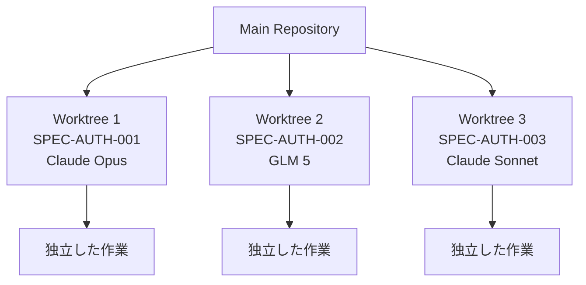
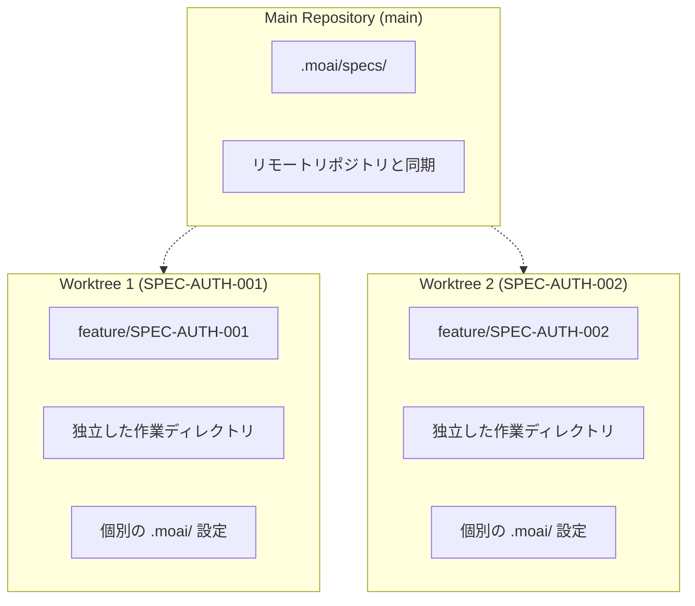
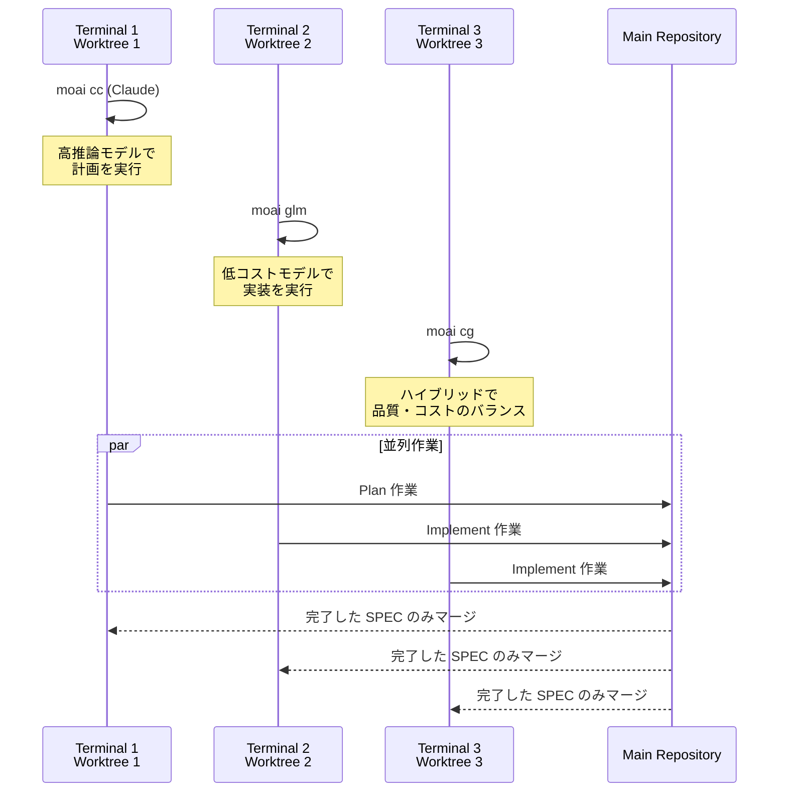
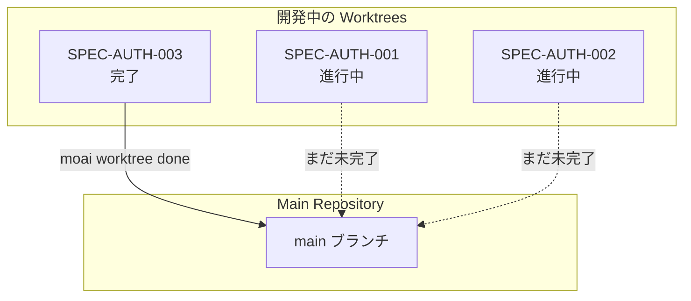

Git Worktree は MoAI-ADK 並列開発の基盤です。SPEC ごとに完全に独立した作業
空間を作り、異なる Git 状態と異なる LLM 設定を同時に走らせられるように
します。

MoAI-ADK v3.0 の中核的な価値である **トークノミクス** (Token Economics) の観点から見ると、
Worktree は「計画は深く、実装は安く」を実際に実行する装置です。計画
ターミナルでは高推論の Claude モデルを使い、実装ターミナルでは低コストの GLM を使う
というように — 作業フェーズごとに適切なモデルを割り当てることは、Worktree の分離なしには
不可能だからです。

## なぜ Worktree が必要なのか?

### 問題: LLM 設定がセッション間で共有される

Worktree なしで `moai glm` や `moai cc` で LLM バックエンドを変更すると、同じプロジェクトの
**開いているすべてのセッションに同一の設定が適用** されます。その結果:

- **SPEC 間の干渉** — ある SPEC で変更した LLM 設定が別の SPEC の作業に影響します
- **並列開発が不可能** — 複数の SPEC を同時に異なる条件で進められません
- **トークンの浪費** — 単純な実装タスクまですべて高コストモデルで回ります

### 解決: 完全な分離

Git Worktree を使うと、各 SPEC が **独立した Git 状態と LLM 設定** を持ちます:


```mermaid
graph TB
    A[Main Repository] --> B[Worktree 1<br/>SPEC-AUTH-001<br/>Claude Opus]
    A --> C[Worktree 2<br/>SPEC-AUTH-002<br/>GLM 5]
    A --> D[Worktree 3<br/>SPEC-AUTH-003<br/>Claude Sonnet]

    B --> E[独立した作業]
    C --> F[独立した作業]
    D --> G[独立した作業]
```

## コアワークフロー

### 3 フェーズの開発プロセス

Worktree を活用した MoAI-ADK 開発は 3 つのフェーズで流れます:

```mermaid
flowchart TD
    subgraph Phase1["Phase 1: Plan (Terminal 1)"]
        A1[/moai plan<br/>feature description<br/>--worktree/] --> A2[SPEC ドキュメント生成]
        A2 --> A3[Worktree 自動作成]
        A3 --> A4[Feature ブランチ作成]
    end

    subgraph Phase2["Phase 2: Implement (Terminals 2, 3, 4...)"]
        B1[moai worktree go SPEC-ID] --> B2[Worktree に入る]
        B2 --> B3[moai glm<br/>LLM 変更]
        B3 --> B4[/moai run SPEC-ID]
        B4 --> B5[/moai sync SPEC-ID]
    end

    subgraph Phase3["Phase 3: Merge & Cleanup"]
        C1[moai worktree done SPEC-ID] --> C2[main チェックアウト]
        C2 --> C3[マージ]
        C3 --> C4[クリーンアップ]
    end

    Phase1 --> Phase2
    Phase2 --> Phase3
```

### フェーズごとの詳細説明

#### フェーズ 1: Plan (Terminal 1)

計画フェーズは推論品質が結果を左右するため、Claude (Opus 級) モデルで SPEC ドキュメントを
作成します:

```bash
> /moai plan "認証システムの追加" --worktree
```

**作業内容**:

- EARS 形式の SPEC ドキュメントの自動生成
- 当該 SPEC 専用の Worktree の自動作成
- Feature ブランチの自動作成と切り替え

**成果物**:

- `.moai/specs/SPEC-AUTH-001/spec.md`
- 新しい Worktree ディレクトリ
- `feature/SPEC-AUTH-001` ブランチ

#### フェーズ 2: Implement (Terminals 2, 3, 4...)

実装フェーズは物量が多い代わりに SPEC がすでに方向を定めているため、GLM のようなコスト
効率の良いモデルが役目を果たします:

```bash
# Worktree に入る (新しいターミナル)
$ moai worktree go SPEC-AUTH-001

# LLM 変更
$ moai glm

# 開発開始
$ claude
> /moai run SPEC-AUTH-001
> /moai sync SPEC-AUTH-001
```

**利点**:

- 完全に分離された作業環境
- GLM のコスト効率 (Opus 比で約 70% 削減)
- 衝突のない無制限の並列開発

#### フェーズ 3: Merge & Cleanup

```bash
moai worktree done SPEC-AUTH-001              # main → マージ → クリーンアップ
moai worktree done SPEC-AUTH-001 --push       # 上記の作業 + リモートリポジトリへ push
```

## Worktree コマンドリファレンス

| コマンド                   | 説明                       | 使用例                      |
| ------------------------ | -------------------------- | ------------------------------ |
| `moai worktree new SPEC-ID`    | 新しい Worktree の作成           | `moai worktree new SPEC-AUTH-001`    |
| `moai worktree go SPEC-ID`     | Worktree に入る (新しいシェルを開く) | `moai worktree go SPEC-AUTH-001`     |
| `moai worktree list`           | Worktree 一覧の表示         | `moai worktree list`                 |
| `moai worktree done SPEC-ID`   | マージとクリーンアップ               | `moai worktree done SPEC-AUTH-001`   |
| `moai worktree remove SPEC-ID` | Worktree の削除              | `moai worktree remove SPEC-AUTH-001` |
| `moai worktree status`         | Worktree の状態確認         | `moai worktree status`               |
| `moai worktree clean`          | マージ済み Worktree の整理       | `moai worktree clean --merged-only`  |
| `moai worktree config`         | Worktree 設定の確認         | `moai worktree config root`          |

## Worktree の主な利点

### 1. 完全な分離 (Complete Isolation)

各 SPEC は独立した Git 状態を維持します:


```mermaid
graph TB
    subgraph Main["Main Repository (main)"]
        M1[.moai/specs/]
        M2[リモートリポジトリと同期]
    end

    subgraph WT1["Worktree 1 (SPEC-AUTH-001)"]
        W1A[feature/SPEC-AUTH-001]
        W1B[独立した作業ディレクトリ]
        W1C[個別の .moai/ 設定]
    end

    subgraph WT2["Worktree 2 (SPEC-AUTH-002)"]
        W2A[feature/SPEC-AUTH-002]
        W2B[独立した作業ディレクトリ]
        W2C[個別の .moai/ 設定]
    end

    Main -.-> WT1
    Main -.-> WT2
```

**利点**:

- 各 Worktree で独立してコミット可能
- ブランチ間の衝突なしに作業
- 完了した SPEC のみ main にマージ

### 2. LLM 独立性 (LLM Independence)

各 Worktree は個別の LLM 実行モードを維持します。以下のように 3 つのターミナルがそれぞれ
`moai cc` (Claude 専用)、`moai glm` (GLM 専用)、`moai cg` (Claude リーダー + GLM ワーカーの
ハイブリッド) で異なって動作しても、互いに干渉しません:


```mermaid
sequenceDiagram
    participant T1 as Terminal 1<br/>Worktree 1
    participant T2 as Terminal 2<br/>Worktree 2
    participant T3 as Terminal 3<br/>Worktree 3
    participant Main as Main Repository

    T1->>T1: moai cc (Claude)
    Note over T1: 高推論モデルで<br/>計画を実行

    T2->>T2: moai glm
    Note over T2: 低コストモデルで<br/>実装を実行

    T3->>T3: moai cg
    Note over T3: ハイブリッドで<br/>品質・コストのバランス

    par 並列作業
        T1->>Main: Plan 作業
        T2->>Main: Implement 作業
        T3->>Main: Implement 作業
    end

    Main-->>T1: 完了した SPEC のみマージ
    Main-->>T2: 完了した SPEC のみマージ
    Main-->>T3: 完了した SPEC のみマージ
```

### 3. 無制限の並列開発 (Unlimited Parallel)

同時に複数の SPEC を進められます:

```bash
# Terminal 1: SPEC-AUTH-001 の計画
> /moai plan "認証システム" --worktree

# Terminal 2: SPEC-AUTH-002 の実装 (GLM)
$ moai worktree go SPEC-AUTH-002
$ moai glm
> /moai run SPEC-AUTH-002

# Terminal 3: SPEC-AUTH-003 の実装 (GLM)
$ moai worktree go SPEC-AUTH-003
$ moai glm
> /moai run SPEC-AUTH-003

# Terminal 4: SPEC-AUTH-004 のドキュメント化
$ moai worktree go SPEC-AUTH-004
> /moai sync SPEC-AUTH-004
```

### 4. 安全なマージ (Safe Merge)

完了した SPEC のみ main ブランチにマージされます:


```mermaid
flowchart TB
    subgraph Development["開発中の Worktrees"]
        D1[SPEC-AUTH-001<br/>進行中]
        D2[SPEC-AUTH-002<br/>進行中]
        D3[SPEC-AUTH-003<br/>完了]
    end

    subgraph Main["Main Repository"]
        M[main ブランチ]
    end

    D3 -->|moai worktree done| M
    D1 -.->|まだ未完了| M
    D2 -.->|まだ未完了| M
```

## 並列開発の可視化

複数のターミナルで同時に作業する様子です。フェーズごとにモデルが異なって割り当てられる
ことがトークノミクスの核心です:

```mermaid
graph TB
    subgraph Terminal1["Terminal 1: Planning"]
        T1A[/moai plan<br/>--worktree/]
        T1B[Claude Opus<br/>高コスト/高品質]
        T1C[SPEC ドキュメント生成]
    end

    subgraph Terminal2["Terminal 2: Implementing"]
        T2A[moai worktree go<br/>SPEC-AUTH-001]
        T2B[moai glm<br/>低コスト]
        T2C[/moai run<br/>DDD 実装]
    end

    subgraph Terminal3["Terminal 3: Implementing"]
        T3A[moai worktree go<br/>SPEC-AUTH-002]
        T3B[moai glm<br/>低コスト]
        T3C[/moai run<br/>DDD 実装]
    end

    subgraph Terminal4["Terminal 4: Documenting"]
        T4A[moai worktree go<br/>SPEC-AUTH-003]
        T4B[moai cc<br/>Claude]
        T4C[/moai sync<br/>ドキュメント化]
    end

    T1C --> T2A
    T1C --> T3A
    T1C --> T4A
```

## 次のステップ

- **[完全ガイド](/ja/worktree/guide)** — すべての Worktree コマンドと詳細な使い方
- **[実際の使用例](/ja/worktree/examples)** — 実際のプロジェクトでの使用事例
- **[よくある質問](/ja/worktree/faq)** — FAQ とトラブルシューティング

## 関連ドキュメント

- [MoAI-ADK ドキュメント](https://adk.mo.ai.kr)
- [SPEC システム](/ja/core-concepts/spec-based-dev/)
- [DDD ワークフロー](/ja/core-concepts/ddd/)
