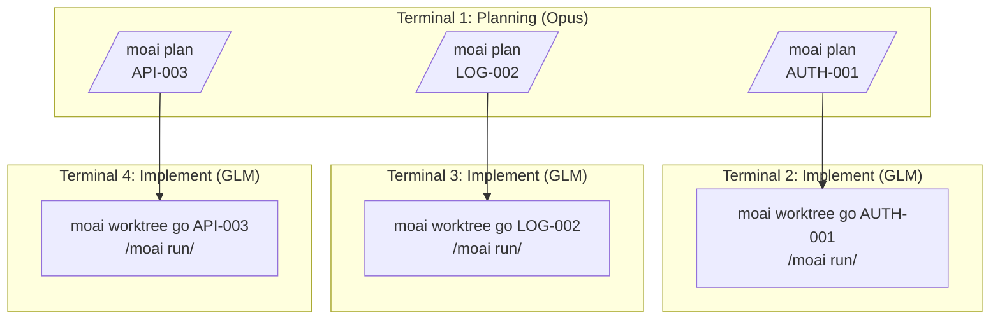
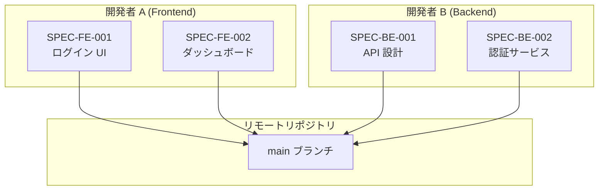
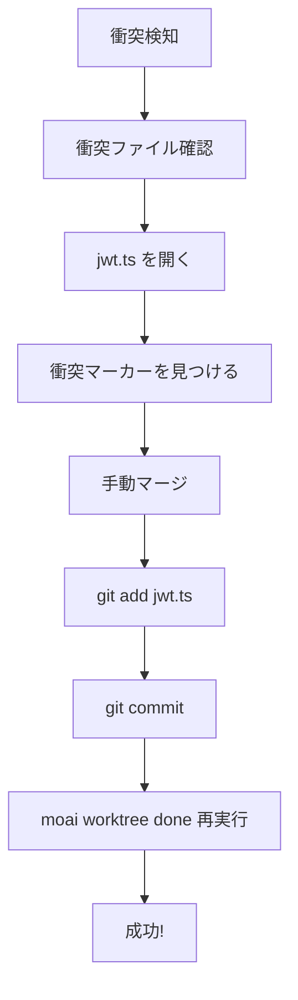
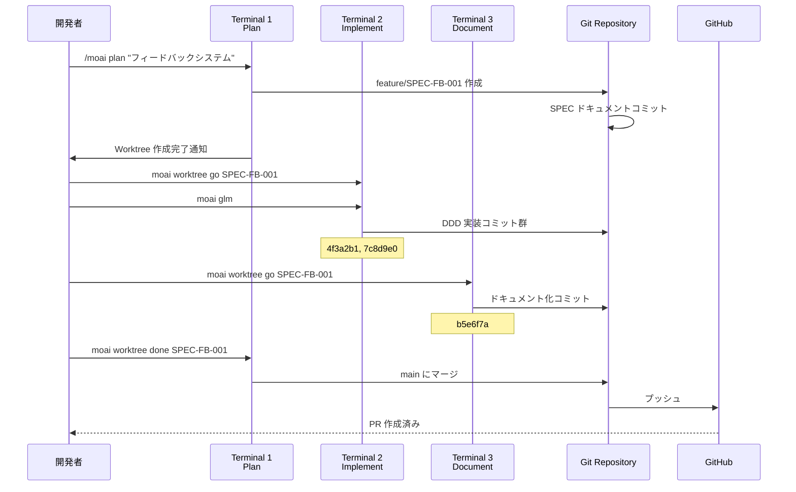

# Git Worktree 実使用例

実際のプロジェクトで Git Worktree を活用する具体的な例を通じて、実務適用方法を学びましょう。

## 目次

1. [単一 SPEC 開発](#単一-spec-開発)
2. [並列 SPEC 開発](#並列-spec-開発)
3. [チーム協働シナリオ](#チーム協働シナリオ)
4. [問題解決事例](#問題解決事例)

---

## 単一 SPEC 開発

### シナリオ: ユーザー認証システム実装

#### ステップ 1: SPEC 計画 (Terminal 1)

```bash
# プロジェクトルートで
$ cd /Users/goos/MoAI/moai-project

# SPEC 計画作成
> /moai plan "JWT ベースユーザー認証システム実装" --worktree

# 出力
✓ MoAI-ADK SPEC Manager v2.0
━━━━━━━━━━━━━━━━━━━━━━━━━━━━━━━━━━━━━━━━━━

SPEC 分析中...
  - 機能要件: 8 個発見
  - 技術要件: 5 個発見
  - API エンドポイント: 6 個識別

SPEC ドキュメント作成中...
  ✓ .moai/specs/SPEC-AUTH-001/spec.md
  ✓ .moai/specs/SPEC-AUTH-001/requirements.md
  ✓ .moai/specs/SPEC-AUTH-001/api-design.md

Worktree 作成中...
  ✓ ブランチ作成: feature/SPEC-AUTH-001
  ✓ Worktree 作成: /Users/goos/MoAI/moai-project/.moai/worktrees/SPEC-AUTH-001
  ✓ ブランチ切り替え完了

━━━━━━━━━━━━━━━━━━━━━━━━━━━━━━━━━━━━━━━━━━
次のステップ:
  1. 新しいターミナルで実行: moai worktree go SPEC-AUTH-001
  2. LLM 変更: moai glm
  3. Claude 起動: claude
  4. 開発開始: /moai run SPEC-AUTH-001

コスト削減ヒント: 実装フェーズでは 'moai glm' で 70% コスト削減!
━━━━━━━━━━━━━━━━━━━━━━━━━━━━━━━━━━━━━━━━━━
```

#### ステップ 2: Worktree 入り及び実装 (Terminal 2)

```bash
# 新しいターミナルを開く
$ moai worktree go SPEC-AUTH-001

# 新しいターミナルが開き Worktree に移動
# プロンプトが変更される
(SPEC-AUTH-001) ~/moai-project/.moai/worktrees/SPEC-AUTH-001

# LLM を低コストモデルに変更
(SPEC-AUTH-001) $ moai glm
✓ LLM 変更: GLM 5 (70% コスト削減)

# Claude Code 起動
(SPEC-AUTH-001) $ claude
Claude Code v1.0.0
Type 'help' for available commands

# DDD 実装開始
> /moai run SPEC-AUTH-001

# 出力
✓ MoAI-ADK DDD Executor v2.0
━━━━━━━━━━━━━━━━━━━━━━━━━━━━━━━━━━━━━━━━━━

Phase 1: ANALYZE
  ✓ 要件分析完了
  ✓ 既存コード分析完了
  ✓ テストカバレッジ: 85% 目標

Phase 2: PRESERVE
  ✓ キャラクタライズテスト 12 個作成
  ✓ 既存動作保存確認

Phase 3: IMPROVE
  ✓ JWT 認証ミドルウェア実装
  ✓ リフレッシュトークンローテーション実装
  ✓ ログアウトトークン無効化実装

━━━━━━━━━━━━━━━━━━━━━━━━━━━━━━━━━━━━━━━━━━
実装完了!
  - コミット: 4f3a2b1 (feat: JWT authentication middleware)
  - コミット: 7c8d9e0 (feat: refresh token rotation)
  - コミット: 2a1b3c4 (feat: token invalidation on logout)

次のステップ:
  1. テスト実行: pytest tests/auth/
  2. ドキュメント化: /moai sync SPEC-AUTH-001
  3. 完了: moai worktree done SPEC-AUTH-001
━━━━━━━━━━━━━━━━━━━━━━━━━━━━━━━━━━━━━━━━━━
```

#### ステップ 3: ドキュメント化 (同じ Terminal 2)

```bash
# ドキュメント化実行
> /moai sync SPEC-AUTH-001

# 出力
✓ MoAI-ADK Documentation Generator v2.0
━━━━━━━━━━━━━━━━━━━━━━━━━━━━━━━━━━━━━━━━━━

ドキュメント作成中...
  ✓ API ドキュメント: docs/api/auth.md
  ✓ アーキテクチャ図: docs/diagrams/auth-flow.mmd
  ✓ ユーザーガイド: docs/guides/authentication.md

コミット完了:
  ✓ b5e6f7a (docs: authentication documentation)

━━━━━━━━━━━━━━━━━━━━━━━━━━━━━━━━━━━━━━━━━━
ドキュメント化完了!
次のステップ: moai worktree done SPEC-AUTH-001 --push
━━━━━━━━━━━━━━━━━━━━━━━━━━━━━━━━━━━━━━━━━━
```

#### ステップ 4: 完了及びマージ (Terminal 1)

```bash
# プロジェクトルートに戻って
$ cd /Users/goos/MoAI/moai-project

# Worktree 完了
$ moai worktree done SPEC-AUTH-001 --push

# 出力
✓ MoAI-ADK Worktree Manager v2.0
━━━━━━━━━━━━━━━━━━━━━━━━━━━━━━━━━━━━━━━━━━

Worktree 完了中: SPEC-AUTH-001

1. main ブランチに切り替え...
   ✓ Switched to branch 'main'

2. feature ブランチマージ...
   ✓ Merge 'feature/SPEC-AUTH-001' into main

3. リモートリポジトリにプッシュ...
   ✓ github.com:username/repo.git
   ✓ Branch 'main' set up to track remote branch 'main'

4. Worktree クリ...
   ✓ Worktree 削除: .moai/worktrees/SPEC-AUTH-001
   ✓ ブランチ削除: feature/SPEC-AUTH-001

━━━━━━━━━━━━━━━━━━━━━━━━━━━━━━━━━━━━━━━━━━
✓ SPEC-AUTH-001 完了!

総コミット: 4 個
  - 2e9b4c3 docs: authentication documentation
  - 7c8d9e0 feat: refresh token rotation
  - 4f3a2b1 feat: JWT authentication middleware
  - b5e6f7a feat: token invalidation on logout

━━━━━━━━━━━━━━━━━━━━━━━━━━━━━━━━━━━━━━━━━━
```

---

## 並列 SPEC 開発

### シナリオ: 3 つの SPEC 同時開発



#### Terminal 1: 計画 (すべての SPEC)

```bash
# SPEC 1: 認証
> /moai plan "JWT 認証システム" --worktree
✓ SPEC-AUTH-001 作成完了

# SPEC 2: ログ
> /moai plan "構造化されたログシステム" --worktree
✓ SPEC-LOG-002 作成完了

# SPEC 3: API
> /moai plan "REST API v2" --worktree
✓ SPEC-API-003 作成完了

# Worktree 確認
moai worktree list
SPEC-AUTH-001  feature/SPEC-AUTH-001  /path/to/SPEC-AUTH-001
SPEC-LOG-002   feature/SPEC-LOG-002   /path/to/SPEC-LOG-002
SPEC-API-003   feature/SPEC-API-003   /path/to/SPEC-API-003
```

#### Terminal 2: AUTH-001 実装

```bash
$ moai worktree go SPEC-AUTH-001
(SPEC-AUTH-001) $ moai glm
(SPEC-AUTH-001) $ claude
> /moai run SPEC-AUTH-001
# ... 実装進行中 ...
```

#### Terminal 3: LOG-002 実装

```bash
$ moai worktree go SPEC-LOG-002
(SPEC-LOG-002) $ moai glm
(SPEC-LOG-002) $ claude
> /moai run SPEC-LOG-002
# ... 実装進行中 ...
```

#### Terminal 4: API-003 実装

```bash
$ moai worktree go SPEC-API-003
(SPEC-API-003) $ moai glm
(SPEC-API-003) $ claude
> /moai run SPEC-API-003
# ... 実装進行中 ...
```

#### 並列進行状況モニタリング

```bash
# Terminal 1 ですべての Worktree 状態確認
$ moai worktree status --verbose

Worktree: SPEC-AUTH-001
Branch: feature/SPEC-AUTH-001
Status: 3 commits ahead of main
LLM: GLM 5
Last activity: 5 minutes ago

Worktree: SPEC-LOG-002
Branch: feature/SPEC-LOG-002
Status: 2 commits ahead of main
LLM: GLM 5
Last activity: 3 minutes ago

Worktree: SPEC-API-003
Branch: feature/SPEC-API-003
Status: 4 commits ahead of main
LLM: GLM 5
Last activity: 7 minutes ago
```

---

## チーム協働シナリオ

### シナリオ: 2 名の開発者協働



#### 開発者 A: Frontend 開発

```bash
# 開発者 A のマシンで
git clone https://github.com/team/project.git
cd project

# Frontend SPEC 作成
> /moai plan "ログイン UI コンポーネント" --worktree
✓ SPEC-FE-001 作成

# Worktree で開発
moai worktree go SPEC-FE-001
(SPEC-FE-001) $ moai glm
(SPEC-FE-001) $ claude
> /moai run SPEC-FE-001

# 実装完了後 リモートにプッシュ
(SPEC-FE-001) $ exit
moai worktree done SPEC-FE-001 --push
✓ 完了及び PR 作成済み
```

#### 開発者 B: Backend 開発

```bash
# 開発者 B のマシンで
git clone https://github.com/team/project.git
cd project

# Backend SPEC 作成
> /moai plan "認証 API サービス" --worktree
✓ SPEC-BE-001 作成

# Worktree で開発
moai worktree go SPEC-BE-001
(SPEC-BE-001) $ moai glm
(SPEC-BE-001) $ claude
> /moai run SPEC-BE-001

# 実装完了後 リモートにプッシュ
(SPEC-BE-001) $ exit
moai worktree done SPEC-BE-001 --push
✓ 完了及び PR 作成済み
```

#### PR マージ及び統合

```bash
# チームリードまたは CI システムで
gh pr list
# FE-001  Login UI Component          Ready
# BE-001  Authentication API Service  Ready

# PR マージ
gh pr merge FE-001 --merge
gh pr merge BE-001 --merge

# すべての開発者が最新状態を維持
git pull origin main
```

---

## 問題解決事例

### 事例 1: マージ衝突解決

```bash
$ moai worktree done SPEC-AUTH-001 --push

# 出力
✗ マージ衝突が発生!
衝突ファイル:
  - src/auth/jwt.ts
  - tests/auth.test.ts

解決ステップ:
1. 衝突ファイルを編集して解決
2. git add <ファイル>
3. git commit
4. moai worktree done SPEC-AUTH-001 --push 再実行
```

**解決プロセス**:



```bash
# 衝突解決
cd .moai/worktrees/SPEC-AUTH-001
code src/auth/jwt.ts

# 衝突マーカー確認
<<<<<<< HEAD
const secret = process.env.JWT_SECRET;
=======
const secret = config.jwt.secret;
>>>>>>> feature/SPEC-AUTH-001

# 手動でマージ
const secret = process.env.JWT_SECRET || config.jwt.secret;

# staging 後コミット
git add src/auth/jwt.ts
git commit -m "fix: resolve merge conflict in JWT config"

# 完了再試行
cd /Users/goos/MoAI/moai-project
moai worktree done SPEC-AUTH-001 --push
✓ 完了!
```

### 事例 2: Worktree 破損復旧

```bash
$ moai worktree go SPEC-AUTH-001
✗ Worktree が破損しています。

# 診断
$ moai worktree status SPEC-AUTH-001
✗ Worktree ディレクトリが存在しません

# 復旧
$ moai worktree remove SPEC-AUTH-001 --force
✓ 既存 Worktree 削除

$ moai worktree new SPEC-AUTH-001
✓ Worktree 再作成完了
```

### 事例 3: ディスク容量不足

```bash
$ df -h
Filesystem      Size  Used Avail Use%
/dev/disk1     500G  480G   20G  96%

# 古い Worktree 掃除
$ moai worktree clean --older-than 14

# 掃除される Worktree:
  - SPEC-OLD-001 (30日前)
  - SPEC-OLD-002 (45日前)
  - SPEC-OLD-003 (60日前)

継続しますか? [y/N] y

✓ 3 つの Worktree 掃除完了
✓ 12GB ディスク容量確保
```

---

## 実際のプロジェクトワークフロー

### 完全な開発サイクル例



---

## 成功事例

### 事例: スタートアップでの適用

```bash
# 状況: 3 つの機能を同時に開発が必要
# 時間: 1 週間
# 開発者: 2 名

# 1 日目: すべての SPEC 計画
> /moai plan "ユーザー管理" --worktree
> /moai plan "決済システム" --worktree
> /moai plan "通知システム" --worktree

# 2-4 日目: 並列実装
# Terminal 1: ユーザー管理
$ moai worktree go SPEC-USER-001 && moai glm
# Terminal 2: 決済システム
$ moai worktree go SPEC-PAY-001 && moai glm
# Terminal 3: 通知システム
$ moai worktree go SPEC-NOTIF-001 && moai glm

# 5-6 日目: ドキュメント化及びテスト
# 各 Worktree で /moai sync 実行

# 7 日目: マージ
$ moai worktree done SPEC-USER-001 --push
$ moai worktree done SPEC-PAY-001 --push
$ moai worktree done SPEC-NOTIF-001 --push

# 結果
# - 3 つの機能すべて完了
# - 並列開発で時間短縮 66%
# - GLM 使用でコスト削減 70%
```

---

## ヒントとコツ

### ヒント 1: ターミナル管理

```bash
# tmux を使用してセッション管理
tmux new-session -d -s spec-user 'moai worktree go SPEC-USER-001'
tmux new-session -d -s spec-pay 'moai worktree go SPEC-PAY-001'

# セッション一覧
tmux ls
spec-user: 1 windows
spec-pay: 1 windows

# セッション切り替え
tmux attach-session -t spec-user
```

### ヒント 2: 進行状況追跡

```bash
# すべての Worktree 進行状況
for spec in $(moai worktree list --porcelain | awk '{print $1}'); do
    echo "=== $spec ==="
    cd ~/.moai/worktrees/$spec
    git log --oneline -5
    echo ""
done
```

### ヒント 3: 自動化スクリプト

```bash
#!/bin/bash
# auto-workflow.sh

SPEC_ID=$1

echo "1. SPEC 計画作成..."
> /moai plan "$2" --worktree

echo "2. Worktree 進入..."
moai worktree go $SPEC_ID

echo "3. LLM 変更..."
moai glm

echo "4. Claude 起動..."
claude

# 使用法
# ./auto-workflow.sh SPEC-AUTH-001 "認証システム"
```

## 関連ドキュメント

- [Git Worktree 概要](./index)
- [完全ガイド](./guide)
- [よくある質問](./faq)
