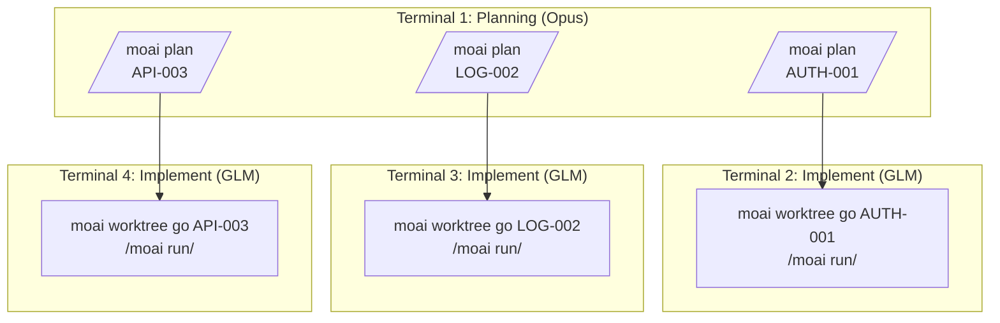
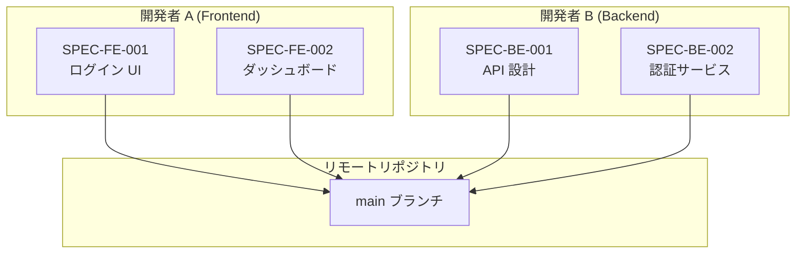
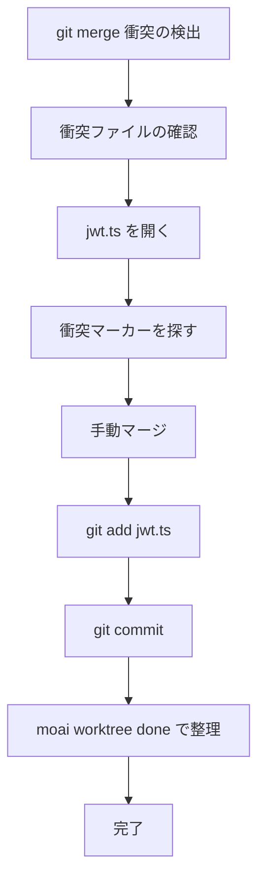
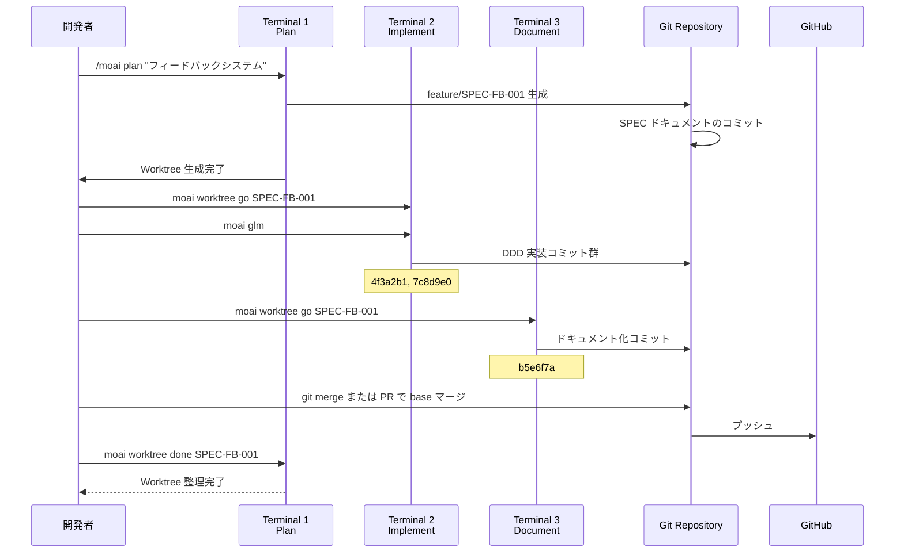

実際のプロジェクトで Git Worktree をどう回すか、単一 SPEC 開発から並列
開発・チーム協業・問題解決まで具体的なシナリオで見ていきます。各シナリオには
「どのステップにどのモデルを使うか」というトークノミクスの判断が一緒に含まれています。

## 目次

1. [単一 SPEC 開発](#単一-spec-開発)
2. [並列 SPEC 開発](#並列-spec-開発)
3. [チーム協業シナリオ](#チーム協業シナリオ)
4. [問題解決の事例](#問題解決の事例)

---

## 単一 SPEC 開発

### シナリオ: ユーザー認証システムの実装

#### ステップ 1: SPEC 計画 (Terminal 1)

```bash
# プロジェクトルートで
$ cd /path/to/your-project

# SPEC 計画の生成
> /moai plan "JWT ベースのユーザー認証システムの実装" --worktree

# 出力
✓ MoAI-ADK SPEC Manager v2.0
━━━━━━━━━━━━━━━━━━━━━━━━━━━━━━━━━━━━━━━━━━

SPEC 分析中...
  - 機能要件: 8 個発見
  - 技術要件: 5 個発見
  - API エンドポイント: 6 個識別

SPEC ドキュメント生成中...
  ✓ .moai/specs/SPEC-AUTH-001/spec.md
  ✓ .moai/specs/SPEC-AUTH-001/requirements.md
  ✓ .moai/specs/SPEC-AUTH-001/api-design.md

Worktree 生成中...
  ✓ ブランチ生成: feature/SPEC-AUTH-001
  ✓ Worktree 生成: /path/to/your-project/.moai/worktrees/SPEC-AUTH-001
  ✓ ブランチ切替完了

━━━━━━━━━━━━━━━━━━━━━━━━━━━━━━━━━━━━━━━━━━
次のステップ:
  1. 新しいターミナルで実行: moai worktree go SPEC-AUTH-001
  2. LLM 変更: moai glm
  3. Claude 開始: claude
  4. 開発開始: /moai run SPEC-AUTH-001

コスト削減のヒント: 実装ステップでは 'moai glm' で 70% のコスト削減!
━━━━━━━━━━━━━━━━━━━━━━━━━━━━━━━━━━━━━━━━━━
```

#### ステップ 2: Worktree 進入および実装 (Terminal 2)

計画が終わったので実装は低コストモデルに切り替えます:

```bash
# 新しいターミナルを開く
$ moai worktree go SPEC-AUTH-001

# 新しいターミナルが開き Worktree へ移動
# プロンプトが変わる
(SPEC-AUTH-001) ~/moai-project/.moai/worktrees/SPEC-AUTH-001

# LLM を低コストモデルに変更
(SPEC-AUTH-001) $ moai glm
✓ LLM 変更: GLM 5 (70% のコスト削減)

# Claude Code 開始
(SPEC-AUTH-001) $ claude
Claude Code v1.0.0
Type 'help' for available commands

# DDD 実装開始
> /moai run SPEC-AUTH-001

# 出力
✓ MoAI-ADK DDD Executor v2.0
━━━━━━━━━━━━━━━━━━━━━━━━━━━━━━━━━━━━━━━━━━

Phase 1: ANALYZE
  ✓ 要件分析完了
  ✓ 既存コード分析完了
  ✓ テストカバレッジ: 85% 目標

Phase 2: PRESERVE
  ✓ 特性化テスト 12 個を生成
  ✓ 既存の動作の保存を確認

Phase 3: IMPROVE
  ✓ JWT 認証ミドルウェアを実装
  ✓ リフレッシュトークンローテーションを実装
  ✓ ログアウト時のトークン無効化を実装

━━━━━━━━━━━━━━━━━━━━━━━━━━━━━━━━━━━━━━━━━━
実装完了!
  - コミット: 4f3a2b1 (feat: JWT authentication middleware)
  - コミット: 7c8d9e0 (feat: refresh token rotation)
  - コミット: 2a1b3c4 (feat: token invalidation on logout)

次のステップ:
  1. テスト実行: pytest tests/auth/
  2. ドキュメント化: /moai sync SPEC-AUTH-001
  3. 完了: moai worktree done SPEC-AUTH-001
━━━━━━━━━━━━━━━━━━━━━━━━━━━━━━━━━━━━━━━━━━
```

#### ステップ 3: ドキュメント化 (同じ Terminal 2)

```bash
# ドキュメント化を実行
> /moai sync SPEC-AUTH-001

# 出力
✓ MoAI-ADK Documentation Generator v2.0
━━━━━━━━━━━━━━━━━━━━━━━━━━━━━━━━━━━━━━━━━━

ドキュメント生成中...
  ✓ API ドキュメント: docs/api/auth.md
  ✓ アーキテクチャダイアグラム: docs/diagrams/auth-flow.mmd
  ✓ ユーザーガイド: docs/guides/authentication.md

コミット完了:
  ✓ b5e6f7a (docs: authentication documentation)

━━━━━━━━━━━━━━━━━━━━━━━━━━━━━━━━━━━━━━━━━━
ドキュメント化完了!
次のステップ: base マージ (git merge/PR) 後 moai worktree done SPEC-AUTH-001
━━━━━━━━━━━━━━━━━━━━━━━━━━━━━━━━━━━━━━━━━━
```

#### ステップ 4: base マージと整理 (Terminal 1)

`moai worktree done` はマージ・プッシュをしません。base ブランチへのマージは
`git merge` や PR で先に処理した後、Worktree だけを整理します。

```bash
# プロジェクトルートに戻って
$ cd /path/to/your-project

# base ブランチへマージ (git または PR)
$ git checkout main
$ git merge feature/SPEC-AUTH-001
$ git push origin main

# Worktree 整理 + ブランチ削除
$ moai worktree done SPEC-AUTH-001 --delete-branch

# 出力
✓ Done: worktree for branch feature/SPEC-AUTH-001
━━━━━━━━━━━━━━━━━━━━━━━━━━━━━━━━━━━━━━━━━━
  Path: .moai/worktrees/SPEC-AUTH-001
  Worktree removed.
  Branch feature/SPEC-AUTH-001 deleted.
━━━━━━━━━━━━━━━━━━━━━━━━━━━━━━━━━━━━━━━━━━
```

---

## 並列 SPEC 開発

### シナリオ: 3 個の SPEC を同時開発

計画は 1 つのターミナルで高推論モデル (Opus) にまとめて処理し、実装は GLM に
変えて 3 つのターミナルに分散します:


```mermaid
graph TB
    subgraph T1["Terminal 1: Planning (Opus)"]
        P1[/moai plan<br/>AUTH-001/]
        P2[/moai plan<br/>LOG-002/]
        P3[/moai plan<br/>API-003/]
    end

    subgraph T2["Terminal 2: Implement (GLM)"]
        I1[moai worktree go AUTH-001<br/>/moai run/]
    end

    subgraph T3["Terminal 3: Implement (GLM)"]
        I2[moai worktree go LOG-002<br/>/moai run/]
    end

    subgraph T4["Terminal 4: Implement (GLM)"]
        I3[moai worktree go API-003<br/>/moai run/]
    end

    P1 --> I1
    P2 --> I2
    P3 --> I3
```

#### Terminal 1: 計画 (すべての SPEC)

```bash
# SPEC 1: 認証
> /moai plan "JWT 認証システム" --worktree
✓ SPEC-AUTH-001 生成完了

# SPEC 2: ロギング
> /moai plan "構造化されたロギングシステム" --worktree
✓ SPEC-LOG-002 生成完了

# SPEC 3: API
> /moai plan "REST API v2" --worktree
✓ SPEC-API-003 生成完了

# Worktree 確認
moai worktree list
SPEC-AUTH-001  feature/SPEC-AUTH-001  /path/to/SPEC-AUTH-001
SPEC-LOG-002   feature/SPEC-LOG-002   /path/to/SPEC-LOG-002
SPEC-API-003   feature/SPEC-API-003   /path/to/SPEC-API-003
```

#### Terminal 2: AUTH-001 実装

```bash
$ moai worktree go SPEC-AUTH-001
(SPEC-AUTH-001) $ moai glm
(SPEC-AUTH-001) $ claude
> /moai run SPEC-AUTH-001
# ... 実装進行中 ...
```

#### Terminal 3: LOG-002 実装

```bash
$ moai worktree go SPEC-LOG-002
(SPEC-LOG-002) $ moai glm
(SPEC-LOG-002) $ claude
> /moai run SPEC-LOG-002
# ... 実装進行中 ...
```

#### Terminal 4: API-003 実装

```bash
$ moai worktree go SPEC-API-003
(SPEC-API-003) $ moai glm
(SPEC-API-003) $ claude
> /moai run SPEC-API-003
# ... 実装進行中 ...
```

#### 並列進行状況のモニタリング

```bash
# Terminal 1 ですべての Worktree の状態を確認
$ moai worktree status --all

Worktree: SPEC-AUTH-001
Branch: feature/SPEC-AUTH-001
Status: 3 commits ahead of main
LLM: GLM 5
Last activity: 5 minutes ago

Worktree: SPEC-LOG-002
Branch: feature/SPEC-LOG-002
Status: 2 commits ahead of main
LLM: GLM 5
Last activity: 3 minutes ago

Worktree: SPEC-API-003
Branch: feature/SPEC-API-003
Status: 4 commits ahead of main
LLM: GLM 5
Last activity: 7 minutes ago
```

---

## チーム協業シナリオ

### シナリオ: 2 名の開発者の協業


```mermaid
graph TB
    subgraph Dev1["開発者 A (Frontend)"]
        F1[SPEC-FE-001<br/>ログイン UI]
        F2[SPEC-FE-002<br/>ダッシュボード]
    end

    subgraph Dev2["開発者 B (Backend)"]
        B1[SPEC-BE-001<br/>API 設計]
        B2[SPEC-BE-002<br/>認証サービス]
    end

    subgraph Remote["リモートリポジトリ"]
        R[main ブランチ]
    end

    F1 --> R
    F2 --> R
    B1 --> R
    B2 --> R
```

#### 開発者 A: Frontend 開発

```bash
# 開発者 A のマシンで
git clone https://github.com/team/project.git
cd project

# Frontend SPEC 生成
> /moai plan "ログイン UI コンポーネント" --worktree
✓ SPEC-FE-001 生成

# Worktree で開発
moai worktree go SPEC-FE-001
(SPEC-FE-001) $ moai glm
(SPEC-FE-001) $ claude
> /moai run SPEC-FE-001

# 実装完了後にブランチ push + PR 生成 (git/gh)
(SPEC-FE-001) $ exit
git push -u origin feature/SPEC-FE-001
gh pr create --fill
# PR マージ後に Worktree 整理
moai worktree done SPEC-FE-001 --delete-branch
```

#### 開発者 B: Backend 開発

```bash
# 開発者 B のマシンで
git clone https://github.com/team/project.git
cd project

# Backend SPEC 生成
> /moai plan "認証 API サービス" --worktree
✓ SPEC-BE-001 生成

# Worktree で開発
moai worktree go SPEC-BE-001
(SPEC-BE-001) $ moai glm
(SPEC-BE-001) $ claude
> /moai run SPEC-BE-001

# 実装完了後にブランチ push + PR 生成 (git/gh)
(SPEC-BE-001) $ exit
git push -u origin feature/SPEC-BE-001
gh pr create --fill
# PR マージ後に Worktree 整理
moai worktree done SPEC-BE-001 --delete-branch
```

#### PR マージおよび統合

```bash
# チームリードまたは CI システムで
gh pr list
# FE-001  Login UI Component          Ready
# BE-001  Authentication API Service  Ready

# PR マージ
gh pr merge FE-001 --merge
gh pr merge BE-001 --merge

# すべての開発者が最新状態を維持
git pull origin main
```

---

## 問題解決の事例

### 事例 1: マージ衝突の解決

マージは `git merge` や PR で起こるので衝突もそのステップで発生します。
Worktree CLI はマージに関与しません。

```bash
$ git checkout main
$ git merge feature/SPEC-AUTH-001

# 出力
✗ マージ衝突が発生!
衝突ファイル:
  - src/auth/jwt.ts
  - tests/auth.test.ts
```

**解決プロセス**:


```mermaid
flowchart TD
    A[git merge 衝突の検出] --> B[衝突ファイルの確認]
    B --> C[jwt.ts を開く]
    C --> D[衝突マーカーを探す]
    D --> E[手動マージ]
    E --> F[git add jwt.ts]
    F --> G[git commit]
    G --> H[moai worktree done で整理]
    H --> I[完了]
```

```bash
# 衝突の解決
code src/auth/jwt.ts

# 衝突マーカーの確認
<<<<<<< HEAD
const secret = process.env.JWT_SECRET;
=======
const secret = config.jwt.secret;
>>>>>>> feature/SPEC-AUTH-001

# 手動でマージ
const secret = process.env.JWT_SECRET || config.jwt.secret;

# staging 後にコミット
git add src/auth/jwt.ts
git commit -m "fix: resolve merge conflict in JWT config"
git push origin main

# マージが終わったら Worktree を整理
moai worktree done SPEC-AUTH-001 --delete-branch
✓ 完了!
```

### 事例 2: Worktree 破損の復旧

```bash
$ moai worktree go SPEC-AUTH-001
✗ Worktree が破損しています。

# 診断
$ moai worktree status
✗ Worktree ディレクトリが存在しません

# 復旧
$ moai worktree remove .moai/worktrees/SPEC-AUTH-001 --force
✓ 既存の Worktree を削除

$ moai worktree new SPEC-AUTH-001
✓ Worktree 再生成完了
```

### 事例 3: マージ済みの Worktree の整理

```bash
$ df -h
Filesystem      Size  Used Avail Use%
/dev/disk1     500G  480G   20G  96%

# base にマージされた Worktree のみ整理
$ moai worktree clean --merged-only

✓ マージ済みの Worktree の整理完了
✓ ディスク容量の確保
```

---

## 実際のプロジェクトワークフロー

### 完全な開発サイクルの例


```mermaid
sequenceDiagram
    participant Dev as 開発者
    participant T1 as Terminal 1<br/>Plan
    participant T2 as Terminal 2<br/>Implement
    participant T3 as Terminal 3<br/>Document
    participant Git as Git Repository
    participant Remote as GitHub

    Dev->>T1: /moai plan "フィードバックシステム"
    T1->>Git: feature/SPEC-FB-001 生成
    Git->>Git: SPEC ドキュメントのコミット
    T1->>Dev: Worktree 生成完了

    Dev->>T2: moai worktree go SPEC-FB-001
    Dev->>T2: moai glm
    T2->>Git: DDD 実装コミット群
    Note over T2: 4f3a2b1, 7c8d9e0

    Dev->>T3: moai worktree go SPEC-FB-001
    T3->>Git: ドキュメント化コミット
    Note over T3: b5e6f7a

    Dev->>Git: git merge または PR で base マージ
    Git->>Remote: プッシュ
    Dev->>T1: moai worktree done SPEC-FB-001
    T1-->>Dev: Worktree 整理完了
```

---

## 成功事例

### 事例: スタートアップでの適用

```bash
# 状況: 3 つの機能を同時に開発する必要がある
# 時間: 1 週間
# 開発者: 2 名

# 1 日目: すべての SPEC を計画
> /moai plan "ユーザー管理" --worktree
> /moai plan "決済システム" --worktree
> /moai plan "通知システム" --worktree

# 2-4 日目: 並列実装
# Terminal 1: ユーザー管理
$ moai worktree go SPEC-USER-001 && moai glm
# Terminal 2: 決済システム
$ moai worktree go SPEC-PAY-001 && moai glm
# Terminal 3: 通知システム
$ moai worktree go SPEC-NOTIF-001 && moai glm

# 5-6 日目: ドキュメント化およびテスト
# 各 Worktree で /moai sync を実行

# 7 日目: base マージ (git merge/PR) 後に Worktree 整理
$ moai worktree done SPEC-USER-001 --delete-branch
$ moai worktree done SPEC-PAY-001 --delete-branch
$ moai worktree done SPEC-NOTIF-001 --delete-branch

# 結果
# - 3 つの機能すべて完了
# - 並列開発で開発の流れを短縮
# - GLM の使用でコスト削減 70%
```

---

## ヒントとコツ

### ヒント 1: ターミナル管理

```bash
# tmux を使ってセッションを管理
tmux new-session -d -s spec-user 'moai worktree go SPEC-USER-001'
tmux new-session -d -s spec-pay 'moai worktree go SPEC-PAY-001'

# セッション一覧
tmux ls
spec-user: 1 windows
spec-pay: 1 windows

# セッションの切替
tmux attach-session -t spec-user
```

### ヒント 2: 進行状況の追跡

```bash
# すべての Worktree の進行状況
moai worktree list --verbose
for spec in SPEC-USER-001 SPEC-PAY-001 SPEC-NOTIF-001; do
    echo "=== $spec ==="
    cd "$(moai worktree go $spec)"
    git log --oneline -5
    echo ""
done
```

### ヒント 3: 自動化スクリプト

```bash
#!/bin/bash
# auto-workflow.sh

SPEC_ID=$1

echo "1. SPEC 計画の生成..."
> /moai plan "$2" --worktree

echo "2. Worktree 進入..."
moai worktree go $SPEC_ID

echo "3. LLM 変更..."
moai glm

echo "4. Claude 開始..."
claude

# 使い方
# ./auto-workflow.sh SPEC-AUTH-001 "認証システム"
```

## 関連ドキュメント

- [Git Worktree 概要](/ja/worktree/)
- [完全ガイド](/ja/worktree/guide)
- [よくある質問](/ja/worktree/faq)
