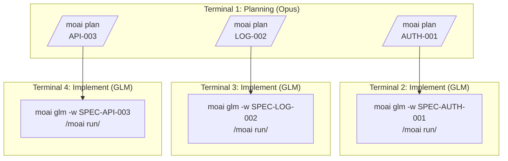
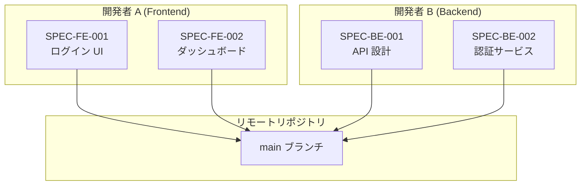
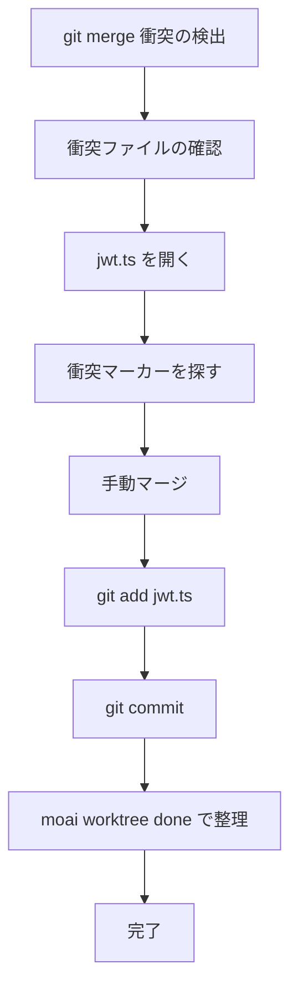
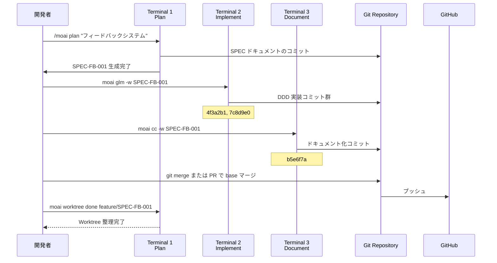

実際のプロジェクトで Git Worktree をどう使うのか、単一 SPEC 開発から並列
開発・チーム協業・問題解決まで具体的なシナリオで見ていきます。シナリオごとに、どの
ステップにどのモデルを使うかというコストの判断も一緒に載せました。

## 目次

1. [単一 SPEC 開発](#単一-spec-開発)
2. [並列 SPEC 開発](#並列-spec-開発)
3. [チーム協業シナリオ](#チーム協業シナリオ)
4. [問題解決の事例](#問題解決の事例)

---

## 単一 SPEC 開発

### シナリオ: ユーザー認証システムの実装

#### ステップ 1: SPEC 計画 (Terminal 1)

計画はメインチェックアウトでそのまま進めます。

```bash
# プロジェクトルートで
$ cd /path/to/your-project

# SPEC 計画の生成
> /moai plan "JWT ベースのユーザー認証システムの実装"

# 進行サマリ (例)
SPEC 分析中...
  - 要件を EARS 形式へ整理

SPEC ドキュメント生成:
  ✓ .moai/specs/SPEC-AUTH-001/spec.md
  ✓ .moai/specs/SPEC-AUTH-001/plan.md
  ✓ .moai/specs/SPEC-AUTH-001/acceptance.md

次のステップ:
  1. 新しいターミナルで実行: moai glm -w SPEC-AUTH-001
  2. 開発開始: /moai run SPEC-AUTH-001
```

#### ステップ 2: Worktree 進入および実装 (Terminal 2)

計画が終わったので、実装ステップでは安価なモデルへ乗り換えます。ワークツリーの生成と
進入、バックエンドの切替がランチャー 1 行でまとめて済みます:

```bash
# 新しいターミナル: ワークツリーがなければ作り、GLM バックエンドでその中からセッション開始
$ moai glm -w SPEC-AUTH-001

# 進入したセッションから DDD 実装を開始
> /moai run SPEC-AUTH-001

# 進行サマリ (例)
Phase 1: ANALYZE
  ✓ 要件・既存コードの分析

Phase 2: PRESERVE
  ✓ 特性化テストを生成し、既存の動作の保存を確認

Phase 3: IMPROVE
  ✓ JWT 認証ミドルウェアを実装
  ✓ リフレッシュトークンローテーションを実装
  ✓ ログアウト時のトークン無効化を実装

実装完了 — feature/SPEC-AUTH-001 へコミット済み

次のステップ:
  1. テスト実行: プロジェクトの言語のテストコマンド (例: go test ./... / npm test / pytest)
  2. ドキュメント化: /moai sync SPEC-AUTH-001
  3. base マージ (git merge/PR) 後の整理: moai worktree done feature/SPEC-AUTH-001
```

#### ステップ 3: ドキュメント化 (同じ Terminal 2)

```bash
# ドキュメント化を実行
> /moai sync SPEC-AUTH-001

# 進行サマリ (例)
ドキュメント同期中...
  ✓ コードマップ・ドキュメントの更新
  ✓ SPEC 状態の遷移およびコミット

ドキュメント化完了 — feature/SPEC-AUTH-001 へコミット済み
次のステップ: base マージ (git merge/PR) 後 moai worktree done feature/SPEC-AUTH-001
```

#### ステップ 4: base マージと整理 (Terminal 1)

`moai worktree done` はマージもプッシュもしません。base ブランチへマージする作業は
`git merge` や PR で先に終わらせたうえで、Worktree だけを整理すれば十分です。

```bash
# プロジェクトルートに戻って
$ cd /path/to/your-project

# base ブランチへマージ (git または PR)
$ git checkout main
$ git merge feature/SPEC-AUTH-001
$ git push origin main

# Worktree 整理 + ブランチ削除
$ moai worktree done feature/SPEC-AUTH-001 --delete-branch

# 出力
✓ Done: worktree for branch feature/SPEC-AUTH-001
  Path: ~/.moai/worktrees/your-project/SPEC-AUTH-001
  Worktree removed.
  Branch feature/SPEC-AUTH-001 deleted.
```

---

## 並列 SPEC 開発

### シナリオ: 3 個の SPEC を同時開発

計画は 1 つのターミナルで推論の強いモデル (Opus) にまとめて処理し、実装は GLM へ
切り替えて 3 つのターミナルに分散します:


```mermaid
graph TB
    subgraph T1["Terminal 1: Planning (Opus)"]
        P1[/moai plan<br/>AUTH-001/]
        P2[/moai plan<br/>LOG-002/]
        P3[/moai plan<br/>API-003/]
    end

    subgraph T2["Terminal 2: Implement (GLM)"]
        I1["moai glm -w SPEC-AUTH-001<br/>/moai run/"]
    end

    subgraph T3["Terminal 3: Implement (GLM)"]
        I2["moai glm -w SPEC-LOG-002<br/>/moai run/"]
    end

    subgraph T4["Terminal 4: Implement (GLM)"]
        I3["moai glm -w SPEC-API-003<br/>/moai run/"]
    end

    P1 --> I1
    P2 --> I2
    P3 --> I3
```

#### Terminal 1: 計画 (すべての SPEC)

```bash
# SPEC 1: 認証
> /moai plan "JWT 認証システム"
✓ SPEC-AUTH-001 生成完了

# SPEC 2: ロギング
> /moai plan "構造化されたロギングシステム"
✓ SPEC-LOG-002 生成完了

# SPEC 3: API
> /moai plan "REST API v2"
✓ SPEC-API-003 生成完了
```

#### Terminal 2: AUTH-001 実装

```bash
$ moai glm -w SPEC-AUTH-001
> /moai run SPEC-AUTH-001
# ... 実装進行中 ...
```

#### Terminal 3: LOG-002 実装

```bash
$ moai glm -w SPEC-LOG-002
> /moai run SPEC-LOG-002
# ... 実装進行中 ...
```

#### Terminal 4: API-003 実装

```bash
$ moai glm -w SPEC-API-003
> /moai run SPEC-API-003
# ... 実装進行中 ...
```

tmux を使っているなら、ターミナルを 4 つ開かずに 1 つのウィンドウから `--spawn` で
すべて起動できます:

```bash
$ moai glm -w SPEC-AUTH-001 --spawn
$ moai glm -w SPEC-LOG-002 --spawn
$ moai glm -w SPEC-API-003 --spawn
```

#### 並列進行状況のモニタリング

ワークツリーの一覧は git がそのまま見せてくれます。

```bash
# Terminal 1 で登録された Worktree を確認
$ git worktree list
/path/to/your-project                                      4f3a2b1 [main]
/path/to/your-project/.claude/worktrees/SPEC-AUTH-001      7c8d9e0 [feature/SPEC-AUTH-001]
/path/to/your-project/.claude/worktrees/SPEC-LOG-002       2a1b3c4 [feature/SPEC-LOG-002]
/path/to/your-project/.claude/worktrees/SPEC-API-003       9f8e7d6 [feature/SPEC-API-003]

# 特定の Worktree の最近の作業を確認
$ git -C .claude/worktrees/SPEC-AUTH-001 log --oneline -5
```

---

## チーム協業シナリオ

### シナリオ: 2 名の開発者の協業


```mermaid
graph TB
    subgraph Dev1["開発者 A (Frontend)"]
        F1[SPEC-FE-001<br/>ログイン UI]
        F2[SPEC-FE-002<br/>ダッシュボード]
    end

    subgraph Dev2["開発者 B (Backend)"]
        B1[SPEC-BE-001<br/>API 設計]
        B2[SPEC-BE-002<br/>認証サービス]
    end

    subgraph Remote["リモートリポジトリ"]
        R[main ブランチ]
    end

    F1 --> R
    F2 --> R
    B1 --> R
    B2 --> R
```

#### 開発者 A: Frontend 開発

```bash
# 開発者 A のマシンで
git clone https://github.com/team/project.git
cd project

# Frontend SPEC 生成
> /moai plan "ログイン UI コンポーネント"
✓ SPEC-FE-001 生成

# Worktree で開発
$ moai glm -w SPEC-FE-001
> /moai run SPEC-FE-001

# 実装完了後にブランチ push + PR 生成 (git/gh)
$ git push -u origin feature/SPEC-FE-001
$ gh pr create --fill

# PR マージ後に Worktree 整理
$ moai worktree done feature/SPEC-FE-001 --delete-branch
```

#### 開発者 B: Backend 開発

```bash
# 開発者 B のマシンで
git clone https://github.com/team/project.git
cd project

# Backend SPEC 生成
> /moai plan "認証 API サービス"
✓ SPEC-BE-001 生成

# Worktree で開発
$ moai glm -w SPEC-BE-001
> /moai run SPEC-BE-001

# 実装完了後にブランチ push + PR 生成 (git/gh)
$ git push -u origin feature/SPEC-BE-001
$ gh pr create --fill

# PR マージ後に Worktree 整理
$ moai worktree done feature/SPEC-BE-001 --delete-branch
```

#### PR マージおよび統合

```bash
# チームリードまたは CI システムで
gh pr list
# FE-001  Login UI Component          Ready
# BE-001  Authentication API Service  Ready

# PR マージ
gh pr merge FE-001 --merge
gh pr merge BE-001 --merge

# すべての開発者が最新状態を維持
git pull origin main
```

---

## 問題解決の事例

### 事例 1: マージ衝突の解決

マージは `git merge` や PR で起こるので、衝突もそのステップで発生します。Worktree
CLI はマージに関与しません。

```bash
$ git checkout main
$ git merge feature/SPEC-AUTH-001

# 出力
✗ マージ衝突が発生!
衝突ファイル:
  - src/auth/jwt.ts
  - tests/auth.test.ts
```

**解決プロセス**:


```mermaid
flowchart TD
    A[git merge 衝突の検出] --> B[衝突ファイルの確認]
    B --> C[jwt.ts を開く]
    C --> D[衝突マーカーを探す]
    D --> E[手動マージ]
    E --> F[git add jwt.ts]
    F --> G[git commit]
    G --> H[moai worktree done で整理]
    H --> I[完了]
```

```bash
# 衝突の解決
code src/auth/jwt.ts

# 衝突マーカーの確認
<<<<<<< HEAD
const secret = process.env.JWT_SECRET;
=======
const secret = config.jwt.secret;
>>>>>>> feature/SPEC-AUTH-001

# 手動でマージ
const secret = process.env.JWT_SECRET || config.jwt.secret;

# staging 後にコミット
git add src/auth/jwt.ts
git commit -m "fix: resolve merge conflict in JWT config"
git push origin main

# マージが終わったら Worktree を整理
moai worktree done feature/SPEC-AUTH-001 --delete-branch
✓ 完了!
```

### 事例 2: Worktree レジストリ破損の復旧

ディレクトリを手で移動したり消したりして、git がワークツリーを見つけられない状態です。

```bash
# 1. レジストリ復旧 — repair 後に stale な参照を prune し、認識された一覧を出力
$ moai worktree recover
Scanning for worktrees in /path/to/your-project...
Recovered 2 worktree(s):
  /path/to/your-project/.claude/worktrees/SPEC-AUTH-001  [feature/SPEC-AUTH-001]
  /path/to/your-project/.claude/worktrees/SPEC-LOG-002   [feature/SPEC-LOG-002]

# 2. それでも残る壊れた項目はパスを指定して削除
$ moai worktree remove ~/.moai/worktrees/your-project/SPEC-AUTH-001 --force

# 3. 作り直しながら進入
$ moai glm -w SPEC-AUTH-001
```

### 事例 3: ディスクを圧迫する Worktree の整理

```bash
$ df -h
Filesystem      Size  Used Avail Use%
/dev/disk1     500G  480G   20G  96%

# 1. base にマージされた Worktree の整理
$ moai worktree clean --merged-only
  Removing merged worktree: .claude/worktrees/SPEC-LOG-002 [feature/SPEC-LOG-002]
Removed 1 merged worktree(s).

# 2. マージはされていないが何も残っていない放置 Worktree の確認 (プレビュー)
$ moai worktree clean --stale
  Keeping .claude/worktrees/SPEC-API-003 [feature/SPEC-API-003]: uncommitted or untracked changes

Would remove 1 stale worktree(s):
  .claude/worktrees/SPEC-TMP-009 [feature/SPEC-TMP-009]

This was a preview. Re-run with --yes to remove them.

# 3. 一覧を確認したら実際に削除 (ブランチはそのまま残ります)
$ moai worktree clean --stale --yes
  Removing stale worktree: .claude/worktrees/SPEC-TMP-009 [feature/SPEC-TMP-009]
Removed 1 stale worktree(s). Branches were left intact.
```

---

## 実際のプロジェクトワークフロー

### 完全な開発サイクルの例


```mermaid
sequenceDiagram
    participant Dev as 開発者
    participant T1 as Terminal 1<br/>Plan
    participant T2 as Terminal 2<br/>Implement
    participant T3 as Terminal 3<br/>Document
    participant Git as Git Repository
    participant Remote as GitHub

    Dev->>T1: /moai plan "フィードバックシステム"
    T1->>Git: SPEC ドキュメントのコミット
    T1->>Dev: SPEC-FB-001 生成完了

    Dev->>T2: moai glm -w SPEC-FB-001
    T2->>Git: DDD 実装コミット群
    Note over T2: 4f3a2b1, 7c8d9e0

    Dev->>T3: moai cc -w SPEC-FB-001
    T3->>Git: ドキュメント化コミット
    Note over T3: b5e6f7a

    Dev->>Git: git merge または PR で base マージ
    Git->>Remote: プッシュ
    Dev->>T1: moai worktree done feature/SPEC-FB-001
    T1-->>Dev: Worktree 整理完了
```

---

## 成功事例

### 事例: スタートアップでの適用

```bash
# 状況: 3 つの機能を同時に開発する必要がある
# 開発者: 2 名

# 1) すべての SPEC を計画 (メインチェックアウト)
> /moai plan "ユーザー管理"
> /moai plan "決済システム"
> /moai plan "通知システム"

# 2) 並列実装 — tmux の 1 つのウィンドウで 3 セッションを起動
$ moai glm -w SPEC-USER-001 --spawn
$ moai glm -w SPEC-PAY-001 --spawn
$ moai glm -w SPEC-NOTIF-001 --spawn

# 3) ドキュメント化 — 各 Worktree のセッションで /moai sync を実行

# 4) base マージ (git merge/PR) 後に Worktree 整理
$ moai worktree done feature/SPEC-USER-001 --delete-branch
$ moai worktree done feature/SPEC-PAY-001 --delete-branch
$ moai worktree done feature/SPEC-NOTIF-001 --delete-branch

# 結果
# - 3 つの機能すべて完了
# - 並列開発で開発の流れを短縮
# - GLM の使用でコスト削減
```

実装セッションを GLM で回したおかげで、コストは目に見えて下がりました。削減幅とその根拠は [CG モード](/ja/multi-llm/cg-mode) にまとめてあります。

---

## ヒントとコツ

### ヒント 1: tmux ウィンドウの管理は --spawn に任せる

`--spawn` は tmux の新しいウィンドウで同じコマンドを実行し直し、移動先の pane ID を
出力します。フォーカスは現在のウィンドウにそのまま残ります。

```bash
$ moai glm -w SPEC-USER-001 --spawn
Spawned pane %7 running `moai glm -w SPEC-USER-001` in /path/to/your-project
Switch to it with: tmux select-window -t %7
```

tmux の外で `--spawn` を使うと、何も変更せずにエラー終了します。そのときはフラグを外して
現在のターミナルで実行してください。

### ヒント 2: 進行状況の追跡

```bash
# すべての Worktree の一覧
git worktree list

# 各 Worktree の最近のコミットをざっと見る
for wt in .claude/worktrees/*/; do
    echo "=== $wt ==="
    git -C "$wt" log --oneline -5
    echo ""
done
```

### ヒント 3: 整理ルーチンのスクリプト

```bash
#!/bin/bash
# clean-worktrees.sh — 定期的に回す整理ルーチン

# マージ済みの Worktree を削除
moai worktree clean --merged-only

# 放置された Worktree はまずプレビューで確認 (自動削除はしない)
moai worktree clean --stale

echo "整理対象を確認したら --yes を付けて実行し直してください。"
```

## 関連ドキュメント

- [Git Worktree 概要](/ja/worktree/)
- [完全ガイド](/ja/worktree/guide)
- [よくある質問](/ja/worktree/faq)
