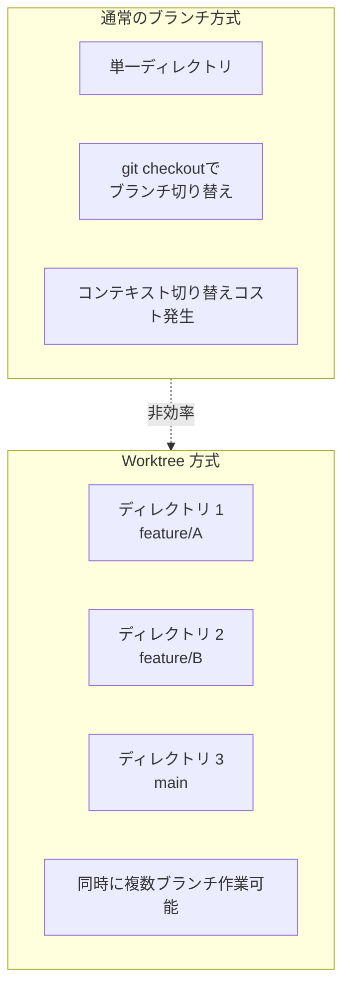
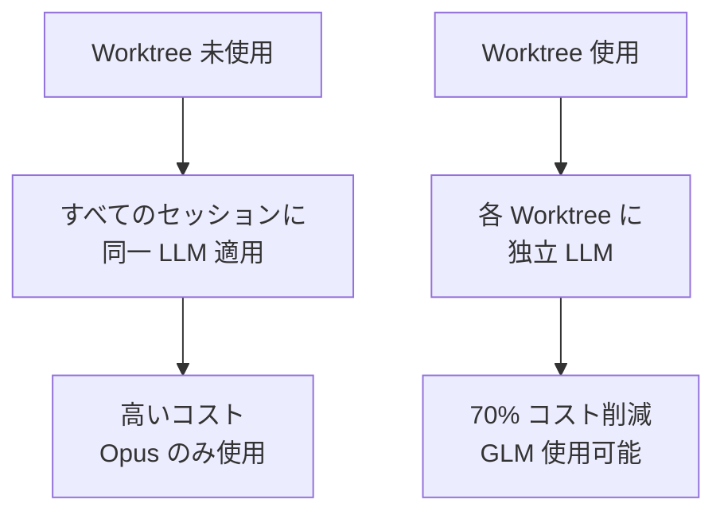
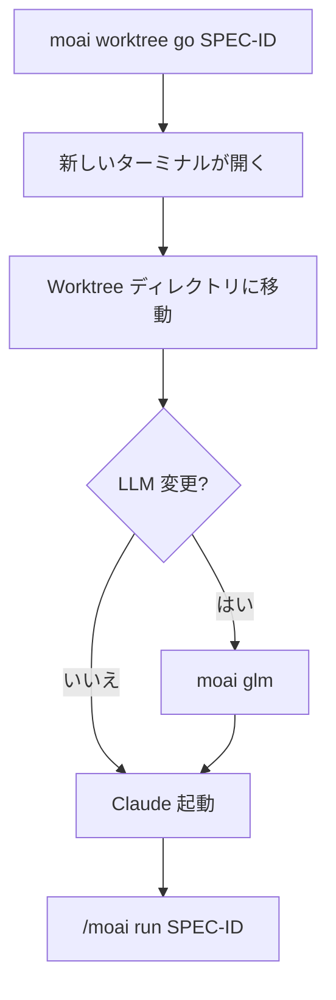
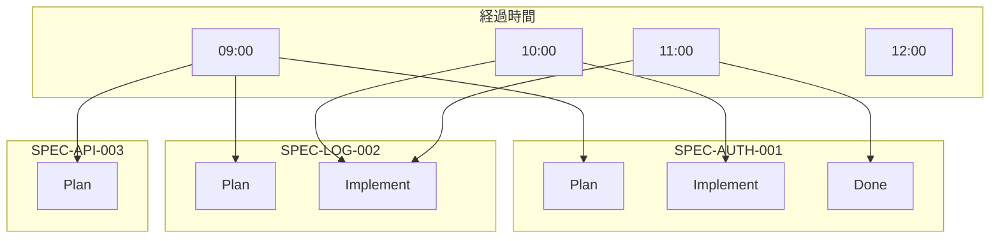
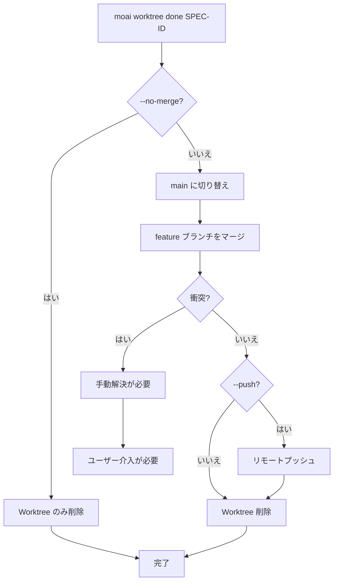
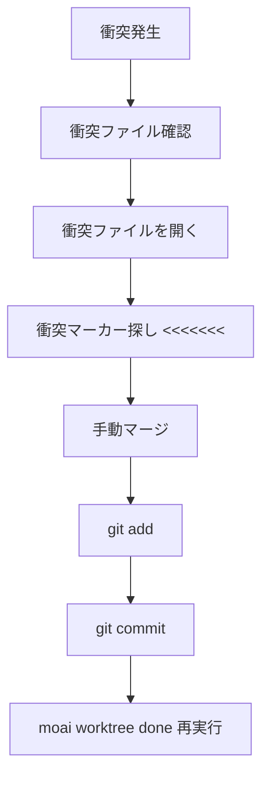
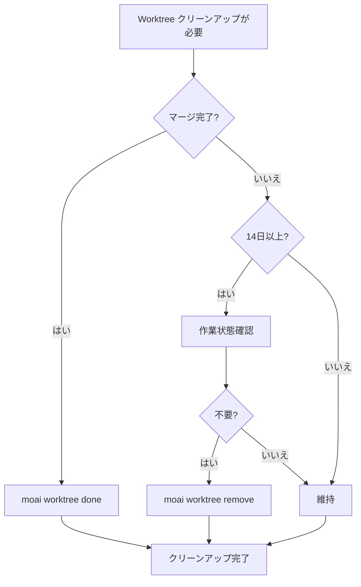
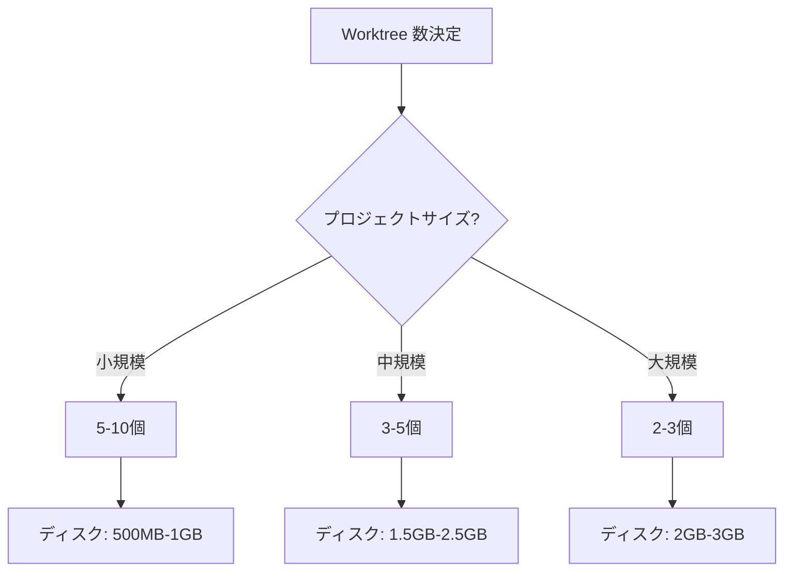
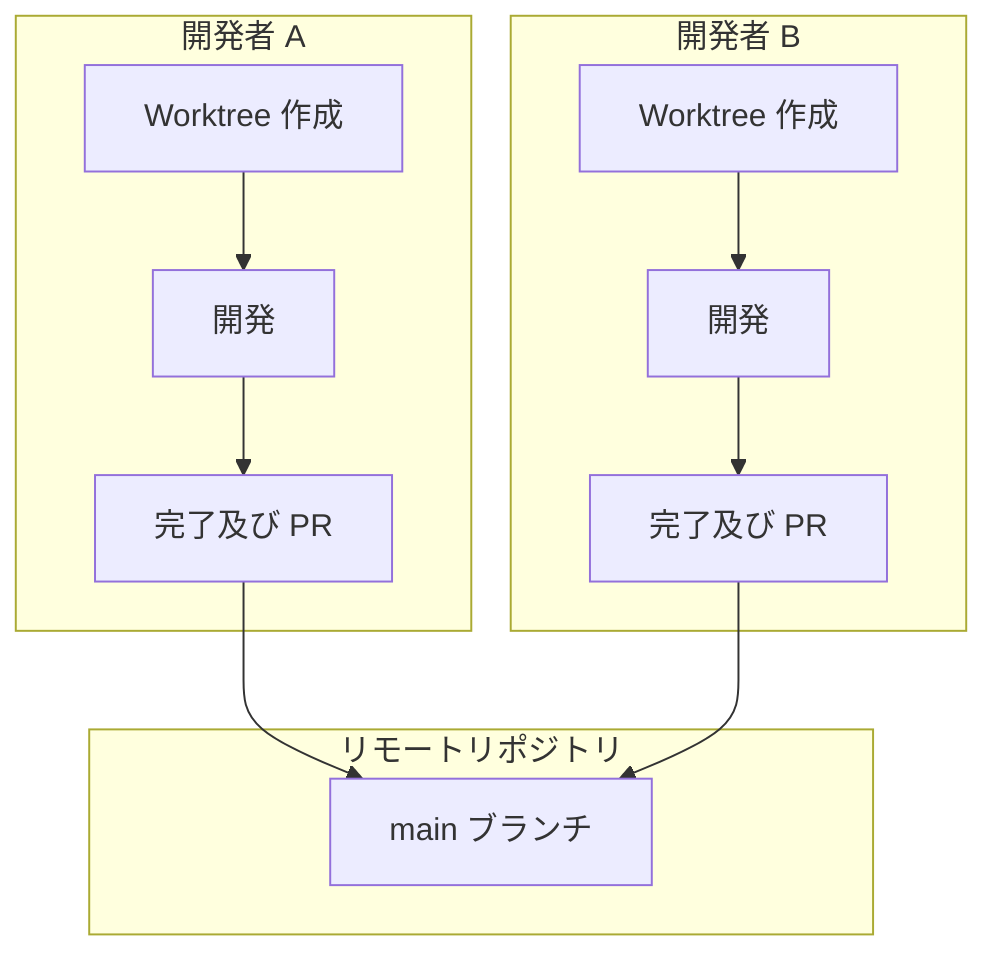

# Git Worktree よくある質問

Git Worktree 使用中に発生する一般的な問題と解決方法をまとめました。

## 目次

1. [基本概念](#基本概念)
2. [使用関連](#使用関連)
3. [問題解決](#問題解決)
4. [パフォーマンスと最適化](#パフォーマンスと最適化)
5. [チーム協働](#チーム協働)

---

## 基本概念

### Q: Git Worktree と通常のブランチの違いは何ですか?

**A**: Git Worktree は**物理的に分離されたディレクトリ**で作業できるようにします:



**主な違い**:

| 特徴          | 通常のブランチ         | Git Worktree    |
| ------------- | ------------------- | --------------- |
| 作業ディレクトリ | 1個共有            | N個独立        |
| ブランチ切り替え   | `git checkout` 必要 | ディレクトリ移動のみ |
| 同時作業     | 不可              | 可能            |
| LLM 設定      | 共有される          | 独立的          |
| 衝突可能性   | 高い                | 低い            |

---

### Q: なぜ Worktree を使用すべきなのですか?

**A**: 以下の理由で Worktree 使用を推奨します:

1. **LLM 設定独立性**: 各 SPEC で異なる LLM 使用可能
   - Plan 段階: Opus (高品質)
   - Implement 段階: GLM (低コスト)
   - Document 段階: Sonnet (中間)

2. **並列開発**: 同時に複数の SPEC 開発可能
3. **衝突防止**: 独立した作業スペースで衝突最小化
4. **コスト削減**: GLM 使用で 70% コスト削減



---

### Q: MoAI-ADK で Worktree は必須ですか?

**A**: いいえ、必須ではありませんが**強く推奨**します:

- **単一 SPEC 開発**: Worktree なしでも可能
- **複数 SPEC 開発**: Worktree が必須
- **チーム協働**: Worktree で衝突防止
- **コスト最適化**: Worktree で LLM 分離

---

## 使用関連

### Q: Worktree を作成する方法は?

**A**: 2つの方法があります:

**方法 1: 自動作成 (推奨)**

```bash
# SPEC 計画段階で自動作成
> /moai plan "機能説明" --worktree

# 自動的に:
# 1. SPEC ドキュメント作成
# 2. Worktree 作成
# 3. Feature ブランチ作成
```

**方法 2: 手動作成**

```bash
# Worktree 手動作成
moai worktree new SPEC-AUTH-001

# 特定ブランチから作成
moai worktree new SPEC-AUTH-001 --from develop
```

---

### Q: Worktree に入るにはどうすればよいですか?

**A**: `moai worktree go` コマンドを使用します:

```bash
# Worktree に入る
moai worktree go SPEC-AUTH-001

# 新しいターミナルが開き Worktree に移動
# プロンプトが変更される
(SPEC-AUTH-001) $
```

**入力後の作業フロー**:



---

### Q: 複数の Worktree を同時に使用できますか?

**A**: はい、無制限に可能です:

```bash
# Terminal 1
moai worktree go SPEC-AUTH-001
(SPEC-AUTH-001) $ moai glm

# Terminal 2
moai worktree go SPEC-LOG-002
(SPEC-LOG-002) $ moai glm

# Terminal 3
moai worktree go SPEC-API-003
(SPEC-API-003) $ moai glm

# すべて同時に作業可能
```

**並列作業の視覚化**:



---

### Q: Worktree を完了する方法は?

**A**: `moai worktree done` コマンドを使用します:

```bash
# 基本完了 (マージ + クリーンアップ)
moai worktree done SPEC-AUTH-001

# リモートにプッシュまで
moai worktree done SPEC-AUTH-001 --push

# マージなしで削除のみ
moai worktree done SPEC-AUTH-001 --no-merge
```

**完了プロセス**:



---

## 問題解決

### Q: Worktree 衝突が発生しました

**A**: 以下の手順で解決してください:



**実際の例**:

```bash
moai worktree done SPEC-AUTH-001
✗ マージ衝突が発生しました!

# 1. 衝突ファイル確認
cd .moai/worktrees/SPEC-AUTH-001
git status
# 衝突ファイル: src/auth/jwt.ts

# 2. 衝突解決
code src/auth/jwt.ts

# 3. 衝突マーカー確認と修正
<<<<<<< HEAD
const secret = process.env.JWT_SECRET;
=======
const secret = config.jwt.secret;
>>>>>>> feature/SPEC-AUTH-001

# 4. マージ
const secret = process.env.JWT_SECRET || config.jwt.secret;

# 5. コミット
git add src/auth/jwt.ts
git commit -m "fix: resolve merge conflict"

# 6. 完了再試行
cd /path/to/project
moai worktree done SPEC-AUTH-001
✓ 完了しました!
```

---

### Q: Worktree が破損しました

**A**: 以下の手順で復旧してください:

```bash
# 1. 診断
moai worktree status SPEC-AUTH-001
✗ Worktree ディレクトリが存在しません

# 2. 既存 Worktree 削除
moai worktree remove SPEC-AUTH-001 --force

# 3. Worktree 再作成
moai worktree new SPEC-AUTH-001

# 4. 復旧確認
moai worktree status SPEC-AUTH-001
✓ Worktree は正常です
```

---

### Q: ディスク容量が不足しています

**A**: 古い Worktree をクリーンアップしてください:

```bash
# 1. ディスク使用量確認
$ du -sh .moai/worktrees/*
2.5G    .moai/worktrees/SPEC-AUTH-001
1.8G    .moai/worktrees/SPEC-LOG-002
3.2G    .moai/worktrees/SPEC-API-003

# 2. 古い Worktree クリーンアップ
$ moai worktree clean --older-than 14

# クリーンアップされる Worktree:
#   - SPEC-OLD-001 (30日前, 2.1GB)
#   - SPEC-OLD-002 (45日前, 1.7GB)

続行しますか? [y/N] y

✓ 2個の Worktree クリーンアップ完了
✓ 3.8GB ディスク容量確保
```

**クリーンアップ戦略**:



---

### Q: LLM が期待通りに動作しません

**A**: Worktree 別 LLM 設定を確認してください:

```bash
# 現在の LLM 確認
moai config
現在の LLM: GLM 5

# Worktree で LLM 変更
moai worktree go SPEC-AUTH-001
(SPEC-AUTH-001) $ moai cc
→ Claude Opus に変更されました

# 別の Worktree は影響なし
(SPEC-AUTH-001) $ exit
moai worktree go SPEC-LOG-002
(SPEC-LOG-002) $ moai config
現在の LLM: GLM 5 (変更なし)
```

---

### Q: Git コマンドが動作しません

**A**: 正しいディレクトリにいるか確認してください:

```bash
# Worktree ディレクトリ確認
pwd
/Users/goos/MoAI/moai-project/.moai/worktrees/SPEC-AUTH-001

# Git 状態確認
git status
On branch feature/SPEC-AUTH-001
nothing to commit, working tree clean

# Git エラーが発生する場合
git fetch --all
git rebase origin/feature/SPEC-AUTH-001
```

---

## パフォーマンスと最適化

### Q: Worktree はパフォーマンスに影響を与えますか?

**A**: わずかな影響のみがあります:

**利点**:

- 各 Worktree が独立していてキャッシュ効率的
- Git 操作が高速 (ローカルブランチ)
- ファイルシステムキャッシュ活用

**欠点**:

- ディスク容量使用 (各 Worktree で重複)
- 初期 Worktree 作成時に時間要す

**最適化のヒント**:

```bash
# 1. 不要な Worktree 削除
moai worktree clean --merged-only

# 2. Git ガベージコレクション
git gc --aggressive --prune=now

# 3. Worktree 圧縮
git worktree prune
```

---

### Q: 何個の Worktree を作成できますか?

**A**: 理論的には無制限ですが、実際には以下の要因で制限されます:

**制限要因**:

1. **ディスク容量**: 各 Worktree は約 100MB-1GB 使用
2. **メモリ**: 各 Worktree で開かれたセッション
3. **ファイルシステム**: 同時に開けるファイル数

**推奨事項**:

- **小規模プロジェクト**: 5-10個 Worktree
- **中規模プロジェクト**: 3-5個 Worktree
- **大規模プロジェクト**: 2-3個 Worktree



---

### Q: Worktree を自動的にクリーンアップできますか?

**A**: はい、定期的なクリーンアップスクリプトを使用できます:

```bash
#!/bin/bash
# clean-worktrees.sh

# マージされた Worktree クリーンアップ
moai worktree clean --merged-only

# 30日以上の Worktree クリーンアップ
moai worktree clean --older-than 30

# Git ガベージコレクション
cd /path/to/project
git gc --aggressive --prune=now

echo "Worktree クリーンアップ完了"
```

**cron ジョブ設定**:

```bash
# 毎週日曜日午前2時に実行
0 2 * * 0 /path/to/clean-worktrees.sh >> /var/log/worktree-cleanup.log 2>&1
```

---

## チーム協働

### Q: チームで Worktree をどのように使用しますか?

**A**: 以下のワークフローを推奨します:



**チーム協働ガイド**:

1. **Worktree 命名規則**: `SPEC-{カテゴリ}-{番号}`
2. **定期的な同期**: `git pull origin main`
3. **PR レビュー前**: ローカルでテスト完了
4. **衝突防止**: 頻繁に `main` と同期

---

### Q: Worktree とリモートリポジトリを同期する方法は?

**A**: 定期的に `git pull` を実行してください:

```bash
# 各 Worktree で同期
moai worktree go SPEC-AUTH-001
(SPEC-AUTH-001) $ git pull origin main

# またはすべての Worktree 同期
for spec in $(moai worktree list --porcelain | awk '{print $1}'); do
    cd ~/.moai/worktrees/$spec
    echo "Syncing $spec..."
    git pull origin main
done
```

---

### Q: PR レビュー中に Worktree をどのように管理しますか?

**A**: 以下の戦略を使用してください:

```bash
# PR 作成前
moai worktree status SPEC-AUTH-001
# 状態確認

git log main..feature/SPEC-AUTH-001
# 変更確認

# PR レビュー中
# Worktree 維持 (マージ待ち)

# PR 承認後
moai worktree done SPEC-AUTH-001 --push
# マージ及びクリーンアップ

# PR 却下後
cd .moai/worktrees/SPEC-AUTH-001
# 修正作業継続
```

---

## 追加の質問

### Q: Worktree を使用せずに MoAI-ADK を使用できますか?

**A**: はい、可能ですが推奨しません:

```bash
# Worktree なしで使用
> /moai plan "機能説明"
# Worktree 作成段階スキップ

# しかし以下の問題発生:
# 1. すべてのセッションに同一 LLM 適用
# 2. 並列開発不可
# 3. コンテキスト切り替えコスト
```

---

### Q: Worktree をバックアップする必要がありますか?

**A**: Worktree は Git で管理されるため別途バックアップは不要です:

```bash
# Worktree は Git の一部
# リモートリポジトリにプッシュすると自動バックアップ

# 定期的にリモートにプッシュ
git push origin feature/SPEC-AUTH-001

# Worktree 喪失時復旧
git fetch origin
git worktree add SPEC-AUTH-001 origin/feature/SPEC-AUTH-001
```

---

## 関連ドキュメント

- [Git Worktree 概要](/worktree/index)
- [完全ガイド](./guide)
- [実際の使用例](./examples)

## 追加のヘルプが必要ですか?

- [GitHub Issues](https://github.com/MoAI-ADK/moai-adk/issues)
- [Discord コミュニティ](https://discord.gg/moai-adk)
- [メールサポート](mailto:support@moai-adk.org)
