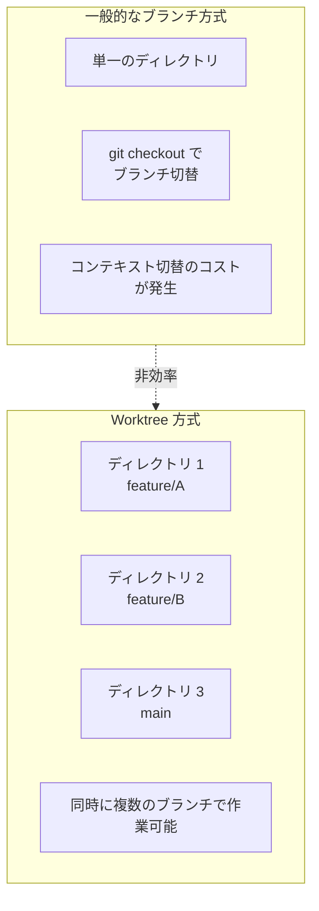
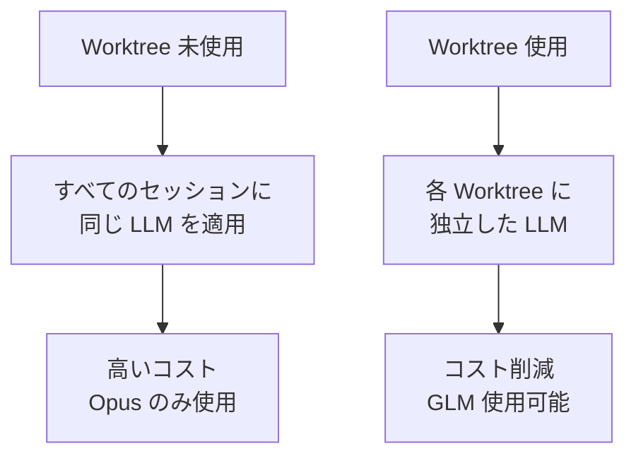
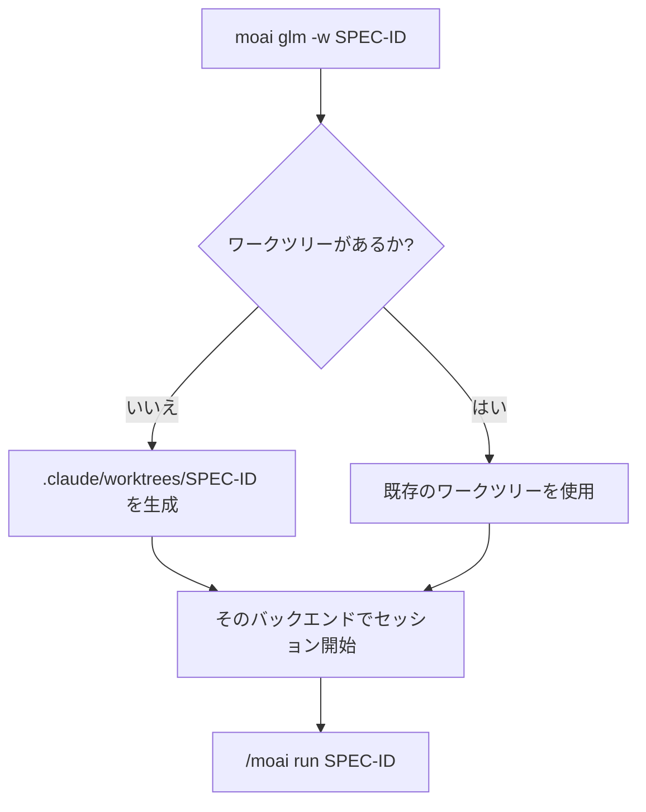
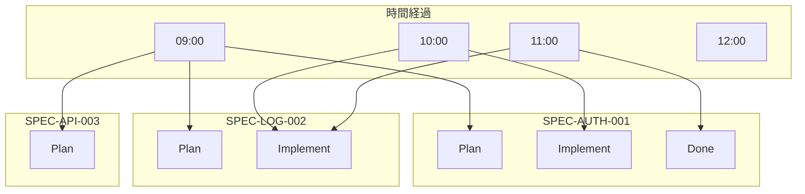
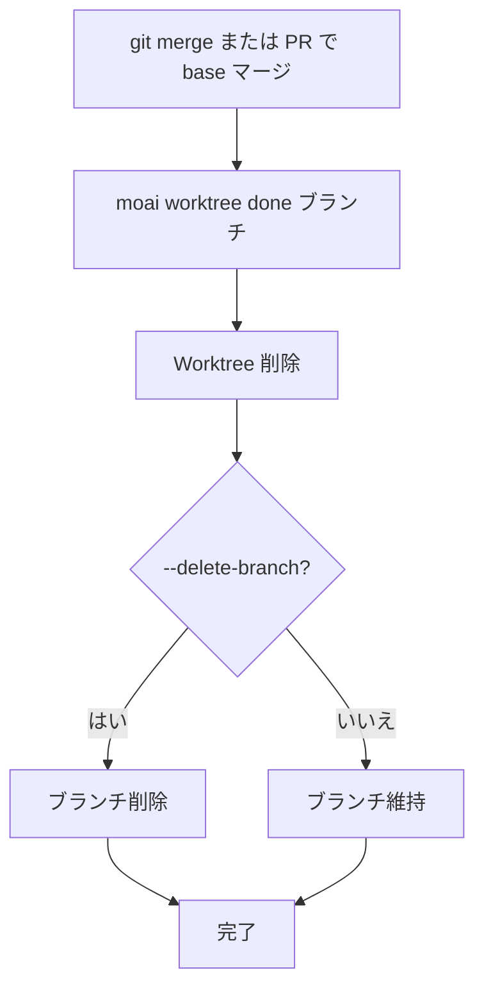
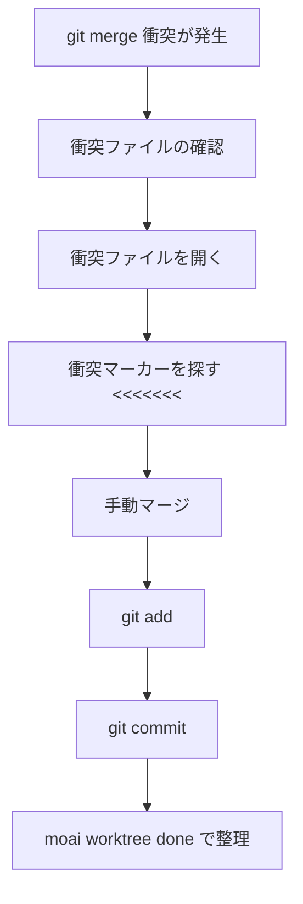
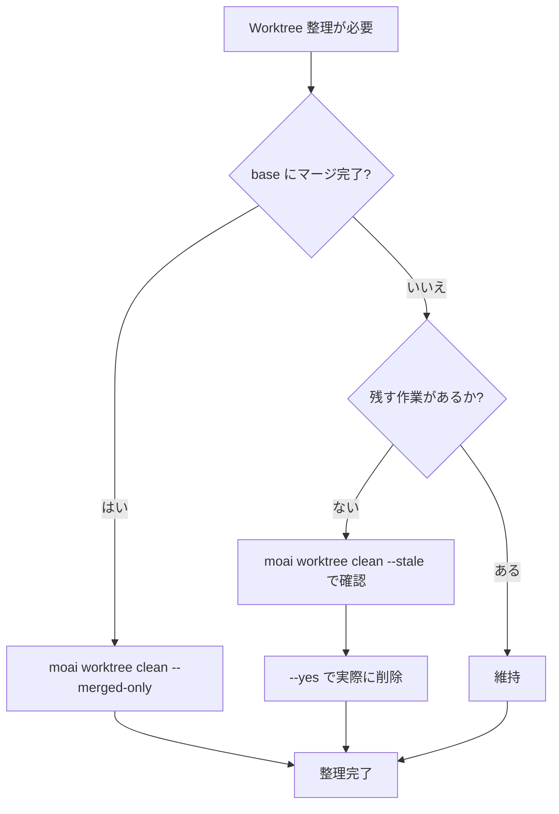
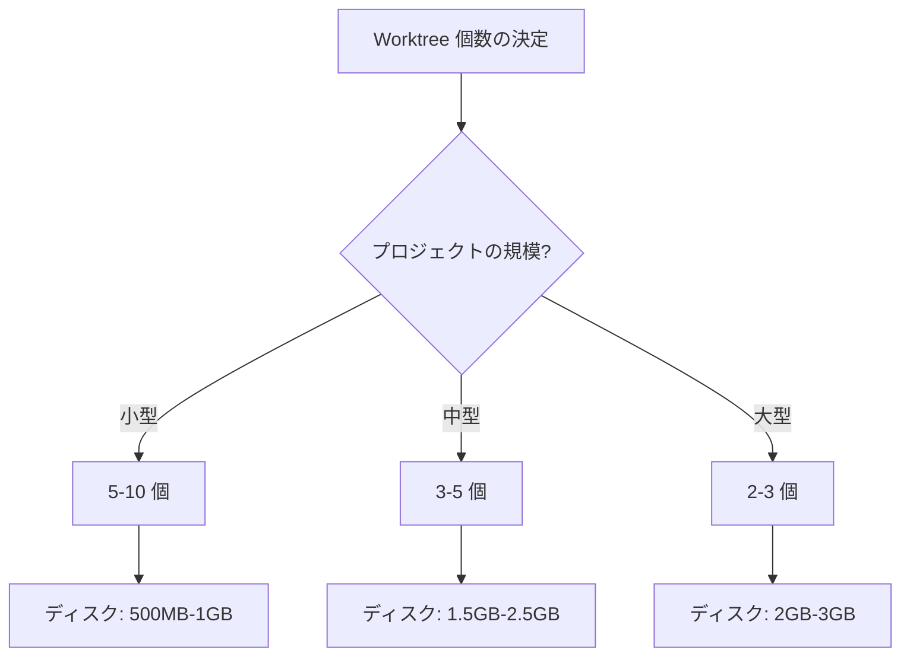
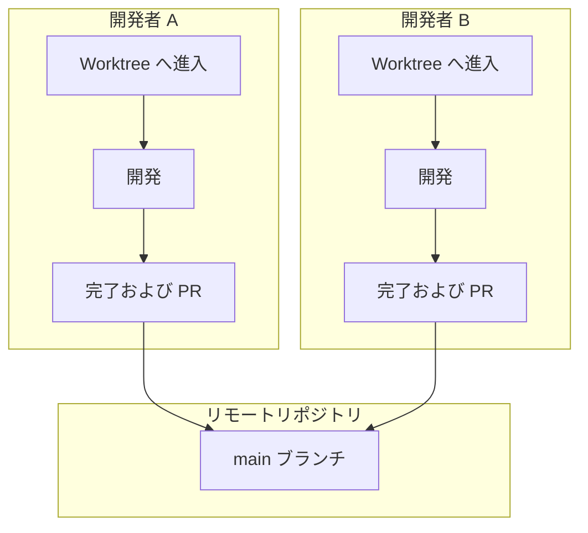

Git Worktree を使っていて出会う質問と問題を 1 か所に整理しました。

## 目次

1. [基本概念](#基本概念)
2. [使用関連](#使用関連)
3. [問題解決](#問題解決)
4. [性能および最適化](#性能および最適化)
5. [チーム協業](#チーム協業)

---

## 基本概念

### Q: Git Worktree と一般的なブランチの違いは何ですか?

**A**: Git Worktree を使うと **物理的に分離されたディレクトリ** で作業できます:


```mermaid
graph TD
    subgraph Traditional["一般的なブランチ方式"]
        T1[単一のディレクトリ]
        T2[git checkout で<br/>ブランチ切替]
        T3[コンテキスト切替のコストが発生]
    end

    subgraph Worktree["Worktree 方式"]
        W1[ディレクトリ 1<br/>feature/A]
        W2[ディレクトリ 2<br/>feature/B]
        W3[ディレクトリ 3<br/>main]
        W4[同時に複数のブランチで作業可能]
    end

    Traditional -.->|非効率| Worktree
```

**主な違い**:

| 特徴          | 一般的なブランチ         | Git Worktree    |
| ------------- | ------------------- | --------------- |
| 作業ディレクトリ | 1 個を共有            | N 個が独立        |
| ブランチ切替   | `git checkout` が必要 | ディレクトリ移動のみ |
| 同時作業     | 不可能              | 可能            |
| LLM 設定      | 共有される              | 独立            |
| 衝突の可能性   | 高い                | 低い            |

---

### Q: なぜ Worktree を使うべきですか?

**A**: 理由は大きく並列開発とトークノミクスの 2 つに分かれます:

1. **LLM 設定の独立性** — SPEC ごとに異なる LLM を割り当てられます
   - Plan ステップ: Opus (高品質な推論)
   - Implement ステップ: GLM (低コスト)
   - Document ステップ: Sonnet (中程度)

2. **並列開発** — 複数の SPEC を同時に進められます
3. **衝突防止** — 作業空間が別々に動くので衝突がほとんど起きません
4. **コスト削減** — 実装ステップに GLM を使うとコストが減ります。削減幅は [CG モード](/ja/multi-llm/cg-mode) にまとめてあります


```mermaid
graph TD
    A[Worktree 未使用] --> B[すべてのセッションに<br/>同じ LLM を適用]
    B --> C[高いコスト<br/>Opus のみ使用]

    D[Worktree 使用] --> E[各 Worktree に<br/>独立した LLM]
    E --> F[コスト削減<br/>GLM 使用可能]
```

---

### Q: MoAI-ADK で Worktree は必須ですか?

**A**: いいえ、必須ではありませんが **強く推奨** します:

- **単一 SPEC 開発**: Worktree なしでも可能
- **多重 SPEC 開発**: Worktree が事実上必須
- **チーム協業**: Worktree で衝突を防止
- **コスト最適化**: Worktree で LLM を分離

---

## 使用関連

### Q: Worktree にはどう進入しますか?

**A**: ランチャーの `-w` フラグを使います。指定した名前のワークツリーがなければその場で
作ってくれるので、生成と進入が 1 行で終わります:

```bash
# ワークツリーを作りながら GLM バックエンドで進入
moai glm -w SPEC-AUTH-001

# 同じワークツリーへ Claude バックエンドで進入
moai cc -w SPEC-AUTH-001

# Claude リーダー + GLM チームメイトのハイブリッドで進入
moai cg -w SPEC-AUTH-001
```

短い名前は `.claude/worktrees/<名前>/` の下で解決されます。すでに作ってあるワークツリーが
別の場所にあるなら、絶対パスを渡せば大丈夫です — `~/.moai/worktrees/` または
`<プロジェクト>/.claude/worktrees/` の配下である必要があり、それ以外のパスは拒否されます。

**進入後の作業の流れ**:


```mermaid
flowchart TD
    A["moai glm -w SPEC-ID"] --> B{ワークツリーがあるか?}
    B -->|いいえ| C[.claude/worktrees/SPEC-ID を生成]
    B -->|はい| D[既存のワークツリーを使用]
    C --> E[そのバックエンドでセッション開始]
    D --> E
    E --> F["/moai run SPEC-ID"]
```

---

### Q: 現在のセッションを保ったままワークツリーをもう 1 つ開けますか?

**A**: `--spawn` を付ければ大丈夫です。tmux の新しいウィンドウで同じコマンドが実行され、
今のウィンドウはフォーカスまでそのまま保たれます:

```bash
moai glm -w SPEC-AUTH-002 --spawn
# Spawned pane %7 running `moai glm -w SPEC-AUTH-002` in /path/to/your-project
# Switch to it with: tmux select-window -t %7
```

`--spawn` は tmux の中でのみ動作します。tmux の外で使うと何も変更せずにエラー終了するので、
そのときはフラグを外して現在のターミナルで実行してください。`-w` だけを使うと現在の
プロセスがワークツリーのセッションに置き換わる点が `--spawn` との違いです。

---

### Q: 作ってある Worktree の一覧はどう見ますか?

**A**: git コマンドをそのまま使います。`moai worktree` に一覧コマンドはありません:

```bash
git worktree list
```

特定のワークツリーの状態や最近のコミットも `git -C` で確認します:

```bash
git -C .claude/worktrees/SPEC-AUTH-001 status
git -C .claude/worktrees/SPEC-AUTH-001 log --oneline -5
```

---

### Q: 複数の Worktree を同時に使えますか?

**A**: はい、無制限に可能です:

```bash
# Terminal 1
moai glm -w SPEC-AUTH-001

# Terminal 2
moai glm -w SPEC-LOG-002

# Terminal 3
moai glm -w SPEC-API-003

# すべて同時に作業可能
```

tmux を使っているなら、1 つのウィンドウから `--spawn` ですべて起動できます:

```bash
moai glm -w SPEC-AUTH-001 --spawn
moai glm -w SPEC-LOG-002 --spawn
moai glm -w SPEC-API-003 --spawn
```

**並列作業の可視化**:


```mermaid
graph TD
    subgraph Time["時間経過"]
        T1[09:00]
        T2[10:00]
        T3[11:00]
        T4[12:00]
    end

    subgraph Worktree1["SPEC-AUTH-001"]
        W1A[Plan]
        W1B[Implement]
        W1C[Done]
    end

    subgraph Worktree2["SPEC-LOG-002"]
        W2A[Plan]
        W2B[Implement]
    end

    subgraph Worktree3["SPEC-API-003"]
        W3A[Plan]
    end

    T1 --> W1A
    T1 --> W2A
    T1 --> W3A

    T2 --> W1B
    T2 --> W2B

    T3 --> W1C
    T3 --> W2B
```

---

### Q: Worktree を完了する方法は?

**A**: `moai worktree done` は Worktree を消し、必要ならブランチまで削除します。
ただし**マージもプッシュもしません**。base マージは `git merge` や PR で先に
終わらせてください。引数はパスではなくブランチ名です:

```bash
# Worktree 削除のみ
moai worktree done feature/SPEC-AUTH-001

# Worktree 削除 + ブランチ削除
moai worktree done feature/SPEC-AUTH-001 --delete-branch

# 自動化用の無出力モード (PR マージ後の整理)
moai worktree done feature/SPEC-AUTH-001 --auto
```

**完了プロセス**:


```mermaid
flowchart TD
    A[git merge または PR で base マージ] --> B[moai worktree done ブランチ]
    B --> C[Worktree 削除]
    C --> D{--delete-branch?}
    D -->|はい| E[ブランチ削除]
    D -->|いいえ| F[ブランチ維持]
    E --> G[完了]
    F --> G[完了]
```

---

### Q: `moai worktree done` と `moai worktree remove` は何が違いますか?

**A**: 何を引数に取るかが違います。

| | `done` | `remove` |
|---|---|---|
| 引数 | ブランチ名 (`feature/SPEC-AUTH-001`) | ファイルシステムのパス |
| すること | そのブランチのワークツリーを探して削除 | そのパスのワークツリーを削除 |
| ブランチ削除 | `--delete-branch` で選択可能 | しない |
| 自動化モード | `--auto` に対応 | なし |

ブランチが分かっているなら `done`、パスしか分からない場合やブランチが壊れた
ワークツリーを片付けるときは `remove` を使えば大丈夫です。

---

## 問題解決

### Q: `moai worktree clean --stale` は安全ですか?

**A**: 安全になるよう設計されています。3 重の保護がかかっています。

1. **デフォルトがプレビューです。** `--stale` だけを渡すと削除予定の一覧を出力するだけで、
   実際には消しません。`--yes` を付けてはじめて削除が起こります
2. **失うものがあれば消しません。** 作業ツリーがクリーンで (未コミットの変更も
   untracked ファイルもない)、ブランチに base を超える固有のコミットがないワークツリーだけが
   対象になります。1 つでも外れると維持され、その理由が併せて出力されます
3. **ブランチは決して削除しません。** ワークツリーのディレクトリが消えても、コミットは
   ブランチ名のまま残るのでいつでも取り出せます

メインチェックアウトと、今コマンドを実行中のワークツリーも常に保護対象から外れません。

```bash
# 1) 何が消えるかを先に確認
$ moai worktree clean --stale
  Keeping .claude/worktrees/SPEC-API-003 [feature/SPEC-API-003]: uncommitted or untracked changes

Would remove 1 stale worktree(s):
  .claude/worktrees/SPEC-TMP-009 [feature/SPEC-TMP-009]

This was a preview. Re-run with --yes to remove them.

# 2) 確認したら実際に削除
$ moai worktree clean --stale --yes
```

`--stale` と `--merged-only` は同時に使えません。マージ済みかどうかで整理するなら
`--merged-only`、放置されているかどうかで整理するなら `--stale` を使ってください。

---

### Q: Worktree の衝突が発生しました

**A**: マージ衝突は `git merge` や PR のステップで発生します。Worktree CLI はマージに
関与しないので、次の順序で解けば大丈夫です:


```mermaid
flowchart TD
    A[git merge 衝突が発生] --> B[衝突ファイルの確認]
    B --> C[衝突ファイルを開く]
    C --> D[衝突マーカーを探す &lt;&lt;&lt;&lt;&lt;&lt;&lt;]
    D --> E[手動マージ]
    E --> F[git add]
    F --> G[git commit]
    G --> H[moai worktree done で整理]
```

**実際の例**:

```bash
git checkout main
git merge feature/SPEC-AUTH-001
✗ マージ衝突が発生!

# 1. 衝突ファイルの確認
git status
# 衝突ファイル: src/auth/jwt.ts

# 2. 衝突の解決
code src/auth/jwt.ts

# 3. 衝突マーカーの確認および修正
<<<<<<< HEAD
const secret = process.env.JWT_SECRET;
=======
const secret = config.jwt.secret;
>>>>>>> feature/SPEC-AUTH-001

# 4. マージ
const secret = process.env.JWT_SECRET || config.jwt.secret;

# 5. コミット
git add src/auth/jwt.ts
git commit -m "fix: resolve merge conflict"
git push origin main

# 6. マージ後に Worktree 整理
moai worktree done feature/SPEC-AUTH-001 --delete-branch
✓ 完了!
```

---

### Q: Worktree レジストリが破損しました

**A**: ディレクトリを手で移動したり消したりすると、git がワークツリーを見つけられなく
なります。次の順序で復旧してください:

```bash
# 1. レジストリ復旧 (git worktree repair + prune + 一覧出力)
$ moai worktree recover
Scanning for worktrees in /path/to/your-project...
Recovered 2 worktree(s):
  /path/to/your-project/.claude/worktrees/SPEC-AUTH-001  [feature/SPEC-AUTH-001]
  /path/to/your-project/.claude/worktrees/SPEC-LOG-002   [feature/SPEC-LOG-002]

# 2. 現在の状態を確認
$ git worktree list

# 3. それでも残る壊れた項目はパスを指定して削除
$ moai worktree remove ~/.moai/worktrees/your-project/SPEC-AUTH-001 --force

# 4. 作り直しながら進入
$ moai glm -w SPEC-AUTH-001
```

---

### Q: ディスク容量が足りません

**A**: マージが終わった Worktree から整理してください:

```bash
# 1. ディスク使用量の確認
$ du -sh .claude/worktrees/*
2.5G    .claude/worktrees/SPEC-AUTH-001
1.8G    .claude/worktrees/SPEC-LOG-002
3.2G    .claude/worktrees/SPEC-API-003

# 2. base にマージされた Worktree の整理
$ moai worktree clean --merged-only

# 3. マージはされていないが何も残っていない Worktree を確認してから整理
$ moai worktree clean --stale
$ moai worktree clean --stale --yes
```

**整理戦略**:


```mermaid
graph TD
    A[Worktree 整理が必要] --> B{base にマージ完了?}
    B -->|はい| C[moai worktree clean --merged-only]
    B -->|いいえ| D{残す作業があるか?}
    D -->|ない| E[moai worktree clean --stale で確認]
    E --> F[--yes で実際に削除]
    D -->|ある| G[維持]
    C --> H[整理完了]
    F --> H
    G --> H
```

---

### Q: LLM が期待どおりに動作しません

**A**: Worktree ごとに LLM 設定がどうなっているか確認してください:

```bash
# 現在の LLM バックエンドの確認 (Worktree 別の設定は .moai/config/sections/llm.yaml に記録されます)
cat .moai/config/sections/llm.yaml

# バックエンドを変えるにはそのワークツリーへ再進入
moai cc -w SPEC-AUTH-001   # Claude バックエンドへ切替

# 他の Worktree には影響なし
git -C .claude/worktrees/SPEC-LOG-002 show HEAD:.moai/config/sections/llm.yaml
```

---

### Q: Git コマンドが動作しません

**A**: 正しいディレクトリにいるか確認してください:

```bash
# 現在のワークツリーのルートを確認
git rev-parse --show-toplevel

# Git 状態の確認
git status
# On branch feature/SPEC-AUTH-001
# nothing to commit, working tree clean

# もし Git エラーが発生したら
git fetch --all
git rebase origin/feature/SPEC-AUTH-001
```

---

## 性能および最適化

### Q: Worktree は性能に影響を与えますか?

**A**: 影響は大きくありません:

**利点**:

- Worktree が互いに独立しているのでキャッシュがよく効く
- Git 作業が速い (ローカルブランチ)
- ファイルシステムキャッシュの活用

**欠点**:

- ディスク容量の消費 (Worktree ごとに重複)
- 最初に Worktree を作るときに少し時間がかかる

**最適化のヒント**:

```bash
# 1. 不要な Worktree の削除
moai worktree clean --merged-only

# 2. Git ガベージコレクション
git gc --aggressive --prune=now

# 3. stale な参照の整理
moai worktree clean
```

---

### Q: いくつの Worktree を生成できますか?

**A**: 理論的には制限がありませんが、実際には次の要因が個数を左右します:

**制限要因**:

1. **ディスク容量**: 各 Worktree は約 100MB-1GB を使用
2. **メモリ**: 各 Worktree で開いたセッション
3. **ファイルシステム**: 同時に開けるファイル数

**推奨事項**:

- **小型プロジェクト**: 5-10 個の Worktree
- **中型プロジェクト**: 3-5 個の Worktree
- **大型プロジェクト**: 2-3 個の Worktree


```mermaid
graph TD
    A[Worktree 個数の決定] --> B{プロジェクトの規模?}
    B -->|小型| C[5-10 個]
    B -->|中型| D[3-5 個]
    B -->|大型| E[2-3 個]

    C --> F[ディスク: 500MB-1GB]
    D --> G[ディスク: 1.5GB-2.5GB]
    E --> H[ディスク: 2GB-3GB]
```

---

### Q: Worktree を自動的に整理できますか?

**A**: マージ済みの Worktree の整理は自動化しても安全です。ただし `--stale --yes` は
無人実行より、人が一覧を見てから実行するほうをおすすめします:

```bash
#!/bin/bash
# clean-worktrees.sh

cd /path/to/project

# base にマージされた Worktree の整理 (安全)
moai worktree clean --merged-only

# 放置された Worktree は一覧を報告するだけです (削除しません)
moai worktree clean --stale

# Git ガベージコレクション
git gc --aggressive --prune=now

echo "Worktree 整理完了 — --stale の一覧は確認のうえ自分で --yes を付けて処理してください"
```

**cron ジョブの設定**:

```bash
# 毎週日曜日の深夜 2 時に実行
0 2 * * 0 /path/to/clean-worktrees.sh >> /var/log/worktree-cleanup.log 2>&1
```

---

## チーム協業

### Q: チームで Worktree をどう使いますか?

**A**: 次のワークフローを推奨します:


```mermaid
graph TD
    subgraph DevA["開発者 A"]
        A1[Worktree へ進入]
        A2[開発]
        A3[完了および PR]
    end

    subgraph DevB["開発者 B"]
        B1[Worktree へ進入]
        B2[開発]
        B3[完了および PR]
    end

    subgraph Remote["リモートリポジトリ"]
        R[main ブランチ]
    end

    A1 --> A2 --> A3 --> R
    B1 --> B2 --> B3 --> R
```

**チーム協業ガイド**:

1. **Worktree 命名規則**: `SPEC-{カテゴリ}-{番号}`
2. **定期的な同期**: `moai worktree sync`
3. **PR レビュー前に**: ローカルでテストを完了
4. **衝突防止**: 頻繁に `main` と同期

---

### Q: Worktree を base ブランチと同期する方法は?

**A**: `moai worktree sync` が base ブランチの変更内容を Worktree へ引き込みます。
`--strategy` で merge (デフォルト) と rebase のどちらかを選びます:

```bash
# 現在のディレクトリの Worktree を base(main) と同期 — merge 戦略
moai worktree sync

# 特定の Worktree を rebase 戦略で同期
moai worktree sync feature/SPEC-AUTH-001 --strategy rebase

# 別の base ブランチを基準に同期
moai worktree sync feature/SPEC-AUTH-001 --base develop
```

---

### Q: PR レビュー中に Worktree をどう管理しますか?

**A**: 次の戦略を使ってください:

```bash
# PR 生成前 — 状態と変更内容の確認
git worktree list
git log main..feature/SPEC-AUTH-001

# PR レビュー中 — Worktree を維持 (マージ待ち)

# PR 承認およびマージ後に Worktree 整理
moai worktree done feature/SPEC-AUTH-001 --delete-branch

# 修正依頼を受けたら再進入して作業を継続
moai glm -w SPEC-AUTH-001
```

---

## 追加の質問

### Q: Worktree を使わずに MoAI-ADK を使えますか?

**A**: 使えます。ワークツリーはデフォルトではなくユーザーが選ぶ選択肢で、`-w` なしで
実行するとメインチェックアウトでそのまま作業します:

```bash
# ワークツリーなしで実行
moai cc
> /moai plan "機能の説明"
> /moai run SPEC-XXX-001

# ただし次は受け入れる必要があります:
# 1. すべてのセッションに同じ LLM 設定を適用
# 2. 並列開発時のブランチ切替コスト
```

SPEC を 1 つずつ順番に進めるなら十分です。複数の SPEC を同時に回し始めると、
ワークツリーのほうが明らかに楽になります。

---

### Q: Worktree をバックアップすべきですか?

**A**: Worktree は Git が管理するので、別途バックアップする必要はありません:

```bash
# Worktree は Git の一部
# リモートリポジトリに push すれば自動バックアップ

# 定期的にリモートへ push
git push origin feature/SPEC-AUTH-001

# Worktree 消失時の復旧
git fetch origin
git worktree add .claude/worktrees/SPEC-AUTH-001 origin/feature/SPEC-AUTH-001
```

untracked ファイルは git が管理しないので、この方法では復元されません。`.env` のような
ローカルファイルは別途手元に確保しておいてください。

---

## 関連ドキュメント

- [Git Worktree 概要](/ja/worktree/)
- [完全ガイド](/ja/worktree/guide)
- [実際の使用例](/ja/worktree/examples)

## さらにヘルプが必要ですか?

- [GitHub Issues](https://github.com/modu-ai/moai-adk/issues) — バグレポート、機能リクエスト
- [Discord コミュニティ](https://discord.gg/Z7E7Mdc5aN) — リアルタイムのやり取り、ヒント共有
