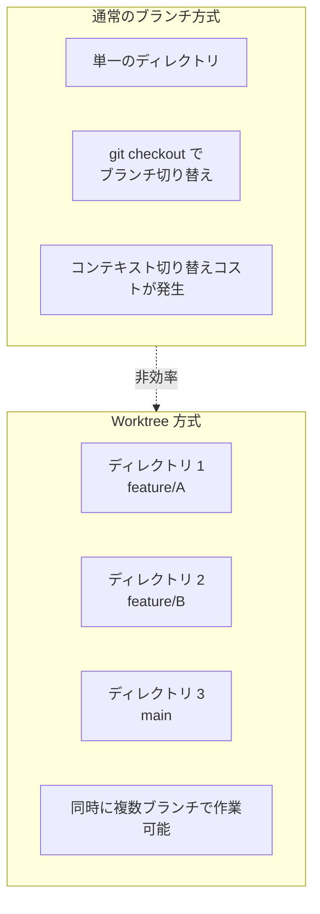
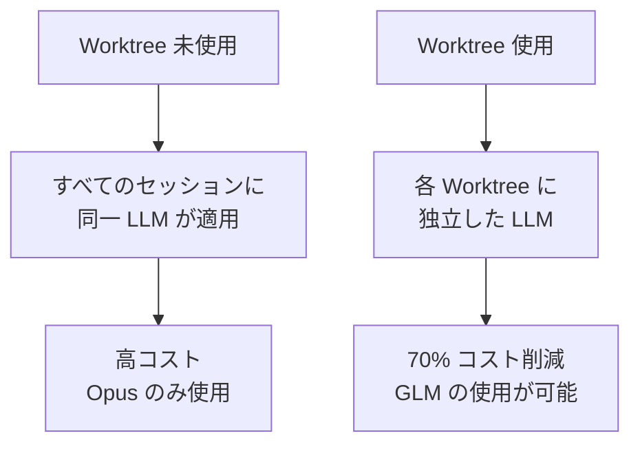
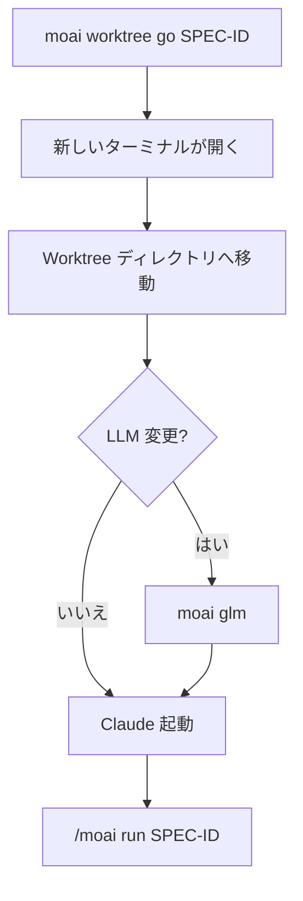
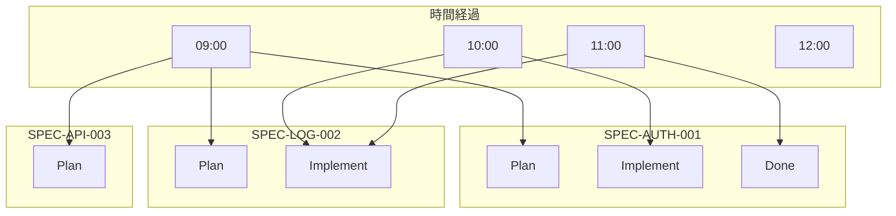
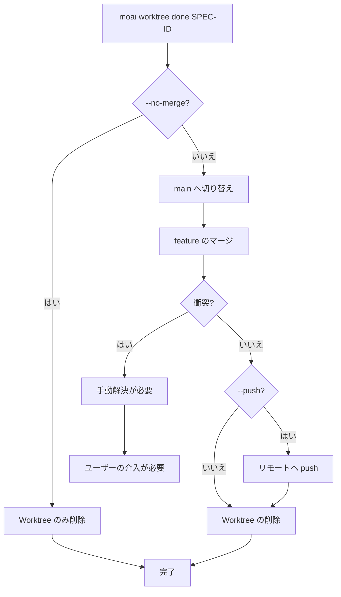
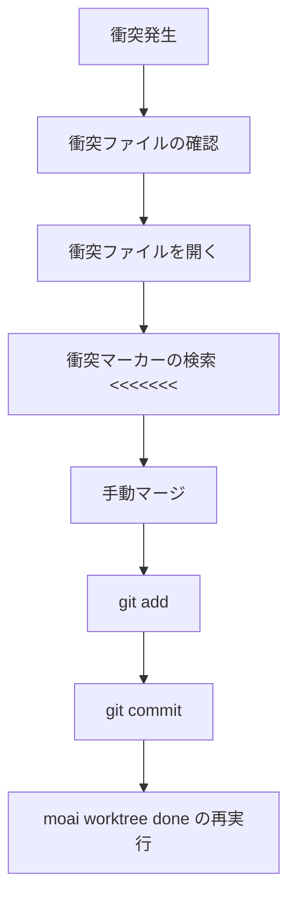
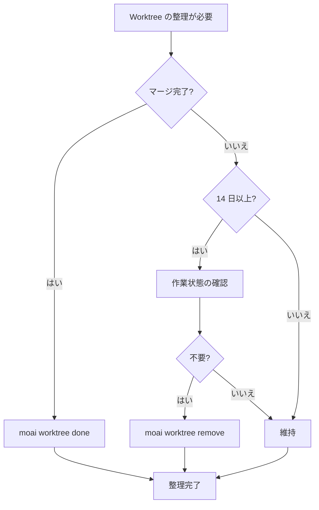
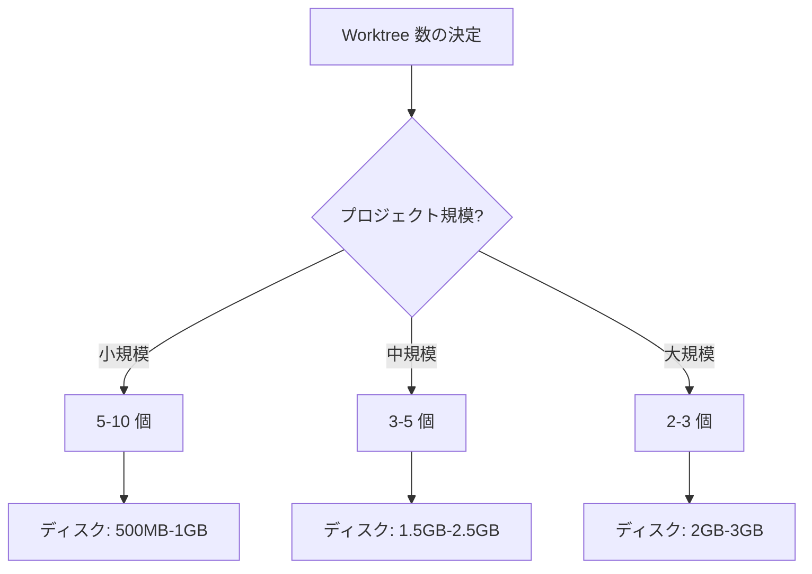
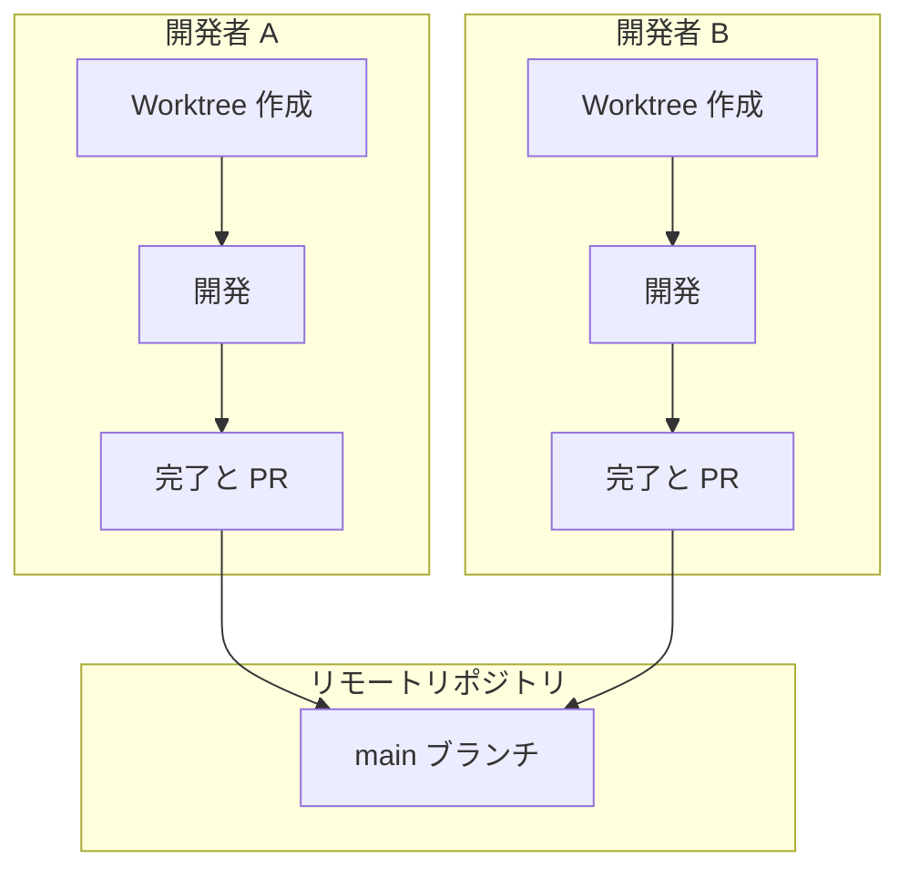

Git Worktree を使っていて遭遇する質問と問題を 1 か所にまとめました。

## 目次

1. [基本概念](#基本概念)
2. [使用に関して](#使用に関して)
3. [トラブルシューティング](#トラブルシューティング)
4. [パフォーマンスと最適化](#パフォーマンスと最適化)
5. [チームコラボレーション](#チームコラボレーション)

---

## 基本概念

### Q: Git Worktree と通常のブランチの違いは何ですか?

**A**: Git Worktree は **物理的に分離されたディレクトリ** で作業できるように
します:


```mermaid
graph TB
    subgraph Traditional["通常のブランチ方式"]
        T1[単一のディレクトリ]
        T2[git checkout で<br/>ブランチ切り替え]
        T3[コンテキスト切り替えコストが発生]
    end

    subgraph Worktree["Worktree 方式"]
        W1[ディレクトリ 1<br/>feature/A]
        W2[ディレクトリ 2<br/>feature/B]
        W3[ディレクトリ 3<br/>main]
        W4[同時に複数ブランチで作業可能]
    end

    Traditional -.->|非効率| Worktree
```

**主な違い**:

| 特徴          | 通常のブランチ         | Git Worktree    |
| ------------- | ------------------- | --------------- |
| 作業ディレクトリ | 1 つを共有            | N 個の独立        |
| ブランチ切り替え   | `git checkout` が必要 | ディレクトリ移動のみ |
| 同時作業     | 不可能              | 可能            |
| LLM 設定      | 共有される              | 独立            |
| 衝突の可能性   | 高い                | 低い            |

---

### Q: なぜ Worktree を使うべきですか?

**A**: 並列開発とトークノミクス、この 2 つの理由が核心です:

1. **LLM 設定の独立性** — SPEC ごとに異なる LLM を割り当てられます
   - Plan フェーズ: Opus (高品質な推論)
   - Implement フェーズ: GLM (低コスト)
   - Document フェーズ: Sonnet (中間)

2. **並列開発** — 複数の SPEC を同時に進められます
3. **衝突防止** — 独立した作業空間が衝突を最小化します
4. **コスト削減** — 実装フェーズに GLM を使うと約 70% コストが減ります


```mermaid
graph TB
    A[Worktree 未使用] --> B[すべてのセッションに<br/>同一 LLM が適用]
    B --> C[高コスト<br/>Opus のみ使用]

    D[Worktree 使用] --> E[各 Worktree に<br/>独立した LLM]
    E --> F[70% コスト削減<br/>GLM の使用が可能]
```

---

### Q: MoAI-ADK で Worktree は必須ですか?

**A**: いいえ、必須ではありませんが **強く推奨** します:

- **単一 SPEC 開発**: Worktree なしでも可能
- **複数 SPEC 開発**: Worktree が事実上必須
- **チームコラボレーション**: Worktree で衝突防止
- **コスト最適化**: Worktree で LLM を分離

---

## 使用に関して

### Q: Worktree の作成方法は?

**A**: 2 つの方法があります:

**方法 1: 自動作成 (推奨)**

```bash
# SPEC 計画段階で自動作成
> /moai plan "機能の説明" --worktree

# 自動的に:
# 1. SPEC ドキュメントの生成
# 2. Worktree の作成
# 3. Feature ブランチの作成
```

**方法 2: 手動作成**

```bash
# Worktree の手動作成
moai worktree new SPEC-AUTH-001

# 特定のブランチから作成
moai worktree new SPEC-AUTH-001 --from develop
```

---

### Q: Worktree にはどうやって入りますか?

**A**: `moai worktree go` コマンドを使用します:

```bash
# Worktree に入る
moai worktree go SPEC-AUTH-001

# 新しいターミナルが開き、Worktree へ移動
# プロンプトが変わる
(SPEC-AUTH-001) $
```

**入った後の作業フロー**:


```mermaid
flowchart TD
    A[moai worktree go SPEC-ID] --> B[新しいターミナルが開く]
    B --> C[Worktree ディレクトリへ移動]
    C --> D{LLM 変更?}
    D -->|はい| E[moai glm]
    D -->|いいえ| F[Claude 起動]
    E --> F
    F --> G["/moai run SPEC-ID"]
```

---

### Q: 複数の Worktree を同時に使えますか?

**A**: はい、無制限に可能です:

```bash
# Terminal 1
moai worktree go SPEC-AUTH-001
(SPEC-AUTH-001) $ moai glm

# Terminal 2
moai worktree go SPEC-LOG-002
(SPEC-LOG-002) $ moai glm

# Terminal 3
moai worktree go SPEC-API-003
(SPEC-API-003) $ moai glm

# すべて同時に作業可能
```

**並列作業の可視化**:


```mermaid
graph TB
    subgraph Time["時間経過"]
        T1[09:00]
        T2[10:00]
        T3[11:00]
        T4[12:00]
    end

    subgraph Worktree1["SPEC-AUTH-001"]
        W1A[Plan]
        W1B[Implement]
        W1C[Done]
    end

    subgraph Worktree2["SPEC-LOG-002"]
        W2A[Plan]
        W2B[Implement]
    end

    subgraph Worktree3["SPEC-API-003"]
        W3A[Plan]
    end

    T1 --> W1A
    T1 --> W2A
    T1 --> W3A

    T2 --> W1B
    T2 --> W2B

    T3 --> W1C
    T3 --> W2B
```

---

### Q: Worktree の完了方法は?

**A**: `moai worktree done` コマンドを使用します:

```bash
# 基本の完了 (マージ + クリーンアップ)
moai worktree done SPEC-AUTH-001

# リモートへの push まで
moai worktree done SPEC-AUTH-001 --push

# マージせずに削除のみ
moai worktree done SPEC-AUTH-001 --no-merge
```

**完了プロセス**:


```mermaid
flowchart TD
    A[moai worktree done SPEC-ID] --> B{--no-merge?}
    B -->|はい| C[Worktree のみ削除]
    B -->|いいえ| D[main へ切り替え]
    D --> E[feature のマージ]
    E --> F{衝突?}
    F -->|はい| G[手動解決が必要]
    F -->|いいえ| H{--push?}
    H -->|はい| I[リモートへ push]
    H -->|いいえ| J[Worktree の削除]
    I --> J
    C --> K[完了]
    J --> K
    G --> L[ユーザーの介入が必要]
```

---

## トラブルシューティング

### Q: Worktree の衝突が発生しました

**A**: 次のステップで解決してください:


```mermaid
flowchart TD
    A[衝突発生] --> B[衝突ファイルの確認]
    B --> C[衝突ファイルを開く]
    C --> D[衝突マーカーの検索 &lt;&lt;&lt;&lt;&lt;&lt;&lt;]
    D --> E[手動マージ]
    E --> F[git add]
    F --> G[git commit]
    G --> H[moai worktree done の再実行]
```

**実際の例**:

```bash
moai worktree done SPEC-AUTH-001
✗ マージ衝突が発生!

# 1. 衝突ファイルの確認
cd .moai/worktrees/SPEC-AUTH-001
git status
# 衝突ファイル: src/auth/jwt.ts

# 2. 衝突の解決
code src/auth/jwt.ts

# 3. 衝突マーカーの確認と修正
<<<<<<< HEAD
const secret = process.env.JWT_SECRET;
=======
const secret = config.jwt.secret;
>>>>>>> feature/SPEC-AUTH-001

# 4. マージ
const secret = process.env.JWT_SECRET || config.jwt.secret;

# 5. コミット
git add src/auth/jwt.ts
git commit -m "fix: resolve merge conflict"

# 6. 完了を再試行
cd /path/to/project
moai worktree done SPEC-AUTH-001
✓ 完了!
```

---

### Q: Worktree が破損しました

**A**: 次のステップで復旧してください:

```bash
# 1. 診断
moai worktree status SPEC-AUTH-001
✗ Worktree ディレクトリが存在しません

# 2. 既存の Worktree を削除
moai worktree remove SPEC-AUTH-001 --force

# 3. Worktree の再作成
moai worktree new SPEC-AUTH-001

# 4. 復旧の確認
moai worktree status SPEC-AUTH-001
✓ Worktree 正常
```

---

### Q: ディスク容量が不足しています

**A**: 古い Worktree を整理してください:

```bash
# 1. ディスク使用量の確認
$ du -sh .moai/worktrees/*
2.5G    .moai/worktrees/SPEC-AUTH-001
1.8G    .moai/worktrees/SPEC-LOG-002
3.2G    .moai/worktrees/SPEC-API-003

# 2. 古い Worktree の整理
$ moai worktree clean --older-than 14

# 整理される Worktree:
#   - SPEC-OLD-001 (30 日前, 2.1GB)
#   - SPEC-OLD-002 (45 日前, 1.7GB)

続行しますか? [y/N] y

✓ 2 つの Worktree を整理完了
✓ 3.8GB のディスク容量を確保
```

**クリーンアップ戦略**:


```mermaid
graph TD
    A[Worktree の整理が必要] --> B{マージ完了?}
    B -->|はい| C[moai worktree done]
    B -->|いいえ| D{14 日以上?}
    D -->|はい| E[作業状態の確認]
    D -->|いいえ| F[維持]
    E --> G{不要?}
    G -->|はい| H[moai worktree remove]
    G -->|いいえ| F
    C --> I[整理完了]
    H --> I
    F --> I
```

---

### Q: LLM が期待どおりに動作しません

**A**: Worktree ごとの LLM 設定を確認してください:

```bash
# 現在の LLM を確認
moai config
現在の LLM: GLM 5

# Worktree で LLM を変更
moai worktree go SPEC-AUTH-001
(SPEC-AUTH-001) $ moai cc
→ Claude Opus に変更されました

# 他の Worktree には影響なし
(SPEC-AUTH-001) $ exit
moai worktree go SPEC-LOG-002
(SPEC-LOG-002) $ moai config
現在の LLM: GLM 5 (変更なし)
```

---

### Q: Git コマンドが動作しません

**A**: 正しいディレクトリにいるか確認してください:

```bash
# Worktree ディレクトリの確認
pwd
/path/to/your-project/.moai/worktrees/SPEC-AUTH-001

# Git の状態確認
git status
On branch feature/SPEC-AUTH-001
nothing to commit, working tree clean

# もし Git エラーが発生したら
git fetch --all
git rebase origin/feature/SPEC-AUTH-001
```

---

## パフォーマンスと最適化

### Q: Worktree はパフォーマンスに影響しますか?

**A**: 影響はごくわずかです:

**長所**:

- 各 Worktree が独立しているためキャッシュが効率的
- Git 操作が高速 (ローカルブランチ)
- ファイルシステムキャッシュの活用

**短所**:

- ディスク容量の使用 (各 Worktree ごとに重複)
- 初回の Worktree 作成に時間がかかる

**最適化のヒント**:

```bash
# 1. 不要な Worktree の削除
moai worktree clean --merged-only

# 2. Git ガベージコレクション
git gc --aggressive --prune=now

# 3. Worktree の整理
git worktree prune
```

---

### Q: いくつの Worktree を作成できますか?

**A**: 理論上は無制限ですが、実際には次の要因が数を制限します:

**制限要因**:

1. **ディスク容量**: 各 Worktree は約 100MB-1GB を使用
2. **メモリ**: 各 Worktree で開いているセッション
3. **ファイルシステム**: 同時に開けるファイル数

**推奨事項**:

- **小規模プロジェクト**: 5-10 個の Worktree
- **中規模プロジェクト**: 3-5 個の Worktree
- **大規模プロジェクト**: 2-3 個の Worktree


```mermaid
graph TD
    A[Worktree 数の決定] --> B{プロジェクト規模?}
    B -->|小規模| C[5-10 個]
    B -->|中規模| D[3-5 個]
    B -->|大規模| E[2-3 個]

    C --> F[ディスク: 500MB-1GB]
    D --> G[ディスク: 1.5GB-2.5GB]
    E --> H[ディスク: 2GB-3GB]
```

---

### Q: Worktree を自動で整理できますか?

**A**: はい、定期的なクリーンアップスクリプトを使えます:

```bash
#!/bin/bash
# clean-worktrees.sh

# マージ済み Worktree の整理
moai worktree clean --merged-only

# 30 日以上経過した Worktree の整理
moai worktree clean --older-than 30

# Git ガベージコレクション
cd /path/to/project
git gc --aggressive --prune=now

echo "Worktree の整理完了"
```

**cron ジョブの設定**:

```bash
# 毎週日曜の午前 2 時に実行
0 2 * * 0 /path/to/clean-worktrees.sh >> /var/log/worktree-cleanup.log 2>&1
```

---

## チームコラボレーション

### Q: チームで Worktree をどう使いますか?

**A**: 次のようなワークフローを推奨します:


```mermaid
graph TB
    subgraph DevA["開発者 A"]
        A1[Worktree 作成]
        A2[開発]
        A3[完了と PR]
    end

    subgraph DevB["開発者 B"]
        B1[Worktree 作成]
        B2[開発]
        B3[完了と PR]
    end

    subgraph Remote["リモートリポジトリ"]
        R[main ブランチ]
    end

    A1 --> A2 --> A3 --> R
    B1 --> B2 --> B3 --> R
```

**チームコラボレーションガイド**:

1. **Worktree の命名規則**: `SPEC-{カテゴリ}-{番号}`
2. **定期的な同期**: `git pull origin main`
3. **PR レビューの前に**: ローカルでテスト完了
4. **衝突防止**: こまめに `main` と同期

---

### Q: Worktree とリモートリポジトリの同期方法は?

**A**: 定期的に `git pull` を実行してください:

```bash
# 各 Worktree で同期
moai worktree go SPEC-AUTH-001
(SPEC-AUTH-001) $ git pull origin main

# またはすべての Worktree を同期
for spec in $(moai worktree list --porcelain | awk '{print $1}'); do
    cd ~/.moai/worktrees/$spec
    echo "Syncing $spec..."
    git pull origin main
done
```

---

### Q: PR レビュー中に Worktree をどう管理しますか?

**A**: 次の戦略を使ってください:

```bash
# PR 作成前
moai worktree status SPEC-AUTH-001
# 状態の確認

git log main..feature/SPEC-AUTH-001
# 変更内容の確認

# PR レビュー中
# Worktree を維持 (マージ待ち)

# PR 承認後
moai worktree done SPEC-AUTH-001 --push
# マージとクリーンアップ

# PR 却下後
cd .moai/worktrees/SPEC-AUTH-001
# 修正作業を継続
```

---

## その他の質問

### Q: Worktree を使わずに MoAI-ADK を使えますか?

**A**: はい、可能ですが推奨しません:

```bash
# Worktree なしで使用
> /moai plan "機能の説明"
# Worktree 作成ステップをスキップ

# ただし次の問題が発生:
# 1. すべてのセッションに同一 LLM が適用
# 2. 並列開発が不可能
# 3. コンテキスト切り替えコスト
```

---

### Q: Worktree をバックアップすべきですか?

**A**: Worktree は Git で管理されるため、個別のバックアップは不要です:

```bash
# Worktree は Git の一部
# リモートリポジトリに push すれば自動バックアップ

# 定期的にリモートへ push
git push origin feature/SPEC-AUTH-001

# Worktree 喪失時の復旧
git fetch origin
git worktree add SPEC-AUTH-001 origin/feature/SPEC-AUTH-001
```

---

## 関連ドキュメント

- [Git Worktree 概要](/ja/worktree/)
- [完全ガイド](/ja/worktree/guide)
- [実際の使用例](/ja/worktree/examples)

## さらにサポートが必要ですか?

- [GitHub Issues](https://github.com/modu-ai/moai-adk/issues) — バグレポート、機能リクエスト
- [Discord コミュニティ](https://discord.gg/Z7E7Mdc5aN) — リアルタイムの交流、Tips の共有
