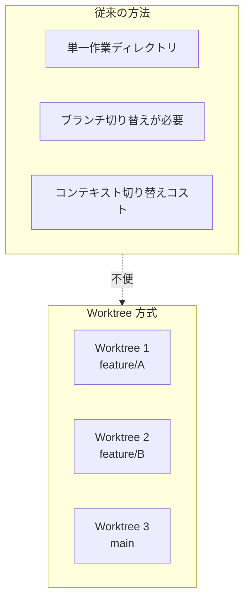
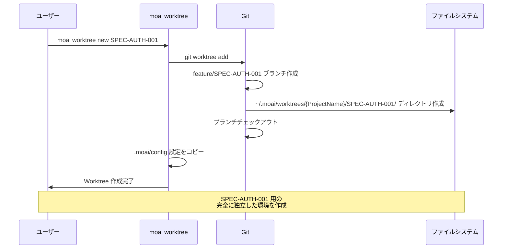
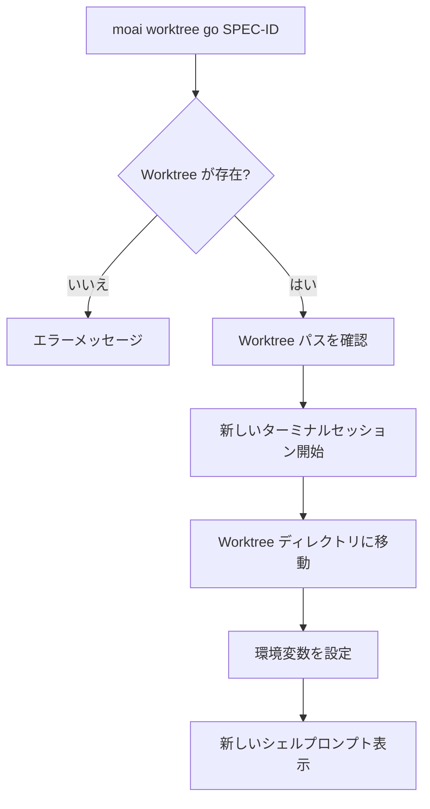
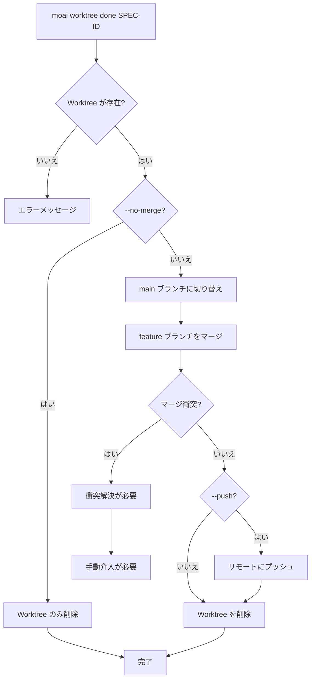
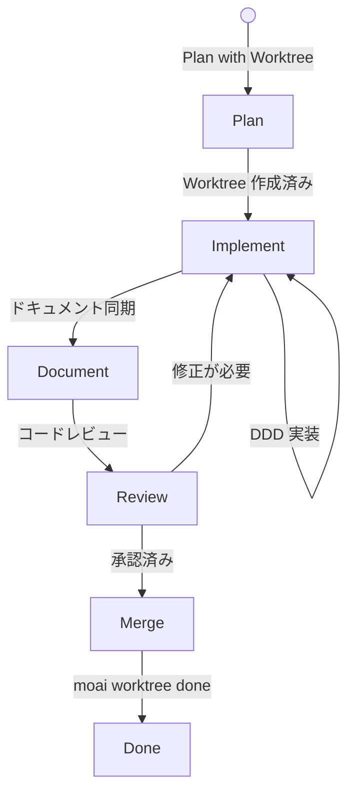
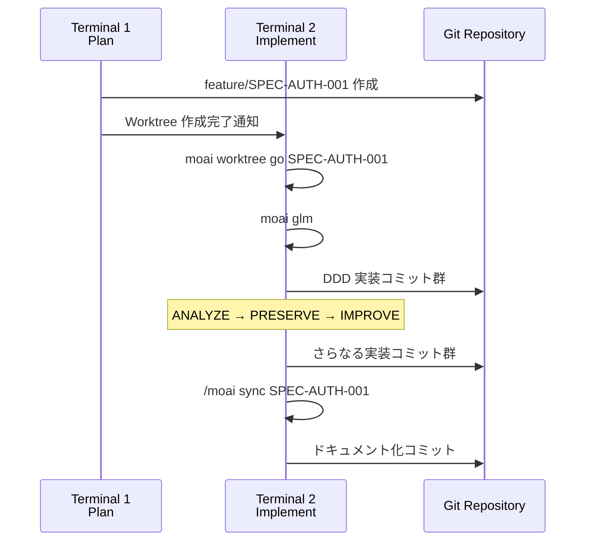
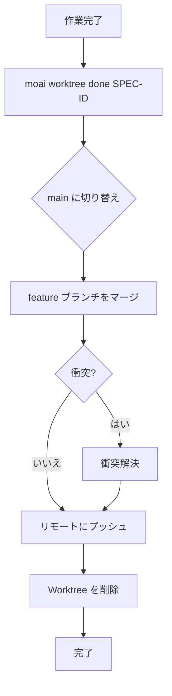
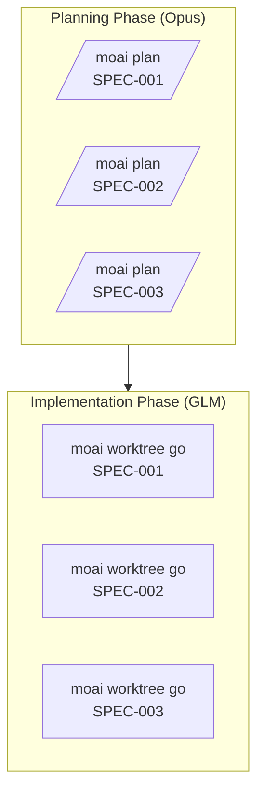
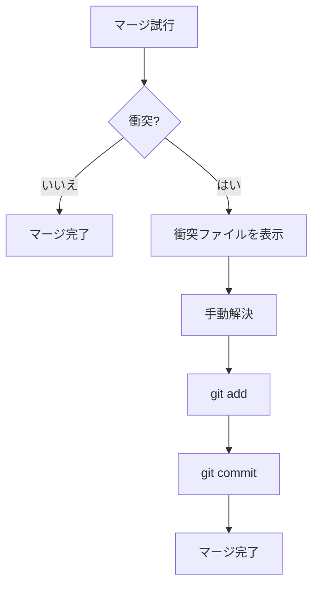
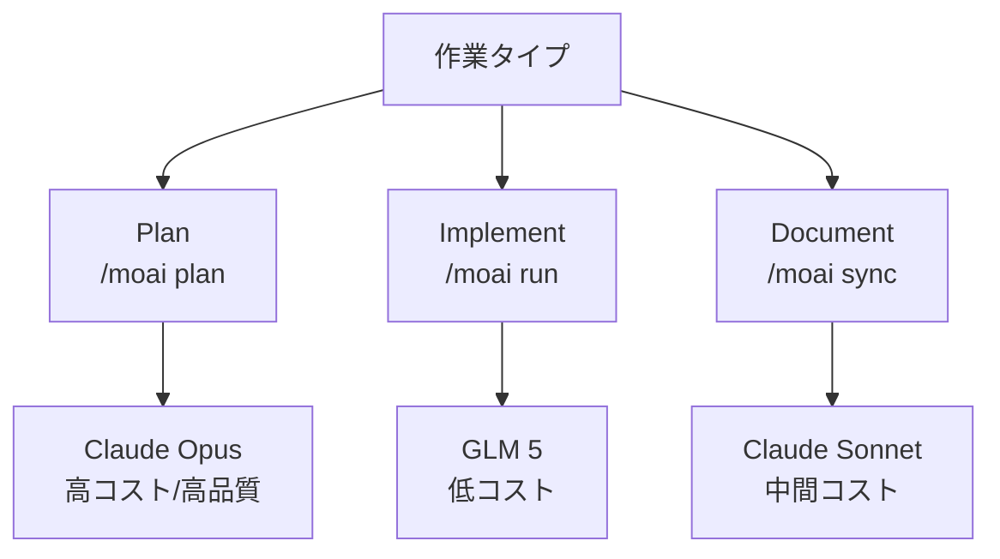

# Git Worktree 完全ガイド

このガイドは、Git Worktree を使用した MoAI-ADK 並列開発のすべての側面を詳細に説明します。

## 目次

1. [Worktree 基礎](#worktree-基礎)
2. [コマンド詳細リファレンス](#コマンド詳細リファレンス)
3. [ワークフローガイド](#ワークフローガイド)
4. [高度な機能](#高度な機能)
5. [ベストプラクティス](#ベストプラクティス)

---

## Worktree 基礎

### Git Worktree とは何ですか？

Git Worktree は **同じ Git リポジトリを複数のディレクトリで同時に作業** できるようにする Git の機能です。



### MoAI-ADK での Worktree

MoAI-ADK は Git Worktree を活用して **各 SPEC を完全に独立した環境** で開発できるようにします：

- **独立した Git 状態**: 各 Worktree は独自のブランチとコミット履歴を保持
- **分離された LLM 設定**: 各 Worktree で異なる LLM を使用可能
- **分離された作業スペース**: ファイルシステムレベルでの完全な分離

---

## コマンド詳細リファレンス

### moai worktree new

新しい Worktree を作成します。

#### 構文

```bash
moai worktree new SPEC-ID [options]
```

#### パラメータ

- **SPEC-ID** (必須): 作成する SPEC の ID (例: `SPEC-AUTH-001`)

#### オプション

- `-b, --branch BRANCH`: 使用するブランチ名を指定 (デフォルト: `feature/SPEC-ID`)
- `--from BASE`: 基準ブランチを指定 (デフォルト: `main`)
- `--force`: 既存の Worktree がある場合に強制再作成

#### 使用例

```bash
# 基本的な使用法
moai worktree new SPEC-AUTH-001

# 特定のブランチから作成
moai worktree new SPEC-AUTH-001 --from develop

# 強制再作成
moai worktree new SPEC-AUTH-001 --force
```

#### 動作プロセス



---

### moai worktree go

Worktree に入り、新しいシェルセッションを開始します。

#### 構文

```bash
moai worktree go SPEC-ID
```

#### パラメータ

- **SPEC-ID** (必須): 入る Worktree の ID

#### 使用例

```bash
# Worktree に入る
moai worktree go SPEC-AUTH-001

# 入った後 LLM を変更
moai glm

# Claude Code を開始
claude

# 作業開始
> /moai run SPEC-AUTH-001
```

#### 動作プロセス



---

### moai worktree list

すべての Worktree のリストを表示します。

#### 構文

```bash
moai worktree list [options]
```

#### オプション

- `-v, --verbose`: 詳細情報を含める
- `--porcelain`: パース可能な形式で出力

#### 使用例

```bash
# 基本リスト
moai worktree list

# 詳細情報
moai worktree list --verbose

# 出力例
SPEC-AUTH-001  feature/SPEC-AUTH-001  /path/to/worktree/SPEC-AUTH-001  [active]
SPEC-AUTH-002  feature/SPEC-AUTH-002  /path/to/worktree/SPEC-AUTH-002
SPEC-AUTH-003  feature/SPEC-AUTH-003  /path/to/worktree/SPEC-AUTH-003
```

---

### moai worktree done

Worktree の作業を完了し、マージ後クリーンアップします。

#### 構文

```bash
moai worktree done SPEC-ID [options]
```

#### パラメータ

- **SPEC-ID** (必須): 完了する Worktree の ID

#### オプション

- `--push`: マージ後リモートリポジトリにプッシュ
- `--no-merge`: マージせず Worktree のみ削除
- `--force`: 衝突があっても強制マージ

#### 使用例

```bash
# 基本マージとクリーンアップ
moai worktree done SPEC-AUTH-001

# リモートにプッシュ
moai worktree done SPEC-AUTH-001 --push

# マージせず削除のみ
moai worktree done SPEC-AUTH-001 --no-merge
```

#### 動作プロセス



---

### moai worktree remove

Worktree を削除します (マージなし)。

#### 構文

```bash
moai worktree remove SPEC-ID [options]
```

#### パラメータ

- **SPEC-ID** (必須): 削除する Worktree の ID

#### オプション

- `--force`: 変更があっても強制削除
- `--keep-branch`: ブランチは保持して Worktree のみ削除

#### 使用例

```bash
# 基本削除
moai worktree remove SPEC-AUTH-001

# 強制削除
moai worktree remove SPEC-AUTH-001 --force

# ブランチを保持
moai worktree remove SPEC-AUTH-001 --keep-branch
```

---

### moai worktree status

Worktree の状態を確認します。

#### 構文

```bash
moai worktree status [SPEC-ID]
```

#### パラメータ

- **SPEC-ID** (任意): 特定の Worktree の状態を確認 (指定しない場合はすべて表示)

#### 使用例

```bash
# すべての Worktree 状態
moai worktree status

# 特定の Worktree 状態
moai worktree status SPEC-AUTH-001

# 出力例
Worktree: SPEC-AUTH-001
Branch: feature/SPEC-AUTH-001
Path: /path/to/worktree/SPEC-AUTH-001
Status: Clean (2 commits ahead of main)
LLM: GLM 5
```

---

### moai worktree clean

マージされたり完了した Worktree をクリーンアップします。

#### 構文

```bash
moai worktree clean [options]
```

#### オプション

- `--merged-only`: マージされた Worktree のみクリーンアップ
- `--older-than DAYS`: N 日以上前の Worktree のみクリーンアップ
- `--dry-run`: 実際には削除せず表示のみ

#### 使用例

```bash
# マージされた Worktree をクリーンアップ
moai worktree clean --merged-only

# 7 日以上前の Worktree をクリーンアップ
moai worktree clean --older-than 7

# プレビュー
moai worktree clean --dry-run
```

---

### moai worktree config

Worktree の設定を確認または変更します。

#### 構文

```bash
moai worktree config [key] [value]
```

#### パラメータ

- **key** (任意): 設定キー
- **value** (任意): 設定値

#### 使用例

```bash
# すべての設定を表示
moai worktree config

# 特定の設定を確認
moai worktree config root

# 設定を変更
moai worktree config root /new/path/to/worktrees
```

---

## ワークフローガイド

### 完全な開発サイクル



### フェーズ 1: SPEC 計画

```bash
# Terminal 1 で
> /moai plan "ユーザー認証システム実装" --worktree
```

**出力**:

```
✓ SPEC ドキュメント作成: .moai/specs/SPEC-AUTH-001/spec.md
✓ Worktree 作成: ~/.moai/worktrees/{ProjectName}/SPEC-AUTH-001
✓ ブランチ作成: feature/SPEC-AUTH-001
✓ ブランチ切り替え完了

次のステップ:
1. 新しいターミナルで実行: moai worktree go SPEC-AUTH-001
2. LLM 変更: moai glm
3. 開発開始: claude
```

### フェーズ 2: 実装

```bash
# Terminal 2 で
moai worktree go SPEC-AUTH-001

# Worktree に入るとプロンプトが変わる
(SPEC-AUTH-001) $ moai glm
→ GLM 5 に設定されました

(SPEC-AUTH-001) $ claude
> /moai run SPEC-AUTH-001
```

**作業フロー**:



### フェーズ 3: 完了およびマージ

```bash
# Terminal 2 で作業完了後
exit

# Terminal 1 で
moai worktree done SPEC-AUTH-001 --push
```

**プロセス**:



---

## 高度な機能

### 並列作業戦略

#### 戦略 1: Plan と Implement の分離



#### 戦略 2: 同時開発

```bash
# Terminal 1: SPEC-001 Plan
> /moai plan "認証" --worktree

# Terminal 2: SPEC-002 Plan (完了後)
> /moai plan "ログ" --worktree

# Terminal 3, 4, 5: 並列実装
moai worktree go SPEC-001 && moai glm  # Terminal 3
moai worktree go SPEC-002 && moai glm  # Terminal 4
moai worktree go SPEC-003 && moai glm  # Terminal 5
```

### Worktree 間の切り替え

```bash
# 現在の Worktree を確認
moai worktree status

# 別の Worktree に切り替え
moai worktree go SPEC-AUTH-002

# または直接移動
cd ~/.moai/worktrees/SPEC-AUTH-002
```

### 衝突解決



---

## ベストプラクティス

### 1. Worktree 命名規則

```bash
# 良い例
moai worktree new SPEC-AUTH-001      # 明確な SPEC ID
moai worktree new SPEC-FRONTEND-007  # カテゴリを含む

# 避けるべき例
moai worktree new feature-branch     # SPEC ID 未使用
moai worktree new temp               # 曖昧な名前
```

### 2. 定期的なクリーンアップ

```bash
# 毎週実行
moai worktree clean --merged-only

# 毎月実行
moai worktree clean --older-than 30
```

### 3. LLM 選択ガイド



### 4. コミットメッセージ規則

```bash
# Worktree でコミットする時
git commit -m "feat(SPEC-AUTH-001): JWT ベース認証実装

- JWT トークン生成/検証ロジック追加
- リフレッシュトークンローテーション実装
- ログアウト時トークン無効化

Co-Authored-By: Claude <noreply@anthropic.com>"
```

### 5. ターミナル管理

```bash
# 各 Worktree に別ターミナルを使用
# iTerm2、VS Code、または tmux 使用推奨

# tmux 例
tmux new-session -d -s spec-001 'moai worktree go SPEC-001'
tmux new-session -d -s spec-002 'moai worktree go SPEC-002'

# セッション切り替え
tmux attach-session -t spec-001
```

### 6. 進捗状況の追跡

```bash
# すべての Worktree 状態を確認
moai worktree status --verbose

# Git ログを確認
cd ~/.moai/worktrees/{ProjectName}/SPEC-AUTH-001
git log --oneline --graph --all

# 変更を確認
git diff main
```

## 関連ドキュメント

- [Git Worktree 概要](./index)
- [実際の使用例](./examples)
- [よくある質問](./faq)
