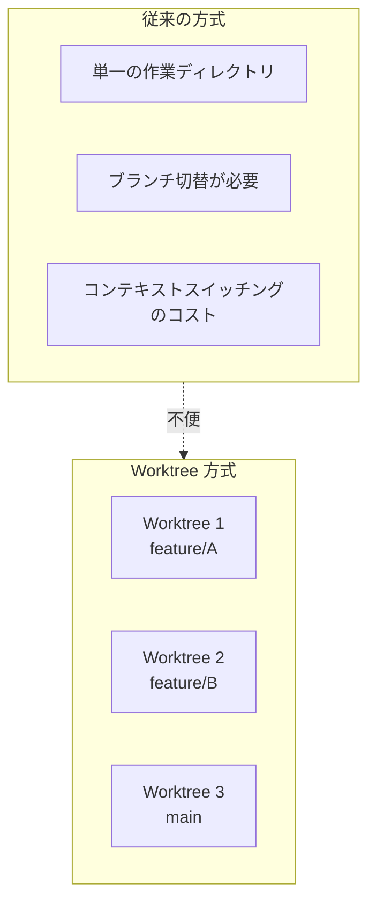
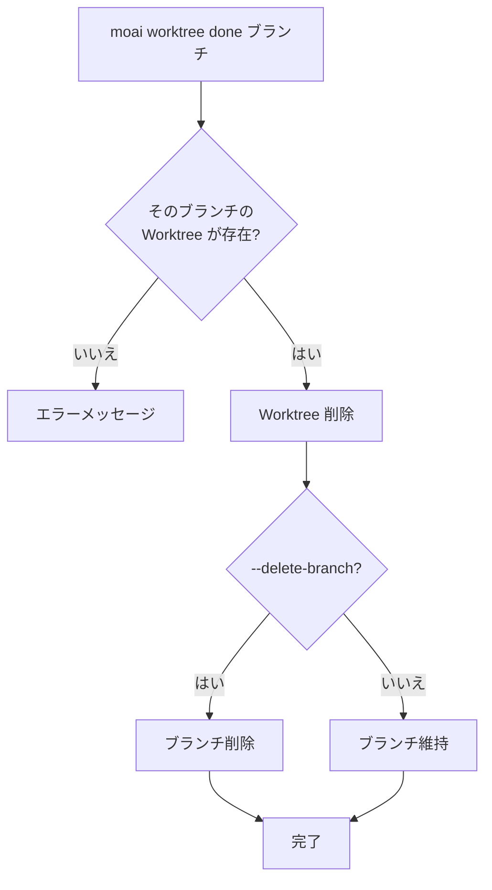
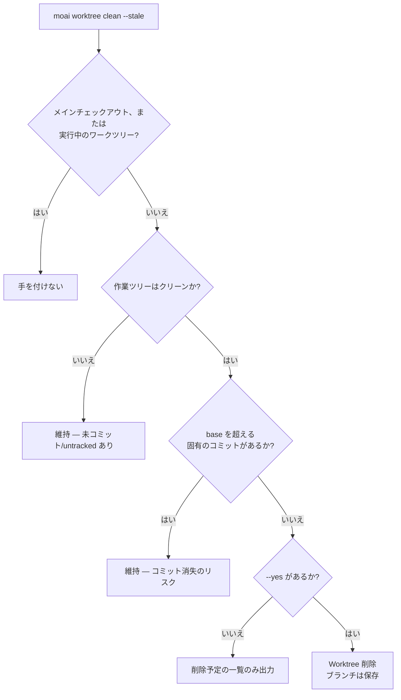
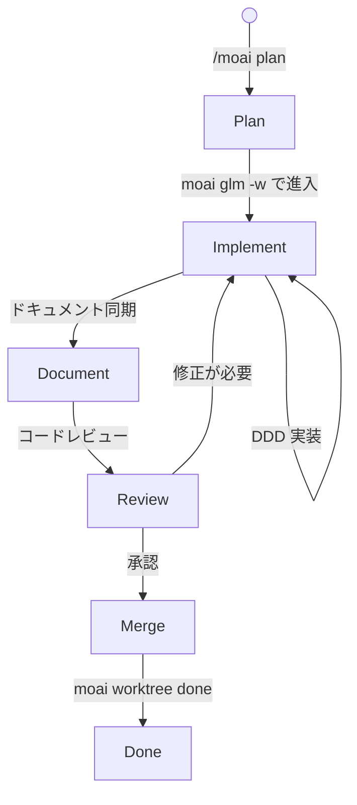
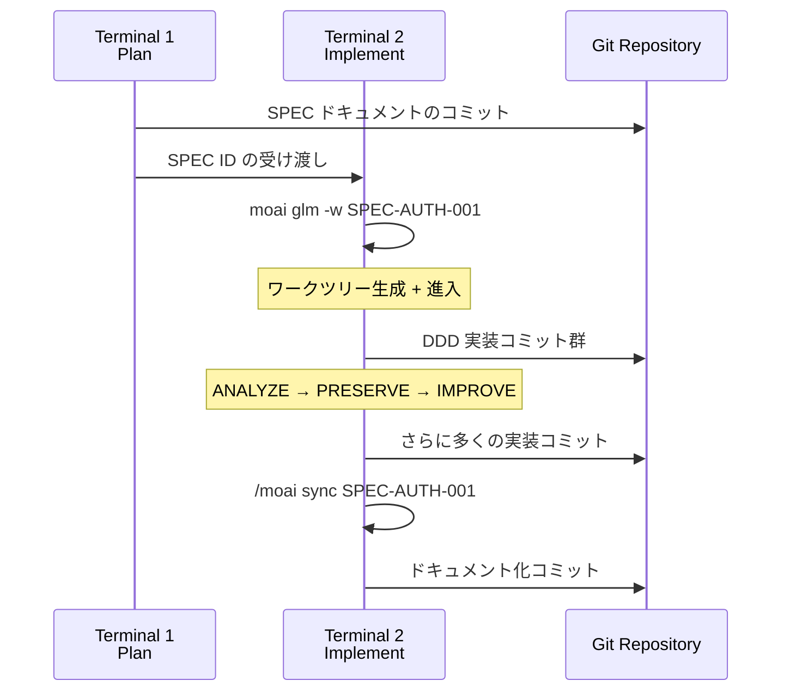
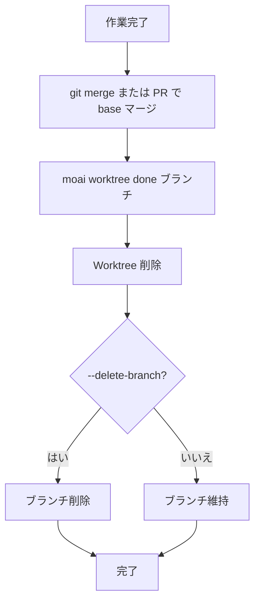
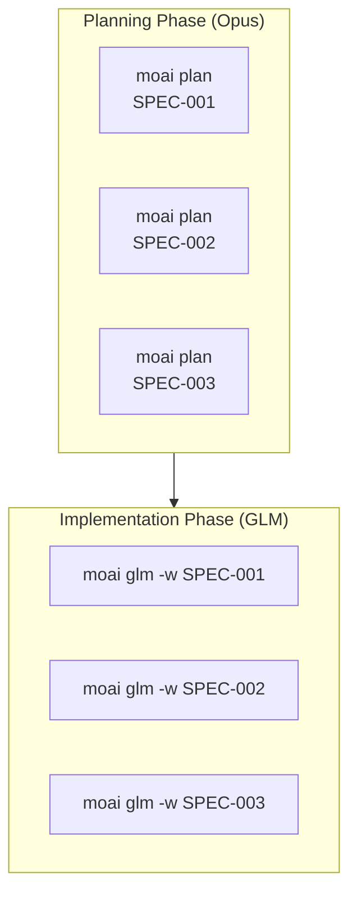
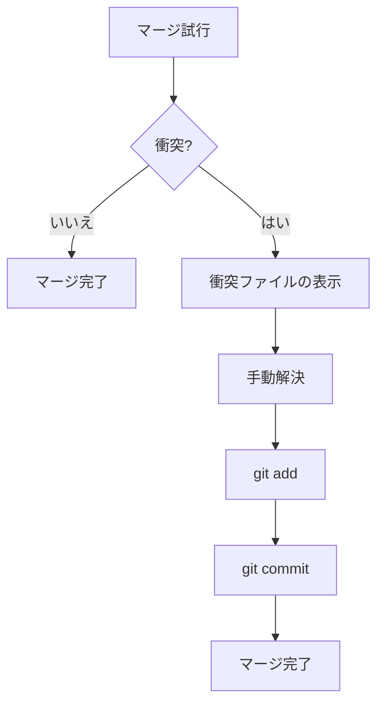
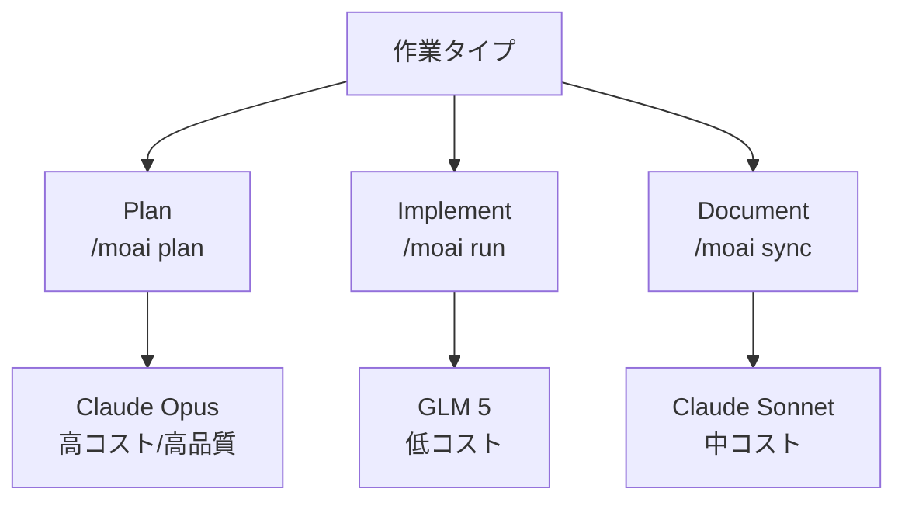

Git Worktree で MoAI-ADK 並列開発を進める方法を 1 編にまとめました。基礎概念から
コマンドリファレンス、ワークフロー、ベストプラクティスまで扱います。

## 目次

1. [Worktree の基礎](#worktree-の基礎)
2. [コマンド詳細参照](#コマンド詳細参照)
3. [ワークフローガイド](#ワークフローガイド)
4. [高度な機能](#高度な機能)
5. [ベストプラクティス](#ベストプラクティス)

---

## Worktree の基礎

### Git Worktree とは何ですか?

Git Worktree は **1 つの Git リポジトリを複数のディレクトリで同時に作業** できるように
してくれる Git 内蔵機能です。ブランチを行き来するたびに `git checkout` でコンテキストを
入れ替える代わりに、ブランチごとにディレクトリを 1 つずつ開いておきます。


```mermaid
graph TD
    subgraph Traditional["従来の方式"]
        T1[単一の作業ディレクトリ]
        T2[ブランチ切替が必要]
        T3[コンテキストスイッチングのコスト]
    end

    subgraph Worktree["Worktree 方式"]
        W1[Worktree 1<br/>feature/A]
        W2[Worktree 2<br/>feature/B]
        W3[Worktree 3<br/>main]
    end

    Traditional -.->|不便| Worktree
```

### MoAI-ADK での Worktree

MoAI-ADK はこの機能の上に SPEC 単位の隔離環境を載せます。SPEC ごとに環境が完全に
分かれるため、エージェントが並列に動いても互いの作業を上書きしません:

- **独立した Git 状態** — Worktree ごとに自身のブランチとコミット履歴が別々に積み上がります
- **分離された LLM 設定** — Worktree ごとに異なる LLM 実行モードを使えます。
  計画には Claude、実装には GLM を割り当てるトークノミクス運用がここから出てきます
- **隔離された作業空間** — ファイルシステムのレベルで完全に分かれます

### 役割分担: 進入はランチャー、管理は worktree、一覧表示は git

3 つの仕事がそれぞれ別のコマンドに分かれています。この境界を先に押さえておくと、
残りが読みやすくなります。

| やりたいこと | 担当 |
|-------------|------|
| Worktree を作る · 入る | ランチャー `moai cc` · `moai glm` · `moai cg` の `-w` フラグ |
| Worktree の一覧を見る | `git worktree list` |
| 同期 · 整理 · 復旧 · 状態ガード | `moai worktree` (エイリアス `moai wt`) のサブコマンド |

---

## コマンド詳細参照

### Worktree の作成と進入

`moai worktree` に生成コマンドはありません。ワークツリーはランチャーの `-w` フラグが
作り、その場でセッションまで起動します。

#### 文法

```bash
moai cc  -w [名前] [--spawn]
moai glm -w [名前] [--spawn]
moai cg  -w [名前] [--spawn]
```

#### `-w` の値が解釈される仕組み

- **短い名前** (`feat-auth`) — `.claude/worktrees/feat-auth/` の下で解決されます。
  存在しなければ新しく作られます
- **絶対パス** — `~/.moai/worktrees/` または `<プロジェクト>/.claude/worktrees/`
  配下の既存ワークツリーへ再進入します
- **値の省略** (`-w` のみ) — 名前が自動で付けられます
- 上の 2 つの接頭辞から外れた絶対パスは拒否されます。うっかり見当違いの場所に
  ワークツリーができるのを防ぐためです

#### `--spawn`: 現在のセッションを守りつつもう 1 つ開く

`-w` だけを渡すと、現在のプロセスがワークツリーのセッションに**置き換わります**。今の
ウィンドウをそのまま残してワークツリーをもう 1 つ開くには `--spawn` を付けます。tmux の
新しいウィンドウが立ち上がり (フォーカスはそのまま)、移動先の pane ID が出力されます。

`--spawn` は tmux セッションの中でのみ動作します。tmux の外で使うと、何も変更せずに
エラー終了します。

#### 使用例

```bash
# ワークツリーを作りながら Claude バックエンドで進入
moai cc -w feat-auth

# 同じワークツリーへ GLM バックエンドで進入
moai glm -w feat-auth

# 現在のセッションを保ったまま新しい tmux ウィンドウで GLM チームメイトを起動
moai cg -w feat-auth --spawn

# 任意の場所にワークツリーを自分で作りたいときは git をそのまま使う
git worktree add -b feature/SPEC-AUTH-001 \
    ~/.moai/worktrees/your-project/SPEC-AUTH-001 origin/main
moai glm -w ~/.moai/worktrees/your-project/SPEC-AUTH-001
```

#### 一覧の確認

```bash
git worktree list
```

---

### moai worktree sync

Worktree を base ブランチの変更内容と同期します。

#### 文法

```bash
moai worktree sync [branch-name]
```

#### パラメータ

- **branch-name** (任意): 同期するワークツリーのブランチ。省略すると現在のディレクトリの
  ワークツリーが対象になります

#### オプション

- `--base BRANCH`: 基準ブランチ (デフォルト値: `main`)
- `--strategy MODE`: `merge` (デフォルト値) または `rebase`

#### 使用例

```bash
# 現在のディレクトリの Worktree を main と同期 (merge 戦略、デフォルト)
moai worktree sync

# 特定の Worktree を rebase 戦略で同期
moai worktree sync feature/SPEC-AUTH-001 --strategy rebase

# 別の base ブランチを基準にする
moai worktree sync feature/SPEC-AUTH-001 --base develop
```

---

### moai worktree done

ブランチに紐づく Worktree を消し、必要ならブランチまで削除します。ただし**マージも
プッシュも行いません**。base ブランチへマージする作業は `git merge` や PR で別途
進めてください。

#### 文法

```bash
moai worktree done <branch-name>
```

#### パラメータ

- **branch-name** (必須、ちょうど 1 個): 整理するワークツリーのブランチ名。
  `SPEC-AUTH-001` のような SPEC ID 形式を渡すと `feature/SPEC-AUTH-001` に展開されます

#### オプション

- `--force`: コミットされていない変更があっても強制削除
- `--delete-branch`: Worktree 削除後にブランチも削除
- `--auto`: 自動化用の無出力モード。ワークツリーが見つからなくてもエラー終了しないので、
  PR マージ直後の整理ステップに組み込むのに向いています

#### 使用例

```bash
# Worktree 削除
moai worktree done feature/SPEC-AUTH-001

# Worktree 削除 + ブランチ削除
moai worktree done feature/SPEC-AUTH-001 --delete-branch

# PR マージ後の自動整理 (無出力)
moai worktree done feature/SPEC-AUTH-001 --auto
```

#### 動作プロセス


```mermaid
flowchart TD
    A[moai worktree done ブランチ] --> B{そのブランチの<br/>Worktree が存在?}
    B -->|いいえ| C[エラーメッセージ]
    B -->|はい| D[Worktree 削除]
    D --> E{--delete-branch?}
    E -->|はい| F[ブランチ削除]
    E -->|いいえ| G[ブランチ維持]
    F --> H[完了]
    G --> H[完了]
```

---

### moai worktree remove

Worktree を削除します (マージなし)。ブランチは維持されます。

#### 文法

```bash
moai worktree remove <path>
```

#### パラメータ

- **path** (必須、ちょうど 1 個): 削除する Worktree の**ファイルシステムのパス**。
  ブランチ名でも SPEC ID でもありません

#### オプション

- `--force`: コミットされていない変更があっても強制削除

#### 使用例

```bash
# 基本削除
moai worktree remove ~/.moai/worktrees/your-project/SPEC-AUTH-001

# 強制削除
moai worktree remove ~/.moai/worktrees/your-project/SPEC-AUTH-001 --force
```

---

### moai worktree clean

stale な参照を整理し、マージ済みまたは放置された Worktree を選んで削除します。

#### 文法

```bash
moai worktree clean [options]
```

#### オプション

- (フラグなし): stale なワークツリー参照のみ prune
- `--merged-only`: ブランチが base へマージされた Worktree のみ削除
- `--stale`: 失うもののない放置された Worktree をまとめて整理 (デフォルトはプレビュー)
- `--yes`: `--stale` のプレビューではなく実際の削除を実行
- `--base BRANCH`: `--merged-only` · `--stale` の判定に使う base ブランチ (デフォルト値: `main`)

`--stale` と `--merged-only` は同時に使えません。

#### --stale の安全ルール

`--stale` は次の 2 つの条件を**すべて**満たすワークツリーだけを削除対象に分類します。

1. 作業ツリーがクリーンである — 未コミットの変更も untracked ファイルもない
2. ブランチに base を超える固有のコミットがない

どちらか 1 つでも外れるとそのワークツリーは維持され、維持した理由が併せて出力されます。
**ブランチはいかなる場合も削除しません** — ワークツリーのディレクトリが消えても、コミットは
ブランチ名のまま残ります。メインチェックアウトと、今コマンドを実行中のワークツリーは常に
保護対象から外れません。


```mermaid
flowchart TD
    A[moai worktree clean --stale] --> B{メインチェックアウト、または<br/>実行中のワークツリー?}
    B -->|はい| C[手を付けない]
    B -->|いいえ| D{作業ツリーはクリーンか?}
    D -->|いいえ| E[維持 — 未コミット/untracked あり]
    D -->|はい| F{base を超える<br/>固有のコミットがあるか?}
    F -->|はい| G[維持 — コミット消失のリスク]
    F -->|いいえ| H{--yes があるか?}
    H -->|いいえ| I[削除予定の一覧のみ出力]
    H -->|はい| J[Worktree 削除<br/>ブランチは保存]
```

#### 使用例

```bash
# stale な参照のみ整理
moai worktree clean

# マージ済みの Worktree を整理 (base=main)
moai worktree clean --merged-only

# 別の base ブランチを基準に整理
moai worktree clean --merged-only --base develop

# 放置された Worktree のプレビュー — 何も削除しない
moai worktree clean --stale

# プレビュー内容を確認したうえで実際に削除
moai worktree clean --stale --yes
```


 `--stale` はプレビューがデフォルト値です。一覧を目で確認して
から `--yes` を付けて実行し直してください。


---

### moai worktree recover

ディスクをスキャンし `git worktree repair` を実行して、壊れた Worktree レジストリを
復旧します。復旧後は stale な参照を prune し、最終的に認識されたワークツリーの一覧を
出力します。フラグはありません。

```bash
moai worktree recover
```

---

### 状態ガード: snapshot · verify · restore

次の 3 つのコマンドは、オーケストレーターが `Agent(isolation: "worktree")` を呼び出す
前後で作業ツリーの状態を取得し、照合し、戻すために使う状態ガードのプリミティブです。

#### moai worktree snapshot

HEAD · ブランチ · porcelain · `.moai/specs/` 配下の untracked ファイルの状態を取得し、
`.moai/state/` へ JSON として記録します。

オプション: `--out` (保存先パス、デフォルト値 `.moai/state/worktree-snapshot-<id>.json`)、
`--agent-name` (エージェント名の記録)。

```bash
moai worktree snapshot --agent-name my-agent --out .moai/state/snap.json
```

#### moai worktree verify

現在の作業ツリーをスナップショットと突き合わせます。`--snapshot` は必須で、
`--agent-response` を渡すとエージェント応答 JSON の空の `worktreePath` まで検出します。

終了コード: `0`=clean、`1`=divergence、`2`=suspect (空の worktreePath)、`3`=両方。

```bash
moai worktree verify --snapshot .moai/state/snap.json --agent-name my-agent
```

#### moai worktree restore

`git restore --source=<snapshot HEAD> --staged --worktree :/` を実行し、追跡中の
ファイルをスナップショット HEAD の状態へ戻します。Untracked ファイルは git で復元できない
ためパスを知らせるだけで、自分で作り直す必要があります。

```bash
moai worktree restore --snapshot .moai/state/snap.json

# 実行せずコマンドのみ出力
moai worktree restore --snapshot .moai/state/snap.json --dry-run
```


 `restore` は追跡ファイルのローカル変更を捨てます。戻す前に
残しておくものがないか確認してください。


---

## ワークフローガイド

### 完全な開発サイクル


```mermaid
flowchart TD
    Start(( )) -->|"/moai plan"| Plan["Plan"]
    Plan -->|"moai glm -w で進入"| Implement["Implement"]
    Implement -->|"DDD 実装"| Implement
    Implement -->|"ドキュメント同期"| Document["Document"]
    Document -->|"コードレビュー"| Review["Review"]
    Review -->|"承認"| Merge["Merge"]
    Review -->|"修正が必要"| Implement
    Merge -->|"moai worktree done"| Done["Done"]
```

### ステップ 1: SPEC 計画 (Phase 1)

計画はメインチェックアウトで進めます。

```bash
# Terminal 1 で
> /moai plan "ユーザー認証システムの実装"
```

**出力 (例)**:

```
✓ SPEC ドキュメント生成: .moai/specs/SPEC-AUTH-001/spec.md

次のステップ:
1. 新しいターミナルで実行: moai glm -w SPEC-AUTH-001
2. 開発開始: /moai run SPEC-AUTH-001
```

### ステップ 2: 実装 (Phase 2)

```bash
# Terminal 2 で — ワークツリーを作りながら GLM バックエンドで進入
$ moai glm -w SPEC-AUTH-001

# 進入したセッションからそのまま実行
> /moai run SPEC-AUTH-001
```

**作業の流れ**:


```mermaid
sequenceDiagram
    participant T1 as Terminal 1<br/>Plan
    participant T2 as Terminal 2<br/>Implement
    participant Git as Git Repository

    T1->>Git: SPEC ドキュメントのコミット
    T1->>T2: SPEC ID の受け渡し

    T2->>T2: moai glm -w SPEC-AUTH-001
    Note over T2: ワークツリー生成 + 進入
    T2->>Git: DDD 実装コミット群
    Note over T2: ANALYZE → PRESERVE → IMPROVE

    T2->>Git: さらに多くの実装コミット
    T2->>T2: /moai sync SPEC-AUTH-001
    T2->>Git: ドキュメント化コミット
```

### ステップ 3: 完了およびマージ (Phase 3)

```bash
# Terminal 2 で作業完了後 (push は別途 git/PR で進行)
exit

# base ブランチのマージは git merge または PR で処理した後、
# Terminal 1 で Worktree 整理
moai worktree done feature/SPEC-AUTH-001 --delete-branch
```

**プロセス**:


```mermaid
flowchart TD
    A[作業完了] --> B[git merge または PR で base マージ]
    B --> C[moai worktree done ブランチ]
    C --> D[Worktree 削除]
    D --> E{--delete-branch?}
    E -->|はい| F[ブランチ削除]
    E -->|いいえ| G[ブランチ維持]
    F --> H[完了]
    G --> H[完了]
```

---

## 高度な機能

### 並列作業戦略

#### 戦略 1: Plan と Implement の分離

トークノミクスの基本戦略です。計画ステップは推論の強いモデル (Opus) にまとめて処理し、
実装ステップは安価なモデル (GLM) で複数に分散させます:


```mermaid
graph TD
    subgraph Planning["Planning Phase (Opus)"]
        P1["moai plan<br/>SPEC-001"]
        P2["moai plan<br/>SPEC-002"]
        P3["moai plan<br/>SPEC-003"]
    end

    subgraph Implementation["Implementation Phase (GLM)"]
        I1["moai glm -w SPEC-001"]
        I2["moai glm -w SPEC-002"]
        I3["moai glm -w SPEC-003"]
    end

    Planning --> Implementation
```

#### 戦略 2: 同時開発

```bash
# Terminal 1: 計画をまとめて処理
> /moai plan "認証"
> /moai plan "ログ"

# Terminal 3, 4, 5: 並列実装 (各ターミナルで 1 行ずつ)
moai glm -w SPEC-001   # Terminal 3
moai glm -w SPEC-002   # Terminal 4
moai glm -w SPEC-003   # Terminal 5
```

tmux を使っているなら、ウィンドウを移動せずに 1 つのターミナルからすべて起動できます:

```bash
moai glm -w SPEC-001 --spawn
moai glm -w SPEC-002 --spawn
moai glm -w SPEC-003 --spawn
```

### Worktree 間の切替

```bash
# 現在どの Worktree があるか確認
git worktree list

# 別の Worktree のセッションへ進入
moai glm -w SPEC-AUTH-002
```

### 衝突の解決


```mermaid
flowchart TD
    A[マージ試行] --> B{衝突?}
    B -->|いいえ| C[マージ完了]
    B -->|はい| D[衝突ファイルの表示]
    D --> E[手動解決]
    E --> F[git add]
    F --> G[git commit]
    G --> H[マージ完了]
```

---

## ベストプラクティス

### 1. Worktree 命名規則

```bash
# 良い例
moai glm -w SPEC-AUTH-001      # 明確な SPEC ID
moai glm -w SPEC-FRONTEND-007  # カテゴリを含む

# 避けるべき例
moai glm -w feature-branch     # SPEC ID を使わない
moai glm -w temp               # 曖昧な名前
```

### 2. 定期的な整理

```bash
# マージ済みの Worktree を定期整理
moai worktree clean --merged-only

# 放置された Worktree を確認してから整理
moai worktree clean --stale
moai worktree clean --stale --yes
```

### 3. LLM 選択ガイド

作業ステップごとにモデルを分けて割り当てるのが Worktree トークノミクスの核心です:


```mermaid
graph TD
    A[作業タイプ] --> B[Plan<br/>/moai plan]
    A --> C[Implement<br/>/moai run]
    A --> D[Document<br/>/moai sync]

    B --> E[Claude Opus<br/>高コスト/高品質]
    C --> F[GLM 5<br/>低コスト]
    D --> G[Claude Sonnet<br/>中コスト]
```

### 4. コミットメッセージ規則

```bash
# Worktree でコミットするとき
git commit -m "feat(SPEC-AUTH-001): JWT ベースの認証を実装

- JWT トークン生成/検証ロジックを追加
- リフレッシュトークンローテーションを実装
- ログアウト時のトークン無効化

Co-Authored-By: Claude <noreply@anthropic.com>"
```

### 5. ターミナル管理

`--spawn` が tmux ウィンドウの管理を肩代わりするので、セッションを手で作る場面は
ほとんどありません。

```bash
# tmux の中でワークツリーセッションを 3 つまとめて起動
moai glm -w SPEC-001 --spawn
moai glm -w SPEC-002 --spawn
moai cc  -w SPEC-003 --spawn

# 出力された pane ID で移動
tmux select-window -t %7
```

### 6. 進行状況の追跡

```bash
# 登録された Worktree の確認
git worktree list

# Git ログの確認
git -C ~/.moai/worktrees/your-project/SPEC-AUTH-001 log --oneline --graph --all

# 変更内容の確認
git -C ~/.moai/worktrees/your-project/SPEC-AUTH-001 diff main
```

## 関連ドキュメント

- [Git Worktree 概要](/ja/worktree/)
- [実際の使用例](/ja/worktree/examples)
- [よくある質問](/ja/worktree/faq)
- [moai worktree CLI リファレンス](/ja/cli-reference/worktree)
