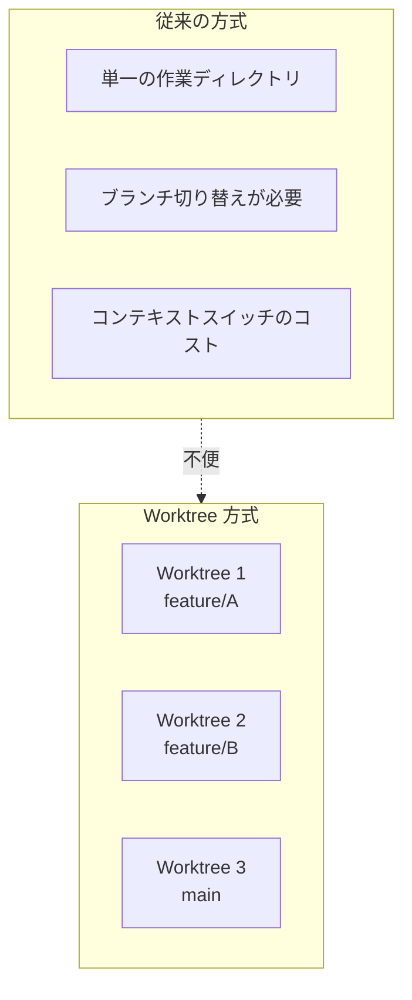
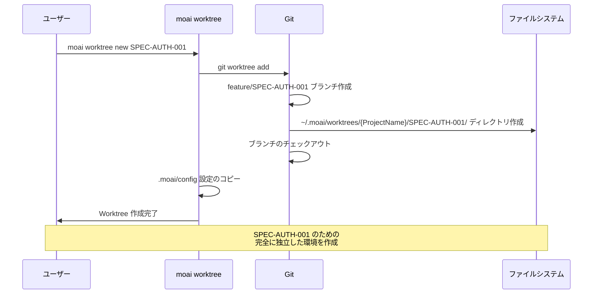
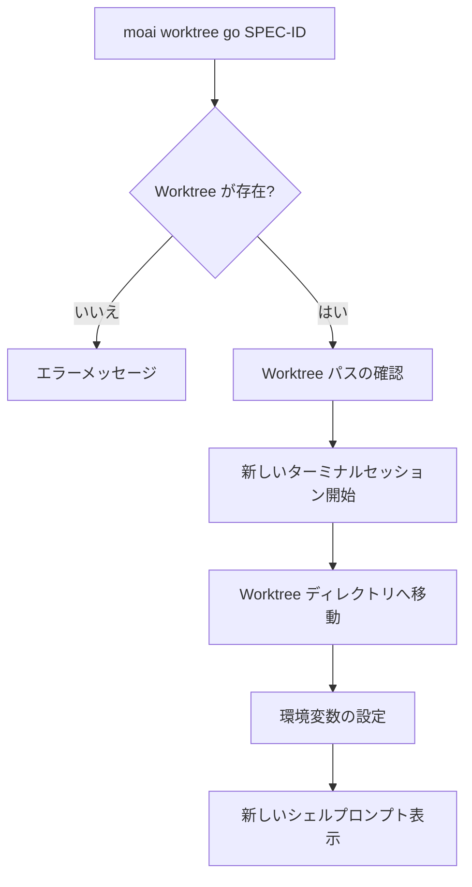
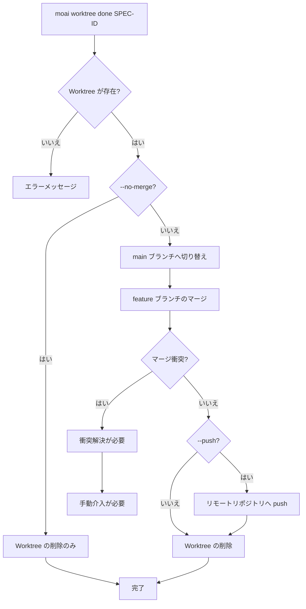
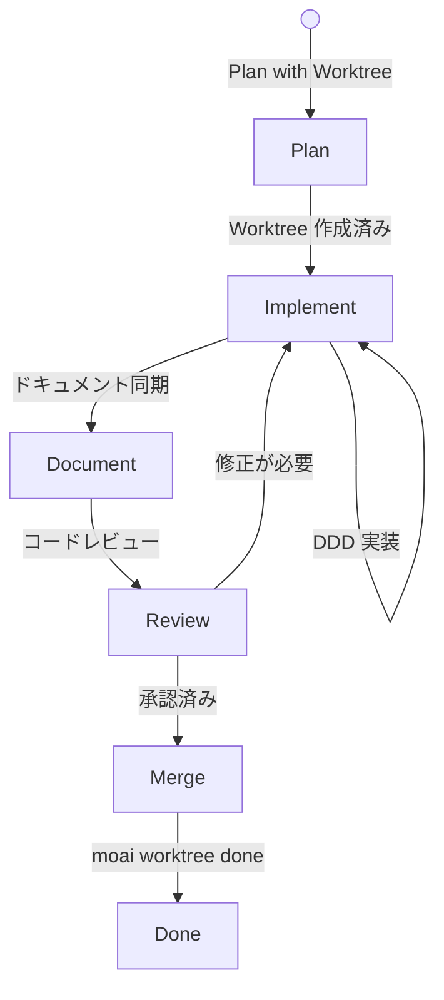
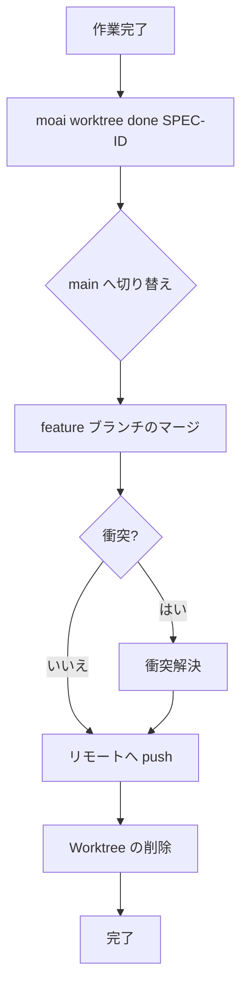
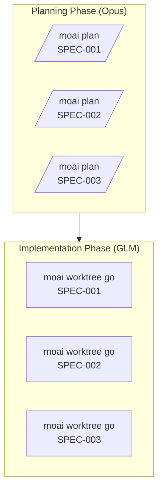
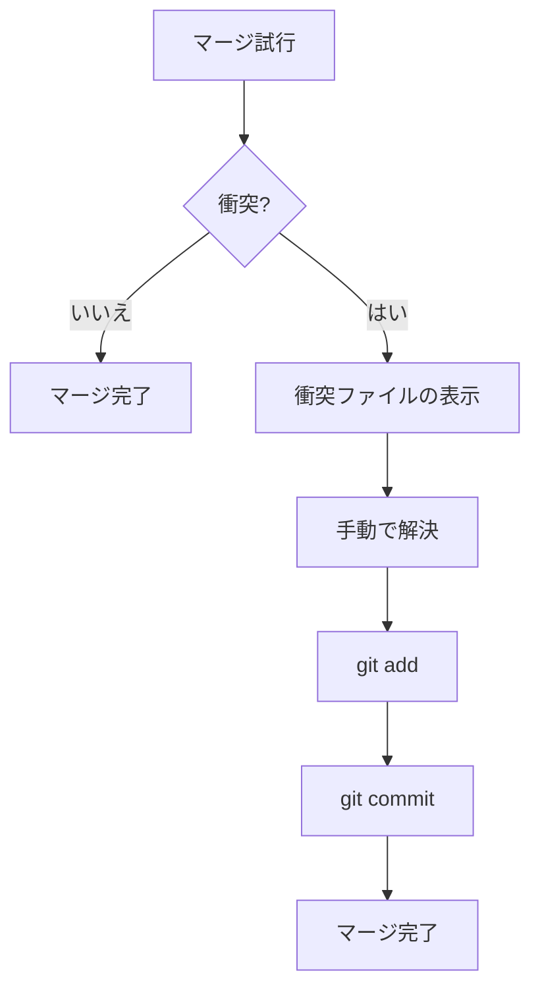
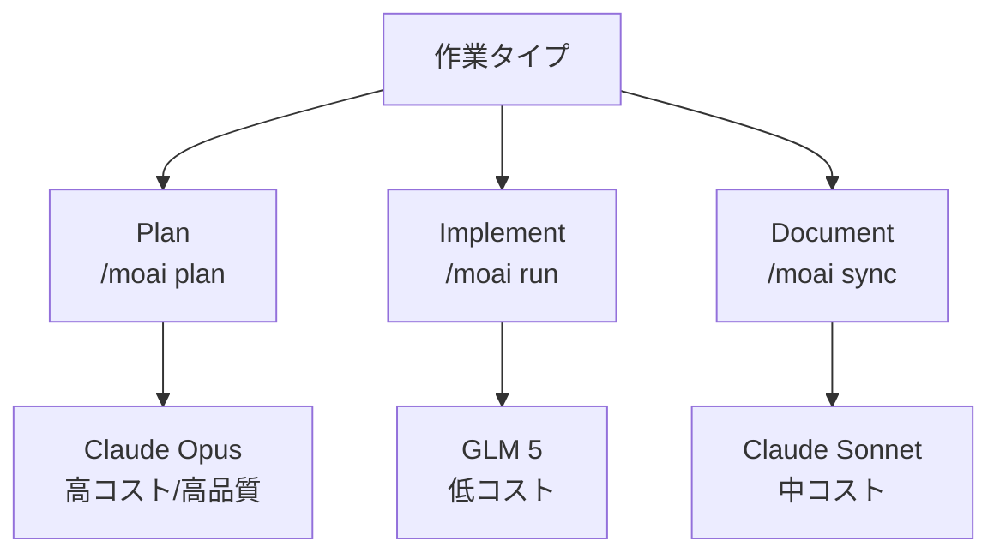

Git Worktree を使った MoAI-ADK 並列開発のすべて — 基礎概念からコマンド
リファレンス、ワークフロー、ベストプラクティスまで、このドキュメント 1 本でまとめます。

## 目次

1. [Worktree の基礎](#worktree-の基礎)
2. [コマンド詳細リファレンス](#コマンド詳細リファレンス)
3. [ワークフローガイド](#ワークフローガイド)
4. [高度な機能](#高度な機能)
5. [ベストプラクティス](#ベストプラクティス)

---

## Worktree の基礎

### Git Worktree とは何か?

Git Worktree は **1 つの Git リポジトリを複数のディレクトリで同時に作業** できるように
する Git の組み込み機能です。ブランチを行き来するたびに `git checkout` でコンテキストを
入れ替える代わりに、ブランチごとにディレクトリを 1 つずつ開いておきます。


```mermaid
graph TB
    subgraph Traditional["従来の方式"]
        T1[単一の作業ディレクトリ]
        T2[ブランチ切り替えが必要]
        T3[コンテキストスイッチのコスト]
    end

    subgraph Worktree["Worktree 方式"]
        W1[Worktree 1<br/>feature/A]
        W2[Worktree 2<br/>feature/B]
        W3[Worktree 3<br/>main]
    end

    Traditional -.->|不便| Worktree
```

### MoAI-ADK における Worktree

MoAI-ADK はこの機能の上に SPEC 単位の分離環境を載せます。各 SPEC が完全に
独立した環境を持つため、エージェントが並列で働いても互いの作業を踏み
ません:

- **独立した Git 状態** — 各 Worktree は自身のブランチとコミット履歴を維持します
- **分離された LLM 設定** — Worktree ごとに異なる LLM 実行モードを使えます。
  計画には Claude、実装には GLM を割り当てるトークノミクス運用はここから生まれます
- **分離された作業空間** — ファイルシステムレベルで完全に分離されます

---

## コマンド詳細リファレンス

### moai worktree new

新しい Worktree を作成します。

#### 構文

```bash
moai worktree new SPEC-ID [options]
```

#### パラメーター

- **SPEC-ID** (必須): 作成する SPEC の ID (例: `SPEC-AUTH-001`)

#### オプション

- `-b, --branch BRANCH`: 使用するブランチ名の指定 (デフォルト: `feature/SPEC-ID`)
- `--from BASE`: ベースブランチの指定 (デフォルト: `main`)
- `--force`: 既存の Worktree がある場合に強制再作成

#### 使用例

```bash
# 基本的な使い方
moai worktree new SPEC-AUTH-001

# 特定のブランチから作成
moai worktree new SPEC-AUTH-001 --from develop

# 強制再作成
moai worktree new SPEC-AUTH-001 --force
```

#### 動作プロセス


```mermaid
sequenceDiagram
    participant User as ユーザー
    participant CLI as moai worktree
    participant Git as Git
    participant FS as ファイルシステム

    User->>CLI: moai worktree new SPEC-AUTH-001
    CLI->>Git: git worktree add
    Git->>Git: feature/SPEC-AUTH-001 ブランチ作成
    Git->>FS: ~/.moai/worktrees/{ProjectName}/SPEC-AUTH-001/ ディレクトリ作成
    Git->>Git: ブランチのチェックアウト
    CLI->>CLI: .moai/config 設定のコピー
    CLI->>User: Worktree 作成完了

    Note over User,FS: SPEC-AUTH-001 のための<br/>完全に独立した環境を作成
```

---

### moai worktree go

Worktree に入って新しいシェルセッションを開始します。

#### 構文

```bash
moai worktree go SPEC-ID
```

#### パラメーター

- **SPEC-ID** (必須): 入る Worktree の ID

#### 使用例

```bash
# Worktree に入る
moai worktree go SPEC-AUTH-001

# 入った後に LLM 変更
moai glm

# Claude Code の起動
claude

# 作業開始
> /moai run SPEC-AUTH-001
```

#### 動作プロセス


```mermaid
flowchart TD
    A[moai worktree go SPEC-ID] --> B{Worktree が存在?}
    B -->|いいえ| C[エラーメッセージ]
    B -->|はい| D[Worktree パスの確認]
    D --> E[新しいターミナルセッション開始]
    E --> F[Worktree ディレクトリへ移動]
    F --> G[環境変数の設定]
    G --> H[新しいシェルプロンプト表示]
```

---

### moai worktree list

すべての Worktree の一覧を表示します。

#### 構文

```bash
moai worktree list [options]
```

#### オプション

- `-v, --verbose`: 詳細情報を含む
- `--porcelain`: パース可能な形式で出力

#### 使用例

```bash
# 基本の一覧
moai worktree list

# 詳細情報
moai worktree list --verbose

# 出力例
SPEC-AUTH-001  feature/SPEC-AUTH-001  /path/to/worktree/SPEC-AUTH-001  [active]
SPEC-AUTH-002  feature/SPEC-AUTH-002  /path/to/worktree/SPEC-AUTH-002
SPEC-AUTH-003  feature/SPEC-AUTH-003  /path/to/worktree/SPEC-AUTH-003
```

---

### moai worktree done

Worktree の作業を完了し、マージ後にクリーンアップします。

#### 構文

```bash
moai worktree done SPEC-ID [options]
```

#### パラメーター

- **SPEC-ID** (必須): 完了する Worktree の ID

#### オプション

- `--push`: マージ後にリモートリポジトリへ push
- `--no-merge`: マージせずに Worktree のみ削除
- `--force`: 衝突があっても強制マージ

#### 使用例

```bash
# 基本のマージとクリーンアップ
moai worktree done SPEC-AUTH-001

# リモートリポジトリへ push
moai worktree done SPEC-AUTH-001 --push

# マージせずに削除のみ
moai worktree done SPEC-AUTH-001 --no-merge
```

#### 動作プロセス


```mermaid
flowchart TD
    A[moai worktree done SPEC-ID] --> B{Worktree が存在?}
    B -->|いいえ| C[エラーメッセージ]
    B -->|はい| D{--no-merge?}
    D -->|はい| E[Worktree の削除のみ]
    D -->|いいえ| F[main ブランチへ切り替え]
    F --> G[feature ブランチのマージ]
    G --> H{マージ衝突?}
    H -->|はい| I[衝突解決が必要]
    H -->|いいえ| J{--push?}
    J -->|はい| K[リモートリポジトリへ push]
    J -->|いいえ| L[Worktree の削除]
    K --> L
    E --> M[完了]
    L --> M
    I --> N[手動介入が必要]
```

---

### moai worktree remove

Worktree を削除します (マージなし)。

#### 構文

```bash
moai worktree remove SPEC-ID [options]
```

#### パラメーター

- **SPEC-ID** (必須): 削除する Worktree の ID

#### オプション

- `--force`: 変更があっても強制削除
- `--keep-branch`: ブランチは維持して Worktree のみ削除

#### 使用例

```bash
# 基本の削除
moai worktree remove SPEC-AUTH-001

# 強制削除
moai worktree remove SPEC-AUTH-001 --force

# ブランチの維持
moai worktree remove SPEC-AUTH-001 --keep-branch
```

---

### moai worktree status

Worktree の状態を確認します。

#### 構文

```bash
moai worktree status [SPEC-ID]
```

#### パラメーター

- **SPEC-ID** (任意): 特定の Worktree の状態確認 (指定しなければすべて表示)

#### 使用例

```bash
# すべての Worktree の状態
moai worktree status

# 特定の Worktree の状態
moai worktree status SPEC-AUTH-001

# 出力例
Worktree: SPEC-AUTH-001
Branch: feature/SPEC-AUTH-001
Path: /path/to/worktree/SPEC-AUTH-001
Status: Clean (2 commits ahead of main)
LLM: GLM 5
```

---

### moai worktree clean

マージ済みまたは完了した Worktree を整理します。

#### 構文

```bash
moai worktree clean [options]
```

#### オプション

- `--merged-only`: マージ済みの Worktree のみ整理
- `--older-than DAYS`: N 日以上経過した Worktree のみ整理
- `--dry-run`: 実際には削除せず表示のみ

#### 使用例

```bash
# マージ済み Worktree の整理
moai worktree clean --merged-only

# 7 日以上経過した Worktree の整理
moai worktree clean --older-than 7

# プレビュー
moai worktree clean --dry-run
```

---

### moai worktree config

Worktree の設定を確認または変更します。

#### 構文

```bash
moai worktree config [key] [value]
```

#### パラメーター

- **key** (任意): 設定キー
- **value** (任意): 設定値

#### 使用例

```bash
# すべての設定を表示
moai worktree config

# 特定の設定を確認
moai worktree config root

# 設定の変更
moai worktree config root /new/path/to/worktrees
```

---

## ワークフローガイド

### 完全な開発サイクル


```mermaid
flowchart TD
    Start(( )) -->|"Plan with Worktree"| Plan["Plan"]
    Plan -->|"Worktree 作成済み"| Implement["Implement"]
    Implement -->|"DDD 実装"| Implement
    Implement -->|"ドキュメント同期"| Document["Document"]
    Document -->|"コードレビュー"| Review["Review"]
    Review -->|"承認済み"| Merge["Merge"]
    Review -->|"修正が必要"| Implement
    Merge -->|"moai worktree done"| Done["Done"]
```

### ステップ 1: SPEC 計画 (Phase 1)

```bash
# Terminal 1 で
> /moai plan "ユーザー認証システムの実装" --worktree
```

**出力**:

```
✓ SPEC ドキュメント生成: .moai/specs/SPEC-AUTH-001/spec.md
✓ Worktree 作成: ~/.moai/worktrees/{ProjectName}/SPEC-AUTH-001
✓ ブランチ作成: feature/SPEC-AUTH-001
✓ ブランチ切り替え完了

次のステップ:
1. 新しいターミナルで実行: moai worktree go SPEC-AUTH-001
2. LLM 変更: moai glm
3. 開発開始: claude
```

### ステップ 2: 実装 (Phase 2)

```bash
# Terminal 2 で
moai worktree go SPEC-AUTH-001

# Worktree に入るとプロンプトが変わる
(SPEC-AUTH-001) $ moai glm
→ GLM 5 に設定されました。

(SPEC-AUTH-001) $ claude
> /moai run SPEC-AUTH-001
```

**作業フロー**:


```mermaid
sequenceDiagram
    participant T1 as Terminal 1<br/>Plan
    participant T2 as Terminal 2<br/>Implement
    participant Git as Git Repository

    T1->>Git: feature/SPEC-AUTH-001 作成
    T1->>T2: Worktree 作成完了の通知

    T2->>T2: moai worktree go SPEC-AUTH-001
    T2->>T2: moai glm
    T2->>Git: DDD 実装のコミット群
    Note over T2: ANALYZE → PRESERVE → IMPROVE

    T2->>Git: さらに多くの実装コミット
    T2->>T2: /moai sync SPEC-AUTH-001
    T2->>Git: ドキュメント化コミット
```

### ステップ 3: 完了とマージ (Phase 3)

```bash
# Terminal 2 で作業完了後
exit

# Terminal 1 で
moai worktree done SPEC-AUTH-001 --push
```

**プロセス**:


```mermaid
flowchart TD
    A[作業完了] --> B[moai worktree done SPEC-ID]
    B --> C{main へ切り替え}
    C --> D[feature ブランチのマージ]
    D --> E{衝突?}
    E -->|はい| F[衝突解決]
    E -->|いいえ| G[リモートへ push]
    F --> G
    G --> H[Worktree の削除]
    H --> I[完了]
```

---

## 高度な機能

### 並列作業戦略

#### 戦略 1: Plan と Implement の分離

トークノミクスの基本戦略です。計画フェーズは高推論モデル (Opus) にまとめて処理させ、
実装フェーズは低コストモデル (GLM) で並列分散します:


```mermaid
graph TB
    subgraph Planning["Planning Phase (Opus)"]
        P1[/moai plan<br/>SPEC-001/]
        P2[/moai plan<br/>SPEC-002/]
        P3[/moai plan<br/>SPEC-003/]
    end

    subgraph Implementation["Implementation Phase (GLM)"]
        I1[moai worktree go<br/>SPEC-001]
        I2[moai worktree go<br/>SPEC-002]
        I3[moai worktree go<br/>SPEC-003]
    end

    Planning --> Implementation
```

#### 戦略 2: 同時開発

```bash
# Terminal 1: SPEC-001 Plan
> /moai plan "認証" --worktree

# Terminal 2: SPEC-002 Plan (完了後)
> /moai plan "ログ" --worktree

# Terminal 3, 4, 5: 並列実装
moai worktree go SPEC-001 && moai glm  # Terminal 3
moai worktree go SPEC-002 && moai glm  # Terminal 4
moai worktree go SPEC-003 && moai glm  # Terminal 5
```

### Worktree 間の切り替え

```bash
# 現在の Worktree を確認
moai worktree status

# 別の Worktree に切り替え
moai worktree go SPEC-AUTH-002

# または直接移動
cd ~/.moai/worktrees/SPEC-AUTH-002
```

### 衝突の解決


```mermaid
flowchart TD
    A[マージ試行] --> B{衝突?}
    B -->|いいえ| C[マージ完了]
    B -->|はい| D[衝突ファイルの表示]
    D --> E[手動で解決]
    E --> F[git add]
    F --> G[git commit]
    G --> H[マージ完了]
```

---

## ベストプラクティス

### 1. Worktree の命名規則

```bash
# 良い例
moai worktree new SPEC-AUTH-001      # 明確な SPEC ID
moai worktree new SPEC-FRONTEND-007  # カテゴリを含む

# 避けるべき例
moai worktree new feature-branch     # SPEC ID を使っていない
moai worktree new temp               # 曖昧な名前
```

### 2. 定期的なクリーンアップ

```bash
# 毎週実行
moai worktree clean --merged-only

# 毎月実行
moai worktree clean --older-than 30
```

### 3. LLM 選択ガイド

作業フェーズごとにモデルを分けて割り当てることが Worktree トークノミクスの核心です:


```mermaid
graph TD
    A[作業タイプ] --> B[Plan<br/>/moai plan]
    A --> C[Implement<br/>/moai run]
    A --> D[Document<br/>/moai sync]

    B --> E[Claude Opus<br/>高コスト/高品質]
    C --> F[GLM 5<br/>低コスト]
    D --> G[Claude Sonnet<br/>中コスト]
```

### 4. コミットメッセージの規則

```bash
# Worktree でコミットするとき
git commit -m "feat(SPEC-AUTH-001): JWT ベースの認証を実装

- JWT トークンの生成/検証ロジックを追加
- リフレッシュトークンのローテーションを実装
- ログアウト時のトークン無効化

Co-Authored-By: Claude <noreply@anthropic.com>"
```

### 5. ターミナル管理

```bash
# 各 Worktree に個別のターミナルを使用
# iTerm2、VS Code、または tmux の使用を推奨

# tmux の例
tmux new-session -d -s spec-001 'moai worktree go SPEC-001'
tmux new-session -d -s spec-002 'moai worktree go SPEC-002'

# セッションの切り替え
tmux attach-session -t spec-001
```

### 6. 進捗の追跡

```bash
# すべての Worktree の状態確認
moai worktree status --verbose

# Git ログの確認
cd ~/.moai/worktrees/{ProjectName}/SPEC-AUTH-001
git log --oneline --graph --all

# 変更内容の確認
git diff main
```

## tmux 統合と自動マージ

### moai worktree new --tmux フラグ

tmux セッションを自動作成し、ワークツリー環境で分離された開発が可能になります。

```bash
moai worktree new SPEC-AUTH-001 --tmux
```

**動作フロー:**
1. Worktree の作成 (従来の動作)
2. tmux セッションの自動作成 (名前: `moai-{ProjectName}-{SPEC-ID}`)
3. LLM モードに応じて環境変数を注入 (GLM/CG モード)
4. Worktree へ cd した後 `/moai run {SPEC-ID}` を実行

```bash
# tmux セッションのアタッチ
tmux attach-session -t moai-my-project-SPEC-AUTH-001
```


tmux がインストールされていない場合は graceful degradation: 手動 cd の案内メッセージが表示されます。


### 実行モード選択ゲート (Decision Point 3.5)

`/moai plan` 完了後、Run 開始前に実行モードを自動検出し、ユーザーに選択を求めます。

**tmux 使用可能時 (3 つのオプション):**
- Worktree + \{現在のモード\} (Recommended): ワークツリー + tmux セッション作成
- Team Mode: Agent Teams 並列実行
- Sub-agent Mode: 順次実行

**tmux 使用不可時 (2 つのオプション):**
- Sub-agent Mode (Recommended)
- Team Mode (in-process)

### Auto-merge のデフォルト動作

ワークツリーコンテキストで `/moai sync` を実行すると、auto-merge がデフォルト動作です。

| フラグ | 動作 |
|--------|------|
| (なし) | ワークツリーコンテキストで自動マージ |
| `--no-merge` | 自動マージのスキップ |
| `--merge` | Deprecated (警告表示) |

### ポストマージ自動クリーンアップ

PR マージ成功時の自動整理:
- ワークツリーディレクトリの削除
- フィーチャーブランチの削除 (`--delete-branch`)
- レジストリの更新


クリーンアップの失敗はマージ結果に影響しません。失敗時は手動で整理: `moai worktree done SPEC-{ID}`


### エラーハンドリング (errors.go)

構造化されたエラータイプと復旧コマンドを提供します。

| エラータイプ | 説明 | 復旧コマンド |
|-----------|------|-----------|
| `WorktreeCreateError` | Worktree の作成失敗 | `moai worktree new {SPEC-ID}` |
| `TmuxNotAvailableError` | tmux が使用不可 | `cd {path} && /moai run {SPEC-ID}` |
| `AutoMergeBlockedError` | 自動マージのブロック | `/moai sync {SPEC-ID}` |
| `CleanupFailedError` | クリーンアップの失敗 | `moai worktree done {SPEC-ID}` |

## 関連ドキュメント

- [Git Worktree 概要](/ja/worktree/)
- [実際の使用例](/ja/worktree/examples)
- [よくある質問](/ja/worktree/faq)
