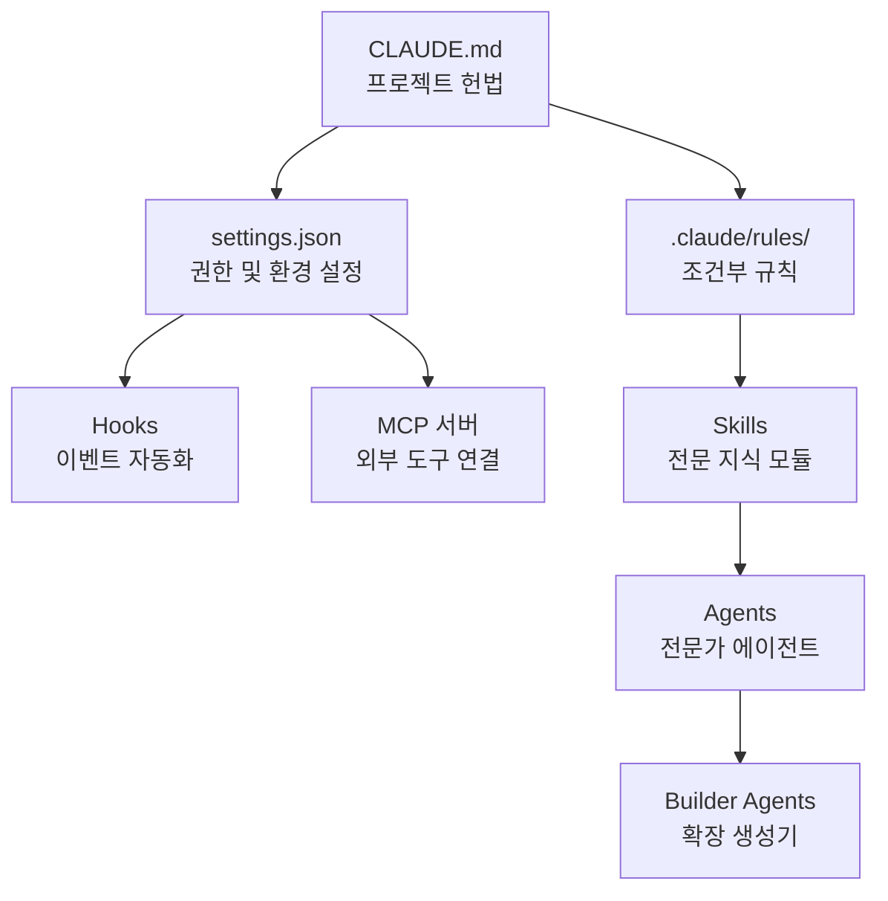

# 심화 학습

MoAI-ADK의 내부 구조와 고급 기능을 깊이 있게 다룹니다.


이 섹션은 MoAI-ADK의 기본 개념을 이해한 후 내부 동작 원리를 파악하고 싶은 개발자를 위한 가이드입니다.


## 학습 구조

MoAI-ADK는 7가지 핵심 구성 요소로 이루어져 있습니다.

## 목차

| 주제 | 설명 |
|------|------|
| [스킬 가이드](/advanced/skill-guide) | AI에게 전문 지식을 부여하는 스킬 시스템 |
| [에이전트 가이드](/advanced/agent-guide) | 전문화된 AI 작업 수행자 체계 |
| [빌더 에이전트 가이드](/advanced/builder-agents) | 스킬, 에이전트, 명령어, 플러그인 생성 |
| [Hooks 가이드](/advanced/hooks-guide) | 이벤트 기반 자동화 스크립트 |
| [settings.json 가이드](/advanced/settings-json) | Claude Code 전역 설정 관리 |
| [CLAUDE.md 가이드](/advanced/claude-md-guide) | 프로젝트 지침 파일 체계 |
| [MCP 서버 활용](/advanced/mcp-servers) | 외부 도구 연결 프로토콜 |
| [Google Stitch 가이드](/advanced/stitch-guide) | AI 기반 UI/UX 디자인 생성 도구 |


각 문서는 독립적으로 읽을 수 있지만, **스킬 가이드** 부터 순서대로 읽으면 전체 아키텍처를 체계적으로 이해할 수 있습니다.

