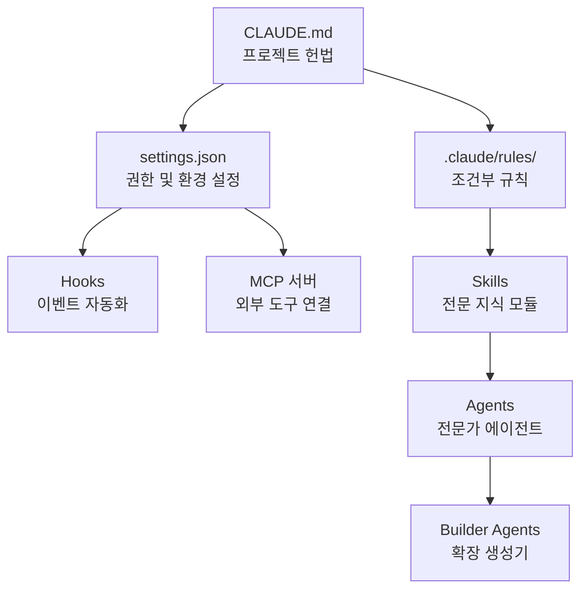

MoAI-ADK의 내부 구조를 뜯어보고 싶은 개발자를 위한 섹션입니다. 기본 워크플로우(plan → run → sync)에 익숙해졌다면, 여기서 하네스가 실제로 어떻게 조립되어 있는지 확인할 수 있습니다.


이 섹션의 문서들은 v3.0의 세 기둥 — **토크노믹스** (Token Economics), **에이전틱 루프 엔지니어링** (Agentic Loop Engineering), **에이전틱 하네스** (Agentic Harness) — 가운데 주로 세 번째 기둥의 구현 세부를 다룹니다. 에이전트가 코드를 잘 쓰게 만드는 비결은 모델이 아니라, 모델을 둘러싼 환경 설계에 있습니다.


## 하네스는 어떻게 조립되는가

MoAI-ADK 하네스는 7가지 구성 요소가 층을 이루며 동작합니다. 위에서 아래로 갈수록 더 동적인 계층입니다.

```mermaid
flowchart TD
    CLAUDE["CLAUDE.md<br>프로젝트 헌법"] --> SETTINGS["settings.json<br>권한 및 환경 설정"]
    CLAUDE --> RULES[".claude/rules/<br>조건부 규칙"]

    SETTINGS --> HOOKS["Hooks<br>이벤트 자동화"]
    SETTINGS --> MCP["MCP 서버<br>외부 도구 연결"]

    RULES --> SKILLS["Skills<br>전문 지식 모듈"]
    SKILLS --> AGENTS["Agents<br>전문가 에이전트"]

    AGENTS --> BUILDERS["Builder Agents<br>확장 생성기"]

```

`CLAUDE.md`가 프로젝트의 헌법이라면, settings.json은 권한의 경계선이고, 훅은 결정적(deterministic) 제어 지점이며, 스킬과 에이전트는 실제로 일하는 손입니다. 그리고 Builder Agents가 이 구조 전체를 다시 생성할 수 있습니다 — 하네스가 하네스를 만드는 재귀 구조입니다.

## 목차

### 하네스의 구성 요소

| 주제 | 설명 |
|------|------|
| [스킬 가이드](/ko/advanced/skill-guide) | AI에게 전문 지식을 부여하는 스킬 시스템 |
| [에이전트 가이드](/ko/advanced/agent-guide) | 전문화된 AI 작업 수행자 체계 |
| [빌더 에이전트 가이드](/ko/advanced/builder-agents) | 스킬, 에이전트, 명령어, 플러그인 생성 |
| [Harness v4 Builder](/ko/advanced/harness-v4-builder) | 자연어 한 문장으로 프로젝트 전용 하네스 생성 |
| [하네스 프로필과 평가 시스템](/ko/advanced/harness-profiles) | 3계층 검증 깊이 + 4차원 스코어링 |
| [카탈로그 시스템](/ko/advanced/catalog-system) | 3계층 매니페스트와 slim init |

### 제어와 자동화

| 주제 | 설명 |
|------|------|
| [Hooks 가이드](/ko/advanced/hooks-guide) | 이벤트 기반 자동화 스크립트 |
| [Hooks 레퍼런스](/ko/advanced/hooks-reference) | MoAI-ADK가 배포하는 훅 목록 |
| [settings.json 가이드](/ko/advanced/settings-json) | Claude Code 전역 설정 관리 |
| [CLAUDE.md 가이드](/ko/advanced/claude-md-guide) | 프로젝트 지침 파일 체계 |
| [보안 노트](/ko/advanced/security-notes) | 권한 스택과 샌드박스 |

### 루프와 관찰

| 주제 | 설명 |
|------|------|
| [의사결정 메모리](/ko/advanced/decision-memory) | 사용자 선택을 학습하는 관찰 시스템 |
| [ultracode 워크플로우](/ko/advanced/ultracode-workflows) | 동적 워크플로우 오케스트레이션 |
| [statusline](/ko/advanced/statusline) | 컨텍스트 사용률·캐시 적중률 상시 계기판 |

### 외부 도구 연동

| 주제 | 설명 |
|------|------|


각 문서는 독립적으로 읽을 수 있습니다. 다만 전체 아키텍처를 체계적으로 이해하고 싶다면 **스킬 가이드 → 에이전트 가이드 → 빌더 에이전트** 순서를 권합니다 — 지식 모듈에서 수행자로, 수행자에서 생성기로 이어지는 흐름이 하네스의 재귀 구조를 그대로 보여주기 때문입니다.

