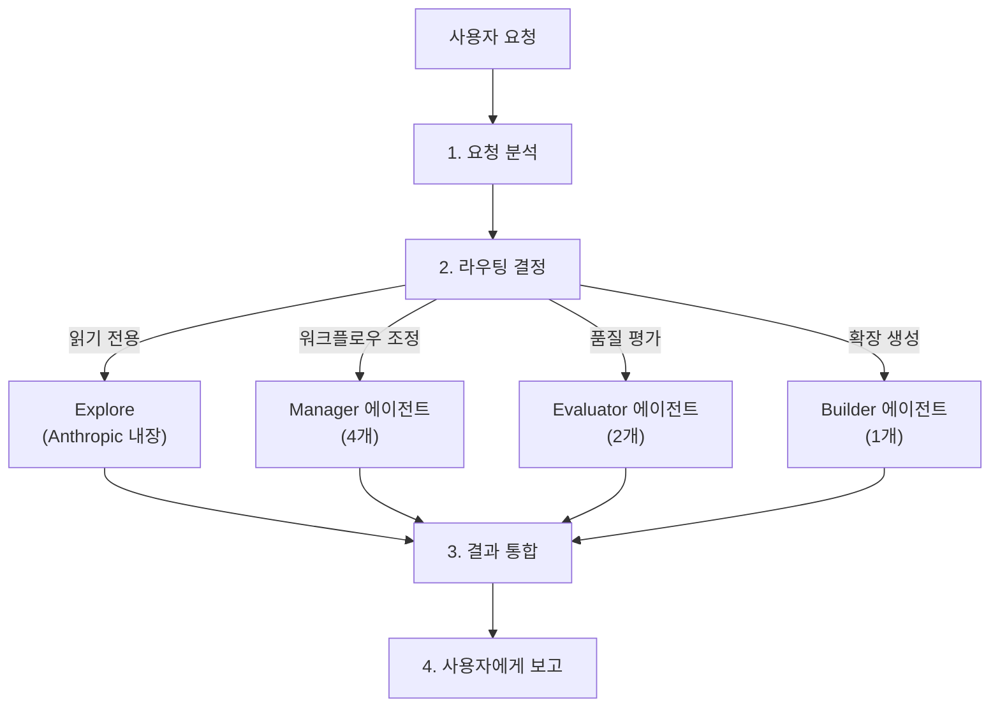
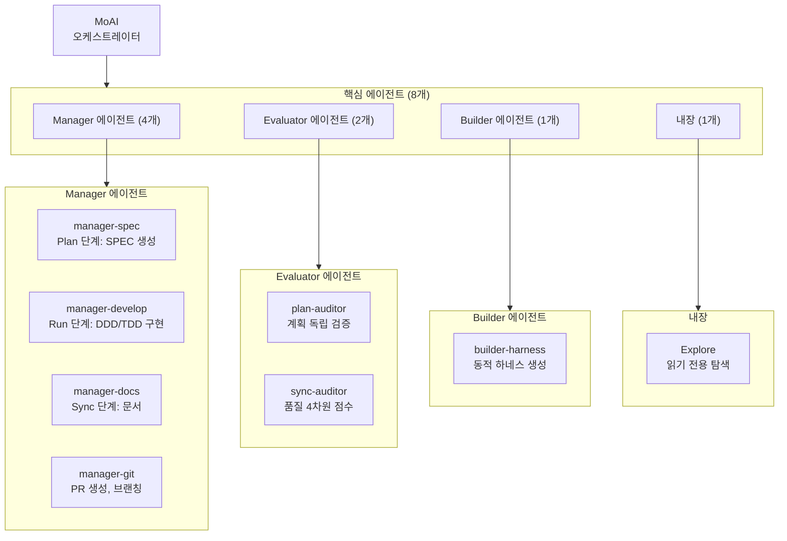
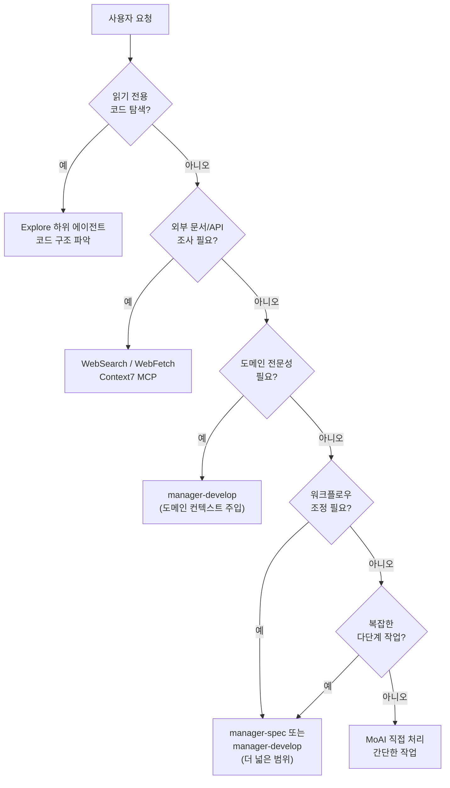
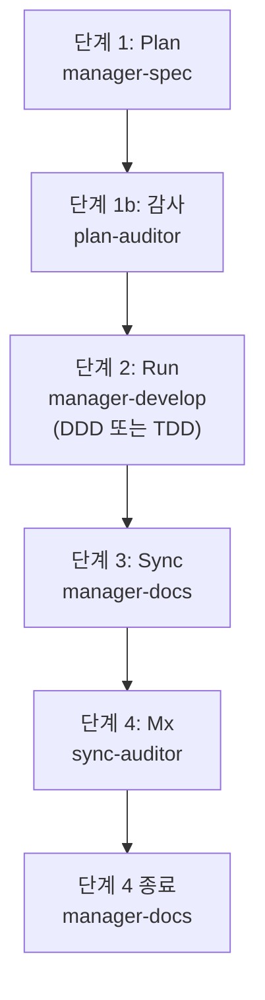

MoAI-ADK의 에이전트 시스템을 상세히 안내합니다.


**한 줄 요약**: 에이전트는 각 분야의 **전문가 팀**입니다. MoAI가 팀 리더로서 적절한 전문가에게 작업을 배분합니다.


## 에이전트란?

에이전트는 특정 분야에 전문화된 **AI 작업 수행자**입니다.

Claude Code의 **Sub-agent (하위 에이전트)** 시스템을 기반으로 하며, 각 에이전트는 독립적인 컨텍스트 창, 사용자 정의 시스템 프롬프트, 특정 도구 액세, 독립적인 권한을 가집니다.

회사 조직에 비유하면, MoAI는 CEO이고, Manager 에이전트는 부서장, Expert 에이전트는 각 분야의 전문가, Builder 에이전트는 신규 팀원을 채용하는 HR 팀입니다.

## MoAI 오케스트레이터

MoAI는 MoAI-ADK의 **최상위 조율자**입니다. 사용자의 요청을 분석하고 적절한 에이전트에게 작업을 위임합니다 (8개 강화된 에이전트만).

### MoAI의 핵심 규칙

| 규칙 | 설명 |
|------|------|
| 위임 전용 | 복잡한 작업은 직접 수행하지 않고 전문 에이전트에게 위임 |
| 사용자 창구 | 사용자와의 상호작용은 MoAI만 수행 (하위 에이전트는 불가) |
| 병렬 실행 | 독립적인 작업은 여러 에이전트에게 동시에 위임 (Agent Teams 모드) |
| 결과 통합 | 에이전트 실행 결과를 취합하여 사용자에게 보고 |

### MoAI의 요청 처리 흐름



## 에이전트 8개 통합 구조

MoAI-ADK는 **8개 강화된 에이전트** (7개 MoAI 사용자 정의 + 1개 Anthropic 내장)를 사용합니다:



## Manager 에이전트 상세

Manager 에이전트는 **워크플로우를 조율하고 관리**하는 역할을 합니다.

| 에이전트 | 역할 | 사용 스킬 | 주요 도구 |
|----------|------|-----------|-----------|
| `manager-spec` | Plan 단계: SPEC 문서 생성, GEARS 형식 요구사항 | `moai-workflow-spec` | Read, Write, Grep |
| `manager-develop` | Run 단계: DDD/TDD 순환 실행 (quality.yaml의 cycle_type) | `moai-workflow-ddd`, `moai-workflow-tdd`, `moai-foundation-core` | Read, Write, Edit, Bash |
| `manager-docs` | Sync 단계: 문서 생성, CHANGELOG, README 동기화 | `moai-workflow-project`, `moai-foundation-core` | Read, Write, Edit |
| `manager-git` | PR 생성, Git 브랜칭, 머지 전략 (Tier L 또는 --pr 플래그) | `moai-foundation-core` | Bash (git) |

### Manager 에이전트와 워크플로우 명령어

Manager 에이전트는 주요 MoAI 워크플로우 명령어와 직접 연결됩니다.

```bash
# Plan 단계: manager-spec이 SPEC 문서 생성
> /moai plan "사용자 인증 시스템 구현"

# Run 단계: manager-develop이 DDD 또는 TDD 순환 실행
> /moai run SPEC-AUTH-001

# Sync 단계: manager-docs가 문서 동기화
> /moai sync SPEC-AUTH-001
```

## 도메인 전문성 패턴

백엔드 API 개발, 프론트엔드 UI, 보안 분석, 데이터베이스 설계 등의 도메인 전문 작업의 경우, `manager-develop` 에이전트가 도메인 컨텍스트를 주입하여 호출됩니다. 또는 spawn 프롬프트 내에 도메인별 지침을 포함하여 `Agent(general-purpose)` 패턴을 사용합니다. 보관된 `expert-*` 에이전트들 (manager-develop, manager-develop, manager-develop, manager-develop, manager-develop, manager-develop)은 SPEC-V3R6-AGENT-TEAM-REBUILD-001에 따라 통합되었습니다. 최신 도메인 전문 작업의 경우:

- **백엔드**: `manager-develop` (백엔드 도메인 컨텍스트) + `moai-domain-backend` 스킬
- **프론트엔드**: `manager-develop` (프론트엔드 도메인 컨텍스트) + `moai-domain-frontend` 스킬
- **보안**: `sync-auditor` 품질 게이트 + `moai-foundation-quality` + OWASP 참고 스킬
- **데이터베이스**: `moai-domain-database` 스킬 + `manager-develop`
- **기타 도메인**: 언어별 스킬 + `manager-develop`

## Evaluator 에이전트 상세

Evaluator 에이전트는 **독립적 품질 평가 및 검증**을 수행합니다.

| 에이전트 | 역할 | 사용 스킬 | 주요 도구 |
|----------|------|-----------|-----------|
| `plan-auditor` | Plan 단계: 독립적 회의적 감사, GEARS 준수, 편향 방지 | `moai-foundation-core`, `moai-foundation-thinking` | Read, Grep |
| `sync-auditor` | Sync 단계: 4차원 품질 점수 (Functionality, Security, Craft, Consistency) | `moai-foundation-quality`, `moai-foundation-core` | Read, Grep, Bash |

## Builder 에이전트 상세

Builder 에이전트는 **MoAI-ADK를 확장하는 새로운 구성 요소**를 생성합니다.

| 에이전트 | 역할 | 생성물 |
|----------|------|--------|
| `builder-harness` | 동적 프로젝트별 에이전트 팀 생성 (Socratic 인터뷰 기반) | `.claude/agents/harness/`, `.moai/harness/` |


Builder 에이전트에 대한 자세한 내용은 [빌더 에이전트 가이드](/advanced/builder-agents)를 참고하세요.


---

## 에이전트 선택 결정 트리

MoAI가 사용자 요청을 분석하여 적절한 에이전트를 선택하는 과정입니다.



### 에이전트 선택 기준

| 작업 유형 | 선택할 에이전트 | 예시 |
|-----------|----------------|------|
| 코드 읽기/분석 | Explore | "이 프로젝트의 구조를 분석해줘" |
| API 개발 | manager-develop (백엔드 컨텍스트) | `/moai run SPEC-XXX` (백엔드 SPEC) |
| UI 구현 | manager-develop (프론트엔드 컨텍스트) | `/moai run SPEC-XXX` (프론트엔드 SPEC) |
| 테스트 작성 | manager-develop (TDD 모드) | `/moai run SPEC-XXX` (테스트-우선 SPEC) |
| 보안 검토 | sync-auditor | Sync 단계 독립 품질 검증 |
| SPEC 생성 | manager-spec | `/moai plan "기능 설명"` |
| 구현 | manager-develop | `/moai run SPEC-XXX` (자동 DDD/TDD 선택) |
| 문서 생성 | manager-docs | `/moai sync SPEC-XXX` |
| Plan 검증 | plan-auditor | 독립 감사 (SPEC 완성도) |
| 확장 생성 | builder-harness | `/moai project` Socratic 인터뷰 |

## 에이전트 정의 파일

8개 강화된 에이전트는 `.claude/agents/moai/` 디렉토리에 마크다운 파일로 정의됩니다.

### 파일 구조

```
.claude/agents/moai/
├── manager-spec.md
├── manager-develop.md
├── manager-docs.md
├── manager-git.md
├── plan-auditor.md
├── sync-auditor.md
├── builder-harness.md
└── Explore                # Anthropic 내장 (파일 없음)
```

### 보관된 에이전트

2026-05-25에 SPEC-V3R6-AGENT-TEAM-REBUILD-001 통합에 따라 12개 에이전트가 보관되었습니다:
- **Manager**: manager-strategy, manager-quality, manager-brain, manager-project
- **Expert**: expert-backend, expert-frontend, expert-security, expert-devops, expert-performance, expert-refactoring
- **Support**: claude-code-guide, researcher

보관된 에이전트 참고 마이그레이션 지침은 `.claude/rules/moai/workflow/archived-agent-rejection.md`를 참고하세요.

### 에이전트 정의 형식

```markdown
---
name: my-backend-specialist
description: >
  이 프로젝트의 백엔드 전문가. API 설계, 서버 로직, 데이터베이스 통합.
  builder-harness가 프로젝트 컨텍스트를 기반으로 생성.
tools: Read, Write, Edit, Grep, Glob, Bash
model: inherit
---

당신은 이 프로젝트의 백엔드 전문가입니다.

## 역할
- REST/GraphQL API 설계 및 구현
- 데이터베이스 스키마 설계
- 인증/인가 시스템 구현
- 서버 사이드 비즈니스 로직

## 사용 스킬
- moai-domain-backend
- 언어별 스킬 (Python, TypeScript 등)

## 품질 기준
- TRUST 5 프레임워크 준수
- 85%+ 테스트 커버리지
- OWASP Top 10 보안 기준
```


**주의**: 하위 에이전트는 **사용자에게 직접 질문할 수 없습니다**. 모든 사용자 상호작용은 MoAI를 통해서만 이루어집니다. 에이전트에게 위임하기 전에 필요한 정보를 미리 수집하세요.


## 에이전트 간 협업 패턴

### 순차 실행 (Plan-Run-Sync)

```bash
# 1. manager-spec이 SPEC 생성
# 2. plan-auditor가 SPEC 완성도 검증
# 3. manager-develop이 DDD/TDD 구현
# 4. sync-auditor가 품질 점수
# 5. manager-docs가 문서 생성
> /moai plan "인증 시스템"
> /moai run SPEC-AUTH-001
> /moai sync SPEC-AUTH-001
```

### Agent Teams를 활용한 병렬 실행 (실험적)

```bash
# MoAI가 여러 전문가를 동시에 위임 (--team 플래그)
# Plan Phase: researcher, analyst, architect (병렬)
# Run Phase: backend-dev, frontend-dev, tester (병렬)
> /moai plan --team "사용자 인증 시스템"
> /moai run --team SPEC-AUTH-001
```

### 에이전트 체인 (4단계 워크플로우)

표준 MoAI 워크플로우는 4단계 체인을 사용합니다.



## Sub-agent (하위 에이전트) 시스템

Claude Code의 공식 Sub-agent 시스템은 MoAI-ADK의 에이전트 구조의 기반이 됩니다.

### Sub-agent란?

Sub-agent는 **특정 작업 유형에 특화된 AI 어시스턴트**입니다.

| 특징 | 설명 |
|------|------|
| **독립 컨텍스트** | 각 sub-agent는 자체 컨텍스트 창에서 실행 |
| **사용자 정의 프롬프트** | 전문 시스템 프롬프트로 작동 방식 정의 |
| **특정 도구 액세** | 필요한 도구만 선택적으로 제공 |
| **독립 권한** | 개별 권한 설정 가능 |

### Sub-agent vs 에이전트 팀

| 하위 에이전트 모드 | 에이전트 팀 모드 |
|-----------------|---------------|
| 단일 sub-agent가 순차적으로 작업 수행 | 여러 팀원이 병렬로 협업 |
| 간단한 작업에 적합 | 복잡한 다단계 작업에 적합 |
| 빠른 실행 | 체계적인 조율 필요 |

## Sub-agent 시스템

Claude Code의 공식 Sub-agent 시스템은 MoAI-ADK의 에이전트 구조의 기반입니다.

### Sub-agent란?

Sub-agent는 **특정 작업 유형에 특화된 AI 어시스턴트**입니다.

| 특징 | 설명 |
|------|------|
| **독립 컨텍스트** | 각 sub-agent는 자체 컨텍스트 창에서 실행 |
| **사용자 정의 프롬프트** | 전문 시스템 프롬프트로 작동 방식 정의 |
| **특정 도구 액세스** | 필요한 도구만 선택적으로 제공 |
| **독립 권한** | 개별 권한 설정 가능 |

### Sub-agent vs Agent Teams

| 하위 에이전트 모드 | Agent Teams 모드 |
|-----------------|---------------|
| 단일 sub-agent가 순차적으로 작업 수행 | 여러 팀원이 병렬로 협업 |
| 간단한 작업에 적합 | 복잡한 다단계 작업에 적합 |
| 더 빠른 실행 | 체계적인 조율 필요 |

## Agent Teams (실험적)

Agent Teams 모드는 동적 전문가들이 **병렬로 협업**하는 고급 워크플로우입니다. 이 모드는 미리 정의된 에이전트 목록에서 위임하지 않고, `workflow.yaml`의 역할 프로필을 기반으로 런타임에 팀원을 생성합니다.


**실험적 기능**: Agent Teams는 Claude Code v2.1.50+에서 사용 가능하며 `CLAUDE_CODE_EXPERIMENTAL_AGENT_TEAMS=1` 환경 변수와 `workflow.team.enabled: true` 설정이 필요합니다.


### 팀 모드 설정

| 설정 | 기본값 | 설명 |
|---------|---------|-------------|
| `workflow.team.enabled` | `false` | Agent Teams 모드 활성화 |
| `workflow.team.max_teammates` | `5` | 팀당 최대 팀원 수 (Anthropic 권장) |
| `workflow.team.auto_selection` | `true` | 복잡도 기반 자동 모드 선택 |

### 모드 선택

| 플래그 | 동작 |
|-------|------|
| **--team** | Agent Teams 모드 강제 |
| **--solo** | Sub-agent 모드 강제 |
| **플래그 없음** | 복잡도 임계값 기반 자동 선택 (도메인 >= 3, 파일 >= 10, 점수 >= 7) |

### /moai --team 워크플로우

MoAI의 `--team` 플래그는 동적으로 생성된 역할 프로필로 Agent Teams를 활성화합니다.

```bash
# Plan 단계: 동적 팀으로 분석
> /moai plan --team "사용자 인증 시스템"
# 역할: researcher, analyst, architect (동적 생성)

# Run 단계: 동적 팀으로 구현
> /moai run --team SPEC-AUTH-001
# 역할: implementer, tester, designer (동적 생성, 프로젝트 컨텍스트 기반)

# Sync 단계: 문서 생성 (항상 sub-agent)
> /moai sync SPEC-AUTH-001
# manager-docs가 문서 생성
```

### 동적 팀 생성

Agent Teams는 미리 정의된 에이전트가 아닌 `workflow.yaml`에서 정의된 런타임 역할 프로필을 사용합니다:

```yaml
workflow:
  team:
    enabled: true
    role_profiles:
      researcher: { mode: "plan", model: "haiku" }
      analyst: { mode: "plan", model: "inherit" }
      implementer: { mode: "acceptEdits", model: "inherit" }
      tester: { mode: "acceptEdits", model: "inherit" }
```

각 역할은 도메인별 지침이 주입된 `Agent(subagent_type: "general-purpose")`로 생성됩니다.

## 관련 문서

- [스킬 가이드](/advanced/skill-guide) - 에이전트가 활용하는 스킬 체계
- [빌더 에이전트 가이드](/advanced/builder-agents) - 커스텀 에이전트 생성
- [Hooks 가이드](/advanced/hooks-guide) - 에이전트 실행 전후 자동화
- [SPEC 기반 개발](/core-concepts/spec-based-dev) - SPEC 워크플로우 상세


**팁**: 에이전트를 직접 지정하지 않아도 됩니다. MoAI에게 자연어로 요청하면 최적의 에이전트를 자동으로 선택합니다. "API 만들어줘"라고 하면 `manager-develop`가, "이 코드 리뷰해줘"라고 하면 `sync-auditor`가 자동으로 호출됩니다.

