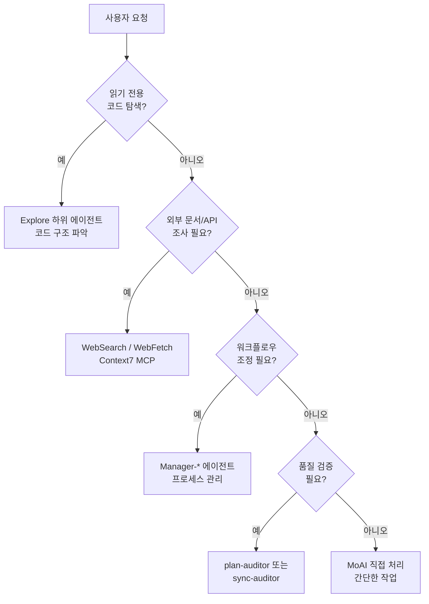

MoAI-ADK의 8개 핵심 에이전트 시스템을 상세히 안내합니다.


**한 줄 요약**: 에이전트는 각 분야의 **전문가 팀**입니다. MoAI가 팀 리더로서 적절한 전문가에게 작업을 배분합니다.


## 에이전트란?

에이전트는 특정 분야에 전문화된 **AI 작업 수행자**입니다.

Claude Code의 **Sub-agent (하위 에이전트)** 시스템을 기반으로 하며, 각 에이전트는 독립적인 컨텍스트 창, 사용자 정의 시스템 프롬프트, 특정 도구 액세스, 독립적인 권한을 가집니다.

회사 조직에 비유하면, MoAI는 CEO이고, Manager 에이전트는 부서장, Evaluator 에이전트는 품질 감시관, Builder 에이전트는 신규 팀 생성 담당자입니다.

## MoAI 오케스트레이터

MoAI는 MoAI-ADK의 **최상위 조율자**입니다. 사용자의 요청을 분석하고 적절한 에이전트에게 작업을 위임합니다 (8개 핵심 에이전트만).

### MoAI의 핵심 규칙

| 규칙 | 설명 |
|------|------|
| 위임 전용 | 복잡한 작업은 직접 수행하지 않고 전문 에이전트에게 위임 |
| 사용자 창구 | 사용자와의 상호작용은 MoAI만 수행 (하위 에이전트는 불가) |
| 병렬 실행 | 독립적인 작업은 여러 에이전트에게 동시에 위임 (Agent Teams 모드) |
| 결과 통합 | 에이전트 실행 결과를 취합하여 사용자에게 보고 |

## 8개 핵심 에이전트 카탈로그

MoAI-ADK는 **8개 핵심 에이전트** (7개 MoAI 사용자 정의 + 1개 Anthropic 내장)를 사용합니다.

### Manager 에이전트 (4개)

| 에이전트 | 역할 | 단계 | 주요 스킬 |
|----------|------|------|----------|
| `manager-spec` | SPEC 문서 생성, GEARS 형식 요구사항 | Plan | `moai-workflow-spec` |
| `manager-develop` | DDD/TDD 순환 구현 (quality.yaml의 cycle_type) | Run | `moai-workflow-ddd`, `moai-workflow-tdd` |
| `manager-docs` | 문서 생성, CHANGELOG, README 동기화 | Sync | `moai-workflow-project` |
| `manager-git` | PR 생성, Git 브랜칭, 머지 전략 | PR (Tier L) | `moai-foundation-core` |

### Evaluator 에이전트 (2개)

| 에이전트 | 역할 | 평가 대상 | 주요 스킬 |
|----------|------|---------|----------|
| `plan-auditor` | Plan 단계 독립 감사, GEARS 준수, 편향 방지 | SPEC 완성도 | `moai-foundation-core`, `moai-foundation-thinking` |
| `sync-auditor` | Sync 단계 품질 점수 (4차원: Functionality, Security, Craft, Consistency) | 구현 품질 | `moai-foundation-quality`, `moai-foundation-core` |

### Builder 에이전트 (1개)

| 에이전트 | 역할 | 생성물 |
|----------|------|--------|
| `builder-harness` | 프로젝트 고유의 동적 에이전트 팀 생성 (Socratic 인터뷰 기반) | `.claude/agents/harness/`, `.moai/harness/manifest.json` |

### 내장 에이전트 (1개, Anthropic)

| 에이전트 | 역할 | 특징 |
|----------|------|------|
| `Explore` | 읽기 전용 코드 탐색 및 분석 | Haiku 모델, Read-only 도구 |

## Manager-Develop 도메인 컨텍스트 주입

`manager-develop`은 도메인별 컨텍스트를 주입받아 호출됩니다.

- **백엔드 작업**: `manager-develop` + 백엔드 도메인 컨텍스트 + `moai-domain-backend` 스킬
- **프론트엔드 작업**: `manager-develop` + 프론트엔드 도메인 컨텍스트 + `moai-domain-frontend` 스킬
- **기타 도메인**: 언어별 스킬 + 전문성 프롬프트

## 에이전트 선택 결정 트리

MoAI가 사용자 요청을 분석하여 적절한 에이전트를 선택하는 과정입니다.



## 에이전트 정의 파일

8개 핵심 에이전트는 `.claude/agents/moai/` 디렉토리에 마크다운 파일로 정의됩니다.

### 파일 구조

```
.claude/agents/moai/
├── manager-spec.md
├── manager-develop.md
├── manager-docs.md
├── manager-git.md
├── plan-auditor.md
├── sync-auditor.md
├── builder-harness.md
└── (Explore: Anthropic 내장, 파일 없음)
```

### 에이전트 정의 형식

```markdown
---
name: my-specialist
description: >
  이 프로젝트의 전문가. 특정 도메인 전문성 설명.
tools: Read, Write, Edit, Grep, Glob, Bash
model: inherit
---

당신은 이 프로젝트의 [도메인] 전문가입니다.

## 역할

- 책임 1
- 책임 2
- 책임 3

## 사용 스킬

- moai-domain-[domain]
- 언어별 스킬
```

## 에이전트 간 협업 패턴

### Plan-Run-Sync 순차 워크플로우

```bash
# 1. manager-spec이 SPEC 생성
/moai plan "기능 설명"

# 2. plan-auditor가 SPEC 품질 검증
# (자동 실행)

# 3. manager-develop이 DDD/TDD 구현
/moai run SPEC-XXX

# 4. sync-auditor가 4차원 품질 점수
# (자동 실행)

# 5. manager-docs가 문서 동기화
/moai sync SPEC-XXX
```

### Agent Teams를 활용한 병렬 실행 (실험적)

```bash
# MoAI가 여러 전문가를 동시에 위임 (--team 플래그)
> /moai plan --team "사용자 인증 시스템"
> /moai run --team SPEC-AUTH-001
```

## Sub-agent 시스템 기초

Claude Code의 공식 Sub-agent 시스템은 MoAI-ADK의 에이전트 구조의 기반입니다.

### Sub-agent의 특징

| 특징 | 설명 |
|------|------|
| **독립 컨텍스트** | 각 sub-agent는 자체 200K 토큰 컨텍스트 창에서 실행 |
| **사용자 정의 프롬프트** | 전문 시스템 프롬프트로 역할과 행동 정의 |
| **특정 도구 액세스** | 필요한 도구만 선택적으로 제공 |
| **독립 권한** | 개별 권한 모드 설정 가능 |

### Sub-agent 제약사항

| 제약 | 설명 |
|------|------|
| 서브 에이전트 생성 불가 | 하위 에이전트는 다른 하위 에이전트를 생성할 수 없음 |
| AskUserQuestion 제한 | 하위 에이전트는 사용자와 직접 상호작용할 수 없음 |
| 스킬 비상속 | 부모 대화의 스킬을 상속하지 않음 |
| 독립 컨텍스트 | 각 에이전트는 독립적인 200K 토큰 컨텍스트를 가짐 |

## Agent Teams (실험적)

Agent Teams 모드는 동적 전문가들이 **병렬로 협업**하는 고급 워크플로우입니다.

### 팀 모드 설정

| 설정 | 기본값 | 설명 |
|---------|---------|-------------|
| `workflow.team.enabled` | `false` | Agent Teams 모드 활성화 |
| `workflow.team.max_teammates` | `5` | 팀당 최대 팀원 수 (Anthropic 권장) |
| `workflow.team.auto_selection` | `true` | 복잡도 기반 자동 모드 선택 |

### 모드 선택

| 플래그 | 동작 |
|-------|------|
| **--team** | Agent Teams 모드 강제 |
| **--solo** | Sub-agent 모드 강제 |
| **플래그 없음** | 복잡도 임계값 기반 자동 선택 |

## 관련 문서

- [Harness v4 Builder](/advanced/builder-agents) - 동적 에이전트 팀 생성
- [스킬 가이드](/advanced/skill-guide) - 에이전트가 활용하는 스킬 체계
- [SPEC 기반 개발](/workflow-commands/moai-plan) - SPEC 워크플로우 상세


**팁**: 에이전트를 직접 지정하지 않아도 됩니다. MoAI에게 자연어로 요청하면 최적의 에이전트를 자동으로 선택합니다.

