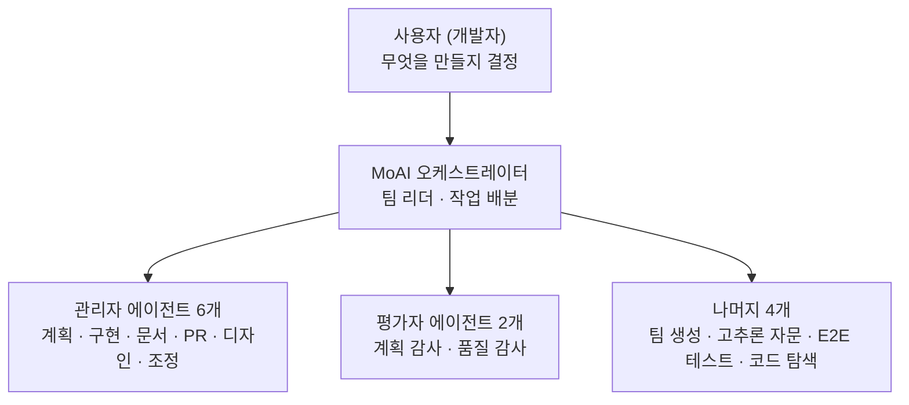
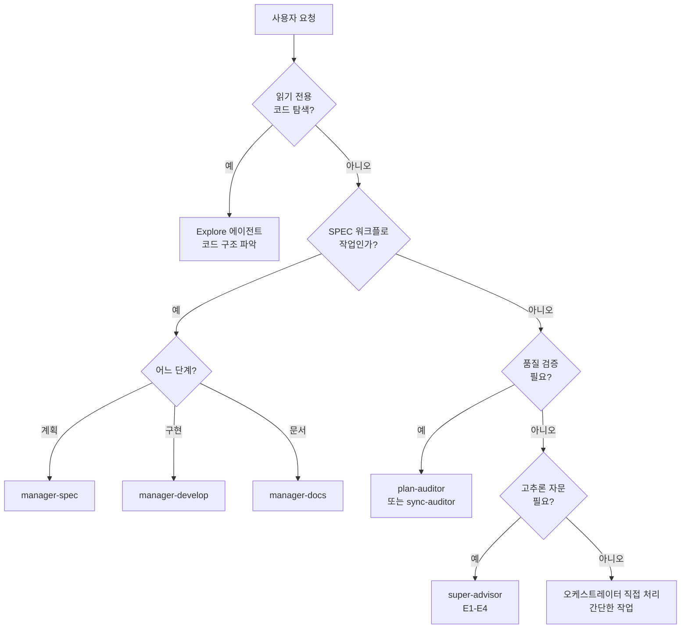
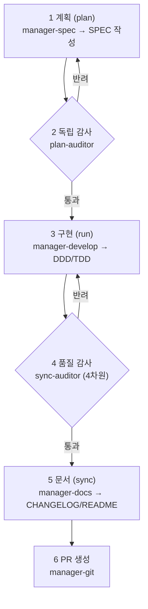
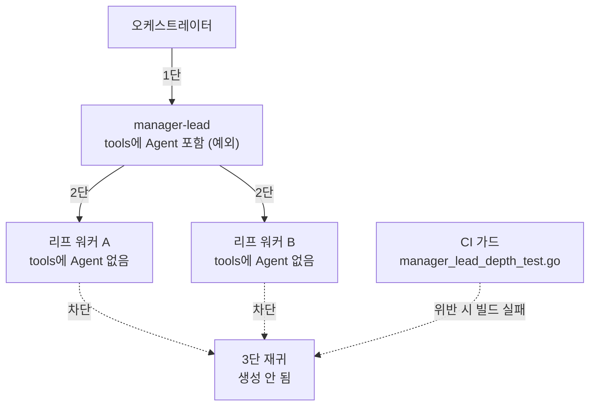

MoAI-ADK가 쓰는 12개 에이전트(스스로 일하는 AI 도우미) 카탈로그를 처음부터 차근차근 안내합니다. 이 문서는 "에이전트가 무엇이고, 왜 여럿 쓰는지, 어떻게 협업하는지"를 친구에게 설명할 수 있을 만큼 명확하게 풉니다.


**한 줄 요약**: 에이전트는 각 분야의 전문가입니다. MoAI는 팀 리더로서 적임자에게 작업을 맡기고, 이때 **계획을 세운 에이전트와 그 계획을 감사하는 에이전트를 반드시 다르게** 둡니다. 만든 사람이 자기 작업을 채점하지 않게 하려는 설계입니다.


## 에이전트란 무엇인가

에이전트는 특정 분야에 특화된 AI 작업 수행자입니다. 하나의 큰 AI가 모든 일을 하는 대신, MoAI-ADK는 일의 성격에 맞춰 여러 에이전트로 나누고 각자 자기 컨텍스트 창(기억 공간)과 시스템 지시문, 도구 접근 권한을 가집니다.

회사 조직에 빗대어 보면 이 구조가 자연스럽게 잡힙니다. 사용자는 프로덕트를 결정하는 오너, MoAI 오케스트레이터(전체 작업을 조율하는 중앙 지휘자)는 팀 리더, 관리자 에이전트는 각 부서장, 평가자 에이전트는 품질 감시관입니다. 이 비유는 그대로 구조에 옮겨집니다.

```mermaid
flowchart TD
    USER["사용자 (개발자)<br>무엇을 만들지 결정"] --> MOAI["MoAI 오케스트레이터<br>팀 리더 · 작업 배분"]
    MOAI --> MGR["관리자 에이전트 6개<br>계획 · 구현 · 문서 · PR · 디자인 · 조정"]
    MOAI --> EVAL["평가자 에이전트 2개<br>계획 감사 · 품질 감사"]
    MOAI --> ETC["나머지 4개<br>팀 생성 · 고추론 자문 · E2E 테스트 · 코드 탐색"]
```

에이전트는 모두 Claude Code의 하위 에이전트(Sub-agent) 시스템 위에서 돕니다. 하위 에이전트마다 독립된 컨텍스트 창, 맞춤 시스템 지시문, 선별된 도구, 별도 권한이 주어집니다. 이 기반 위에 MoAI-ADK가 12개 전문 역할을 올려 놓은 것입니다.

## 왜 에이전트를 여럿 두는가

에이전트 하나가 모든 일을 처리하면 편해 보이지만, 실무에서는 품질과 비용이 함께 무너집니다.

첫째, **품질**. 계획을 세운 에이전트가 그 계획이 잘 됐는지까지 판정하면 자기 작업에 관대해지기 쉽습니다. 사람도 내가 쓴 글을 내가 교정하면 오류가 잘 안 보입니다. 그래서 MoAI-ADK는 계획·구현을 맡는 관리자 계열과, 그 결과를 검사하는 평가자 계열을 설계 단계부터 분리했습니다.

둘째, **비용**. 에이전트마다 컨텍스트를 새로 채우고 추론을 돌려야 하므로 위임 한 번마다 토큰 비용이 듭니다. 그래서 "많을수록 좋다"가 성립하지 않습니다. 카탈로그는 v3 과정에서 22 → 17 → 8 → 10 → 12로 다듬어졌고, 지금은 각 역할이 겹치지 않는 최소한으로 유지됩니다. 에이전트 수를 줄이는 일 자체가 토크노믹스(토큰을 아껴 쓰는 일)의 일부입니다.


이 문서에서 자주 쓰는 네 단어를 먼저 정리합니다.

- **에이전트** (스스로 일하는 AI 도우미) — 특정 분야 작업을 맡은 AI 수행자
- **하네스** (품질 검증 자동 장치) — 에이전트가 잘 일하도록 두는 규칙과 게이트
- **스킬** (재사용 가능한 작업 지시서 묶음) — 에이전트가 호출해 쓰는 도메인 지식 묶음
- **SPEC** (요구사항 명세서) — 무엇을 왜 어떻게 만들지 적은 문서


## MoAI 오케스트레이터 — 팀 리더

MoAI 오케스트레이터는 사용자의 요청을 받아 의도를 분석(Analyze-First 라우팅)하고, 적임자 에이전트에게 작업을 위임한 뒤 결과를 취합해 보고하는 최상위 조율자입니다. 복잡한 작업은 직접 하지 않고 위임하는 것이 핵심 규칙입니다.

| 규칙 | 하는 일 |
|------|--------|
| 위임 전용 | 복잡한 작업은 전문 에이전트에게 맡깁니다 |
| 단일 창구 | 사용자와 대화하는 건 오케스트레이터뿐, 하위 에이전트는 사용자에게 말을 걸지 않습니다 |
| 병렬 실행 | 서로 의존하지 않는 읽기 전용 작업은 한 번에 여러 에이전트에게 맡깁니다 |
| 결과 통합 | 에이전트 결과를 모아 사용자에게 보고합니다 |

오케스트레이터가 어떤 에이전트를 부를지는 `.moai/config/sections/delegation.yaml`의 위임 맵(delegation map)이 기본값으로 잡아 줍니다. 다만 이 맵은 기본일 뿐 장벽은 아닙니다 — 작업 문맥에 따라 오케스트레이터가 판단해 바꿀 수 있습니다.

## 12개 에이전트 카탈로그

MoAI-ADK는 **12개 에이전트** (11개 MoAI 사용자 정의 + 1개 Anthropic 내장 `Explore`)를 씁니다. 다음은 역할별로 묶은 전체 목록입니다.

### 관리자 에이전트 — 6개

실제 산출물을 만드는 역군입니다. 각각 SPEC 워크플로의 한 단계를 맡습니다.

| 에이전트 | 맡은 일 | 단계 |
|----------|--------|------|
| `manager-spec` | SPEC 문서 작성, 요구사항을 규칙에 맞게 정리 | 계획 |
| `manager-develop` | DDD/TDD/autofix 순환으로 코드 구현 | 구현 |
| `manager-docs` | CHANGELOG · README · frontmatter 동기화 | 문서 |
| `manager-git` | PR 생성, 브랜치 전략, 머지 | PR |
| `manager-design` | 디자인 도구와 양방향으로 설계를 주고받음 | 디자인 |
| `manager-lead` | Tier L 규모 구현을 마일스톤별로 조정 | 구현 (Tier L) |

### 평가자 에이전트 — 2개

만든 쪽이 아닌 다른 에이전트가 검사합니다. 이 분리가 품질의 뼈대입니다.

| 에이전트 | 평가 대상 | 시점 |
|----------|----------|------|
| `plan-auditor` | SPEC 완성도, 요구사항 규칙 준수, 편향 | 계획 직후 |
| `sync-auditor` | 구현 품질 4차원 점수 (기능 · 보안 · 작법 · 일관성) | 문서 단계 |

### 빌더 · 자문 · 전문가 에이전트 — 3개

| 에이전트 | 맡은 일 |
|----------|--------|
| `builder-harness` | 프로젝트 전용 동적 에이전트 팀을 만듭니다 (사용자 인터뷰 기반) |
| `super-advisor` | 고추론 자문 — 교착 상태, 설계 기로, 세컨드 오피니언 (E1-E4 에스컬레이션) |
| `e2e-tester` | 웹/모바일/데스크탑 E2E 테스트를 실행합니다 |

### 내장 에이전트 — 1개

| 에이전트 | 맡은 일 |
|----------|--------|
| `Explore` | 읽기 전용 코드 탐색 · 분석 (Anthropic 내장, 파일 없음) |


각 에이전트의 `model`/`effort` 값은 배포되는 frontmatter이며, [프로필 매트릭스](/ko/advanced/profile-matrix/)의 설정에 따라 함께 바뀝니다. `model: inherit`은 부모 세션 모델을 그대로 이어받고, `effort`가 추론 토큰 예산을 결정합니다. 프로필을 올리면 구현·자문 에이전트가 더 깊은 추론으로 올라가고, 내리면 가벼운 작업은 더 싼 모델로 폴백합니다. 활성 프로필에서 실제 값을 확인하려면 `moai model profile`을 실행하세요.


## 계획과 감사의 분리 — 왜 만든 쪽이 검사하지 않는가

이 원칙은 카탈로그 전체를 관통하는 설계 철학입니다. `manager-spec`이 계획을 쓰면 `plan-auditor`가 별개 컨텍스트에서 검사하고, `manager-develop`이 구현을 끝내면 `sync-auditor`가 4차원 점수를 매깁니다. 만든 에이전트와 감사하는 에이전트가 다르기 때문에, grep 결과를 잘못 세거나 오래된 baseline을 인용하거나 검증 한 단계를 건너뛰는 자기 보고 실패가 검사 쪽에서 드러납니다.

감사 에이전트는 회의적 태도(fresh-judgment)로 접근합니다 — 모든 주장을 증거가 나올 때까지 의심하고, "통과한 것 같다"가 아니라 재현 가능한 결과만 인정합니다. 점수는 단순 평균이 아니라 조화 평균으로 계산돼, 한 차원이 무너지면 전체 점수가 함께 떨어집니다. 이 설계가 TRUST 5 품질 프레임워크의 신뢰를 지탱합니다.

## 도메인 전문성은 어떻게 들어오나

백엔드·프론트엔드·보안 등 분야마다 에이전트를 하나씩 두지 않습니다. 대신 `manager-develop` 하나가 작업 문맥에 맞춰 도메인 지식과 스킬을 주입받아 호출됩니다.

- 백엔드 작업 → `manager-develop` + 백엔드 컨텍스트 + `moai-domain-backend` 스킬
- 프론트엔드 작업 → `manager-develop` + 프론트엔드 컨텍스트 + `moai-domain-frontend` 스킬
- 다른 분야 → 그 언어에 맞는 스킬 + 전문성 지시문

이렇게 하면 카탈로그는 12개로 작게 유지하면서, 도메인 깊이는 스킬 주입으로 채웁니다. 에이전트 수를 늘려 토큰 비용을 키우는 대신, 스킬(재사용 가능한 작업 지시서 묶음)을 갈아 끼우는 구조입니다.

## 에이전트 선택 결정 트리

오케스트레이터가 요청을 받아 어느 에이전트를 부를지 정하는 흐름입니다. 대부분은 Analyze-First 라우팅이 자연어 의도만으로 분류하므로, 사용자가 에이전트를 직접 가리킬 필요는 거의 없습니다.

```mermaid
flowchart TD
    START["사용자 요청"] --> Q1{"읽기 전용<br>코드 탐색?"}
    Q1 -->|"예"| EXPLORE["Explore 에이전트<br>코드 구조 파악"]
    Q1 -->|"아니오"| Q2{"SPEC 워크플로<br>작업인가?"}
    Q2 -->|"예"| Q3{"어느 단계?"}
    Q3 -->|"계획"| SPEC["manager-spec"]
    Q3 -->|"구현"| DEV["manager-develop"]
    Q3 -->|"문서"| DOCS["manager-docs"]
    Q2 -->|"아니오"| Q4{"품질 검증<br>필요?"}
    Q4 -->|"예"| EV["plan-auditor<br>또는 sync-auditor"]
    Q4 -->|"아니오"| Q5{"고추론 자문<br>필요?"}
    Q5 -->|"예"| ADV["super-advisor<br>E1-E4"]
    Q5 -->|"아니오"| DIRECT["오케스트레이터 직접 처리<br>간단한 작업"]
```

## 함께 일하는 순서 — Plan-Run-Sync

에이전트들이 실제로 어떻게 이어지는지 보여주는 기본 흐름입니다. 단계와 단계 사이에 독립 감사가 끼어드는 게 핵심입니다. 사용자는 `/moai plan`, `/moai run`, `/moai sync`로 이 흐름을 진행합니다.

```mermaid
flowchart TD
    PLAN["1 계획 (plan)<br>manager-spec → SPEC 작성"] --> A1{"2 독립 감사<br>plan-auditor"}
    A1 -->|"반려"| PLAN
    A1 -->|"통과"| RUN["3 구현 (run)<br>manager-develop → DDD/TDD"]
    RUN --> A2{"4 품질 감사<br>sync-auditor (4차원)"}
    A2 -->|"반려"| RUN
    A2 -->|"통과"| SYNC["5 문서 (sync)<br>manager-docs → CHANGELOG/README"]
    SYNC --> PR["6 PR 생성<br>manager-git"]
```

감사에서 반려되면 이전 단계로 돌아갑니다. 이 "되돌아감"이 재작업 비용을 앞당겨 줍니다 — 품질 문제를 PR 직전이 아니라 각 단계 직후에 잡아 내기 때문입니다. 그래서 같은 실수가 다음 단계로 흘러가 비싼 비용을 만드는 일을 막습니다.

## 은퇴한 에이전트와 거부 규칙

과거에 쓰던 에이전트 이름이 문서나 복사한 메시지에 남아 있을 수 있습니다. 다음 12개 이름은 **은퇴(archived)** 했고, 부르면 생성이 거부됩니다.

`manager-strategy`, `manager-quality`, `manager-brain`, `manager-project`, `claude-code-guide` (MoAI 커스텀 파일 한정), `researcher`, `expert-backend`, `expert-frontend`, `expert-security`, `expert-devops`, `expert-performance`, `expert-refactoring`.


**주의**: 과거 세션에서 복사한 재개 메시지에 이런 이름이 들어 있으면 오케스트레이터가 생성을 거부합니다. 이때는 같은 일을 `Agent(general-purpose)`에 도메인 지시문을 실어 보내거나, 12개 현행 에이전트 가운데 하나로 대신 돌립니다. 대체 경로는 `.claude/rules/moai/workflow/archived-agent-rejection.md`에 정리돼 있습니다.


한 가지 헷갈리기 쉬운 점이 있습니다. `claude-code-guide`는 은퇴한 MoAI 커스텀 파일과 같은 이름을 쓰는 Claude Code 내장 도우미가 있습니다. 내장 도우미를 부르는 것은 거부 대상이 아닙니다 — 거부는 MoAI 커스텀 파일에만 걸립니다.

## 계층형 팀 — manager-lead

`manager-lead`는 Tier L 규모의 구현을 조정하는 전용 에이전트입니다. 직접 코드를 쓰지 않고, 마일스톤을 나눠 리프 워커(leaf worker)에게 맡긴 뒤 각 마일스톤 경계에서 컨텍스트를 접고 검증을 교차로 돌립니다. 리프 워커는 그때그때 `Agent(general-purpose)`로 만들어지며, 서로 쓰기 영역이 겹치지 않게 worktree로 격리된 브랜치에서 실행됩니다.

### 세 조건을 모두 만족할 때만

오케스트레이터는 아래 세 조건이 **모두(AND)** 성립할 때만 `manager-lead`를 만듭니다. 하나라도 모자라면 오케스트레이터가 직접 순차 처리합니다 — 조건 못 채운 작업에 조정 에이전트를 붙이면 비용만 늘고 회수가 안 되기 때문입니다.

| 조건 | 기준 |
|------|------|
| 마일스톤 수 | 3개 이상 |
| 쓰기 대상 파일 | 10개 이상 |
| 도메인 범위 | 서로 다른 도메인 3개 이상 (예: 백엔드 + 프론트엔드 + devops) |

세 조건은 OR가 아니라 AND입니다. 단일 마일스톤짜리 10파일 리팩터링처럼 한 조건만 걸치는 작업까지 끌어들이지 않으려고 의도적으로 좁게 잡은 값입니다.

### depth-2 봉인 — 계층이 두 겹까지만 열리는 까닭

12개 에이전트 가운데 `manager-lead`만이 `tools:` 목록에 `Agent` 도구를 담고 있습니다. 나머지는 모두 `Agent`를 빼서 평면 구조를 유지합니다. 그래서 오케스트레이터 → `manager-lead`가 1단, `manager-lead` → 리프 워커가 2단이고, 3단은 생기지 않습니다.

```mermaid
flowchart TD
    ORCH["오케스트레이터"] -->|"1단"| LEAD["manager-lead<br>tools에 Agent 포함 (예외)"]
    LEAD -->|"2단"| W1["리프 워커 A<br>tools에 Agent 없음"]
    LEAD -->|"2단"| W2["리프 워커 B<br>tools에 Agent 없음"]
    W1 -.->|"차단"| X["3단 재귀<br>생성 안 됨"]
    W2 -.->|"차단"| X
    GUARD["CI 가드<br>manager_lead_depth_test.go"] -.->|"위반 시 빌드 실패"| X
```


이 봉인은 **정책 불변량이지 런타임 불변량이 아닙니다**. Claude Code 런타임 자체는 더 깊은 재귀를 허용합니다 — v2.1.219부터 중첩 생성이 기본으로 켜져 있고 기본 깊이 상한은 3입니다. 그래서 깊이를 붙드는 실질적 장치는 두 가지뿐입니다: 에이전트의 `tools:`에서 `Agent`를 빼는 관행, 그리고 리프 워커 파일에 `Agent`가 있으면 빌드를 실패시키는 CI 가드입니다.


### 컨텍스트 접기와 교차 검증

마일스톤 하나가 끝나면 다음으로 넘어가기 전 세 단계를 밟습니다. 먼저 각 인수 기준(AC)의 검증 출력을 파일로 남겨 감사 때 인용할 수 있게 하고, 진행 기록에 한 줄 요약 행을 추가하며, 마지막으로 `/compact`로 컨텍스트를 압축합니다. 압축 뒤 토큰이 줄고 핸드오프 임계값(1M 계열 50%, 200K/256K 계열 90%) 아래로 떨어져야 다음 마일스톤으로 넘어갑니다 — 줄지 않으면 실패한 폴드로 보고 다시 계획합니다.

리프 워커가 어떤 AC를 통과로 표시하면, **그 작업을 하지 않은** 두 번째 워커를 읽기 전용(쓰기 도구를 뺀 `tools:`)으로 불러 같은 검증 명령을 다시 돌립니다. 두 번째 워커는 결과에 이해관계가 없어 자기 보고 실패가 그대로 드러납니다. 판정이 어긋나면 마일스톤을 멈추고 오케스트레이터에 blocker 보고서를 반환합니다 — 사용자에게 묻는 건 오케스트레이터 몫입니다. Tier S는 범위가 작아 교차 검증 비용이 얻는 것보다 커서 이 단계를 건너뜁니다.

sync 단계의 `sync-auditor`와는 역할이 다릅니다. `sync-auditor`는 구현이 끝난 뒤 4차원 점수를 매기는 최종 회의적 판독이고, peer 교차 검증은 구현 도중 AC 하나하나에 붙는 이진 판정입니다. 둘은 서로를 대신하지 않습니다.

## 에이전트 정의 파일

MoAI 사용자 정의 에이전트는 모두 `.claude/agents/moai/` 디렉터리에 마크다운 파일로 있습니다. 11개 MoAI 커스텀 파일이 여기에 들어 있고, `Explore`는 Anthropic 내장이라 디스크에 파일이 없습니다.


각 파일은 YAML frontmatter와 본문으로 됩니다. frontmatter에 `name`, `description`, `tools`(CSV 문자열), `model`, `effort`를 적고, 본문에 역할 · 책임 · 사용 스킬을 문장으로 씁니다. 새 에이전트를 직접 만들 때는 `builder-harness` 에이전트를 쓰거나 에이전트 작성 규칙(`.claude/rules/moai/development/agent-authoring.md`)을 따르세요.


## Sub-agent 시스템 기초

MoAI-ADK 에이전트 구조의 바탕은 Claude Code 공식 하위 에이전트 시스템입니다.

| 특징 | 설명 |
|------|------|
| 독립 컨텍스트 | 각 에이전트는 모델에 따른 자체 컨텍스트 창에서 실행됩니다 |
| 맞춤 지시문 | 전문 시스템 지시문으로 역할과 행동을 정합니다 |
| 선별 도구 | 필요한 도구만 선택적으로 줍니다 |
| 별도 권한 | 개별 권한 모드를 둘 수 있습니다 |

하위 에이전트는 사용자와 직접 대화하지 못합니다 — 필요한 입력이 모자라면 blocker 보고서를 반환하고, 오케스트레이터가 사용자에게 물어 다시 보냅니다. 이 경계가 "단일 창구" 규칙을 지킵니다.

## Agent Teams 정적 계층 — 은퇴

이전 버전의 Agent Teams 정적 오케스트레이션 계층(`workflow.team.*` 설정, `--team` 강제)은 은퇴했습니다. `--team`을 강제하면 `MODE_TEAM_UNAVAILABLE`을 알리고 하위 에이전트 모드로 폴백합니다.

병렬 조사·리뷰는 병렬 하위 에이전트 팬아웃으로, 순차 코딩은 하위 에이전트 체인으로 처리합니다. 네이티브 Claude Code teammate 런타임(`moai cg` GLM pane, `worktree --team`)은 별개로 계속 동작합니다 — CG 모드의 Claude 리더 + GLM 워커 분업이 병렬 역할을 대신합니다.

## 관련 문서

- [빌더 에이전트와 하네스 v4](/ko/advanced/builder-agents) — 동적 에이전트 팀 생성
- [스킬 가이드](/ko/advanced/skill-guide) — 에이전트가 쓰는 스킬 체계
- [SPEC 기반 개발](/ko/workflow-commands/moai-plan) — SPEC 워크플로 상세
- [프로필 매트릭스](/ko/advanced/profile-matrix/) — 모델 · effort 배정 전체


**팁**: 에이전트를 직접 가리키지 않아도 됩니다. MoAI에게 자연어로 요청하면 Analyze-First 라우팅이 의도를 분석해 적임자를 자동으로 고릅니다.

