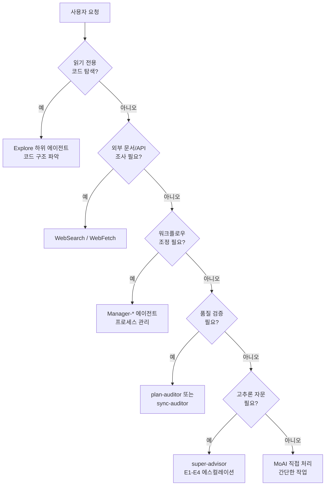

MoAI-ADK v3.0의 10개 핵심 에이전트 카탈로그를 상세히 안내합니다.


**한 줄 요약**: 에이전트는 각 분야의 **전문가 팀**입니다. MoAI가 팀 리더로서 적절한 전문가에게 작업을 배분합니다 — 그리고 계획을 만든 에이전트와 그것을 감사하는 에이전트는 반드시 분리됩니다.


## 에이전트란?

에이전트는 특정 분야에 전문화된 **AI 작업 수행자**입니다.

Claude Code의 **Sub-agent (하위 에이전트)** 시스템을 기반으로 하며, 각 에이전트는 독립적인 컨텍스트 창, 사용자 정의 시스템 프롬프트, 특정 도구 액세스, 독립적인 권한을 가집니다.

회사 조직에 비유하면 MoAI는 CEO, Manager 에이전트는 부서장, Evaluator 에이전트는 품질 감시관, Builder 에이전트는 신규 팀 생성 담당자, Advisor 에이전트는 외부 자문역입니다.

에이전트 수는 v3 기간 동안 22 → 17 → 8 → **10**으로 정련되었습니다. 에이전트가 많다고 좋은 게 아닙니다 — 위임 한 번마다 컨텍스트 비용이 들기 때문에, 카탈로그를 줄이는 것 자체가 토크노믹스의 일부입니다.

## MoAI 오케스트레이터

MoAI는 MoAI-ADK의 **최상위 조율자**입니다. 사용자의 요청을 분석하고 적절한 에이전트에게 작업을 위임합니다.

### MoAI의 핵심 규칙

| 규칙 | 설명 |
|------|------|
| 위임 전용 | 복잡한 작업은 직접 수행하지 않고 전문 에이전트에게 위임 |
| 사용자 창구 | 사용자와의 상호작용은 MoAI만 수행 (하위 에이전트는 불가) |
| 병렬 실행 | 독립적인 읽기 전용 작업은 여러 에이전트에게 동시에 위임 |
| 결과 통합 | 에이전트 실행 결과를 취합하여 사용자에게 보고 |

## 10개 핵심 에이전트 카탈로그

MoAI-ADK는 **10개 핵심 에이전트** (9개 MoAI 사용자 정의 + 1개 Anthropic 내장)를 사용합니다.

### Manager 에이전트 (5개)

| 에이전트 | 역할 | 단계 | 주요 스킬 |
|----------|------|------|----------|
| `manager-spec` | SPEC 문서 생성, GEARS 형식 요구사항 | Plan | `moai-workflow-spec` |
| `manager-develop` | DDD/TDD/autofix 순환 구현 (quality.yaml의 cycle_type) | Run | `moai-workflow-ddd`, `moai-workflow-tdd` |
| `manager-docs` | 문서 생성, CHANGELOG, README 동기화 | Sync | `moai-workflow-project` |
| `manager-git` | PR 생성, Git 브랜칭, 머지 전략 | PR (Tier L) | `moai-foundation-core` |
| `manager-design` | Claude Design 양방향 협업 (D1-D5 파이프라인) | Design | `moai-foundation-core` |

### Evaluator 에이전트 (2개)

| 에이전트 | 역할 | 평가 대상 | 주요 스킬 |
|----------|------|---------|----------|
| `plan-auditor` | Plan 단계 독립 감사, GEARS 준수, 편향 방지 | SPEC 완성도 | `moai-foundation-core`, `moai-foundation-thinking` |
| `sync-auditor` | Sync 단계 품질 점수 (4차원: Functionality, Security, Craft, Consistency) | 구현 품질 | `moai-foundation-quality`, `moai-foundation-core` |

계획과 감사가 분리되어 있다는 점이 핵심입니다 — 만든 사람이 자기 작업을 검사하지 않습니다.

### Builder 에이전트 (1개)

| 에이전트 | 역할 | 생성물 |
|----------|------|--------|
| `builder-harness` | 프로젝트 고유의 동적 에이전트 팀 생성 (Socratic 인터뷰 기반) | `.claude/agents/harness/`, `.moai/harness/manifest.json` |

### Advisor 에이전트 (1개)

| 에이전트 | 역할 | 특징 |
|----------|------|------|
| `super-advisor` | 고추론 자문 — 교착 상태, 설계 결정점, 세컨드 오피니언 (E1-E4 에스컬레이션) | 비구속 처방 — 최종 결정은 오케스트레이터 |

### 내장 에이전트 (1개, Anthropic)

| 에이전트 | 역할 | 특징 |
|----------|------|------|
| `Explore` | 읽기 전용 코드 탐색 및 분석 | Haiku 모델, Read-only 도구 |

## Manager-Develop 도메인 컨텍스트 주입

도메인마다 에이전트를 하나씩 두는 대신, `manager-develop` 하나가 도메인별 컨텍스트를 주입받아 호출됩니다.

- **백엔드 작업**: `manager-develop` + 백엔드 도메인 컨텍스트 + `moai-domain-backend` 스킬
- **프론트엔드 작업**: `manager-develop` + 프론트엔드 도메인 컨텍스트 + `moai-domain-frontend` 스킬
- **기타 도메인**: 언어별 스킬 + 전문성 프롬프트

## 에이전트 선택 결정 트리

MoAI가 사용자 요청을 분석하여 적절한 에이전트를 선택하는 과정입니다.


```mermaid
flowchart TD
    START[사용자 요청] --> Q1{읽기 전용<br>코드 탐색?}

    Q1 -->|예| EXPLORE["Explore 하위 에이전트<br>코드 구조 파악"]
    Q1 -->|아니오| Q2{외부 문서/API<br>조사 필요?}

    Q2 -->|예| WEB["WebSearch / WebFetch"]
    Q2 -->|아니오| Q3{워크플로우<br>조정 필요?}

    Q3 -->|예| MANAGER["Manager-* 에이전트<br>프로세스 관리"]
    Q3 -->|아니오| Q4{품질 검증<br>필요?}

    Q4 -->|예| EVAL["plan-auditor 또는<br>sync-auditor"]
    Q4 -->|아니오| Q5{고추론 자문<br>필요?}

    Q5 -->|예| ADVISOR["super-advisor<br>E1-E4 에스컬레이션"]
    Q5 -->|아니오| DIRECT["MoAI 직접 처리<br>간단한 작업"]
```

## 에이전트 정의 파일

9개 MoAI 사용자 정의 에이전트는 `.claude/agents/moai/` 디렉토리에 마크다운 파일로 정의됩니다.

### 파일 구조

```
.claude/agents/moai/
├── manager-spec.md
├── manager-develop.md
├── manager-docs.md
├── manager-git.md
├── manager-design.md
├── plan-auditor.md
├── sync-auditor.md
├── builder-harness.md
├── super-advisor.md
└── (Explore: Anthropic 내장, 파일 없음)
```

### 에이전트 정의 형식

```markdown
---
name: my-specialist
description: >
  이 프로젝트의 전문가. 특정 도메인 전문성 설명.
tools: Read, Write, Edit, Grep, Glob, Bash
model: inherit
---

당신은 이 프로젝트의 [도메인] 전문가입니다.

## 역할

- 책임 1
- 책임 2
- 책임 3

## 사용 스킬

- moai-domain-[domain]
- 언어별 스킬
```

## 에이전트 간 협업 패턴

### Plan-Run-Sync 순차 워크플로우

가장 기본이 되는 협업 흐름입니다. 각 단계 사이에 독립 감사가 끼어듭니다.

```bash
# 1. manager-spec이 SPEC 생성
/moai plan "기능 설명"

# 2. plan-auditor가 SPEC 품질 검증
# (자동 실행)

# 3. manager-develop이 DDD/TDD 구현
/moai run SPEC-XXX

# 4. sync-auditor가 4차원 품질 점수
# (자동 실행)

# 5. manager-docs가 문서 동기화
/moai sync SPEC-XXX
```

## Sub-agent 시스템 기초

Claude Code의 공식 Sub-agent 시스템은 MoAI-ADK 에이전트 구조의 기반입니다.

### Sub-agent의 특징

| 특징 | 설명 |
|------|------|
| **독립 컨텍스트** | 각 sub-agent는 자체 200K 토큰 컨텍스트 창에서 실행 |
| **사용자 정의 프롬프트** | 전문 시스템 프롬프트로 역할과 행동 정의 |
| **특정 도구 액세스** | 필요한 도구만 선택적으로 제공 |
| **독립 권한** | 개별 권한 모드 설정 가능 |

### Sub-agent 제약사항

| 제약 | 설명 |
|------|------|
| 서브 에이전트 생성 제한 | 하위 에이전트의 중첩 생성은 `Agent` 도구 허용 여부로 통제 — MoAI 에이전트는 중첩하지 않음 |
| AskUserQuestion 제한 | 하위 에이전트는 사용자와 직접 상호작용할 수 없음 (blocker 보고서로 반환) |
| 스킬 비상속 | 부모 대화의 스킬을 상속하지 않음 |
| 독립 컨텍스트 | 각 에이전트는 독립적인 200K 토큰 컨텍스트를 가짐 |

## Agent Teams 정적 계층 — v3.0에서 은퇴

이전 버전에 있던 Agent Teams 정적 오케스트레이션 계층 (`workflow.team.*` 설정, `--team` 강제 플래그)은 v3.0.0-rc11에서 **은퇴**했습니다.

- `--team`을 강제하면 `MODE_TEAM_UNAVAILABLE`을 알리고 sub-agent 모드로 자동 폴백합니다.
- 병렬성이 필요한 조사·리뷰 작업은 병렬 sub-agent 팬아웃으로, 순차 코딩 작업은 sub-agent 체인으로 처리합니다.
- 네이티브 Claude Code teammate 런타임 (`moai cg`의 GLM pane, `moai worktree --team`)은 이와 별개로 계속 동작합니다 — 토크노믹스 관점에서 CG 모드의 Claude 리더 + GLM 워커 분업이 이 역할을 대신합니다.

## 관련 문서

- [빌더 에이전트와 하네스 v4](/ko/advanced/builder-agents) - 동적 에이전트 팀 생성
- [스킬 가이드](/ko/advanced/skill-guide) - 에이전트가 활용하는 스킬 체계
- [SPEC 기반 개발](/ko/workflow-commands/moai-plan) - SPEC 워크플로우 상세


**팁**: 에이전트를 직접 지정하지 않아도 됩니다. MoAI에게 자연어로 요청하면 Analyze-First 라우팅이 의도를 분석해 최적의 에이전트를 자동으로 선택합니다.

