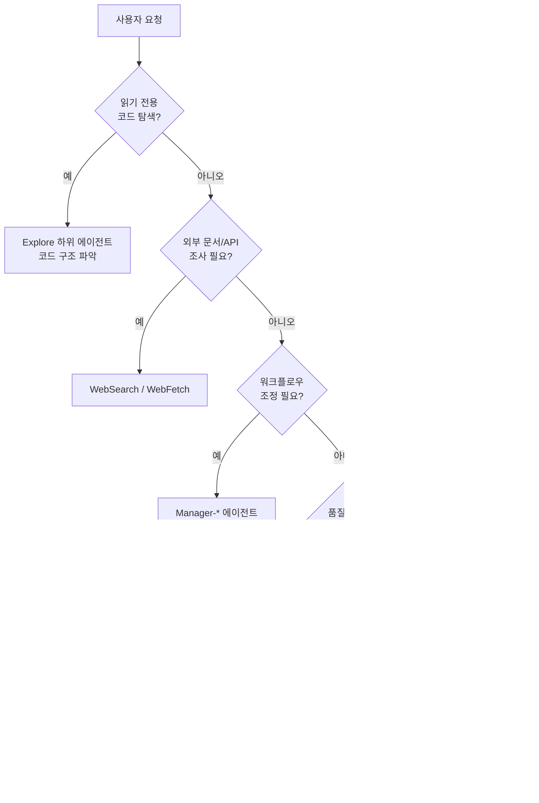
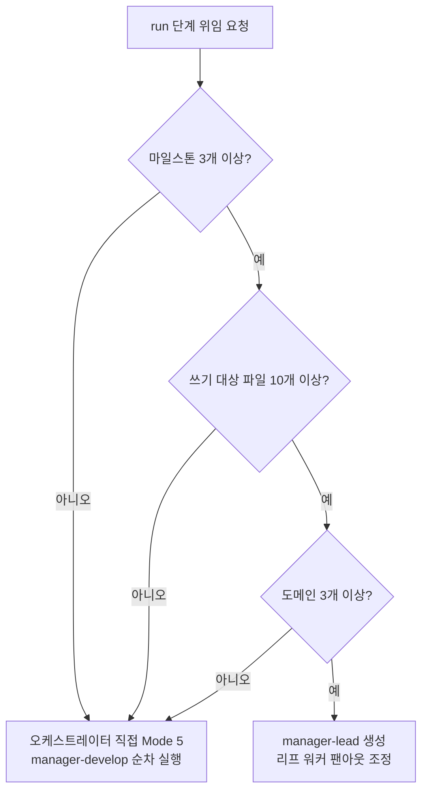
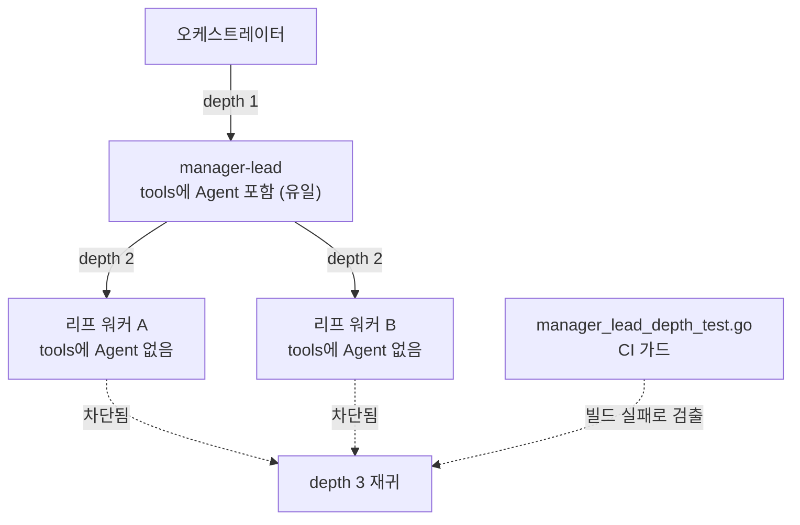
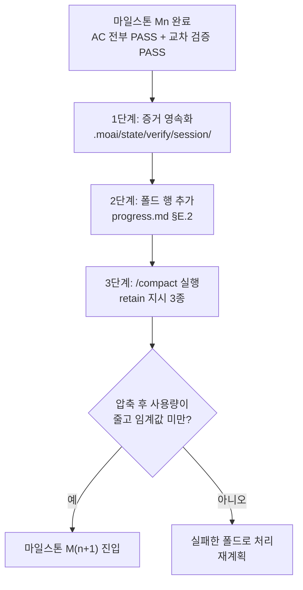
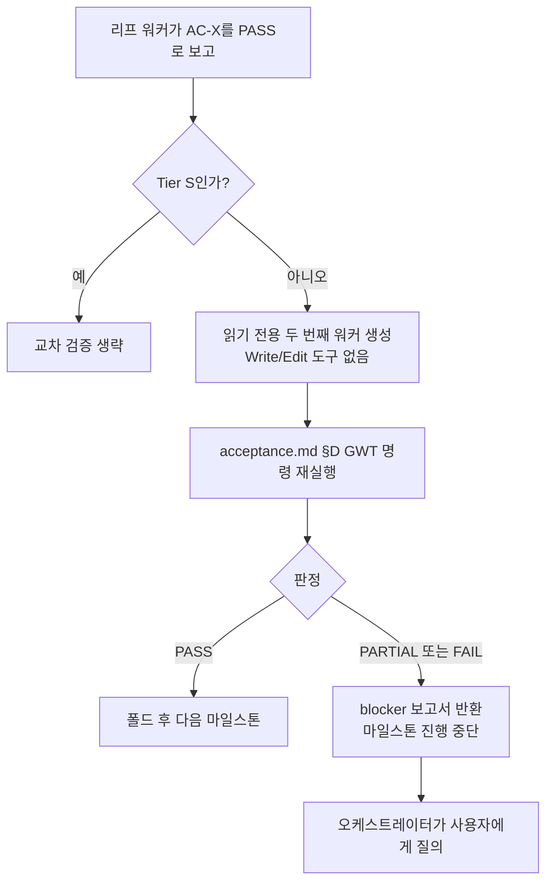

MoAI-ADK v3.0의 11개 핵심 에이전트 카탈로그를 상세히 안내합니다.


**한 줄 요약**: 에이전트는 각 분야의 **전문가 팀**입니다. MoAI가 팀 리더로서 적절한 전문가에게 작업을 배분합니다. 이때 계획을 만든 에이전트와 이를 감사하는 에이전트는 반드시 분리됩니다.



플랫폼 계층의 배경 설명은 [서브에이전트](/ko/claude-code/agentic/sub-agents)에 있습니다. MoAI-ADK 기준 설명은 이 문서입니다.


## 에이전트란?

에이전트는 특정 분야에 전문화된 **AI 작업 수행자**입니다.

Claude Code의 **Sub-agent(하위 에이전트)** 시스템 위에서 동작합니다. 에이전트마다 독립적인 컨텍스트 창, 사용자 정의 시스템 프롬프트, 선별된 도구 접근 권한, 별도의 권한 설정을 갖습니다.

회사 조직에 비유하면 MoAI는 CEO, Manager 에이전트는 부서장, Evaluator 에이전트는 품질 감시관, Builder 에이전트는 신규 팀 생성 담당자, Advisor 에이전트는 외부 자문역입니다.

에이전트 수는 v3 기간 동안 22 → 17 → 8 → 10 → **11**로 다듬어졌습니다. 에이전트가 많다고 좋은 게 아닙니다 — 위임 한 번마다 컨텍스트 비용이 들기 때문에 카탈로그를 줄이는 일 자체가 토크노믹스의 일부입니다.

## MoAI 오케스트레이터

MoAI는 MoAI-ADK의 **최상위 조율자**입니다. 사용자의 요청을 분석하고 적절한 에이전트에게 작업을 위임합니다.

### MoAI의 핵심 규칙

| 규칙 | 설명 |
|------|------|
| 위임 전용 | 복잡한 작업은 직접 수행하지 않고 전문 에이전트에게 위임 |
| 사용자 창구 | 사용자와의 상호작용은 MoAI만 수행 (하위 에이전트는 불가) |
| 병렬 실행 | 독립적인 읽기 전용 작업은 여러 에이전트에게 동시에 위임 |
| 결과 통합 | 에이전트 실행 결과를 취합하여 사용자에게 보고 |

## 12개 핵심 에이전트 카탈로그

MoAI-ADK는 **12개 핵심 에이전트** (11개 MoAI 사용자 정의 + 1개 Anthropic 내장)를 사용합니다.

### Manager 에이전트 (6개)

| 에이전트 | 역할 | 단계 | 모델 / effort | 주요 스킬 |
|----------|------|------|---------------|----------|
| `manager-spec` | SPEC 문서 생성, GEARS 형식 요구사항 | Plan | inherit / medium  | `moai-workflow-spec` |
| `manager-develop` | DDD/TDD/autofix 순환 구현 (quality.yaml의 cycle_type) | Run | inherit / medium  | `moai-workflow-ddd`, `moai-workflow-tdd` |
| `manager-docs` | 문서 생성, CHANGELOG, README 동기화 | Sync | inherit / low  | `moai-workflow-project` |
| `manager-git` | PR 생성, Git 브랜칭, 머지 전략 | PR (Tier L) | sonnet / low  | `moai-foundation-core` |
| `manager-design` | Claude Design 양방향 협업 (D1-D5 파이프라인) | Design | inherit / medium  | `moai-foundation-core` |
| `manager-lead` | 계층형 팀 Tier L 조정 (유일한 Agent-carrier, depth-2 seal) | Run (Tier L) | inherit / xhigh  | `moai-foundation-core`, `moai-workflow-project` |

### Evaluator 에이전트 (2개)

| 에이전트 | 역할 | 평가 대상 | 모델 / effort | 주요 스킬 |
|----------|------|---------|---------------|----------|
| `plan-auditor` | Plan 단계 독립 감사, GEARS 준수, 편향 방지 | SPEC 완성도 | inherit / medium  | `moai-foundation-core`, `moai-foundation-thinking` |
| `sync-auditor` | Sync 단계 품질 점수 (4차원: Functionality, Security, Craft, Consistency) | 구현 품질 | inherit / medium  | `moai-foundation-quality`, `moai-foundation-core` |

계획과 감사가 분리돼 있다는 게 핵심입니다 — 만든 사람이 자기 작업을 검사하지 않습니다.

### Builder 에이전트 (1개)

| 에이전트 | 역할 | 모델 / effort | 생성물 |
|----------|------|---------------|--------|
| `builder-harness` | 프로젝트 고유의 동적 specialist 팀 생성 (Socratic 인터뷰 기반) | inherit / medium  | `.claude/agents/harness/`, `.moai/harness/manifest.json` |

### Advisor 에이전트 (1개)

| 에이전트 | 역할 | 모델 / effort | 특징 |
|----------|------|---------------|------|
| `super-advisor` | 고추론 자문 — 교착 상태, 설계 결정점, 세컨드 오피니언 (E1-E4 에스컬레이션) | inherit / high  | 비구속 처방 — 최종 결정은 오케스트레이터 |

### Specialist 에이전트 (1개)

| 에이전트 | 역할 | 모델 / effort | 특징 |
|----------|------|---------------|------|
| `e2e-tester` | 웹/모바일/데스크탑 E2E 테스트 실행 (여정 스크립팅, CLI 우선 스위트 실행, 아티팩트 관리) | inherit / low  | `/moai e2e` 워크플로우의 실행 주체 — 선택 질문은 오케스트레이터 담당 |

### 내장 에이전트 (1개, Anthropic)

| 에이전트 | 역할 | 모델 / effort | 특징 |
|----------|------|---------------|------|
| `Explore` | 읽기 전용 코드 탐색 및 분석 | sonnet / low (호출 시점 기본값) | Read-only 도구; 디스크에 에이전트 파일이 없어 effort를 고정하지 않고 spawn 프롬프트에 명시 |


**4단계 토큰 비용 티어** ( max ·  high ·  medium ·  low): `model: inherit`은 부모 세션 모델을 상속하며, effort가 추론 토큰 예산을 결정합니다.

위 값은 **배포되는 frontmatter**이며, 갓 배포한 상태가 기본 프로필과 일치하도록 [프로필 매트릭스](/ko/advanced/profile-matrix/)의 `medium` 열에 고정돼 있습니다. 프로필을 바꾸면 이 값들도 함께 바뀝니다 — `high`에서는 `manager-develop`과 `super-advisor`가 `max`로 올라가고(`max`를 쓰는 유일한 두 셀), `low`에서는 에이전틱 행이 `low`로 내려가며 `manager-docs`와 `e2e-tester`는 Sonnet으로 폴백합니다. 활성 프로필에서 리졸브된 값은 `moai model profile`로 확인하세요.


## Manager-Develop 도메인 컨텍스트 주입

도메인마다 에이전트를 하나씩 두는 대신 `manager-develop` 하나가 도메인별 컨텍스트를 주입받아 호출됩니다.

- **백엔드 작업**: `manager-develop` + 백엔드 도메인 컨텍스트 + `moai-domain-backend` 스킬
- **프론트엔드 작업**: `manager-develop` + 프론트엔드 도메인 컨텍스트 + `moai-domain-frontend` 스킬
- **기타 도메인**: 언어별 스킬 + 전문성 프롬프트

## 에이전트 선택 결정 트리

MoAI가 사용자 요청을 분석하여 적절한 에이전트를 선택하는 과정입니다.


```mermaid
flowchart TD
    START[사용자 요청] --> Q1{읽기 전용<br>코드 탐색?}

    Q1 -->|예| EXPLORE["Explore 하위 에이전트<br>코드 구조 파악"]
    Q1 -->|아니오| Q2{외부 문서/API<br>조사 필요?}

    Q2 -->|예| WEB["WebSearch / WebFetch"]
    Q2 -->|아니오| Q3{워크플로우<br>조정 필요?}

    Q3 -->|예| MANAGER["Manager-* 에이전트<br>프로세스 관리"]
    Q3 -->|아니오| Q4{품질 검증<br>필요?}

    Q4 -->|예| EVAL["plan-auditor 또는<br>sync-auditor"]
    Q4 -->|아니오| Q5{고추론 자문<br>필요?}

    Q5 -->|예| ADVISOR["super-advisor<br>E1-E4 에스컬레이션"]
    Q5 -->|아니오| DIRECT["MoAI 직접 처리<br>간단한 작업"]
```

## 계층형 팀 — manager-lead 원리

`manager-lead`는 Tier L 규모의 run 단계를 조정하는 전용 에이전트입니다. 직접 코드를 쓰지 않고, 마일스톤을 나눠 리프 워커(leaf worker)에게 맡긴 뒤 각 마일스톤 경계에서 컨텍스트를 접고 검증을 교차로 돌립니다. 리프 워커는 `Agent(general-purpose)`로 그때그때 생성되며, 서로 쓰기 영역이 겹치지 않도록 worktree로 격리된 브랜치에서 실행됩니다.

이 위임 경로는 Mode 5(순차 하위 에이전트)의 변형이며 새 실행 모드가 아닙니다. 은퇴한 Agent Teams 정적 계층과도 무관합니다 — Mode 3 tombstone과 `MODE_TEAM_UNAVAILABLE` 동작은 그대로입니다.

### 진입 조건 — 세 가지를 모두 만족할 때만

오케스트레이터는 아래 세 조건이 **전부** 성립할 때만 `manager-lead`를 생성합니다. 하나라도 어긋나면 오케스트레이터가 Mode 5로 직접 마일스톤을 순차 처리합니다. 조건을 못 채운 작업에 `manager-lead`를 붙이면 조정 비용만 늘고 회수되지 않기 때문입니다.

| 축 | 기준 |
|----|------|
| 마일스톤 수 | plan.md §F 마일스톤 목록에 3개 이상 |
| 파일 표면 | 마일스톤 전체의 쓰기 대상이 10개 이상 |
| 도메인 범위 | 서로 다른 도메인 3개 이상 (예: 백엔드 + 프론트엔드 + devops) |

세 조건은 OR가 아니라 AND입니다. 단일 마일스톤짜리 10파일 리팩터링처럼 한 축만 걸치는 작업까지 끌어들이지 않으려고 의도적으로 좁게 잡은 값입니다. 오케스트레이터는 세 조건이 모두 충족됐다는 판단을 `progress.md` § Mode Selection에 기록한 뒤 생성합니다.


```mermaid
flowchart TD
    START["run 단계 위임 요청"] --> Q1{"마일스톤 3개 이상?"}
    Q1 -->|"아니오"| MODE5["오케스트레이터 직접 Mode 5<br>manager-develop 순차 실행"]
    Q1 -->|"예"| Q2{"쓰기 대상 파일 10개 이상?"}
    Q2 -->|"아니오"| MODE5
    Q2 -->|"예"| Q3{"도메인 3개 이상?"}
    Q3 -->|"아니오"| MODE5
    Q3 -->|"예"| LEAD["manager-lead 생성<br>리프 워커 팬아웃 조정"]
```

### depth-2 봉인

`manager-lead`는 카탈로그 에이전트 가운데 `tools:` 목록에 `Agent`를 담은 **유일한** 에이전트입니다. 나머지는 모두 `Agent`를 빼는 방식으로 평면 계층을 유지하는데, 그 예외를 딱 한 겹만 여는 자리입니다. 그래서 오케스트레이터 → `manager-lead`가 1단, `manager-lead` → 리프 워커가 2단이고, 3단은 생기지 않습니다.

리프 워커는 생성 시점에 `tools:` 목록을 받으며 여기서 `Agent`가 항상 빠집니다. 앞으로 리프 워커를 파일로 정의하게 되더라도 frontmatter의 `leaf_of: manager-lead` 또는 본문 마커 `<!-- manager-lead leaf-worker -->`로 스스로를 선언하면, `internal/template/manager_lead_depth_test.go`의 CI 가드가 그 파일의 `tools:`에 `Agent`가 있는지 검사해 빌드를 실패시킵니다.


이 봉인은 **MoAI 정책 불변식이지 런타임 불변식이 아닙니다**. Claude Code 런타임 자체는 더 깊은 재귀를 허용합니다 — v2.1.219부터 중첩 생성이 기본으로 켜져 있고 기본 깊이 상한은 3입니다. 즉 런타임은 막아주지 않으므로, 깊이를 붙드는 실질적인 장치는 `tools:`에서 `Agent`를 빼는 관행과 위 CI 가드 두 가지뿐입니다.



```mermaid
flowchart TD
    ORCH["오케스트레이터"] -->|"depth 1"| LEAD["manager-lead<br>tools에 Agent 포함 (유일)"]
    LEAD -->|"depth 2"| W1["리프 워커 A<br>tools에 Agent 없음"]
    LEAD -->|"depth 2"| W2["리프 워커 B<br>tools에 Agent 없음"]
    W1 -.->|"차단됨"| X["depth 3 재귀"]
    W2 -.->|"차단됨"| X
    GUARD["manager_lead_depth_test.go<br>CI 가드"] -.->|"빌드 실패로 검출"| X
```

### 컨텍스트 폴딩 3단계

마일스톤 Mn의 AC 행이 모두 PASS이고 그 행들의 교차 검증까지 PASS로 돌아오면, `manager-lead`는 다음 마일스톤으로 넘어가기 전에 세 단계를 밟습니다. 이 절차는 **이미 있는 도구만 조합**합니다 — 새 Go 코드도, 새 훅도, 새 CLI 서브커맨드도 만들지 않습니다.

1. **증거 영속화** — 각 AC의 검증 명령 출력을 `.moai/state/verify/<session>/M<n>.<AC-id>.{log,out}`으로 리다이렉트합니다. `/tmp`는 OS가 비우기 때문에 쓰지 않습니다. 감사 시점에 이 경로가 실제로 열려야 인용된 근거가 유효합니다. 증거를 채우지 못한 AC는 `PASS`가 아니라 `GAP`으로 표기합니다.
2. **폴드 행 추가** — `progress.md` §E.2에 기존 행 형식 그대로 한 줄을 덧붙입니다: `M<n>: <AC-id-1>=PASS, ... | evidence: .moai/state/verify/<session>/M<n>.* | fold-at: <ISO-8601>`. `M<n>:` 접두사는 `internal/spec/era.go`의 §E 헤딩 매처와 충돌하지 않도록 고른 형태여서, 매처를 손대지 않고 공존합니다.
3. **`/compact` 실행** — 유지할 항목을 명시해 압축합니다: retain-current-milestone(방금 끝낸 마일스톤과 그 폴드 행), retain-fold-rows(§E.2의 이전 폴드 행 전체), retain-armed-goal(`/moai goal`로 걸어둔 조건이 있으면 그 조건).

폴드 이후 불변식은 두 가지입니다 — 압축 후 토큰 사용량이 압축 전보다 줄어야 하고, 동시에 모델별 핸드오프 임계값(1M 계열 50%, 200K/256K 계열 90%) 아래여야 합니다. 줄지 않았다면 실패한 폴드로 보고 다시 계획합니다. 서브에이전트 컨텍스트에서 `/compact`를 쓸 수 없을 때는 blocker 보고서를 반환해 오케스트레이터가 대신 압축하거나 `/clear` + 재개 메시지 경로로 우회합니다.


```mermaid
flowchart TD
    MN["마일스톤 Mn 완료<br>AC 전부 PASS + 교차 검증 PASS"] --> S1["1단계: 증거 영속화<br>.moai/state/verify/session/"]
    S1 --> S2["2단계: 폴드 행 추가<br>progress.md §E.2"]
    S2 --> S3["3단계: /compact 실행<br>retain 지시 3종"]
    S3 --> CHECK{"압축 후 사용량이<br>줄고 임계값 미만?"}
    CHECK -->|"예"| NEXT["마일스톤 M(n+1) 진입"]
    CHECK -->|"아니오"| REPLAN["실패한 폴드로 처리<br>재계획"]
```

### peer 교차 검증

리프 워커가 어떤 AC를 PASS로 표기하면, `manager-lead`는 **그 작업을 하지 않은** 두 번째 `Agent(general-purpose)`를 읽기 전용으로 생성합니다. 읽기 전용은 `tools:`에서 Write/Edit/NotebookEdit를 빼는 방식으로 강제합니다. 이 워커는 `acceptance.md` §D의 Given-When-Then 명령을 그대로 다시 돌리고 `PASS` / `PARTIAL` / `FAIL` 중 하나를 반환합니다.

두 번째 워커는 저자의 주장에 아무 이해관계가 없습니다. 그래서 grep 결과를 잘못 세거나, 오래된 baseline을 인용하거나, 검증 명령 하나를 건너뛰는 식의 자기 보고 실패가 그대로 드러납니다.

`FAIL` 또는 `PARTIAL`이 나오면 `manager-lead`는 다음 마일스톤으로 넘어가지 않습니다. 대신 AC ID, 저자가 제시한 근거, 교차 검증 워커의 근거, 두 결과가 갈라진 지점을 담은 blocker 보고서를 오케스트레이터에 반환합니다. 사용자에게 묻는 일은 오케스트레이터 몫입니다 — 하위 에이전트는 사용자 창구를 쓰지 않습니다. Tier S는 교차 검증을 건너뜁니다(범위가 작아 검증 비용이 얻는 것보다 큽니다).

sync 단계의 `sync-auditor`와는 역할이 다릅니다. `sync-auditor`는 구현이 끝난 뒤 4차원 점수를 매기는 최종 회의적 판독이고, peer 교차 검증은 구현 도중 AC 하나하나에 붙는 이진 판정입니다. 둘은 서로를 대신하지 않습니다.


```mermaid
flowchart TD
    AUTHOR["리프 워커가 AC-X를 PASS로 보고"] --> TIER{"Tier S인가?"}
    TIER -->|"예"| SKIP["교차 검증 생략"]
    TIER -->|"아니오"| PEER["읽기 전용 두 번째 워커 생성<br>Write/Edit 도구 없음"]
    PEER --> RERUN["acceptance.md §D GWT 명령 재실행"]
    RERUN --> VERDICT{"판정"}
    VERDICT -->|"PASS"| NEXT["폴드 후 다음 마일스톤"]
    VERDICT -->|"PARTIAL 또는 FAIL"| BLOCK["blocker 보고서 반환<br>마일스톤 진행 중단"]
    BLOCK --> ORCH["오케스트레이터가 사용자에게 질의"]
```

## 에이전트 정의 파일

10개 MoAI 사용자 정의 에이전트는 `.claude/agents/moai/` 디렉터리에 마크다운 파일로 정의합니다.

### 파일 구조

```
.claude/agents/moai/
├── manager-spec.md
├── manager-develop.md
├── manager-docs.md
├── manager-git.md
├── manager-design.md
├── plan-auditor.md
├── sync-auditor.md
├── builder-harness.md
├── super-advisor.md
├── e2e-tester.md
└── (Explore: Anthropic 내장, 파일 없음)
```

### 에이전트 정의 형식

```markdown
---
name: my-specialist
description: >
  이 프로젝트의 전문가. 특정 도메인 전문성 설명.
tools: Read, Write, Edit, Grep, Glob, Bash
model: inherit
---

당신은 이 프로젝트의 [도메인] 전문가입니다.

## 역할

- 책임 1
- 책임 2
- 책임 3

## 사용 스킬

- moai-domain-[domain]
- 언어별 스킬
```

## 에이전트 간 협업 패턴

### Plan-Run-Sync 순차 워크플로우

가장 기본이 되는 협업 흐름입니다. 단계와 단계 사이에 독립 감사가 끼어듭니다.

```bash
# 1. manager-spec이 SPEC 생성
/moai plan "기능 설명"

# 2. plan-auditor가 SPEC 품질 검증
# (자동 실행)

# 3. manager-develop이 DDD/TDD 구현
/moai run SPEC-XXX

# 4. sync-auditor가 4차원 품질 점수
# (자동 실행)

# 5. manager-docs가 문서 동기화
/moai sync SPEC-XXX
```

## Sub-agent 시스템 기초

Claude Code의 공식 Sub-agent 시스템은 MoAI-ADK 에이전트 구조의 기반입니다.

### Sub-agent의 특징

| 특징 | 설명 |
|------|------|
| **독립 컨텍스트** | 각 sub-agent는 모델에 따른 자체 컨텍스트 창에서 실행 (모델 의존 — 1M급 모델도 존재) |
| **사용자 정의 프롬프트** | 전문 시스템 프롬프트로 역할과 행동 정의 |
| **특정 도구 액세스** | 필요한 도구만 선택적으로 제공 |
| **독립 권한** | 개별 권한 모드 설정 가능 |

### Sub-agent 제약사항

| 제약 | 설명 |
|------|------|
| 서브 에이전트 생성 제한 | 하위 에이전트의 중첩 생성은 `Agent` 도구 허용 여부로 통제 — MoAI 에이전트는 중첩하지 않음 |
| AskUserQuestion 제한 | 하위 에이전트는 사용자와 직접 상호작용할 수 없음 (blocker 보고서로 반환) |
| 스킬 비상속 | 부모 대화의 스킬을 상속하지 않음 |
| 독립 컨텍스트 | 에이전트마다 별도의 컨텍스트 창에서 실행 (크기는 모델에 따라 다름) |

## Agent Teams 정적 계층 — v3.0에서 은퇴

이전 버전에 있던 Agent Teams 정적 오케스트레이션 계층 (`workflow.team.*` 설정, `--team` 강제 플래그)은 v3.0.0에서 **은퇴**했습니다.

- `--team`을 강제하면 `MODE_TEAM_UNAVAILABLE`을 알리고 sub-agent 모드로 자동 폴백합니다.
- 병렬성이 필요한 조사·리뷰 작업은 병렬 sub-agent 팬아웃으로, 순차 코딩 작업은 sub-agent 체인으로 처리합니다.
- 네이티브 Claude Code teammate 런타임(`moai cg`의 GLM pane, `moai worktree --team`)은 이와 별개로 계속 동작합니다 — 토크노믹스 관점에서는 CG 모드의 Claude 리더 + GLM 워커 분업이 이 역할을 대신합니다.

## 관련 문서

- [빌더 에이전트와 하네스 v4](/ko/advanced/builder-agents) - 동적 에이전트 팀 생성
- [스킬 가이드](/ko/advanced/skill-guide) - 에이전트가 활용하는 스킬 체계
- [SPEC 기반 개발](/ko/workflow-commands/moai-plan) - SPEC 워크플로우 상세


**팁**: 에이전트를 직접 지정하지 않아도 됩니다. MoAI에게 자연어로 요청하면 Analyze-First 라우팅이 의도를 분석해 최적의 에이전트를 자동으로 선택합니다.

