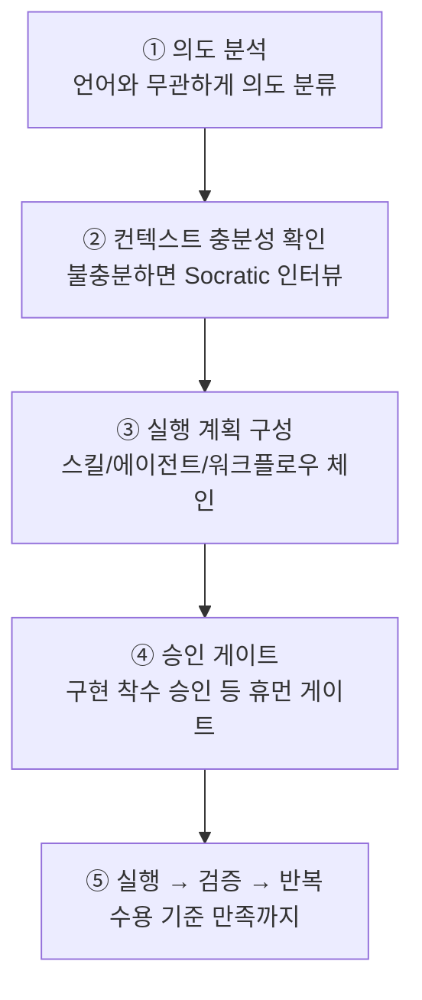

# Analyze-First 라우팅

v3 부터 `/moai` 의 기본 라우팅은 **Analyze-First** 입니다. 영어 키워드를 맞춰 보는 것이 아니라 요청의 의미를 분류합니다. 그래서 어떤 언어로 요청해도 같은 품질로 라우팅됩니다 — 한국어로 "로그인 버그 고쳐줘" 라고 해도, 영어로 "fix the login bug" 라고 해도, 의도 분석을 거쳐 같은 워크플로우에 닿습니다.

이 페이지는 Analyze-First 가 요청을 받아 실행으로 옮기는 다섯 단계를 따라갑니다.

## 다섯 단계 파이프라인

모든 요청 — `/moai` 서브커맨드든 자연어든, 어떤 입력 언어든 — 는 하나의 순서 파이프라인을 흐릅니다. 각 단계는 앞 단계의 결과를 입력으로 받습니다.

### ① 의도 분석

요청의 의도를 언어와 무관하게 분류합니다. 입력 언어가 한국어든 영어든 일본어든 상관없이, 기술 신호는 ③ 단계의 맥락으로만 쓰고 라우팅의 갈림길에는 세우지 않습니다. "이거 고쳐줘" 와 "fix this" 는 같은 의도(수정) 로 분류됩니다.

### ② 컨텍스트 충분성 확인

의도가 분류된 뒤, 요청을 실행하기에 맥락이 충분한지 검사합니다. 불충분하면 Rule 5 Context-First Discovery 의 Socratic 인터뷰를 `AskUserQuestion` 으로 돌려 명확화 질문을 던집니다. 충분하면 다음 단계로 넘어갑니다.

### ③ 실행 계획 구성

맥락이 갖춰지면 실행 계획을 짭니다. 어떤 스킬을 로드하고, 어떤 에이전트를 어떤 순서로 spawn 할지를 정합니다. 이 계획은 사소하지 않은 작업에 한해 실행 전 사용자에게 드러납니다 (Approach-First). 여기서 Phase 4 오케스트레이션 모드도 함께 골라, 병렬 팬아웃이 필요한지 순차 서브에이전트가 적절한지 결정합니다.

### ④ 승인 게이트

계획이 정해지면 파이프라인의 명명된 게이트를 순서대로 통과합니다. 특히 **구현 착수 승인** (plan → run 휴먼 게이트) 은 자율 우회 대상이 아닙니다 — 계획 산출물이 audit-ready 상태라도, run 단계 진입 직전에는 반드시 사용자의 명시적 승인을 `AskUserQuestion` 으로 받습니다. 자율성 축(반자율 vs 자율) 은 승인이 **지난 뒤** 무슨 일이 벌어지를 고를 뿐, 게이트 자체를 건너뛰지 않습니다.

### ⑤ 실행 → 검증 → 반복

승인이 나면 계획을 돌립니다. 수용 기준에 맞춰 검증하고, 필요하면 반복합니다. 목표가 무장된 상태(`/moai goal`) 라면, 목표 평가기가 종료 판정을 내립니다.

## 파이프라인 게이트

기본 파이프라인은 다음 네 게이트를 순서대로 통과합니다. 각 게이트는 독립적이며, FAIL 이나 INCONCLUSIVE 가 나오면 체인이 멈춥니다.

| 게이트 | 담당 | 역할 |
|--------|------|------|
| **Plan-audit 게이트** | plan-auditor | SPEC 계획 산출물을 따로 감사. 편향 방지를 위해 계획 짜는 쪽과 다른 에이전트가 평가 |
| **구현 착수 승인** | 사람 (휴먼 게이트) | 파이프라인 진입마다 정확히 1 회, 점수와 무관하게 항상 승인 |
| **Phase 4 모드 선택** | 오케스트레이터 | 구현 착수 승인 이후 자율 선택, `progress.md` 에 기록 |
| **Sync-audit 게이트** | sync-auditor | 동기화 결과를 4 차원(기능·보안·장인정신·일관성) 으로 평가 |


**구현 착수 승인은 점수와 무관합니다.** Plan-audit 가 PASS-eligible (0.90 이상) 이라 하더라도, run 단계 진입 전의 사용자 승인을 건너뛰지 않습니다. Phase 0.5 SKIP 과 구현 착수 승인은 다른 결정입니다 — 전자는 plan-auditor 재실행 여부(자동화 가능), 후자는 사용자가 run 에 진입할지(사용자 결정 필수) 입니다.


## 자연어 입력이 워크플로우로

서브커맨드 없이 자연어만 넣으면, ① 의도 분석이 알아서 적당한 워크플로우를 고릅니다.

- **수정** 의도 → `fix` 계열 워크플로우
- **신규 기능** 의도 → `plan → run → sync` 파이프라인
- **탐색** 의도 → 읽기 전용 서브에이전트 팬아웃

예를 들어 `/moai "로그인 버그 고쳐줘"` 라고만 넣어도, 의도 분석이 "수정" 으로 분류하고 `fix` 계열로 연결합니다. `/moai "소셜 로그인 추가하고 싶어"` 는 "신규 기능" 으로 분류되어 3-단계 파이프라인에 닿습니다. `/moai status` 처럼 한 단어짜리 의도도 그에 맞는 루트로 갑니다.

## Analyze-First 가 사용자에게 주는 것

- **언어 불편함 없음** — 영어 키워드를 외우지 않아도 됩니다. 모국어로 요청해도 같은 라우팅 품질.
- **투명한 게이트** — 실행 전에 어떤 스킬·에이전트가 순서대로 불릴지가 드러납니다.
- **일관된 승인 지점** — 자율 모드라도 run 진입 전 한 번은 사용자가 막을 수 있습니다.

## 관련 문서

- [/moai](/ko/utility-commands/moai/) — Analyze-First 의 진입점 명령어
- [SPEC 기반 개발](/ko/core-concepts/spec-based-dev/) — plan → run → sync 파이프라인의 상위 프레임
- [하네스 프로필과 평가](/ko/advanced/harness-profiles/) — 게이트 평가와 Tier 분류
