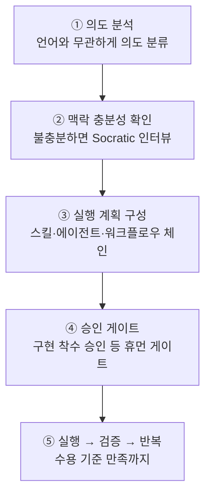
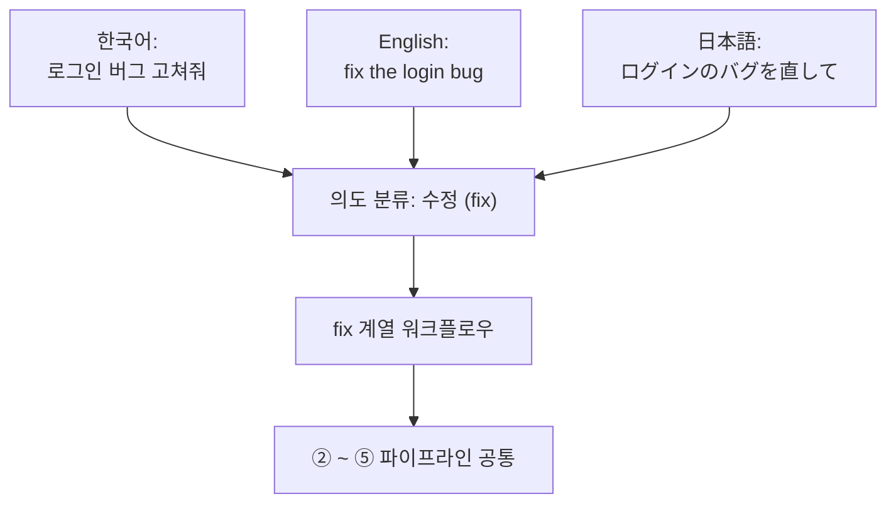

# Analyze-First 라우팅

에이전트(스스로 일하는 AI 도구) 오케스트레이터가 가장 먼저 하는 일은 "이 요청을 어디로 보낼까"를 정하는 라우팅입니다. v3부터 `/moai`의 기본 라우팅은 **Analyze-First**(요청의 의미를 먼저 분석해 길을 고르는 방식)입니다. 영어 키워드를 맞춰 보는 것이 아니라 요청이 무엇을 원하는지를 분류합니다. 덕분에 어떤 언어로 요청해도 같은 품질로 라우팅됩니다 — 한국어로 "로그인 버그 고쳐줘"라고 해도, 영어로 "fix the login bug"라고 해도, 일본어로 "ログインのバグを直して"라고 해도 의도 분석을 거쳐 같은 워크플로우에 닿습니다.

이 페이지는 Analyze-First가 왜 필요한지, 요청을 받아 실행으로 옮기는 다섯 단계가 어떻게 이어지는지, 그리고 그 사이에 어떤 승인 게이트가 서 있는지를 짚습니다.

## 왜 키워드가 아니라 의미인가

키워드 매칭 라우터는 겉보기엔 단순합니다. 사용자가 `/moai fix`라고 치면 fix 워크플로우로 보내고, `/moai plan`이라고 치면 plan 워크플로우로 보냅니다. 하지만 이 방식은 두 가지에서 부러집니다.

먼저, 사용자가 영어 명령어 어휘를 외우고 있어야 합니다. "로그인 버그 고쳐줘"처럼 모국어로 자연스럽게 말하면 라우터가 듣지 못합니다. 그래서 사용자는 매번 "아, 이건 fix인지 plan인지 run인지 영어로 맞춰서 쳐야지"를 생각해야 합니다. 둘째, 비슷한 말이 서로 다른 길로 갈 수 있습니다. "고쳐줘", "수정해 줘", "버그 잡아 줘"가 같은 의도인데 키워드가 다르면 결과도 달라집니다. 라우터가 단어를 보고 갈라지면, 사용자는 자기가 어떤 단어를 썼느냐에 따라 매번 다른 경험을 하게 됩니다.

Analyze-First는 이 두 문제를 "의미를 분류하면 된다"로 풉니다. 라우터가 분류하는 것은 겉의 단어가 아니라 **의도**(사용자가 무엇을 원하는지)입니다. 의도가 같으면 어떤 언어·어떤 표현으로 들어와도 같은 길로 갑니다. 기술 신호(예: "Go 프로젝트다", "테스트 파일이다")는 의도가 아니라 맥락으로만 쓰고, 라우팅의 갈림길에는 세우지 않습니다. 이 구분이 Analyze-First의 핵심이며, 이를 담당하는 분류기를 **Intent Router**(의도를 분류해 길을 고르는 장치)라고 부릅니다.


**병원 접수 데스크에 비유하면**

키워드 매칭 라우터는 "정형외과"라는 영어 단어를 정확히 말해야만 해당 진료실로 보내주는 접수 데스크와 같습니다. "팔이 부러졌어요"라고 한국어로 말하면 알아듣지 못합니다.

Analyze-First 라우터는 증상을 듣고 **필요(need)**를 분류하는 접수 데스크입니다. "팔이 부러졌어요", "I broke my arm", "腕が折れました" 어느 쪽으로 들어와도 "뼈 다침"으로 분류해 같은 진료실로 보냅니다. 사용자는 진료실의 영어 이름을 알 필요가 없습니다.


## 다섯 단계 파이프라인

모든 요청 — `/moai` 서브커맨드든 자연어든, 어떤 입력 언어든 — 는 하나의 순서 파이프라인을 흐릅니다. 각 단계는 앞 단계의 결과를 입력으로 받고, 어느 단계에서든 "맥락이 부족하다"거나 "승인이 필요하다"가 걸리면 다음 단계로 넘어가지 못합니다.

### ① 의도 분석

요청의 의도를 언어와 무관하게 분류합니다. 입력 언어가 한국어든 영어든 일본어든 상관없이, "이거 고쳐줘"와 "fix this"와 "これを直して"는 같은 의도(수정)로 분류됩니다. 이때 기술 신호 — 예를 들어 "이건 Go 파일이다", "테스트 디렉터리 안에 있다" — 는 라우팅 판정에 쓰지 않고 ③ 단계의 맥락으로만 넘깁니다. 의도와 기술을 한꺼번에 보면 "Go 프로젝트의 버그 수정"과 "Python 프로젝트의 버그 수정"이 서로 다른 길로 갈 수 있는데, 이는 라우터가 잘못 배운 짓입니다. 언어와 프레임워크는 "어떻게"에 대한 정보이고 "무엇을"에 대한 판정은 아닙니다.

Intent Router는 두 경로를 가집니다. **P1 서브커맨드 빠른길**(사용자가 `/moai plan`처럼 서브커맨드를 명시한 경우, 분류를 건너뛰고 곧장 해당 워크플로우로 감)과 **P3 의미 분류**(서브커맨드 없이 자연어만 들어온 경우, 의도를 분류해 알맞은 워크플로우를 고름)입니다. 서브커맨드를 알면 분류할 필요가 없고, 모르면 분류하면 됩니다 — 두 경로 모두 같은 파이프라인으로 합쳐집니다.

### ② 맥락 충분성 확인

의도가 분류된 뒤, 요청을 실행하기에 맥락이 충분한지 검사합니다. "버그 고쳐줘"는 의도가 분명하지만 **어떤 버그**인지, **어디에서** 재현되는지, **어떤 동작이 정상**인지가 비어 있으면 실행할 수 없습니다. 불충분하면 Rule 5 Context-First Discovery의 **Socratic 인터뷰**(한 번에 하나씩 좁혀가는 명확화 대화)를 `AskUserQuestion`(사용자에게 선택지를 제시해 답을 얻는 질문 채널)로 돌려 명확화 질문을 던집니다. 맥락이 100% 명확해질 때까지 인터뷰 라운드를 이어가고, 충분해지면 다음 단계로 넘어갑니다.

### ③ 실행 계획 구성

맥락이 갖춰지면 실행 계획을 짭니다. 어떤 스킬을 로드하고, 어떤 에이전트를 어떤 순서로 불러낼지, 동적 워크플로우가 필요한지를 정합니다. 이 계획은 사소하지 않은 작업에 한해 실행 전 사용자에게 드러납니다(Approach-First, "이렇게 하겠습니다"를 먼저 보여주는 방식). 사용자가 보고 고칠 수 있도록 계획은 편집 가능한 형태로 제시됩니다.

여기서 **오케스트레이션 모드**도 함께 고릅니다. 작업이 순차적으로 이어지는 코딩 중심이면 서브에이전트 모드(한 단계씩 에이전트에게 넘기는 기본 형태)로, 여러 독립된 시각이 필요한 조사·리뷰면 병렬 팬아웃(3~5개의 읽기 전용 에이전트를 동시에 퍼뜨리는 형태)으로, 수십 개 파일에 같은 변환을 가하는 기계적 대량 작업이면 동적 워크플로우(스크립트가 다수 에이전트를 조정하는 형태)로 갑니다. 모드 선택은 자율 판정이며, 그 근거는 작업 로그에 남습니다.

### ④ 승인 게이트

계획이 정해지면 파이프라인의 명명된 게이트를 순서대로 통과합니다. 그중 가장 중요한 것이 **구현 착수 승인**(Implementation Kickoff Approval, plan에서 run으로 넘어가기 전 사람이 누르는 필수 승인)입니다. 이 게이트는 자율 우회 대상이 아닙니다 — 계획 산출물이 감사를 통과한 상태라도, run 단계 진입 직전에는 반드시 사용자의 명시적 승인을 받습니다.

왜 점수와 무관하게 항상 승인을 받을까. 품질 점수는 "이 계획이 얼마나 잘 짜였는가"를 가리킬 뿐, "지금 토큰을 쓰고 작업 트리를 바꾸기 시작해도 되는가"는 가리키지 않습니다. 후자는 품질 문제가 아니라 사용자 결정입니다. 그래서 감사 점수가 아무리 높아도, 그 점수는 "계획이 좋다"일 뿐 "진행해도 좋다"가 될 수 없습니다.

승인을 지나면 자율성 축이 하나 더 열립니다. **반자율**(한 단계마다 사용자가 확인)과 **자율**(조건이 갖추면 사람 개입 없이 진행) 중 하나를 고르는 것입니다. 이 축은 승인이 **지난 뒤** 무슨 일이 벌어질지를 고를 뿐, 게이트 자체를 건너뛰지 않습니다. "승인을 받은 다음 얼마나 자율으로 진행할지"와 "승인을 받을지 말지"는 다른 결정입니다.

### ⑤ 실행 → 검증 → 반복

승인이 나면 계획을 돌립니다. SPEC(요구사항 명세서)의 수용 기준에 맞춰 검증하고, 필요하면 반복합니다. 목표가 무장된 상태(`/moai goal`)라면, **목표 평가기**(한 턴이 끝날 때 완료 조건을 검사하는 장치)가 종료 판정을 내립니다. 목표가 없으면 각 단계의 게이트가 통과 여부를 판정합니다.

## 언어가 바뀌어도 같은 워크플로우로

아래 그림은 같은 의도를 세 언어로 표현했을 때 Analyze-First가 어떻게 하나의 워크플로우로 수렴시키는지를 보여줍니다. 단어는 다르지만 의도(수정)가 같으므로, Intent Router는 같은 노드로 보냅니다.

이 수렴이 성립하려면 한 가지 전제가 있습니다. 라우터가 의도를 **의미**로 분류하고, 겉의 **단어**로 분류하지 않아야 합니다. 단어로 분류하면 세 입력이 세 갈래로 갈라지고, 의미로 분류하면 세 입력이 한 갈래로 합쳐집니다. Analyze-First는 후자를 택합니다.

## 자연어 한 줄이 워크플로우로

서브커맨드 없이 자연어만 넣으면, ① 의도 분석(P3 의미 분류 경로)이 알아서 적당한 워크플로우를 고릅니다. 아래는 자주 나타나는 세 가지 의도와 그 연결입니다.

- **수정** 의도 → `fix` 계열 워크플로우 (진단 도구가 찾은 이슈를 잇달아 수정)
- **신규 기능** 의도 → `plan → run → sync` 3단계 파이프라인
- **탐색** 의도 → 읽기 전용 서브에이전트 병렬 팬아웃

예를 들어 `/moai "로그인 버그 고쳐줘"`라고만 넣어도, 의도 분석이 "수정"으로 분류하고 `fix` 계열로 연결합니다. `/moai "소셜 로그인 추가하고 싶어"`는 "신규 기능"으로 분류되어 3단계 파이프라인에 닿습니다. `/moai "이 코드베이스 구조 한 번 분석해 줘"`는 "탐색"으로 분류되어 읽기 전용 에이전트들이 병렬로 달려붙습니다. 서브커맨드를 알면 `/moai fix`, `/moai plan`처럼 직접 부르는 것이 빠르지만(P1 빠른길), 모르면 자연어로 부르면 됩니다(P3 의미 분류가 대신 고릅니다).

## 파이프라인 게이트

기본 파이프라인은 다음 네 게이트를 순서대로 통과합니다. 각 게이트는 독립적이며, FAIL이나 INCONCLUSIVE가 나오면 체인이 멈춥니다.

| 게이트 | 담당 | 역할 |
|--------|------|------|
| **Plan-audit 게이트** | plan-auditor 에이전트 | SPEC 계획 산출물을 따로 감사. 편향 방지를 위해 계획 짜는 쪽과 다른 에이전트가 평가 |
| **구현 착수 승인** | 사람 (휴먼 게이트) | 파이프라인 진입마다 정확히 1회, 점수와 무관하게 항상 승인 |
| **오케스트레이션 모드 선택** | 오케스트레이터 | 구현 착수 승인 이후 자율 선택, 작업 로그에 기록 |
| **Sync-audit 게이트** | sync-auditor 에이전트 | 동기화 결과를 4차원(기능 · 보안 · 장인정신 · 일관성)으로 평가 |


**구현 착수 승인은 점수와 무관합니다.** Plan-audit가 통과 가능 점수(예: 0.90 이상)를 받았더라도, run 단계 진입 전의 사용자 승인을 건너뛰지 않습니다. 계획 단계 감사 재실행 여부(자동화 가능)와 구현 착수 승인(사용자 결정 필수)은 다른 결정입니다 — 전자는 품질 점수로 넘어갈 수 있지만, 후자는 "이제 작업을 시작해도 되는가"라는 사용자 판단이므로 점수가 대신할 수 없습니다.


## Analyze-First가 사용자에게 주는 것

- **언어 불편함 없음** — 영어 키워드를 외우지 않아도 됩니다. 모국어로 요청해도 같은 라우팅 품질. 이것이 Analyze-First를 도입한 가장 큰 이유입니다.
- **투명한 계획** — 실행 전에 어떤 스킬과 에이전트가 순서대로 불릴지가 드러납니다. 사용자는 계획을 보고 고칠 수 있습니다.
- **일관된 승인 지점** — 자율 모드라도 run 진입 전 한 번은 사용자가 막을 수 있습니다. 자율성 축은 이 게이트 다음에만 열립니다.

## 관련 문서

- [/moai](/ko/utility-commands/moai/) — Analyze-First의 진입점 명령어
- [SPEC 기반 개발](/ko/core-concepts/spec-based-dev/) — plan → run → sync 파이프라인의 상위 프레임
- [자율성 티어](/ko/advanced/autonomy-tier/) — 구현 착수 승인 이후 자율성 축이 어디까지 풀리는지
- [하네스 프로필과 평가](/ko/advanced/harness-profiles/) — 게이트 평가와 Tier 분류
