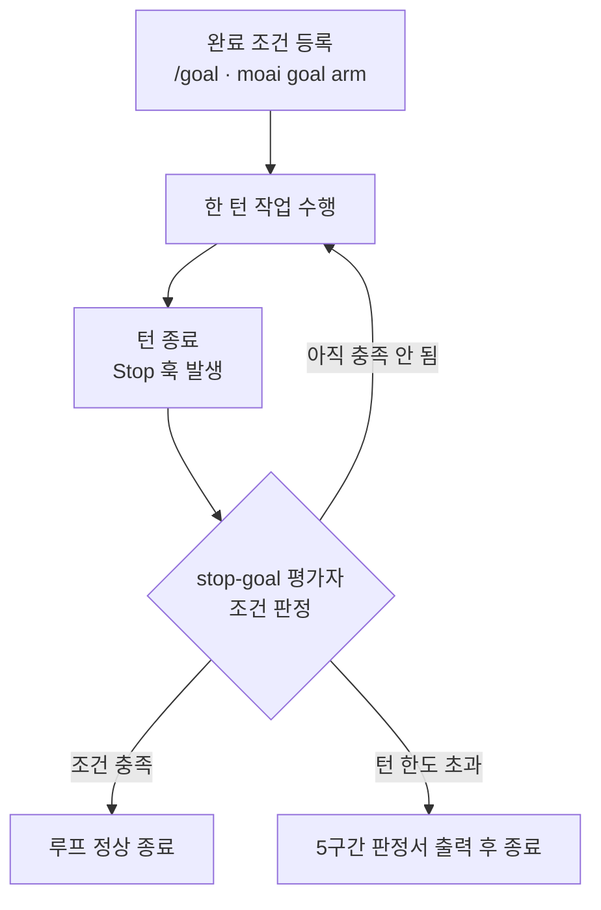

에이전트(스스로 일하는 AI 도우미) 세션의 핵심 질문은 "언제 멈추고 언제 계속할 것인가"입니다. 한 턴으로 끝나는 작업도 있지만, 수십 턴을 돌아야 수렴하는 작업도 있습니다. "모든 테스트가 PASS할 때까지", "진단 도구가 찾은 이슈 큐를 다 비울 때까지" 같은 일이 그렇습니다. 그런데 턴마다 사용자가 프롬프트를 다시 넣어야 한다면 자율성의 이점은 사라집니다.

연속 루프 원시(루프를 만드는 기본 도구)가 이 문제를 풉니다. 완료 조건(언제 끝났다고 볼지 정하는 문장)을 선언해 두면, 조건이 충족되거나 턴 한도에 닿을 때까지 세션이 알아서 작업을 이어갑니다. 이 페이지는 세 가지 루프 원시를 한 줄로 구분한 뒤, 실제로 루프를 걸고 제어하는 네 단계를 짚어 줍니다.


**자율 주행에 비유하면**

보통 세션은 "사용자가 엑셀을 밟을 때만 한 블록씩 움직이는 차"와 같습니다. 연속 루프는 "목적지를 설정해 두면 스스로 도착할 때까지 달리는 크루즈 컨트롤"입니다. 목적지(완료 조건)만 분명하면, 턴마다 다시 운전대를 잡을 필요가 없습니다.

다만 출발 전에 "운전 시작해도 되나요?"를 묻는 구현 착수 승인(Implementation Kickoff Approval, plan에서 run으로 넘어가기 전 사람이 누르는 필수 승인)은 크루즈 컨트롤이 대신 눌러 주지 않습니다.


## 3가지 연속 루프 원시 한눈에 보기

연속 루프 원시는 세 가지입니다. 둘은 MoAI-ADK가, 나머지 하나는 Claude Code가 소유하며, 각각 트리거 방식이 다릅니다.

| 원시 | 소유권 | 트리거 | 언제 적합한가 |
|------|--------|--------|---------------|
| `/goal` | 사용자 TUI (HUMAN-ONLY) | 턴이 끝날 때 작은 모델이 판정 | "이 조건이 참일 때까지 계속" |
| `/moai goal` | 오케스트레이터 (PROGRAMMATIC) | stop-goal Stop 훅 평가자 | MoAI 파이프라인 안에서 자율 연속 |
| `/moai loop` | 골 엔진 위의 프리셋 (진단 기반) | 진단 도구가 만든 이슈 큐 | "도구가 찾은 이슈를 다 수정" |

세 원시는 모두 "조건을 걸어 두고 턴이 끝날 때마다 판정한다"는 같은 흐름을 따릅니다. 차이는 조건을 누가 거는지(사람 vs 프로그램), 그리고 조건이 어디서 오는지(직접 작성 vs 진단 도구)에 있습니다.



평가자(한 턴이 끝날 때 조건을 검사하는 장치)는 "계속할지 말지만" 정합니다. 평가자가 대신 코드를 고쳐 주거나 파괴적인 작업을 승인해 주지는 않습니다.

## Step 1: 완료 조건 설계하기

세 원시 중 어떤 것을 쓰든, 가장 먼저 할 일은 "끝"을 분명히 정의하는 것입니다. 조건이 모호하면 루프가 언제 멈춰야 할지 판정자가 알 수 없습니다. 잘 듣는 조건은 세 가지를 갖춥니다.

- **측정 가능한 종료 상태 하나** — 테스트 결과, 빌드 종료 코드, 파일 개수, 빈 큐. "코드가 깔끔해진다"처럼 주관적인 표현은 판정자가 확인할 수 없습니다.
- **검증 방법 명시** — 무엇으로 증명해야 하는지를 씁니다. "`go test ./... exits 0`"처럼 명령의 결과로 증명되어야 합니다.
- **지켜야 할 제약** — 도중에 건드리면 안 되는 것. "수정한 테스트 파일 외에는 변경 금지"처럼 범위를 묶어 두면 루프가 엉뚱한 곳까지 손대는 것을 막습니다.

조건은 기계적 조건(셸 명령의 종료 코드로 참거짓이 갈리는 것)과 모델 조건(대화 기록이 어떤 주장을 입증하는지 따지는 것)을 섞어 쓸 수 있습니다. "빌드가 통과한다"는 기계적 조건이고, "모든 공개 함수에 테스트가 붙었다"는 모델 조건입니다.

그리고 턴 한도를 반드시 넣으세요. 무한 루프를 방어하는 가장 단순한 장치입니다. "조건이 충족되거나 20턴 안에 멈춘다"처럼 한 줄만 붙이면 충분합니다.

## Step 2: /moai goal로 자율 루프 걸기

`/moai goal`은 MoAI가 소유한 프로그래밍 방식 재구현입니다. 네이티브 `/goal`이 사람만 입력할 수 있는(HUMAN-ONLY) 명령이라 모델이 대신 호출할 수 없기 때문에, 오케스트레이터가 파이프라인 안에서 자율 루프를 거는 길은 이것뿐입니다.

동사는 세 개입니다. 조건을 등록하고 무장(arm)하고, 상태를 확인하고, 조건을 비웁니다.

```bash
moai goal arm "<completion-condition>"   # 조건 등록 + 무장(arm)
moai goal status                         # 현재 조건 + 턴/토큰 소비 확인
moai goal clear                          # 조건 제거 (루프 종료)
```

무장(arm)하면 완료 조건이 `.moai/state/goal/<session-id>.json`에 저장되고, 그 뒤로는 턴이 끝날 때마다 `moai hook stop-goal` 평가자가 조건을 검사합니다. 기본 턴 한도는 30이고, 런타임의 연속 차단 상한(기본 8, `CLAUDE_CODE_STOP_HOOK_BLOCK_CAP`)이 더 먼저 걸리면 그것이 실제 상한이 됩니다. 실제 상한은 두 값 중 작은 쪽입니다. N번 연속으로 진전이 없으면 정체 감시(stagnation guard)가 루프를 멈춥니다. 세션이 시작될 때 `PruneOrphans`가 남겨진 고아 골을 정리합니다 (SPEC-GOAL-ENGINE-001).


`/moai goal`은 **무장 전용** (arm-only) 입니다. 조건을 등록하고 평가자가 턴을 계속 밀어붙이게 만들 뿐, 스스로 일을 시작하지 않습니다. 그래서 골을 걸 때는 반드시 일을 시작하는 명령(`/moai run SPEC-X`)과 짝지어 써야 합니다. 골만 걸어 두고 아무것도 돌리지 않으면 조건이 영원히 충족되지 않아 턴만 허비합니다.


## Step 3: 네이티브 /goal로 직접 루프 걸기

`/goal`은 Claude Code의 네이티브 TUI 명령입니다. **HUMAN-ONLY**라 사용자가 직접 입력해야 하고 모델이 사용자를 대신해 호출할 수 없습니다. 그래서 MoAI 파이프라인 밖에서, 내가 직접 조건을 걸어 가며 작업하고 싶을 때 씁니다.

```text
/goal go test ./... exits 0 && lint is clean, or stop after 20 turns
```

완료 조건을 선언하면 턴이 끝날 때마다 작고 빠른 모델(기본 Haiku)이 조건 충족 여부를 판정합니다. 아직이면 다음 턴을 시작하고, 충족되면 루프가 끝납니다. 조건은 최대 4,000자까지 쓸 수 있고 턴이나 시간 한도로 묶어둘 수 있습니다. `/goal`만 입력하면 현재 상태를 보여 주고, `/goal clear`로 일찍 끝낼 수 있습니다. `/clear`를 실행하면 활성 골도 함께 사라지고, `--resume`/`--continue`로 세션을 재개하면 골이 되살아납니다.

`/moai goal`과 `/goal`은 같은 시맨틱(조건 선언 → 턴마다 판정)을 공유하지만 소유권이 다릅니다. 모델이 스스로 루프를 걸어야 하면 `/moai goal`, 내가 직접 거는 게 편하면 `/goal`입니다.

## Step 4: /moai loop로 진단 이슈를 한 번에 정리하기

`/moai loop`는 진단 도구가 찾아낸 이슈 큐를 훑어 하나씩 고치고, 큐가 비거나 진단이 깨끗해질 때까지 반복하는 프리셋입니다. 골 엔진(완료 조건을 저장하고 턴마다 판정하는 장치) 위에 얹힌 프리셋이기도 합니다. 완료 조건을 직접 문장으로 쓰는 대신 "도구가 찾은 이슈를 다 비운다"는 조건이 미리 세팅되어 있습니다.

```bash
# 진단 도구가 만든 이슈 큐를 처음부터 끝까지 훑어 고치기
> /moai loop
```

주의할 점이 하나 있습니다. `/moai loop`는 `/moai run --mode loop`의 alias가 **아닙니다**. `/moai run --mode loop`는 런타임 모드 디스패치 값이고 `/moai loop`는 독립된 서브커맨드입니다. 둘은 같은 골 엔진을 쓰지만 진입 경로와 프리셋 동작이 다릅니다.

형제 프리셋으로 `/moai fix`가 있습니다. `/moai loop`가 유한한 이슈 큐를 처음부터 끝까지 훑는 정해진 스윕(bounded sweep)에 맞는다면, `/moai fix`는 한 턴짜리 일회성 수정에 맞습니다. 둘 다 골 엔진 위에 얹힌 프리셋 형제입니다.

## 안전 가드레일

 세 루프 원시 모두 같은 안전 가드레일을 지킵니다. 루프가 자율적으로 돈다고 해서 아래 경계가 느슨해지지는 않습니다.

- **구현 착수 승인** (Implementation Kickoff Approval) 은 어떤 루프로도 건너뛸 수 없습니다. `/goal`이나 `/moai goal`이 켜져 있어도 run 단계에 들어가기 전에는 사용자 승인이 반드시 필요합니다. 골의 판정 점수와도 무관합니다.
- **안전 경계 유지** — 루프가 돌고 있어도 "되돌리기 어렵거나 공유 시스템을 건드리는 작업은 먼저 확인한다"는 경계는 그대로입니다. 평가자는 계속할지 말지만 정할 뿐, 파괴적인 작업을 미리 승인해 주지 않습니다.
- **auto 모드와 조합** — Claude Code auto 모드(도구별 자동 승인)와 `/moai goal`(턴별 연속)을 함께 쓰면 사람이 붙어 있지 않아도 루프를 돌릴 수 있습니다. auto 모드는 도구별 승인 프롬프트를 없애고, `/moai goal`은 턴별 STOP 프롬프트를 없앱니다. 그래도 run 진입 전 구현 착수 승인은 여전히 필요합니다.

## 구현 vs 로드맵

 세 원시의 구현 상태를 분명히 갈라 둡니다.

-  `/goal` (native) — Claude Code 런타임에 구현 (v2.1.139+ 필요)
-  `/moai goal` (PROGRAMMATIC) — SPEC-GOAL-ENGINE-001 CLOSED, 동사 CLI 구현 완료
-  `/moai loop` (진단 기반 프리셋) — 진단 기반 루프로 구현 완료
-  AGENTIC-CORE Epic — 진행 중. SPEC-1(Analyze-First 라우팅) CLOSED. SPEC-2(자율/반자율 kickoff)은 사용자 요구 대기 중.

## 다중 모델 리뷰 게이트 (선택)

 옵션 Stop 훅 하나가 자율성 루프에 크로스 모델 적대 리뷰를 더해 줍니다. 완전 자율 `/moai goal` 실행에 다중 모델 안전망을 씌우는 장치입니다 (자율성 재설계 Path C).

`audit_model: multi`를 고르면 `audit_multi` 도구가 활성 백엔드 전체로 감사를 병렬 펼칩니다. claude는 기준점, codex와 GLM은 보조로 동작하며 결과는 4단계 정책으로 수렴합니다.

- 필수 백엔드 어느 하나라도 `FAIL` → 전체 `FAIL`.
- 필수 백엔드 모두 `PASS` → 전체 `PASS`.
- 필수 백엔드 간 의견 엇갈림 → 보수적 `FAIL`에 이견 표시 추가.
- 권고 전용 백엔드와의 충돌 → `PASS`에 이견 표시 추가.

`moai hook multi-review-gate` Stop 훅(`workflow.multi_review_gate.enabled`, 기본 꺼짐)은 코드 편집 턴마다 가장 최근 수렴 결과를 읽어 ALLOW/BLOCK 계약을 냅니다. 다중 리뷰 게이트는 Stop 훅이지 연속 원시가 아닙니다. `/moai goal`(턴별 연속)이나 `/moai loop`(진단 프리셋) 위에 얹어 씁니다. 어떤 조합에서도 run 진입 전 구현 착수 승인은 그대로 필요합니다.

## 다음 단계

- [토크노믹스 개요](/ko/advanced/tokenomics-overview/) — 자율 루프가 토크노믹스와 연결되는 지점
- [하네스 자가 진화](/ko/advanced/self-evolving/) — `/moai loop`·`/moai goal` 수렴 궤적이 Loop 0 관찰에 통합
