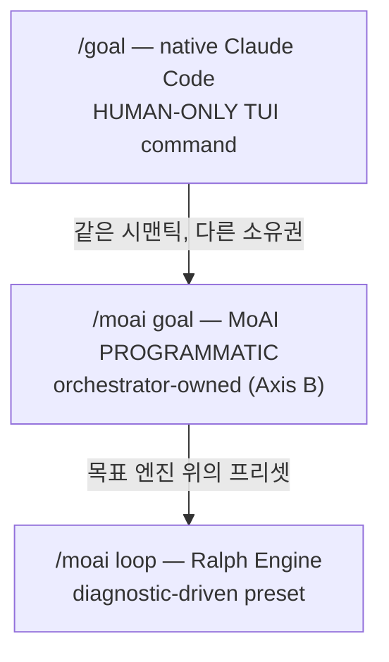

에이전틱 루프의 핵심 질문은 "언제 멈추고 언제 계속할 것인가"입니다. MoAI-ADK는 세 가지 연속 루프 원시(primitive)를 제공하며, 각각의 트리거 시맨틱과 소유권이 다릅니다. 이 페이지는 `/goal`, `/moai goal`, `/moai loop`를 구분하고 각각의 구현 상태와 안전 가드레일을 설명합니다.

## 언제 멈추고 언제 계속할 것인가

단일 턴으로 끝나는 작업도 있지만, 수십 턴에 걸쳐 수렴해야 하는 작업도 있습니다. 예를 들어 "모든 테스트가 PASS할 때까지", "진단 도구가 찾은 이슈 큐를 다 비울 때까지" 작업을 계속해야 합니다. 각 턴마다 사용자가 프롬프트를 입력해야 한다면, 자율성의 이점이 사라집니다.

연속 루프 원시는 이 문제를 해결합니다. 완료 조건을 선언하면 조건이 충족되거나 턴 한도에 도달할 때까지 세션이 스스로 작업을 계속합니다.

## 3가지 연속 루프 원시

MoAI-ADK에는 세 가지 연속 루프 원시가 있으며 각각 트리거 시맨틱과 소유권이 다릅니다.

| 원시 | 소유권 | 트리거 | 언제 적합한가 |
|------|--------|--------|---------------|
| `/goal` | 사용자 TUI (HUMAN-ONLY) | 모델이 조건을 평가 | "이 조건이 참일 때까지 계속" |
| `/moai goal` | 오케스트레이터 (PROGRAMMATIC) | stop-goal Stop-hook 평가 | MoAI 파이프라인 내 자율 연속 |
| `/moai loop` | Ralph Engine (진단 기반) | 진단 도구 이슈 큐 | "도구가 찾은 이슈를 다 수정" |



### `/goal` — native Claude Code (HUMAN-ONLY)

 `/goal`은 Claude Code의 네이티브 TUI 명령입니다. 사용자가 입력하는 명령이며 모델이 사용자를 대신해 호출할 수 없습니다. 이것이 **HUMAN-ONLY** 제약입니다.

완료 조건을 선언하면 각 턴 종료 후 작고 빠른 모델(Haiku 기본)이 조건이 충족되었는지 평가합니다. 충족되지 않았으면 다른 턴을 시작하고 충족되면 루프가 종료됩니다.

```text
/goal go test ./... exits 0 && lint is clean, or stop after 20 turns
```

조건은 최대 4,000자까지 가능하며 턴/시간 한도를 포함해 루프에 제한을 둘 수 있습니다. `/goal` 단독으로 상태를 확인하고, `/goal clear`로 조기 종료할 수 있습니다.

### `/moai goal` — MoAI PROGRAMMATIC (Axis B)

 `/moai goal`은 MoAI가 소유한 프로그래밍 방식 재구현입니다. 네이티브 `/goal`이 HUMAN-ONLY이므로 오케스트레이터가 파이프라인 내에서 자율 연속 루프를 등록하고 활성화(arm)할 수 있는 유일한 경로입니다.

세 개의 동사를 제공합니다:

```bash
moai goal arm "<completion-condition>"  # 조건 등록 + 무장
moai goal status                        # 현재 조건 + 턴/토큰 소비 확인
moai goal clear                         # 조건 제거 (루프 종료)
```

세션 시작 시 `PruneOrphans`가 고아 goal을 정리합니다. 이 메커니즘은 SPEC-GOAL-ENGINE-001(CLOSED)에서 구현되었습니다.

### `/moai loop` — Ralph Engine (진단 기반 프리셋)

 `/moai loop`는 진단 도구가 찾은 이슈 큐를 스캔하고, 각 이슈를 수정한 후, 큐가 비거나 진단이 깨끗해질 때까지 반복하는 결정론적 루프로, goal 엔진 위에서 동작하는 프리셋입니다.

`/moai loop`는 `/moai run --mode loop`의 alias가 아닙니다. `/moai run --mode loop`는 런타임 모드 디스패치 값이고, `/moai loop`는 독립적인 서브커맨드입니다. 둘은 같은 goal 엔진을 사용하지만 진입 경로와 프리셋 동작이 다릅니다.

## 네이티브 /goal 상세

`/goal <condition>`은 완료 조건을 설정하고 조건이 참이 될 때까지 Claude가 프롬프트 없이 작업을 계속합니다. 각 턴 후, 작고 빠른 모델이 조건을 평가합니다.

효과적인 조건 작성:

- **하나의 측정 가능한 종료 상태** — 테스트 결과, 빌드 exit code, 파일 수, 빈 큐
- **명시된 검증 방법** — Claude가 어떻게 증명해야 하는지 ("`go test ./... exits 0`")
- **중요한 제약** — 도중에 바뀌지 않아야 할 것 ("수정된 테스트 파일 외에는 변경 금지")

턴 한도를 포함해 루프에 제한을 두세요 ("`or stop after 20 turns`"). `/clear`를 실행하면 활성 goal도 제거됩니다. `--resume` / `--continue`로 세션을 재개하면 goal이 복원됩니다.

## 구현 vs 로드맵

 **REQ-DA-062 정직성 구분**: 세 가지 원시의 구현 상태를 명확히 구분합니다.

-  `/goal` (native) — Claude Code 런타임에서 구현 (v2.1.139+ 필요)
-  `/moai goal` (PROGRAMMATIC) — SPEC-GOAL-ENGINE-001 CLOSED, 4동사 CLI 구현 완료
-  `/moai loop` (Ralph Engine) — 진단 기반 루프로 구현 완료
-  AGENTIC-CORE Epic — 진행 중. SPEC-1 (Analyze-First 라우팅) CLOSED. SPEC-2 (자율/반자율 kickoff REQ)은 사용자 요구 대기 중.

## 안전 가드레일

 세 가지 루프 원시 모두 안전 가드레일은 동일하게 적용됩니다.

- **Implementation Kickoff Approval** (plan → run HUMAN GATE)은 어떤 루프로도 bypass할 수 없습니다. `/goal`이 활성화되어 있어도 run-phase 진입 전 사용자 승인은 필수입니다.
- **안전 경계 유지** — 루프가 활성화되어도 "되돌리기 어려운 / 공유 시스템 작업 전 확인" 경계는 완화되지 않습니다. goal 평가자는 계속 여부만 결정하며 파괴적 작업을 사전 승인하지 않습니다.
- **auto mode와 조합** — Claude Code auto mode(도구별 자동 승인)와 `/goal`(턴별 연속)을 조합하면 무인 `ac_converge` 루프가 가능합니다. auto mode는 도구별 승인 프롬프트를 제거하고 `/goal`은 턴별 STOP 프롬프트를 제거합니다. Implementation Kickoff Approval은 여전히 run-phase 진입 전 필수입니다.

## 다음 단계

- [토크노믹스 개요](/ko/advanced/tokenomics-overview/) — 자율 루프가 토크노믹스와 연결되는 지점
- [하네스 자가 진화](/ko/advanced/self-evolving/) — `/moai loop`·`/goal` 수렴 궤적이 Loop 0 관찰에 통합
