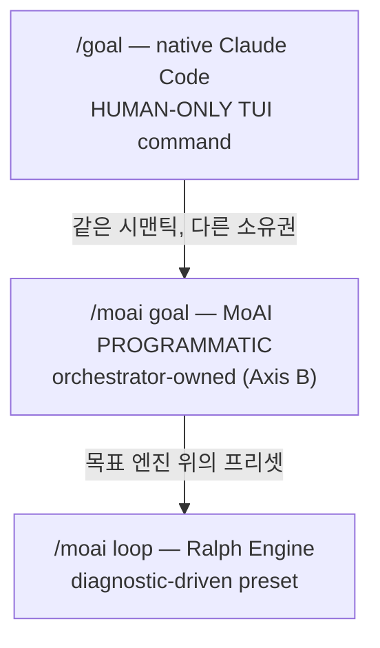

에이전틱 루프의 핵심 질문은 "언제 멈추고 언제 계속할 것인가"입니다. MoAI-ADK는 `/moai goal`과 `/moai loop` 두 가지 연속 루프 원시(primitive)를 제공하고, Claude Code도 자체 네이티브 goal 명령을 갖고 있습니다. 이 페이지는 이 셋을 구분하면서 각각의 소유권, 구현 상태, 안전 가드레일을 설명합니다.

## 언제 멈추고 언제 계속할 것인가

한 턴으로 끝나는 작업도 있지만, 수십 턴을 돌아야 수렴하는 작업도 있습니다. "모든 테스트가 PASS할 때까지", "진단 도구가 찾은 이슈 큐를 다 비울 때까지" 같은 일이 그렇습니다. 그런데 턴마다 사용자가 프롬프트를 다시 넣어야 한다면 자율성의 이점은 사라집니다.

연속 루프 원시가 이 문제를 풉니다. 완료 조건을 선언해 두면 조건이 충족되거나 턴 한도에 닿을 때까지 세션이 알아서 작업을 이어갑니다.

## 3가지 연속 루프 원시

연속 루프 원시는 세 가지입니다. 둘은 MoAI-ADK가, 나머지 하나는 Claude Code가 소유하며, 각각 트리거 방식이 다릅니다.

| 원시 | 소유권 | 트리거 | 언제 적합한가 |
|------|--------|--------|---------------|
| `/goal` | 사용자 TUI (HUMAN-ONLY) | 모델이 조건을 평가 | "이 조건이 참일 때까지 계속" |
| `/moai goal` | 오케스트레이터 (PROGRAMMATIC) | stop-goal Stop-hook 평가 | MoAI 파이프라인 내 자율 연속 |
| `/moai loop` | Ralph Engine (진단 기반) | 진단 도구 이슈 큐 | "도구가 찾은 이슈를 다 수정" |



### `/goal` — native Claude Code (HUMAN-ONLY)

 `/goal`은 Claude Code의 네이티브 TUI 명령입니다. 사용자가 직접 입력해야 하고 모델이 사용자를 대신해 호출할 수 없습니다. 이것이 **HUMAN-ONLY** 제약입니다.

완료 조건을 선언하면 턴이 끝날 때마다 작고 빠른 모델(기본 Haiku)이 조건 충족 여부를 판정합니다. 아직이면 다음 턴을 시작하고, 충족되면 루프가 끝납니다.

```text
/goal go test ./... exits 0 && lint is clean, or stop after 20 turns
```

조건은 최대 4,000자까지 쓸 수 있고, 턴이나 시간 한도를 넣어 루프를 묶어둘 수 있습니다. `/goal`만 입력하면 현재 상태를 확인하고, `/goal clear`로 일찍 끝낼 수 있습니다.

### `/moai goal` — MoAI PROGRAMMATIC (Axis B)

 `/moai goal`은 MoAI가 소유한 프로그래밍 방식 재구현입니다. 네이티브 `/goal`이 HUMAN-ONLY이므로, 오케스트레이터가 파이프라인 안에서 자율 연속 루프를 등록하고 활성화(arm)할 수 있는 길은 이것뿐입니다.

동사는 세 개입니다.

```bash
moai goal arm "<completion-condition>"  # 조건 등록 + 무장
moai goal status                        # 현재 조건 + 턴/토큰 소비 확인
moai goal clear                         # 조건 제거 (루프 종료)
```

세션이 시작될 때 `PruneOrphans`가 남겨진 고아 goal을 정리합니다. 이 메커니즘은 SPEC-GOAL-ENGINE-001(CLOSED)에서 구현했습니다.

### `/moai loop` — Ralph Engine (진단 기반 프리셋)

 `/moai loop`는 진단 도구가 찾아낸 이슈 큐를 훑어 하나씩 고치고, 큐가 비거나 진단이 깨끗해질 때까지 반복하는 결정론적 루프입니다. goal 엔진 위에 얹힌 프리셋이기도 합니다.

`/moai loop`는 `/moai run --mode loop`의 alias가 아닙니다. `/moai run --mode loop`는 런타임 모드 디스패치 값이고 `/moai loop`는 독립된 서브커맨드입니다. 둘은 같은 goal 엔진을 쓰지만 진입 경로와 프리셋 동작이 다릅니다.

## 네이티브 /goal 상세

`/goal <condition>`으로 완료 조건을 걸어두면 조건이 참이 될 때까지 Claude가 프롬프트 없이 작업을 이어갑니다. 턴이 끝날 때마다 작고 빠른 모델이 조건을 판정합니다.

조건은 이렇게 쓰면 잘 듣습니다.

- **측정 가능한 종료 상태 하나** — 테스트 결과, 빌드 exit code, 파일 수, 빈 큐
- **검증 방법 명시** — Claude가 무엇으로 증명해야 하는지 ("`go test ./... exits 0`")
- **지켜야 할 제약** — 도중에 건드리면 안 되는 것 ("수정한 테스트 파일 외에는 변경 금지")

턴 한도를 넣어 루프를 묶어두세요("`or stop after 20 turns`"). `/clear`를 실행하면 활성 goal도 함께 사라집니다. `--resume`이나 `--continue`로 세션을 재개하면 goal이 되살아납니다.

## 구현 vs 로드맵

 **REQ-DA-062 정직성 구분**: 세 원시의 구현 상태를 분명히 갈라 둡니다.

-  `/goal` (native) — Claude Code 런타임에 구현 (v2.1.139+ 필요)
-  `/moai goal` (PROGRAMMATIC) — SPEC-GOAL-ENGINE-001 CLOSED, 4동사 CLI 구현 완료
-  `/moai loop` (Ralph Engine) — 진단 기반 루프로 구현 완료
-  AGENTIC-CORE Epic — 진행 중. SPEC-1(Analyze-First 라우팅) CLOSED. SPEC-2(자율/반자율 kickoff REQ)는 사용자 요구 대기 중.

## 안전 가드레일

 세 루프 원시 모두 같은 안전 가드레일을 지킵니다.

- **Implementation Kickoff Approval**(plan → run HUMAN GATE)은 어떤 루프로도 건너뛸 수 없습니다. `/goal`이 켜져 있어도 run-phase에 들어가기 전에는 사용자 승인이 반드시 필요합니다.
- **안전 경계 유지** — 루프가 돌고 있어도 "되돌리기 어렵거나 공유 시스템을 건드리는 작업은 먼저 확인한다"는 경계는 느슨해지지 않습니다. goal 평가자는 계속할지 말지만 정할 뿐, 파괴적인 작업을 미리 승인해 주지 않습니다.
- **auto mode와 조합** — Claude Code auto mode(도구별 자동 승인)와 `/moai goal`(턴별 연속)을 함께 쓰면 사람이 붙어 있지 않아도 `ac_converge` 루프를 돌릴 수 있습니다. auto mode는 도구별 승인 프롬프트를, `/moai goal`은 턴별 STOP 프롬프트를 없앱니다. 그래도 run-phase 진입 전 Implementation Kickoff Approval은 그대로 필요합니다.

## 다음 단계

- [토크노믹스 개요](/ko/advanced/tokenomics-overview/) — 자율 루프가 토크노믹스와 연결되는 지점
- [하네스 자가 진화](/ko/advanced/self-evolving/) — `/moai loop`·`/moai goal` 수렴 궤적이 Loop 0 관찰에 통합
