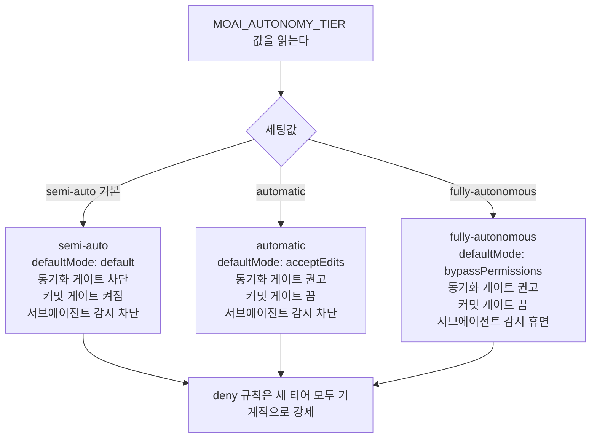
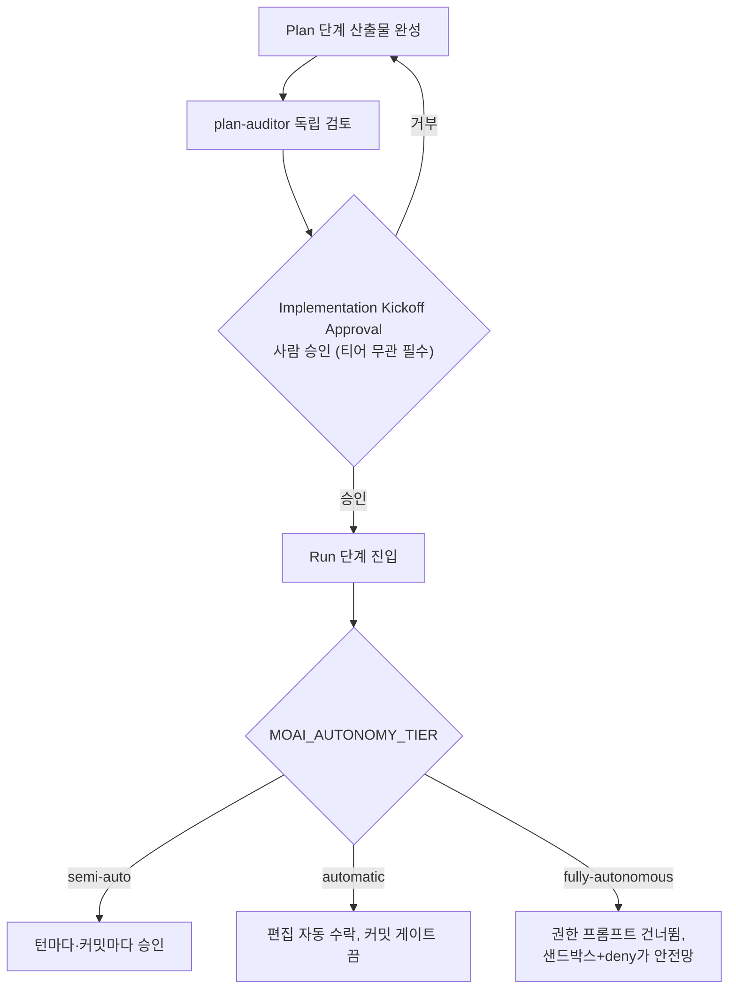

MoAI-ADK는 사용자가 한 턴 한 턴 확인받는 반자율 모드부터, 조건이 갖춰지면 사람 개입 없이도 과제를 끝까지 몰고 가는 완전 자율 모드까지 세 단계의 자율성 티어(autonomy tier, 얼마나 자율적으로 움직일지를 정하는 등급)를 제공합니다. 이 등급은 `MOAI_AUTONOMY_TIER`라는 환경변수 토큰으로 표현되며, SPEC(요구사항 명세서) 하나를 계획부터 구현·문서화·감사까지 밀어주는 전 주기에 걸쳐 어디까지 사용자 승인을 요구하고 어디까지 자동으로 넘어갈지를 가릅니다.

이 페이지는 세 티어의 구조, 각 티어가 만지는 권한의 범위, 그리고 자율성을 높일수록 더 단단해져야 하는 안전 장치가 무엇인지를 실습 중심으로 짚습니다.

## 세 티어가 만지는 네 가지 표면

자율성 티어가 바꾸는 것은 모델이나 effort(추론 깊이)가 아니라, 사람이 어디까지 승인 게이트로 개입하는지입니다. 티어가 올라갈수록 아래 네 표면에서 사람 손이 빠집니다.

 **모델 티어와 헷갈리지 않기**: 이 페이지의 "자율성 티어"는 [3-티어 에이전트 아키텍처](/ko/advanced/no-haiku-3tier/)의 "모델 티어"와는 **다른 축**입니다. 모델 티어는 "어떤 모델을 어느 effort로 부를지"(단발·에이전틱·피크)를 고르고, 자율성 티어는 "사람 승인을 어디까지 빼들지"를 고릅니다. 두 축은 서로 대체하지 않고 직교합니다 — 사용자는 능력에 맞는 모델 티어와 감시 수준에 맞는 자율성 티어를 **각각** 고릅니다.



네 표면의 구체적인 동작은 티어마다 다릅니다.

| 표면 | semi-auto (기본) | automatic | fully-autonomous |
|------|------------------|-----------|------------------|
| `defaultMode` (기본 권한 모드) | `default` | `acceptEdits` | `bypassPermissions` |
| 동기화 게이트 (sync gate) | 차단 | 권고 | 권고 |
| 커밋 게이트 | 켜짐 | 꺼짐 | 꺼짐 |
| 서브에이전트 생명주기 감시 (SubagentStop/TeammateIdle) | 차단 | 차단 | 휴면 |

한 가지 줄은 모든 티어에서 변하지 않습니다. 위험한 동작을 `deny`로 막아둔 규칙은 티어를 올려도 절대 풀리지 않으며, `bypassPermissions` 상태에서도 기계적으로 강제됩니다. 자율성의 안전망은 결국 이 `deny` 목록과 — `fully-autonomous`에서는 추가로 — 검증된 샌드박스(격리 실행 환경)에 기대기 때문입니다.

## Step 1 — 티어 값을 확인하고 해석한다

자율성 티어는 환경변수 `MOAI_AUTONOMY_TIER`로 읽힙니다. 셸에서 현재 값을 직접 찍어볼 수 있습니다.

```bash
# 현재 세션에 적용된 자율성 티어를 출력
echo "${MOAI_AUTONOMY_TIER:-semi-auto}"
```

값이 비어 있거나 설정한 적이 없으면 `semi-auto`로 해석됩니다. 이는 하위 호환 불변 조건입니다 — 자율성 티어를 명시적으로 고르지 않은 기존 세션은 오늘과 똑같은 동작을 이어 가며, 옵트인(opt-in, 사용자가 스스로 켜는 선택)하지 않은 세션은 행동 변화를 한 푼도 지불하지 않습니다.

세 값의 의미를 정리하면 아래와 같습니다.

- **`semi-auto`** (기본) — 오늘의 동작을 그대로 유지합니다. `defaultMode: default`, 동기화 게이트 차단, 커밋 게이트 켜짐, 허용 목록(allowlist) 기반의 Bash 실행으로 도구마다 승인을 묻습니다.
- **`automatic`** — 반자율 실행입니다. 편집 도구는 묻지 않고 받아들이고(`acceptEdits`), 커밋 게이트가 꺼지며, 동기화 게이트는 차단 대신 권고로 내려옵니다. 서브에이전트 생명주기 감시는 여전히 차단으로 남아, 구현 에이전트가 완료 조건을 놓치면 멈춰 줍니다.
- **`fully-autonomous`** — 무인 자율입니다. 권한 프롬프트 자체를 건너뛰고(`bypassPermissions`), 서브에이전트 감시마저 휴면 상태로 돌립니다. 대신 샌드박스 증명과 `deny` 규칙, 관리자 킬 스위치(manager kill-switch, 비상시 자율성을 한 번에 거두는 장치)가 이 티어의 안전 경계가 됩니다.

## Step 2 — `moai init` 마법사에서 티어를 고른다

자율성 티어는 프로젝트를 처음 세팅할 때 `moai init` 마법사(대화형 설정 도구)에서 고릅니다. 마법사는 세 티어 중 하나를 물어보고, 선택을 프로젝트 설정으로 저장합니다.

```bash
# 새 프로젝트를 만들면서 자율성 티어를 함께 고른다
moai init myproject --autonomy-tier semi-auto
```

`--autonomy-tier` 플래그는 닫힌 세 값 가운데 하나만 받습니다. 잘못된 값을 넣으면 거부하고 이유를 알려 줍니다. 이 폐쇄성(closed set, 정해진 값만 받는 제약)은 자율성 티어가 앞으로 계속 읽히는 단일 원천(single source of truth)이 되도록 보장합니다 — 런타임 훅과 렌더러가 각기 다른 해석을 하지 않도록 막는 첫 단추입니다.

마법사를 거치지 않고 기존 프로젝트에서 티어를 바꾸려면 `moai web` 토글을 쓰거나 설정 파일의 `workflow.yaml` 키를 직접 고칩니다. 단, `fully-autonomous`는 샌드박스 증명이 없으면 웹 토글에서 비활성화됩니다 — 무인 자율은 검증된 격리 환경이 전제돼야 하기 때문입니다.

## Step 3 — 티어가 권한 묶음을 어떻게 바꾸는지 추적한다

선택한 티어는 설정 렌더러(권한 묶음을 실제 파일로 만들어내는 장치)를 거쳐 두 영역에 쓰입니다. `defaultMode`는 **사용자 영역** (USER scope, 개인 설정)에, `deny`/`ask` 규칙은 **프로젝트 영역** (PROJECT scope, 팀 공유 설정)에 내려옵니다. 이 분리는 한 명이 자율성을 올리더라도 팀 전체가 공유하는 안전 규칙은 흔들리지 않게 합니다.

```bash
# 렌더러가 각 티어별로 내놓은 deny/ask 규칙이 정확히 같은지 확인한다
diff <(grep -A20 'deny:' .claude/settings.json) \
     <(grep -A20 'deny:' .claude/settings.local.json) && echo "deny 목록 일치"
```

위 검사가 통과해야 하는 이유는 `deny`/`ask` **규칙 집합이 티어 불변**이기 때문입니다. 어떤 티어를 고르든 `deny`로 막힌 동작의 종류는 줄지 않고, `ask`로 묻는 동작의 종류도 빠지지 않습니다. 티어가 바꾸는 것은 오직 `defaultMode`, 동기화 게이트 모드, 커밋 게이트 on/off, 서브에이전트 감시의 활성 여부 — 위 표의 네 표면뿐입니다. 이 불변 조건은 자율성을 높인다고 해서 위험 동작이 새로 열리는 일을 막아 줍니다.

`deny` 규칙의 강제력은 `bypassPermissions`에서도 살아 있습니다. 권한 평가는 항상 `deny → ask → allow` 순서로, 첫 일치가 결정을 내립니다. `fully-autonomous`에서는 `ask` 규칙이 권고로 내려오지만, `deny` 규칙은 여전히 기계적으로 차단합니다. 그래서 완전 자율의 실효 안전망은 "검증된 샌드박스 + `deny` 목록 + 내용 범위가 붙은 `ask` 규칙"이 됩니다 — `ask` 하나에 기대지 않는 이유입니다.

## Step 4 — Implementation Kickoff Approval과 Stop-chain의 관계를 짚는다

자율성 티어를 올리더라도 절대 건너뛸 수 없는 게이트가 하나 있습니다. **Implementation Kickoff Approval** (계획에서 구현으로 넘어가는 사람 승인 게이트)입니다. 이 게이트는 자율성 티어와 무관하게 항상 필수이며, plan-auditor(계획 검토 에이전트)의 통과 판정이나 높은 점수가 이 게이트를 자동으로 넘겨주지 않습니다.



사람 승인 게이트를 한 번 지나고 나면, 그 이후로 티어가 어디까지 자율을 허용할지가 결정됩니다. `semi-auto`는 턴마다, 커밋마다 승인을 물어 되돌아오고, `automatic`은 편집을 자동으로 수락하며, `fully-autonomous`는 권한 프롬프트 자체를 건너뜁니다. 단, `fully-autonomous`의 안전망은 `ask` 프롬프트가 아니라 샌드박스와 `deny`라는 점을 다시 한 번 짚습니다 — 티어가 높을수록 안전장치는 프롬프트에서 기계적 강제로 옮겨 가는 구조입니다.

자율성 티어는 또 Stop-chain(턴 끝에 도는 검증 고리)의 자발적 완화와 짝을 이룹니다. Stop-chain 훅들은 본래 매 턴 끝, 매 커밋마다 `moai` 바이너리를 차가운 시작(cold start, 매번 새로 띄우는 비용)으로 돌려 검증을 돌립니다. 무인 루프에서는 이 왕복 비용이 쌓이므로, `MOAI_AUTONOMY_TIER` 토큰을 읽고 권고성 게이트를 조건부로 건너뜁니다. 골 상태 파일(goal state file)이 없으면 골 평가 훅 실행을 생략하고, 현재 커밋이 동기화 커밋이 아니면 동기화 품질 게이트의 무거운 검사를 돌리지 않습니다. 단, `deny`와 안전 규칙은 이 완화 대상이 아닙니다 — Stop-chain은 어디까지나 "사람이 이미 승인한 범위 안에서의 왕복 비용"을 줄이는 장치입니다.

## 티어 선택 가이드

어느 티어가 맞는지는 과제의 성격과 검증 환경의 준비도에 달려 있습니다.

- **`semi-auto`** — 처음 쓰거나, 낯선 코드베이스를 다루거나, 되돌리기 어려운 동작이 섞여 있을 때. 매 단계에서 사용자가 의도를 다시 확인할 수 있어 가장 안전합니다.
- **`automatic`** — SPEC 한 개를 계획부터 구현·문서화까지 묶어서 밀고 갈 때. 편집마다 승인을 받지 않아도 되므로 긴 구현 호흡이 끊기지 않으며, 서브에이전트 감시가 남아 있어 완료 조건이 흐트러지면 멈춰 줍니다.
- **`fully-autonomous`** — 검증된 샌드박스 안에서, 이미 승인을 받은 과제를 사람이 자리를 비운 사이에도 끝까지 돌릴 때. 단, 샌드박스 증명이 전제고, 관리자 킬 스위치로 언제든 자율성을 거둘 수 있어야 합니다.

모든 티어에서 `deny` 목록은 변하지 않으며, Implementation Kickoff Approval은 항상 필수입니다. 자율성을 높이는 것은 "사람 승인을 덜 받는 것"이지 "안전 경계를 느슨하게 하는 것"이 아닙니다. 티어가 바꾸는 것은 승인의 빈도지, 안전의 강도가 아닙니다.

## 다음 단계

- [3-티어 에이전트 아키텍처](/ko/advanced/no-haiku-3tier/) — 모델 티어(단발·에이전틱·피크). 자율성 티어와 직교하는 "어떤 모델" 축
- [프로필 매트릭스](/ko/advanced/profile-matrix/) — 에이전트별 `{model, effort}`를 고르는 단일 매트릭스
- [자율 루프](/ko/advanced/autonomous-loops/) — 골 엔진 기반의 무인 연속 실행
- [칸반 모드](/ko/advanced/kanban-mode/) — 다중 세션 칸반으로 자율성 티어를 병렬로 운용
