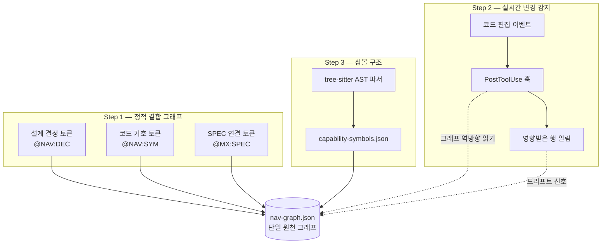

코드는 계속 바뀌지만 문서는 제자리걸음인 프로젝트가 많습니다. BAS Navigator(코드맵을 청사진에 닻으로 묶어 두는 동기화 계층)는 이 격차를 줄이는 장치입니다. 이 페이지는 BAS Navigator가 코드맵(프로젝트 구조를 기호 단위로 요약해 둔 지도)을 세 단계로 어떻게 동기화하는지 따라가는 튜토리얼입니다. 명령어 한 줄씩 직접 실행해 보면서 읽을 수 있습니다.


**BAS Navigator 한 줄 요약**

BAS(BluePrint-Anchored Synchronization, 청사진 닻 동기화) Navigator는 설계 결정 · SPEC(요구사항 명세서) · 코드 기호를 하나의 그래프로 묶어 두고, 코드가 바뀌는 순간 영향받는 행을 즉시 알려 주며, 코드 구조를 심볼 단위로 쪼개어 보여 주는 3단계 동기화 계층입니다. "갱신 인프라 없는 문서는 살아있는 게 아니라 출처가 더 좋은 스냅샷이다"라는 문제의식에서 출발했습니다.


## 왜 필요한가

에이전트(스스로 일하는 AI 도우미)가 큰 저장소에서 방향을 잡으려면 "어떤 설계 결정이 어떤 코드로, 그 코드가 어느 SPEC에서 왔는지"를 한눈에 봐야 합니다. 과거 MoAI-ADK에는 코드맵을 다시 그리는 명령(`regen`), 설계와 구현의 차이를 검사하는 명령(`audit`), tree-sitter(소스 코드를 문법 트리로 해석하는 파서)로 기호를 뽑아내는 명령(`enrich`)이 각각 떨어져 있었습니다. 세 명령은 각자 잘 동작했지만 서로를 가리키지 않았기 때문에, 한쪽이 바뀌어도 다른 쪽은 알 수 없었습니다.

BAS Navigator는 이 세 동기화 축을 **정적 결합 · 실시간 감지 · 심볼 구조**라는 세 단계로 재배치하고, 그 결과를 `nav-graph.json`( Navigator 그래프의 단일 원천 파일) 하나로 모읍니다. 그래프가 단일 원천이기 때문에 어느 단계에서 드리프트(설계와 구현이 어긋나는 현상)가 생겨도 같은 그래프를 통해 추적할 수 있습니다.

아래 다이어그램은 세 단계가 그래프를 어떻게 둘러싸는지 보여 줍니다.



각 단계는 그래프를 생산하거나 소비하기만 하고, 다른 단계의 생산자를 건드리지 않습니다. 이 "다리지을 뿐 삼키지 않는다(bridge not absorb)" 원칙 덕분에 어느 단계를 고쳐도 나머지가 흔들리지 않습니다. 이제 단계별로 직접 실습해 봅시다.

## Step 1 — 정적 결합 그래프 만들기

첫 번째 단계는 설계 결정 · 코드 기호 · SPEC을 하나의 그래프로 묶는 **바인딩 토큰 trio(셋으로 짝지은 연결 토큰)** 입니다. 토큰은 문서와 코드 안에 직접 박아두는 작은 표식으로, 세 종류가 있습니다.

| 토큰                   | 붙이는 곳              | 가리키는 대상        |
| ---------------------- | ---------------------- | -------------------- |
| `@NAV:DEC-<id>`        | `.moai/project/*.md`, ADR | 설계 결정 레코드     |
| `@NAV:SYM:<symbol>`    | 코드 주석, 설계 문서   | 이름 붙인 코드 기호  |
| `@MX:SPEC:<id>`        | 코드 주석              | SPEC 뒤링크          |

세 토큰을 문서와 코드에 흩어놓고 나면 Navigator가 이를 수집해 `nav-graph.json`의 엣지로 엮습니다. 노드는 결정 · SPEC · 기호 세 엔티티이고, 엣지는 토큰 종류별로 출처 파일과 줄 번호를 함께 들고 있습니다. 그래서 그래프를 읽으면 "이 결정은 어느 파일 몇 번째 줄에서 처음 나왔는가"까지 추적할 수 있습니다.

토큰을 한 번 찍어 보고 그래프를 다시 짜 봅니다.

```bash
# 1) 설계 문서에 결정 토큰 남기기 (.moai/project/tech.md 안에 한 줄 추가)
#    @NAV:DEC-auth-token — 인증은 세션이 아닌 토큰 기반으로 ...

# 2) 코드 주석에 SPEC 뒤링크 걸기 (internal/auth/token.go 안에)
#    // @MX:SPEC:SPEC-AUTH-001

# 3) 그래프 다시 짜기
moai codemaps
```


`@MX:SPEC`은 원래 코드 주석에서 SPEC으로 가는 뒤링크로 쓰이던 토큰입니다. BAS Navigator는 이 토큰을 새로 만든 게 아니라, 이미 있던 moai-adk 연결 결과를 그래프로 **다리 지어** 가져옵니다. 덕분에 기존 주석을 고치지 않아도 됩니다.


## Step 2 — 편집 순간에 드리프트 잡기

두 번째 단계는 **Falconer Detect(매 단계의 편집을 감시하는 실시간 감지 계층)** 입니다. 파일을 저장하는 순간, PostToolUse 훅(도구 실행 직후에 반응하는 자동 갈고리)이 바뀐 경로를 읽어 그래프를 역방향으로 훑고, 영향받는 행을 즉시 알려 줍니다.

감지는 읽기 전용입니다. 편집을 막지 않고, 결과는 두 곳에 남깁니다. 하나는 세션에 띄우는 짧은 알림이고, 다른 하나는 기계가 읽을 수 있는 영향 레코드(`.moai/state/navigator-detect/` 아래 `jsonl` 파일)입니다. 이 레코드는 다음 단계의 갱신 파이프라인이 소비합니다.

감지가 어떻게 동작하는지 직접 관찰해 봅니다.

```bash
# 1) 소스 파일 하나 편집 (예: internal/auth/token.go 의 한 함수 수정)
#    Claude Code 안에서 Edit 도구로 저장

# 2) 훅이 남긴 영향 레코드 확인 — 편집 직후 이 파일이 생깁니다
ls .moai/state/navigator-detect/

# 3) 가장 최근 레코드의 내용 보기 — 영향받은 노드와 엣지가 줄 단위로 들어 있습니다
tail -n 3 .moai/state/navigator-detect/*.jsonl
```

출력을 보면 방금 고른 파일이 어떤 결정 노드, 어떤 SPEC 노드, 어떤 기호 노드에 닿아 있는지가 한 줄에 하나씩 나옵니다. 이것이 "드리프트가 생기기 직전의 가장 싼 순간"에 경고를 띄우는 감지의 핵심입니다. Bash로 파일을 옮긴 경우처럼 구조화된 경로가 없는 편집은 감지 대상이 아닙니다. 이것은 의도된 설계로, 오탐을 줄이기 위한 경계입니다.

## Step 3 — 심볼 단위로 코드 구조 뽑기

세 번째 단계는 코드를 기호 단위로 쪼개는 **tree-sitter AST 보강**입니다. 설계 문서에 손으로 표식을 다 달 수는 없습니다. 그래서 16개 언어를 지원하는 tree-sitter 파서가 함수 · 타입 · 호출 관계를 자동으로 뽑아 `capability-symbols.json`에 채워 넣습니다. 이 결과가 다시 그래프의 기호 노드를 풍부하게 만듭니다.

이 단계는 두 층으로 나뉩니다. 아래 층은 결정론적 구조 층(파서가 기계적으로 뽑아내는 서명 · 선언 · 참조)이고, 위 층은 LLM 서술 층(문서화 문자열과 호출 맥락을 자연어로 채우는 층)입니다. 두 층이 분리돼 있기 때문에 LLM을 쓸 수 없는 환경에서도 결정론적 층은 막히지 않습니다.  구조가 먼저, 서사는 나중입니다.

보강을 한 번 돌려 봅니다.

```bash
# 코드맵 갱신 — tree-sitter가 심볼을 다시 뽑아 capability-symbols.json을 채웁니다
/moai codemaps

# 기호 보강 결과 들여다보기
jq '.symbols | length' .moai/project/navigator/capability-symbols.json
```

명령어의 자세한 플래그와 출력 형식은 `utility-commands/moai-codemaps.md` 명령어 참조 페이지에 따로 정리해 두었습니다. 이 튜토리얼에서는 "한 줄로 보강이 돈다"는 흐름만 짚고 넘어갑니다.

## Step 4 — 전체 그래프 읽고 차이 잡기

마지막 단계는 앞의 세 단계를 하나의 사이클로 묶는 것입니다. 감지가 영향받은 행을 알려 주면, 보강이 기호를 다시 뽑고, 갱신이 그래프를 최신으로 맞춥니다. 설계 의도와 구현된 기능의 차이를 검사하는 감사 모드(`--audit`)는 이 사이클이 남긴 그래프를 읽어 "문서에는 있다 / 코드에는 없다" 쌍을 보고합니다.

전체 사이클을 한 번에 돌려 봅니다.

```bash
# 1) 설계 의도 vs 구현 차이 감사
/moai codemaps --audit

# 2) 감지 레코드가 가리킨 영향받은 행을 최신 그래프와 대조
jq '.affected_rows[] | {node: .identifier, type: .entity_type}' \
  .moai/state/navigator-detect/*.jsonl | head

# 3) 감사 보고서의 요약 보기
cat .moai/project/navigator/audit-report.json | jq '.summary'
```

감사가 깨끗하면 그래프는 그대로 살아 있습니다. 차이가 보고되면, Step 1의 토큰과 Step 3의 기호 보강으로 거슬러 올라가 어느 단계가 비었는지를 좁힐 수 있습니다. 이것이 "한 번에 전체를 다시 그리지 않고도" 코드맵을 살아 있게 유지하는 BAS Navigator의 사이클입니다.

## 마무리

세 단계를 다시 정리하면 이렇습니다.

| 단계   | 하는 일                       | 결과물                          |
| ------ | ----------------------------- | ------------------------------- |
| Step 1 | 토큰 trio로 결합 그래프 만들기 | `nav-graph.json`                |
| Step 2 | 편집 순간 영향받은 행 감지    | `navigator-detect/*.jsonl`      |
| Step 3 | tree-sitter AST로 기호 보강   | `capability-symbols.json`       |
| Step 4 | 감사로 차이 잡고 사이클 닫기  | `audit-report.json`             |

BAS Navigator는 단일 원천 그래프 하나에 세 동기화 축을 얹어, 코드가 바뀌어도 문서가 뒤처지지 않게 만듭니다. 명령어 사양이 궁금하면 `utility-commands/moai-codemaps.md`를, 설계 배경이 궁금하면 각 단계를 정의한 SPEC(SPEC-NAVIGATOR-SYNC-001, 002, 003)을 참고하세요. 다음으로 읽기 좋은 페이지는 같은 고급 섹션의 `manager-kanban.md`와 `autonomy-tier.md`입니다. 둘 다 이 코드맵 위에서 움직이는 에이전트 조직과 자율 등급을 다룹니다.
