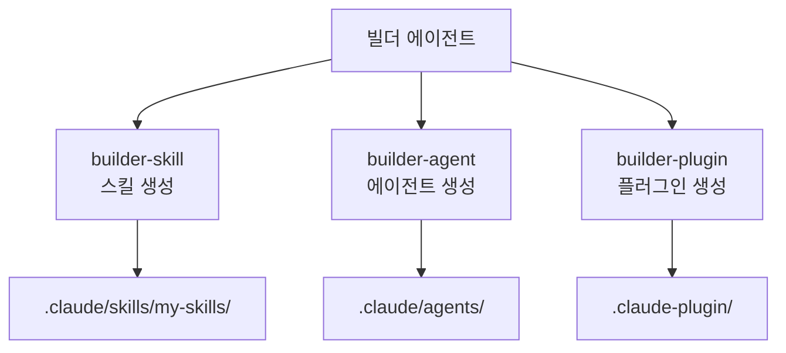

# 빌더 에이전트 가이드

MoAI-ADK를 확장하는 3가지 빌더 에이전트를 상세히 안내합니다.


  **한 줄 요약**: 빌더 에이전트는 MoAI-ADK의 **확장 도구 제작소**입니다. 스킬,
  에이전트, 플러그인을 직접 만들어 시스템을 커스터마이징할 수 있습니다.


## 빌더 에이전트란?

MoAI-ADK는 기본 제공되는 52개 스킬, 28개 에이전트 외에도 사용자가 직접 확장할 수
있는 3가지 빌더 에이전트를 제공합니다.



### 확장의 3가지 유형

| 유형     | 빌더              | 목적                           | 호출 방식               |
| -------- | ----------------- | ------------------------------ | ----------------------- |
| 스킬     | `builder-skill`   | AI에게 새로운 전문 지식 부여   | 자동 트리거 / `Skill()` |
| 에이전트 | `builder-agent`   | 새로운 전문가 역할 정의        | MoAI가 위임             |
| 플러그인 | `builder-plugin`  | 스킬+에이전트+명령어 번들 배포 | `plugin install`        |

## 스킬 생성 (builder-skill)

### 스킬이란?

스킬은 Claude Code에게 **특정 분야의 전문 지식**을 제공하는 문서입니다. 스킬이
로드되면 Claude Code는 해당 분야의 모범 사례, 패턴, 규칙을 알게 됩니다.

### YAML 프론트매터 스키마

스킬의 `SKILL.md` 파일은 반드시 YAML 프론트매터로 시작해야 합니다.

```yaml
---
# 공식 필드 (Official Fields)
name: my-custom-skill # 스킬 식별자 (kebab-case, 최대 64자)
description: > # 목적 설명 (50~1024자, 3인칭)
  커스텀 스킬의 설명. 어떤 작업에 사용하는지, 어떤 전문 지식을 제공하는지
  3인칭으로 작성.
allowed-tools: # 허용 도구 (쉼표 구분 또는 리스트)
  - Read
  - Grep
  - Glob
model: claude-sonnet-4-20250514 # 사용할 모델 (생략 시 현재 모델)
context: fork # 서브 에이전트 컨텍스트에서 실행
agent: general-purpose # context: fork 시 사용할 에이전트
hooks: # 스킬 수명 주기 훅
  PreToolUse: ...
user-invocable: true # 슬래시 명령 메뉴 표시 여부
disable-model-invocation: false # false면 Claude도 직접 호출 가능
argument-hint: "[issue-number]" # 자동완성 힌트

# MoAI-ADK 확장 필드 (Extended Fields)
version: 1.0.0 # 시맨틱 버전 (MAJOR.MINOR.PATCH)
category: domain # 8개 카테고리 중 택 1
modularized: false # modules/ 디렉토리 사용 여부
status: active # active | experimental | deprecated
updated: "2025-01-28" # 마지막 수정일
tags: # 발견용 태그 배열
  - graphql
  - api
related-skills: # 연관 스킬
  - moai-domain-backend
  - moai-lang-typescript
context7-libraries: # MCP Context7 라이브러리 ID
  - graphql
aliases: # 대체 이름
  - graphql-expert
author: YourName # 작성자
---
```

### 프론트매터 필드 상세

| 필드                       | 필수 | 설명                                  | 예시                             |
| -------------------------- | ---- | ------------------------------------- | -------------------------------- |
| `name`                     | 선택 | kebab-case 식별자 (최대 64자)         | `my-graphql-patterns`            |
| `description`              | 권장 | 50~1024자, 3인칭, 발견용              | "GraphQL API 패턴을 제공한다..." |
| `allowed-tools`            | 선택 | 스킬 활성 시 허용되는 도구            | `["Read", "Grep"]`               |
| `model`                    | 선택 | 사용할 모델                           | `claude-sonnet-4-20250514`       |
| `context`                  | 선택 | `fork` 설정 시 서브 에이전트에서 실행 | `fork`                           |
| `agent`                    | 선택 | `context: fork` 시 사용할 에이전트    | `general-purpose`                |
| `hooks`                    | 선택 | 스킬 수명 주기 훅                     | `PreToolUse: ...`                |
| `user-invocable`           | 선택 | 슬래시 메뉴 표시 (기본값: true)       | `true`                           |
| `disable-model-invocation` | 선택 | true면 사용자만 호출 가능             | `false`                          |
| `argument-hint`            | 선택 | 자동완성 힌트                         | `"[issue-number]"`               |
| `version`                  | MoAI | 시맨틱 버전                           | `1.0.0`                          |
| `category`                 | MoAI | 카테고리                              | `domain`                         |
| `modularized`              | MoAI | 모듈화 여부                           | `false`                          |
| `status`                   | MoAI | 활성 상태                             | `active`                         |

### 스킬 프론트매터 필드 상세

| 필드                       | 필수 | 설명                                  | 예시                             |
| -------------------------- | ---- | ------------------------------------- | -------------------------------- |
| `name`                     | 선택 | kebab-case 식별자 (최대 64자)         | `my-graphql-patterns`            |
| `description`              | 권장 | 50~1024자, 3인칭, 발견용              | "GraphQL API 패턴을 제공한다..." |
| `allowed-tools`            | 선택 | 스킬 활성 시 허용되는 도구            | `["Read", "Grep"]`               |
| `model`                    | 선택 | 사용할 모델                           | `claude-sonnet-4-20250514`       |
| `context`                  | 선택 | `fork` 설정 시 서브 에이전트에서 실행 | `fork`                           |
| `agent`                    | 선택 | `context: fork` 시 사용할 에이전트    | `general-purpose`                |
| `hooks`                    | 선택 | 스킬 수명 주기 훅                     | `PreToolUse: ...`                |
| `user-invocable`           | 선택 | 슬래시 메뉴 표시 (기본값: true)       | `true`                           |
| `disable-model-invocation` | 선택 | true면 사용자만 호출 가능             | `false`                          |
| `argument-hint`            | 선택 | 자동완성 힌트                         | `"[issue-number]"`               |
| `version`                  | MoAI | 시맨틱 버전                           | `1.0.0`                          |
| `category`                 | MoAI | 카테고리                              | `domain`                         |
| `modularized`              | MoAI | 모듈화 여부                           | `false`                          |
| `status`                   | MoAI | 활성 상태                             | `active`                         |

### 스킬 디렉토리 구조

```text
.claude/skills/my-skills/
└── my-graphql-patterns/
    ├── SKILL.md            # 메인 스킬 문서 (500줄 이하)
    ├── modules/            # 심층 문서 (무제한)
    │   ├── schema-design.md
    │   └── resolver-patterns.md
    ├── examples.md         # 실전 예시
    └── reference.md        # 외부 참조
```


  **중요**: 파일명은 반드시 **대문자** `SKILL.md`를 사용하세요. 사용자 커스텀
  스킬은 `.claude/skills/my-skills/` 디렉토리에 생성하세요. `moai-*` 접두사는
  MoAI-ADK 공식 스킬에만 사용합니다.


### 문자열 치환 (String Substitutions)

스킬 본문에서 다음 런타임 치환을 사용할 수 있습니다.

| 치환문                    | 설명                    | 예시                         |
| ------------------------- | ----------------------- | ---------------------------- |
| `$ARGUMENTS`              | 스킬 호출 시 모든 인자  | `/skill foo bar` → `foo bar` |
| `$ARGUMENTS[N]` 또는 `$N` | N번째 인자 (0부터 시작) | `$0`, `$1`                   |
| `${CLAUDE_SESSION_ID}`    | 현재 세션 ID            | 세션 추적용                  |

### 동적 컨텍스트 주입 (Dynamic Context Injection)

`!`command`` 구문을 사용하여 스킬 로드 전에 셸 명령을 실행하고 그 출력을 주입할
수 있습니다.

```markdown
---
# YAML
---

# 프로젝트 정보

프로젝트 이름: !basename $(pwd) Git 브랜치: !git branch --show-current
```

### 호출 제어 모드 (Invocation Control)

세 가지 호출 모드가 있습니다.

| 모드        | 설정                             | 설명                           | 용도                  |
| ----------- | -------------------------------- | ------------------------------ | --------------------- |
| 기본        | 두 필드 모두 생략                | 사용자와 Claude 모두 호출 가능 | 일반적인 스킬         |
| 사용자 전용 | `disable-model-invocation: true` | 사용자만 `/name`으로 호출      | 배포, 커밋 워크플로우 |
| Claude 전용 | `user-invocable: false`          | 메뉴에서 숨김, Claude만 호출   | 백그라운드 지식       |

### 저장소 우선순위

스킬이 중복으로 정의된 경우 우선순위는 다음과 같습니다.

1. **Enterprise**: 관리형 설정 (최우선)
2. **Personal**: `~/.claude/skills/` (개인)
3. **Project**: `.claude/skills/` (팀 공유, 버전 관리)
4. **Plugin**: 설치된 플러그인 번들 (최저 우선순위)

### 스킬 저장소 우선순위

```bash
# Claude Code에서 builder-skill 호출
> GraphQL API 설계 패턴에 대한 커스텀 스킬을 만들어줘
```

생성되는 파일: `.claude/skills/my-skills/my-graphql-patterns/SKILL.md`

```markdown
---
name: my-graphql-patterns
description: >
  GraphQL API 설계 전문가. 스키마 설계, 리졸버 패턴, N+1 문제 해결, DataLoader
  패턴을 제공한다. GraphQL API 개발 시 사용.
version: 1.0.0
category: domain
status: active
triggers:
  keywords: ["graphql", "schema", "resolver", "dataloader"]
  agents: ["expert-backend"]
allowed-tools: ["Read", "Grep", "Glob"]
---

# GraphQL API 설계 전문가

## Quick Reference

- 스키마 우선 설계 (Schema-First)
- N+1 문제 방지를 위한 DataLoader 필수
- 페이지네이션은 Relay Cursor 방식 사용

## Implementation Guide

(상세 구현 가이드)

## Advanced Patterns

(고급 패턴)

## Works Well With

- moai-domain-backend
- moai-lang-typescript
```


  **제약사항**: 사용자 스킬 이름에는 **절대 `moai-` 접두사를 사용하지 마세요**.
  이 네임스페이스는 MoAI-ADK 시스템 스킬용으로 예약되어 있습니다. 관리자 모드
  (admin mode, system skill) 요청 시에만 예외적으로 허용됩니다.


## 에이전트 생성 (builder-agent)

### 에이전트 정의 구조

에이전트는 마크다운 파일로 정의되며, YAML 프론트매터에 메타데이터를 포함합니다.

```markdown
---
name: my-data-analyst
description: >
  데이터 분석 전문가. 데이터 파이프라인 설계, ETL 프로세스, 분석 쿼리 최적화를
  담당. PROACTIVELY 사용하여 데이터 분석 작업 시 자동 위임.
tools: Read, Write, Edit, Grep, Glob, Bash, TodoWrite
disallowedTools: Task, Skill # 선택사항: 제외할 도구
model: sonnet # sonnet | opus | haiku | inherit
permissionMode: default # 권한 모드
skills: # 사전 로드할 스킬
  - moai-lang-python
  - moai-domain-database
hooks: # 에이전트 수명 주기 훅
  PostToolUse:
    - matcher: "Write|Edit"
      hooks:
        - type: command
          command: "echo 'File modified'"
---

당신은 데이터 분석 전문가입니다.

## Primary Mission

데이터 파이프라인 설계 및 구현을 통해 데이터 기반 인사이트를 제공합니다.

## Core Capabilities

- 데이터 파이프라인 설계 및 구현
- ETL 프로세스 자동화
- 분석 쿼리 최적화
- 데이터 시각화

## Scope Boundaries

IN SCOPE:

- 데이터 분석 및 시각화
- ETL 프로세스 설계
- 쿼리 성능 최적화

OUT OF SCOPE:

- ML 모델 개발 (expert-data-science에 위임)
- 인프라 구성 (expert-devops에 위임)

## Delegation Protocol

- ML 모델 필요시: expert-data-science
- 인프라 설정시: expert-devops

## Quality Standards

- TRUST 5 프레임워크 준수
- 데이터 무결성 검증
- 쿼리 성능 최적화
```

### 에이전트 프론트매터 필드 상세

| 필드              | 필수 | 설명                                                       |
| ----------------- | ---- | ---------------------------------------------------------- |
| `name`            | 필수 | 에이전트 식별자 (kebab-case, 최대 64자)                    |
| `description`     | 필수 | 역할 설명. `PROACTIVELY` 키워드 포함 시 자동 위임          |
| `tools`           | 선택 | 사용 가능 도구 (쉼표 구분, 생략 시 모든 도구 상속)         |
| `disallowedTools` | 선택 | 제외할 도구 (상속된 도구에서 제거)                         |
| `model`           | 선택 | `sonnet`, `opus`, `haiku`, `inherit` (기본값: 설정된 모델) |
| `permissionMode`  | 선택 | 권한 모드 (아래 참조)                                      |
| `skills`          | 선택 | 사전 로드할 스킬 목록 (상속 안 됨)                         |
| `hooks`           | 선택 | 에이전트 수명 주기 훅                                      |

### 권한 모드 (Permission Modes)

5가지 권한 모드가 도구 승인 처리를 제어합니다.

| 모드                | 설명                    | 용도                      |
| ------------------- | ----------------------- | ------------------------- |
| `default`           | 표준 권한 프롬프트      | 일반적인 에이전트         |
| `acceptEdits`       | 파일 편집 자동 승인     | 편집 중심 작업            |
| `dontAsk`           | 모든 프롬프트 자동 거부 | 사전 승인된 도구만 사용   |
| `bypassPermissions` | 모든 권한 검사 건너뜀   | 신뢰할 수 있는 에이전트만 |
| `plan`              | 읽기 전용 탐색 모드     | 수정 방지 필요시          |

### 에이전트 생성 방법

에이전트를 만드는 4가지 방법이 있습니다.

| 방법           | 설명                    | 위치              |
| -------------- | ----------------------- | ----------------- |
| `/agents` 명령 | 대화형 인터페이스       | 프로젝트/개인     |
| 수동 파일 생성 | 마크다운 파일 직접 작성 | `.claude/agents/` |
| CLI 플래그     | `--agents` JSON 정의    | 세션 전용         |
| 플러그인 배포  | 플러그인 번들           | 설치된 플러그인   |

### 에이전트 저장소 우선순위

동일한 에이전트 이름이 여러 곳에 정의된 경우:

1. **프로젝트 레벨**: `.claude/agents/` (최우선, 버전 관리)
2. **사용자 레벨**: `~/.claude/agents/` (개인, 비버전 관리)
3. **CLI 플래그**: `--agents` JSON (세션 전용)
4. **플러그인**: 설치된 플러그인 (최저 우선순위)

### 빌트인 에이전트 유형

Claude Code는 여러 빌트인 에이전트를 포함합니다.

| 에이전트            | 모델    | 특징                                   |
| ------------------- | ------- | -------------------------------------- |
| `Explore`           | haiku   | 읽기 전용 도구, 코드베이스 검색 최적화 |
| `Plan`              | inherit | plan 권한 모드, 읽기 전용 도구         |
| `general-purpose`   | inherit | 모든 도구, 복잡한 다단계 작업          |
| `Bash`              | inherit | 터미널 명령 실행                       |
| `Claude Code Guide` | haiku   | Claude Code 기능 질문 답변             |

### 스킬 사전 로드 (Skills Preloading)

`skills` 필드에 나열된 스킬은 에이전트 시작 시 **전체 내용이 주입**됩니다.

- 부모 대화의 스킬을 **상속하지 않습니다**
- 각 스킬의 완전한 내용이 시스템 프롬프트에 주입됩니다
- 토큰 소모를 최소화하기 위해 필수 스킬만 나열하세요
- 순서가 중요합니다: 높은 우선순위 스킬을 먼저

### 훅 구성 (Hooks Configuration)

에이전트는 프론트매터에서 수명 주기 훅을 정의할 수 있습니다.

| 이벤트        | 설명                              |
| ------------- | --------------------------------- |
| `PreToolUse`  | 도구 실행 전 (검증, 사전 체크)    |
| `PostToolUse` | 도구 완료 후 (린트, 포맷팅, 로깅) |
| `Stop`        | 에이전트 실행 완료 시             |

### 핵심 제약사항 (Key Constraints)

| 제약                    | 설명                                                       |
| ----------------------- | ---------------------------------------------------------- |
| 서브 에이전트 생성 불가 | 하위 에이전트는 다른 하위 에이전트를 생성할 수 없습니다    |
| AskUserQuestion 제한    | 하위 에이전트는 사용자와 직접 상호작용할 수 없습니다       |
| 스킬 비상속             | 부모 대화의 스킬을 상속하지 않습니다                       |
| MCP 도구 제한           | 백그라운드 하위 에이전트에서 MCP 도구를 사용할 수 없습니다 |
| 독립 컨텍스트           | 각 하위 에이전트는 독립적인 200K 토큰 컨텍스트를 가집니다  |

## 플러그인 생성 (builder-plugin)

### 플러그인이란?

플러그인은 스킬, 에이전트, 명령어, Hooks, MCP 서버를 하나의 패키지로 **번들링한
배포 단위**입니다.


  **중요한 제약사항**: commands/, agents/, skills/, hooks/ 디렉토리는 **플러그인
  루트**에 위치해야 합니다. .claude-plugin/ 내부에 두면 안 됩니다.


### 플러그인 디렉토리 구조

```text
my-plugin/
├── .claude-plugin/
│   └── plugin.json         # 플러그인 매니페스트
├── commands/               # 슬래시 명령어 (루트 레벨!)
│   └── analyze.md
├── agents/                 # 에이전트 정의 (루트 레벨!)
│   └── data-expert.md
├── skills/                 # 스킬 정의 (루트 레벨!)
│   └── my-skill/
│       └── SKILL.md
├── hooks/                  # Hooks 설정 (루트 레벨!)
│   └── hooks.json
├── .mcp.json               # MCP 서버 설정
├── .lsp.json               # LSP 서버 설정
├── LICENSE
├── CHANGELOG.md
└── README.md
```


  **잘못된 예**: .claude-plugin/commands/ (commands가 .claude-plugin 내부에
  있음) **올바른 예**: commands/ (commands가 플러그인 루트에 있음)


### 플러그인 매니페스트 (plugin.json)

```json
{
  "name": "my-data-plugin",
  "version": "1.0.0",
  "description": "데이터 분석 작업을 위한 종합 플러그인",
  "author": {
    "name": "My Team",
    "email": "team@example.com",
    "url": "https://example.com"
  },
  "homepage": "https://example.com/docs",
  "repository": {
    "type": "git",
    "url": "https://github.com/owner/repo"
  },
  "license": "MIT",
  "keywords": ["data", "analytics", "etl"],
  "commands": ["./commands/"],
  "agents": ["./agents/"],
  "skills": ["./skills/"],
  "hooks": "./hooks/hooks.json",
  "mcpServers": "./.mcp.json",
  "lspServers": "./.lsp.json",
  "outputStyles": "./output-styles/"
}
```

### 필드 상세

| 필드          | 필수 | 설명                               |
| ------------- | ---- | ---------------------------------- |
| `name`        | 필수 | kebab-case 플러그인 식별자         |
| `version`     | 필수 | 시맨틱 버전 (예: "1.0.0")          |
| `description` | 필수 | 명확한 목적 설명                   |
| `author`      | 선택 | name, email, url 속성              |
| `homepage`    | 선택 | 문서 또는 프로젝트 URL             |
| `repository`  | 선택 | 소스 코드 저장소 URL               |
| `license`     | 선택 | SPDX 라이선스 식별자               |
| `keywords`    | 선택 | 발견용 키워드 배열                 |
| `commands`    | 선택 | 명령어 경로 (반드시 "./"로 시작)   |
| `agents`      | 선택 | 에이전트 경로 (반드시 "./"로 시작) |
| `skills`      | 선택 | 스킬 경로 (반드시 "./"로 시작)     |
| `hooks`       | 선택 | Hooks 경로 (반드시 "./"로 시작)    |
| `mcpServers`  | 선택 | MCP 서버 설정 경로                 |
| `lspServers`  | 선택 | LSP 서버 설정 경로                 |

### 경로 규칙

- 모든 경로는 플러그인 루트 기준 **상대 경로**입니다
- 모든 경로는 **"./"로 시작**해야 합니다
- 사용 가능한 환경 변수: `${CLAUDE_PLUGIN_ROOT}`, `${CLAUDE_PROJECT_DIR}`

### Marketplace 설정 (marketplace.json)

여러 플러그인을 배포하려면 marketplace.json을 생성합니다.

```json
{
  "name": "my-marketplace",
  "owner": {
    "name": "My Organization",
    "email": "plugins@example.com"
  },
  "plugins": [
    {
      "name": "plugin-one",
      "source": "./plugins/plugin-one"
    },
    {
      "name": "plugin-two",
      "source": {
        "type": "github",
        "repo": "owner/repo"
      }
    }
  ]
}
```

### 설치 범위 (Installation Scopes)

| 범위      | 위치                          | 설명                          |
| --------- | ----------------------------- | ----------------------------- |
| `user`    | `~/.claude/settings.json`     | 개인 플러그인 (기본값)        |
| `project` | `.claude/settings.json`       | 팀 공유 (버전 관리)           |
| `local`   | `.claude/settings.local.json` | 개발자 전용 (gitignored)      |
| `managed` | `managed-settings.json`       | 엔터프라이즈 관리 (읽기 전용) |

### 플러그인 설치 및 관리

```bash
# GitHub에서 플러그인 설치
$ /plugin install owner/repo

# 로컬 플러그인 검증
$ /plugin validate .

# 플러그인 활성화
$ /plugin enable my-data-plugin

# Marketplace 추가
$ /plugin marketplace add ./path/to/marketplace

# 설치된 플러그인 목록
$ /plugin list
```

### 플러그인 캐싱 및 보안

**캐싱 동작**:

- 플러그인은 보안과 검증을 위해 캐시 디렉토리로 복사됩니다
- 모든 상대 경로는 캐시된 플러그인 디렉토리 내에서 해결됩니다
- `../shared-utils` 같은 경로 트래버설은 작동하지 않습니다

**보안 경고**:

- 플러그인 설치 전 출처를 신뢰하는지 확인하세요
- Anthropic은 서드파티 플러그인의 MCP 서버, 파일, 소프트웨어를 제어하지 않습니다
- 설치 전 플러그인 소스 코드를 검토하세요

### 플러그인 생성 실전 예시

```bash
# 플러그인 생성 요청
> 데이터 분석 플러그인을 만들어줘.
> 스킬, 에이전트, 명령어를 모두 포함해줘.
```

## 사용자 정의 보관 위치

MoAI-ADK 업데이트 시 사용자 커스텀 파일이 보존되는 위치를 정리합니다.

| 유형     | 보존되는 위치                 | 덮어쓰기되는 위치        |
| -------- | ----------------------------- | ------------------------ |
| 스킬     | `.claude/skills/my-skills/`   | `.claude/skills/moai-*/` |
| 에이전트 | 사용자 정의 에이전트          | `.claude/agents/moai/`   |
| 명령어   | 사용자 정의 명령어            | `.claude/commands/moai/` |
| Hooks    | 사용자 정의 Hooks             | `.claude/hooks/moai/`    |
| 규칙     | `.claude/rules/local/`        | `.claude/rules/moai/`    |
| 설정     | `.claude/settings.local.json` | `.claude/settings.json`  |
| 지침     | `CLAUDE.local.md`             | `CLAUDE.md`              |


  **권장 사항**: 개인 확장은 항상 `my-skills/` 또는 `local/` 디렉토리에
  생성하세요. MoAI-ADK 업데이트 시에도 안전하게 보존됩니다.


## 빌더 에이전트 호출 방법

빌더 에이전트는 MoAI에게 자연어로 요청하면 자동으로 호출됩니다.

```bash
# 스킬 생성
> @"builder-skill (agent)" GraphQL 패턴에 대한 커스텀 스킬을 만들어줘

# 에이전트 생성
> @"builder-agent (agent)" 데이터 분석 전문가 에이전트를 만들어줘

# 플러그인 생성
> @"builder-plugin (agent)" 데이터 분석 종합 플러그인을 만들어줘
```

## 핵심 제약사항

| 제약                    | 설명                                                                 |
| ----------------------- | -------------------------------------------------------------------- |
| 서브 에이전트 생성 불가 | 하위 에이전트는 다른 하위 에이전트를 생성할 수 없습니다              |
| 사용자 상호작용 제한    | 하위 에이전트는 사용자와 직접 상호작용할 수 없습니다 (MoAI만 가능) |
| 스킬 비상속             | 부모 대화의 스킬을 상속하지 않습니다 (명시적 나열 필요)              |
| 독립 컨텍스트           | 각 하위 에이전트는 독립적인 200K 토큰 컨텍스트를 가집니다            |
| moai- 접두사 금지       | 사용자 스킬/에이전트에는 `moai-` 접두사 사용 금지                    |
| SKILL.md 명명           | 스킬 메인 파일은 반드시 대문자 `SKILL.md` 사용                       |
| 플러그인 컴포넌트 위치  | 플러그인의 commands/, agents/, skills/는 루트에 위치                 |

## 관련 문서

- [스킬 가이드](/claude-code/skills) - 스킬 시스템 상세
- [에이전트 가이드](/advanced/agent-guide) - 에이전트 시스템 상세
- [Hooks 가이드](/advanced/hooks-guide) - 이벤트 자동화
- [settings.json 가이드](/advanced/settings-json) - 설정 관리


  **팁**: 처음에는 **스킬 생성**부터 시작하는 것을 권장합니다. 스킬은 가장
  가볍고 빠르게 MoAI-ADK를 확장할 수 있는 방법입니다.

