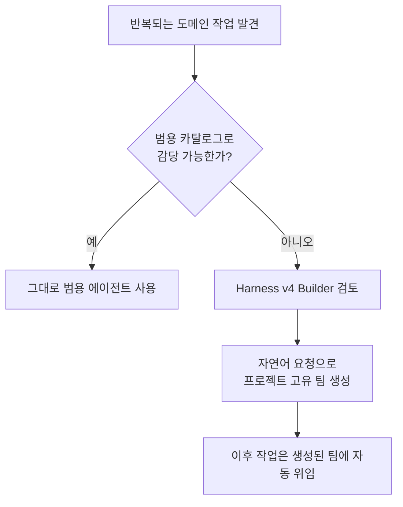
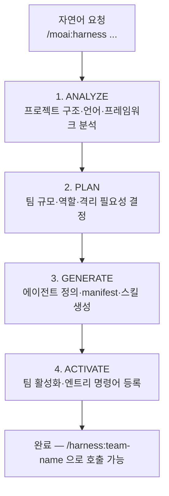

에이전틱 하네스의 마지막 조각은 재귀입니다 — 하네스(에이전트가 일할 환경을 자동으로 갖춰 주는 장치)가 스스로 다른 하네스를 만들어 냅니다. **Harness v4 Builder**는 자연어 요청 한 문장으로 여러분 프로젝트에 딱 맞는 전문가 팀을 만들어 내는, 그 재귀 구조의 입구입니다.


**한 줄 요약**: Harness v4 Builder는 자연어 요청으로 프로젝트 고유의 전문가 팀을 동적으로 생성합니다. `ANALYZE → PLAN → GENERATE → ACTIVATE` 네 단계와 manifest(실행 설정을 한 곳에 적어 둔 선언 파일) 기반 Runner로 구성됩니다.


## 왜 Builder가 필요한가

MoAI-ADK는 기본으로 12개의 범용 에이전트(스스로 일하는 AI 도우미) 카탈로그를 깔아 둡니다. 계획, 구현, 감사, 문서화 — 모든 프로젝트에서 두루 쓰이는 역할들입니다. 하지만 여러분의 프로젝트가 특별한 도메인을 품을 때가 있습니다. 예를 들어 다음 상황을 생각해 보세요.

- 핀테크 서비스라 결제·정산·부가세 도메인 지식이 계속 필요하다
- 게임 서버라 상태 동기화와 리플레이 검증이 반복적으로 들어온다
- 다국어 문서 사이트라 4개 국어 번역 검수가 매 PR마다 붙는다

범용 카탈로그만으로는 이런 반복되는 도메인 작업을 매번 스킬(재사용 가능한 작업 지시서 묶음) 주입과 프롬프트로 다시 설명해야 합니다. Harness v4 Builder는 그 "매번 설명"을 한 번의 생성으로 끝내 줍니다. 프로젝트 고유의 전문가 팀을 만들어 두면, 이후 같은 도메인의 작업은 그 팀에 자동으로 위임됩니다.

| 구분 | 범용 에이전트 카탈로그 | Builder가 만드는 하네스 |
|------|----------------------|----------------------|
| 대상 | 모든 프로젝트 공통 | 여러분 프로젝트에만 존재 |
| 생성 | 배포 시 깔림 | 자연어 요청 한 줄로 동적 생성 |
| 역할 | plan·run·sync·감사 등 범용 역할 | 도메인 특화 역할 (결제·번역·검수 등) |
| 저장 위치 | `.claude/agents/moai/` | `.claude/agents/harness/` |

## Step 1: 하네스가 필요한 순간 파악하기

하네스를 만들기 전에 "지금 범용 카탈로그로 충분한가?"를 먼저 점검합니다. Builder는 강력하지만, 한 번 만든 하네스는 프로젝트에 영구히 남아 관리해야 합니다. 다음 신호 가운데 하나라도 해당된다면 Builder를 고려할 만합니다.

- 같은 도메인 지식을 세 번 이상 스킬 주입이나 프롬프트로 반복 설명했다
- 특정 도메인(결제, 번역, 보안 검수 등) 작업이 SPEC(요구사항 명세서) 단위로 계속 들어온다
- 범용 에이전트에 매번 같은 도구 권한과 같은 추론 깊이를 반복해 지정하고 있다


```mermaid
flowchart TD
    A["반복되는 도메인 작업 발견"] --> B{"범용 카탈로그로\n감당 가능한가?"}
    B -->|예| C["그대로 범용 에이전트 사용"]
    B -->|아니오| D["Harness v4 Builder 검토"]
    D --> E["자연어 요청으로\n프로젝트 고유 팀 생성"]
    E --> F["이후 작업은 생성된 팀에 자동 위임"]
```

반대로, 한 번만 쓰고 말 작업이거나 범용 에이전트가 이미 잘 처리하는 일이라면 Builder를 부를 필요가 없습니다. "한 번 만들면 영구히 관리"라는 비용을 가볍게 보지 말라는 뜻입니다.

## Step 2: 자연어 요청으로 하네스 만들기

필요성이 확인되면 생성은 한 줄입니다. `/moai:harness` 뒤에 바라는 팀의 성격을 자연어로 적어 넣습니다. 영어 키워드가 아니라 의도만 알아서 읽습니다.

```bash
# 백엔드 프로젝트에 맞는 전문가 팀을 만들어 달라고 요청
> /moai:harness 우리 백엔드 프로젝트에 맞는 전문가 팀을 만들어줘. API 설계, DB 스키마, 테스트를 담당할 팀이 필요해.
```

Builder는 이 한 줄을 받아 네 단계를 차례로 밟습니다. 사용자가 단계를 하나하나 지시하지 않아도 됩니다 — Builder가 알아서 진행합니다.


```mermaid
flowchart TD
    A["자연어 요청<br/>/moai:harness ..."] --> B["1. ANALYZE<br/>프로젝트 구조·언어·프레임워크 분석"]
    B --> C["2. PLAN<br/>팀 규모·역할·격리 필요성 결정"]
    C --> D["3. GENERATE<br/>에이전트 정의·manifest·스킬 생성"]
    D --> E["4. ACTIVATE<br/>팀 활성화·엔트리 명령어 등록"]
    E --> F["완료 — /harness:team-name 으로 호출 가능"]
```

### 네 단계가 하는 일

| 단계 | 하는 일 | 결과물 |
|------|--------|--------|
| **1. ANALYZE** | 소스 코드 구조, 사용 언어·프레임워크, 기존 에이전트·스킬 인벤토리 조사 | 프로젝트 맥락 요약 |
| **2. PLAN** | 팀 규모(3~5명), 역할 프로필, worktree 격리 필요성, manifest 스키마 설계 | 팀 구성안 |
| **3. GENERATE** | `.claude/agents/harness/` 아래 에이전트 파일 생성, `.moai/harness/manifest.json` 작성, 역할별 시스템 프롬프트·사전 로드 스킬 정의 | 에이전트 정의 + manifest |
| **4. ACTIVATE** | 에이전트 등록·검증, manifest Runner 초기화, 선택적 worktree 생성, 자동 위임 규칙 활성화 | 바로 쓸 수 있는 하네스 |

위 예시 요청이라면 Builder는 대략 이렇게 움직입니다.

```text
1. ANALYZE — Go, PostgreSQL, REST API 구조 감지
2. PLAN — API Designer · DB Specialist · Test Engineer 3인 팀 결정
3. GENERATE — .claude/agents/harness/{api-designer,db-specialist,test-engineer}.md 와 .moai/harness/manifest.json 생성
4. ACTIVATE — /harness:backend-team 엔트리 명령어 등록
```

생성이 끝나면 `/harness:backend-team`으로 언제든 이 팀을 다시 불러 쓸 수 있습니다.


**전문가 수 상한**: 하나의 하네스가 담는 전문가(specialist) 수는 **3~7개**를 HARD 상한으로 둡니다. 그 이상이 필요하다면 도메인을 나눠 하네스를 2개로 분리하는 것이 관리에 낫습니다.


## Step 3: 매니페스트로 팀 구성 들여다보기

Builder가 만든 팀은 **manifest 기반 Runner**로 굴러갑니다. 어떤 도메인에 어떤 전문가를, 어떤 실행 원시(primitive, 이 전문가를 어떻게 띄울지 정하는 값)·격리 수준·추론 깊이·모델로 투입할지를 manifest 한 파일에 선언합니다. 이 설계는 모델 배정을 코드가 아니라 선언으로 관리하는 토크노믹스 원칙과 같은 맥락입니다.

```json
{
  "name": "oss-docs",
  "domain": "OSS 프로젝트 공개 문서 — README 4-locale + Hugo docs-site",
  "patterns": ["Pipeline", "Fan-out/Fan-in", "Producer-Reviewer"],
  "specialists": [
    {
      "role": "content-author",
      "description": "canonical-locale 원문 저작 (docs-site ko, README en)",
      "agent_file": ".claude/agents/harness/hns-oss-docs-content-author-specialist.md",
      "primitive": "sub-agent",
      "isolation": "none",
      "effort": "high",
      "model": "opus"
    },
    {
      "role": "locale-translator",
      "description": "동일 PR 내 3개 파생 locale 도출 (병렬 fan-out)",
      "agent_file": ".claude/agents/harness/hns-oss-docs-locale-translator-specialist.md",
      "primitive": "adversarial-fan-out",
      "isolation": "none",
      "effort": "medium",
      "model": "sonnet"
    }
  ],
  "sprint_contract": {
    "dimensions": ["locale-parity", "build-clean", "style-compliance", "content-fidelity"],
    "thresholds": { "locale-parity": 1.0, "build-clean": 1.0 },
    "must_pass": ["locale-parity", "build-clean"]
  },
  "companion_skills": ["hns-oss-docs-i18n-rules", "hns-oss-docs-verify"],
  "entry_command": "/harness:oss-docs",
  "runner_workflow": "hns-oss-docs-run.js"
}
```

### 전문가(specialist) 한 줄의 의미

각 specialist는 한 객체로 표현됩니다. 역할(`role`)과 설명(`description`), 그리고 실행 방식이 한 줄에 다 들어 있습니다.

| 필드 | 의미 | 예시 |
|------|------|------|
| `role` | 전문가 역할 이름 | `content-author` |
| `description` | 역할의 목적 | "canonical-locale 원문 저작" |
| `agent_file` | 에이전트 정의 파일 경로 | `.claude/agents/harness/...` |
| `primitive` | 실행 원시 — 이 전문가를 어떻게 띄울지 | `sub-agent` · `adversarial-fan-out` |
| `isolation` | 격리 수준 | `none` · (L1 worktree) |
| `effort` | 추론 깊이 | `low` · `medium` · `high` |
| `model` | 모델 티어 — 목적에 맞게 배정 | `opus` · `sonnet` |

`sprint_contract`는 "무엇을 끝난 것으로 볼지" 미리 합의해 둔 계약입니다. 차원(`dimensions`)마다 임계값(`thresholds`)을 두고, `must_pass`에 나열된 차원은 반드시 통과해야 통과로 인정합니다. 이 게이트 덕분에 "번역이 빠졌는데 넘어갔다" 같은 일이 일어나지 않습니다.

### Runner의 동작

매니페스트를 읽은 Runner는 다음 순서로 팀을 굴립니다.

1. **전문가 위임**: manifest의 specialist 순서를 `patterns`(Pipeline, Fan-out/Fan-in 등)에 따라 진행합니다
2. **Fan-out spawn**: 병렬 원시(`adversarial-fan-out` 등)는 한꺼번에 띄웁니다
3. **격리 적용**: specialist마다 지정된 격리 설정을 적용합니다
4. **결과 통합**: 각 specialist의 결과를 Sprint Contract로 검증하고 하나로 합칩니다

## Step 4: 생성된 하네스 운영하고 되부르기

한 번 만든 하네스는 `moai harness` CLI로 관리합니다. 생성·조회·편집·삭제, 그리고 참조 무결성 검사까지 모두 이 명령어 아래에 있습니다.

```bash
# 생성된 v4 하네스 목록 조회 (이름 + 도메인 + 엔트리 명령어)
moai harness list

# 하네스 manifest·specialist 편집 경로 확인
moai harness edit <name>

# 하네스 원자적 삭제 (command + workflow + specialists + skills + manifest)
moai harness remove <name>

# 참조 무결성 스모크 게이트
moai harness doctor

# Harness v4 Builder로 새 하네스 생성
/moai:harness <자연어 요청>
```

### 학습 하위 시스템 다루기

하네스는 한 번 만들고 끝이 아니라, 관찰이 쌓이면 진화합니다. 학습과 관련된 동사도 `moai harness` 아래에 있습니다.

```bash
moai harness status             # 관찰·티어·진화 요약 조회
moai harness apply              # 대기 중인 제안 적용
moai harness rollback <date>    # 적용한 진화 되돌리기
moai harness disable            # 학습 끄기
```

자동 진화 제안은 항상 사용자 승인 게이트 아래에서만 적용됩니다. `apply`는 대기 중인 제안을 승인하고, `rollback`은 이미 적용한 진화를 되돌립니다. 덕분에 하네스가 멋대로 바뀌는 일은 없습니다.

### 생성된 하네스 다시 부르기

생성 시 등록된 엔트리 명령어(`/harness:<team-name>`)로 언제든 다시 불러 쓸 수 있습니다. 한 번 만들어 둔 팀은 프로젝트에 영구히 남아, 이후 같은 도메인의 작업을 자동으로 그 팀에 위임합니다.

```bash
# 백엔드 팀 하네스 다시 호출
> /harness:backend-team

# oss-docs 팀 하네스로 작업 지시
> /harness:oss-docs 결제 도메인 문서를 4-locale로 갱신해줘
```

### Worktree 격리 (선택)

병렬 전문가가 같은 파일을 편집할 일이 있다면, Builder는 조건부 L1 worktree 격리를 지원합니다. 각 전문가의 쓰기가 자기 워크트리 안에서만 일어나 충돌을 막아 줍니다. 다만 메모리를 더 쓰고 병렬 이점을 일부 깎아먹으므로, 꼭 필요한 경우에만 켭니다. manifest에서 해당 전문가의 `isolation`을 `none`으로 두면 격리를 건너뜁니다.

## 자주 묻는 질문

### Q: 범용 에이전트 카탈로그와 Builder가 만드는 팀은 어떻게 다른가요?

범용 카탈로그(12개 에이전트)는 모든 프로젝트에 공통으로 깔리는 팀입니다. Builder가 만드는 하네스는 여러분 프로젝트에만 존재하는 도메인 특화 팀입니다. 둘은 배타적이지 않습니다 — 한 프로젝트 안에서 두 팀이 함께 일합니다.

### Q: 한 번 만든 하네스는 영구히 남나요?

그렇습니다. 생성된 하네스는 `.claude/agents/harness/` 아래 파일로 남아 `moai update`가 건드리지 않습니다. 더 이상 필요 없으면 `moai harness remove <name>`으로 명시적으로 지워야 합니다.

### Q: Builder가 만든 에이전트가 범용 카탈로그와 충돌하면요?

저장 위치가 다릅니다. 범용은 `.claude/agents/moai/`, 생성된 하네스는 `.claude/agents/harness/`로 분리돼 있어 네임스페이스가 겹치지 않습니다.

### Q: 하네스를 수정하고 싶으면요?

`moai harness edit <name>`으로 manifest와 specialist 파일 경로를 확인한 뒤 직접 편집합니다. 편집 후에는 `moai harness doctor`로 참조 무결성을 검사해 안전하게 반영되었는지 확인합니다.

## 관련 문서

- [Harness v4 Builder 심화 가이드](/ko/advanced/harness-v4-builder) - Builder 4-phase 상세 및 manifest 스키마
- [에이전트 가이드](/ko/advanced/agent-guide) - 12개 핵심 에이전트 카탈로그
- [하네스 엔지니어링](/ko/core-concepts/harness-engineering) - 하네스 패러다임 개념 설명


**팁**: Harness v4 Builder로 프로젝트마다 커스텀 팀을 한 번만 만들어 두면, 이후 같은 도메인의 작업은 자동으로 그 팀에 위임됩니다. 한 번 만든 뒤에는 `/harness:<team-name>`으로 언제든 다시 불러 쓸 수 있습니다.

