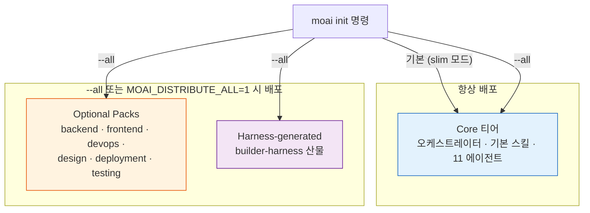
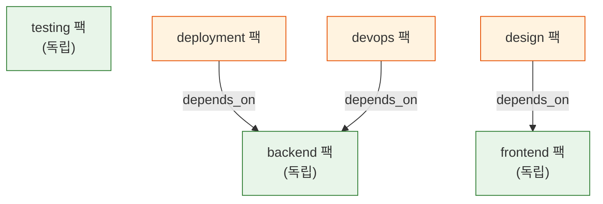

토크노믹스(비용을 다루는 원칙)는 토큰 그 자체에만 걸리는 이야기가 아닙니다. 프로젝트에 배포하는 템플릿 파일 하나하나가 결국 세션이 읽어 들일 컨텍스트(맥락) 후보이기 때문입니다. 카탈로그(배포 단위 목록) 시스템은 "필요한 것만 배포한다"는 원칙으로 이 비용을 초기화 단계에서부터 줄입니다 — 쓰지도 않을 도메인 스킬을 미리 깔아 두면, 그 파일이 세션 시작 지침에 끼어들어 토큰을 갉아먹습니다.

## 왜 카탈로그가 필요한가

MoAI-ADK는 단일 바이너리 하나에 모든 템플릿을 품고 있습니다. 그 안에는 코어 워크플로우 스킬, 12개 에이전트 정의, 백엔드·프론트엔드·보안 같은 도메인 확장 팩, 그리고 하네스(품질 검증 자동 장치)가 동적으로 만들어 낸 산물까지 들어 있습니다. 이 전부를 매 프로젝트마다 그대로 쏟아붓는다면 두 가지 문제가 생깁니다.

첫째, 파일이 많아질수록 `moai init`이 느려지고 프로젝트 디렉터리가 부풀어 오릅니다. 둘째이자 더 중요한 문제는, 배포된 파일 가운데 상당수가 세션이 항상 읽어 들이는 지침(prefix)에 끼어든다는 점입니다. 쓸 일이 없는 보안 스킬이 매 세션 시작마다 토큰을 차지하면, 프롬프트 캐시 적중률이 떨어지고 실제 작업에 쓸 수 있는 컨텍스트 예산이 줄어듭니다.

카탈로그는 이 문제를 "배포 단위를 처음부터 구조화한다"로 풉니다. 무엇을 항상 깔 것인지, 무엇을 골라서 깔 것인지, 무엇을 하네스가 나중에 만들어 넣을 것인지를 **매니페스트** (배포 내역을 적어둔 목록) 하나로 선언해 두고, 로더가 그 매니페스트를 타입 안전하게 읽어 들여 배포를 결정합니다.

## 3계층 매니페스트

배포 대상은 모두 세 계층 — **티어** (계층) — 가운데 하나에 들어갑니다. 각 티어는 "언제 배포되는가"로 구분됩니다.

| 티어 | 매니페스트 키 | 언제 배포되나 | 무엇이 들어 있나 |
|------|---------------|---------------|------------------|
| **Core** | `catalog.core` | 항상 (slim 모드 기본) | 오케스트레이터, 기본 스킬·에이전트, 품질 게이트 |
| **Optional Packs** | `catalog.optional_packs` | `--all` 선택 시 | 도메인 확장 (backend·frontend·devops 등 6개 팩) |
| **Harness-generated** | `catalog.harness_generated` | `--all` 선택 시 | 하네스가 동적 생성한 에이전트·스킬 |



왜 하필 세 계층일까요. 코어는 "없으면 MoAI가 돌지 않는" 최소 인프라이므로 양보할 수 없습니다. 도메인 팩은 "있으면 좋지만 프로젝트 성격에 따라 쓰지 않을 수 있는" 확장이므로, 선택권을 사용자에게 돌려줍니다. 하네스 생성물은 빌더가 실행된 뒤에야 의미가 생기는 동적 산물이므로, 정적 템플릿과 구분해 둡니다 — 섞이면 "이 파일은 원래 있던 걸까, 하네스가 만든 걸까"를 매번 판별해야 합니다.

## 매니페스트 스키마

카탈로그 매니페스트는 `internal/template/catalog.yaml`에 YAML 형식으로 정의됩니다. 각 엔트리는 다섯 필드를 가집니다.

```yaml
catalog:
  core:                        # 항상 배포 (slim 모드 기본)
    skills:
      - name: moai-workflow-tdd
        tier: core
        path: templates/.claude/skills/moai-workflow-tdd/
        hash: 6f89fb72...      # 정규화된 소스의 sha256 (64자 헥스)
        version: 1.0.0
    agents:
      - name: manager-spec
        tier: core
        path: templates/.claude/agents/moai/manager-spec.md
        hash: a1b2c3d4...
        version: 1.0.0
```

`name`은 식별자, `tier`는 계층, `path`는 templates 루트 기준 경로, `version`은 SemVer 문자열입니다. 가장 중요한 필드는 `hash`입니다 — 정규화된 소스 파일의 sha256 헥스 다이제스트 64자로, 로더가 배포된 파일이 깨졌거나 임의로 바뀌었는지 기계적으로 확인합니다. 스킬 디렉터리의 진입점 파일 이름은 `SKILL.md`(대문자)로 고정되어 있습니다 — 소문자 `skill.md`는 로드 대상이 아닙니다.

티어 문자열은 코드에 상수로 정의되어 있습니다 (`internal/template/catalog_loader.go`). `core`, `harness-generated`, 그리고 팩 전용 형식인 `optional-pack:<팩이름>`(예: `optional-pack:backend`) 세 종류뿐입니다. 하드코딩 금지 규칙에 따라, catalog.yaml에 적히는 모든 티어 문자열은 이 상수에서 파생됩니다.

## Slim 모드와 --all 플래그

기본 배포는 **slim 모드** (최소 파일만 배포하는 방식)로 `catalog.core`만 내려보냅니다. 코어는 "없으면 시스템이 동작하지 않는" 최소 집합이므로, 대부분의 프로젝트는 slim으로 충분합니다. 도메인 팩이나 하네스 생성물까지 받아야 한다면 `--all` 플래그나 `MOAI_DISTRIBUTE_ALL=1` 환경변수를 씁니다.

배포 결정은 두 단계로 이뤄집니다. 첫째, `catalog.core`(skills + agents)는 언제나 포함됩니다 — slim 모드의 전부이자 `--all` 모드의 부분집합입니다. 둘째, `--all` 플래그나 환경변수가 켜져 있으면 `catalog.optional_packs`와 `catalog.harness_generated`를 추가로 펼쳐 배포합니다. `moai update`도 같은 매니페스트를 기준으로 움직여서, slim으로 시작한 프로젝트는 core만, `--all`로 시작한 프로젝트는 전체를 업데이트합니다 — 초기화 모드가 업데이트 범위를 결정합니다.

## Optional Packs과 팩 의존성

도메인 확장은 여섯 개 팩으로 묶여 있고, 팩끼리 의존성을 가질 수 있습니다. 의존성은 매니페스트의 `depends_on` 필드로 선언됩니다.



세 팩(frontend·backend·testing)은 다른 팩에 의존하지 않는 독립 뿌리입니다. 나머지 셋은 뿌리 위에 올라탑니다 — deployment 팩은 backend 위에서, design 팩은 frontend 위에서, devops 팩은 다시 backend 위에서 의미를 가집니다. 예컨대 design 팩에 든 휴머나이즈(문장을 자연스럽게 다듬는) 스킬은 프론트엔드 맥락이 있어야 쓸모가 있으므로, 매니페스트가 그 관계를 `depends_on: [frontend]`로 명시합니다. `--all`은 모든 팩을 펼치므로 의존성이 자동으로 만족되지만, 팩을 부분 선택하는 확장 시나리오에서는 이 그래프가 "어떤 팩을 먼저 깔아야 하는가"의 답이 됩니다.

현재 각 팩이 담고 있는 대표 스킬은 이렇습니다 — backend(`moai-domain-backend`, `moai-ref-api-patterns` 등), frontend(`moai-domain-frontend`, `moai-ref-react-patterns`), devops(`moai-ref-owasp-checklist`, `moai-ref-llm-security`), design(`moai-domain-humanize`), deployment와 testing 팩은 향후 스킬이 채워질 자리를 둔 예약 영역입니다.

## Typed Loader — 매니페스트를 안전하게 읽기

매니페스트가 커지면 "필드가 빠졌거나 잘못 들어간" 엔트리가 섞일 수 있습니다. MoAI-ADK는 이를 문자열 파싱으로 처리하지 않고, `LoadCatalog()` 함수가 매니페스트를 강타입 구조체로 읽어 들입니다 (`internal/template/catalog_loader.go`). 매니페스트 오류는 배포 시점 전에 걸러집니다.

로더가 정의하는 핵심 타입은 세 가지입니다. `Entry`는 개별 스킬·에이전트 하나를 나타내며(name·tier·path·hash·version 필드), `Pack`은 optional 팩 하나를 나타내며(description·depends_on·skills·agents 필드), `Catalog`는 최상위 문서로 세 티어를 담습니다. 매니페스트가 없으면 `CATALOG_MANIFEST_ABSENT` 센티널 에러를, YAML 문법이 틀리면 파싱 에러를 반환합니다 — 호출자는 에러 종류를 기계적으로 구분할 수 있습니다.

타입 안전 외에 로더는 조회 헬퍼도 제공합니다. `AllEntries()`는 세 티어 전체를 평평하게 펼친 슬라이스를 돌려주고(감사 테스트가 씁니다), `LookupSkill(name)`과 `LookupAgent(name)`은 이름으로 엔트리를 찾아 포인터를 돌려줍니다. 티어 문자열 역시 상수(`TierCore`, `TierHarnessGenerated`, `TierOptionalPackPrefix`)에서 파생되므로, 오타로 인한 티어 불일치가 컴파일 타임에 막힙니다. 이 영역은 테스트 커버리지 100%를 유지합니다.

이런 안전장치가 왜 필요한지는 매니페스트가 커졌을 때 드러납니다. 엔트리가 수십 개를 넘어가면, 누군가 경로를 잘못 적었거나 해시 갱신을 빠뜨렸거나 티어 이름에 오타를 냈을 때 그 오류를 사람의 눈으로 잡아내는 건 거의 불가능해집니다. 강타입 로더는 이 오류들을 배포 직전에 기계적으로 한 번에 걸러 내므로, 깨진 템플릿이 사용자 프로젝트에 내려가는 사고를 원천적으로 막습니다. 매니페스트가 곧 배포 계약서이기 때문에, 계약서에 적힌 약속이 지켜지는지를 코드가 검증하는 셈입니다.

## 매니페스트는 어떻게 갱신되는가

catalog.yaml은 손으로 편집하지 않습니다. 템플릿 소스(`internal/template/templates/`)를 고친 뒤 `make build`를 실행하면, `gen-catalog-hashes --all` 단계가 모든 엔트리의 콘텐츠 해시를 다시 계산해 매니페스트에 반영하고 바이너리에 다시 임베드합니다 — catalog.yaml은 `//go:embed catalog.yaml` 지시자로 바이너리에 컴파일됩니다. 그러므로 템플릿을 고치고 해시 갱신 커밋을 빠뜨리면, 커밋된 트리와 임베드된 매니페스트가 어긋나 CI 패리티 검사가 실패합니다. 템플릿을 바꾸면 반드시 `make build`로 매니페스트까지 다시 맞춰야 합니다.

이 설계가 만들어내는 효과는 단순합니다 — 배포되는 모든 파일이 매니페스트에 귀속되고, 매니페스트의 모든 엔트리가 해시로 무결성이 보장되며, 그 검증이 타입 안전한 로더를 통해서만 이루어집니다. "어떤 파일이 깔렸는지", "그 파일이 원본과 같은지"를 사람이 추적할 필요가 없습니다.

## 관련 문서

- [설치](/ko/getting-started/installation) — `moai init` 설치와 실행 가이드
- [초기 설정](/ko/getting-started/init-wizard) — init 대화형 마법사
- [업데이트](/ko/cli-reference/update) — `moai update`와 매니페스트 기반 업데이트
- [스킬 가이드](/ko/advanced/skill-guide) — 스킬 작성과 티어 배정
