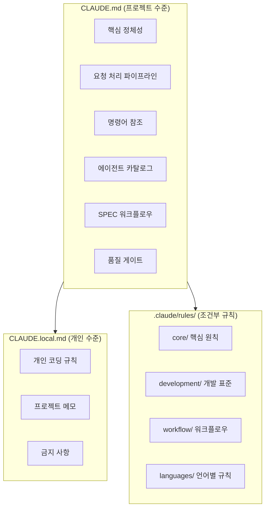
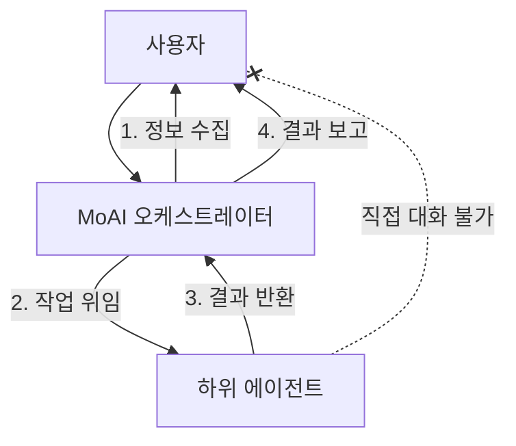
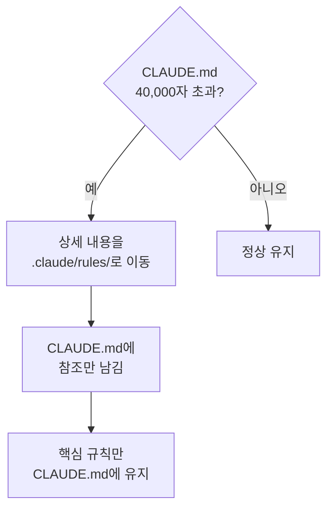
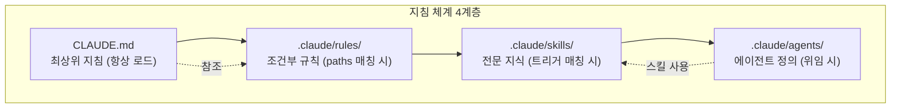

## 이 문서를 읽으면 배우는 것

이 문서는 `CLAUDE.md` (프로젝트마다 Claude Code가 세션을 시작할 때 가장 먼저 읽는 지시서) 가 왜 필요한지, 어떤 구조로 쓰는지, 무엇을 적고 무엇을 적지 말아야 하는지를 다룹니다. 읽고 나면 MoAI-ADK가 프로젝트 지침을 어떻게 세계관으로 삼는지, 그리고 왜 한 줄 한 줄이 토크노믹스 (비용 설계) 와 직결되는지 이해할 수 있습니다.


**한 줄 요약**: `CLAUDE.md`는 프로젝트의 헌법입니다. Claude Code가 프로젝트를 어떻게 이해하고, 어떤 규칙을 따르며, 어떤 에이전트 (스스로 일하는 AI 도우미) 를 호출할지를 모두 이 파일에서 결정합니다.


## 왜 CLAUDE.md가 필요한가

AI와 자연스럽게 대화하며 코드를 쓰는 바이브코딩은 빠르고 직관적이지만, 실무에서는 단 하나의 치명적 약점이 있습니다. 세션이 끊기거나 컨텍스트가 초기화되면, 어제 논의한 인증 방식도, 코딩 규칙도, 프로젝트 구조도 모두 사라집니다. 매번 처음부터 다시 설명해야 하는 이 맥락 유실이 비용과 시간을 갉아먹습니다.

`CLAUDE.md`는 이 문제를 푸는 가장 근본적인 장치입니다. Claude Code가 매 세션을 시작할 때 가장 먼저 이 파일을 읽도록 정해 둠으로써, 프로젝트의 규칙·에이전트 구조·워크플로우·품질 기준을 세계관으로 삼게 만듭니다. 사람이 새 회사에 입사하면 사원 핸드북을 읽는 것처럼, Claude Code는 세션을 시작할 때 `CLAUDE.md`를 읽고 프로젝트의 맥락을 파악합니다.

다만 한 줄 한 줄이 곧 상시 컨텍스트 비용이라는 점을 잊으면 안 됩니다. 이 파일은 매 세션, 매 턴마다 다시 읽히기 때문에, 지침 체계 설계는 곧 하네스 (품질 검증 자동 장치) 설계인 동시에 토크노믹스이기도 합니다. 그래서 짧을수록 모든 세션이 싸집니다.

## 지침 체계의 3계층

MoAI-ADK는 프로젝트 지침을 세 개의 파일 층으로 나눠 관리합니다. 왜 하나로 합치지 않고 층을 나누는가 — 각 층마다 "누가 쓰는가", "언제 로드되는가", "업데이트 시 어떻게 되는가"가 다르기 때문입니다.



| 파일/디렉토리 | 용도 | Git 추적 | 업데이트 시 |
|---------------|------|----------|-------------|
| `CLAUDE.md` | 프로젝트 핵심 지침 | 예 | 덮어쓰기 |
| `CLAUDE.local.md` | 개인 커스텀 지침 | 아니오 | 보존 |
| `.claude/rules/moai/` | 조건부 세부 규칙 | 예 | 덮어쓰기 |

`CLAUDE.md`와 `CLAUDE.local.md`의 분리가 핵심입니다. `CLAUDE.md`는 프로젝트 전체가 공유하는 지침이라 Git에 추적되고 MoAI-ADK 업데이트 시 덮어쓰입니다. 반면 `CLAUDE.local.md`는 개인 규칙을 담는 곳이라 Git에서 무시되고 업데이트 시 보존됩니다. 그래서 개인의 코딩 취향이나 프로젝트 메모는 반드시 `CLAUDE.local.md`에 적어야 업데이트에 날아가지 않습니다.

## CLAUDE.md의 주요 섹션

MoAI-ADK가 배포하는 `CLAUDE.md`는 열일곱 개 섹션으로 이루어져 있지만, 입문자가 먼저 이해해야 할 핵심은 다음 여덟 가지입니다. 각 섹션은 "왜 필요한가"라는 인과 관계로 자리 잡고 있습니다.

### 1. 핵심 정체성 — MoAI는 누구인가

첫 번째 섹션은 MoAI 오케스트레이터의 역할과 HARD 규칙을 정의합니다. MoAI가 Claude Code의 전략적 오케스트레이터라는 정체성, 그리고 언어 인식 응답·병렬 실행·XML 비표시·Markdown 출력 같은 필수 규칙이 여기에 들어갑니다. 왜 정체성을 먼저 선언하는가 — 이후 모든 섹션이 "오케스트레이터로서의 MoAI"라는 전제 위에서 전개되기 때문입니다.

### 2. 요청 처리 파이프라인 — 모든 요청은 하나의 흐름으로

모든 사용자 요청은 입력 언어와 무관하게 하나의 순서화된 파이프라인을 거칩니다. 의도 분석 → 컨텍스트 점검 → 실행 계획 → 승인 게이트 → 실행·검증·반복의 다섯 단계입니다. 이 중 **의도 분석이 항상 먼저**라는 점이 v3.0의 핵심입니다 — 영어 키워드 매칭이 아니라 언어 독립적 의미 분류로 라우팅합니다. 그래서 한국어로 요청해도 영어로 요청해도 같은 워크플로우로 도달합니다.

### 3. 명령어 참조 — `/moai` 단일 진입점

`/moai`가 모든 MoAI 개발 워크플로의 단일 진입점입니다. `/moai plan`, `/moai run`, `/moai sync`로 이어지는 SPEC 파이프라인부터, `/moai goal`, `/moai loop`, `/moai fix` 같은 에이전틱 루프, `/moai project`, `/moai harness` 같은 프로젝트 관리, `/moai review`, `/moai gate`, `/moai clean`, `/moai mx`, `/moai codemaps` 같은 품질·유틸리티 명령이 모두 여기서 정의됩니다. 명령어를 단일 진입점으로 묶은 이유는 사용자가 "어떤 명령을 써야 하나"를 검색하지 않게 하기 위해서입니다.

### 4. 에이전트 카탈로그 — 12개 전문가 팀

MoAI-ADK는 12개의 보존 에이전트 (11개 MoAI 커스텀 + 1개 Anthropic 빌트인 `Explore`) 로 구성됩니다. `manager-spec`, `manager-develop`, `manager-docs`, `manager-git`, `manager-design`, `manager-lead` 같은 관리자 에이전트가 라이프사이클 단계를 맡고, `plan-auditor`, `sync-auditor`가 독립 평가를, `builder-harness`가 동적 하네스 생성을, `super-advisor`가 고추론 자문을 담당합니다. 과거 `manager-strategy`, `manager-quality`, `manager-brain`, `manager-project` 등 12개 에이전트는 archived 됐고 그 자리는 도메인별 per-spawn 위임이 대신합니다. 카탈로그가 명시적인 이유는 오케스트레이터가 "어떤 전문가에게 맡길 것인가"를 매번 같은 기준으로 판단하게 하기 위해서입니다.

### 5. SPEC 워크플로우 — 3단계 개발 파이프라인

SPEC (요구사항 명세서) 기반 3단계 워크플로우를 정의합니다. `/moai plan`이 요구사항을 SPEC 문서로 만들고, `/moai run`이 DDD/TDD로 구현하며, `/moai sync`가 문서 동기화와 PR 생성을 맡습니다. 왜 코드를 바로 쓰지 않고 SPEC부터 거치는가 — "무엇을 만들 것인가"를 먼저 문서로 고정해야 "다 됐다"의 판정 기준이 서기 때문입니다.

### 6. 품질 게이트 — TRUST 5

TRUST 5 프레임워크와 LSP 품질 게이트를 정의합니다. Tested (85% 이상 커버리지), Readable (명확한 이름), Unified (일관된 스타일), Secured (OWASP 준수), Trackable (명확한 커밋) 다섯 기준 각각에 기계가 판정할 수 있는 검사가 붙습니다. 리뷰어의 취향이 아니라 매번 같은 잣대를 코드에 대는 것이 목적입니다.

### 7. 사용자 상호작용 아키텍처 — 단일 접점 원칙

하위 에이전트는 사용자와 직접 대화할 수 없습니다. 사용자 접점은 MoAI 오케스트레이터 하나로 고정됩니다. 왜 접점을 하나로 묶는가 — 하위 에이전트가 사용자에게 직접 질문을 던지면 응답이 돌아오지 않는 교착 상태가 생기기 때문입니다.



MoAI가 모든 사용자 질문을 `AskUserQuestion` 채널로 모으고, 하위 에이전트는 결과를 MoAI에게 반환한 뒤 끝냅니다. 정보가 부족하면 하위 에이전트는 blocker 보고를 올리고, MoAI가 사용자에게 다시 묻고, 응답을 받아 새 프롬프트에 주입해 재위임합니다. 이 비대칭 구조가 세션을 흐르게 합니다.

### 8. 구성 참조 — 언어와 사용자 설정

언어 설정과 사용자 설정, 프로젝트 규칙을 참조합니다. 대화 언어·에이전트 내부 언어·Git 커밋 메시지 언어·코드 주석 언어·문서 언어를 각각 따로 설정할 수 있어, 예를 들어 "대화는 한국어, 커밋 메시지는 영어" 같은 조합이 가능합니다. 왜 이 설정이 `CLAUDE.md`에 있나 — 매 턴마다 응답 언어를 결정해야 하는데 그 기준이 세션마다 흔들리면 안 되기 때문입니다.

## `.claude/rules/` — 조건부로 로드되는 세부 규칙

`.claude/rules/` 디렉토리에는 조건부로 로드되는 세부 규칙이 저장됩니다. 모든 규칙을 `CLAUDE.md`에 넣지 않고 조건부 파일로 분리하는 이유는 단 하나 — 안 쓰는 규칙이 컨텍스트를 차지하지 않게 하기 위해서입니다.

### 디렉토리 구조

```text
.claude/rules/moai/
├── core/                          # 핵심 원칙 (항상 로드)
│   └── moai-constitution.md       # TRUST 5, 핵심 규칙
├── development/                   # 개발 표준
│   ├── skill-authoring.md         # 스킬 작성 가이드
│   └── coding-standards.md        # 코딩 표준
├── workflow/                      # 워크플로우
│   └── spec-workflow.md           # Plan/Run/Sync 정의
└── languages/                     # 16개 언어별 규칙
    ├── python.md
    ├── typescript.md
    └── ...
```

### 조건부 로딩 — `paths` 프론트매터

규칙 파일은 `paths` 프론트매터를 걸어 두면 해당 파일 패턴을 다룰 때만 로드됩니다. 예를 들어 Python 규칙 파일에 `paths: ["**/*.py", "**/pyproject.toml"]`을 걸어 두면 Python 파일을 수정할 때만 로드돼 토큰이 절약됩니다. 이게 Progressive Disclosure의 핵심입니다 — 항상 떠 있어야 하는 규칙은 `core/`에, 조건부로 필요한 규칙은 그 아래 계층에 두는 층진 구조입니다.

| 디렉토리 | 파일 | 로드 조건 |
|----------|------|-----------|
| `core/` | `moai-constitution.md` | 항상 |
| `development/` | `skill-authoring.md` | 스킬 작업 시 |
| `development/` | `coding-standards.md` | 코드 작업 시 |
| `workflow/` | `spec-workflow.md` | 워크플로우·SPEC 작업 시 |
| `languages/` | `python.md` 등 | 해당 언어 파일 수정 시 |

## `CLAUDE.local.md` — 개인 규칙을 보존하는 곳

`CLAUDE.local.md`는 개인적인 규칙과 메모를 작성하는 파일로, MoAI-ADK 업데이트와 무관하게 보존됩니다. 왜 별도 파일로 분리했나 — `CLAUDE.md`는 프로젝트가 공유하는 지침이라 업데이트마다 덮어씌워지지만, 개인 규칙은 그러면 안 되기 때문입니다.

적어 넣기 좋은 항목은 다음과 같습니다.

| 용도 | 예시 |
|------|------|
| 코딩 규칙 | "변수명은 camelCase, 파일명은 kebab-case" |
| 프로젝트 메모 | "인증은 JWT, 만료 24시간, 갱신 7일" |
| 금지 사항 | "console.log를 프로덕션 코드에 남기지 말 것" |
| 선호 패턴 | "React 컴포넌트는 함수형만 사용" |
| MDX 규칙 | "강조 표시와 괄호 사이에 공백 필수" |

`CLAUDE.md`를 직접 수정하기보다 `CLAUDE.local.md`에 개인 규칙을 추가하는 걸 권장합니다 — MoAI-ADK 업데이트 시에도 개인 규칙이 안전하게 보존되기 때문입니다.

## 크기 제한 — 왜 40,000자 이하인가

`CLAUDE.md`는 **40,000자 이하**를 유지해야 합니다. 왜 숫자에 제한을 두는가 — 이 파일은 매 세션, 매 턴마다 다시 읽히기 때문에 길어질수록 모든 세션의 비용이 선형으로 올라갑니다. MoAI-ADK 자체도 v3 기간 동안 `CLAUDE.md`를 계속 다이어트해 왔습니다.

크기가 초과될 때의 대응 전략은 다음과 같습니다.



1. **상세 내용 이동**: 긴 설명은 `.claude/rules/` 파일로 분리합니다
2. **참조 사용**: `CLAUDE.md`에서 `@파일경로`로 참조만 남깁니다
3. **핵심만 유지**: 정체성, HARD 규칙, 에이전트 카탈로그만 남깁니다
4. **스킬로 전환**: 긴 패턴 설명은 스킬로 변환합니다

## 지침 계층 — 4계층 로드 모델

MoAI-ADK의 지침은 4계층으로 나뉘며, 아래로 갈수록 로드 조건이 좁아집니다. 이 층진 구조가 컨텍스트 다이어트의 뼈대입니다.



| 계층 | 파일 | 로드 시점 | 역할 |
|------|------|-----------|------|
| 1 | `CLAUDE.md` | 항상 | 프로젝트 정체성, 핵심 규칙 |
| 2 | `.claude/rules/*.md` | 파일 패턴 매칭 시 | 조건부 세부 규칙 |
| 3 | `.claude/skills/*/skill.md` | 트리거 매칭 시 | 전문 지식, 패턴 |
| 4 | `.claude/agents/*.md` | 위임 시 | 전문가 역할 정의 |

## 작성 원칙 — 무엇을 적고 무엇을 적지 말 것

`CLAUDE.md`를 쓸 때 지키면 좋은 원칙입니다.


**적으면 좋은 것** 

- 프로젝트의 핵심 정체성과 품질 기준
- 매 턴마다 의미가 있는 HARD 규칙
- 에이전트 카탈로그와 위임 규칙
- "무엇을 만들 것인가"를 정하는 워크플로우 뼈대



**적지 말아야 할 것** 

- 프로젝트마다 달라질 수 있는 개인 취향 — `CLAUDE.local.md`로
- 특정 파일에서만 의미 있는 세부 규칙 — `.claude/rules/`로
- 가끔씩만 필요한 전문 지식 — 스킬로
- 긴 예시와 설명 — 참조나 링크로


## 관련 문서

- [스킬 가이드](/ko/advanced/skill-guide) — 스킬 시스템 상세
- [에이전트 가이드](/ko/advanced/agent-guide) — 에이전트 시스템 상세
- [settings.json 가이드](/ko/advanced/settings-json) — 설정 파일 관리
- [Hooks 가이드](/ko/advanced/hooks-guide) — 이벤트 자동화
