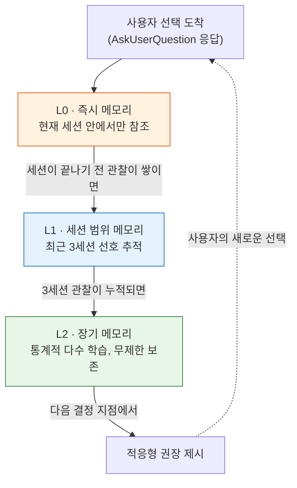
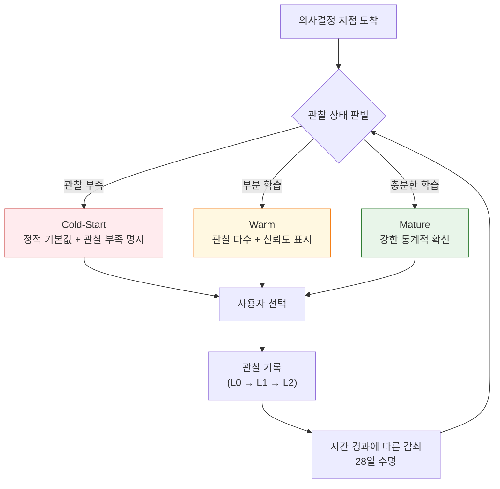

에이전트(스스로 일하는 AI 도우미)가 사용자와 일할 때 가장 자주 만나는 것은 선택의 갈림길이다. 어느 모델로 구현을 진행할지, 작업을 어느 난이도 등급으로 묶을지, 코드 변경을 곧장 메인에 올릴지 풀 리퀘스트로 검토 받을지. 이런 선택지들이 매 세션마다 되풀이되면서 사용자를 피로하게 만들고, 시스템은 매번 같은 정책 기본값을 권장하는 데 그친다. 의사결정 메모리는 바로 이 지점에서 방향을 바꾼다. 사용자가 어떤 선택을 했는지를 조용히 관찰해 두었다가, 다음 번 비슷한 결정 지점에서 **관찰된 통계적 다수**를 근거로 적응형 권장을 내놓는 장기 학습 계층이다.


**한 줄 요약**: 의사결정 메모리는 사용자의 선택을 기억하고, 같은 결정이 다시 찾아올 때 관찰에 기반한 권장을 제시합니다. 시스템이 밀고 싶은 기본값이 아니라, 사용자가 실제로 반복해서 선택해 온 것이 권장이 됩니다.


## 왜 의사결정 메모리인가

에이전트가 일을 잘하게 만드는 데에는 두 가지 길이 있다. 하나는 에이전트의 추론을 정교하게 다듬는 것이고, 다른 하나는 에이전트가 묻는 질문 자체를 줄여 주는 것이다. 후자가 의사결정 메모리가 사는 자리다.

같은 사용자가 열 번째 프로젝트에서도 매번 "Tier S, M, L 가운데 어느 것인가"라는 질문을 받아야 한다면, 그건 에이전트가 사용자를 전혀 관찰하지 못하고 있다는 뜻이다. 사용자가 지난 아홉 번 가운데 여섯 번을 Tier M을 선택했다면, 열 번째에는 Tier M을 먼저 제안하고 그 근거를 밝히는 쪽이 사용자의 시간과 토큰을 아낀다. 의사결정 메모리는 이 관찰을 자동으로 쌓는 계층이다.

중요한 것은 **방향**이다. 시스템이 내보내고 싶어 하는 정책 기본값을 권장으로 포장하는 게 아니라, 사용자가 실제로 반복 선택해 온 것을 권장으로 올린다. 그래서 권장의 근거는 항상 관찰이고, 관찰이 부족할 때는 그 부족을 숨기지 않고 그대로 드러낸다.

## 관찰에서 권장까지 — 작동 흐름

의사결정 메모리는 세 계층으로 관찰을 보관한다. 아래로 갈수록 오래 남고, 위로 올라갈수록 빠르게 사라진다.

**L0 · 즉시 메모리**는 지금 이 세션에서 사용자가 방금 고른 옵션을 참조하는 짧은 기억이다. 세션이 끝나면 사라진다. **L1 · 세션 범위 메모리**는 같은 프로젝트의 최근 세 세션까지 선호를 추적해, 최근 경향에 기반한 권장을 만든다. 그리고 **L2 · 장기 메모리**는 모든 세션을 합쳐 통계적 다수를 배운다. 이 계층만 사용자가 직접 관리하며, 메모리(경험을 파일로 저장해 두는 기억 장치)의 인덱스와 보조 파일로 영속화된다.

장기 기억의 저장 구조는 회수 효율을 위해 세 단계로 나뉜다. 자주 쓰이는 뜨거운 사실은 **core** 계층에 올라 가장 빠르게 참조되고, 최근 세션의 사실은 **recall** 에, 전체 검색 대상은 **archival** 에 보관된다. core에 적중하면 더 느린 하위 계층까지 내려가지 않으므로 권장이 빨라진다.

권장은 이 계층들의 관찰을 합쳐 만들어진다. 충분한 관찰이 쌓인 결정은 L2의 통계가, 최근 경향이 중요한 결정은 L1의 추세가 반영된다.

## 권장을 만드는 다섯 원칙

권장은 단순히 "가장 많이 선택된 것을 보여 줘"가 아니다. 다섯 원칙이 한꺼번에 적용된다.

| 원칙 | 하는 일 | 사용자 관점 |
|------|--------|------------|
| **방출 시점** | 거의 확실한 결정은 자동 해결, 진짜 갈림길에서만 질문 | 불필요한 질문이 줄어든다 |
| **질문 순서** | 정보 이익이 가장 높은 질문을 먼저 배치 | 핵심 결정을 먼저 끝낸다 |
| **권장 옵션** | 관찰된 통계적 다수를 첫 옵션으로 | 반복 선택이 권장이 된다 |
| **전제 명시** | 권장이 성립하는 전제를 설명에 밝힘 | 전제가 안 맞으면 곧바로 거부 |
| **적응형 강도** | 숙련도에 따라 추천 강도를 조절 | 초보자는 강하게, 전문가는 살며시 |

다섯 원칙이 모두 같은 방향을 향한다 — 사용자의 관찰된 선택을 존중하고, 권장이 아닌 선택도 거부의 원칙 아래 존중받는다.

**방출 시점**은 "거의 확실한 결정은 사용자를 귀찮게 하지 말고 자동으로 풀자"는 원칙이다. 에이전트가 다가오는 결정의 불확실성을 추정했을 때, 한쪽으로 거의 기울어진 결정은 통계적 다수 옵션으로 자동 해결하고 질문 자체를 생략한다. 반대로 불확실성이 가장 큰 결정(어느 쪽으로든 갈 수 있는 열린 갈림길)일 때만 질문을 사용자에게 보낸다.

**질문 순서**는 한 번에 여러 질문을 묻게 될 때 정보 이익이 가장 높은 질문을 앞에 두는 원칙이다. 그래야 사용자가 핵심 결정을 먼저 끝내고, 덜 중요한 질문은 나중에 만난다.

**권장 옵션**은 권장이 어디서 오는지를 규정한다. 시스템이 정책적으로 밀고 싶은 기본값이 아니라 **관찰된 통계적 다수**가 첫 옵션에 놓인다. 관찰량에 따라 세 상태를 오간다 — 관찰이 부족한 Cold-Start, 부분 학습된 Warm, 안정화된 Mature. 각 상태에서 권장의 확신도와 표시 방식이 달라진다.

**전제 명시**는 권장이 성립하는 조건을 설명에 밝히는 원칙이다. "이러이러한 상황에서 추천함"이라는 전제를 명시해, 전제가 깨졌을 때 사용자가 곧바로 거부할 수 있게 한다. 전제를 숨긴 권장은 설계 결함이다.

**적응형 강도**는 같은 권장이라도 상대에 따라 강도를 바꾸는 원칙이다. 전문가에게 강한 권장은 자율성을 침해하고, 초보자에게 약한 권장은 결정 피로만 늘리기 때문이다.

## Cold-Start — 모를 때는 모른다고 말한다

관찰이 부족할 때, 시스템은 그 사실을 숨기지 않는다. 사용자가 다섯 번밖에 선택하지 않은 카테고리에서 "정적 기본값 기반, 개인화에는 관찰 5건이 더 필요합니다"라고 명시한다. 가짜 확신을 권장으로 포장하지 않는 것이다. 이 투명성은 **자율성**과 짝을 이룬다 — 권장은 언제든 거부할 수 있고, 거부한 선택 역시 관찰로 쌓인다.

### 숙련도에 따라 강도가 달라진다

같은 권장이라도 상대에 따라 강도가 바뀐다. 초보자(세션 10회 미만)에게는 `(권장)` 라벨과 이유를 분명히 밝히는 강 추천을 쓰고, 전문가(세션 50회 초과)에게는 사용자가 이미 알고 있을 것이라 짐작하고 관찰된 선호만 조용히 공개하는 약 추천을 쓴다. 중급자(10회 이상 50회 이하)에게는 정황에 따라 그 사이 어딘가를 택한다. 전문가에게 강한 권장은 자율성을 침해하고, 초보자에게 약한 권장은 결정 피로만 늘리기 때문이다.

사용자가 권장을 따르지 않았다고 해서 시스템이 벌을 주지 않는다. 그 선택 자체가 다음 권장의 원료가 될 뿐이다. 거부도 관찰이고, 관찰은 누적된다.

## 기억은 영원하지 않다 — 감쇠 정책

사용자의 선호는 고정되어 있지 않다. 석 달 전에 자주 고른 옵션이 지금은 더 이상 맞지 않을 수 있다. 그래서 의사결정 메모리에는 **감쇠 정책**이 있다. 일시적인 기록에는 거듭제곱 감쇠와 28일 수명이 적용되어, 시간이 지나면서 가중치가 서서히 줄고 수명이 다하면 밀려난다.

이 감쇠는 망각이 아니라 적응이다. 과거의 선호가 오늘의 권장을 지배하지 않게 해 준다. 핵심 계층(core)에서는 가장 가중치가 낮은 항목부터 먼저 강등되어, 자주 쓰이는 기억은 살아남고 잊혀진 선호는 조용히 빠져나간다.

세부 감쇠 지수와 반감기 상수는 런타임 구현 사항이며, 이 페이지가 약속하는 것은 계약 수준이다 — 거듭제곱 감쇠, 28일 수명, 핵심 계층의 가중치 기반 강등. 두 관리 명령이 이 정책과 짝을 이룬다. `moai preference decay-scan`은 하루 한 번 백그라운드에서 감쇠 패스를 돌리고, `moai preference toggle`은 세션 단위로 개인화를 끄고 켠다(세션이 끝나면 리셋).

## 의사결정 메모리가 배우는 것들

메모리가 추적하는 주요 결정 유형은 프로젝트 운영의 굵은 흐름을 따라간다.

| 카테고리 | 예시 |
|----------|------|
| **작업 규모 선택** | Tier S · M · L |
| **개발 방법론** | DDD(기존 코드 안전 개선) vs TDD(테스트 먼저 작성) |
| **작업 공간 전략** | 메인 브랜치 · 일반 브랜치 · 워크트리 격리 |
| **변경 반영 방식** | 메인 직행 vs 풀 리퀘스트 검토 |
| **모델 선택** | 작업별 모델 배정 |
| **추론 깊이** | 노력 수준 (low · medium · high · xhigh) |

모델 선택과 추론 깊이도 여기에 들어간다. 의사결정 메모리가 학습한 선호가 결국 모델과 추론 깊이 배정으로 이어지기 때문이다. 그래서 이 시스템은 토크노믹스(비용 대비 품질을 다루는 MoAI-ADK의 핵심 가치)의 개인화 계층이기도 하다 — 사용자가 반복해서 선택한 모델과 추론 깊이 조합이 다음 작업의 기본 배정이 된다.

## 투명성과 자율성 — 두 축

의사결정 메모리의 모든 설계는 두 축 위에 있다.

- **투명성** — 권장의 근거를 항상 밝힌다. 관찰이 부족할 때도 부족하다고 말한다. 정적 기본값인지 관찰 기반인지를 숨기지 않는다.
- **자율성** — 권장은 제안일 뿐, 사용자의 거부를 막지 않는다. 거부한 선택도 관찰로 쌓인다.

이 두 축이 같이 작동할 때, 권장은 조종이 아니라 안내가 된다. 사용자가 자기 선택을 되돌아보는 도구로 쓰이고, 시스템은 사용자의 선택을 존중하는 방향으로 학습한다.

의사결정 메모리는 자동으로 작동한다. 사용자가 따로 설정할 것이 없다 — 결정을 내릴 때마다 시스템이 조용히 관찰하고, 다음 결정에서 그 관찰이 살아난다.

## 관련 문서

- [에이전트 가이드](/ko/advanced/agent-guide) — AskUserQuestion 권장 배치 규칙 (HARD)
- [Harness v4 Builder 심화 가이드](/ko/advanced/harness-v4-builder) — Tier 선택과 의사결정
- [메모리 시스템](/ko/claude-code/context-memory/memory) — 사용자 선호도 관리
