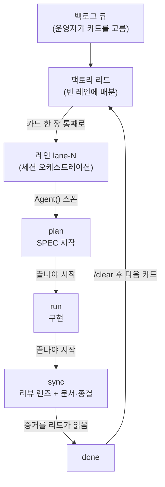



# 팩토리 모드 (Factory Mode)


 <strong>소속 가치</strong>: 다중 세션 오케스트레이션 · 토크노믹스


팩토리 모드는 칸반 모드의 두 번째 형태입니다. 칸반이 역할 세 개의 동반 세션이 한 카드를 칸(column) 사이로 나르는 보드라면, 팩토리는 **번호 붙은 레인 N개**가 카드 여러 장을 동시에 나르는 조립라인입니다. 카드는 칸을 옮겨 다니지 않습니다 — 빈 레인 하나에 **통째로** 들어가고, 그 레인이 세션 안에서 `plan → run → sync`를 순서대로 끝까지 책임집니다.

진입은 전용 토큰 `-f`입니다. 칸반 체인이 `-k`를 쓰듯, 팩토리는 `-f`를 씁니다. 큐·증거 판독·통합·폐기 규칙은 칸반과 완전히 같습니다 — 달라지는 것은 카드가 보드를 흐르는 모양뿐입니다.

## 칸반과 갈리는 지점

| | 칸반 모드 (`-k`) | 팩토리 모드 (`-f`) |
|---|---|---|
| 세션 구성 | 리드 1 + 역할 동반 세션 3 (`plan`·`run`·`sync`) | 리드 1 + 레인 `lane-1` … `lane-N` |
| 카드의 이동 | 칸 사이를 세션에서 세션으로 | 레인 하나에 통째로, 레인 안에서 단계를 순서대로 |
| 단계 실행 | 각 칸의 동반 세션이 맡음 | 레인이 각 단계를 `Agent()` 하위 에이전트로 스폰해 실행 |
| 카드 클래스 | A/B/C가 카드가 **지나치는 칸**을 정의 | A/B/C가 카드가 **건너뛰는 의식**만 이름 붙임 — 어느 카드도 세션을 갈아타지 않음 |
| `/clear` 경계 | 단계와 단계 사이 | 카드와 카드 사이 |

칸반에서 카드 클래스는 지름길의 모양을 정했습니다 — 클래스 A는 `plan` 칸을, 클래스 B도 `plan` 칸을 건너뛰었습니다. 팩토리에는 칸마다 앉은 세션이 없으므로 이 구분이 사라집니다. 클래스는 여전히 카드가 건너뛰는 의식(클래스 B는 `plan` 없이 진행되므로 SPEC이 없고, 클래스 A는 바로 닫기로 직행)을 이름 붙이지만, 카드가 어느 세션에서 일하는지는 더 이상 바꾸지 않습니다. 모든 레인은 자기 카드가 남은 단계가 무엇이든 그것을 직렬로 수행합니다.

## 진입 — 리드와 레인 열기

```bash
# 리드 — 레인 4짜리 팩토리 런 (lane-1..lane-4 실행 명령을 알려 줍니다)
$ moai cc -f 4

# 레인 — 각자 자기 터미널에서, 한 명령에 번호가 들어갑니다
$ moai cc -f lane-1
$ moai cc -f lane-2
$ moai cc -f lane-3
$ moai cc -f lane-4

# GLM 백엔드 레인도 같은 형태
$ moai glm -f lane-3
```

`-f`에 개수를 붙이지 않으면 레인 1개(`lane-1`) 기본으로 시작합니다. 큐가 밀리기 시작하면 그때그때 `moai cc -f lane-<n>`(또는 `moai glm -f lane-<n>`)으로 레인을 한 개씩 추가하세요. 레인은 칸반의 동반 세션과 마찬가지로 **사람이 별도 터미널에서 직접** 띄웁니다 — 세션이 다른 세션을 대신 띄우는 경로는 없습니다.

한 번의 실행에는 진입 토큰 하나만 붙을 수 있습니다 — `-k`와 `-f`를 함께 쓰면 에러입니다. v1.2.0의 통일 진입 형태인 `-k <N>`(리드)과 `-k <N> --name lane-<i>`(레인)은 그대로 유효한 호환 형태입니다(N 없이 `-k --name lane-<i>`만 쓰면 기본 8레인). 혼합 백엔드 런처인 `moai cg`는 칸반과 같은 이유로 팩토리를 거부합니다(`FACTORY_MODE_UNSUPPORTED_BACKEND`). 칸반 리드의 소켓이 `/tmp/moai-socket-kanban/<run-id>`에 열리듯, 팩토리 리드의 소켓은 `/tmp/moai-socket-factory/<run-id>`에 열리고 부트스트랩 안내가 실제 경로를 함께 알려 줍니다.

## 리드의 라우팅 — 카드는 빈 레인에 통째로

팩토리 리드가 하는 일이 칸반 리드와 다릅니다. 칸반 리드가 한 카드의 단계 사이를 조율한다면, 팩토리 리드는 **이미 선택된 카드를 빈 레인에 배분**합니다. 여기서 "빈 레인"은 이전 카드가 `done`에 도달하고 그 증거를 리드가 읽었음을 뜻합니다 — 카드를 든 레인은 호출하지 않고, 모든 레인이 바쁘면 카드는 배분되지 않고 큐에서 기다립니다.

카드를 고르는 주체는 언제나 운영자입니다(`moai todo next <n>`). 팩토리 리드가 큐를 훑어 카드를 줄 세우지 않습니다. 칸반 포어맨 루프(단독 `/loop`)도 예외가 아니어서, 이미 `picked`로 표시된 다음 카드를 배차할 뿐 스스로 고르지는 않습니다. 배차 블록의 형태는 칸반과 같고, `cmd` 필드가 클래스가 정하는 진입 단계를 가리킵니다 — 클래스 C는 `/moai plan`, 클래스 B는 `/moai run`, 클래스 A는 바로 닫기. 레인은 남은 단계를 추가 배차 없이 스스로 진행합니다.

## 레인 안 3단계 — 직렬 스테이지

레인 하나가 카드 한 장을 어떻게 지나가는지는 세 문장으로 정리됩니다. **plan이 끝나야 run이 시작되고, run이 끝나야 sync가 시작됩니다** — 레인은 같은 카드의 두 단계를 동시에 돌리지 않습니다. 각 단계의 실행은 레인이 `Agent()` 하위 에이전트로 스폰하고, 레인 자신은 오케스트레이션만 합니다. 하위 에이전트의 출력은 그 세션 창에 머무르고, 레인은 그들이 남긴 증거를 읽어 결과를 합칩니다.



단계가 진행되는 동안에도 휴먼 게이트는 그대로 발화합니다. 구현 착수 승인 같은 사람의 승인 지점은 레인 안에서도 자동으로 넘겨지지 않습니다.

## 병렬의 상한과 격리

레인은 각각 **최대 10개의 에이전트를 동시에** 실행할 수 있습니다 — 런처가 레인 세션에 `CLAUDE_CODE_MAX_CONCURRENT_SUBAGENTS` 상한을 주입하므로, 레인 N개가 동시에 팬아웃을 돌려도 머신 용량이 운영자의 절제가 아니라 구조적으로 분할됩니다.

병렬에는 두 축이 있고 서로 섞지 않습니다:

- **카드 사이 (팬아웃)** — 카드마다 워커를 붙여 여러 장을 동시에 밀 수 있습니다. 워커는 각자 자기 카드 디렉터리(`.moai/specs/<SPEC-ID>/`)에만 쓰므로 병렬 쓰기가 충돌하지 않습니다.
- **카드 안 (스테이지)** — 한 카드의 단계는 직렬입니다. 같은 카드에 쓰기 에이전트 둘을 병렬로 붙이지 않습니다 — 한 카드, 한 번에 한 명의 쓰기.

쓰기를 맡는 하위 에이전트를 병렬로 스폰할 때는 반드시 워크트리 격리(`isolation: "worktree"`)를 붙입니다 — 각 쓰기 에이전트가 자기 워크트리 사본에서 일하므로 카드 디렉터리 밖에서도 파일 쓰기가 충돌하지 않고, 레인은 증거와 머지로 통합합니다. 읽기 전용 조사·감사 팬아웃은 격리하지 않습니다 — 워크트리 설정 비용이 아무것도 사지 않는 자리입니다.

### 순차 기동과 모델 오버라이드 금지

레인을 띄울 때는 절대 전부를 동시에 활성화하지 마세요. 첫 번째 레인을 먼저 띄우고, 실제 출력을 내기 시작했다는 증거(첫 작업 수행 또는 진행 흔적)를 확인한 뒤 나머지 레인을 활성화합니다 — 동시 요청은 아직 기록 중인 캐시 항목을 읽지 못하므로, 동시 기동은 캐시 효율을 깨뜨립니다. 같은 이유로 배분 메시지에 모델 오버라이드를 실어 보내지 마세요 — GLM 티어 매핑은 `ANTHROPIC_DEFAULT_*_MODEL` 슬롯 환경변수를 타고 들어가며, 스폰마다 오버라이드를 붙이면 캐시가 쪼개지고 슬롯→GLM 매핑을 우회할 수 있습니다.

## 레인 번호 소유 — workers.json

어느 번호를 어느 레인이 쥐고 있는지는 `.moai/state/factory/workers.json`에 기록됩니다. 새 레인을 띄우면 번호는 **살아 있는 세션이 쥔 것만 건너뛰어** 다음 빈 번호로 붙습니다 — 죽은 레인의 번호는 풀려서 다시 쓰이고, 남은 claim도 이 파일에서 치워집니다. 레인 이름은 `-f lane-<n>` 형태가 이미 이름을 정하므로 `--name`/`-n`과 함께 쓰면 에러입니다.

## 달라지지 않는 것

팩토리가 바꾸는 것은 카드가 흐르는 모양뿐입니다. 나머지 규칙은 칸반과 같은 글자로 그대로 삽니다:

- **위임 채널은 디스크의 큐입니다.** 배차는 포인터이지 복사물이 아니고, 메시지는 재촉일 뿐 위임 자체가 아닙니다.
- **완료는 읽은 증거로만 판정합니다.** 레인이 답장했는지가 아니라 진행 기록을 읽었는지로 카드를 넘깁니다. 최종 PASS/FAIL 판정은 언제나 리드의 것 — 일을 만든 레인이 자기 출력을 심사하는 모양은 허용되지 않습니다.
- **`/clear` 경계는 카드 사이입니다.** 단계 사이의 인계가 사라진 것이 이 모드의 요점이지만, 카드 사이의 인계는 사라지지 않습니다 — 카드가 `done`에 닿으면 다음 카드를 받기 전에 그 레인을 `/clear`합니다.
- **카드 worktree는 원격 머지가 끝날 때까지 폐기하지 않습니다.** 브랜치가 아직 머지되지 않았다면 워크트리가 그 작업의 유일한 사본입니다.

## 관련 문서

- [칸반 모드](/ko/advanced/kanban-mode) — 역할 세 개가 카드를 칸 사이로 나르는 첫 번째 형태. 카드 클래스와 보드·큐의 공통 규칙
- [`/moai todo`](/ko/utility-commands/moai-todo) — 카드를 보드에 들이는 백로그 대기열. 카드를 고르는 주체는 운영자
- [manager-lead 리드 코디네이터](/ko/advanced/manager-lead) — 칸반·팩토리 리드 세션이 디스패치를 맡는 조율 에이전트
- [`/moai loop`](/ko/utility-commands/moai-loop) — bare `/loop`로 구동하는 무인 포어맨. 팩토리 리드와 같은 "고르지 않고 나르기만" 경계
- [칸반 보드 용어](/ko/core-concepts/kanban-board-terms) — 카드·칸·레인·리드의 정의와 예시를 갖춘 정식 용어집
