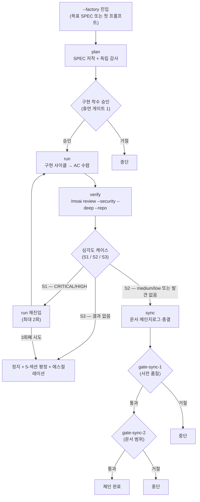



# 팩토리 모드 (Factory Mode)


 <strong>소속 가치</strong>: 에이전틱 루프 엔지니어링 · 에이전틱 하네스

<!-- @value: self-learning, agentic-harness -->

세션 런처에 `--factory`(짧게 `-f`) 스위치를 붙이면, 오케스트레이터(작업을 지휘하는 지휘자)가 `plan → run → verify → sync` 네 단계를 한 세션 안에서 한 번에 굴려 한 SPEC(요구사항 명세서)을 계획부터 종료까지 몰아갑니다. 새 하위 명령도, 새 런타임도 아닙니다. 이미 있던 `/moai goal`의 무한 지속 루프 위에 `factory_chain`이라는 골 프리셋(완료 조건을 미리 정해 둔 묶음)을 올려 태우는 진입 계약일 뿐입니다.

이 페이지는 팩토리 모드로 한 SPEC을 끝까지 밀고 가는 절차를 네 단계로 쪼개 설명합니다. 워크플로우 명령 관점의 짧은 소개는 [`/moai` 통합 명령](/ko/workflow-commands/)의 팩토리 모드 항목을 먼저 보세요. 여기서는 진입 조건, 체인 단계, 네 개의 휴먼 게이트(사람이 승인하는 결정문), 심각도 분기, 종료 조건, 그리고 "무엇이 자동화되지 않는가"까지를 한 겹 더 깊게 다룹니다.

## 이 페이지가 다루는 것

팩토리 모드는 `full-pipeline` 계약(하나의 SPEC에 대해 run→sync 자동 체인을 맺는 약정)을 확장하는 진입 계약입니다. 정확히 두 가지를 더 얹습니다.

1. **plan-phase 체인 머리** — 체인이 페이즈를 일일이 부르는 대신 plan에서 시작합니다.
2. **verify 출입 게이트** — run-phase 출구에 자동 보안 검토(`/moai review --security --deep --repo`)를 배치합니다.

나머지 체이닝 규칙은 상속된 그대로입니다. 두 번째 체이닝 메커니즘이 따로 없습니다. 체인 전체의 흐름은 아래 그림 하나로 잡힙니다.



## Step 1 — 팩토리 모드로 세션 열기


**슬래시 커맨드가 아닙니다**: 팩토리 모드는 Claude Code 대화창의 `/` 명령이 아니라 세션 자체를 여는 스위치입니다. 터미널에서 세션을 시작할 때 붙입니다. 대화창 안에서는 켜거나 끌 수 없습니다.


터미널에서 세션 런처에 `--factory`를 붙여 시작합니다. SPEC 식별자를 함께 주면 그 SPEC을 목표로 하고, 빠뜨리면 첫 프롬프트에서 plan-phase를 시작합니다.

```bash
# SPEC을 목표로 팩토리 체인 진입
$ claude --factory SPEC-AUTH-001

# 짧은 형태
$ claude -f SPEC-AUTH-001

# 목표 SPEC 없이 — 첫 프롬프트에서 plan 시작
$ claude --factory

# moai cc 런처로 같은 진입
$ moai cc --factory SPEC-AUTH-001
```

진입이 성공하면 런처는 세션 안에 두 가지를 끼워 넣습니다. 첫째, 곧 보게 될 `factory_chain` 골 프리셋을 (구현 착수 승인이 난 뒤에) 무장합니다. 둘째, Claude Code 런타임의 연속 블록 상한(`CLAUDE_CODE_STOP_HOOK_BLOCK_CAP`, 기본 8)을 `MOAI_FACTORY` 환경변수로 200까지 올립니다. 이 상향은 게이트를 넘지 않습니다 — 휴먼 게이트는 블록 상한이 아니라 `AskUserQuestion`으로 발화하므로, 상한이 8이든 200이든 게이트의 발화 조건은 같습니다. 세션이 끝나면 `defer`로 진입 전 값으로 되돌려, 전역 환경을 건드리지 않습니다.

```bash
# 개념적 흐름 — 런처가 세션 시작/종료에 끼워 넣는다
# (사용자가 직접 환경변수를 건드릴 필요 없음)
enter_factory_session():
    set CLAUDE_CODE_STOP_HOOK_BLOCK_CAP=200 via MOAI_FACTORY
    defer restore original CAP value
    start factory_chain preset
```

한 가지 단단한 경계가 있습니다. 팩토리 모드는 혼합 백엔드 런처인 `moai cg`에서 거부됩니다. `moai cg`는 한 백엔드에서 리더를, 다른 백엔드에서 팀원을 굴리는데, 이는 체인이 전제하는 "한 세션 / 한 백엔드 / 한 체인"에 모순입니다 — verify 단계가 어느 백엔드에서 돌았는지 결정할 수 없게 됩니다. 거부 센티널 `FACTORY_MODE_UNSUPPORTED_BACKEND`와 함께 세션은 열리지 않습니다. 적응해서 우회할 빈틈이 아니라 의도적인 경계입니다.

## Step 2 — plan 통과와 구현 착수 승인

plan 단계는 SPEC 문서를 저작하고, 독립 감사(plan-auditor 하위 에이전트)가 그 내용을 검증합니다. 이 부분은 팩토리 모드가 아니어도 동일하게 도는, 체인의 머리입니다.

plan이 끝나면 체인은 곧바로 run으로 넘어가지 않습니다. **구현 착수 승인**(Implementation Kickoff Approval)이라는 첫 번째 휴먼 게이트가 plan과 run 사이에 섭니다. 오케스트레이터가 `AskUserQuestion`으로 사용자에게 "이 SPEC 그대로 구현을 시작할까"를 물어 보고, 승인이 나야 run-phase에 들어갑니다. 이 게이트는 팩토리 모드가 새로 만든 것이 아니라 상속된 것입니다 — `/moai run`이 평소에도 지키는 같은 문입니다.

이 게이트가 통과되는 자리가 골 프리셋을 무장하는 자리이기도 합니다. 체인은 이후에는 사용자 선호를 물어볼 방법이 없으므로, 선호가 모두 빠지는 바로 이 문을 지나고 나서 `factory_chain`을 무장합니다. 무장 규칙은 세 가지입니다.

- **게이트 1 통과 후에만 무장.** 사용자 선호가 모두 빠지는 자리는 plan→run 게이트입니다.
- **일과 함께 무장, 일 대신이 아니라.** `arm-only`라 조건만 등록하고 아무것도 시작하지 않습니다. 그래서 오케스트레이터는 프리셋이 모는 페이즈를 시작하는 같은 턴에 프리셋을 무장합니다.
- **산문이 아니라 플래그로 묶는다.** `--max-turns 0 --max-duration 14400` — 무한 턴, 4시간 벽시계 상한(wall-clock, 경과 시간 기준의 한도). 조건 문장에 산문으로 "20턴 뒤 멈춰"를 써 넣어도 평가기가 파싱하지 않으므로, 믿었던 상한이 작동하지 않습니다.

`factory_chain`의 완료 조건은 **전적으로 모델 조건**(대화 기록을 판정하는 술어)으로 짜입니다. 매 턴 끝마다 기존 `stop-goal` Stop-훅 평가기가 평가합니다. 새 런타임, 새 훅, 새 평가기는 하나도 들어가지 않습니다 — 이미 있는 기계 위에 조건 하나를 얹은 것입니다.

```text
The plan-phase artifacts for the targeted SPEC are surfaced as authored and
the plan audit verdict is surfaced as PASS; AND every blocking acceptance
criterion has its PASS evidence surfaced in the conversation; AND the verify
stage is surfaced as having produced a readable result, with its severity case
(S1 / S2 / S3) and its rung stated in the transcript; AND the sync phase is
surfaced as closed, with the SPEC status transition recorded. All of these
hold — that is the end state.
```

각 문장은 오케스트레이터가 일하면서 대화에 쓰는 무언가를 가리킵니다. 파일 경로를 열어봐야 하는 술어였다면 모델 조건이 아니었을 것이고, 조용히 수렴하지 못했을 것입니다. 수용된 위험도 분명히 둡니다 — 무인 팩토리 run은 벽시계 상한이 발화하기 전 최대 4시간의 토큰을 소모할 수 있습니다. 합법적으로 많은 턴이 필요한 체인이 중간에 잘리지 않도록 의도된 트레이드오프입니다. 원하지 않으면 이 상한으로 무장하지 마세요.

## Step 3 — run 마무리와 verify 심각도 분기

run 단계에서는 설정된 구현 사이클(TDD나 DDD)이 수용 기준(Acceptance Criterion, AC — SPEC이 채워야 할 통과 조건)에 수렴할 때까지 코드를 구현합니다. 이 단계 자체는 팩토리 모드가 아니어도 같습니다.

팩토리 체인이 도입하는 구조적 장치는 run-phase의 출구에 있습니다. run이 끝나면 verify 단계가 한 번 도는데, 여기서 `/moai review --security --deep --repo`가 보안 검토 결과를 냅니다. 결과가 나오면 심각도에 따라 세 갈래로 갈립니다. 이 분기가 바로 팩토리 체인이 새로 추가하는 휴먼 게이트가 만들어지는 자리입니다.

```bash
# S1 — CRITICAL/HIGH 발견: run으로 되돌아가 fix를 다시 쓴다
plan(그대로) → run(재진입) → verify(재평가)

# S2 — medium/low 또는 발견 없음: 발견을 앞으로 들고 sync로 넘어간다
plan(완료) → run(완료) → verify(S2) → sync

# S3 — 읽을 수 있는 결과 자체가 없음: 재진입 ceiling에 안 담친다
verify(S3) → 정지 + 5-섹션 평정 + 에스컬레이션
```

S1은 블록입니다. 발견된 CRITICAL/HIGH를 run-phase가 수정한 뒤 verify를 다시 돌립니다. 재진입은 **최대 2회**이고, 세 번째 시도에서도 S1이 나오면 체인은 정지하고 5-섹션 평정(주장/증거/baseline 귀속/미검증/잔여 위험)을 에스컬레이션합니다. 이 ceiling은 무한 재진입 루프를 막는 안전장치입니다. S2는 블록이 아닙니다 — medium/low 발견을 sync 단계로 전진하면서 뒤따라 전달합니다. 발견을 무시하는 것이 아니라 "sync가 처리할 수 있는 무게"로 옮겨 싣는 것입니다. S3은 S1/S2와는 다른 종류의 실패입니다. verify가 타임아웃, 도구 실패, 형식 불일치로 결과를 내지 못하면 체인은 곧바로 정지합니다. S3은 재진입 ceiling(2회)에 **담친 횟수로 세지 않습니다** — "다시 돌려 보면 나오겠지"라는 추측으로 ceiling을 낭비하지 않기 위해서입니다.

CRITICAL/HIGH가 발견됐을 때 오케스트레이터가 묻는 `AskUserQuestion` 라운드가 바로 팩토리 모드가 도입하는 **새 휴먼 게이트**(게이트 2)입니다. 팩토리 모드가 새로 만든 게이트는 이것 한 개뿐이고, 나머지 셋은 상속입니다.

verify 결과는 심각도와 함께 **rung**(검토 도구의 신뢰 등급)이라는 속성을 하나 더 들고 옵니다. rung은 검토 도구가 어느 등급까지 동작했는지를 세 칸으로 나타냅니다.

| rung | 의미 | sync에 미치는 영향 |
|------|------|---------------------|
| `PRIMARY` | 기본 검사 도구가 정상 동작 | sync Phase 8의 보안 검토 단계를 정상 수행 |
| `FALLBACK` | 기본이 실패해 예비 도구로 우회 | sync Phase 8 동일하게 수행(내용은 fallback 결과 기반) |
| `DEGRADED` | 보안 검토를 건너뛴 채 run 종료 | sync Phase 8의 보안 검토 억제를 **강제로 끄기**(Step 0.55.1) |

`DEGRADED` 칸은 중요합니다. "run 마저 끝내되, sync에서 보안 검토를 건너뛴 상태 그대로 두지 않겠다"는 의미이기 때문입니다. run에서 빠진 보안 검토를 sync에서 보충하도록 만드는 장치입니다.

## Step 4 — sync 마무리와 체인 종료

sync 단계는 문서를 갱신하고, 체인지로그를 쓰고, 페이즈를 종결합니다. 여기서도 상속된 두 휴먼 게이트가 발화합니다 — 사전 품질을 검사하는 `gate-sync-1`(게이트 3)과 문서 범위를 검사하는 `gate-sync-2`(게이트 4)입니다. 두 게이트 모두 `/moai sync`가 평소에도 지키는 같은 문입니다.

팩토리 체인의 verify는 sync 단계와 "어떤 보안 검사를 run 마지막에 돌렸는가"를 기록으로 주고받습니다. 이 기록은 sync Phase 8이 같은 검사를 다시 돌리지 않도록 만듭니다. 설계가 **거부 목록이 아니라 허용 목록**이라는 점이 중요합니다 — 검사를 빼는 쪽이 아니라, run에서 이미 돌린 검사를 명시적으로 인정하는 쪽으로 짜였습니다.

```bash
# 검사 revision-match 술어 (개념적)
# run 마지막 커밋의 스캔 결과 vs sync에서 돌리려는 검사
if revision_match(scanned_commit, current_commit):
    skip_duplicate_scan()    # run에서 이미 본 검사는 건너뛴다
    record_skip_reason("already scanned at <sha>")
else:
    run_scan_normally()      # 차이가 있으면 정상적으로 돌린다
```

술어가 거짓이면 — 즉 run에서 보안 검사를 돌린 커밋과 sync가 보려는 커밋이 다르면 — sync는 정상적으로 보안 검토 단계를 수행합니다. 건너뛰기는 순수하게 같은 커밋에서 이미 관찰된 결과에만 적용됩니다. 건너뛴 검사는 결과 디렉터리와 매치된 `scanned_commit`으로 명시적으로 기록에 남겨져, "왜 이 검사가 빠졌는가"를 나중에 추적할 수 있습니다. 의존성 매니페스트 감사(`go.mod`, `package-lock.json` 등)는 이 계약에서 **예외 없이 항상 돕니다** — 의존성 변경은 커밋을 가리지 않고 매번 검사해야 하는 무조건 영역입니다.

체인은 다음 가운데 하나가 처음 올 때 끝납니다. 다섯 번째 출구는 없습니다.

- **조건이 성립** — 체인 완료.
- **4시간 벽시계 상한** — `--max-duration 14400` 발화.
- **정체 가드** — 골 엔진이 N번 연속 진전 없음을 잡아 멈춤.
- **휴먼 게이트 거절** — 네 게이트 어느 하나에서 거절.
- **S3 또는 S1 ceiling 도달** — verify가 읽을 수 있는 결과를 내지 못하거나, 재진입 2회에서도 S1이 나오면 정지.

팩토리 세션은 `.moai/state/factory/` 아래 세션 키 단위로 레코드를 하나씩 가집니다. 런처가 진입 시 하나를 쓰고, 세션이 끝나면 정리합니다. 레코드는 `session_id`, `spec_id`, `backend`, `entered_at`, `deepscan_dir`, `verify_rung`, `verify_reentries` 필드를 담아, 세션이 중단된 채 끝나면 어디서 멈췄는지를 알려 줍니다. 다시 진입할 때 처음부터 시작할지 이어붙일지는 운용자의 판단에 맡겨집니다 — 팩토리 모드 자체가 자동 이어붙임을 약속하지는 않습니다.

## 언제 쓰나, 언제 쓰지 않나


**한 SPEC, 한 세션, 한 백엔드.** 팩토리 모드는 한 번에 한 SPEC입니다. 이 SPEC이 끝나면 체인도 끝납니다; 다음 SPEC을 이어서 굴리려면 새 팩토리 세션을 열어야 합니다.


**쓸 때** — 한 SPEC을 종료까지 한 번에 밀고 갈 때. 벽시계 상한(4시간) 안에 끝날 것이라는 합리가 전제가 있을 때. 단일 백엔드에서 작업할 때.

**쓰지 않을 때** — 페이즈 사이마다 사람이 직접 판단하며 중간 산출물을 검토하고 싶을 때(이 경우 일반 `plan → run → sync`를 턴 단위로 진행하세요). 혼합 백엔드(`moai cg`)를 써야 할 때. 한두 턴으로 끝나는 짧은 작업에 4시간 상한의 무한 루프를 무장하는 것은 과합니다.

## 이 페이지가 하지 않는 것 (범위 경계)

- **새 하위 명령이 아닙니다** — `--factory`는 런처 스위치이지, `/moai factory` 같은 대화 명령이 아닙니다.
- **새 런타임이 아닙니다** — `stop-goal` 평가기, `full-pipeline` 체이닝, 네 휴먼 게이트 모두 기존 기계를 그대로 씁니다.
- **휴먼 게이트를 건너뛰지 않습니다** — 네 게이트는 변경 없이 발화합니다. 블록 상한을 올리는 것이 게이트를 넘지 않습니다.
- **혼합 백엔드에서 동작하지 않습니다** — `moai cg` 런처에서 거부됩니다.

## 관련 문서

- [`/moai` 통합 명령 — 팩토리 모드](/ko/workflow-commands/) — 워크플로우 명령 관점의 짧은 소개
- [`/moai goal`](/ko/workflow-commands/moai-goal) — 팩토리 체인을 모는 `factory_chain` 프리셋이 올라타는 골 엔진
- [자율 연속 루프](/ko/advanced/autonomous-loops) — `/moai goal`, `/moai loop`, 네이티브 `/goal`의 소유권과 가드레일 비교
- [`/moai run`](/ko/workflow-commands/moai-run) — run-phase 자율성 배선(`ac_converge`), 팩토리 체인의 run 단계가 상속하는 그것
- [하네스 엔지니어링](/ko/core-concepts/harness-engineering) — 페이즈 체이닝과 관찰이 하네스 설계 위에서 어떻게 자리잡았는가
