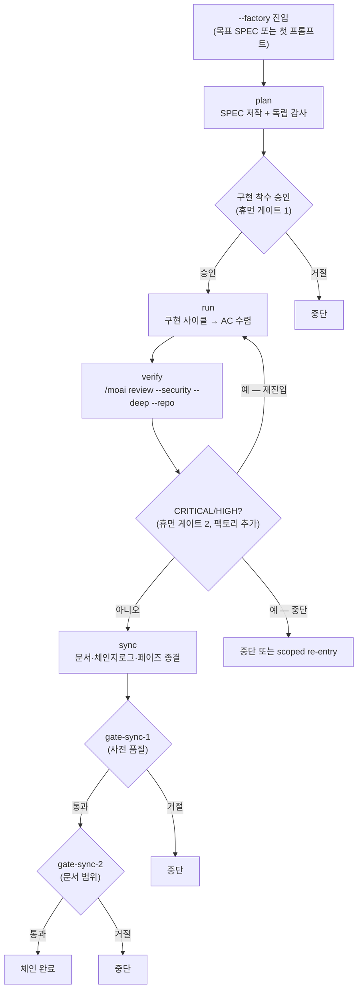



# 팩토리 모드 (Factory Mode)


 <strong>소속 가치</strong>: 에이전틱 루프 엔지니어링 · 에이전틱 하네스

<!-- @value: self-learning, agentic-harness -->

세션 런처에 `--factory` (또는 `-f`) 스위치를 붙여 `plan → run → verify → sync` 체인을 한 번에 굴리는 **진입 스위치**입니다. 새 하위 명령도, 새 런타임도, 새 데몬도 아니며 — `/moai goal`의 무한 지속 루프 위에 짜인 한 번의 체인입니다. 팩토리 모드로 진입하면 오케스트레이터가 사용자 개입 없이 SPEC 한 건을 계획부터 종료까지 끝까지 몰아갑니다.


**슬래시 커맨드가 아닙니다**: 팩토리 모드는 Claude Code 대화창의 `/` 명령이 아니라 세션 자체를 여는 스위치입니다. 터미널에서 `claude --factory` (또는 `moai cc --factory`)로 세션을 시작할 때 씁니다. 대화창 안에서는 켜거나 끌 수 없습니다.


## 이 페이지가 다루는 것

팩토리 모드는 **`full-pipeline` 계약을 확장**하는 진입 계약입니다. 원래 `full-pipeline`은 run→sync 자동 체인과 sync 내부 게이트를 그대로 보존합니다. 팩토리 모드는 여기에 정확히 두 가지를 더 얹습니다.

1. **plan-phase 체인 머리** — 체인이 명시적 페이즈 호출이 아니라 plan에서 시작합니다.
2. **verify 출입 게이트** — run-phase 출구에 자동 보안 검토(`/moai review --security --deep --repo`)를 배치합니다.

그 외 모든 페이즈 체이닝 규칙은 상속된 그대로입니다. 두 번째 체이닝 메커니즘이 따로 있지 않습니다.

## 왜 필요한가

SPEC 한 건을 끝까지 밀고 나가려면, 사용자는 보통 페이즈마다 명령을 넣어 줘야 합니다 — `/moai plan` → `/moai run` → `/moai sync`. 그 사이사이에 감사 게이트와 휴먼 게이트가 있지만, 페이즈를 이어 붙이는 것은 사용자의 손입니다.

팩토리 모드는 이 "이어 붙이기"를 자동화합니다. 조건이 다 채워질 때까지 턴을 잇는 `/moai goal`의 무한 지속 루프를 `plan → run → verify → sync` 전체에 걸고, 페이즈가 자연스럽게 다음 페이즈로 넘어가게 둡니다. 그래서 한 번 진입하면 사용자는 4개의 휴먼 게이트에서만 결정을 내리고, 나머지는 세션이 알아서 굴러갑니다.

다만 **혼자 다 하는 것은 아닙니다**. 팩토리 모드는 "페이즈를 이어 붙이는 것"을 자동화할 뿐, 휴먼 게이트를 건너뛰지 않습니다. 구현 착수 승인, verify 결과에 대한 결정, sync 게이트 두 개 — 이 네 결정은 여전히 사용자 고유 권한입니다.

## 진입 방법

터미널에서 세션 런처에 `--factory` (짧게 `-f`)를 붙여 시작합니다. SPEC 식별자를 함께 주면 그 SPEC을 목표로, 빠뜨리면 첫 프롬프트에서 plan-phase를 시작합니다.

```bash
# SPEC을 목표로 팩토리 체인 진입
$ claude --factory SPEC-AUTH-001

# 짧은 형태
$ claude -f SPEC-AUTH-001

# 목표 SPEC 없이 — 첫 프롬프트에서 plan 시작
$ claude --factory

# moai cc 런처로 같은 진입
$ moai cc --factory SPEC-AUTH-001
```

대화창 안에서는 진입할 수 없습니다. 팩토리 모드는 세션 자체의 성질이지, 대화 중에 켜는 토글이 아닙니다.

## 네 단계 체인



| 단계 | 무엇이 도는가 | 비고 |
|------|---------------|------|
| **plan** | SPEC 저작과 독립 plan 감사 | 체인의 머리. 감사 게이트는 그대로 |
| **run** | 설정된 구현 사이클이 수용 기준(AC) 수렴까지 | 그대로 |
| **verify** | `/moai review --security --deep --repo` | run-phase의 출입 게이트. sync의 단계가 아님 |
| **sync** | 문서, 체인지로그, 페이즈 종결 | 상속된 자동 체인으로 진입 |

## 네 개의 휴먼 게이트

팩토리 체인을 따라 네 개의 휴먼 게이트가 발화합니다. 정확히 하나가 이 계약으로 추가됐고, 나머지 셋은 상속입니다. 다섯 번째 게이트는 없습니다.

| # | 게이트 | 출처 | 경계 |
|---|--------|------|------|
| 1 | 구현 착수 승인 | 상속 (plan→run) | 체인은 이 게이트가 열리기 전에 run-phase에 들지 않는다. goal 프리셋은 이후에, 그것이 모는 일과 함께 무장 |
| 2 | verify CRITICAL/HIGH 결정 | **이 계약이 추가** | run 출입 게이트에서 오케스트레이터가 묻는 `AskUserQuestion`. 팩토리 모드가 도입하는 유일한 휴먼 게이트 |
| 3 | `gate-sync-1` (사전 품질) | 상속 | sync 페이즈 안에서 변경 없이 발화 |
| 4 | `gate-sync-2` (문서 범위) | 상속 | sync 페이즈 안에서 변경 없이 발화 |

네 게이트 모두 오케스트레이터가 묻는 질문 라운드(`AskUserQuestion`)이지, Stop-훅 블록이 아닙니다. 이 구분은 블록 상한 메모와 관련이 있습니다 — 상한을 올리는 것이 어떤 게이트도 건너뛰지 않습니다.

## `factory_chain` 골 프리셋

체인은 `factory_chain`이라는 이름의 골 프리셋으로 굴러갑니다. 매 턴 끝마다 기존 `stop-goal` Stop-훅 평가기가 평가합니다. 새 런타임, 새 훅, 새 평가기는 하나도 들어가지 않습니다 — 이미 있는 기계 위에 조건 하나를 얹은 것뿐입니다.

### 조건의 형태

조건은 **전적으로 모델 조건**으로 짜입니다. 매 술어는 오케스트레이터가 대화에 드러내는 줄을 가리킵니다. 평가기가 파일을 여는 대신, 대화 기록을 판정합니다. 따라서 조건에 들어가는 각 문장은 "오케스트레이터가 무엇을 대화에 썼는가"를 이름 붙입니다 — 감사 평정 줄, AC별 PASS 줄, verify 결과의 심각도 케이스와 런그, 종결 기록.

```text
The plan-phase artifacts for the targeted SPEC are surfaced as authored and
the plan audit verdict is surfaced as PASS; AND every blocking acceptance
criterion has its PASS evidence surfaced in the conversation; AND the verify
stage is surfaced as having produced a readable result, with its severity case
(S1 / S2 / S3) and its rung stated in the transcript; AND the sync phase is
surfaced as closed, with the SPEC status transition recorded. All of these
hold — that is the end state.
```

각 문장은 오케스트레이터가 일하면서 대화에 쓰는 무언가를 가리킵니다. 파일 경로를 열어봐야 하는 술어였다면 모델 조건이 아니었을 것이고, 조용히 수렴하지 못했을 것입니다.

### 무장 규칙

- **게이트 1 통과 후에만 무장.** 사용자 선호가 모두 빠지는 자리는 plan→run 게이트입니다. 체인은 그 이후에는 선호를 물어볼 방법이 없습니다.
- **일과 함께 무장, 일 대신이 아니라.** arm-only라 조건만 등록하고 아무것도 시작하지 않습니다. 그래서 오케스트레이터는 프리셋이 모는 페이즈를 시작하는 같은 턴에 프리셋을 무장합니다.
- **산문이 아니라 플래그로 묶는다.** `--max-turns 0 --max-duration 14400` — 무한 턴, 4시간 벽시계. 조건 문장에 산문으로 "20턴 뒤 멈춰"를 써 넣어도 평가기가 파싱하지 않으므로, 믿었던 상한이 작동하지 않습니다.
- **수용된 위험.** 무인 팩토리 run은 벽시계 상한이 발화하기 전 최대 4시간의 토큰을 소모할 수 있습니다. 합법적으로 많은 턴이 필요한 체인이 중간에 잘리지 않도록 의도된 트레이드오프입니다. 원하지 않으면 이 상한으로 무장하지 마세요.

## 종료와 우회

체인은 다음 가운데 하나가 처음 올 때 끝납니다. 다섯 번째 출구는 없습니다.

- **조건이 성립** — 체인 완료.
- **4시간 벽시계 상한** — `--max-duration 14400` 발화.
- **정체 가드** — 골 엔진이 N번 연속 진전 없음을 잡아 멈춤.
- **휴먼 게이트 거절** — 네 게이트 어느 하나에서 거절.

### 벽시계 상한과 블록 상한

`--max-turns 0`으로 턴을 무한으로 풀어도, Claude Code 런타임의 연속 블록 상한(`CLAUDE_CODE_STOP_HOOK_BLOCK_CAP`, 기본 8)이 먼저 루프를 끊어 버립니다. 팩토리 모드 진입 시 런처는 이 상한을 자동으로 200으로 올입니다 (`SPEC-INFINITE-GOAL-001`의 두 번째 트리거). 그래서 사용자가 직접 환경변수를 건드리지 않아도 체인이 중간에 끊기지 않습니다.

### 백엔드 제외

팩토리 모드는 혼합 백엔드 런처(`moai cg`)에서 거부됩니다. 센티넬 `FACTORY_MODE_UNSUPPORTED_BACKEND`와 함께 세션은 열리지 않습니다. `moai cg`는 한 백엔드에서 리더를, 다른 백엔드에서 팀원을 굴리는데, 이는 체인이 전제하는 "한 세션 / 한 백엔드 / 한 체인"에 모순입니다 — verify 단계가 어느 백엔드에서 돌았는지 결정할 수 없게 됩니다. 거부는 의도적이며, 적응해서 우회할 빈틈이 아닙니다.

## 상태 레코드

팩토리 세션은 `.moai/state/factory/` 아래 세션 키 단위로 레코드를 하나씩 가집니다. 현재 페이즈, 무장된 골 상태, 게이트 통과 여부가 기록되며, 세션 재개 시 이 레코드를 읽어 중단된 지점을 이어 붙입니다.

## 언제 쓰나, 언제 쓰지 않나

**쓸 때**:

- 한 SPEC을 종료까지 한 번에 밀고 갈 때. 휴먼 게이트 네 개에서만 결정하면 된다.
- 벽시계 상한 안에서 끝날 것이라는 합리는 전제가 있을 때. (4시간)
- 단일 백엔드에서 작업할 때. (`moai cg` 혼합 백엔드는 거부됨)

**쓰지 않을 때**:

- 페이즈 사이마다 사람이 직접 판단하며 중간 산출물을 검토하고 싶을 때. 이 경우 일반 `plan → run → sync`를 턴 단위로 진행하세요.
- 혼합 백엔드(`moai cg`)를 써야 할 때. 팩토리 모드는 거부됩니다.
- 짧은 작업. 한두 턴으로 끝나는 일에 4시간 상한의 무한 루프를 무장하는 것은 과합니다.

## 이 페이지가 하지 않는 것 (범위 경계)

- **새 하위 명령이 아닙니다** — `--factory`는 런처 스위치이지, `/moai factory` 같은 대화 명령이 아닙니다.
- **새 런타임이 아닙니다** — `stop-goal` 평가기, `full-pipeline` 체이닝, 네 휴먼 게이트 모두 기존 기계를 그대로 씁니다.
- **휴먼 게이트를 건너뛰지 않습니다** — 네 게이트는 변경 없이 발화합니다. 블록 상한을 올리는 것이 게이트를 넘지 않습니다.
- **혼합 백엔드에서 동작하지 않습니다** — `moai cg` 런처에서 거부됩니다.

## 관련 문서

- [`/moai goal`](/ko/workflow-commands/moai-goal) — 팩토리 체인을 모는 `factory_chain` 프리셋이 올라타는 골 엔진
- [자율 연속 루프](/ko/advanced/autonomous-loops) — `/moai goal`, `/moai loop`, 네이티브 `/goal`의 소유권과 가드레일 비교
- [`/moai run`](/ko/workflow-commands/moai-run) — run-phase 자율성 배선 (`ac_converge`), 팩토리 체인의 run 단계가 상속하는 그것
- [하네스 엔지니어링](/ko/core-concepts/harness-engineering) — 페이즈 체이닝과 관찰이 하네스 설계 위에서 어떻게 자리잡았는가
