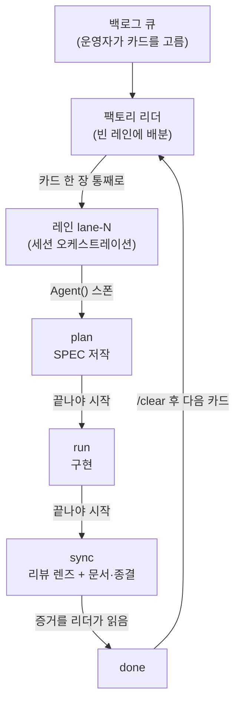



# 팩토리 모드 (Factory Mode)


 <strong>소속 가치</strong>: 다중 세션 오케스트레이션 · 토크노믹스


팩토리 모드는 **리더** 세션 하나와 번호 붙은 **레인** 세션 여럿으로 카드 여러 장을 동시에 나르는 조립라인입니다. 카드는 칸을 옮겨 다니지 않습니다. 빈 레인 하나에 **통째로** 들어가고, 그 레인이 세션 안에서 `plan → run → sync`를 순서대로 끝까지 책임집니다.

진입 토큰은 둘뿐이고, 둘 다 인자를 받지 않습니다. `-f`가 리더를 열고, `-l`이 레인으로 합류합니다. 이 토큰들은 세션을 시작하거나 합류시킬 뿐입니다. 파이프라인을 돌리지 않고, 목표를 걸지 않고, SPEC을 고르지도 않습니다.

## 진입 형태

| 하려는 일 | 명령 | 역할 |
|-----------|------|------|
| 팩토리 리더 열기 | `moai cc -f` · `moai glm -f` (긴 형태 `--factory`) | 리더 |
| 실행 중인 팩토리에 레인으로 합류 | `moai cc -l` · `moai glm -l` · `moai codex -l` (긴 형태 `--lane`) | 레인 |

- `-l`은 실행 중인 팩토리에 합류해 **다음 레인 번호를 자동으로** 받습니다. 번호는 운영자가 고르지 않으며, 살아 있는 레인 가운데 가장 큰 번호의 다음 번호가 배정됩니다. 실행 중인 팩토리가 없으면 합류는 거부됩니다.
- `moai codex`에는 리더 진입이 없습니다. 레인으로만 합류할 수 있으며, 리더는 `moai cc -f` 또는 `moai glm -f`로 엽니다.
- 한 번의 실행에는 진입 토큰이 하나만 붙습니다. `-f`와 `-l`을 함께 쓰면 오류입니다.

```bash
# 리더: 팩토리 리더를 엽니다
$ moai cc -f

# 레인: 각자 자기 터미널에서. 다음 번호(lane-1, lane-2, ...)로 합류합니다
$ moai cc -l
$ moai cc -l
$ moai glm -l      # GLM 백엔드 레인도 같은 형태
$ moai codex -l    # Codex 레인
```

레인은 **사람이 별도 터미널에서 직접** 띄웁니다. 세션이 다른 세션을 대신 띄우는 경로는 없습니다.

### 거부되는 형태

값이 붙은 진입은 한 줄 오류로 거부됩니다. 오류 문구는 올바른 형태를 이름 붙여 알려 줍니다.

| 거부되는 형태 | 이유 |
|---------------|------|
| `moai cc -f <값>` (SPEC ID, 숫자, 레인 라벨) | `-f`는 인자를 받지 않습니다. 리더는 `-f`만으로 열고, 레인은 `-l`로 합류합니다 |
| `moai cc -l <값>` (`lane-2` 같은 이름) | 레인은 스스로 이름을 고르지 않습니다. 번호는 자동 배정입니다 |
| `moai codex`의 `-f` | Codex에는 리더 진입이 없습니다 (`moai cc -f`나 `moai glm -f` 사용) |
| `-f`와 `-l`을 한 번에 | 진입 토큰은 하나만 허용됩니다 |
| 폐기된 `-k` 진입 | 예전 다중 세션 보드 모드는 제거되었습니다. 오류 문구가 `-f`와 `-l`을 안내합니다 |
| `moai cg`, `moai gpt` | `moai cg`는 폐기되었고 이전 안내와 함께 종료합니다 (`moai migrate cg`로 미리보기). `moai gpt`는 없으며 GPT 모델은 `moai codex`로 돌립니다 |

## 실행이 여럿 살아 있을 때

레인 합류는 먼저 실행 기록을 읽습니다. 두 가지 선택자를 `-l`과 함께 쓸 수 있습니다.

| 선택자 | 역할 |
|--------|------|
| `--leader <이름>` | 합류할 리더 세션을 지정합니다 (기본값 `leader`). `-l` 또는 `--lane`과만 함께 쓰며, 진입 토큰의 짧은 형태가 아닙니다 |
| `--factory-run <run-id>` | 합류할 실행을 id로 지정합니다 |

`--leader`와 `--factory-run`은 서로 다른 선택자라 함께 쓸 수 없습니다. 살아 있는 실행이 둘 이상이어서 어디에 합류할지 정할 수 없으면 합류는 거부되고, 오류가 `-l`과 함께 `--factory-run <run-id>`나 `--leader <리더 이름>` 중 하나를 고르라고 안내합니다. 죽은 소유자의 실행은 `moai factory runs --retire <run-id>`로 은퇴시킬 수 있습니다.

**실행 기록이 없어도 리더가 살아 있으면 합류합니다.** 활성 기록이 하나도 없을 때(기록이 자동 은퇴했거나 리더가 기록하지 않은 경우) 합류는 곧바로 거부로 끝나지 않습니다. 이 프로젝트의 살아 있는 리더 세션을 pid와 프로세스 시작 지문으로 검증하고, 그 리더의 신원으로 실행 기록을 복원한 뒤 평범한 게이트로 합류합니다. 검증된 리더가 둘 이상이면 후보를 모두 이름 붙여 실패로 닫고, 없으면 거부가 그대로 섭니다.

## 레인 옵션

다음 옵션은 `moai cc -l`과 `moai glm -l`에서 레인에만 붙습니다. Codex 레인은 정책을 받지 않습니다.

| 옵션 | 효과 |
|------|------|
| `--clear-policy <값>` | 카드를 끝낸 뒤 레인이 컨텍스트를 어떻게 비울지 정합니다. `clear-each`(기본값, 카드마다 `/clear`를 요청), `clear-when-full`(컨텍스트 사용량이 모델별 인수인계 임계치에 닿을 때만 요청), `relaunch`(세션 종료를 요청하고 감독 런처가 다음 카드용 새 세션을 띄움) |
| `--no-auto-dispatch` | 레인을 수동 모드로 띄웁니다. 기본은 **자가 배차** 레인으로, 리더의 배분을 기다리지 않고 `moai factory next`로 큐의 다음 카드를 스스로 임대합니다. 이 옵션을 주면 리더가 보낸 카드만 받습니다 |

## 카드가 흐르는 모양

리더가 하는 일은 **이미 선택된 카드를 빈 레인에 배분**하는 것입니다. 빈 레인이란 이전 카드가 `done`에 닿고 그 증거를 리더가 읽었다는 뜻입니다. 모든 레인이 바쁘면 카드는 배분되지 않고 큐에서 기다립니다.

카드를 고르는 주체는 운영자입니다. 직접 고를 때는 `moai todo next <n>`을 쓰고, 미리 맡길 때는 `/moai:todo --auto`를 입력합니다. 이 호출이 곧 승인이어서, 호출받은 세션이 자기 판단으로 카드를 가져갑니다. 레인 세션은 팩토리 임대(`moai factory next --card <id>`)로만 가져가고 운영자가 보류하거나 보류 표시를 붙인 카드는 건드리지 않으며, 운영자 세션의 직렬 사이클은 보류 표시가 붙은 카드를 제외하지 않고 맨 뒤로 순위만 낮춥니다. 카드를 큐에 들이는 일은 어느 쪽이든 운영자 몫입니다. 리더가 큐를 훑어 임의로 카드를 줄 세우지 않습니다. 자가 배차 레인은 이 규칙을 바꾸지 않습니다. 레인이 큐에서 하는 일은 이미 큐에 올라 있는 다음 카드를 `moai factory next`로 임대하는 것뿐이고, 카드를 만들거나 지우거나 고치는 큐 변경은 레인에게 금지되어 있습니다.

배차 블록은 `card`, `cmd`, `wt`, `evidence` 필드로 이뤄진 고정 형식이며 10줄을 넘지 않습니다. `cmd`는 카드 클래스가 정하는 진입 단계를 가리킵니다. 설계 변경(클래스 C)은 `/moai plan`, 원인 미확인 결함(클래스 B)은 `/moai run`, 한 줄짜리 잔일(클래스 A)은 바로 닫기입니다. 레인은 남은 단계를 추가 배차 없이 스스로 진행합니다.

## 레인 안에서 세 단계가 도는 방식

레인 하나가 카드 한 장을 지나가는 방식은 세 문장으로 정리됩니다. **plan이 끝나야 run이 시작되고, run이 끝나야 sync가 시작됩니다.** 레인은 같은 카드의 두 단계를 동시에 돌리지 않습니다. 각 단계의 실행은 레인이 `Agent()` 하위 에이전트로 스폰하고, 레인 자신은 오케스트레이션만 합니다. 하위 에이전트의 출력은 그 에이전트의 창에 머무르고, 레인은 그들이 남긴 증거를 읽어 결과를 합칩니다.


```mermaid
flowchart TD
    Queue["백로그 큐<br/>(운영자가 카드를 고름)"] --> Lead["팩토리 리더<br/>(빈 레인에 배분)"]
    Lead -->|"카드 한 장 통째로"| Lane["레인 lane-N<br/>(세션 오케스트레이션)"]
    Lane -->|"Agent() 스폰"| Plan["plan<br/>SPEC 저작"]
    Plan -->|"끝나야 시작"| Run["run<br/>구현"]
    Run -->|"끝나야 시작"| Sync["sync<br/>리뷰 렌즈 + 문서·종결"]
    Sync -->|"증거를 리더가 읽음"| Done["done"]
    Done -->|"/clear 후 다음 카드"| Lead
```

카드 클래스는 레인이 건너뛰는 의식만 이름 붙입니다. 클래스 B는 `plan` 없이 진행되므로 SPEC이 없고, 클래스 A는 바로 닫기로 갑니다. 어느 카드도 세션을 갈아타지 않으며, 모든 레인은 자기 카드에 남은 단계를 직렬로 수행합니다. 단계가 진행되는 동안에도 구현 착수 승인 같은 휴먼 게이트는 그대로 발화합니다.

레인은 `run`을 마치고 통합하기 전에 `card-review` 단계를 하나 더 거칩니다. 카드 범위의 자체 리뷰이며, 결과는 `.moai/reports/<card-id>/card-review.md`에 남습니다. 참고용 신호일 뿐 리더의 증거 판독이나 독립 감사를 대신하지 않습니다.

## 병렬의 상한과 격리

레인은 각각 **최대 10개의 에이전트를 동시에** 실행할 수 있습니다. 런처가 레인 세션에 `CLAUDE_CODE_MAX_CONCURRENT_SUBAGENTS=10`을 심어 두므로(이미 값이 있으면 건드리지 않습니다), 레인 N개가 동시에 팬아웃을 돌려도 머신 용량은 운영자의 절제가 아니라 설정으로 나뉩니다.

병렬에는 두 축이 있고 서로 섞지 않습니다.

- **카드 사이 (팬아웃)**: 카드마다 레인을 붙여 여러 장을 동시에 밀 수 있습니다. 레인은 각자 자기 카드 디렉터리(`.moai/specs/<SPEC-ID>/`)에만 쓰므로 병렬 쓰기가 충돌하지 않습니다.
- **카드 안 (스테이지)**: 한 카드의 단계는 직렬입니다. 같은 카드에 쓰기 에이전트 둘을 병렬로 붙이지 않습니다. 한 카드, 한 번에 한 명의 쓰기입니다.

쓰기를 맡는 하위 에이전트를 병렬로 스폰할 때는 반드시 워크트리 격리(`isolation: "worktree"`)를 붙입니다. 각 쓰기 에이전트가 자기 워크트리 사본에서 일하므로 카드 디렉터리 밖에서도 파일 쓰기가 충돌하지 않고, 레인은 증거와 머지로 통합합니다. 읽기 전용 조사·감사 팬아웃은 격리하지 않습니다. 워크트리를 만드는 비용에 비해 얻는 것이 없기 때문입니다.

레인은 한꺼번에 켜지 마세요. 첫 레인을 먼저 올리고, 실제 출력이 나오기 시작한 것을 확인한 뒤 나머지를 띄웁니다. 동시 요청은 아직 기록 중인 캐시 항목을 읽지 못해서, 동시 기동은 캐시 효율을 깨뜨립니다.

## 레인 번호와 실행 기록

어느 번호를 어느 레인이 쥐고 있는지는 `~/.moai/db/<project-key>/factory/factory.db`에 기록됩니다. 새 레인은 살아 있는 레인 가운데 **가장 큰 번호의 다음 번호**를 받으며, 중간의 빈 번호를 채우지는 않습니다. 살아 있는 레인이 lane-1과 lane-3이면 새 레인은 lane-4입니다. 죽은 레인의 claim은 더 이상 번호를 막지 않습니다. 레인 번호는 자동 배정이므로 `--name`/`-n`을 함께 쓰면 오류입니다.

리더의 소켓은 `/tmp/moai-socket-factory/<run-id>`에 열리고, 부트스트랩 안내가 실제 경로를 알려 줍니다. 리더와 레인 세션은 시작할 때 `.moai/state/todo/<session-id>.json`에 역할·백엔드·진입 시각이 담긴 세션 레코드를 한 번 남깁니다.

팩토리 세션은 시작할 때 연속 Stop 훅 차단 상한을 `CLAUDE_CODE_STOP_HOOK_BLOCK_CAP=200`으로 올립니다. 이는 무인 실행을 길게 허용하는 설정이지 게이트를 건너뛰는 장치가 아닙니다. 사람의 승인 게이트는 Stop 훅 차단이 아니라 오케스트레이터가 묻는 질문이기 때문입니다.

## 달라지지 않는 것

- **위임 채널은 디스크의 큐입니다.** 배차는 포인터이지 복사물이 아니고, 메시지는 재촉일 뿐 위임 자체가 아닙니다.
- **완료는 읽은 증거로만 판정합니다.** 레인이 답장했는지가 아니라 진행 기록을 읽었는지로 카드를 넘깁니다. 최종 PASS/FAIL 판정은 언제나 리더의 몫이며, 일을 만든 레인이 자기 출력을 심사하는 모양은 허용되지 않습니다.
- **`/clear` 경계는 카드 사이입니다.** 카드가 `done`에 닿으면 다음 카드를 받기 전에 그 레인을 `/clear`합니다(`--clear-policy`로 바꿀 수 있습니다).
- **카드 worktree는 원격 머지가 끝날 때까지 폐기하지 않습니다.** 브랜치가 아직 머지되지 않았다면 워크트리가 그 작업의 유일한 사본입니다.
- **카드 하나, 워크트리 하나.** 새 카드는 새 워크트리에서 시작하며, 레인 세션은 자기 카드의 워크트리 안에서 시작해 그 안에 머뭅니다.

## 관련 문서

- [세션 계보 체인](/ko/advanced/origin-trail-chain) — worktree 세션의 계보를 기록하고 `moai chain`으로 조회하는 방법
- [`/moai todo`](/ko/utility-commands/moai-todo) — 카드를 큐에 들이는 백로그 대기열. 카드를 고르는 주체는 운영자
- [manager-lead 리더 코디네이터](/ko/advanced/manager-lead) — 팩토리 리더 세션이 배차를 맡는 조율 에이전트
- [`/moai loop`](/ko/utility-commands/moai-loop) — bare `/loop`로 구동하는 무인 포어맨. 팩토리 리더와 같은 "고르지 않고 나르기만" 경계
- [moai cc / glm 런처](/ko/cli-reference/launchers) — `-f`·`-l`을 포함한 런처 플래그 전체
