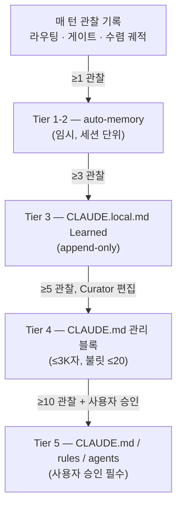
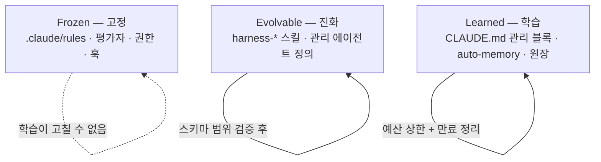



하네스(에이전트를 둘러싼 품질 검증 자동 장치) 가 세션을 거듭하면서 좋아지는 일은 모델 가중치가 아니라 하네스 코드와 지침이 바뀌기 때문에 일어납니다. 이 페이지는 그 가운데 사용자가 직접 관찰하고 승인하는 접점인 **학습 표면** (learning surface, 하네스가 쌓은 관찰을 규칙으로 바꿔 보여주는 사용자 접면) 을 정리합니다. 파이프라인 내부 구조(ACE 역할 모델, 3-Loop, 승격 엔진)는 [하네스 자가 진화](/ko/advanced/self-evolving/) 페이지에 별도로 두었고, 여기서는 "무엇이 관찰로 쌓이고, 어디까지 자동으로 바뀌고, 어디서 사용자가 개입하는가"만 다룹니다.

## 학습 표면이란 무엇인가

학습 표면은 하네스가 매 턴 자동으로 남기는 **관찰** (observation, 라우팅 결정·게이트 증거·수렴 궤적을 프라이버시 보존 다이제스트로 기록한 줄) 에서 시작해, 그 관찰이 모여 **패턴**이 되고, 다시 **지침**으로 승격되어 사용자에게 보이는 파일까지 오는 길 전체를 가리킵니다. 사용자가 직접 만지는 표면은 세 개뿐입니다 — 임시로 쌓이는 auto-memory(세션 단위 메모리), 프로젝트에 남는 CLAUDE.local.md(로컬 개발 안내서) 의 Learned 섹션, 그리고 팀 전체가 따르는 CLAUDE.md(프로젝트 지침 파일) 의 관리 블록입니다. 이 세 표면 위로 관찰이 올라오고, 사용자는 그 가운데 어떤 것을 규칙으로 받아들일지 결정합니다.

이 접면이 중요한 까닭은, 하네스의 자기 개선이 결국 "사용자가 검토할 수 있는 파일" 위에서만 일어나야 하기 때문입니다. 보이지 않는 곳에서 지침이 바뀌면 디버깅을 할 수 없고, 어제까지 통하던 루틴이 조용히 바뀌어 원인을 찾기 어려워집니다. 그래서 MoAI-ADK는 승격이 일어나는 표면을 세 개로 고정하고, 각 표면이 언제 어떻게 쓰이는지를 기계적으로 가릅니다. SPEC(요구사항 명세서) 워크플로우가 아무리 깊어도, 학습 결과는 항상 이 세 파일 안에 보입니다.

## 관찰이 규칙이 되는 길

관찰 한 줄이 사용자가 읽을 수 있는 규칙이 되기까지는 빈도에 따른 네 단계의 사다리를 밟습니다. 한두 번 관찰된 일은 임시 메모리에만 남고 사라지고, 같은 패턴이 반복되어 임계값에 닿으면 비로소 더 오래 남는 표면으로 올라갑니다.

이 사다리의 핵심은 **임계값**입니다. 한 번 관찰된 일은 예외일 수 있지만, 다섯 번 반복된 패턴은 규칙입니다. 그래서 낮은 티어에서는 임시 메모리에만 두어 노이즈를 흡수하고, 임계값을 넘은 관찰만 더 오래 남는 표면으로 올립니다. 사용자가 체감하는 변화는 대부분 Tier 3와 Tier 4에서 일어납니다 — 어느 날 CLAUDE.local.md의 Learned 섹션에 새 줄이 하나 추가되어 있고, 패턴이 굳어지면 CLAUDE.md의 관리 블록에 불릿 하나가 올라옵니다.

| 티어 | 임계값 | 도달하는 표면 | 누가 쓰는가 |
|------|--------|---------------|-------------|
| Tier 1-2 | ≥1 관찰 | auto-memory (임시) | 자동 |
| Tier 3 | ≥3 관찰 | CLAUDE.local.md (append-only) | 자동 |
| Tier 4 | ≥5 관찰 | CLAUDE.md 관리 블록 (≤3K자, 불릿 ≤20) | Curator |
| Tier 5 | ≥10 관찰 + 사용자 승인 | CLAUDE.md / rules / agents | 사용자 승인 필수 |

관리 블록에는 글자 수와 불릿 수 상한이 있습니다. 이 상한은 하네스가 학습을 핑계로 지침을 무한정 부풀리는 일을 막기 위한 것입니다 — 매 세션 시작마다 읽어야 하는 파일이 커지면 프롬프트 캐시 적중이 깨지고, 결국 비용과 응답 시간이 모두 올라갑니다. Curator(지침을 갱신하는 역할) 는 이 상한 안에서, 기존 불릿을 통째로 다시 쓰는 것이 아니라 불릿 단위로만 더하거나 뺍니다.

## 3-Zone 편집 표면

하네스가 자기 성적표를 고칠 수 없도록, 편집 가능한 표면을 세 Zone으로 엄격히 나눕니다. 이 구분은 학습 루프가 보상 해킹(reward hacking, 자신이 받을 점수를 올리려고 평가 기준을 고치는 일) 에 빠지는 것을 막는 가장 중요한 안전장치입니다.

 **Frozen Zone은 하네스의 울타리입니다.** SPEC 워크플로우를 판정하는 평가자와, 권한 모드·훅 등록·frozen-guard 자체가 모두 여기에 들어갑니다. 학습 루프는 제 권한이나 제 안전장치를 제안 대상으로 삼을 수 없습니다 — 이 제약이 깨지면 하네스가 자기 결점을 덮는 길이 열립니다.

Evolvable Zone은 하네스 자체의 정의(사용자 정의 스킬, 관리자 에이전트 정의, 자동 감지 블록) 가 사는 곳입니다. 이 표면은 바꿀 수 있지만, 스키마 범위 검증(미리 정해둔 형식 안에서만 변경 허용) 과 회귀 테스트를 거칩니다. Learned Zone은 학습 결과가 쌓이는 곳으로, 예산 상한(글자 수·불릿 수) 과 만료 정리(stale pruning, 오래된 항목을 자르는 일) 가 적용됩니다. 사용자 관점에서 보면, 세 Zone 가운데 일상적으로 열어보게 되는 것은 Learned Zone 하나뿐이고, 나머지 둘은 "손대지 말아야 할/제한적으로만 바뀌는 영역"으로 두면 됩니다.

## 사용자 승인 게이트

Tier 5, 즉 CLAUDE.md의 규칙이나 `.claude/rules/` · 에이전트 정의를 건드리는 변경은 **사용자 승인 없이는 결코 적용되지 않습니다.** 하네스는 승격 제안(proposal) 을 만들어 사용자에게 보여줄 수 있지만, 그 제안을 실제 파일에 쓰는 주체는 사용자입니다. 이 게이트는 학습이 "관찰 → 패턴 → 규칙"까지는 자동화하되, "규칙 → 프로젝트 지침"의 마지막 한 단계는 항상 사람이 결정하도록 가두어 둡니다.

 제안이 거부되거나 롤백되면, 그 패턴 키는 **부정 증거** (negative evidence, "이 제안은 받아들여지지 않았다"는 기록) 로 원장에 남습니다. 덕분에 같은 제안이 되돌아와 다시 사용자를 괴롭히는 일을 막을 수 있습니다 — 한 번 "아니오"라고 한 제안은 임계값이 다시 채워지지 않는 한 재차 올라오지 않습니다.

이 설계는 "자동화"와 "통제"를 분리합니다. 하네스는 관찰을 모으고 패턴을 인식하고 제안을 조립하는 일까지 자동으로 하되, 제안을 규칙으로 확정하는 마지막 클릭은 사용자에게 남겨 둡니다. 그래서 학습이 빠르면서도, 방향을 잃지 않습니다.

## 자가 진화 파이프라인과의 관계

이 페이지가 다루는 학습 표면은 "사용자가 보고 만지는 접면"에 한정합니다. 그 아래에서 관찰을 수집하고 패턴을 뽑아내고 승격 제안을 조립하는 내부 파이프라인 — ACE 역할 모델(Generator → Reflector → Curator), 3-Loop 구조(관찰 → 반추 → 승격), GLM observe-only 정책 — 은 [하네스 자가 진화](/ko/advanced/self-evolving/) 페이지에 정리되어 있습니다. 두 페이지를 나눈 까닭은, 일상적으로 하네스를 쓰는 사용자에게 필요한 것은 "어떤 파일을 열면 학습 결과가 보이는가, 어디까지 자동인가"이지, 내부 루프의 동작 원리가 아니기 때문입니다. 내부 구조가 궁금한 사용자는 self-evolving 페이지로, "오늘 제 CLAUDE.md에 왜 새 불릿이 생겼는지"가 궁금한 사용자는 이 페이지를 읽으면 됩니다.

## 다음 단계

- [하네스 자가 진화](/ko/advanced/self-evolving/) — 학습 표면 아래에서 관찰을 승격 제안으로 조립하는 내부 파이프라인
- [의사결정 메모리](/ko/advanced/decision-memory/) — 학습 결과가 프로젝트 의사결정과 연결되는 지점
- [토크노믹스 개요](/ko/advanced/tokenomics-overview/) — 관리 블록의 크기 상한이 토큰 비용과 만나는 곳
