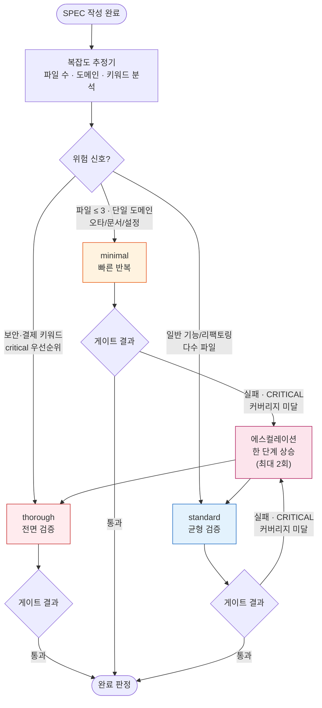
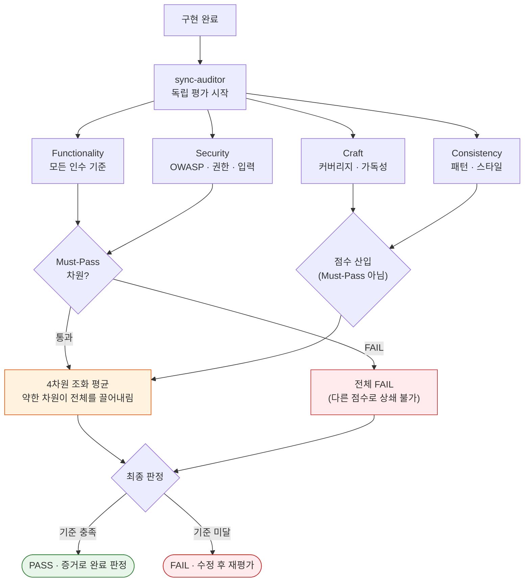

오타 한 줄을 고치는 데 전면 보안 감사를 돌리면 토큰이 새고, 반대로 결제 시스템을 손보는 데 가벼운 확인만 거치면 사고가 납니다. 모든 변경에 똑같은 깊이의 검증을 들이부으면 이 두 가지 실패 가운데 하나를 피하지 못합니다. 모아이 에이디케이(MoAI-ADK)가 푸는 문제는 바로 여기에 있습니다 — 변경의 무게에 맞춰 검증 깊이를 스스로 조절하고, 평가는 코드를 짠 쪽이 아니라 독립된 평가 에이전트에게 맡기는 것입니다.


**한 줄 요약:** 검증 깊이는 SPEC(요구사항 명세서)의 복잡도에 맞춰 자동으로 정해지고, 완료 판정은 "된 것 같다"가 아니라 독립 평가자의 점수와 근거로 내려집니다.


## 두 가지 생각이 하나로 맞물린다

하네스(harness, 품질 검증을 자동으로 수행하는 장치) 시스템은 서로 다른 두 생각이 맞물려 돌아갑니다. 하나는 **깊이의 적응**이고, 다른 하나는 **평가의 독립**입니다.

**깊이의 적응** — SPEC의 규모와 위험도를 보고 검증 단계의 깊이를 세 단계 가운데 하나로 고릅니다. 오타 수정에 전면 감사를 돌리지 않고, 결제 도메인을 손댈 때는 가벼운 확인으로 넘기지 않습니다. 작업에 딱 맞는 검증 강도를 시스템이 잡아 준 덕분에 사람이 매번 레벨을 고르는 수고가 사라지고, 검증 비용이 결과의 위험도에 비례합니다.

**평가의 독립** — 코드를 만든 에이전트(스스로 일하는 AI 도우미)가 자기 결과물에 점수를 매기면 점수는 늘 후해집니다. 그래서 평가는 별개의 에이전트인 sync-auditor가 맡고, 만든 쪽과 평가하는 쪽을 구조적으로 분리합니다. 계획을 짠 에이전트도, 구현한 에이전트도 평가에 손을 대지 못합니다.

## 3계층 하네스 레벨

검증 깊이는 세 단계로 나뉩니다. 각 레벨은 건너뛰는 단계, 평가자 참여, 게이트 엄격함이 다릅니다.

| 레벨 | 언제 쓰이는가 | 평가자 | 특징 |
|------|--------------|--------|------|
| **minimal** | 단순 변경 — 오타, 문서, 설정 수정, 파일 3개 이하 단일 도메인 | 생략 | 빠른 반복. 검증 단계 대부분을 건너뛴다 |
| **standard** | 일반 개발 — 신규 기능, 리팩토링, 다수 파일 | 최종 패스 1회 | 균형 잡힌 품질 확인. 대부분의 작업이 여기에 해당 |
| **thorough** | 위험 변경 — 보안·결제 키워드, 인증·이관·공개 API, critical 우선순위 | 스프린트별 반복 평가 | 전체 검증 + TRUST 5 게이트 + 크로스 검증 |

레벨은 SPEC의 범위를 읽고 **복잡도 추정기**(Complexity Estimator)가 자동으로 정합니다. 파일 수, 도메인 수, SPEC 유형, 그리고 보안·결제 키워드와 critical 우선순위를 조건으로 삼아 minimal·standard·thorough 가운데 하나를 고릅니다. 오타 수정에 thorough 검증을 돌리지 않는 것, 그 자체가 비용을 결과 위험도에 비례시키는 설계입니다.

레벨은 한 번 정해지면 끝까지 고정되는 것이 아닙니다. 검증 도중 품질 게이트가 실패하거나, 리뷰에서 CRITICAL 단계가 나오거나, 커버리지가 70% 아래로 떨어지면 한 단계 올라갑니다. 이 **에스컬레이션**은 최대 두 번까지 일어나며, 정해진 깊이로 시작했더라도 중간에 위험이 드러나면 더 깊은 검증으로 넘어가 "쉬운 변경"으로 분류됐던 작업이 빈틈을 남기지 않게 합니다.

한 가지 주의할 점이 있습니다. minimal 레벨은 검증 단계 대부분을 건너뛰지만 **계획 감사(plan-auditor) 게이트만큼은 예외 없이 켜져** 있습니다. 과거 minimal 레벨에서 계획 감사가 꺼져 있던 탓에 30개의 SPEC이 감사를 통과하지 못한 채로 만들어졌고, 386건의 교차 결함이 한꺼번에 터진 적이 있습니다. 이 사건 이후 계획 감사 게이트는 레벨과 상관없이 항상 동작하도록 전역으로 고정됐습니다 — 검증 깊이를 아끼되, 계획 자체가 검사받지 않는 일은 다시 일어나지 않습니다.

CG 모드(Claude 리더 + GLM 워커의 하이브리드 실행)에서는 레벨을 자동 감지와 상관없이 항상 thorough로 둡니다. 구현을 GLM 워커에게, 평가를 Claude 리더에게 맡기는 구조가 자연스럽게 생성자-판별자(Generator-Evaluator) 분리가 되기 때문입니다.

## 4차원 스코어링

독립 평가자인 sync-auditor는 결과물을 네 가지 차원으로 점검합니다. 각 차원은 저마다 묻는 질문이 다릅니다.

| 차원 | 묻는 질문 | 기본 가중치 | Must-Pass |
|------|----------|------------|-----------|
| **Functionality** (기능) | 의도한 목적을 달성했는가 — 모든 인수 기준이 통과했는가 | 40% |  예 |
| **Security** (보안) | 안전한가 — OWASP, 인증, 권한, 입력 검증에 구멍이 없는가 | 25% |  예 |
| **Craft** (장인정신) | 잘 만들었는가 — 가독성, 구조, 테스트 커버리지 | 20% |  아니오 |
| **Consistency** (일관성) | 프로젝트 규칙을 따랐는가 — 코드 스타일, 패턴 준수 | 15% |  아니오 |

### 조화 평균 — 약한 차원이 전체를 끌어내린다

네 차원의 점수를 합칠 때 모아이 에이디케이는 단순 평균이 아니라 **조화 평균**(harmonic mean)을 씁니다. 둘의 차이는 결과가 하나라도 바닥에 깔려 있을 때 극적으로 벌어집니다.

보안에서 0.25점을 받은 결과물이 기능에서 1.00점 만점을 받았다고 해보자. 단순 평균이라면 (1.00 + 0.25) / 2 = 0.625로 "그럭저럭" 넘길 수 있습니다. 하지만 조화 평균은 약한 쪽에 민감하게 반응합니다 — 한 차원이 바닥이면 다른 차원이 아무리 높아도 전체를 끌어올리지 못합니다. 이것이 의도하는 바는 분명합니다. 보안 구멍을 뛰어난 기능성으로 "상쇄"할 수 없다는 것입니다. 강한 차원과 약한 차원을 서로 더해 메우는 일을 구조적으로 막는 것입니다.

### Must-Pass 방화벽

조화 평균보다 더 강한 장치가 **Must-Pass 방화벽**입니다. Functionality와 Security는 Must-Pass 차원입니다 — 이 둘은 다른 차원의 점수로 메울 수 없습니다. Security에서 Critical이나 High 단계의 취약점이 하나라도 발견되면, Functionality와 Craft에서 만점을 받았더라도 전체 판정은 곧바로 FAIL이 됩니다. "보안은 구멍이 나 있지만 기능은 훌륭하니 통과"라는 타협이 구조적으로 불가능합니다.

Craft와 Consistency는 Must-Pass가 아닙니다. 이 둘은 전체 점수에 기여하고 품질 신호를 남기지만, 단독으로 통과를 가로막지는 않습니다 — 코드 품질과 일관성은 중요하지만 기능과 보안만큼 즉각적인 차단 사유는 아니라는 판단입니다.

## 점수에 발을 딛는 루브릭 앵커

LLM 평가자를 그냥 두면 점수는 평가자의 '기분'에 따라 흔들립니다. 오늘은 너그럽고 내일은 깐깐한 판정이 나오는 일을 막으려고, 모든 점수에는 네 단계의 **루브릭 앵커**가 붙습니다. 평가자는 0.25 / 0.50 / 0.75 / 1.00 가운데 하나를 고르면서, 왜 그 앵커에 해당하는지 근거를 반드시 붙여야 합니다.

| 점수 | 수준 | 의미 |
|------|------|------|
| 0.25 | 미달 | 기본 요구사항을 충족하지 못함 |
| 0.50 | 부분 | 일부를 충족하지만 개선이 필요함 |
| 0.75 | 충족 | 대부분을 충족하며 소규모 개선만 남음 |
| 1.00 | 우수 | 모든 기준을 완벽하게 충족함 |

점수는 연속적인 숫자가 아니라 네 개의 고정된 발판입니다. 평가자가 '0.6 정도' 같은 애매한 값을 내놓을 수 없게 만들어, 판정이 평가자의 상태가 아니라 근거에 기대도록 합니다.

## 평가자 편향을 누르는 다섯 가지 장치

점수가 관성을 타지 않도록 다섯 가지 장치가 함께 작동합니다. 어느 하나로는 부족하고, 겹쳐 놓아야 비로소 평가가 일관됩니다.

| # | 장치 | 하는 일 |
|---|------|--------|
| 1 | **루브릭 앵커링** | 점수마다 루브릭 근거를 반드시 붙이도록 강제한다 |
| 2 | **회귀 베이스라인 감시** | 이전 프로젝트보다 점수가 비정상적으로 뛰면 편향으로 의심한다 |
| 3 | **Must-Pass 방화벽** | Functionality·Security 실패는 다른 차원 점수로 덮지 못하게 한다 |
| 4 | **독립 재평가** | 반복 평가 사이 편차가 임계치를 넘으면 점수를 재조정한다 |
| 5 | **안티패턴 교차 검사** | 알려진 안티패턴이 발견되면 해당 차원 점수의 상한을 낮춘다 |

다섯 장치의 공통된 방향은 하나입니다 — 평가자가 '대충 좋아 보인다'고 PASS를 내리는 길을 여러 겹으로 좁히는 것입니다.

## 평가 프로필 — 작업 성격에 맞춰 기준을 바꾼다

`.moai/config/evaluator-profiles/`에 네 가지 프로필이 들어 있습니다. 같은 네 차원이라도 작업 성격에 따라 어디에 무게를 둘지, 통과 문턱을 얼마로 정할지가 달라집니다.

| 프로필 | 성격 | Must-Pass 문턱 | 어울리는 작업 |
|--------|------|---------------|--------------|
| `default` | 균형 잡힌 기본 | Functionality 전체 PASS · Security에 Critical/High 없음 | 대부분의 일반 작업 |
| `strict` | 가장 엄격 | 네 차원 모두 개별 0.80 이상 · Security 취약점 제로 | 보안·결제·이관·공개 API |
| `lenient` | 관대함 | Security에 Critical만 없으면 됨 · 미검증 허용 | 프로토타입·실험·비운영 코드 |
| `frontend` | UI/UX 특화 | 프론트엔드 품질 기준에 맞춤 | 화면·인터랙션 작업 |

`strict`는 thorough 레벨과 짝을 이룹니다 — 인증이나 결제 같은 위험 도메인에서는 검증 깊이를 올리는 동시에 평가 기준까지 끌어올려, 양쪽에서 빈틈을 잡습니다. 반대로 `lenient`는 프로토타입 단계에서 "돌아가기만 하면 된다"는 판단을 허용해, 빠른 실험이 지나친 검증 비용에 짓눌리지 않게 합니다.

## 반복마다 새로 시작하는 평가자

GAN Loop(생성자-판별자 적대 루프, 품질 개선을 위한 반복 검증 패턴)가 한 바퀴 돌 때마다 sync-auditor는 **새 컨텍스트**로 다시 시작합니다. 직전 반복의 판단 근거는 새 프롬프트에 실리지 않고, 반복 사이에 넘어가는 것은 Sprint Contract(스프린트 계약, 각 반복의 목표와 상태를 적은 합의서)의 상태뿐입니다.

이 설계는 의도적입니다. 평가자가 자기 이전 판단에 붙들려 점수를 관성적으로 매기는 일을 막기 위해서입니다. 한 번 "대충 괜찮다"고 판정한 결과물을 다음 반복에서도 그 관성으로 PASS시키는 대신, 매번 새 눈으로 다시 보게 만듭니다. 이 메모리 범위는 설정에서 바꿀 수 없도록 **FROZEN**(동결, 시스템이 강제하는 변경 불가 규칙) 처리돼 있습니다.

## 설정

모든 값은 `.moai/config/sections/harness.yaml`에 모여 있습니다. 핵심 항목은 다음과 같습니다.

- **기본 평가 프로필** — SPEC이 프로필을 따로 지정하지 않으면 `default`를 씁니다.
- **메모리 범위** — `per_iteration`으로 고정돼 있어 변경할 수 없습니다.
- **자동 감지 규칙** — minimal·standard·thorough 각각의 진입 조건(파일 수, 도메인, 키워드, 우선순위)이 적혀 있습니다.
- **에스컬레이션** — 품질 게이트 실패·CRITICAL 리뷰·커버리지 미달이 한 단계 올리는 트리거이며, 최대 두 번까지입니다.
- **노력 매핑** — 각 레벨이 모델의 추론 깊이(minimal→low, standard→medium, thorough→high)로 어떻게 이어지는지 정의합니다.
- **계획 감사 전역 고정** — 레벨과 상관없이 계획 감사 게이트가 항상 켜지도록 강제합니다.

이 파일을 직접 편집하면 자동 감지의 민감도, 에스컬레이션 횟수, 레벨별 건너뛰는 단계를 프로젝트에 맞게 조정할 수 있습니다. 단, 메모리 범위와 계획 감사 전역 고정은 설계상 바꿀 수 없습니다.

## 왜 이렇게까지 하는가

검증 깊이를 작업에 맞추고, 평가를 만든 쪽에서 떼어놓고, 점수에 발을 딛게 하고, 평가자의 기억을 매번 지우는 것 — 이 모든 장치는 하나의 결론을 지키기 위해서입니다. "코드가 완성됐다"는 판정이 누군가의 감이나 관성이 아니라, 증거와 독립된 판단 위에 서게 하는 것입니다. 검증은 결과의 위험도에 비례해야 하고, 완료 판정은 의심에서 출발해야 합니다. 두 원칙을 시스템이 바깥에서 강제하기에 세션이 바뀌고 작업이 바뀌어도 같은 잣대가 코드에 놓입니다.

## 관련 문서

- [하네스 엔지니어링](/ko/core-concepts/harness-engineering) — 하네스 개념의 전체 그림
- [TRUST 5 품질](/ko/core-concepts/trust-5) — Tested · Readable · Unified · Secured · Trackable 다섯 품질 기준
- [Constitution 시스템](/ko/core-concepts/constitution) — FROZEN(동결) 규칙과 Evolvable(진화) 규칙의 구분
- [하네스 학습](/ko/advanced/harness-learning) — 관찰이 규칙으로 쌓이는 학습 표면
