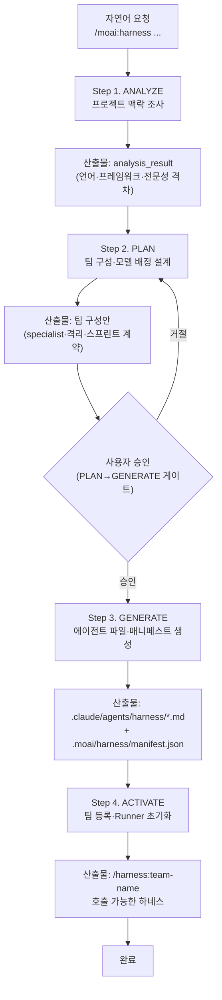
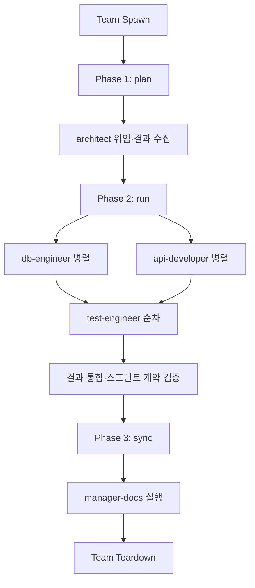

[빌더 에이전트 가이드](/ko/advanced/builder-agents)가 Harness v4 Builder의 '들어가는 문'이라면, 이 문서는 '설계도'에 해당합니다. 4단계 워크플로우(ANALYZE/PLAN/GENERATE/ACTIVATE) 각 단계가 무슨 산출물을, 왜 만드는지, 매니페스트(manifest, 실행 설정을 한 곳에 적어 둔 선언 파일) 한 장의 스키마가 어떻게 짜였는지, 그리고 매니페스트를 읽는 Runner(실행기)가 팀을 어떤 순서로 굴리는지를 다룹니다. 개요에서 한 장 더 들어와 세부 사양을 보고 싶을 때 읽는 문서입니다.


**한 줄 요약**: Harness v4 Builder는 Socratic 인터뷰로 프로젝트에 빈 전문성을 찾아내고, 그 결과를 매니페스트 한 장으로 선언한 뒤, 매니페스트를 읽는 Runner로 동적 팀을 운영합니다. 어떤 전문가(specialist, 팀 안의 단일 역할 담당)가 어떤 모델로 일할지는 코드가 아니라 매니페스트 선언으로 결정됩니다.


## 전체 흐름 한눈에 보기

Builder는 사용자의 자연어 요청 한 줄을 받아 네 단계를 차례로 밟습니다. 각 단계는 명확한 입력과 산출물을 가집니다. 사용자는 단계를 하나하나 지시할 필요가 없고, Builder가 알아서 진행합니다 — 다만 비용과 품질에 영향을 주는 결정(팀 규모, 모델 배정)은 PLAN→GENERATE 경계에서 사용자 승인을 받습니다.

```bash
# 백엔드 프로젝트에 맞는 전문가 팀을 한 줄로 요청
> /moai:harness 우리 백엔드 프로젝트에 맞는 전문가 팀을 만들어줘. API 설계, DB 스키마, 테스트를 담당할 팀이 필요해.
```



이 네 단계는 단순히 파일을 찍어 내는 작업이 아닙니다. ANALYZE가 잡은 '전문성 격차'가 PLAN의 팀 구성으로, PLAN의 팀 구성이 GENERATE의 매니페스트 선언으로, 그리고 매니페스트가 ACTIVATE의 Runner 동작으로 이어지는 인과 사슬입니다. 그래서 앞 단계의 판단이 뒤 단계의 비용과 품질을 결정합니다.

## Step 1: ANALYZE — 프로젝트 맥락을 데이터로 뽑기

ANALYZE의 임무는 "이 프로젝트에 어떤 전문성이 부족한가"라는 질문에 데이터로 답하는 것입니다. Builder가 임의로 팀을 짜는 것이 아니라, 프로젝트가 스스로에게 말해 주는 단서를 읽어 들여 빈 칸을 찾습니다.

### 조사 대상

Builder는 프로젝트 디렉토리와 매니페스트 파일들을 읽어 다섯 가지를 파악합니다.

| 조사 항목 | 읽는 단서 | 알아내는 것 |
|-----------|-----------|-------------|
| 사용 언어 | `go.mod`, `package.json`, `pyproject.toml`, `Cargo.toml` | 주력 언어와 부수 언어 |
| 프레임워크 | 소스 코드 임포트 경로 | REST API · gRPC · FastAPI · ORM 등 |
| 프로젝트 규모 | 파일 수와 코드 줄 수 | 팀 규모(3~7명) 산정 근거 |
| 기존 에이전트 | `.claude/agents/` 인벤토리 | 범용 카탈로그가 이미 덮는 역할 |
| 의존성 | `go.mod`, `package.json`, `pyproject.toml` | 외부 라이브러리·도메인 단서 |

### 산출물: analysis_result

조사 결과는 `analysis_result`라는 구조화된 요약으로 정리됩니다. 이 요약이 다음 단계(PLAN)의 입력입니다.

```yaml
analysis_result:
  languages:
    - go (primary)
    - shell (build scripts)
  frameworks:
    - REST API (net/http)
    - PostgreSQL ORM (sqlc)
  scale: "100~300 files, ~50K LOC"
  existing_agents: 0
  expertise_gaps:
    - Database schema design
    - API error handling patterns
    - Test coverage automation
```

`expertise_gaps`(전문성 격차)가 이 단계의 핵심입니다. 범용 에이전트 카탈로그가 덮지 못하는, 이 프로젝트만의 반복되는 도메인 작업을 '빈 칸'으로 명시해 두면 PLAN 단계가 그 빈 칸을 메울 전문가를 설계합니다. 격차가 뚜렷할수록 하네스(에이전트가 일할 환경을 자동으로 갖춰 주는 장치)를 만들 가치가 분명해집니다.

## Step 2: PLAN — 팀 구성과 모델 배정 설계하기

ANALYZE 결과를 바탕으로 팀 구성을 설계합니다. 이 단계에서 내리는 결정은 곧 비용과 품질로 직결되므로, 하나하나가 토크노믹스(비용을 효율적으로 나눠 쓰는 방식)의 선택입니다.

### 결정해야 할 다섯 가지

| 항목 | 결정 방식 | 예시 |
|------|-----------|------|
| **전문가 수** | 프로젝트 복잡도 × 전문성 격차 (HARD 상한 3~7) | 3명 |
| **실행 원시(primitive)** | 전문가별 실행 형태 | `sub-agent` · `adversarial-fan-out` |
| **격리(isolation)** | 병렬 전문가 충돌 가능성 | `none` · `worktree` |
| **모델·effort 배정** | 전문가별 추론 복잡도 (목적 기반) | content-author: opus/high, translator: sonnet/medium |
| **companion 스킬** | 전문가가 필요로 하는 도메인 지식 | `hns-oss-docs-i18n-rules` |

실행 원시(primitive, 이 전문가를 어떻게 띄울지 정하는 값)는 팀 운용의 뼈대입니다. `sub-agent`는 한 전문가를 순차적으로 띄워 결과를 돌려받는 형태이고, `adversarial-fan-out`은 여러 전문가를 병렬로 띄워 결과를 교차 검증하는 형태입니다. 번역처럼 독립적인 파생 작업이 많으면 병렬이 유리하고, 아키텍처 설계처럼 선행 결과가 다음 단계의 입력이면 순차가 안전합니다.

### 모델·effort 배정의 논리

전문가마다 모델 티어와 추론 강도(effort)를 따로 배정합니다. 깊은 추론이 필요한 저작에는 상위 모델과 `high` effort를, 반복적인 파생 작업에는 저렴한 모델과 `medium` effort를 배정합니다. 한 팀 안에서도 역할별로 비용을 다르게 가져가는 것이 토크노믹스의 핵심입니다. companion 스킬(재사용 가능한 작업 지시서 묶음)은 전문가가 매번 다시 설명해야 하는 도메인 지식을 미리 쥐여 주는 역할을 합니다.

### 사용자 승인 게이트

생성 전에 사용자에게 팀 구성안을 보여주고 승인을 받습니다. `AskUserQuestion`으로 "이 구성으로 진행할까요?"를 물어, 승인 없이 파일이 생성되는 일이 없도록 합니다.

```text
계획된 하네스 구성:
- 이름: backend-team
- 전문가 3명:
  ① architect (primitive: sub-agent, model: opus, effort: high)
  ② implementer (primitive: sub-agent, model: inherit, effort: high)
  ③ tester (primitive: sub-agent, model: sonnet, effort: medium)
- entry 명령어: /harness:backend-team

이 구성으로 진행할까요?
```

이 게이트 덕분에 팀 규모가 예산을 넘기거나 비싼 모델이 불필요하게 배정되는 일을 사용자가 사전에 잡아냅니다.

## Step 3: GENERATE — 에이전트 파일과 매니페스트 만들기

PLAN 승인이 떨어지면 실제 파일을 생성합니다. GENERATE는 두 종류의 산출물을 만듭니다 — 전문가별 에이전트 정의 파일과, 팀 전체를 한 장에 적어 둔 매니페스트입니다.

### 에이전트 정의 파일

각 전문가는 `.claude/agents/harness/` 아래 마크다운 파일로 정의됩니다. 파일 앞부분의 YAML 프롬프트로 역할과 도구·모델을 선언하고, 본문에 역할별 상세 지침을 적습니다.

```yaml
---
name: architect
description: API 아키텍처 설계 전문가
tools: Read, Write, Edit, Grep, Glob, Bash
model: inherit
---

당신은 이 프로젝트의 API 아키텍처 전문가입니다.
[역할별 상세 지침]
```

### 매니페스트 전체 스키마

팀 전체의 실행 설정은 `.moai/harness/manifest.json` 한 장에 선언됩니다. 이 파일이 Runner가 읽는 단일 원천입니다.

| 최상위 필드 | 타입 | 필수 | 설명 |
|-------------|------|------|------|
| `name` | string | 예 | 하네스 이름 (entry 명령어에 사용) |
| `domain` | string | 예 | 하네스 도메인 설명 |
| `patterns` | array | 예 | 실행 패턴 (`Pipeline`, `Fan-out/Fan-in`, `Producer-Reviewer` 등) |
| `specialists` | array | 예 | 전문가 객체 배열 (3~7개 HARD 상한) |
| `sprint_contract` | object | 예 | 품질 차원·임계값·must_pass 게이트 |
| `companion_skills` | array | — | 하네스 전용 companion 스킬 목록 |
| `entry_command` | string | 예 | `/harness:<name>` entry 명령어 |
| `runner_workflow` | string | 예 | Runner 워크플로 스크립트 파일 |
| `schedule` | object | — | (선택) 반복 실행 스케줄 — `mode: discovery-only` 등 |

#### 전문가(specialist) 객체 한 줄

각 전문가는 한 객체로 표현됩니다. 역할과 실행 방식이 한 줄에 다 들어 있습니다.

```json
{
  "role": "content-author",
  "description": "canonical-locale 원문 저작",
  "agent_file": ".claude/agents/harness/hns-oss-docs-content-author-specialist.md",
  "primitive": "sub-agent",
  "isolation": "none",
  "effort": "high",
  "model": "opus"
}
```

| 필드 | 설명 |
|------|------|
| `role` | 전문가 역할 (하이픈/영문) |
| `description` | 역할 설명 (자유 텍스트) |
| `agent_file` | 전문가 에이전트 파일 경로 (`.claude/agents/harness/`) |
| `primitive` | 실행 원시 (`sub-agent`, `adversarial-fan-out` 등) |
| `isolation` | 격리 수준 (`none`, `worktree`) |
| `effort` | 추론 강도 (`low`, `medium`, `high`, `xhigh`) — 목적 기반 |
| `model` | 모델 티어 (`opus`, `sonnet`, `inherit`) — 목적 기반 |

#### 스프린트 계약(Sprint Contract)

`sprint_contract`는 "무엇을 끝난 것으로 볼지"를 미리 합의해 둔 계약입니다. 차원마다 임계값을 두고, `must_pass`에 나열된 차원은 반드시 통과해야 통과로 인정합니다.

```json
{
  "dimensions": ["locale-parity", "build-clean", "style-compliance", "content-fidelity"],
  "thresholds": { "locale-parity": 1.0, "build-clean": 1.0, "style-compliance": 0.95 },
  "must_pass": ["locale-parity", "build-clean"]
}
```

`dimensions`는 채점 차원, `thresholds`는 차원별 통과 임계값, `must_pass`는 반드시 통과해야 하는 게이트를 정의합니다. 이 계약 덕분에 "번역이 빠졌는데 넘어갔다" 같은 일이 일어나지 않습니다 — Runner가 결과를 합칠 때 이 계약으로 검증합니다.

### 생성 결과 확인

생성 직후 파일이 제자리에 있는지, 정의가 정확한지 직접 확인할 수 있습니다.

```bash
ls .claude/agents/harness/
# architect.md, implementer.md, tester.md 확인

ls .moai/harness/
# manifest.json 확인

grep -c "\"name\": \"architect\"" .moai/harness/manifest.json
# 전문가 정의가 매니페스트에 정확히 들어갔는지 확인
```

## Step 4: ACTIVATE — 팀 등록하고 Runner로 굴리기

생성된 하네스를 등록해 즉시 쓸 수 있게 만드는 마지막 단계입니다. ACTIVATE는 파일 검증부터 Runner 초기화, 그리고 (필요하면) worktree 격리 설정까지를 다룹니다.

### 활성화 다섯 단계

1. **에이전트 검증**: 각 에이전트 파일 문법 확인
2. **매니페스트 검증**: JSON 스키마 및 필드 검증
3. **커맨드 등록**: `/harness:backend-team` entry 커맨드 활성화
4. **Runner 초기화**: 매니페스트 기반 Runner 시작 준비
5. **Worktree 생성** (선택적): 전문가 격리 활성화 조건 설정

### 활성화 확인

활성화가 끝나면 CLI로 확인합니다.

```bash
moai harness list
# backend-team 표시 (이름 + 도메인 + entry 명령어)

moai harness doctor
# 참조 무결성 스모크 게이트 (specialist·skill·workflow 참조 검증)
```

`moai harness doctor`는 매니페스트가 가리키는 전문가 파일·스킬·워크플로가 모두 실제로 존재하는지 검사합니다. 깨진 참조가 있으면 이 단계에서 잡힙니다.

### Runner 생명 사슬

매니페스트를 읽은 Runner는 생성된 팀을 정해진 순서로 굴립니다. `patterns`에 적힌 실행 패턴(Pipeline, Fan-out/Fan-in 등)에 따라 전문가를 순차·병렬로 배치합니다.



Runner의 동작은 매니페스트 필드로 제어합니다. `isolation: "worktree"`를 주면 해당 전문가에 worktree 격리가 적용되고, `model: "inherit"`을 주면 부모 세션 모델을 상속합니다. 추론 강도(`effort`)와 companion 스킬도 전문가마다 매니페스트에서 지정한 대로 적용됩니다.

### Worktree 격리 규칙 (L1 optional)

병렬 전문가가 같은 파일을 편집할 충돌 가능성이 있으면, Runner는 조건부로 L1 worktree 격리를 켭니다. 기본은 꺼짐이고, 다음 조건 가운데 하나라도 참이면 격리가 활성화됩니다.

1. **동일 파일 병렬 편집** → 두 전문가가 같은 파일을 동시에 수정
2. **재귀적 디렉토리 쓰기** → 전문가들이 같은 디렉토리에 여러 파일 생성
3. **의존성 경합** → 전문가 A의 출력이 전문가 B의 입력 (순서 중요)

격리를 끄면(`isolation: "none"`) 모든 전문가가 메인 프로젝트에서 작업합니다 — 메모리는 가장 적게 쓰지만 충돌 가능성이 남습니다. 충돌 가능성이 뚜렷한 전문가에만 `worktree`를 주면 병렬 이점과 안정성 사이에서 균형을 잡을 수 있습니다.

## 관련 문서

- [빌더 에이전트 가이드](/ko/advanced/builder-agents) - Builder 4-phase 개요 (들어가는 문)
- [에이전트 가이드](/ko/advanced/agent-guide) - 12개 핵심 에이전트 카탈로그와 정의 형식
- [SPEC 기반 개발](/ko/workflow-commands/moai-plan) - SPEC(요구사항 명세서) 작성과 하네스의 만남


**팁**: 매니페스트는 생성 후 `moai harness edit <name>`으로 편집 경로를 확인해 언제든 수정할 수 있습니다. 전문가 추가, 스킬 변경, 격리 정책 조정이 모두 가능합니다. 편집 뒤에는 `moai harness doctor`로 참조 무결성을 다시 검사하세요.

