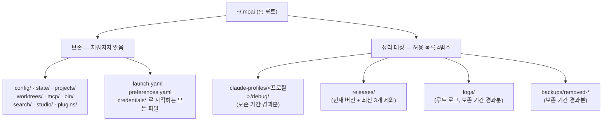
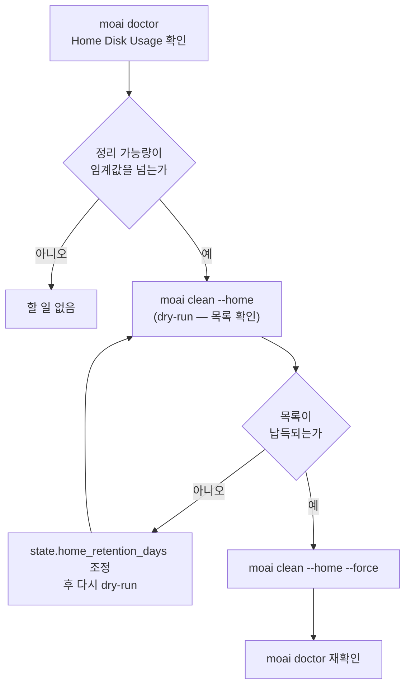



# 홈 디렉터리 위생 (~/.moai)

MoAI가 프로젝트 바깥에 두는 상태는 전부 `~/.moai` 한 곳에 모입니다. 프로필별 디버그 로그, 내려받은 릴리즈 바이너리, 세션 레지스트리, 워크트리 등록부, 백업이 모두 여기에 쌓입니다. 오래 쓴 머신에서는 이 디렉터리가 조용히 수 기가바이트까지 자랍니다 — 아무도 보지 않는 자리라서, 디스크가 찰 때까지 눈에 띄지 않습니다.


**한 줄 요약**: `MOAI_HOME`으로 홈 루트의 위치를 정하고, `moai doctor`가 얼마나 찼는지 알려 주며, `moai clean --home`이 허용 목록 안쪽만 정리합니다. 세 표면이 하나의 이야기입니다.


## 무엇이 어디에 쌓이는가



허용 목록에 없는 것은 스캐너에게 아예 보이지 않습니다. 그리고 보존 대상은 허용 목록 **안쪽에서도** 이깁니다 — 오래된 `backups/removed-*` 디렉터리 안에 `credentials`로 시작하는 파일이 하나라도 있으면 그 디렉터리는 통째로 건너뜁니다. 부분 삭제로 백업을 반쪽짜리로 만드는 대신, 아예 손대지 않습니다.

`~/.claude`는 어떤 경로로도 삭제되지 않습니다. `moai doctor`가 크기를 **보고만** 하고, `moai clean --home`은 읽지도 않습니다.

## `MOAI_HOME` — 홈 루트를 옮기기

`~/.moai` 자리를 다른 곳으로 옮기려면 `MOAI_HOME` 환경변수에 루트 경로를 지정합니다.

```bash
export MOAI_HOME=/Volumes/work/moai-home
```

세 가지 규칙이 있습니다.

| 값 | 동작 |
|---|---|
| 비어 있지 않은 **절대 경로** | 그 경로가 홈 루트가 됩니다 |
| 빈 문자열 | 설정하지 않은 것과 같습니다 — `~/.moai`로 되돌아갑니다 |
| 상대 경로 | 무시됩니다 — `~/.moai`로 되돌아갑니다 |


 **셸 훅은 `MOAI_HOME`을 따르지 않습니다.** 이 변수를 읽는 주체는 Go 바이너리(`moai` CLI와 그 하위 명령)뿐입니다. `.claude/hooks/` 아래의 셸 스크립트 래퍼와, `~/.moai` 경로를 문자열로 직접 쓰는 외부 도구는 이 변수를 참조하지 않으므로 여전히 기본 위치를 봅니다. 즉 `MOAI_HOME`을 옮기면 **Go 쪽 상태만** 따라 움직이고 셸 훅이 쓰는 경로는 갈라집니다 — 이 한계를 감수할 수 있을 때만 쓰십시오.


사용자 홈 자체는 `HOME` 우선으로 해석됩니다. `HOME`이 비어 있지 않으면 그 값을 그대로 쓰고, 비어 있을 때만 운영체제의 홈 조회로 넘어갑니다. 덕분에 테스트나 컨테이너에서 `HOME`을 갈아끼우면 모든 플랫폼에서 동일하게 먹힙니다.

## `moai doctor` — 얼마나 찼는지 먼저 보기

`moai doctor`의 **Home Disk Usage** 항목이 진단 목록에 함께 나옵니다. 권고(advisory) 성격이라, 넘쳐도 다른 명령을 막지 않습니다.

```bash
moai doctor
```

이 항목이 보고하는 것:

| 항목 | 내용 |
|---|---|
| 전체 크기 | `~/.moai` 총 용량과 상위 3개 항목 |
| 프로필별 내역 | `claude-profiles/<프로필>` 각각의 크기와 범주 분해 |
| 릴리즈 개수 | `releases/`에 남아 있는 바이너리 수와 현재 버전 |
| 정리 가능량 | 아래 `moai clean --home`이 실제로 지울 수 있는 추정 바이트 |
| `~/.claude` | 크기만 보고 — 절대 정리 대상이 아님 |

정리 가능량이 임계값(컴파일된 기본값 500 MB)을 넘으면 상태가 WARN으로 바뀌고, 메시지가 `moai clean --home`을 권합니다. 그 아래면 OK로 남습니다. 정리 가능량 추정은 `moai clean --home`이 쓰는 것과 **같은 스캐너**를 호출하므로, doctor가 말하는 숫자와 clean이 지우는 목록이 어긋나지 않습니다.

## `moai clean --home` — 허용 목록 안쪽만 정리

```bash
# 기본은 dry-run — 무엇이 지워질지 보고만 합니다
$ moai clean --home

# 실제 삭제
$ moai clean --home --force
```

- **dry-run이 기본**입니다. `--force`를 명시해야 실제로 지웁니다.
- 지우는 범위는 위 다이어그램의 허용 목록 4범주뿐입니다.
- `releases/`에서는 **현재 실행 중인 버전**과 **나머지 중 최신 3개**가 보호되고, 그 밖의 바이너리와 짝지어진 `.sha256` 파일이 후보가 됩니다. `version.json`과 `LATEST`는 후보가 되지 않습니다.
- 나머지 세 범주(`debug/`, 루트 `logs/`, `backups/removed-*`)는 **보존 기간**을 넘긴 것만 후보가 됩니다.

### `state.home_retention_days`

보존 기간은 **홈 티어** 설정 파일 `~/.moai/config/sections/state.yaml`에서 읽습니다.

```yaml
state:
  home_retention_days: 30
```

| 값 | 동작 |
|---|---|
| 키 없음 / 파일 없음 | 컴파일된 기본값 **30일** |
| 양의 정수 | 그 일수보다 오래된 항목만 후보 |
| `0` | 정리 **비활성화** — 후보가 하나도 나오지 않음 |


이 키는 프로젝트의 `.moai/config/sections/state.yaml`에 있는 `state.retention_days`(프로젝트 런 산출물 보존)와 **다른 키이고 다른 티어**입니다. 홈은 하나인데 프로젝트는 여럿이므로, 프로젝트마다 다른 보존 기간으로 같은 홈을 정리하는 일이 없도록 읽는 자리를 갈라 두었습니다.


## 손이 가는 순서



## 관련 문서

- [/moai clean](/ko/utility-commands/moai-clean) — 프로젝트 데드 코드 정리와 `--home` 표면의 차이
- [moai doctor 진단](/ko/cli-reference/doctor) — 전체 진단 항목과 하위 명령
- [config 섹션 레퍼런스](/ko/advanced/config-sections) — 설정 티어와 섹션 파일의 구조
- [moai update 업데이트](/ko/cli-reference/update) — `backups/removed-*`를 만드는 쪽
