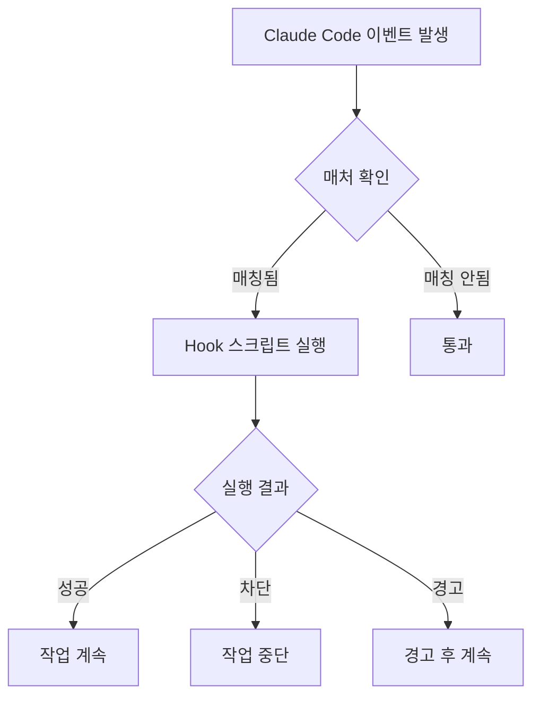
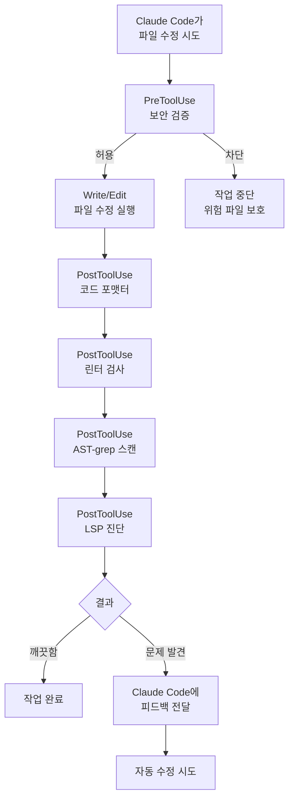

# Hooks 가이드

Claude Code의 Hooks 시스템과 MoAI-ADK의 기본 Hook 스크립트를 상세히 안내합니다.


**한 줄 요약**: Hooks는 Claude Code의 **자동 반사 신경**입니다. 파일을 저장하면 자동으로 포맷팅하고, 위험한 명령은 자동으로 차단합니다.


## Hooks란?

Hooks는 Claude Code의 특정 이벤트에 반응하여 **자동으로 실행되는 스크립트**입니다.

의사의 반사 신경 검사에 비유하면, 무릎을 두드리면 (이벤트 발생) 다리가 자동으로 올라가는 것 (스크립트 실행)처럼, Claude Code가 파일을 수정하면 (PostToolUse 이벤트) 포맷터가 자동으로 실행됩니다 (코드 정리).



## Hook 이벤트 유형

Claude Code는 **10가지 이벤트 유형**을 지원합니다.

### 전체 이벤트 목록

| 이벤트 | 실행 시점 | 주요 용도 |
|--------|-----------|----------|
| `Setup` | `--init`, `--init-only`, `--maintenance` 플래그로 시작 시 | 초기 설정, 환경 점검 |
| `SessionStart` | 세션이 시작될 때 | 프로젝트 정보 표시, 환경 초기화 |
| `SessionEnd` | 세션이 종료될 때 | 정리 작업, 컨텍스트 저장 |
| `PreCompact` | 컨텍스트 압축 전 (`/clear` 등) | 중요 컨텍스트 백업 |
| `PreToolUse` | 도구 사용 전 | 보안 검증, 위험 명령 차단 |
| **`PermissionRequest`** | 권한 대화상자 표시 시 | 자동 허용/거부 결정 |
| `PostToolUse` | 도구 사용 후 | 코드 포맷팅, 린트 검사, LSP 진단 |
| **`UserPromptSubmit`** | 사용자가 프롬프트 제출 시 | 프롬프트 전처리, 검증 |
| **`Notification`** | Claude Code가 알림 전송 시 | 데스크톱 알림 커스터마이징 |
| `Stop` | 응답 완료 후 | 루프 제어, 완료 조건 확인 |
| **`SubagentStop`** | 하위 에이전트 작업 완료 후 | 하위 작업 결과 처리 |

### 이벤트 상세 설명

#### 1. Setup
Claude Code가 `--init`, `--init-only`, 또는 `--maintenance` 플래그로 시작될 때 실행됩니다. 초기 설정 작업과 환경 점검에 사용합니다.

#### 2. SessionStart
세션이 시작되거나 기존 세션을 재개할 때 실행됩니다. 프로젝트 상태 표시, 환경 초기화에 사용합니다.

#### 3. SessionEnd
Claude Code 세션이 종료될 때 실행됩니다. 정리 작업, 컨텍스트 저장, 메트릭 수집에 사용합니다.

#### 4. PreCompact
Claude Code가 컨텍스트 압축 작업 (`/clear` 명령 등)을 수행하기 전에 실행됩니다. 중요한 컨텍스트를 백업하는 데 사용합니다.

#### 5. PreToolUse
도구가 호출되기 **전**에 실행됩니다. 도구 호출을 차단하거나 수정할 수 있습니다. 보안 검증, 위험 명령 차단에 사용합니다.

#### 6. PermissionRequest
권한 대화상자가 사용자에게 표시될 때 실행됩니다. 자동으로 허용하거나 거단할 수 있습니다.

#### 7. PostToolUse
도구 호출이 **완료된 후**에 실행됩니다. 코드 포맷팅, 린트 검사, LSP 진단 수집에 사용합니다.

#### 8. UserPromptSubmit
사용자가 프롬프트를 제출할 때 실행되며, Claude가 처리하기 **전**입니다. 프롬프트 전처리, 검증에 사용합니다.

#### 9. Notification
Claude Code가 알림을 보낼 때 실행됩니다. 데스크톱 알림, 소리 알림 등으로 커스터마이징할 수 있습니다.

#### 10. Stop
Claude Code가 응답을 마쳤을 때 실행됩니다. 루프 제어, 완료 조건 확인에 사용합니다.

#### 11. SubagentStop
하위 에이전트 작업이 완료되었을 때 실행됩니다. 하위 작업 결과를 처리하는 데 사용합니다.

### MoAI-ADK에서 구현된 이벤트

MoAI-ADK는 다음 이벤트를 실제로 구현하고 있습니다:

| 이벤트 | 상태 | Hook 파일 |
|--------|------|-----------|
| `SessionStart` | ✅ | `session_start__show_project_info.py` |
| `PreToolUse` | ✅ | `pre_tool__security_guard.py` |
| `PostToolUse` | ✅ | `post_tool__code_formatter.py`, `post_tool__linter.py`, `post_tool__ast_grep_scan.py`, `post_tool__lsp_diagnostic.py` |
| `PreCompact` | ✅ | `pre_compact__save_context.py` |
| `SessionEnd` | ✅ | `session_end__auto_cleanup.py` |
| `Stop` | ✅ | `stop__loop_controller.py` |
| `Setup` | ⚪ | 공식 예시 참조 |
| `PermissionRequest` | ⚪ | 공식 예시 참조 |
| `UserPromptSubmit` | ⚪ | 공식 예시 참조 |
| `Notification` | ⚪ | 공식 예시 참조 |
| `SubagentStop` | ⚪ | 공식 예시 참조 |
| `TeammateIdle` | ✅ | 팀원 idle 감지 및 품질 검증 |
| `TaskCompleted` | ✅ | 태스크 완료 검증 |


**SubagentStop 핸들러 미구현 이슈 (v2.9.0)**: `SubagentStop` 이벤트는 settings.json에 등록되어 있지만, Go 핸들러가 `deps.go`에 미등록 상태입니다. 현재는 빈 응답(`{}`)만 반환합니다.


### Agent Teams 이벤트 상세 (v2.9.0)

#### TeammateIdle 이벤트
팀원이 작업을 완료하고 idle 상태로 진입할 때 실행됩니다.

- `continue: false` (exit code 2) → idle 거부, 팀원이 추가 작업 수행
- `continue: true` (기본값) → idle 승인

#### TaskCompleted 이벤트
팀원이 태스크를 완료했을 때 실행됩니다.

- Exit code 2 → 완료 거부 (수정 필요)
- Exit code 0 (기본값) → 완료 승인

#### Team Shutdown Sequence [HARD]

팀 종료 시 다음 순서를 **반드시** 따르세요:

1. **shutdown_request 전송**: 각 팀원에게 `SendMessage(shutdown_request)` 전송
2. **응답 대기**: 각 팀원으로부터 `shutdown_response approve:true` 수신
3. **[HARD] tmux pane 정리**: TeamDelete 전에 tmux pane 종료
   - `~/.claude/teams/{team-name}/config.json` 읽기
   - 각 멤버의 `tmuxPaneId` 추출 (예: "%184")
   - `tmux kill-pane -t {paneId}` 실행 (높은 인덱스부터)
4. **TeamDelete 호출**: 팀 디렉토리 정리


**왜 3단계가 필수인가?** `shutdown_response`는 팀원을 논리적으로 완료 표시하지만 tmux pane 프로세스를 종료하지 않습니다. `TeamDelete`는 디렉토리만 제거합니다. 3단계 없이는 pane이 무한히 살아있고 Leader가 "Drain" 상태로 멈춥니다.


### 이벤트 실행 순서

일반적인 파일 수정 작업에서 Hook이 실행되는 순서입니다.



## Claude Code 공식 예시

이 예시들은 Claude Code 공식 문서에서 제공하는 표준 패턴입니다.

### Bash 명령 로깅 Hook

모든 Bash 명령을 로그 파일에 기록합니다.

```json
{
  "hooks": {
    "PreToolUse": [
      {
        "matcher": "Bash",
        "hooks": [
          {
            "type": "command",
            "command": "jq -r '\"\\(.tool_input.command) - \\(.tool_input.description // \"No description\")\"' >> ~/.claude/bash-command-log.txt"
          }
        ]
      }
    ]
  }
}
```

### TypeScript 포맷팅 Hook

TypeScript 파일을 편집한 후 자동으로 Prettier를 실행합니다.

```json
{
  "hooks": {
    "PostToolUse": [
      {
        "matcher": "Edit|Write",
        "hooks": [
          {
            "type": "command",
            "command": "jq -r '.tool_input.file_path' | { read file_path; if echo \"$file_path\" | grep -q '\\.ts$'; then npx prettier --write \"$file_path\"; fi; }"
          }
        ]
      }
    ]
  }
}
```

### Markdown 포맷터 Hook

Markdown 파일의 언어 태그를 자동으로 감지하고 추가합니다.

```json
{
  "hooks": {
    "PostToolUse": [
      {
        "matcher": "Edit|Write",
        "hooks": [
          {
            "type": "command",
            "command": "\"$CLAUDE_PROJECT_DIR\"/.claude/hooks/markdown_formatter.py"
          }
        ]
      }
    ]
  }
}
```

`.claude/hooks/markdown_formatter.py` 파일:

```python
#!/usr/bin/env python3
"""
Markdown formatter for Claude Code output.
Fixes missing language tags and spacing issues while preserving code content.
"""
import json
import sys
import re
import os

def detect_language(code):
    """Best-effort language detection from code content."""
    s = code.strip()

    # JSON detection
    if re.search(r'^\\s*[{\\[]', s):
        try:
            json.loads(s)
            return 'json'
        except:
            pass

    # Python detection
    if re.search(r'^\\s*def\\s+\\w+\\s*\\(', s, re.M) or \
       re.search(r'^\\s*(import|from)\\s+\\w+', s, re.M):
        return 'python'

    # JavaScript detection
    if re.search(r'\\b(function\\s+\\w+\\s*\\(|const\\s+\\w+\\s*=)', s) or \
       re.search(r'=>|console\\.(log|error)', s):
        return 'javascript'

    # Bash detection
    if re.search(r'^#!.*\\b(bash|sh)\\b', s, re.M) or \
       re.search(r'\\b(if|then|fi|for|in|do|done)\\b', s):
        return 'bash'

    return 'text'

def format_markdown(content):
    """Format markdown content with language detection."""
    # Fix unlabeled code fences
    def add_lang_to_fence(match):
        indent, info, body, closing = match.groups()
        if not info.strip():
            lang = detect_language(body)
            return f"{indent}```{lang}\\n{body}{closing}\\n"
        return match.group(0)

    fence_pattern = r'(?ms)^([ \\t]{0,3})```([^\\n]*)\\n(.*?)(\\n\\1```)\\s*$'
    content = re.sub(fence_pattern, add_lang_to_fence, content)

    # Fix excessive blank lines
    content = re.sub(r'\\n{3,}', '\\n\\n', content)

    return content.rstrip() + '\\n'

# Main execution
try:
    input_data = json.load(sys.stdin)
    file_path = input_data.get('tool_input', {}).get('file_path', '')

    if not file_path.endswith(('.md', '.mdx')):
        sys.exit(0)  # Not a markdown file

    if os.path.exists(file_path):
        with open(file_path, 'r', encoding='utf-8') as f:
            content = f.read()

        formatted = format_markdown(content)

        if formatted != content:
            with open(file_path, 'w', encoding='utf-8') as f:
                f.write(formatted)
            print(f"✓ Fixed markdown formatting in {file_path}")

except Exception as e:
    print(f"Error formatting markdown: {e}", file=sys.stderr)
    sys.exit(1)
```

### 데스크톱 알림 Hook

Claude가 입력을 기다릴 때 데스크톱 알림을 표시합니다.

```json
{
  "hooks": {
    "Notification": [
      {
        "matcher": "",
        "hooks": [
          {
            "type": "command",
            "command": "notify-send 'Claude Code' 'Awaiting your input'"
          }
        ]
      }
    ]
  }
}
```

### 파일 보호 Hook

민감한 파일의 수정을 차단합니다.

```json
{
  "hooks": {
    "PreToolUse": [
      {
        "matcher": "Edit|Write",
        "hooks": [
          {
            "type": "command",
            "command": "python3 -c \"import json, sys; data=json.load(sys.stdin); path=data.get('tool_input',{}).get('file_path',''); sys.exit(2 if any(p in path for p in ['.env', 'package-lock.json', '.git/']) else 0)\""
          }
        ]
      }
    ]
  }
}
```

## MoAI 기본 Hooks

MoAI-ADK는 **11개의 기본 Hook 스크립트**를 제공합니다.

### Hook 목록

| Hook 파일 | 이벤트 | 매처 | 역할 | 타임아웃 |
|-----------|--------|------|------|----------|
| `session_start__show_project_info.py` | SessionStart | 전체 | 프로젝트 상태 표시, 업데이트 확인 | 5초 |
| `pre_tool__security_guard.py` | PreToolUse | `Write\|Edit\|Bash` | 위험 파일 수정/명령 차단 | 5초 |
| `post_tool__code_formatter.py` | PostToolUse | `Write\|Edit` | 자동 코드 포맷팅 | 30초 |
| `post_tool__linter.py` | PostToolUse | `Write\|Edit` | 자동 린트 검사 | 60초 |
| `post_tool__ast_grep_scan.py` | PostToolUse | `Write\|Edit` | AST 기반 보안 스캔 | 30초 |
| `post_tool__lsp_diagnostic.py` | PostToolUse | `Write\|Edit` | LSP 진단 결과 수집 | 기본값 |
| `pre_compact__save_context.py` | PreCompact | 전체 | `/clear` 전 컨텍스트 저장 | 3초 |
| `session_end__auto_cleanup.py` | SessionEnd | 전체 | 세션 종료 시 정리 작업 | 5초 |

| `stop__loop_controller.py` | Stop | 전체 | Ralph 루프 제어 및 완료 확인 | 기본값 |
| `quality_gate_with_lsp.py` | 수동 | 전체 | LSP 기반 품질 게이트 검증 | 기본값 |

### SessionStart: 프로젝트 정보 표시

세션이 시작될 때 프로젝트의 현재 상태를 보여줍니다.

**표시 정보:**
- MoAI-ADK 버전 및 업데이트 여부
- 현재 프로젝트 이름과 기술 스택
- Git 브랜치, 변경 사항, 마지막 커밋
- Git 전략 (Github-Flow 모드, Auto Branch 설정)
- 언어 설정 (대화 언어)
- 이전 세션 컨텍스트 (SPEC 상태, 작업 목록)
- 개인화된 환영 메시지 또는 설정 가이드

### PreToolUse: Security Guard (보안 가드)

파일 수정/명령 실행 전에 **위험한 작업을 보호**합니다.

**보호 대상 파일:**

| 카테고리 | 보호 파일 | 이유 |
|----------|-----------|------|
| 비밀 저장소 | `secrets/`, `*.secrets.*`, `*.credentials.*` | 민감 정보 보호 |
| SSH 키 | `~/.ssh/*`, `id_rsa*`, `id_ed25519*` | 서버 접근 키 보호 |
| 인증서 | `*.pem`, `*.key`, `*.crt` | 인증서 파일 보호 |
| 클라우드 자격증명 | `~/.aws/*`, `~/.gcloud/*`, `~/.azure/*`, `~/.kube/*` | 클라우드 계정 보호 |
| Git 내부 | `.git/*` | Git 저장소 무결성 |
| 토큰 파일 | `*.token`, `.tokens/*`, `auth.json` | 인증 토큰 보호 |

**주의:** `.env` 파일은 보호하지 않습니다. 개발자가 환경 변수를 편집할 수 있도록 허용합니다.

**차단 동작:**
- 보호 대상 파일에 대한 Write/Edit 시도를 감지
- JSON 형태로 `"permissionDecision": "deny"` 응답 반환
- Claude Code가 해당 파일 수정을 중단

**위험한 Bash 명령 차단:**
- 데이터베이스 삭제: `supabase db reset`, `neon database delete`
- 위험한 파일 삭제: `rm -rf /`, `rm -rf .git`
- Docker 전체 삭제: `docker system prune -a`
- 강 푸시: `git push --force origin main`
- Terraform 파괴: `terraform destroy`

### PostToolUse: Code Formatter (코드 포맷터)

파일 수정 후 **자동으로 코드를 정리**합니다.

**지원 언어 및 포맷터:**

| 언어 | 포맷터 (우선순위) | 설정 파일 |
|------|------------------|----------|
| Python | `ruff format`, `black` | `pyproject.toml` |
| TypeScript/JavaScript | `biome`, `prettier`, `eslint_d` | `.prettierrc`, `biome.json` |
| Go | `gofmt`, `goimports` | 기본값 |
| Rust | `rustfmt` | `rustfmt.toml` |
| Ruby | `prettier` | `.prettierrc` |
| PHP | `prettier` | `.prettierrc` |
| Java | `prettier` | `.prettierrc` |
| Kotlin | `prettier` | `.prettierrc` |
| Swift | `swiftformat` | `.swiftformat` |
| C# | `prettier` | `.prettierrc` |

**제외 대상:**
- `.json`, `.lock`, `.min.js`, `.svg` 등
- `node_modules`, `.git`, `dist`, `build` 디렉토리

### PostToolUse: Linter (린터)

파일 수정 후 **코드 품질을 자동 검사**합니다.

**지원 언어 및 린터:**

| 언어 | 린터 (우선순위) | 검사 항목 |
|------|----------------|----------|
| Python | `ruff check`, `flake8` | PEP 8, 타입 힌트, 복잡도 |
| TypeScript/JavaScript | `eslint`, `biome lint`, `eslint_d` | 코딩 표준, 잠재적 버그 |
| Go | `golangci-lint` | 코드 품질, 성능 |
| Rust | `clippy` | Rust 관용성, 성능 |

### PostToolUse: AST-grep 스캔

파일 수정 후 **구조적 보안 취약점을 스캔**합니다.

**지원 언어:**
Python, JavaScript/TypeScript, Go, Rust, Java, Kotlin, C/C++, Ruby, PHP

**스캔 패턴 예시:**
- SQL Injection 취약점 (문자열 연결 쿼리)
- 하드코딩된 비밀키 (API 키, 토큰)
- 안전하지 않은 함수 호출
- 미사용 임포트

**설정:** `.claude/skills/moai-tool-ast-grep/rules/sgconfig.yml` 또는 프로젝트 루트의 `sgconfig.yml`

### PostToolUse: LSP 진단

파일 수정 후 **LSP(Language Server Protocol) 진단 정보를 수집**합니다.

**지원 언어:**
Python, TypeScript/JavaScript, Go, Rust, Java, Kotlin, Ruby, PHP, C/C++

**Fallback 진단:**
LSP를 사용할 수 없는 경우 명령행 도구를 사용합니다:
- Python: `ruff check --output-format=json`
- TypeScript: `tsc --noEmit`

**설정:** `.moai/config/sections/ralph.yaml`

```yaml
ralph:
  enabled: true
  hooks:
    post_tool_lsp:
      enabled: true
      severity_threshold: error  # error | warning | info
```

### PreCompact: 컨텍스트 저장

`/clear` 실행 전에 **현재 컨텍스트를 파일로 저장**합니다.

**저장 위치:** `.moai/memory/context-snapshot.json`

**저장 내용:**
- 현재 활성 SPEC 상태 (ID, 단계, 진행률)
- 진행 중인 작업 목록 (TodoWrite)
- 완료된 작업 목록
- 수정된 파일 목록
- Git 상태 정보 (브랜치, 커밋되지 않은 변경)
- 핵심 결정 사항

**아카이브:** 이전 스냅샷은 `.moai/memory/context-archive/`에 자동 보관됩니다.

### SessionEnd: 자동 정리

세션 종료 시 다음 작업을 수행합니다:

**P0 작업 (필수):**
- 세션 메트릭 저장 (수정 파일 수, 커밋 수, 작업한 SPEC)
- 작업 상태 스냅샷 저장 (`.moai/memory/last-session-state.json`)
- 커밋되지 않은 변경 경고

**P1 작업 (선택):**
- 임시 파일 정리 (7일 이상 된 파일)
- 캐시 파일 정리
- 루트 디렉토리 문서 관리 위반 스캔
- 세션 요약 생성

### Stop: 루프 제어기

Ralph Engine 피드백 루프를 제어합니다.

**완료 조건 확인:**
- LSP 오류 수 (0 오류 목표)
- LSP 경고 수
- 테스트 통과 여부
- 커버리지 목표 (기본 85%)
- 완료 마커 (`<moai>DONE</moai>`, `<moai>COMPLETE</moai>`) 감지

**상태 파일:** `.moai/cache/.moai_loop_state.json`

**설정:** `.moai/config/sections/ralph.yaml`

```yaml
ralph:
  enabled: true
  loop:
    max_iterations: 10
    auto_fix: false
    completion:
      zero_errors: true
      zero_warnings: false
      tests_pass: true
      coverage_threshold: 85
```

### Quality Gate with LSP

LSP 진단을 사용하여 품질 게이트를 검증합니다.

**품질 기준:**
- 최대 오류 수: 0 (기본값)
- 최대 경고 수: 10 (기본값)
- 타입 오류: 0 허용
- 린트 오류: 0 허용

**설정:** `.moai/config/sections/quality.yaml`

```yaml
constitution:
  quality_gate:
    max_errors: 0
    max_warnings: 10
    enabled: true
```

**결과 예시:**
```json
{
  "lsp_errors": 0,
  "lsp_warnings": 2,
  "type_errors": 0,
  "lint_errors": 0,
  "passed": true,
  "reason": "Quality gate passed: LSP diagnostics clean"
}
```

## lib/ 공유 라이브러리

MoAI Hooks는 공유 기능을 위해 `lib/` 디렉토리에 모듈을 제공합니다.

```
.claude/hooks/moai/lib/
├── __init__.py
├── atomic_write.py           # 원자적 쓰기 연산
├── checkpoint.py             # 체크포인트 관리
├── common.py                 # 공통 유틸리티
├── config.py                 # 설정 관리
├── config_manager.py         # 설정 관리자 (고급)
├── config_validator.py       # 설정 유효성 검사
├── context_manager.py        # 컨텍스트 관리 (스냅샷, 아카이브)
├── enhanced_output_style_detector.py  # 출력 스타일 감지
├── file_utils.py             # 파일 유틸리티
├── git_collector.py          # Git 데이터 수집
├── git_operations_manager.py # Git 연산 관리자 (최적화됨)
├── language_detector.py      # 언어 감지
├── language_validator.py     # 언어 유효성 검사
├── main.py                   # 메인 진입점
├── memory_collector.py       # 메모리 수집
├── metrics_tracker.py        # 메트릭 추적
├── models.py                 # 데이터 모델
├── path_utils.py             # 경로 유틸리티
├── project.py                # 프로젝트 관련
├── renderer.py               # 렌더러
├── timeout.py                # 타임아웃 처리
├── tool_registry.py          # 도구 레지스트리 (포맷터, 린터)
├── unified_timeout_manager.py # 통합 타임아웃 관리자
├── update_checker.py         # 업데이트 확인
├── version_reader.py         # 버전 읽기
├── alfred_detector.py        # Alfred 감지
└── shared/utils/
    └── announcement_translator.py  # 공지사항 번역
```

**주요 모듈:**

- **tool_registry.py**: 16개 프로그래밍 언어에 대한 포맷터/린터 자동 감지
- **git_operations_manager.py**: 연결 풀링, 캐싱을 통한 최적화 Git 연산
- **unified_timeout_manager.py**: 통합 타임아웃 관리와 우아한 저하
- **context_manager.py**: 컨텍스트 스냅샷, 아카이브, Memory MCP 페이로드 생성

## settings.json에서 Hook 설정

Hooks는 `.claude/settings.json` 파일의 `hooks` 섹션에서 설정합니다.

```json
{
  "hooks": {
    "SessionStart": [
      {
        "matcher": "",
        "hooks": [
          {
            "type": "command",
            "command": "${SHELL:-/bin/bash} -l -c 'uv run \"$CLAUDE_PROJECT_DIR/.claude/hooks/moai/session_start__show_project_info.py\"'"
          }
        ]
      }
    ],
    "PreToolUse": [
      {
        "matcher": "Write|Edit",
        "hooks": [
          {
            "type": "command",
            "command": "${SHELL:-/bin/bash} -l -c 'uv run \"$CLAUDE_PROJECT_DIR/.claude/hooks/moai/pre_tool__security_guard.py\"'",
            "timeout": 5000
          }
        ]
      }
    ],
    "PostToolUse": [
      {
        "matcher": "Write|Edit",
        "hooks": [
          {
            "type": "command",
            "command": "${SHELL:-/bin/bash} -l -c 'uv run \"$CLAUDE_PROJECT_DIR/.claude/hooks/moai/post_tool__code_formatter.py\"'",
            "timeout": 30000
          },
          {
            "type": "command",
            "command": "${SHELL:-/bin/bash} -l -c 'uv run \"$CLAUDE_PROJECT_DIR/.claude/hooks/moai/post_tool__linter.py\"'",
            "timeout": 60000
          },
          {
            "type": "command",
            "command": "${SHELL:-/bin/bash} -l -c 'uv run \"$CLAUDE_PROJECT_DIR/.claude/hooks/moai/post_tool__ast_grep_scan.py\"'",
            "timeout": 30000
          },
          {
            "type": "command",
            "command": "${SHELL:-/bin/bash} -l -c 'uv run \"$CLAUDE_PROJECT_DIR/.claude/hooks/moai/post_tool__lsp_diagnostic.py\"'"
          }
        ]
      }
    ],
    "PreCompact": [
      {
        "matcher": "",
        "hooks": [
          {
            "type": "command",
            "command": "${SHELL:-/bin/bash} -l -c 'uv run \"$CLAUDE_PROJECT_DIR/.claude/hooks/moai/pre_compact__save_context.py\"'",
            "timeout": 5000
          }
        ]
      }
    ],
    "SessionEnd": [
      {
        "matcher": "",
        "hooks": [
          {
            "type": "command",
            "command": "${SHELL:-/bin/bash} -l -c 'uv run \"$CLAUDE_PROJECT_DIR/.claude/hooks/moai/session_end__auto_cleanup.py\"'",
            "timeout": 5000
          }
        ]
      }
    ],
    "Stop": [
      {
        "matcher": "",
        "hooks": [
          {
            "type": "command",
            "command": "${SHELL:-/bin/bash} -l -c 'uv run \"$CLAUDE_PROJECT_DIR/.claude/hooks/moai/stop__loop_controller.py\"'"
          }
        ]
      }
    ]
  }
}
```

### 설정 구조

| 필드 | 설명 | 예시 |
|------|------|------|
| `matcher` | 도구 이름 매칭 패턴 (정규식) | `"Write\|Edit"` |
| `type` | Hook 유형 | `"command"` |
| `command` | 실행할 명령어 | Shell 스크립트 경로 |
| `timeout` | 실행 제한 시간 (밀리초) | `5000` (5초) |

### 매처 패턴

| 패턴 | 설명 |
|------|------|
| `""` (빈 문자열) | 모든 도구에 매칭 |
| `"Write"` | Write 도구에만 매칭 |
| `"Write\|Edit"` | Write 또는 Edit 도구에 매칭 |
| `"Bash"` | Bash 도구에만 매칭 |

## 커스텀 Hook 작성법

### 기본 템플릿

커스텀 Hook 스크립트는 Python으로 작성할 수 있습니다.

```python
#!/usr/bin/env python3
"""커스텀 PostToolUse Hook: 파일 수정 후 특정 검사 수행"""

import json
import sys

def main():
    # stdin에서 Hook 입력 데이터 읽기
    input_data = json.loads(sys.stdin.read())

    tool_name = input_data.get("tool_name", "")
    tool_input = input_data.get("tool_input", {})
    file_path = tool_input.get("file_path", "")

    # 검사 로직
    if file_path.endswith(".py"):
        # Python 파일에 대한 커스텀 검사
        result = check_python_file(file_path)

        if result["has_issues"]:
            # Claude Code에 피드백 전달
            output = {
                "hookSpecificOutput": {
                    "hookEventName": "PostToolUse",
                    "additionalContext": result["message"]
                }
            }
            print(json.dumps(output))
            return

    # 문제 없으면 출력 억제
    output = {"suppressOutput": True}
    print(json.dumps(output))

def check_python_file(file_path: str) -> dict:
    """Python 파일 커스텀 검사"""
    # 검사 로직 구현
    return {"has_issues": False, "message": ""}

if __name__ == "__main__":
    main()
```

### Hook 응답 형식

| 필드 | 값 | 동작 |
|------|-----|------|
| `suppressOutput` | `true` | 아무것도 표시 안 함 |
| `hookSpecificOutput` | 객체 | 추가 컨텍스트 제공 |
| `permissionDecision` | `"allow"` | 작업 허용 (PreToolUse) |
| `permissionDecision` | `"deny"` | 작업 차단 (PreToolUse) |
| `permissionDecision` | `"ask"` | 사용자 확인 요청 (PreToolUse) |

### Hook 입력 데이터

Hook 스크립트는 표준 입력 (stdin)으로 JSON 데이터를 받습니다.

```json
{
  "tool_name": "Write",
  "tool_input": {
    "file_path": "/path/to/file.py",
    "content": "파일 내용..."
  },
  "tool_output": "파일 출력 결과 (PostToolUse에서만)"
}
```

## Hook 디렉토리 구조

```
.claude/hooks/moai/
├── __init__.py                        # 패키지 초기화
├── session_start__show_project_info.py # 세션 시작
├── pre_tool__security_guard.py         # 보안 가드
├── post_tool__code_formatter.py        # 코드 포맷터
├── post_tool__linter.py                # 린터
├── post_tool__ast_grep_scan.py         # AST-grep 스캔
├── post_tool__lsp_diagnostic.py        # LSP 진단
├── pre_compact__save_context.py        # 컨텍스트 저장
├── session_end__auto_cleanup.py        # 자동 정리

├── stop__loop_controller.py            # 루프 제어기
├── quality_gate_with_lsp.py            # 품질 게이트
└── lib/                                # 공유 라이브러리
    ├── atomic_write.py                 # 원자적 쓰기
    ├── checkpoint.py                   # 체크포인트
    ├── common.py                       # 공통 유틸리티
    ├── config.py                       # 설정
    ├── config_manager.py               # 설정 관리자
    ├── config_validator.py             # 설정 유효성 검사
    ├── context_manager.py              # 컨텍스트 관리
    ├── git_operations_manager.py       # Git 연산 관리
    ├── tool_registry.py                # 도구 레지스트리
    ├── unified_timeout_manager.py      # 타임아웃 관리
    └── ...                             # 기타 모듈
```


**주의**: Hook 스크립트의 타임아웃을 너무 길게 설정하면 Claude Code의 응답이 느려집니다. 포맷터는 30초, 린터는 60초, 보안 가드는 5초 이내를 권장합니다.


## 환경 변수로 Hook 비활성화

특정 Hook을 환경 변수로 비활성화할 수 있습니다:

| Hook | 환경 변수 |
|------|-----------|
| AST-grep 스캔 | `MOAI_DISABLE_AST_GREP_SCAN=1` |
| LSP 진단 | `MOAI_DISABLE_LSP_DIAGNOSTIC=1` |
| 루프 제어기 | `MOAI_DISABLE_LOOP_CONTROLLER=1` |

```bash
export MOAI_DISABLE_AST_GREP_SCAN=1
```

## 관련 문서

- [settings.json 가이드](/advanced/settings-json) - Hook 설정 방법
- [CLAUDE.md 가이드](/advanced/claude-md-guide) - 프로젝트 지침 관리
- [에이전트 가이드](/advanced/agent-guide) - 에이전트와 Hook 연동


**팁**: Hook은 MoAI-ADK의 품질 보장 핵심입니다. 코드 포맷팅과 린트 검사를 자동화하여 개발자가 로직에만 집중할 수 있게 합니다. 커스텀 Hook을 추가하여 프로젝트에 맞는 자동화를 구축하세요.

