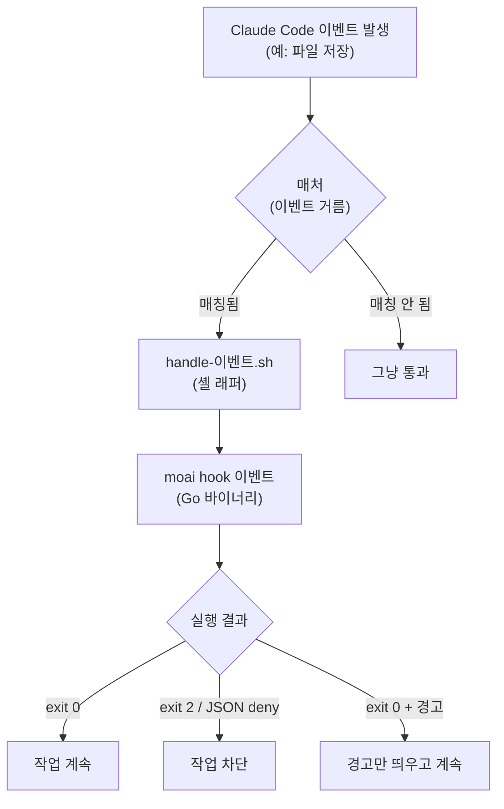
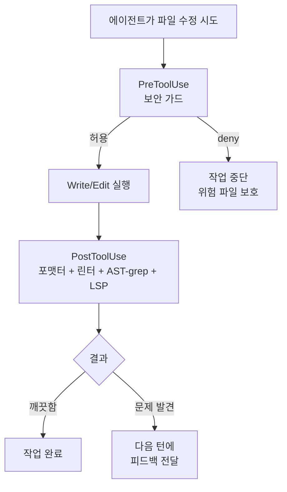

훅 (hook, 특정 이벤트에 반응해 자동으로 실행되는 갈고리) 은 Claude Code가 파일을 고치거나 명령을 내릴 때마다 끼어드는 자동 반사 신경입니다. 에이전트 (스스로 일하는 AI 도우미) 가 받아 적은 지침은 "따라야 할 권고"지만, 훅이 내놓는 결과는 "반드시 지켜야 하는 결정"입니다. MoAI-ADK가 품질 게이트와 보안 방어선을 확률이 아니라 결정론 위에 세우는 층이 바로 이 훅입니다.

이 가이드는 훅의 구조를 이해하고 (Step 1), settings.json에 연결하고 (Step 2), 보안 가드가 지키는 것을 살피고 (Step 3), 직접 커스텀 훅을 짜는 (Step 4) 네 단계로 안내합니다.


**한 줄 요약**: 훅은 Claude Code의 자동 반사 신경입니다. 파일이 바뀌면 포맷터를 돌리고, 위험한 명령은 코드가 실행되기 전에 차단합니다.



Claude Code가 제공하는 훅의 기본 동작은 [훅 (Hooks)](/ko/claude-code/extensibility/hooks) 에 있습니다. 이 문서는 그 위에 MoAI-ADK가 얹는 규칙과 실전 사용법을 다룹니다.


## 훅은 왜 '반사 신경'인가

무릎을 두드리면 다리가 올라가는 반사 신경을 생각해 봅시다. 뇌가 "다리를 올려라"라고 지시하지 않아도, 무릎이라는 자극에 반응해 다리가 알아서 움직입니다. 훅도 같습니다. Claude Code가 "파일을 저장했다"는 이벤트 (PostToolUse) 가 발생하면, 에이전트가 따로 지시하지 않아도 포맷터가 알아서 코드를 정리합니다.

지침 (CLAUDE.md, 규칙 파일) 만으로는 부족한 이유가 여기에 있습니다. 에이전트는 지침을 "읽고 반영하려 노력"할 뿐, 그것이 매번 실행된다고 보장할 수 없습니다. 반면 훅은 Claude Code가 도구를 부를 때마다 기계적으로 끼어들어, 결과를 강제로 바꿉니다. SPEC (요구사항 명세서) 이 "무엇을 만들 것인가"를 정한다면, 훅은 "그것을 만드는 과정에서 무엇을 한 번도 허용하지 않을 것인가"를 코드로 강제합니다.


```mermaid
flowchart TD
    A["Claude Code 이벤트 발생<br/>(예: 파일 저장)"] --> B{"매처<br/>(이벤트 거름)"}
    B -->|매칭됨| C["handle-이벤트.sh<br/>(셸 래퍼)"]
    B -->|매칭 안 됨| SKIP["그냥 통과"]
    C --> D["moai hook 이벤트<br/>(Go 바이너리)"]
    D --> R{"실행 결과"}
    R -->|exit 0| E["작업 계속"]
    R -->|exit 2 / JSON deny| F["작업 차단"]
    R -->|exit 0 + 경고| G["경고만 띄우고 계속"]
```

하네스 (harness, 품질 검증 자동 장치) 관점에서 보면, 훅은 에이전틱 루프의 "피드백 절반"을 담당합니다. 에이전트가 코드를 쓰고, 훅이 그 코드를 검사하고, 문제가 있으면 다음 턴의 수정 입력이 됩니다. 이 고리가 없으면 에이전트는 자기가 쓴 코드의 품질을 스스로 증명해야 하는데, 그것은 만든 쪽이 자기 결과를 채점하는 편향 구조입니다. 그래서 MoAI-ADK는 검사를 에이전트 밖으로 빼내, 훅이라는 기계적 층에 올려둡니다.

## Step 1. 훅 아키텍처 한눈에 보기

MoAI-ADK의 훅은 **셸 래퍼** (shell wrapper, 명령을 전달만 하는 얇은 스크립트) 와 **Go 바이너리** 두 겹으로 이루어집니다. settings.json이 가리키는 것은 `.claude/hooks/moai/handle-<event>.sh` 셸 래퍼이고, 이 래퍼가 표준 입력으로 받은 JSON을 `moai hook <event>` 서브커맨드에 넘겨 실제 로직을 실행합니다.

Python 런타임도, `uv` 패키지 매니저도, 가상환경도 필요 없습니다. 단일 Go 바이너리 (`moai`) 하나만 PATH에 있으면 열세 종류의 이벤트 훅이 모두 동작합니다. 바이너리가 없으면 래퍼는 조용히 종료 (exit 0) 하므로, Claude Code의 흐름을 막지 않습니다. 이것을 "fail-open" 설계라고 부릅니다 — 훅이 깨져도 세션은 멈추지 않는다는 약속입니다.

| 구성 요소 | 역할 | 예시 |
|-----------|------|------|
| settings.json `hooks` 절 | 이벤트와 셸 래퍼를 연결 | `PreToolUse → handle-pre-tool.sh` |
| `handle-<event>.sh` | stdin JSON을 받아 Go 바이너리에 전달 | `moai hook pre-tool <<< "$INPUT"` |
| `moai hook <event>` | 실제 로직 (보안 검사, 포맷팅, 린트) | Go 바이너리 안에 컴파일됨 |

MoAI-ADK가 기본으로 연결하는 열세 개 이벤트와 역할은 다음과 같습니다. (Go 바이너리는 이 외에도 총 서른여덟 개의 서브커맨드를 구현합니다. 전체 목록은 `moai hook --help`로 확인하세요.)

| 이벤트 | 실행 시점 | 대표 역할 |
|--------|-----------|-----------|
| `SessionStart` | 세션 시작 / 재개 시 | 프로젝트 상태 표시, 업데이트 확인 |
| `PreToolUse` | 도구 호출 직전 | 위험 파일·명령 차단 (보안 가드) |
| `PostToolUse` | 도구 호출 직후 | 포맷팅, 린트, AST-grep 스캔, LSP 진단 |
| `PreCompact` | `/clear` 직전 | 현재 컨텍스트를 파일로 저장 |
| `SessionEnd` | 세션 종료 시 | 메트릭 저장, 미커밋 변경 경고 |
| `Stop` | 응답 완료 후 | 루프·goal 완료 조건 판정 |
| `SubagentStop` | 하위 에이전트 완료 후 | 하위 작업 결과 처리 |
| `PermissionRequest` | 권한 대화상자 표시 시 | 자동 허용/거부 결정 |

나머지 다섯 개 (`UserPromptSubmit`, `Notification`, `TeammateIdle`, `TaskCompleted`, `SubagentStart`) 도 같은 패턴으로 연결됩니다. `Stop` 훅은 `/moai loop`와 `/moai goal`이 "끝났는가"를 매 턴 끝마다 기계적으로 판정하는 자리이기도 합니다 — 선언한 완료 조건이 충족될 때까지 세션이 계속 일하도록 만드는 장치가 이 훅 위에서 돕니다.

## Step 2. settings.json에 훅 연결하기

훅은 `.claude/settings.json` 파일의 `hooks` 절에서 연결합니다. 각 이벤트 아래에 **매처** (matcher, 도구 이름을 거르는 정규식) 를 두고, 그 아래에 실행할 셸 래퍼 경로와 타임아웃을 적습니다. 아래는 MoAI-ADK가 프로젝트에 까는 기본 `hooks` 절로, 그대로 복사해 쓸 수 있는 실행 가능한 설정입니다.

```json
{
  "hooks": {
    "SessionStart": [{
      "matcher": "",
      "hooks": [{
        "type": "command",
        "command": "\"$CLAUDE_PROJECT_DIR/.claude/hooks/moai/handle-session-start.sh\"",
        "timeout": 30
      }]
    }],
    "PreToolUse": [{
      "matcher": "Write|Edit|Bash",
      "hooks": [{
        "type": "command",
        "command": "\"$CLAUDE_PROJECT_DIR/.claude/hooks/moai/handle-pre-tool.sh\"",
        "timeout": 5
      }]
    }],
    "PostToolUse": [{
      "matcher": "Write|Edit",
      "hooks": [{
        "type": "command",
        "command": "\"$CLAUDE_PROJECT_DIR/.claude/hooks/moai/handle-post-tool.sh\"",
        "timeout": 10
      }]
    }],
    "Stop": [{
      "matcher": "",
      "hooks": [{
        "type": "command",
        "command": "\"$CLAUDE_PROJECT_DIR/.claude/hooks/moai/handle-stop.sh\""
      }]
    }]
  }
}
```

두 가지 규칙이 강제 (HARD) 적용됩니다. 첫째, `$CLAUDE_PROJECT_DIR`은 반드시 큰따옴표로 감싸야 합니다. 경로에 빈칸이 들어 있어도 깨지지 않습니다. 둘째, 각 훅마다 타임아웃을 현실적으로 잡아야 합니다. Claude Code의 플랫폼 기본값은 10분이라 방치하면 세션이 멈출 수 있고, MoAI-ADK는 이를 5초까지 줄여 달라고 권합니다.

| 매처 패턴 | 의미 |
|-----------|------|
| `""` (빈 문자열) | 모든 도구에 발화 |
| `"Write"` | Write 도구에만 |
| `"Write\|Edit"` | Write 또는 Edit |
| `"Bash"` | Bash 도구에만 |

권장 타임아웃은 훅이 하는 일에 따라 다릅니다. 보안 가드 (PreToolUse) 는 5초, 포맷터·린트 (PostToolUse) 는 10초, 세션 시작과 컨텍스트 저장 (SessionStart·PreCompact) 은 30초까지 허용됩니다. `PreCompact`는 `/clear` 직전에 현재 진행 중이던 SPEC 상태와 수정 파일 목록, 핵심 결정을 `.moai/state/` 아래에 저장해, 세션이 끊겨도 다음 세션이 하던 자리에서 이어 가게 만드는 안전망입니다.

## Step 3. 보안 가드가 지키는 것들

`PreToolUse` 훅이 실행하는 보안 가드는 파일이 수정되거나 명령이 실행되기 **직전**에 끼어들어, 되돌릴 수 없는 작업을 막습니다. 매칭되면 JSON으로 `"permissionDecision": "deny"`를 돌려주고, Claude Code는 해당 도구 호출을 중단합니다.

| 범주 | 보호 대상 | 이유 |
|------|-----------|------|
| 비밀 저장소 | `secrets/`, `*.secrets.*`, `*.credentials.*` | 민감 정보 유출 차단 |
| SSH 키 | `~/.ssh/*`, `id_rsa*`, `id_ed25519*` | 서버 접근 키 보호 |
| 인증서 | `*.pem`, `*.key`, `*.crt` | 인증서 파일 보호 |
| 클라우드 자격증명 | `~/.aws/*`, `~/.gcloud/*`, `~/.azure/*`, `~/.kube/*` | 클라우드 계정 보호 |
| Git 내부 | `.git/*` | 저장소 무결성 유지 |
| 토큰 파일 | `*.token`, `.tokens/*`, `auth.json` | 인증 토큰 보호 |

한 가지 주의할 점이 있습니다. `.env` 파일은 보호 대상이 아닙니다. 개발자가 환경 변수를 직접 편집할 수 있도록 열어 둔 의도적 설계입니다. 비밀은 비밀 저장소에, 설정은 `.env`에 둔다는 구분입니다. 보안 가드는 위험한 Bash 명령도 차단합니다 — `rm -rf /`, `rm -rf .git`, `git push --force origin main`, `docker system prune -a`, `terraform destroy`, `supabase db reset` 따위가 여기에 속합니다. 차단 응답의 형태는 다음과 같습니다.

```json
{
  "hookSpecificOutput": {
    "hookEventName": "PreToolUse",
    "permissionDecision": "deny",
    "permissionDecisionReason": "보호 대상 파일 수정 차단: ~/.ssh/id_rsa"
  }
}
```

파일이 바뀐 직후에는 `PostToolUse` 훅이 들어옵니다. 이 훅은 프로젝트 언어를 알아서 감지해 (`go.mod`, `package.json`, `pyproject.toml`, `Cargo.toml` 따위의 표식을 봅니다) 그 언어에 맞는 포맷터와 린터를 돌리고, AST-grep으로 구조적 취약점 (SQL 주입, 하드코딩된 비밀키) 을 스캔하며, LSP 진단을 모아 다음 턴의 피드백으로 돌려줍니다. 열여덟 개가 넘는 언어를 같은 흐름으로 지원합니다. 아래 그림은 보안 가드와 포맷터가 도구 호출을 앞뒤로 감싸는 모습을 보여 줍니다.


```mermaid
flowchart TD
    A["에이전트가 파일 수정 시도"] --> B["PreToolUse<br/>보안 가드"]
    B -->|허용| C["Write/Edit 실행"]
    B -->|deny| F["작업 중단<br/>위험 파일 보호"]
    C --> D["PostToolUse<br/>포맷터 + 린터 + AST-grep + LSP"]
    D --> R{"결과"}
    R -->|깨끗함| E["작업 완료"]
    R -->|문제 발견| G["다음 턴에<br/>피드백 전달"]
```

이 앞뒤 감싸기가 에이전틱 루프의 피드백 고리입니다 — 에이전트가 쓰고, 훅이 검사하고, 문제가 돌아오면 에이전트가 고칩니다. LSP 임계값과 품질 게이트 기준은 `.moai/config/sections/lsp.yaml`과 `quality.yaml`이 함께 들고 있습니다.

## Step 4. 커스텀 훅 직접 짜기

프로젝트에 맞는 자동화가 필요하면 커스텀 훅을 직접 짤 수 있습니다. 훅은 bash 셸 스크립트로 작성합니다. Claude Code가 stdin으로 JSON을 넘겨 주고, 훅이 stdout으로 JSON을 돌려주는 단순한 규약입니다. `jq` 하나면 JSON 파싱은 끝납니다.

아래는 파일이 수정된 직후 `.env` 파일이 건드려졌는지 확인해, 건드려졌으면 경고를 에이전트에게 돌려주는 PostToolUse 훅입니다. `.claude/hooks/moai/check-env.sh`로 저장하면 바로 실행할 수 있습니다.

```bash
#!/bin/bash
# .claude/hooks/moai/check-env.sh
# 커스텀 PostToolUse 훅: .env 파일 수정 시 비밀 노출 경고

# Claude Code가 넘겨주는 JSON을 표준 입력으로 읽기
input_data=$(cat)
file_path=$(echo "$input_data" | jq -r '.tool_input.file_path // ""')

# .env 파일이 아니면 그냥 통과
case "$file_path" in
  *.env) ;;
  *) exit 0 ;;
esac

# .env가 건드려졌다면 에이전트에게 맥락을 돌려줌
jq -n --arg msg ".env 파일이 수정되었습니다. 민감 정보가 노출되지 않았는지 확인하세요." \
  '{hookSpecificOutput: {hookEventName: "PostToolUse", additionalContext: $msg}}'
exit 0
```

이 훅을 가동하려면 settings.json의 `PostToolUse` 절에 한 줄 추가하면 됩니다. 기존 MoAI 훅과 나란히 두어도 충돌하지 않습니다 — Claude Code는 같은 이벤트에 묶인 훅들을 차례로 실행합니다.

```json
{
  "hooks": {
    "PostToolUse": [
      {
        "matcher": "Write|Edit",
        "hooks": [{
          "type": "command",
          "command": "\"$CLAUDE_PROJECT_DIR/.claude/hooks/moai/handle-post-tool.sh\"",
          "timeout": 10
        }]
      },
      {
        "matcher": "Write|Edit",
        "hooks": [{
          "type": "command",
          "command": "\"$CLAUDE_PROJECT_DIR/.claude/hooks/moai/check-env.sh\"",
          "timeout": 5
        }]
      }
    ]
  }
}
```

훅 응답은 용도에 따라 네 가지로 나뉩니다. `suppressOutput: true`는 아무것도 표시하지 않는 것, `hookSpecificOutput` 객체는 에이전트에게 추가 맥락을 주는 것, `permissionDecision: "allow|deny|ask"`는 PreToolUse에서 허용·차단·확인 요청을 결정하는 것입니다. exit 코드도 의미가 있습니다 — exit 0은 통과, exit 2는 차단, 그 외는 무시됩니다. 훅을 짤 때는 이 네 가지 응답 형태 가운데 목적에 맞는 하나를 골라 쓰면 됩니다.

## 훅 작성 규칙 요약


**훅을 짤 때 지킬 세 가지.** (1) `$CLAUDE_PROJECT_DIR`은 항상 큰따옴표로 감쌀 것. (2) 타임아웃을 현실적으로 잡을 것 — 보안 가드 5초, 포맷터 10초, 세션 시작 30초. (3) 바이너리가 없거나 실패해도 흐름을 끊지 않게, exit 0으로 조용히 빠질 것 (fail-open).


## 관련 문서

- [Hooks 이벤트 레퍼런스](/ko/advanced/hooks-reference)  Claude Code 이벤트 타입 전체 카탈로그
- [settings.json 가이드](/ko/advanced/settings-json)  훅 설정 방법 상세
- [CLAUDE.md 가이드](/ko/advanced/claude-md-guide)  프로젝트 지침 관리
- [에이전트 가이드](/ko/advanced/agent-guide)  에이전트와 훅의 연동
