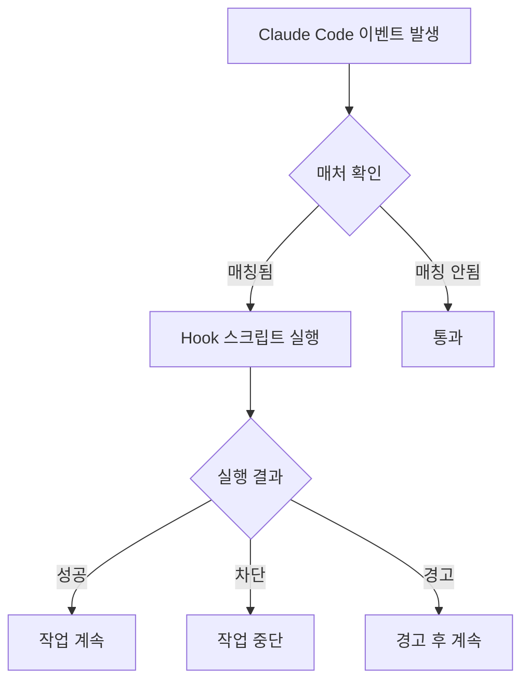
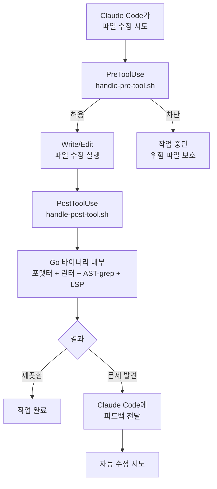

Claude Code의 Hooks 시스템과 MoAI-ADK의 기본 Hook 스크립트를 상세히 안내합니다. 에이전틱 하네스에서 프롬프트는 "따라야 할 지침"이지만 훅은 "반드시 실행되는 코드"입니다 — 품질 게이트와 보안 방어선을 확률이 아닌 결정론 위에 세우는 계층이 바로 훅입니다.


**한 줄 요약**: Hooks는 Claude Code의 **자동 반사 신경**입니다. 파일을 저장하면 자동으로 포맷팅하고, 위험한 명령은 자동으로 차단합니다.


## Hooks란?

Hooks는 Claude Code의 특정 이벤트에 반응하여 **자동으로 실행되는 스크립트**입니다.

의사의 반사 신경 검사에 비유하면, 무릎을 두드리면 (이벤트 발생) 다리가 자동으로 올라가는 것 (스크립트 실행)처럼, Claude Code가 파일을 수정하면 (PostToolUse 이벤트) 포맷터가 자동으로 실행됩니다 (코드 정리).


```mermaid
flowchart TD
    EVENT["Claude Code 이벤트 발생"] --> MATCH{매처 확인}

    MATCH -->|매칭됨| HOOK["Hook 스크립트 실행"]
    MATCH -->|매칭 안됨| SKIP["통과"]

    HOOK --> RESULT{실행 결과}
    RESULT -->|성공| CONTINUE["작업 계속"]
    RESULT -->|차단| BLOCK["작업 중단"]
    RESULT -->|경고| WARN["경고 후 계속"]
```

## Hook 이벤트 유형

이 가이드에서는 자주 쓰는 핵심 이벤트를 다룹니다. (전체 29개 이벤트는 [Hooks 이벤트 레퍼런스](/ko/advanced/hooks-reference)를 참조하세요.)

### 주요 이벤트 목록

| 이벤트 | 실행 시점 | 주요 용도 |
|--------|-----------|----------|
| `Setup` | `--init`, `--init-only`, `--maintenance` 플래그로 시작 시 | 초기 설정, 환경 점검 |
| `SessionStart` | 세션이 시작될 때 | 프로젝트 정보 표시, 환경 초기화 |
| `SessionEnd` | 세션이 종료될 때 | 정리 작업, 컨텍스트 저장 |
| `PostSession` | 세션 종료 후 (self-hosted runner, CC 2.1.169+) | 세션 후 정리/텔레메트리; 세션이 완전히 해제된 후, `SessionEnd`보다 늦게 발화합니다. MoAI-ADK는 현재 이 훅을 wiring하지 않습니다 — self-hosted 배포를 위한 사용 가능한 옵션으로 문서화됩니다. |
| `PreCompact` | 컨텍스트 압축 전 (`/clear` 등) | 중요 컨텍스트 백업 |
| `PreToolUse` | 도구 사용 전 | 보안 검증, 위험 명령 차단 |
| **`PermissionRequest`** | 권한 대화상자 표시 시 | 자동 허용/거부 결정 |
| `PostToolUse` | 도구 사용 후 | 코드 포맷팅, 린트 검사, LSP 진단 |
| **`UserPromptSubmit`** | 사용자가 프롬프트 제출 시 | 프롬프트 전처리, 검증 |
| **`Notification`** | Claude Code가 알림 전송 시 | 데스크톱 알림 커스터마이징 |
| `Stop` | 응답 완료 후 | 루프 제어, 완료 조건 확인 |
| **`SubagentStop`** | 하위 에이전트 작업 완료 후 | 하위 작업 결과 처리 |

### 이벤트 상세 설명

#### 1. Setup
Claude Code가 `--init`, `--init-only`, 또는 `--maintenance` 플래그로 시작될 때 실행됩니다. 초기 설정 작업과 환경 점검에 사용합니다.

#### 2. SessionStart
세션이 시작되거나 기존 세션을 재개할 때 실행됩니다. 프로젝트 상태 표시, 환경 초기화에 사용합니다.

#### 3. SessionEnd
Claude Code 세션이 종료될 때 실행됩니다. 정리 작업, 컨텍스트 저장, 메트릭 수집에 사용합니다.

#### 4. PreCompact
Claude Code가 컨텍스트 압축 작업 (`/clear` 명령 등)을 수행하기 전에 실행됩니다. 중요한 컨텍스트를 백업하는 데 사용합니다.

#### 5. PreToolUse
도구가 호출되기 **전**에 실행됩니다. 도구 호출을 차단하거나 수정할 수 있습니다. 보안 검증, 위험 명령 차단에 사용합니다.

#### 6. PermissionRequest
권한 대화상자가 사용자에게 표시될 때 실행됩니다. 자동으로 허용하거나 거부할 수 있습니다.

#### 7. PostToolUse
도구 호출이 **완료된 후**에 실행됩니다. 코드 포맷팅, 린트 검사, LSP 진단 수집에 사용합니다.

#### 8. UserPromptSubmit
사용자가 프롬프트를 제출할 때 실행되며, Claude가 처리하기 **전**입니다. 프롬프트 전처리, 검증에 사용합니다.

#### 9. Notification
Claude Code가 알림을 보낼 때 실행됩니다. 데스크톱 알림, 소리 알림 등으로 커스터마이징할 수 있습니다.

#### 10. Stop
Claude Code가 응답을 마쳤을 때 실행됩니다. 루프 제어, 완료 조건 확인에 사용합니다 — `/moai loop`와 goal 엔진이 이 이벤트 위에서 동작합니다.

#### 11. SubagentStop
하위 에이전트 작업이 완료되었을 때 실행됩니다. 하위 작업 결과를 처리하는 데 사용합니다.

### MoAI-ADK에서 구현된 이벤트

MoAI-ADK는 **셸 래퍼 스크립트 + Go 바이너리** 아키텍처로 훅을 구현합니다. settings.json의 `command`는 `.claude/hooks/moai/handle-<event>.sh` 셸 래퍼를 가리키고, 이 래퍼가 stdin JSON을 `moai hook <event>` Go 서브커맨드로 전달하여 실제 로직을 실행합니다. Python이나 `uv run` 의존성이 없습니다 — 셸 스크립트와 단일 Go 바이너리만으로 동작합니다.

| 이벤트 | 상태 | 셸 래퍼 | Go 서브커맨드 |
|--------|------|---------|---------------|
| `SessionStart` |  | `handle-session-start.sh` | `moai hook session-start` |
| `PreToolUse` |  | `handle-pre-tool.sh` | `moai hook pre-tool` |
| `PostToolUse` |  | `handle-post-tool.sh` | `moai hook post-tool` |
| `PreCompact` |  | `handle-compact.sh` | `moai hook compact` |
| `SessionEnd` |  | `handle-session-end.sh` | `moai hook session-end` |
| `Stop` |  | `handle-stop.sh` | `moai hook stop` |
| `SubagentStart` |  | `handle-subagent-start.sh` | `moai hook subagent-start` |
| `SubagentStop` |  | `handle-subagent-stop.sh` | `moai hook subagent-stop` |
| `PermissionRequest` |  | `handle-permission-request.sh` | `moai hook permission-request` |
| `UserPromptSubmit` |  | `handle-user-prompt-submit.sh` | `moai hook user-prompt-submit` |
| `Notification` |  | `handle-notification.sh` | `moai hook notification` |
| `TeammateIdle` |  | `handle-teammate-idle.sh` | `moai hook teammate-idle` |
| `TaskCompleted` |  | `handle-task-completed.sh` | `moai hook task-completed` |

Go 바이너리는 위 13종 외에도 `PostToolUseFailure`, `StopFailure`, `PostCompact`, `InstructionsLoaded`, `ConfigChange`, `TaskCreated`, `CwdChanged`, `FileChanged`, `PermissionDenied`, `WorktreeCreate`, `WorktreeRemove`, `Elicitation`, `ElicitationResult` 등 총 26개 서브커맨드를 구현합니다. (전체 목록은 `moai hook --help`로 확인할 수 있습니다.)

### 팀원 협업 이벤트

MoAI의 정적 Agent Teams 오케스트레이션 계층은 RETIRED되었지만, Claude Code의 네이티브 팀원 런타임(tmux pane 기반)은 여전히 지원되며 `TeammateIdle`·`TaskCompleted` 훅 이벤트가 동작합니다.

#### TeammateIdle 이벤트
팀원이 작업을 완료하고 idle 상태로 진입할 때 실행됩니다.

- `continue: false` (exit code 2) → idle 거부, 팀원이 추가 작업 수행
- `continue: true` (기본값) → idle 승인

#### TaskCompleted 이벤트
팀원이 태스크를 완료했을 때 실행됩니다.

- Exit code 2 → 완료 거부 (수정 필요)
- Exit code 0 (기본값) → 완료 승인

#### Team Shutdown Sequence [HARD]

팀 종료 시 다음 순서를 **반드시** 따르세요.

1. **shutdown_request 전송**: 각 팀원에게 `SendMessage(shutdown_request)` 전송
2. **응답 대기**: 각 팀원으로부터 `shutdown_response approve:true` 수신
3. **[HARD] tmux pane 정리**: tmux pane 명시적 종료
   - `~/.claude/teams/{team-name}/config.json` 읽기
   - 각 멤버의 `tmuxPaneId` 추출 (예: "%184")
   - `tmux kill-pane -t {paneId}` 실행 (높은 인덱스부터)

팀 디렉토리 정리는 세션 종료 시 자동으로 수행됩니다. 명시적인 teardown 호출은 필요하지 않습니다(명시적 팀 teardown 도구는 Claude Code v2.1.178에서 제거되었습니다 — 모든 세션은 암묵적 팀 하나를 가지며 정리는 자동입니다).


**왜 tmux pane 정리가 필수인가?** `shutdown_response`는 팀원을 논리적으로 완료 표시하지만 tmux pane 프로세스를 종료하지 않습니다. 팀 디렉토리 정리는 세션 종료 시 자동으로 이루어지지만, 이는 tmux pane 프로세스를 종료하지 않습니다. 명시적 pane 종료 없이는 pane이 무한히 살아있고 Leader가 "Drain" 상태로 멈춥니다.


### 이벤트 실행 순서

일반적인 파일 수정 작업에서 Hook이 실행되는 순서입니다.


```mermaid
flowchart TD
    A["Claude Code가<br>파일 수정 시도"] --> B["PreToolUse<br>handle-pre-tool.sh"]

    B -->|허용| C["Write/Edit<br>파일 수정 실행"]
    B -->|차단| BLOCK["작업 중단<br>위험 파일 보호"]

    C --> D["PostToolUse<br>handle-post-tool.sh"]
    D --> D1["Go 바이너리 내부<br>포맷터 + 린터 + AST-grep + LSP"]

    D1 --> H{결과}
    H -->|깨끗함| I["작업 완료"]
    H -->|문제 발견| J["Claude Code에<br>피드백 전달"]
    J --> K["자동 수정 시도"]
```

이 파이프라인이 에이전틱 루프의 피드백 절반을 담당합니다 — 에이전트가 쓰고, 훅이 검사하고, 문제가 있으면 다음 턴의 수정 입력이 됩니다.

## Claude Code 공식 예시

이 예시들은 Claude Code 공식 문서에서 제공하는 표준 패턴입니다.

### Bash 명령 로깅 Hook

모든 Bash 명령을 로그 파일에 기록합니다.

```json
{
  "hooks": {
    "PreToolUse": [
      {
        "matcher": "Bash",
        "hooks": [
          {
            "type": "command",
            "command": "jq -r '\"\\(.tool_input.command) - \\(.tool_input.description // \"No description\")\"' >> ~/.claude/bash-command-log.txt"
          }
        ]
      }
    ]
  }
}
```

### TypeScript 포맷팅 Hook

TypeScript 파일을 편집한 후 자동으로 Prettier를 실행합니다.

```json
{
  "hooks": {
    "PostToolUse": [
      {
        "matcher": "Edit|Write",
        "hooks": [
          {
            "type": "command",
            "command": "jq -r '.tool_input.file_path' | { read file_path; if echo \"$file_path\" | grep -q '\\.ts$'; then npx prettier --write \"$file_path\"; fi; }"
          }
        ]
      }
    ]
  }
}
```

### Markdown 포맷터 Hook

Markdown 파일의 언어 태그를 자동으로 감지하고 추가합니다.

```json
{
  "hooks": {
    "PostToolUse": [
      {
        "matcher": "Edit|Write",
        "hooks": [
          {
            "type": "command",
            "command": "\"$CLAUDE_PROJECT_DIR/.claude/hooks/markdown_formatter.sh\""
          }
        ]
      }
    ]
  }
}
```

`.claude/hooks/markdown_formatter.sh` 파일:

```bash
#!/bin/bash
# Markdown 포맷터: 코드 펜스 언어 태그 누락 수정, 과도한 빈 줄 정리

input_data=$(cat)
file_path=$(echo "$input_data" | jq -r '.tool_input.file_path // ""')

# Markdown 파일이 아니면 통과
case "$file_path" in
  *.md|*.mdx) ;;
  *) exit 0 ;;
esac

[ -f "$file_path" ] || exit 0

# 과도한 빈 줄 정리 (3줄 이상 → 2줄)
content=$(cat "$file_path")
formatted=$(echo "$content" | awk 'BEGIN{blank=0} /^$/{blank++; if(blank<=2) print; next} {blank=0; print}')

if [ "$formatted" != "$content" ]; then
  echo "$formatted" > "$file_path"
  echo "Markdown 포맷팅 수정: $file_path" >&2
fi
```

### 데스크톱 알림 Hook

Claude가 입력을 기다릴 때 데스크톱 알림을 표시합니다.

```json
{
  "hooks": {
    "Notification": [
      {
        "matcher": "",
        "hooks": [
          {
            "type": "command",
            "command": "notify-send 'Claude Code' 'Awaiting your input'"
          }
        ]
      }
    ]
  }
}
```

### 파일 보호 Hook

민감한 파일의 수정을 차단합니다.

```json
{
  "hooks": {
    "PreToolUse": [
      {
        "matcher": "Edit|Write",
        "hooks": [
          {
            "type": "command",
            "command": "f=$(jq -r '.tool_input.file_path // \"\"'); case \"$f\" in *.env|*package-lock.json|*.git/*) exit 2;; esac"
          }
        ]
      }
    ]
  }
}
```

## MoAI 기본 Hooks

MoAI-ADK는 **셸 래퍼 + Go 바이너리** 아키텍처로 Hook을 제공합니다. 각 `handle-<event>.sh` 래퍼는 stdin JSON을 `moai hook <event>` 서브커맨드로 전달하며, 포맷팅·린트·보안 스캔·LSP 진단 등의 실제 로직은 모두 Go 바이너리 내부에서 실행됩니다. Python 런타임이나 `uv` 의존성이 필요하지 않습니다.

### Hook 목록

| 셸 래퍼 | Go 서브커맨드 | 이벤트 | 매처 | 역할 | 타임아웃 |
|---------|---------------|--------|------|------|----------|
| `handle-session-start.sh` | `session-start` | SessionStart | 전체 | 프로젝트 상태 표시, 업데이트 확인 | 30초 |
| `handle-pre-tool.sh` | `pre-tool` | PreToolUse | `Write\|Edit\|Bash` | 위험 파일 수정/명령 차단 | 5초 |
| `handle-post-tool.sh` | `post-tool` | PostToolUse | `Write\|Edit` | 코드 포맷팅, 린트, AST-grep 스캔, LSP 진단 | 10초 |
| `handle-compact.sh` | `compact` | PreCompact | 전체 | `/clear` 전 컨텍스트 저장 | 30초 |
| `handle-session-end.sh` | `session-end` | SessionEnd | 전체 | 세션 종료 시 정리 작업 | 10초 |
| `handle-stop.sh` | `stop` | Stop | 전체 | 루프 제어 및 완료 확인 | 기본값 |
| `handle-subagent-stop.sh` | `subagent-stop` | SubagentStop | 전체 | 하위 에이전트 작업 결과 처리 | 기본값 |
| `handle-permission-request.sh` | `permission-request` | PermissionRequest | 전체 | 권한 자동 허용/거부 결정 | 5초 |

### SessionStart: 프로젝트 정보 표시

세션이 시작될 때 프로젝트의 현재 상태를 보여줍니다.

**표시 정보:**
- MoAI-ADK 버전 및 업데이트 여부
- 현재 프로젝트 이름과 기술 스택
- Git 브랜치, 변경 사항, 마지막 커밋
- Git 전략 (Github-Flow 모드, Auto Branch 설정)
- 언어 설정 (대화 언어)
- 이전 세션 컨텍스트 (SPEC 상태, 작업 목록)
- 개인화된 환영 메시지 또는 설정 가이드

### PreToolUse: Security Guard (보안 가드)

파일 수정/명령 실행 전에 **위험한 작업을 보호**합니다.

**보호 대상 파일:**

| 카테고리 | 보호 파일 | 이유 |
|----------|-----------|------|
| 비밀 저장소 | `secrets/`, `*.secrets.*`, `*.credentials.*` | 민감 정보 보호 |
| SSH 키 | `~/.ssh/*`, `id_rsa*`, `id_ed25519*` | 서버 접근 키 보호 |
| 인증서 | `*.pem`, `*.key`, `*.crt` | 인증서 파일 보호 |
| 클라우드 자격증명 | `~/.aws/*`, `~/.gcloud/*`, `~/.azure/*`, `~/.kube/*` | 클라우드 계정 보호 |
| Git 내부 | `.git/*` | Git 저장소 무결성 |
| 토큰 파일 | `*.token`, `.tokens/*`, `auth.json` | 인증 토큰 보호 |

**주의:** `.env` 파일은 보호하지 않습니다. 개발자가 환경 변수를 편집할 수 있도록 허용합니다.

**차단 동작:**
- 보호 대상 파일에 대한 Write/Edit 시도를 감지
- JSON 형태로 `"permissionDecision": "deny"` 응답 반환
- Claude Code가 해당 파일 수정을 중단

**위험한 Bash 명령 차단:**
- 데이터베이스 삭제: `supabase db reset`, `neon database delete`
- 위험한 파일 삭제: `rm -rf /`, `rm -rf .git`
- Docker 전체 삭제: `docker system prune -a`
- 강제 푸시: `git push --force origin main`
- Terraform 파괴: `terraform destroy`

### PostToolUse: Code Formatter (코드 포맷터)

파일 수정 후 **자동으로 코드를 정리**합니다.

**지원 언어 및 포맷터:**

| 언어 | 포맷터 (우선순위) | 설정 파일 |
|------|------------------|----------|
| Python | `ruff format`, `black` | `pyproject.toml` |
| TypeScript/JavaScript | `biome`, `prettier`, `eslint_d` | `.prettierrc`, `biome.json` |
| Go | `gofmt`, `goimports` | 기본값 |
| Rust | `rustfmt` | `rustfmt.toml` |
| Ruby | `prettier` | `.prettierrc` |
| PHP | `prettier` | `.prettierrc` |
| Java | `prettier` | `.prettierrc` |
| Kotlin | `prettier` | `.prettierrc` |
| Swift | `swiftformat` | `.swiftformat` |
| C# | `prettier` | `.prettierrc` |

**제외 대상:**
- `.json`, `.lock`, `.min.js`, `.svg` 등
- `node_modules`, `.git`, `dist`, `build` 디렉토리

### PostToolUse: Linter (린터)

파일 수정 후 **코드 품질을 자동 검사**합니다.

**지원 언어 및 린터:**

| 언어 | 린터 (우선순위) | 검사 항목 |
|------|----------------|----------|
| Python | `ruff check`, `flake8` | PEP 8, 타입 힌트, 복잡도 |
| TypeScript/JavaScript | `eslint`, `biome lint`, `eslint_d` | 코딩 표준, 잠재적 버그 |
| Go | `golangci-lint` | 코드 품질, 성능 |
| Rust | `clippy` | Rust 관용성, 성능 |

### PostToolUse: AST-grep 스캔

파일 수정 후 **구조적 보안 취약점을 스캔**합니다.

**지원 언어:**
Python, JavaScript/TypeScript, Go, Rust, Java, Kotlin, C/C++, Ruby, PHP

**스캔 패턴 예시:**
- SQL Injection 취약점 (문자열 연결 쿼리)
- 하드코딩된 비밀키 (API 키, 토큰)
- 안전하지 않은 함수 호출
- 미사용 임포트

**설정:** `.claude/skills/moai-tool-ast-grep/rules/sgconfig.yml` 또는 프로젝트 루트의 `sgconfig.yml`

### PostToolUse: LSP 진단

파일 수정 후 **LSP(Language Server Protocol) 진단 정보를 수집**합니다.

**지원 언어:**
Python, TypeScript/JavaScript, Go, Rust, Java, Kotlin, Ruby, PHP, C/C++

**Fallback 진단:**
LSP를 사용할 수 없는 경우 명령행 도구를 사용합니다:
- Python: `ruff check --output-format=json`
- TypeScript: `tsc --noEmit`

**설정:** `.moai/config/sections/ralph.yaml`

```yaml
ralph:
  enabled: true
  hooks:
    post_tool_lsp:
      enabled: true
      severity_threshold: error  # error | warning | info
```

### PreCompact: 컨텍스트 저장

`/clear` 실행 전에 **현재 컨텍스트를 파일로 저장**합니다. 컨텍스트 임계에서 세션을 끊고 이어가는 핸드오프 흐름의 안전망입니다.

**저장 위치:** `.moai/memory/context-snapshot.json`

**저장 내용:**
- 현재 활성 SPEC 상태 (ID, 단계, 진행률)
- 진행 중인 작업 목록 (TodoWrite)
- 완료된 작업 목록
- 수정된 파일 목록
- Git 상태 정보 (브랜치, 커밋되지 않은 변경)
- 핵심 결정 사항

**아카이브:** 이전 스냅샷은 `.moai/memory/context-archive/`에 자동 보관됩니다.

### SessionEnd: 자동 정리

세션 종료 시 다음 작업을 수행합니다.

**P0 작업 (필수):**
- 세션 메트릭 저장 (수정 파일 수, 커밋 수, 작업한 SPEC)
- 작업 상태 스냅샷 저장 (`.moai/memory/last-session-state.json`)
- 커밋되지 않은 변경 경고

**P1 작업 (선택):**
- 임시 파일 정리 (7일 이상 된 파일)
- 캐시 파일 정리
- 루트 디렉토리 문서 관리 위반 스캔
- 세션 요약 생성

### Stop: 루프 제어기

Ralph Engine 피드백 루프를 제어합니다. `/moai loop`가 "다 고칠 때까지 반복"할 수 있는 것은 이 훅이 매 턴 종료 시점에 완료 조건을 기계적으로 판정하기 때문입니다.

**완료 조건 확인:**
- LSP 오류 수 (0 오류 목표)
- LSP 경고 수
- 테스트 통과 여부
- 커버리지 목표 (기본 85%)
- 완료 문장 감지 (자연어 루프 종료 신호)

**상태 파일:** `.moai/cache/.moai_loop_state.json`

**설정:** `.moai/config/sections/ralph.yaml`

```yaml
ralph:
  enabled: true
  loop:
    max_iterations: 10
    auto_fix: false
    completion:
      zero_errors: true
      zero_warnings: false
      tests_pass: true
      coverage_threshold: 85
```

### Quality Gate with LSP

LSP 진단을 사용하여 품질 게이트를 검증합니다.

**품질 기준:**
- 최대 오류 수: 0 (기본값)
- 최대 경고 수: 10 (기본값)
- 타입 오류: 0 허용
- 린트 오류: 0 허용

**설정:** `.moai/config/sections/quality.yaml`

```yaml
constitution:
  quality_gate:
    max_errors: 0
    max_warnings: 10
    enabled: true
```

**결과 예시:**
```json
{
  "lsp_errors": 0,
  "lsp_warnings": 2,
  "type_errors": 0,
  "lint_errors": 0,
  "passed": true,
  "reason": "Quality gate passed: LSP diagnostics clean"
}
```

## Go 바이너리 아키텍처

MoAI Hooks의 공유 로직은 Python `lib/` 디렉토리가 아닌 **`moai` Go 바이너리 내부**에 컴파일됩니다. 셸 래퍼(`handle-<event>.sh`)는 얇은 전달 계층일 뿐이며, 다음 기능들이 모두 Go 바이너리 안에 구현되어 있습니다:

- **16개 언어 포맷터/린터 레지스트리**: 프로젝트 언어 자동 감지 후 해당 도구 체인 실행 (Go: gofmt/golangci-lint, Python: ruff/black, Rust: cargo fmt/clippy 등)
- **Git 데이터 수집**: 브랜치·변경 사항·커밋 정보 캐싱으로 반복 쿼리 최적화
- **통합 타임아웃 관리**: 각 훅 이벤트별 타임아웃과 우아한 저하 처리
- **컨텍스트 스냅샷**: `/clear` 전 컨텍스트 아카이브, 메모리 페이로드 생성
- **LSP 진단 수집**: 언어 서버 프로토콜 기반 진단 결과 집계

이 아키텍처의 이점: Python 런타임(`uv`, 가상환경) 설치가 불필요하며, 단일 바이너리(`moai`)만 PATH에 있으면 모든 훅이 동작합니다. 바이너리가 없을 경우 래퍼는 안전하게 종료(exit 0)하여 Claude Code 흐름을 차단하지 않습니다.

## settings.json에서 Hook 설정

Hooks는 `.claude/settings.json` 파일의 `hooks` 섹션에서 설정합니다.

```json
{
  "hooks": {
    "SessionStart": [
      {
        "matcher": "",
        "hooks": [
          {
            "type": "command",
            "command": "\"$CLAUDE_PROJECT_DIR/.claude/hooks/moai/handle-session-start.sh\"",
            "timeout": 30
          }
        ]
      }
    ],
    "PreToolUse": [
      {
        "matcher": "Write|Edit|Bash",
        "hooks": [
          {
            "type": "command",
            "command": "\"$CLAUDE_PROJECT_DIR/.claude/hooks/moai/handle-pre-tool.sh\"",
            "timeout": 5
          }
        ]
      }
    ],
    "PostToolUse": [
      {
        "matcher": "Write|Edit",
        "hooks": [
          {
            "type": "command",
            "command": "\"$CLAUDE_PROJECT_DIR/.claude/hooks/moai/handle-post-tool.sh\"",
            "timeout": 10
          }
        ]
      }
    ],
    "PreCompact": [
      {
        "matcher": "",
        "hooks": [
          {
            "type": "command",
            "command": "\"$CLAUDE_PROJECT_DIR/.claude/hooks/moai/handle-compact.sh\"",
            "timeout": 30
          }
        ]
      }
    ],
    "SessionEnd": [
      {
        "matcher": "",
        "hooks": [
          {
            "type": "command",
            "command": "\"$CLAUDE_PROJECT_DIR/.claude/hooks/moai/handle-session-end.sh\"",
            "timeout": 10
          }
        ]
      }
    ],
    "Stop": [
      {
        "matcher": "",
        "hooks": [
          {
            "type": "command",
            "command": "\"$CLAUDE_PROJECT_DIR/.claude/hooks/moai/handle-stop.sh\""
          }
        ]
      }
    ]
  }
}
```

### 설정 구조

| 필드 | 설명 | 예시 |
|------|------|------|
| `matcher` | 도구 이름 매칭 패턴 (정규식) | `"Write\|Edit"` |
| `type` | Hook 유형 | `"command"` |
| `command` | 실행할 명령어 | Shell 스크립트 경로 |
| `timeout` | 실행 제한 시간 (밀리초) | `5000` (5초) |

### 매처 패턴

| 패턴 | 설명 |
|------|------|
| `""` (빈 문자열) | 모든 도구에 매칭 |
| `"Write"` | Write 도구에만 매칭 |
| `"Write\|Edit"` | Write 또는 Edit 도구에 매칭 |
| `"Bash"` | Bash 도구에만 매칭 |

## 커스텀 Hook 작성법

### 기본 템플릿

커스텀 Hook 스크립트는 셸 스크립트(bash)로 작성할 수 있습니다. Claude Code는 stdin으로 JSON 데이터를 전달하고, stdout으로 JSON 응답을 기대합니다. `jq`를 사용하면 JSON 파싱이 간단합니다.

```bash
#!/bin/bash
# 커스텀 PostToolUse Hook: 파일 수정 후 특정 검사 수행

# stdin에서 Hook 입력 데이터 읽기
input_data=$(cat)
file_path=$(echo "$input_data" | jq -r '.tool_input.file_path // ""')

# 검사 로직
if [[ "$file_path" == *.env ]]; then
  # 위험 파일 감지 시 Claude Code에 피드백 전달
  jq -n --arg msg ".env 파일이 수정되었습니다. 민감 정보가 노출되지 않았는지 확인하세요." \
    '{hookSpecificOutput: {hookEventName: "PostToolUse", additionalContext: $msg}}'
  exit 0
fi

# 문제 없으면 출력 억제
echo '{"suppressOutput": true}'
```

### Hook 응답 형식

| 필드 | 값 | 동작 |
|------|-----|------|
| `suppressOutput` | `true` | 아무것도 표시 안 함 |
| `hookSpecificOutput` | 객체 | 추가 컨텍스트 제공 |
| `permissionDecision` | `"allow"` | 작업 허용 (PreToolUse) |
| `permissionDecision` | `"deny"` | 작업 차단 (PreToolUse) |
| `permissionDecision` | `"ask"` | 사용자 확인 요청 (PreToolUse) |

### Hook 입력 데이터

Hook 스크립트는 표준 입력 (stdin)으로 JSON 데이터를 받습니다.

```json
{
  "tool_name": "Write",
  "tool_input": {
    "file_path": "/path/to/file.py",
    "content": "파일 내용..."
  },
  "tool_output": "파일 출력 결과 (PostToolUse에서만)"
}
```

## Hook 디렉토리 구조

```
.claude/hooks/moai/
├── handle-session-start.sh          # SessionStart → moai hook session-start
├── handle-pre-tool.sh               # PreToolUse → moai hook pre-tool
├── handle-post-tool.sh              # PostToolUse → moai hook post-tool
├── handle-compact.sh                # PreCompact → moai hook compact
├── handle-post-compact.sh           # PostCompact → moai hook post-compact
├── handle-session-end.sh            # SessionEnd → moai hook session-end
├── handle-stop.sh                   # Stop → moai hook stop
├── handle-stop-goal.sh              # Stop (goal 엔진) → moai hook stop-goal
├── handle-stop-failure.sh           # StopFailure → moai hook stop-failure
├── handle-subagent-start.sh         # SubagentStart → moai hook subagent-start
├── handle-subagent-stop.sh          # SubagentStop → moai hook subagent-stop
├── handle-notification.sh           # Notification → moai hook notification
├── handle-user-prompt-submit.sh     # UserPromptSubmit → moai hook user-prompt-submit
├── handle-permission-request.sh     # PermissionRequest → moai hook permission-request
├── handle-permission-denied.sh      # PermissionDenied → moai hook permission-denied
├── handle-teammate-idle.sh          # TeammateIdle → moai hook teammate-idle
├── handle-task-completed.sh         # TaskCompleted → moai hook task-completed
├── handle-task-created.sh           # TaskCreated → moai hook task-created
├── handle-config-change.sh          # ConfigChange → moai hook config-change
├── handle-cwd-changed.sh            # CwdChanged → moai hook cwd-changed
├── handle-file-changed.sh           # FileChanged → moai hook file-changed
├── handle-instructions-loaded.sh    # InstructionsLoaded → moai hook instructions-loaded
├── handle-worktree-create.sh        # WorktreeCreate → moai hook worktree-create
├── handle-worktree-remove.sh        # WorktreeRemove → moai hook worktree-remove
├── handle-elicitation.sh            # Elicitation → moai hook elicitation
├── handle-elicitation-result.sh     # ElicitationResult → moai hook elicitation-result
├── handle-post-tool-failure.sh      # PostToolUseFailure → moai hook post-tool-failure
├── handle-agent-hook.sh             # Agent 훅 범용 래퍼
├── status-transition-ownership.sh    # SPEC 상태 전환 감사 (PostToolUse)
├── handle-harness-observe-stop.sh   # 하네스 관찰 (Stop)
├── handle-harness-observe-subagent-stop.sh  # 하네스 관찰 (SubagentStop)
└── handle-harness-observe-user-prompt-submit.sh  # 하네스 관찰 (UserPromptSubmit)
```


**주의**: Hook 스크립트의 타임아웃을 너무 길게 설정하면 Claude Code의 응답이 느려집니다. 보안 가드(pre-tool)는 5초, 포맷터·린트(post-tool)는 10초 이내를 권장합니다. SessionStart와 PreCompact는 컨텍스트 로딩을 위해 30초까지 허용됩니다.


## 환경 변수로 Hook 비활성화

특정 Hook을 환경 변수로 비활성화할 수 있습니다.

| Hook | 환경 변수 |
|------|-----------|
| AST-grep 스캔 | `MOAI_DISABLE_AST_GREP_SCAN=1` |
| LSP 진단 | `MOAI_DISABLE_LSP_DIAGNOSTIC=1` |
| 루프 제어기 | `MOAI_DISABLE_LOOP_CONTROLLER=1` |

```bash
export MOAI_DISABLE_AST_GREP_SCAN=1
```

## 관련 문서

- [Hooks 이벤트 레퍼런스](/ko/advanced/hooks-reference) - 29개 이벤트 전체 레퍼런스
- [settings.json 가이드](/ko/advanced/settings-json) - Hook 설정 방법
- [CLAUDE.md 가이드](/ko/advanced/claude-md-guide) - 프로젝트 지침 관리
- [에이전트 가이드](/ko/advanced/agent-guide) - 에이전트와 Hook 연동


**팁**: Hook은 MoAI-ADK의 품질 보장 핵심입니다. 코드 포맷팅과 린트 검사를 자동화하여 개발자가 로직에만 집중할 수 있게 합니다. 커스텀 Hook을 추가하여 프로젝트에 맞는 자동화를 구축하세요.

