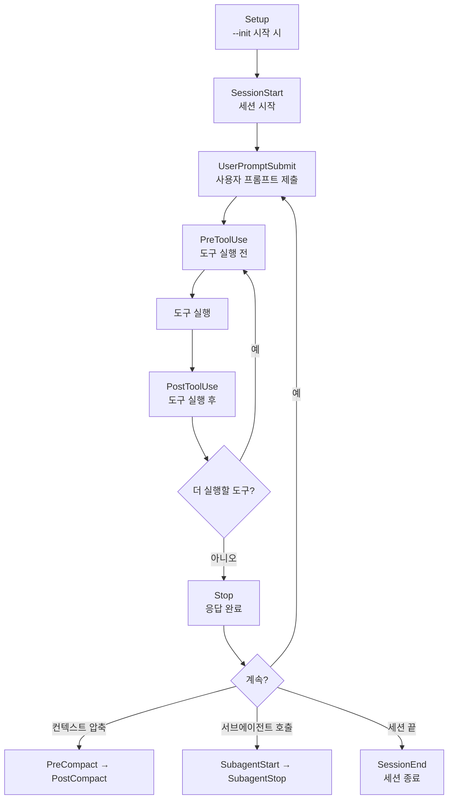
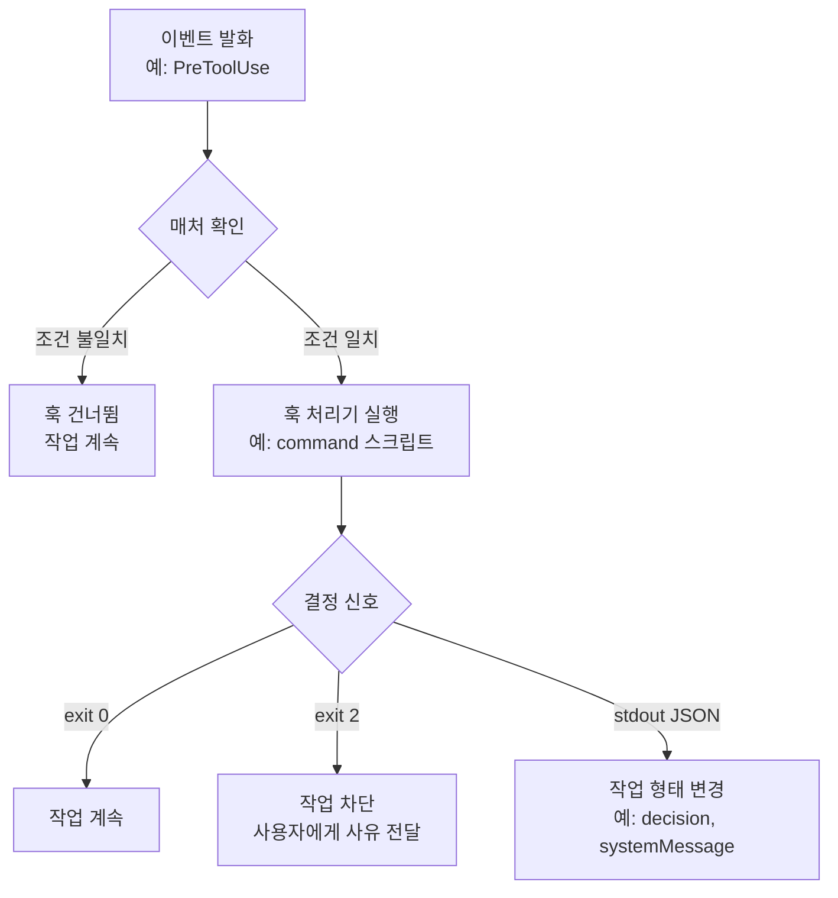

훅(hook, 특정 이벤트에 반응해 자동으로 실행되는 갈고리)은 Claude Code가 정해진 순간에 조건 없이 코드를 실행하게 만드는 결정적 제어 지점입니다. MoAI-ADK가 품질 게이트와 보안 방어선을 "지켜야 할 지침"이 아니라 "반드시 실행되는 코드"로 세우는 계층이 바로 이 훅입니다. 프롬프트는 모델이 따를 수도 있고 따르지 않을 수도 있는 지시문이지만, 훅은 이벤트가 발생하면 무조건 돕니다 — 이 차이가 하네스(품질 검증 자동 장치)의 신뢰를 확률이 아니라 결정론 위에 올려놓습니다.

이 페이지는 Claude Code의 30개 이벤트 타입 전체 카탈로그와 MoAI-ADK가 그 위에 얹은 스마트 동작을 정리한 레퍼런스입니다. 훅의 기본 개념과 설정 방법은 [Hooks 가이드](/ko/advanced/hooks-guide)에서 다루고, 설정 파일 구조는 [settings.json 가이드](/ko/advanced/settings-json)에서 다룹니다.


**한 줄 요약:** 훅은 Claude Code의 자동 반사 신경입니다. 무릎을 두드리면 다리가 올라가듯, 파일이 저장되면 포매터가 돌고, 위험 명령이 감지되면 실행이 멈춥니다. 30개의 이벤트 지점마다 원하는 동작을 걸어둘 수 있습니다.


## 프롬프트와 훅 — 결정론의 차이

에이전틱 개발에서 "이 작업은 반드시 이렇게 처리해라"라는 요구를 전달하는 방법은 두 가지입니다. 첫째는 프롬프트로 지시문을 쓰는 것이고, 둘째는 훅으로 코드를 거는 것입니다.

프롬프트는 자연어 지시문입니다. "커밋하기 전에 반드시 테스트를 실행해"라고 써 놓아도, 모델이 컨텍스트가 길어지거나 주의가 흐트러지면 그 지시를 건너뛸 수 있습니다. 반면 훅은 `PreToolUse` 같은 정해진 이벤트에 결합된 실행 코드입니다 — 모델이 도구를 부르는 순간, 조건 없이 훅 스크립트가 먼저 돕니다. 프롬프트가 "부탁"이라면 훅은 "자동 반사"입니다.

이 차이가 왜 중요한가. 품질 게이트를 프롬프트에만 의존하면, 게이트 통과 여부가 모델의 주의력에 달립니다 — 곧 확률이 됩니다. 훅으로 같은 게이트를 세우면, 통과 여부가 코드의 실행 결과에 달립니다 — 곧 결정론이 됩니다. MoAI-ADK가 SPEC(요구사항 명세서) 워크플로우의 품질 검증을 훅으로 구현하는 이유가 여기에 있습니다.

## 세션을 관통하는 이벤트 지도

30개 이벤트는 개발 세션이 시작해서 끝날 때까지 흩어져 있습니다. 어느 순간에 어떤 이벤트가 발화하는지를 한눈에 보면, 자신이 걸고 싶은 자동화를 어디에 달아야 할지 알 수 있습니다.

이 흐름은 단일 세션의 뼈대입니다. 실제로는 팀 모드의 `TeammateIdle`과 `TaskCompleted`, 환경 변화의 `ConfigChange`와 `FileChanged`, 그리고 권한 관련 `PermissionRequest`와 `PermissionDenied`가 이 뼈대 위에 겹쳐 발화합니다. 자신이 자동화하고 싶은 일이 "도구를 부르기 전"인지 "응답을 마친 뒤"인지를 먼저 정하면, 거기에 맞는 이벤트가 자연스럽게 좁혀집니다.

## 다섯 가지 훅 타입 — 무엇이 실행되는가

이벤트가 발화하면, 그 지점에 어떤 종류의 처리기를 걸지 선택할 수 있습니다. 처리기의 종류는 다섯 가지입니다.

| 타입 | 실행 내용 | 어울리는 용도 |
|------|----------|--------------|
| **command** | 셸 스크립트 실행 | 포맷터, 린터, 품질 게이트처럼 결정론이 필요한 검사 |
| **prompt** | LLM이 프롬프트 텍스트 평가 | 자연어 판단이 필요한 정성 검토 |
| **agent** | 서브에이전트가 작업 검증 | 독립 컨텍스트에서의 이중 확인 |
| **http** | 웹훅 엔드포인트로 POST 전달 | 외부 시스템 알림, 원격 로깅 |
| **mcp_tool** | MCP 서버 도구 원격 호출 | 외부 도구 체인 연동 |

MoAI-ADK가 등록하는 훅은 거의 전부 `command` 타입입니다 — 셸 스크립트로 작성된 결정론적 검사이기 때문입니다. `prompt`와 `agent` 타입은 모델의 판단을 끌어오므로, "반드시 실행된다"는 보장은 유지하지만 "반드시 같은 결과"라는 보장은 약해집니다. 그래서 품질 게이트에는 `command`가 기본입니다.

## 훅이 발화하는 흐름 — 매처에서 결정까지

이벤트가 발화했다고 해서 등록된 모든 훅이 다 도는 것은 아닙니다. 매처(matcher)가 이벤트를 걸러 주고, 처리기가 실행된 뒤 내놓는 결과가 다음 동작을 결정합니다.

매처가 없으면 해당 이벤트에 달린 모든 훅이 매번 도므로 실행 비용이 늘어납니다. 그래서 "Bash 도구를 부를 때만", "특정 에러 타입일 때만"처럼 범위를 좁히는 것이 기본입니다. 결정 신호는 세 가지입니다 — 통과(exit 0), 차단(exit 2), 그리고 표준 출력으로 내보내는 구조화된 JSON입니다. JSON 신호는 단순한 통과와 차단을 넘어 "경고만 남기고 계속"이나 "사용자에게 메시지 표시" 같은 미세한 조정을 가능하게 합니다.

## 이벤트 30개 — 아홉 가지 상황

30개 이벤트는 발생하는 상황에 따라 아홉 묶음으로 나뉩니다. 각 묶음은 개발 세션의 한 층면을 담당합니다.

### 라이프사이클 — 세션의 시작과 끝

세션과 에이전트(스스로 일하는 AI 도우미), 그리고 정지의 경계를 잡는 이벤트입니다.

| 이벤트 | 설명 | 매처 |
|--------|------|------|
| `SessionStart` | 세션이 시작될 때 | — |
| `SessionEnd` | 세션이 종료될 때 | — |
| `Setup` | `--init` 계열 플래그로 시작 시 | — |
| `Stop` | 에이전트가 응답을 마쳤을 때 | — |
| `SubagentStart` | 서브에이전트가 시작할 때 | — |
| `SubagentStop` | 서브에이전트가 정지할 때 | — |
| `StopFailure` | 정지가 실패했을 때 | `errorType` |

`Stop`은 자율 루프의 핵심 발화 지점입니다 — `/moai goal`이 완료 조건을 평가하는 순간이 바로 이 이벤트입니다.

### 도구 — 실행의 직전과 직후

도구 호출을 둘러싼 이벤트로, 품질 게이트와 보안 검사가 대부분 여기에 달립니다.

| 이벤트 | 설명 | 매처 |
|--------|------|------|
| `PreToolUse` | 도구 실행 직전 | `toolName` |
| `PostToolUse` | 도구 실행 직후 | `toolName` |
| `PostToolUseFailure` | 도구 실행 실패 시 | `toolName`, `errorType` |
| `PostToolBatch` | 병렬 도구 배치 실행 후 (v2.1.89+) | — |

`PreToolUse`에 위험 명령 차단을 걸고, `PostToolUse`에 포맷터와 메트릭 로깅을 거는 것이 가장 흔한 패턴입니다.

### 컨텍스트 — 압축과 로드

컨텍스트 창 관리를 다루는 이벤트입니다.

| 이벤트 | 설명 | 매처 |
|--------|------|------|
| `PreCompact` | 컨텍스트 압축 직전 | — |
| `PostCompact` | 컨텍스트 압축 직후 | — |
| `InstructionsLoaded` | 인스트럭션 로드 완료 | — |

`PostCompact`에 세션 메모 복원을 거는 이유가 있습니다 — 압축은 토큰을 아끼는 대신 정보를 잃을 수 있어서, 핵심 정보만큼은 자동으로 되살려야 하기 때문입니다.

### 입력 — 사용자 프롬프트와 대화

사용자 입력과 대화 흐름을 다루는 이벤트입니다.

| 이벤트 | 설명 | 매처 |
|--------|------|------|
| `UserPromptSubmit` | 사용자 프롬프트 제출 | — |
| `UserPromptExpansion` | 슬래시 커맨드 프롬프트 확장 (v2.1.90+) | — |
| `Elicitation` | Elicitation 시작 | — |
| `ElicitationResult` | Elicitation 완료 | — |

### 보안 — 권한의 요청과 거부

권한 결정을 둘러싼 이벤트입니다.

| 이벤트 | 설명 | 매처 |
|--------|------|------|
| `PermissionRequest` | 권한 요청 시 | `toolName` |
| `PermissionDenied` | 권한 거부 시 | `toolName` |

### 팀 — 동료와 작업

네이티브 teammate 런타임(`moai cg`의 tmux 분할 창)에서 발화하는 이벤트입니다.

| 이벤트 | 설명 | 매처 |
|--------|------|------|
| `TeammateIdle` | 팀원이 유휴 상태로 전환 | — |
| `TaskCompleted` | 태스크가 완료로 표시됨 | — |
| `TaskCreated` | 태스크가 생성됨 | — |

`TeammateIdle`에 LSP 품질 게이트 검증을 거는 것은, 팀원이 "작업 끝"이라고 멈추기 전에 코드가 품질 기준을 통과했는지 확인하기 위해서입니다.

### 워크트리 — 격리 공간의 생성과 삭제

| 이벤트 | 설명 | 매처 |
|--------|------|------|
| `WorktreeCreate` | 워크트리 생성 | — |
| `WorktreeRemove` | 워크트리 삭제 | — |

### 환경 — 설정과 파일의 변화

| 이벤트 | 설명 | 매처 |
|--------|------|------|
| `ConfigChange` | 설정 변경 | `configSource` |
| `CwdChanged` | 작업 디렉터리 변경 | — |
| `FileChanged` | 파일 변경 | — |

### UI — 알림과 메시지

| 이벤트 | 설명 | 매처 |
|--------|------|------|
| `Notification` | 사용자 알림 | — |
| `MessageDisplay` | 어시스턴트 메시지 표시 중 (스트리밍 발화) | — |

## 스마트 동작 — 상황을 읽는 훅

MoAI-ADK 훅은 단순한 이벤트 처리에 그치지 않고 상황에 맞게 판단합니다. 매처가 "언제"를 걸러주면, 스마트 동작은 "어떻게"를 다듬습니다.

**PermissionDenied 자동 재시도** — 읽기 전용 도구(Read, Grep, Glob)의 권한이 거부되면 훅이 알아서 재시도를 겁니다. 백그라운드 에이전트에서 권한 프롬프트가 뜨지 않아 멈춰버리는 문제를 덜어주는 장치입니다.

**StopFailure 에러 타입별 대응** — 에이전트 정지가 실패하면 에러 타입에 따라 다르게 대응합니다. 그래서 오래 이어지는 세션도 안정적으로 유지됩니다.

**PostCompact 세션 메모 복원** — 컨텍스트 압축이 끝나면 중요한 세션 메모(진행 상태, SPEC 참조)를 자동으로 되살립니다. 압축은 토큰을 아끼는 대신 정보를 잃을 수 있는 작업인데, 이 훅이 핵심 정보만큼은 지켜냅니다.

**SubagentStart 컨텍스트 주입** — 서브에이전트가 시작할 때 필요한 컨텍스트(프로젝트 규칙, MX 태그, 진행 상태)를 자동으로 넣어줍니다. 그래서 서브에이전트가 매번 맥락을 다시 물어보지 않아도 됩니다.

## 매처 — 훅의 범위를 좁히는 필터

매처를 쓰면 특정 조건에서만 훅이 실행되도록 걸러낼 수 있습니다. 모든 이벤트에 훅을 걸면 그만큼 실행 비용이 늘어나므로, 매처로 범위를 좁히는 것이 기본입니다. 설정은 `settings.json`의 `hooks` 섹션에서, 각 이벤트 아래 `matcher` 필드로 지정합니다 — 예컨대 `PreToolUse`에 `toolName` 값을 `"Bash"`로 주면 Bash 도구를 부를 때만 해당 훅이 돕니다. 구체적인 설정 구조와 예시는 [Hooks 가이드](/ko/advanced/hooks-guide)와 [settings.json 가이드](/ko/advanced/settings-json)에서 다룹니다.

| 매처 필드 | 적용 이벤트 | 설명 |
|----------|-----------|------|
| `toolName` | PreToolUse, PostToolUse, PostToolUseFailure, PermissionRequest, PermissionDenied | 도구 이름으로 필터 |
| `errorType` | StopFailure, PostToolUseFailure | 에러 유형으로 필터 |
| `configSource` | ConfigChange | 설정 소스로 필터 |

## CLAUDE_ENV_FILE — 환경 변수를 세션에 유지

`CwdChanged`와 `FileChanged` 훅으로 환경 변수를 계속 관리할 수 있습니다. Claude Code가 `$CLAUDE_ENV_FILE` 변수로 가리키는 파일에 환경 변수를 한 줄씩 쓰면, 세션이 바뀌어도 그 값이 유지됩니다. 디렉터리를 옮길 때마다 `MOAI_PROJECT_DIR` 같은 변수를 자동으로 다시 잡아주는 식으로 씁니다 — 이렇게 해두면 환경이 파일 시스템 상태를 따라가게 됩니다. 설정 예시는 [settings.json 가이드](/ko/advanced/settings-json)에서 확인하세요.

## MoAI-ADK가 사용하는 훅

MoAI-ADK는 자체 품질 게이트와 자율 루프를 훅 위에 올려 놓습니다. 등록된 주요 훅이 어느 이벤트에 물려 있고 어떤 역할을 하는지를 알면, 자신의 프로젝트에서 같은 패턴을 참고할 수 있습니다.

| 이벤트 | MoAI 핸들러 | 역할 |
|--------|-----------|------|
| `SessionStart` | `handle-session-start.sh` | Statusline 초기화, 메트릭 세션 시작 |
| `PostToolUse` | `handle-post-tool.sh` | Task 메트릭 로깅 |
| `PostToolUse` | `status-transition-ownership.sh` | SPEC frontmatter status 전환 감사 로깅 (advisory) |
| `TeammateIdle` | `handle-teammate-idle.sh` | LSP 품질 게이트 검증 |
| `TaskCompleted` | `handle-task-completed.sh` | SPEC 문서 존재 확인 |
| `TaskCompleted` | `team-ac-verify.sh` | team 모드 per-AC PASS 증거 파일 검증 (기본 휴면) |
| `UserPromptSubmit` | `handle-user-prompt-submit.sh` | 프롬프트 전처리 |
| `Stop` | `handle-stop-goal.sh` | goal 엔진 — `/moai goal` 자율 지속 조건 평가 |
| `Stop` | `sync-phase-quality-gate.sh` | sync-phase 품질 게이트 (lint + test + coverage delta) |
| `Stop`/`SubagentStop`/`UserPromptSubmit` | `handle-harness-observe-*.sh` | self-evolving 하네스 관찰 |
| `WorktreeCreate`/`WorktreeRemove` | (MoAI 비등록) | Claude Code 기본 worktree 동작 사용 |

`Stop` 이벤트에 두 개의 MoAI 핸들러가 물려 있다는 점이 눈에 띕니다 — 하나는 자율 루프의 완료 조건을 평가하고(`handle-stop-goal.sh`), 다른 하나는 sync 단계의 품질 게이트를 검사합니다(`sync-phase-quality-gate.sh`). 같은 이벤트에 여러 훅을 거는 것은 정상적인 패턴이며, 각 훅은 독립적으로 판단합니다.

`WorktreeCreate`와 `WorktreeRemove`는 MoAI가 자체 핸들러를 등록하지 않은 이벤트입니다 — Claude Code의 기본 worktree 동작에 맡겨 둡니다. 등록한다면 생성 쪽은 active creator 컨트랙트(디렉터리 생성 후 경로를 표준 출력으로 알림), 삭제 쪽은 observer-only 컨트랙트(출력 불필요)를 지켜야 합니다.

## 다음 단계

- [Hooks 가이드](/ko/advanced/hooks-guide) — 훅 기본 개념과 설정 방법, 자주 쓰는 이벤트 해설
- [settings.json 가이드](/ko/advanced/settings-json) — `hooks` 섹션 전체 구조와 설정 예시
- [CLI 레퍼런스](/ko/getting-started/cli) — `moai hook` 명령어 상세
