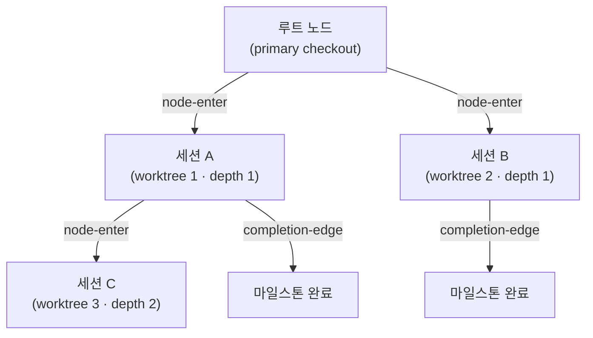
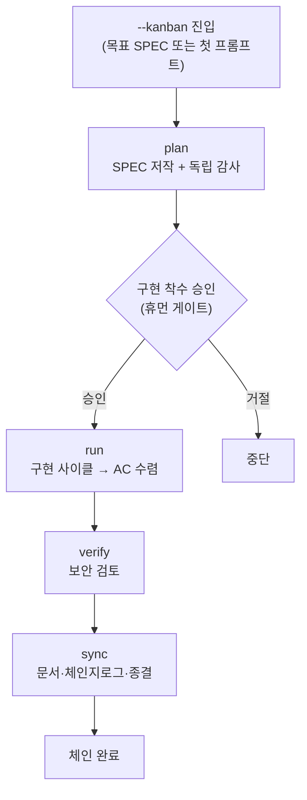



# 칸반 모드 (Kanban Mode)


 <strong>소속 가치</strong>: 에이전틱 루프 엔지니어링 · 다중 세션 오케스트레이션

<!-- @value: self-learning, multi-session-orchestration -->

칸반 모드는 한 번에 한 SPEC을 단일 세션으로 밀고 가던 구 모델을 **다중 세션 보드**로 바꿉니다. 리드 세션 하나가 지휘하고, 동반 세션들이 각자의 worktree에서 동시에 일하며, 완료된 카드가 보드를 타고 흘러갑니다. 그 보드의 뼈대가 Origin-Trail Chain입니다.

세션 런처에 `--kanban`(짧게 `-k`) 스위치를 붙여 시작합니다. 새 하위 명령도, 새 런타임도 아닙니다 — 칸반 체인(`kanban_chain`)이라는 골 프리셋(완료 조건을 미리 정해 둔 묶음)이 올라타는 진입 계약일 뿐입니다. 체인의 네 단계(plan → run → verify → sync)와 휴먼 게이트는 기존 `/moai goal` 엔진과 `full-pipeline` 체이닝 규칙을 그대로 상속합니다.

이 페이지는 칸반 모드의 진입 조건, Origin-Trail Chain 설계, 체인 단계, 그리고 "무엇이 자동화되지 않는가"까지를 다룹니다. 워크플로우 명령 관점의 짧은 소개는 [`/moai` 통합 명령](/ko/workflow-commands/)을 먼저 보세요.

## 왜 "칸반"인가


**비유**: 칸반 보드의 각 카드는 하나의 worktree 세션입니다. 카드가 보드 위를 흐르듯, 세션이 체인을 타고 흐릅니다.


구 모델에서는 한 SPEC을 한 세션이 처음부터 끝까지 도맡았습니다 — plan을 쓰고, run으로 구현하고, verify로 검토하고, sync로 문서를 정리합니다. SPEC이 커지면 한 세션이 감당하기 어렵고, 컨텍스트 윈도우 한계에 부딪히면 세션을 나눠야 합니다.

칸반 모드는 이 구조를 **보드 관점**으로 바꿉니다:

- **리드 세션** 하나가 plan을 쓰고 진행을 조율합니다.
- **run 세션** 여럿이 각자의 worktree에서 병렬로 구현합니다.
- 각 세션은 보드의 **카드**이고, 카드는 단계를 거치며 흘러갑니다.

이 다중 세션 보드가 작동하려면 "이 세션은 어디서 왔는가", "부모 세션은 살아 있는가", "어디까지 마쳤는가"를 잃지 않아야 합니다. 이 역할을 **Origin-Trail Chain**이 맡습니다.

## Origin-Trail Chain — 설계 방향

Origin-Trail Chain은 다중 세션 worktree 계보(lineage)를 추적하는 append-only 트리입니다. 각 worktree 세션이 노드가 되고, 부모-자식 에지가 "이 세션은 저 세션에서 갈라졌다"를 기록합니다.

### append-only JSONL 이벤트 스트림

체인은 `.moai/state/chain/events.jsonl`에 저장됩니다. 모든 쓰기는 `O_APPEND`로 한 줄씩 덧붙입니다 — 덮어쓰기도, 잘라내기도 없습니다. 커널이 동시 append를 직렬화하므로, 여러 세션이 동시에 써도 한 줄이 다른 줄을 깨뜨리지 않습니다.



세 가지 이벤트 타입이 스트림에 기록됩니다:

| 이벤트 | 기록 시점 | 내용 |
|--------|-----------|------|
| `node-enter` | worktree 스폰 시점 | 노드 ID, 부모 노드, 깊이, 계보 체인, worktree 경로, SPEC ID, 진입 시각 |
| `node-update` | 자식 SessionStart 또는 마일스톤 완료 | 세션 ID backfill 또는 마일스톤 상태 갱신 |
| `completion-edge` | 세션 종료(SubagentStop 훅) | 부모-자식 노드, 완료된 마일스톤, 다음 재개 목표 |

이벤트 스트림은 **평평한(flat) 파일**이지만, 읽기 시점에 `BuildNodes()`가 이벤트를 재생해 현재 노드 상태를 도출합니다. 변경 가능한(mutable) 트리 파일은 존재하지 않습니다.

### WorktreeNode — 13개 필드

각 노드는 읽기 시점에 13개 필드를 가진 상태 뷰로 재구성됩니다:

| 필드 | 의미 |
|------|------|
| `node_id` | 단조 정렬 가능한 고유 ID (밀리초 타임스탬프 + 난수) |
| `parent_node_id` | 스폰한 부모 노드. 루트면 빈 값 |
| `depth` | 중첩 깊이. primary checkout이 0, 첫 worktree가 1 |
| `origin_chain` | 루트에서 이 노드까지의 ID 경로 (탐색 없이 O(1) 계보 조회) |
| `worktree_path` | worktree 절대 경로 |
| `session_id` | 런타임이 할당한 Claude Code 세션 ID (two-phase backfill로 채워짐) |
| `spec_id` | 이 노드가 작업하는 SPEC 식별자 |
| `milestone` | 현재 마일스톤 라벨 |
| `entered_at` | 노드 생성 시각 (RFC 3339) |
| `exited_at` | 세션 종료 시각. 하트비트 부실로 도출 (exit 이벤트가 아님) |
| `last_completed_milestone` | 가장 최근에 완료 표시된 마일스톤 |
| `resume_target` | 재개 시 해야 할 일의 한 줄 설명 |
| `resume_command` | 재개 시 실행할 단일 명령 |

### CWD 충링 해결

같은 worktree 경로를 재사용하는 세션들이 충돌할 수 있습니다 — worktree를 지웠다가 같은 경로에 다시 만들면, 두 세션이 같은 `worktree_path`를 가집니다. 체인은 `(worktree_path, session_id)` 쌍으로 이를 구분합니다:

1. **일차 키**: `(worktree_path, session_id)` 쌍으로 정확히 일치하는 노드를 찾습니다.
2. **fallback**: `session_id`가 비었거나 일치하는 노드가 없으면, 해당 경로에서 가장 최근에 진입한 노드로 귀결합니다.

이 메커니즘이 `/clear` 후 세션을 재개할 때 "이 경로의 현재 노드가 무엇인가"를 정확히 복원합니다.

### 두 가지 핵심 문제와 해결

Origin-Trail Chain이 푸는 두 가지 문제가 있습니다:

**깊이 망각 (depth amnesia)** — 깊이 중첩된 worktree에서 `/clear` 후 재진입하면, "이 세션의 조상이 누구인가"를 잃어버립니다. grep이나 스크롤백 고고학으로 복구해야 했습니다. 체인은 `origin_chain` 필드에 루트에서 리프까지의 전체 ID 경로를 비정규화(denormalize)해 두어, 탐색 없이 O(1)에 계보를 복원합니다.

**dead leader socket** — 리드 세션이 죽었는데 자식 세션이 그 사실을 모르는 상태입니다. 자식은 죽은 리더를 기다리며 멈춰 있습니다. 체인은 `completion-edge` 이벤트로 세션 종료를 기록하므로, 하트비트 부실(`exited_at` 도출)과 함께 자식이 부모의 상태를 감지할 수 있습니다.

### 깊이 상한 (depth ceiling)

무한히 깊이 중첩되는 세션 트리는 복잡도를 통제할 수 없게 만듭니다. 체인은 depth에 상한을 두어 복잡도를 관리합니다 — 상한을 넘으면 더 깊은 스폰을 거부하고, 더 얕은 계층에서 작업하도록 유도합니다.

### 세션 ID two-phase backfill

worktree를 스폰하는 시점에는 아직 세션 ID를 모릅니다 — Claude Code 런타임이 자식 프로세스를 시작한 뒤에야 세션 ID를 할당하기 때문입니다. 그래서 두 단계로 나눕니다:

1. **스폰 시점**: `node-enter` 이벤트를 append하되 `session_id`는 빈 값으로 둡니다. 이때 `MOAI_CHAIN_NODE_ID` 환경변수로 자식 프로세스에 노드 ID를 전달합니다.
2. **자식 SessionStart**: 런타임이 세션 ID를 할당하면, `node-update` 이벤트로 `session_id`를 backfill합니다.

이 프로토콜 덕분에 스폰 시점과 세션 ID 할당 시점 사이의 간극을 메울 수 있습니다.

## 현재 구현 상태

v3.1에서 칸반 모드의 진입 경로는 끝까지 이어져 있습니다. 다만 표면마다 완성도가 다르므로, 무엇을 지금 쓸 수 있고 무엇이 아직 라이브러리 계층에만 있는지를 구분해 둡니다.

### 지금 명령으로 닿는 것

- **`-k` / `--kanban` 런처 스위치** — `moai cc`와 `moai glm` 양쪽에 배선되어 있습니다. 인자 없이(또는 SPEC 식별자와 함께) 주면 리드로 진입하고, `-k --name <역할>-<run-id>` 형태로 주면 이미 열린 런에 동반 세션으로 합류합니다. 혼합 백엔드 런처인 `moai cg`는 센티널과 함께 거부합니다.
- **부트스트랩 안내** — 리드 세션이 열리면 SessionStart 훅이 런 식별자와 네 개의 동반 세션 실행 명령(`moai cc -k --name plan-<run-id>` 등)을 사용자 언어로 출력합니다. 동반 세션에는 자신이 어떤 역할로 합류했는지 알립니다.
- **세션 레코드** — 진입한 세션의 역할·백엔드·대상 SPEC이 기록됩니다.
- **`moai chain` CLI** — `status`(현재 노드 요약), `lineage`(루트에서 리프까지의 계보), `back`(부모 노드의 재개 목표와 명령), `list`(모든 노드와 신선도), `prune`(종료된 오래된 노드를 아카이브로 접기) 다섯 하위 명령이 동작합니다. 아래의 `internal/chain/` 저장 계층이 그 뒷단입니다.
- **디스패치** — 카드를 컬럼 사이로 옮기는 주체는 리드 세션의 오케스트레이터입니다. 규약은 `.claude/rules/moai/workflow/kanban-dispatch.md`에 있고, 동반 세션은 사람이 각 터미널에서 직접 실행합니다. 세션이 다른 세션을 띄우는 경로는 없습니다.

### 체인 저장 계층

- `internal/chain/store.go` — append-only JSONL writer/reader. `O_APPEND`로 한 줄씩 덧붙이며, 깨진 줄은 skip + warn으로 건너뜁니다.
- `internal/chain/node.go` — `WorktreeNode`(13 필드) + `ChainEvent` 타입 정의.
- `internal/chain/populate.go` — `Populator`: 스폰 시점 노드 생성, 세션 ID backfill, 마일스톤 갱신, completion-edge 기록, 현재 노드 해석.
- `GenerateNodeID` — 단조 타임스탬프 + 난수로 외부 의존성 없이 ID 생성.

### 아직 호출자가 없는 것

`internal/kanban/`의 **보드 상태 저장소**는 코드로는 완성되어 있습니다 — 여섯 컬럼 닫힌 열거(backlog → plan → run → review → sync → done), primary checkout 한 곳으로 수렴하는 단일 원점 상태 파일, 파일 락, 손상 복구, SPEC 프론트매터 상태와의 조정(불일치를 고치지 않고 표시만 함)까지 있습니다. 그러나 이를 읽거나 쓰는 프로덕션 호출자가 아직 없습니다. 즉 컬럼 위치는 파일이 아니라 리드 세션의 기억과 SPEC 상태로 유지되며, 보드를 조회하거나 카드를 옮기는 CLI 동사는 존재하지 않습니다.


 **`moai kanban`이라는 명령은 없습니다.** 칸반 모드의 CLI 표면은 런처 스위치 `-k`와 계보 조회 명령 `moai chain`뿐입니다.


## 칸반 모드로 세션 열기


**슬래시 커맨드가 아닙니다**: 칸반 모드는 Claude Code 대화창의 `/` 명령이 아니라 세션 자체를 여는 스위치입니다. 터미널에서 세션을 시작할 때 붙입니다.


터미널에서 MoAI 런처(`moai cc` 또는 `moai glm`)에 `--kanban`(짧게 `-k`)을 붙여 시작합니다. SPEC 식별자를 함께 주면 그 SPEC을 목표로 하고, 빠뜨리면 첫 프롬프트에서 plan-phase를 시작합니다.

```bash
# 리드로 진입 — SPEC을 목표로 칸반 체인 시작
$ moai cc --kanban SPEC-AUTH-001

# 짧은 형태
$ moai cc -k SPEC-AUTH-001

# 목표 SPEC 없이 — 첫 프롬프트에서 plan 시작
$ moai cc -k

# GLM 백엔드에서도 같은 진입
$ moai glm -k SPEC-AUTH-001
```

리드 세션이 열리면 런 식별자와 함께 네 개의 동반 세션 실행 명령이 출력됩니다. 각각을 **사람이 별도 터미널에서** 직접 실행해 보드를 채웁니다.

```bash
# 동반 세션 — 리드가 알려 준 run-id로 합류
$ moai cc -k --name plan-<run-id>
$ moai cc -k --name run-<run-id>
$ moai cc -k --name review-<run-id>
$ moai cc -k --name sync-<run-id>
```

진입이 성공하면 런처는 세션 안에 `kanban_chain` 골 프리셋을 (구현 착수 승인이 난 뒤에) 무장합니다. 골 프리셋은 `stop-goal` Stop-훅 평가기가 매 턴 끝마다 평가하는 완료 조건입니다 — 새 런타임이나 새 훅이 아니라, 이미 있는 기계 위에 조건 하나를 얹은 것입니다.

## 체인 단계

칸반 체인은 `full-pipeline` 계약(하나의 SPEC에 대해 run → sync 자동 체인을 맺는 약정)을 확장합니다. 네 단계가 순서대로 진행됩니다:



각 단계의 자세한 절차는 기존 체이닝 규칙을 상속합니다:

- **plan** — SPEC 문서를 저작하고, 독립 감사(plan-auditor)가 내용을 검증합니다. [`/moai plan`](/ko/workflow-commands/moai-plan) 참조.
- **run** — 구현 사이클(TDD 또는 DDD)이 수용 기준(AC)에 수렴할 때까지 코드를 구현합니다. [`/moai run`](/ko/workflow-commands/moai-run) 참조.
- **verify** — `/moai review --security --deep --repo`로 보안 검토 결과를 냅니다. 심각도에 따라 run으로 되돌아가거나 sync로 넘어갑니다.
- **sync** — 문서를 갱신하고, 체인지로그를 쓰고, 페이즈를 종결합니다. [`/moai sync`](/ko/workflow-commands/moai-sync) 참조.

칸반 모드가 새로 얹는 것은 **다중 세션 보드 관점**입니다 — 리드 세션이 조율하고, run 세션이 병렬로 일하며, Origin-Trail Chain이 그 계보를 추적합니다. 체인 단계 자체의 상세한 규칙은 `/moai` 통합 명령과 `/moai goal`을 참조하세요.

## 언제 쓰나, 언제 쓰지 않나


**리드 하나, 동반 넷.** 진입과 디스패치는 v3.1에서 동작합니다. 다만 컬럼 위치를 파일로 붙잡아 두는 보드 상태 저장소에는 아직 호출자가 없어, 카드의 현재 위치는 리드 세션과 SPEC 상태가 유지합니다.


**쓸 때** — 여러 worktree 세션으로 한 SPEC(또는 여러 SPEC)을 동시에 진행할 때. Origin-Trail Chain으로 세션 계보를 추적해야 할 때. 한 SPEC을 종료까지 한 번에 밀고 갈 때.

**쓰지 않을 때** — 페이즈 사이마다 사람이 직접 판단하며 중간 산출물을 검토하고 싶을 때 (이 경우 일반 `plan → run → sync`를 턴 단위로 진행하세요). 한두 턴으로 끝나는 짧은 작업. 혼합 백엔드(`moai cg`)를 써야 할 때.

## 범위 경계

이 페이지가 하지 않는 것을 명시합니다:

- **새 하위 명령이 아닙니다** — `--kanban`은 런처 스위치이지, `/moai kanban` 같은 대화 명령이 아닙니다.
- **휴먼 게이트를 건너뛰지 않습니다** — 구현 착수 승인, 사전 품질 게이트, 문서 범위 게이트는 그대로 발화합니다. 체인이 자동으로 흘러가더라도 각 게이트에서 사람의 승인이 필요합니다.
- **지원하지 않는 백엔드** — 혼합 백엔드 런처인 `moai cg`에서는 칸반 모드가 거부됩니다. `moai cg`는 한 백엔드에서 리더를, 다른 백엔드에서 팀원을 굴리는데, 이는 체인이 전제하는 "한 세션 / 한 백엔드 / 한 체인"에 모순되기 때문입니다. 거부 센티널과 함께 세션은 열리지 않습니다.

## 관련 문서

- [`/moai` 통합 명령](/ko/workflow-commands/) — 워크플로우 명령 관점의 짧은 소개
- [`/moai todo`](/ko/utility-commands/moai-todo) — 보드에 카드를 들이는 백로그 대기열
- [`/moai goal`](/ko/workflow-commands/moai-goal) — 칸반 체인을 모는 골 엔진
- [자율 연속 루프](/ko/advanced/autonomous-loops) — `/moai goal`, `/moai loop`, 네이티브 `/goal`의 소유권과 가드레일 비교
- [`/moai run`](/ko/workflow-commands/moai-run) — run-phase 자율성 배선, 칸반 체인의 run 단계가 상속하는 규칙
- [하네스 엔지니어링](/ko/core-concepts/harness-engineering) — 페이즈 체이닝과 관찰이 하네스 설계 위에서 어떻게 자리잡았는가
- [상태 표시줄](/ko/advanced/statusline) — 세션 계보와 worktree 상태가 상태줄에 어떻게 표시되는가
