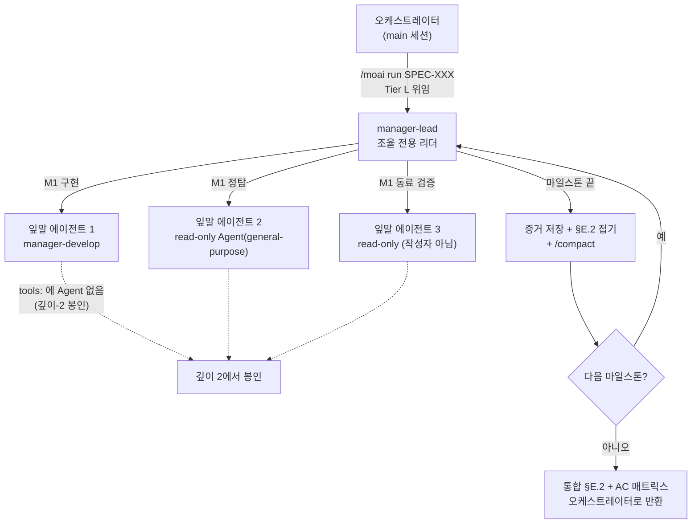



# manager-lead 리드 코디네이터 (Lead Coordinator)


 <strong>소속 가치</strong>: 에이전틱 루프 엔지니어링 · 에이전틱 하네스

<!-- @value: self-learning, agentic-harness -->

한 명이 감당하기 어려운 작업은 대개 두 한계에서 비롯됩니다. 하나는 컨텍스트 창입니다. 마일스톤(SPEC 안의 차례 단계) 다섯 개를 넘기면 구현 초기에 읽었던 파일 내용과 에이전트(스스로 일하는 AI 도우미)의 출력이 쌓여, 어느 순간 `/clear` 없이는 더 진행할 수 없는 지점에 이릅니다. 다른 하나는 신뢰입니다. 구현을 맡은 에이전트가 "수용 기준을 통과했다"고 스스로 보고할 때, 그 보고를 검증할 독립된 시선이 옆에 없으면 우리는 그 말을 믿는 수밖에 없습니다.

`manager-lead`는 이 두 한계와 "여러 세션·여러 카드의 조율"까지를 하나의 스킬 세트로 다루는, 열두 번째 관리자 에이전트(에이전트들을 조율하는 에이전트)입니다. v3.1.1에서 `manager-kanban`에서 개명했으며, 개명과 함께 역할을 칸반·팩토리 리드 세션의 조율로까지 넓혔습니다. 코드는 직접 짜지 않고 오직 조율만 합니다.

이 페이지는 심화 페이지입니다. 두 역할의 경계, 계층 구조, 진입 조건, 마일스톤마다의 컨텍스트 접기, 동료 검증, 리드 세션의 자세, 그리고 "무엇이 바뀌지 않는가"까지를 한 겹 더 깊게 다룹니다.

## 이 페이지가 다루는 것 — 두 역할, 하나의 스킬 세트

`manager-lead`는 단일 에이전트가 아니라 하나의 작업 **모양**이며, 그 모양은 서로 섞이지 않는 두 개의 역할로 이루어집니다.

| | 역할 A — 세션 안 팬아웃 | 역할 B — 세션 간 디스패치 |
|---|---|---|
| 작업 단위 | 한 SPEC 안의 마일스톤 | 칸반 보드의 카드(-k) 또는 팩토리 레인에 배정된 카드(-f) |
| 일하는 주체 | 직접 만드는 잎말 `Agent()` 스폰 | 운영자가 직접 띄운 동반 세션(-k: plan·run·sync)과 레인(-f: lane-1…lane-N) |
| 진입 | Tier L 임계점에서 오케스트레이터 위임 | SessionStart 맥락이 리드 역할을 선언하는 -k/-f 세션 |

역할 A는 Tier L 규모 SPEC의 실행을 마일스톤마다 컨텍스트를 접어(Context-Folding) 창을 가볍게 유지하고, 통과한 수용 기준(AC — 완료 판정의 기준)마다 동료 교차 검증(peer cross-validation)을 돌려 한 창 안에서 끝까지 가게 만듭니다.

역할 B는 칸반 모드(`moai cc -k`)와 팩토리 모드(`moai cc -f N`)의 **리드 세션이 디스패치 주기를 맡는** 일입니다. 칸반 리드는 `lead > plan > run > sync` 체인 위에서 카드를 보드에 흐르게 하고 — `plan` 세션이 카드별 SPEC 저작을 병렬 `Agent()` 워커로 fan-out합니다 — 팩토리 리드는 운영자가 고른 카드를 빈 레인에 통째로 배정합니다. 어느 쪽도 세션을 새로 만들지는 않습니다. 동반 세션과 레인은 운영자가 터미널마다 직접 띄우고, 리드는 이름으로 주소를 지정해 메시지를 보냅니다.

두 역할을 관통하는 규율은 셋입니다. 작업은 **경쟁하지 않고 순서로** 이루어지고, 완료는 **주장이 아니라 읽은 증거로만** 판정되며, 사용자 질문 채널은 오케스트레이터의 것입니다 — 이 에이전트는 막히면 차단 보고서(blocker report)를 돌려보냅니다.

## 리드 세션의 자세 — 대화는 계속, 일은 뒤에서

역할 B에서 리드 세션의 자세는 양방향으로 논블로킹입니다. 병렬 작업이 뒤에서 도는 동안 사용자와의 대화는 계속 흐르고, 레인·동반 세션 조율이 다음 사용자 답변을 기다리며 멈추는 일도 없습니다. 리드 세션은 오케스트레이터 채널로 사용자와 대화하고(에이전트 자신은 차단 보고서만 돌려보냅니다), 병렬로 돌릴 수 있는 작업 — 읽기 전용 검증 묶음, 보고서 교차 확인, 리드가 직접 가진 카드별 SPEC 저작 — 은 백그라운드 `Agent()` 스폰으로 흘려보냅니다.

여기에 **서브에이전트 우선 토큰 규율**이 겹칩니다. 리드와 레인의 컨텍스트에는 조율만 남기고, 본문 작업은 전부 하위 에이전트에 내려보냅니다. 카드별 저작·검증·보고서 작성이 리드 창 안에서 벌어지면 네 창이 동시에 무거워지는데, 하위 에이전트로 내려가면 각자의 창에서 끝나고 리드에는 요약만 돌아옵니다. 동시 스폰 상한은 세션당 10개이고, GLM 백엔드에서는 스폰을 **이름 없이** 띄웁니다 — 이름 있는 스폰은 `CLAUDE_CODE_EXPERIMENTAL_AGENT_TEAMS` 아래에서 결과를 돌려주지 않는 인프로세스 티메이트로 바뀔 수 있어서입니다.

## 왜 필요한가

Tier L 규모의 SPEC을 순차 모드(serial)로 구현하면, 오케스트레이터는 `manager-develop` 에이전트를 마일스톤마다 차례로 부릅니다. 이 흐름은 대부분의 경우에 잘 맞지만, SPEC이 커지면 두 가지 현상이 나타납니다.

먼저 컨텍스트가 찹니다. 구현 초기에 읽은 파일, 첫 마일스톤에서 작성한 테스트, AC 검증 명령의 출력이 한 창 안에 계속 남습니다. 다섯째 마일스톤쯤 가면 창이 거의 차서, 결국 `/clear`를 하고 이어서 하려면 앞의 진행 상황을 요약본으로 건네 받아야 합니다. 이 요약본 사이로 맥락이 흐릿해지는 비용이 누적됩니다.

다음으로 자가 보고의 한계가 드러납니다. 에이전트가 "AC-003 통과"라고 보고했을 때, 그 판정의 근거가 되는 명령 출력을 오케스트레이터가 일일이 다시 확인하지 않으면, 틀린 보고는 sync 단계가 돼서야 겨우 들키게 됩니다. 중간에 잡으면 싼 결함이 끝까지 갑니다.

`manager-lead`는 이 두 현상에 각각 대응합니다. 컨텍스트는 마일스톤 경계에서 접어 창을 가볍게 유지하고, AC 판정은 그 자리에서 작성자가 아닌 동료 에이전트가 다시 확인합니다. 그래서 Tier L 실행이 한 세션 안에서 끝까지 살아남고, "통과했다"는 말이 구조적으로 검증된 상태로 다음 마일스톤으로 넘어갑니다. 역할 B는 같은 규율을 세션 밖으로 확장합니다 — 리드도 카드를 옮기기 전에 진행 기록의 증거를 직접 읽고, 읽지 못했으면 카드를 그자리에 멈춥니다.

## 계층 구조 한눈에 보기



그림에서 주의 깊게 볼 점은 화살표의 방향입니다. 오케스트레이터는 `manager-lead`까지만 부르고, 그 아래 잎말 에이전트를 부르는 쪽은 `manager-lead`뿐입니다. 잎말 에이전트는 다시 에이전트를 부를 수 없습니다(점선이 가리키는 봉인). 이것이 "깊이-2 봉인"이며, 계층이 무한히 깊어지는 일을 막는 구조적 안전망입니다. 역할 B에서도 같습니다 — 리드의 백그라운드 `Agent()` 스폰은 한 단계뿐이고, 동반 세션과 레인은 애초에 리드가 만든 것이 아니라 운영자가 띄운 독립 세션입니다.

## Step 1 — 진입 조건이 맞는지 확인하기

역할 A는 모든 실행에 기본으로 깔리는 경로가 아닙니다. 오케스트레이터는 SPEC이 아래 세 조건을 **모두** 만족할 때만 `manager-lead`에게 작업을 맡깁니다. 세 조건이 하나라도 빠지면 표준 순차 모드(serial) 그대로 갑니다.

| 조건 | 기준 | 왜 필요한가 |
|------|------|-------------|
| 마일스톤 수 | ≥ 3개 | 접기 효과가 누적되려면 최소 세 경계가 필요하다 |
| 파일 수 | ≥ 10개 | 규모가 작으면 순차 모드가 더 싸다 |
| 도메인 퍼짐 | 교차 도메인 팬아웃 | 정탐이 여러 영역으로 갈라질 때 스키마 합치기가 빛을 발한다 |

이 세 조건은 "하나라도 참이면"이 아니라 "모두 참이어야" 합니다. 하나의 도메인을 건드리는 10파일짜리 단일 마일스톤 리팩터는 조건이 하나 빠져 보이지만, 실제로는 셋 다 안 맞으므로 `manager-lead` 경로로 들어오지 않습니다. 의도된 설계입니다 — 순차 모드가 더 싸고 빠르기 때문입니다.

역할 B의 진입은 더 단순합니다. 세션의 SessionStart 맥락이 칸반 모드(`moai cc -k`) 또는 팩토리 모드(`moai cc -f N`)의 `lead` 역할을 선언하면 그것으로 끝이며, 임계점은 적용되지 않습니다 — 보드(또는 레인 묶음) 자체가 작업이기 때문입니다. 서브에이전트 스폰에는 SessionStart 맥락이 없으므로, 역할 B는 스폰으로는 진입할 수 없습니다.

오케스트레이터는 `manager-lead`를 부르기 전에 이 선택을 `progress.md`의 `§F Phase 4 Mode Selection` 칸에 기록합니다. 사용자는 이 기록을 grep해 현재 실행이 어느 경로로 갔는지 확인할 수 있습니다.

```bash
# 현재 SPEC이 manager-lead 경로로 갔는지 progress.md에서 확인
grep -A 2 "Mode Selection" .moai/specs/SPEC-EXAMPLE-001/progress.md | grep -i "manager-lead"
```

## Step 2 — 실행을 맡기기

역할 A에서 오케스트레이터가 `manager-lead`를 부르면, `manager-lead`는 SPEC 식별자와 마일스톤 지도, AC 매트릭스를 받아들입니다. 여기서부터 역할 분담이 명확해집니다.

- **오케스트레이터** — 사용자 게이트를 지키고, `manager-lead`가 돌려 주는 통합 결과를 받아 sync 단계로 넘깁니다.
- **manager-lead** — 마일스톤마다 잎말 에이전트를 부르고, 컨텍스트를 접고, 동료 검증을 돌립니다. 코드를 직접 짜지 않고 SPEC 본문도 고치지 않습니다. `AskUserQuestion`을 직접 부르지도 않습니다 — 막히는 것이 생기면 차단 보고서를 오케스트레이터에게 돌려 보냅니다.
- **잎말 에이전트** — `manager-develop`로 구현을 하거나, 읽기 전용 `Agent(general-purpose)`로 정탐을 하거나, 작성자가 아닌 동료 에이전트로 AC 검증을 다시 돌립니다.

이 분담에서 가장 눈에 띄는 점은 `manager-lead`만이 `Agent` 도구를 가진다는 것입니다. 열두 관리자 에이전트 가운데 `Agent` 도구를 든 것은 `manager-lead`뿐이며, 다른 관리자 에이전트들은 모두 `Agent`를 뺀 도구 목록으로 평면 계층을 유지합니다. 평면 계층을 단 한 곳에서 여는 대신, 그 아래 잎말 에이전트들은 다시 `Agent`를 가지지 못하게 막아 계층이 두 단계를 넘지 않도록 봉인합니다. 이것이 "깊이-2 봉인"이며 CI 가드(`manager_lead_depth_test.go`)가 지킵니다.

```text
# manager-lead가 잎말 에이전트를 부를 때의 도구 목록 (개념 예시)
manager-lead:          [Read, Write, Edit, Grep, Glob, Bash, TaskCreate, TaskUpdate, TaskList, TaskGet, Agent, Skill]
잎말 manager-develop: [Read, Write, Edit, Grep, Glob, Bash, TaskCreate, TaskUpdate, TaskList, TaskGet, Skill]  ← Agent 없음
잎말 read-only 검증:  [Read, Grep, Glob, Bash]  ← Write/Edit/Agent 없음
```

여기서 `manager-lead`의 `Write`와 `Edit`은 조율 용도로만 쓰입니다. 즉 `progress.md`의 §E.2 칸에 접기 줄을 추가하거나, `.moai/state/verify/` 아래에 증거 파일을 쓰는 데 쓰일 뿐, 소스 코드를 건드리는 일은 없습니다. 코드는 항상 잎말 에이전트의 몫입니다.

위임 라우팅은 순차와 병렬을 구분해 붙입니다. 한 창에서 차례로 돌아야 하는 작업(마일스톤별 구현)은 순차 스폰으로, 서로 독립인 작업(정탐, 읽기 전용 검증 묶음, 카드별 SPEC 저작)은 병렬 스폰으로 흘려보냅니다. 스킬 접근은 전면 개방입니다 — `Skill` 도구로 필요한 도메인 스킬을 그 자리에서 불러 씁니다.

한 가지 강조할 점은 `manager-lead`가 새로운 실행 모드가 아니라는 것입니다. Phase 4의 네 모드(direct, serial, fanout, sweep)는 그대로이고, `manager-lead`는 serial(순차 부르기) 모양을 한 위임 대상입니다. 새 모드가 생긴 것이 아니고, 실험적 agent-team 표면(명시적 `--team` 요청으로만 선택)이 카탈로그 모드가 된 것도 아닙니다.

## Step 3 — 마일스톤이 끝날 때마다 컨텍스트 접기

`manager-lead`의 가장 독특한 습관은 마일스톤 경계에서 창을 가볍게 접는 일입니다. 이 절차를 **컨텍스트 접기(Context-Folding)**라고 부릅니다. 한 마일스톤의 모든 AC가 통과 판정을 받으면, `manager-lead`는 세 단계를 차례로 밟습니다.

1. **증거 저장** — 그 마일스톤에서 돌린 AC 검증 명령의 출력을 파일로 남깁니다. 경로는 `.moai/state/verify/<세션>/M<마일스톤>.<AC-id>.{log,out}` 형식을 따릅니다. `/tmp` 아래가 아니라 `.moai/state/` 아래에 두는 이유는, 운영체제가 `/tmp`를 비우면 인용 경로가 끊어지기 때문입니다.
2. **접기 줄 쓰기** — `progress.md`의 §E.2 칸에 한 줄 요약을 추가합니다. 이 줄은 "M2: AC-004=PASS, AC-005=PASS | evidence: .moai/state/verify/.../M2.* | fold-at: 2026-08-12T..." 형식을 따릅니다. 나중에 감사 단계에서 이 줄의 증거 경로가 실제 파일을 가리켜야 합니다.
3. **창 접기** — `/compact`를 명시적인 보존 지시와 함께 불러, 현재 마일스톤 계획과 지금까지의 접기 줄만 남기고 나머지는 정리합니다.

```text
# progress.md §E.2 에 추가되는 접기 줄 예시
M1: AC-001=PASS, AC-002=PASS | evidence: .moai/state/verify/abc123/M1.* | fold-at: 2026-08-12T10:14:00Z
M2: AC-003=PASS, AC-004=PASS | evidence: .moai/state/verify/abc123/M2.* | fold-at: 2026-08-12T11:42:00Z
```

이 절차가 끝나면 `manager-lead`의 활성 컨텍스트는 "현재 마일스톤 규모 + 지금까지의 접기 줄 + 항상 깔려 있는 규칙 앞부분"에 비례합니다. 다섯째 마일스톤을 앞두고 있어도, 첫 마일스톤의 날것 기록이 창을 차지하지 않습니다. 그래서 6마일스톤짜리 Tier L 실행이 한 창 안에서 끝까지 살아납니다.

```bash
# 마일스톤 2 가 끝난 뒤 남은 증거 파일 확인 (.moai/state/verify 아래 영속)
ls .moai/state/verify/"$(moai session current)"/M2.*
```

주의할 점은 절차가 게이트를 우회하지 않는다는 것입니다. 접기를 해도 모델별 컨텍스트 한계(예: 1M 창 모델은 50%)에 다다르면, `manager-lead`는 붙여넣기용 재개 메시지를 만들고 `/clear`를 권합니다. 접기는 창을 가볍게 유지하는 기술이지, 손을 떼는 기술이 아닙니다.

증거를 남기는 길도 닫혀 있지 않아야 합니다. 어느 AC의 증거 파일이 비어 있거나 경로가 끊어지면, 그 AC는 `PASS`가 아니라 `GAP`로 표시되고, `manager-lead`는 다음 마일스톤으로 넘어가지 않습니다. 빈 칸을 그냥 두는 일은 허용되지 않습니다.

## Step 4 — 동료 교차 검증으로 수용 기준 신뢰 더하기

구현 에이전트가 "AC-003 통과"라고 보고하면, `manager-lead`는 작성자가 아닌 두 번째 에이전트를 읽기 전용으로 불러 같은 AC 검증 명령을 다시 돌립니다. 이 단계를 **동료 교차 검증**이라고 부릅니다.

왜 굳이 한 번 더 돌리는가? 작성자는 자기가 통과라고 한 판정에 이미 투자한 상태입니다. 실패하는 grep을 잘못 세어 통과로 둔갑할 수도 있고, 예전 실행의 출력을 끌어와 지금 실행의 출력인 양 인용할 수도 있습니다. 동료 에이전트는 작성자의 통과 주장에 아무런 투자가 없습니다. 그 일은 같은 트리에서 같은 명령을 다시 돌려, 결과가 재현되는지(통과), 명령은 돌아가나 출력이 다른지(부분), 명령이 아예 안 돌아가거나 주장과 모순되는지(실패)만 가립니다.

이 단계의 결과로 세 가지 경우가 나옵니다.

- **PASS** — 검증 명령이 작성자 주장과 같은 결과로 재현됩니다. 다음 마일스톤으로 갑니다.
- **PARTIAL** — 명령은 돌아가지만 출력이 작성자 주장과 다릅니다. 차이를 기록하고 오케스트레이터에게 차단 보고서를 보냅니다.
- **FAIL** — 명령이 안 돌아가거나 작성자의 통과 주장과 모순됩니다. 역시 차단 보고서를 보냅니다.

```bash
# 동료 검증 에이전트가 AC-003 을 같은 트리에서 다시 돌리는 검증 명령 예시
go test -run AC-003 ./internal/hierarchical/...
# 종료 코드 0 이면 PASS, 0 이 아니면 FAIL — 작성자 주장과 비교해 PARTIAL 인지 FAIL 인지 가린다
```

PARTIAL이나 FAIL이 돌아오면, `manager-lead`는 다음 마일스톤으로 넘어가지 않습니다. 대신 AC 식별자, 작성자가 제시한 통과 증거, 동료가 잡은 차이점을 한데 모아 차단 보고서로 만들어 오케스트레이터에게 돌려 보냅니다. 사용자에게 선택지를 내는 것은 오케스트레이터의 몫입니다 — 작성자를 다시 부를지, 차이를 문서화된 부채로 받아들일지, 마일스톤을 중단할지를 `AskUserQuestion`으로 묻습니다. `manager-lead`가 사용자에게 직접 묻는 일은 없습니다.

Tier S는 이 단계를 건너뜁니다. 규모가 작으면 동료 검증의 비용이 가치를 넘어서기 때문입니다. Tier M과 Tier L은 의무입니다. 동료 교차 검증은 sync 단계의 sync-auditor를 대체하지 않습니다 — sync-auditor는 구현이 끝난 뒤 네 차원으로 점수를 매기는 마지막 회의 읽기이고, 동료 교차 검증은 실행 중간에 AC마다 도는 이진 판정입니다. 둘은 보완 관계입니다.

## 스키마 기반 팬아웃으로 정탐 합치기

Tier L 실행은 흔히 여러 도메인에 걸친 정탐으로 시작합니다. 예를 들어 새 인증 시스템을 구현할 때, 에이전트는 기존 세션 계층, 데이터베이스 마이그레이션 규약, 프론트엔드 라우팅 세 곳을 동시에 살펴야 할 수 있습니다. 이럴 때 `manager-lead`는 읽기 전용 정탐 에이전트 여럿을 동시에 부릅니다.

여기서 정탐 에이전트들이 제멋대로 형식의 산문을 돌려 주면, `manager-lead`는 반환값마다 구조를 다시 이끌어 내야 합니다. 정탐이 많아질수록 이 비용이 선형으로 큽니다. 그래서 `manager-lead`는 정탐 에이전트들이 `plan-research-fanout` 스킬이 정해둔 고정 머리글 형식을 따라 돌아오게 합니다. 그러면 합치기(reduce)는 다시 이끌어 내기가 아니라, 고정된 형식의 결과 N개를 기계적으로 이어 붙이는 일이 됩니다.

두 정탐 에이전트가 같은 신호에 대해 모순된 발견을 돌려 주면, `manager-lead`는 둘 중 하나를 몰래 고르지 않고 모순을 명시된 한 칸으로 써 넣습니다. 모순이 드러나면 사용자가 판단할 수 있고, 감추면 끝까지 가서야 터집니다.

동시에 부르는 에이전트 수는 MoAI fanout의 3–5 동시 한계를 넘지 않습니다. 다섯 개가 넘는 정탐이 필요하면, `manager-lead`는 그것들을 차례로 묶어 부릅니다.

## 워크트리 격리 — 쓰기는 격리, 읽기는 그대로

`manager-lead`가 잎말 에이전트 여럿을 동시에 부를 때, 쓰기 가능한 에이전트는 서로 같은 작업 트리를 건드리면 안 됩니다. 한 에이전트가 고치는 파일을 다른 에이전트가 덮어쓰는 사고를 막기 위해, **병렬로 부르는 쓰기 하위 에이전트는 `isolation: "worktree"`로 격리**합니다. 이 격리는 각 에이전트에게 독립된 작업 디렉터리(worktree)를 주어, 서로의 변경이 섞이지 않게 합니다.

**읽기 전용 fan-out은 격리 없이** 불러도 안전합니다 — 읽기만 하므로 작업 트리를 더럽힐 일이 없기 때문입니다. 정탐과 검증 묶음은 그대로 돌리고, 쓰기 스폰에만 격리를 붙이는 것이 규칙입니다.

v3.1 이전에는 이 격리 규칙이 "팀 모드"라는 이미 폐지된 개념에 매여 있었습니다. 팀 모드가 폐지되면서 격리 규칙까지 쓸모없어진 것처럼 보였지만, `manager-lead`가 들어오면서 규칙의 조건이 "병렬로 도는 쓰기 하위 에이전트"로 다시 매달아졌습니다. 격리를 가능하게 하는 원리는 그대로이고, 조건이 폐지된 층에 의존하지 않게 됐습니다.

## new mode이 아니다 (비-회귀 보증)

`manager-lead`가 들어왔다고 해서 Phase 4의 실행 모드가 늘어나지는 않습니다. 이 점은 명시적인 비-회귀 약속으로 자리 잡혔습니다.

- **실행 모드 목록** — direct, serial, fanout, sweep. 그대로입니다(agent-team은 명시적 요청 전용 실험적 각주로 남으며 자동 선택되지 않습니다).
- **새 모드** — 새 모드는 없습니다. `manager-lead`는 serial 모양의 순차 위임 대상입니다.
- **`--mode` 값** — `autopilot`, `loop`, `team`, `pipeline` 값은 그대로입니다. 새 값이 추가되지 않았고, agent-team은 명시적 요청 전용 실험적 표면으로 남습니다(`MODE_TEAM_UNAVAILABLE` 센티널은 문서화된 역사로 유지).

이 약속은 "에이전트를 하나 더 추가했다고 해서 오케스트레이션 층이 복잡해지는가?"라는 자연스러운 우려에 대한 대답입니다. `manager-lead`는 이미 있는 serial의 그릇 안에 들어가는 에이전트 한 개일 뿐, 새 그릇을 만들지 않습니다. 칸반·팩토리 리드 세션에서도 마찬가지입니다 — 디스패치 주기는 이미 있는 교차 세션 메시징과 백로그 큐 위에서 돌고, 새 런타임을 깔지 않습니다.

## 요약

`manager-lead`는 두 개의 표면에서 조율만 하는 에이전트입니다. 역할 A에서는 Tier L 규모 실행을 한 세션 안에서 끝까지 밀고 나갑니다 — 세 조건(≥3 마일스톤, ≥10 파일, 교차 도메인 팬아웃)이 모두 참일 때만 끼어들고, 들어가면 마일스톤마다 컨텍스트를 접어 창을 가볍게 유지하고, 통과한 AC마다 동료 교차 검증으로 신뢰를 더합니다. 역할 B에서는 칸반·팩토리 리드 세션의 디스패치를 맡습니다 — 카드는 읽은 증거로만 옮기고, 병렬 작업은 백그라운드 스폰으로 흘려보내 사용자 대화가 멈추지 않게 하며, 단계 사이에는 `/clear`를 요청합니다.

코드를 직접 짜지 않고 사용자에게 직접 묻지도 않으며, 작업이 막히면 차단 보고서를 오케스트레이터에게 돌려 보냅니다. 깊이-2 봉인 덕분에 계층은 두 단계를 넘지 않고, 스키마 기반 팬아웃 덕분에 여러 정탐 결과가 기계적으로 합쳐지며, 쓰기 스폰의 worktree 격리 덕분에 병렬이 안전합니다. 그리고 이 모든 것이 실행 모드 목록에 새 줄을 추가하지 않은 채 이루어집니다.
