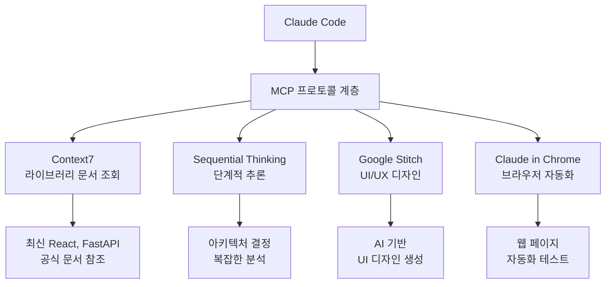
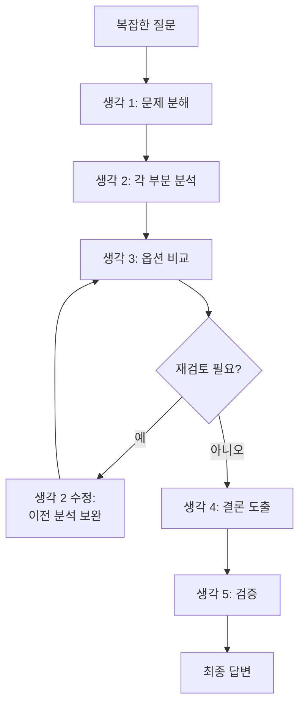

Claude Code의 MCP (Model Context Protocol) 서버를 활용하는 방법을 상세히 안내합니다.


**한 줄 요약**: MCP는 Claude Code에 **외부 도구를 연결하는 USB 포트**입니다. Context7으로 최신 문서를 조회하고, Sequential Thinking으로 복잡한 문제를 분석합니다.


## MCP란?

MCP (Model Context Protocol)는 Claude Code에 **외부 도구와 서비스를 연결**하는 표준 프로토콜입니다.

Claude Code는 기본적으로 파일 읽기/쓰기, 터미널 명령 등의 도구를 가지고 있습니다. MCP를 통해 이 도구 세트를 확장하여 라이브러리 문서 조회, 지식 그래프 저장, 단계적 추론 등의 기능을 추가할 수 있습니다.



## MoAI에서 사용하는 MCP 서버

### MCP 서버 목록

| MCP 서버 | 용도 | 도구 | 활성화 |
|----------|------|------|--------|
| **Context7** | 라이브러리 문서 실시간 조회 | `resolve-library-id`, `get-library-docs` | `.mcp.json` |
| **Sequential Thinking** | 단계적 추론, UltraThink | `sequentialthinking` | `.mcp.json` |
| **Google Stitch** | AI 기반 UI/UX 디자인 생성 ([상세 가이드](/advanced/stitch-guide)) | `generate_screen`, `extract_context` 등 | `.mcp.json` |
| **Claude in Chrome** | 브라우저 자동화 | `navigate`, `screenshot` 등 | `.mcp.json` |

## Context7 활용법

Context7은 **라이브러리 공식 문서를 실시간으로 조회**하는 MCP 서버입니다.

### 왜 필요한가?

Claude Code의 학습 데이터는 특정 시점까지의 정보만 포함합니다. Context7을 사용하면 **최신 버전의 공식 문서**를 실시간으로 참조하여 정확한 코드를 생성할 수 있습니다.

| 상황 | Context7 없이 | Context7 사용 |
|------|---------------|---------------|
| React 19 신기능 | 학습 데이터에 없을 수 있음 | 최신 공식 문서 참조 |
| Next.js 16 설정 | 이전 버전 패턴 사용 가능 | 현재 버전 패턴 적용 |
| FastAPI 최신 API | 구버전 문법 사용 가능 | 최신 문법 적용 |

### 사용 방법

Context7은 2단계로 동작합니다.

**1단계: 라이브러리 ID 조회**

```bash
# Claude Code가 내부적으로 호출
> React의 최신 문서를 참조해서 코드를 작성해줘

# Context7이 수행하는 작업
# mcp__context7__resolve-library-id("react")
# → 라이브러리 ID: /facebook/react
```

**2단계: 문서 검색**

```bash
# 특정 주제의 문서 검색
# mcp__context7__get-library-docs("/facebook/react", "useEffect cleanup")
# → React 공식 문서에서 useEffect 정리 함수 관련 내용 반환
```

### 실전 활용 시나리오

```bash
# 시나리오: Next.js 16 App Router 설정
> Next.js 16으로 프로젝트 설정을 해줘

# Claude Code 내부 동작:
# 1. Context7으로 Next.js 최신 문서 조회
# 2. App Router 설정 패턴 확인
# 3. 최신 설정 파일 생성
# 4. 공식 권장 사항 반영
```

### 지원되는 라이브러리 예시

| 분류 | 라이브러리 |
|------|-----------|
| 프론트엔드 | React, Next.js, Vue, Svelte, Angular |
| 백엔드 | FastAPI, Django, Express, NestJS, Spring |
| 데이터베이스 | PostgreSQL, MongoDB, Redis, Prisma |
| 테스트 | pytest, Jest, Vitest, Playwright |
| 인프라 | Docker, Kubernetes, Terraform |
| 기타 | TypeScript, Tailwind CSS, shadcn/ui |

## Sequential Thinking (UltraThink)

Sequential Thinking은 **복잡한 문제를 단계적으로 분석**하는 MCP 서버입니다.

### 일반 사고 vs Sequential Thinking

| 항목 | 일반 사고 | Sequential Thinking |
|------|-----------|---------------------|
| 분석 깊이 | 표면적 | 깊이 있는 단계별 분석 |
| 문제 분해 | 단순 | 구조화된 분해 |
| 재고/수정 | 제한적 | 이전 생각 수정 가능 |
| 분기 탐색 | 단일 경로 | 여러 경로 탐색 |

### UltraThink 모드

`--ultrathink` 플래그를 사용하면 강화된 분석 모드가 활성화됩니다.

```bash
# UltraThink 모드로 아키텍처 분석
> 인증 시스템 아키텍처를 설계해줘 --ultrathink

# Claude Code가 Sequential Thinking MCP를 사용하여:
# 1. 문제를 하위 문제로 분해
# 2. 각 하위 문제를 단계적으로 분석
# 3. 이전 결론을 재검토하고 수정
# 4. 최적의 솔루션 도출
```

### 활성화되는 상황

다음 상황에서 Sequential Thinking이 자동으로 활성화됩니다.

| 상황 | 예시 |
|------|------|
| 복잡한 문제 분해 | "마이크로서비스 아키텍처를 설계해줘" |
| 3개 이상 파일에 영향 | "인증 시스템 전체를 리팩토링해줘" |
| 기술 선택 비교 | "JWT vs 세션 인증, 어느 것이 나을까?" |
| 트레이드오프 분석 | "성능을 올리면서 유지보수성도 유지하려면?" |
| 호환성 파괴 검토 | "이 API 변경이 기존 클라이언트에 미치는 영향은?" |

### Sequential Thinking의 단계



## MCP 설정 방법

### .mcp.json 설정

MCP 서버는 프로젝트 루트의 `.mcp.json` 파일에서 설정합니다.

```json
{
  "context7": {
    "command": "npx",
    "args": ["-y", "@anthropic/context7-mcp-server"]
  },
  "sequential-thinking": {
    "command": "npx",
    "args": ["-y", "@anthropic/sequential-thinking-mcp-server"]
  }
}
```

### settings.local.json에서 활성화

특정 MCP 서버를 개인적으로 활성화하려면 `settings.local.json`에 추가합니다.

```json
{
  "enabledMcpjsonServers": [
    "context7"
  ]
}
```

### settings.json에서 권한 허용

MCP 도구를 사용하려면 `permissions.allow`에 등록해야 합니다.

```json
{
  "permissions": {
    "allow": [
      "mcp__context7__resolve-library-id",
      "mcp__context7__get-library-docs",
      "mcp__sequential-thinking__*"
    ]
  }
}
```

## 실전 예시

### React 프로젝트에서 Context7로 최신 문서 참조

```bash
# 1. 사용자가 React 19의 새 기능을 사용하고 싶다고 요청
> React 19의 use() 훅을 사용해서 데이터 페칭을 구현해줘

# 2. Claude Code 내부 동작
# a) Context7으로 React 라이브러리 ID 조회
#    → resolve-library-id("react") → "/facebook/react"
#
# b) React 19 use() 관련 문서 검색
#    → get-library-docs("/facebook/react", "use hook data fetching")
#
# c) 최신 공식 문서 기반으로 코드 생성
#    → use() 훅의 올바른 사용법 적용
#    → Suspense 바운더리와 함께 사용
#    → 에러 바운더리 처리 포함

# 3. 결과: 최신 패턴이 반영된 정확한 코드 생성
```

### 복잡한 아키텍처 결정에 UltraThink 사용

```bash
# 아키텍처 결정이 필요한 상황
> 우리 서비스의 인증을 JWT로 할지 세션으로 할지 분석해줘 --ultrathink

# Sequential Thinking이 수행하는 단계:
# 생각 1: 두 방식의 기본 개념 정리
# 생각 2: 우리 서비스의 특성 분석 (SPA, 모바일 앱 지원 필요)
# 생각 3: JWT 장단점 분석
# 생각 4: 세션 장단점 분석
# 생각 5: 보안 관점 비교
# 생각 6: 확장성 관점 비교
# 생각 7: 이전 생각 수정 - 하이브리드 방식 검토
# 생각 8: 최종 결론 및 구현 전략
```

## 관련 문서

- [settings.json 가이드](/advanced/settings-json) - MCP 서버 권한 설정
- [스킬 가이드](/advanced/skill-guide) - 스킬과 MCP 도구의 관계
- [에이전트 가이드](/advanced/agent-guide) - 에이전트의 MCP 도구 활용
- [CLAUDE.md 가이드](/advanced/claude-md-guide) - MCP 관련 설정 참조
- [Google Stitch 가이드](/advanced/stitch-guide) - AI 기반 UI/UX 디자인 도구 상세 활용법


**팁**: Context7은 최신 라이브러리 문서를 참조할 때 가장 유용합니다. 새 프레임워크를 도입하거나 최신 버전으로 업그레이드할 때 Context7을 활성화하면 정확한 코드를 얻을 수 있습니다.

