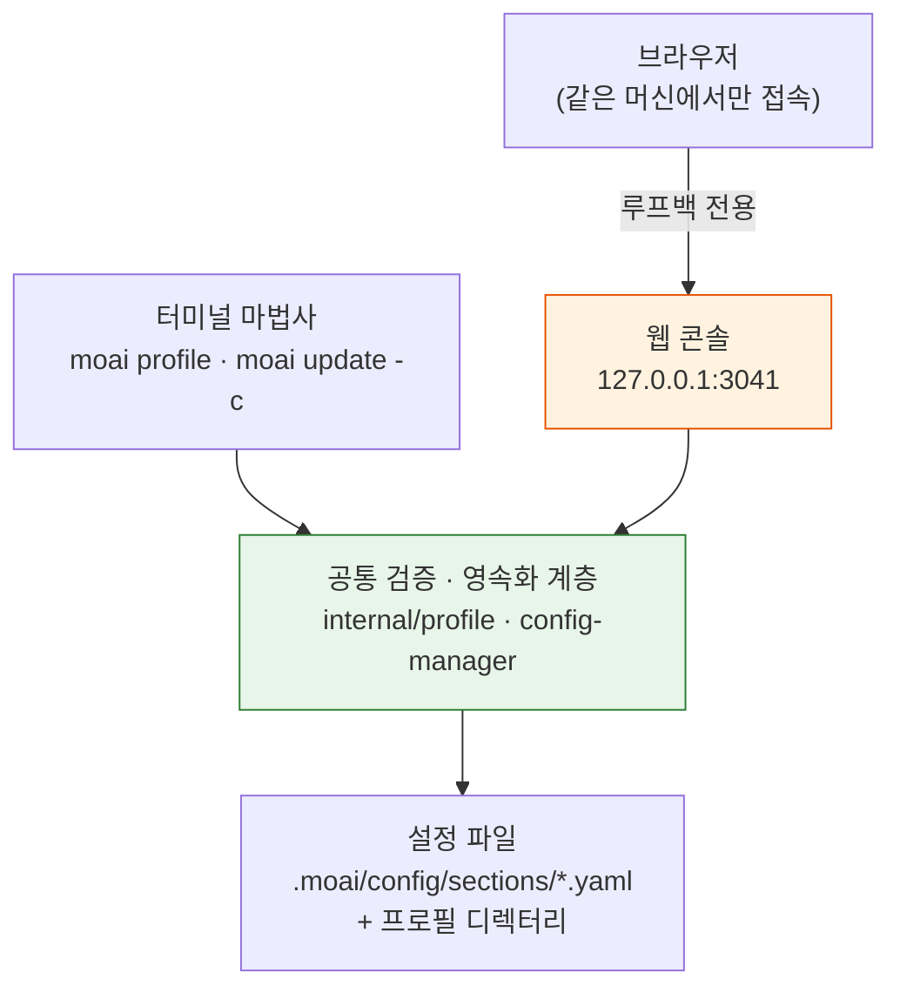
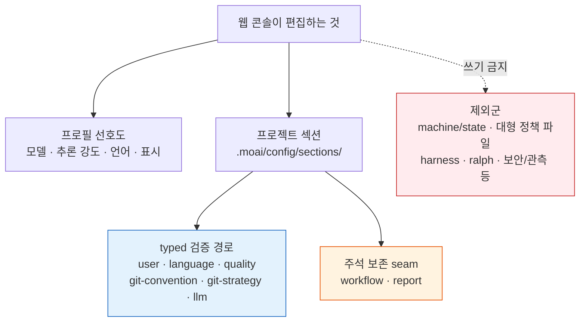

# MoAI Web Console

**MoAI Web Console** 은 터미널에서 `moai profile` 이나 `moai update -c` 로 고치던 설정을 브라우저에서 마우스로 고치는 화면입니다. 콘솔이 저장하는 값은 터미널 마법사(단계별로 설정을 안내하는 CLI 마법사)와 같은 유효성 검사(값을 파일에 쓰기 전에 legal 한지 확인하는 단계)를 거쳐 같은 파일에 쓰입니다. 그래서 어느 쪽으로 고쳐도 결과는 같고, YAML 들여쓰기나 필드 이름을 외우지 않아도 됩니다.


**한 줄 요약:** 웹 콘솔은 터미널 마법사의 "안전한 저장"을 브라우저로 옮겨온 것입니다. 새로운 검증 규칙을 만들지 않고, 새로운 저장 경로를 파지 않으며, 같은 규칙과 같은 경로를 마우스로 다루게 해 줍니다.


## 왜 별도의 화면이 필요한가

터미널 마법사는 한 값을 고칠 때마다 다음 단계로 넘어가는 단순한 흐름이라 초기 설정에 알맞습니다. 하지만 프로필(이름을 붙여둔 모델 · 추론 강도 · 언어 · 표시 설정 묶음)이 여러 개일 때 값을 서로 비교하거나, 여러 섹션을 한눈에 보며 고치거나, YAML 의 들여쓰기를 틀려서 전체 파일이 깨지는 일을 피하고 싶을 때는 한 화면에서 값을 다루는 쪽이 편합니다. 웹 콘솔은 이런 순간을 위한 화면입니다 — 터미널 마법사를 대체하는 것이 아니라, 같은 설정 파일을 다루는 또 하나의 입구입니다.

프로필을 자주 전환하며 값을 비교하는 일이 대표적인 사례입니다. 평소엔 `medium` 프로필, 어려운 작업엔 `high` 프로필을 쓴다고 할 때, 프로필 카드에서 전환하고 탭에서 각 프로필의 값을 바로 비교할 수 있습니다.

## 같은 검사, 같은 파일 — 설계의 핵심

웹 콘솔을 이해하는 가장 중요한 관점은 "터미널 마법사와 같은 검증 · 영속화 계층을 쓴다"는 점입니다. 콘솔은 자체적인 검증 규칙을 두지 않습니다. `internal/profile` 패키지가 제공하는 정규 값 목록과 쓰기 함수를 그대로 호출하고, 프로젝트 섹션은 config-manager 의 typed 경로나 주석 보존 seam 을 거칩니다. 덕분에 한쪽에서만 통하는 값이 생기는 일이 없고, 터미널 마법사로 저장한 결과와 웹 콘솔로 저장한 결과가 같은 파일에 같은 형태로 쓰입니다.

그림에서 보듯 브라우저는 웹 콘솔에, 터미널 마법사는 공통 계층에 각각 닿고, 두 경로 모두 같은 검증 · 영속화 계층을 거쳐 같은 파일에 쓰입니다. 외부 데이터베이스는 없고, 콘솔을 끄고 남는 것은 사용자가 저장한 설정 파일뿐입니다.

## 보안 모델 — 로컬 개발을 위한 세 가지 전제

웹 콘솔의 보안 설계는 "로컬 개발 머신에서 혼자 쓴다"는 전제 위에 세워져 있습니다. 세 가지로 요약됩니다.

**루프백 전용 (loopback-only).** 콘솔은 `127.0.0.1` 에만 바인딩됩니다. 루프백(localhost, 자기 머신 안에서만 통신하는 네트워크 주소) 밖으로 나가지 않으므로, 같은 머신의 다른 사용자 계정이나 원격 호스트에서는 접근할 수 없습니다. `0.0.0.0` 바인딩은 금지된 안티패턴입니다.

**데이터베이스 없음 (no-DB).** 별도의 DB 서버를 띄우지 않습니다. 콘솔이 읽고 쓰는 값은 현재 프로젝트의 `.moai/config/sections/` 와 프로필 파일이 전부입니다. 콘솔이 메모리에 들고 있는 판은 켜진 동안만 유효하고, 저장 버튼을 누른 값만 파일에 남습니다.

**인증 없음 (no-auth).** 로컬 사용자 본인 외에는 접근하지 못하므로(루프백 전용), 로그인이나 토큰 같은 인증 계층이 없습니다. 복잡한 자격증명 관리 없이 바로 씁니다.


루프백 전용이 인증 없음의 전제입니다. 역방향 프록시나 `0.0.0.0` 바인딩으로 외부에 노출하는 설정은 공식적으로 지원하지 않습니다. 원격 편집이 필요하면 SSH 터널로 로컬 포트를 안전하게 전달하세요.


## 편집할 수 있는 것과 없는 것

웹 콘솔은 프로젝트의 모든 파일을 고칠 수 있는 것이 아닙니다. 편집 가능한 범위는 `RouteForSection` 이라는 단일 진실 공급원(SSOT — 어디서 봐도 같은 값을 주는 단일 출처)으로 정해져 있고, 콘솔은 그 범위 안에서만 씁니다.

프로필 선호도는 모델, 추론 강도, 언어, 표시 설정 등 프로필마다 따로 값을 갖는 항목입니다. 프로필 카드에서 전환하고 탭에서 값을 바꿉니다.

프로젝트 섹션은 두 영속화 경로로 나뉩니다. typed 검증 경로는 `user` · `language` · `quality` · `git-convention` · `git-strategy` · `llm` 처럼 구조체로 모델링된 섹션이 전체 typed 검증을 거쳐 저장됩니다. `workflow` 와 `report` 는 typed 경로가 없는 섹션으로, 파일 안의 주석과 줄 순서를 보존하는 yamlpatch seam(노드 수술 — 파일 전체를 다시 쓰지 않고 바뀌는 부분만 고쳐 쓰는 방식)로 저장됩니다. `workflow.yaml` 의 복잡한 구조가 re-marshal 로 깨지는 것을 막기 위해서입니다.

반대로 기계 · 상태 섹션(`state` · `system` · `project` · `sunset`), 대형 정책 파일(`tool-policy` · `lsp` · `mx`), 그리고 `harness` · `ralph` · `feedback` · `observability` · `security` · `handoff` · `cache` 는 제외군입니다. 이 파일들의 설정 키는 템플릿 YAML 에 그대로 남아 런타임이 읽어 쓰지만, 웹 콘솔에서는 편집하지 않습니다. 새 섹션도 명시적으로 등재되기 전까지는 기본 거부됩니다.

## 4-로케일 인터페이스

콘솔의 인터페이스 언어는 헤더 오른쪽 선택기에서 **English · 한국어 · 日本語 · 中文** 가운데 고릅니다. MoAI-ADK 가 지원하는 네 언어와 같은 세트로, 한국어를 고르면 메뉴와 라벨, 도움말이 모두 한국어로 바뀝니다. docs-site 의 [4-로케일 문서](/ko/resources/i18n-docs/) 와 같은 언어 세트라 설정 화면과 문서를 모국어로 함께 볼 수 있습니다.

## 프로필 전환의 기록 범위

콘솔에서 프로필을 전환하면 그 선택이 `~/.moai/claude-profiles/launch.yaml` 에 현재 프로젝트의 기록으로 남습니다. 같은 프로젝트에서 `-p` 없이 `moai cc` 를 실행할 때 이 값이 쓰입니다. 콘솔이 읽는 값과 쓰는 값은 모두 현재 프로젝트를 기준으로 하므로, 화면에 보이는 프로필과 실제로 기록되는 프로필은 언제나 같습니다. 선택 순서와 제약은 [프로필 관리](/ko/cli-reference/profile/) 에서 자세히 다룹니다.

## 켜고 끄는 방법

프로젝트 디렉터리에서 `moai web` 을 실행하면 기본적으로 `127.0.0.1:3041` 에 바인딩되고 브라우저가 자동으로 열립니다. 포트가 이미 다른 moai 인스턴스(같은 명령으로 이전에 켜두고 끄지 않은 프로세스)가 쓰고 있으면 그 인스턴스를 종료하고 다시 바인딩합니다. moai 가 아닌 외부 프로세스가 포트를 쓰고 있으면 종료하지 않고 오류를 내며, 이때는 다른 포트를 씁니다.

| 플래그 | 기본값 | 동작 |
|--------|--------|------|
| `--port <int>` | `3041` | 바인딩할 루프백 포트 |
| `--no-open` | `false` | 브라우저 자동 열기를 끕니다 |
| `--no-reuse` | `false` | 포트를 쓰는 stale moai 인스턴스를 회수하지 않고 충돌로 끝냅니다 |

브라우저를 여는 데 실패해도 콘솔은 계속 켜져 있고, 안내된 주소를 수동으로 열면 됩니다. 종료는 터미널에서 `Ctrl+C`, 혹은 페이지 안의 종료 버튼 — 어느 쪽이든 진행 중인 요청을 5초 안에 마무리하고 안전하게 끝납니다. 세부 플래그와 동작은 [CLI 레퍼런스 — moai web](/ko/cli-reference/web/) 을 참조하세요.

## 터미널 마법사와 웹 콘솔, 무엇을 쓸까

같은 설정 파일을 다루지만, 작업 흐름에 따라 어느 쪽이 편한지가 다릅니다.

- **터미널 마법사** (`moai profile`, `moai update -c`) — 한 값씩 단계적으로 고치는 초기 설정, CI 에서 스크립트로 돌리는 설정, 인터랙티브한 안내가 필요할 때.
- **웹 콘솔** (`moai web`) — 여러 섹션을 한 화면에서 비교하며 고칠 때, 프로필을 자주 전환하며 값을 비교할 때, YAML 들여쓰기를 신경 쓰지 않고 빠르게 바꾸고 싶을 때.

저장 결과는 같습니다. 자신에게 편한 쪽을 고르면 됩니다.

## 관련 문서

- [CLI 레퍼런스 — moai web](/ko/cli-reference/web/) — 플래그와 동작 세부 사항
- [프로필 관리](/ko/cli-reference/profile/) — 프로필 자동 선택과 기록 범위
- [하네스 프로필과 평가](/ko/advanced/harness-profiles/) — 프로필 매트릭스와 모델 · 추론 강도 배정
