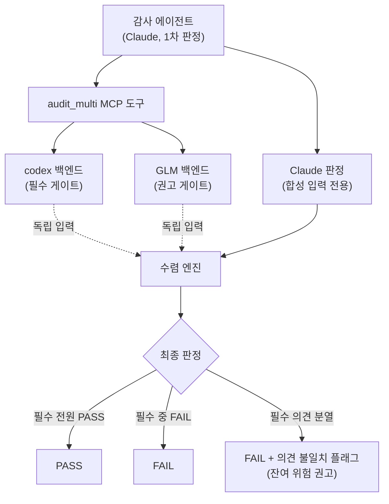
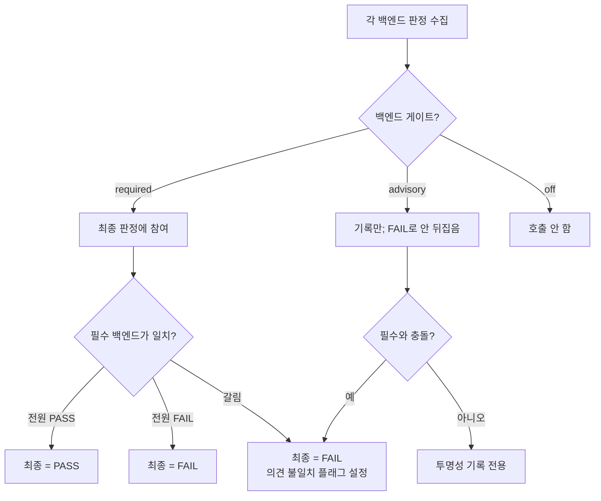



# 다중 모델 감사 수렴 (Multi-model Audit Convergence)


 <strong>소속 가치</strong>: 에이전틱 하네스 · 에이전틱 루프 엔지니어링


다중 모델 감사 수렴(multi-model audit convergence, 여러 AI 모델이 같은 결과물을 교차 검증해 하나의 최종 판정으로 합치는 일)은 MoAI-ADK가 단일 모델의 사각지대를 줄이는 감사 방식입니다. 감사를 맡은 관리자 에이전트(manager agent, 계획·구현·문서화·감사 각 단계를 책임지는 에이전트)가 내린 판정을, 다른 계열의 모델이 독립적으로 다시 검증합니다. 두 판정이 일치하면 신뢰가 더해지고, 두 판정이 갈리면 어디가 위험인지가 잔여 위험(residual risk, 검증을 거쳤음에도 남는 불확실성)으로 명시됩니다. 이 페이지는 왜 이런 이중 검증이 필요한지, 수렴이 어떤 규칙으로 돌아가는지, 그리고 자율 루프와 어떻게 만나는지를 다룹니다.

## 왜 단일 모델 감사로는 부족한가

감사(audit, 결과물이 기준을 맞추는지 독립적으로 확인하는 단계)를 한 모델에만 맡기면 해당 모델이 갖는 사각지대가 그대로 감사 결과에 스며듭니다. 어떤 모델은 특정 패턴의 오류를 잘 잡지만 다른 패턴은 지나치고, 어떤 모델은 보안 문맥에 강하지만 동시성 버그에는 약합니다. 설계 보고서가 이를 "Codex가 더 똑똑한 것이 아니라 다르게 똑똑하다(differently smart)"고 표현한 것은 같은 맥락입니다. 서로 다른 훈련 데이터와 추론 습성을 가진 모델들은 서로 다른 맹점을 갖습니다.

문제는 맹점이 무작위가 아니라는 점입니다. 한 모델이 놓치는 오류의 상당수는 그 모델이 반복적으로 놓치는 패턴입니다. 그래서 같은 모델로 한 번 더 검증하는 것은 큰 도움이 되지 않습니다. 반면 계열이 다른 모델을 끼워 넣으면 두 모델 모두가 놓치는 교차 사각지대(correlated blind spot, 두 이상의 모델이 같은 이유로 함께 못 보게 되는 오류 영역)는 확 연히 줄어듭니다. 첫 번째 검증자가 보지 못한 것을 두 번째 검증자가 잡아낼 확률이 올라가는 것입니다.

다중 모델 감사는 이 교차 사각지대를 감사 설계에서부터 다루겠다는 선택입니다. 감사를 한 번 더 반복하는 것이 아니라, 구조가 다른 시선을 한 번에 병렬로 돌려 그 결과를 합칩니다.

## super-review 패턴 — 독립된 두 번째 의견

다중 모델 감사의 설계 뼈대는 super-review 패턴(super-review pattern, 한 모델이 내린 1차 판정을 다른 모델이 독립적으로 다시 검증하는 이중 검증 구조)입니다. 세 단계로 진행됩니다. 첫째, 세션 안의 Claude가 1차 분석을 내립니다. 둘째, codex(OpenAI 계열 CLI 도구)와 GLM(z.ai의 모델) 같은 제2의 백엔드가 같은 결과물을 처음부터 다시 봅니다. 셋째, 오케스트레이터가 두 판정을 합쳐 하나의 최종 판정을 냅니다.

여기서 독립성(independence, 2차 검증자가 1차 검증자의 판정에 영향받지 않는 상태)이 핵심입니다. 1차 판정을 2차 검증자에게 미리 보여주면 2차 검증자는 그 판정에 끌려 같은 결론을 반복하게 됩니다. 이렇게 되면 두 번 검증했다는 점만 무의미해집니다. 그래서 MoAI-ADK는 Claude의 1차 분석을 codex나 GLM에게 결코 맥락으로 넘겨주지 않습니다. Claude의 판정은 합치는 단계에서만 입력으로 쓰이고, 제2의 백엔드에게는 전달되지 않습니다. 두 번째 의견이 진짜 두 번째이도록 보장하는 것입니다.

그림에서 점선은 "각 백엔드가 Claude의 1차 분석을 보지 않고 자신만의 입력으로 판정을 내린다"는 독립성을 나타냅니다. Claude 판정은 합성 단계에서만 들어가고, codex와 GLM의 검증 경로에는 섞이지 않습니다.

## 세 백엔드의 역할 분담

수렴은 기본으로 세 종류의 백엔드(backend, 실제 감사를 수행하는 AI 모델)를 다룹니다. Claude는 세션 안에서 감사 에이전트가 직접 분석한 1차 판정을 그대로 가져옵니다. 별도의 모델 호출 없이, 에이전트가 이미 만든 결과를 합성 입력으로 씁니다. codex는 시스템이 codex 바이너리를 호출해 결과물을 검증합니다. GLM은 z.ai API를 직접 호출해 같은 결과물을 다시 검증합니다.

각 백엔드는 감사 게이트(audit_gate, 그 백엔드의 판정을 최종 결과에 어떻게 반영할지 정하는 설정)라는 설정을 가집니다. 게이트는 세 가지입니다. `required`는 그 백엔드의 판정이 최종 판정을 좌우하는 필수 참여자입니다. `advisory`는 판정이 기록되고 잔여 위험으로 보고되되 최종 판정을 뒤집지 않는 권고 참여자입니다. `off`는 그 백엔드를 아예 호출하지 않겠다는 뜻입니다. 기본 프로필은 Claude와 codex를 필수로, GLM을 권고로 둡니다. 이렇게 두 필수 백엔드를 다른 계열로 구성하는 것 자체가 교차 사각지대를 줄이는 장치입니다.

## 수렴 알고리즘 — 의견이 갈릴 때

수렴(convergence, 여러 백엔드의 판정을 하나의 최종 판정으로 합치는 절차)은 정해진 순서를 따릅니다. 첫째, 필수 게이트 백엔드가 전원 PASS이면 최종 판정은 PASS입니다. 둘째, 필수 게이트 백엔드 중 하나라도 FAIL이면 최종 판정은 FAIL입니다. 셋째, 필수 게이트끼리 의견이 갈라 하나는 PASS, 하나는 FAIL이면 최종 판정은 FAIL로 떨어지고 동시에 의견 불일치 플래그(disagreement_flag, 필수 백엔드 사이에 판정이 갈렸음을 표시하는 표식)가 켜집니다. 이 플래그는 잔여 위험 설명과 함께 오케스트레이터의 완료 보고서(Verification Matrix, 완료 보고서의 검증 표)에 권고 신호로 나타납니다. 넷째, 권고나 off로 설정된 백엔드는 결코 최종 판정을 FAIL로 뒤집지 않습니다. 권고 백엔드의 판정은 투명성을 위해 기록되고, 필수 백엔드와 충돌할 때만 의견 불일치 플래그를 보탭니다.

여기서 중요한 설계 결정은 의견 불일치가 자체적인 차단 사유가 아니라는 점입니다. "필수 의견이 갈렸다"는 새로운 차단 범주를 만들지 않습니다. 대신 갈림은 보수적인 기본 규칙인 "필수 중 하나라도 FAIL이면 FAIL"에 따라 FAIL로 처리되고, 갈림 사실은 별도의 권고 신호로 올라옵니다. 이렇게 규칙을 단순하게 유지하면 수렴 결과를 읽는 쪽이 "왜 FAIL인지"를 한눈에 알 수 있습니다.

두 번째 그림은 백엔드의 게이트 설정이 최종 판정에 이르는 경로를 보여줍니다. 권고 백엔드는 충돌이 있을 때만 의견 불일치 플래그를 보탤 뿐, 판정 자체를 바꾸는 일은 없습니다.

## inconclusive — 읽지 못한 코드에 판정을 내리지 않는다

codex와 GLM 백엔드는 검사할 diff를 수집하지 못하면 **호출 자체를 하지 않고** 판정을 `inconclusive`(결정 불가)로 냅니다. 이는 결함이었던 과거 동작의 교정입니다 — 예전에는 리뷰할 코드를 확보하지 못한 백엔드가 빈 입력에도 자신 있게 판정을 내놓았고, 실제 관측에서는 이 저장소에 없는 저장소 화이트리스트를 인용하는 `fail`까지 나온 적이 있습니다. 읽지 않은 코드에 대한 판정은 어떤 방향이든 정보가 아니므로, 수집 실패는 백엔드 호출 없이 `inconclusive`로 끝납니다.

백엔드가 스스로 `inconclusive`를 선언한 경우에도 수렴은 그 값을 **결정 불가 그대로** 읽습니다 — 결코 PASS로 합성하지 않습니다. "필수 백엔드의 PASS가 없으면 PASS를 낼 수 없다"는 보수 규칙과 같은 결입니다. 판정 없음을 통과로 세어 주면 필수 게이트의 신뢰가 조용히 새기 때문입니다.

수렴 판정의 **기록 위치**도 감사된 트리를 따릅니다. MCP 서버는 수명이 긴 하위 프로세스라 워크트리 전환을 따라가지 못하는데, 예전에는 판정 기록부가 프로세스 시작 시점의 주 체크아웃에 한 번 고정되어 해석돼, 워크트리 안에서 돈 감사의 판정이 그 워크트리의 게이트가 절대 보지 못하는 디렉터리에 쌓였습니다. 지금은 호출 시점에 지목한 `project_root` 트리 아래에 기록됩니다 — 워크트리에서 감사를 돌 때 판정이 그 워크트리의 게이트가 읽는 자리에 남습니다(`project_root` 인자의 용법은 [MCP 서버](/ko/guides/mcp-server/) 문서 참조).

## fail-open — 빠진 백엔드가 흐름을 멈추지 않는다

다중 모델 감사는 fail-open(fail-open, 필수가 아닌 요소가 빠져도 전체 흐름이 멈추지 않도록 설계하는 원칙)을 따릅니다. 예를 들어 GLM 백엔드를 권고 게이트로 켜두었는데 API 인증이 안 되어 있거나 호출이 실패하면, 그 백엔드의 판정은 결과 없음으로 처리되고 수렴은 남은 활성 백엔드로 계속 진행됩니다. 권고 백엔드 하나가 빠졌다고 해서 감사 전체가 멈추거나 에러로 끝나지 않습니다.

단, 필수 게이트로 설정된 백엔드에 대해서는 이야기가 다릅니다. 필수 백엔드가 빠지거나 오류를 반환하면 그 판정은 결과 없음으로 취급되고, 수렴 규칙상 필수 백엔드의 PASS가 없으면 PASS를 낼 수 없습니다. 즉 필수 백엔드의 부재는 보수적으로 처리되어 FAIL 쪽으로 기울어지고, 이는 "필수로 지정했다면 그 만큼의 신뢰를 걸고 있다"는 설정 의도와 일치합니다.

이 fail-open 정체성은 자율 루프에서 더 중요해집니다. 한 백엔드의 일시적 오류가 전체 자율 루프를 멈추게 하면 안 되기 때문입니다. 그래서 빠진 백엔드는 "정보가 없다"는 표식으로 기록되고, 나머지 백엔드로 판정이 이어집니다.

## 자율 루프와 만나는 지점 — multi-review-gate

다중 모델 감사는 두 경로로 쓰입니다. 첫째는 plan-audit와 sync-audit 같은 기존 감사 단계입니다. 감사 에이전트가 `moai-ref-cross-model-audit` 스킬을 불러와 세션 안의 Claude 판정을 codex와 GLM으로 보강하고, 합쳐진 결과를 자신의 감사 판정에 반영합니다. 이 경로는 기존 스킬 라우팅 규칙을 그대로 따르므로 새로운 라우팅 기구가 생기지 않습니다.

둘째는 완전 자율 goal 수렴 루프입니다. `/moai goal`로 완료 조건을 선언하고 세션이 사람 개입 없이 조건이 충족될 때까지 일하게 할 때, 매 턴이 끝날 때마다 실행되는 Stop hook(Stop hook, 턴이 끝날 때마다 실행되는 검사 지점)이 다중 모델 감사 결과를 읽어 ALLOW나 BLOCK을 내보냅니다. 이 게이트는 multi-review-gate라고 부르며, 기존 codex-review-gate와 같은 양식의 자가 게이트(self-gate, 이 턴이 진짜 검증이 필요한 코드 수정인지를 스스로 가리는 장치)를 가집니다. 코드 수정이 없거나 상태 보고 턴이면 즉시 ALLOW를 내보내 거짓 차단을 막습니다.

핵심은 의견 불일치가 자율 루프를 끊지 않는다는 점입니다. 필수 백엔드가 갈리면 게이트는 보수적으로 BLOCK을 내보내지만, 권고 백엔드만의 갈림은 결코 BLOCK으로 이어지지 않습니다. 권고 수준의 의견 차이는 잔여 위험 권고로만 올라오고 루프는 계속 돕니다. 이렇게 하면 자율 루프의 끊김 없는 흐름과 교차 검증의 안전망이 모두 살아 있습니다.

## 정리

다중 모델 감사 수렴은 세 가지를 한꺼번에 성립시킵니다. 서로 다른 계열의 모델을 병렬로 돌려 교차 사각지대를 줄이고, 명확한 우선순위 규칙으로 판정을 합치며, 의견 불일치를 차단이 아닌 권고로 다루어 fail-open 정체성을 지킵니다. 1차 판정을 2차 검증자에게 노출하지 않아 독립성이 보존되고, 빠진 백엔드는 결과 없음으로 처리되어 전체 흐름을 멈추지 않습니다. 그리고 이 모든 것이 plan-audit·sync-audit 같은 기존 감사 단계와 완전 자율 goal 루프의 동일한 MCP 표면에서 작동합니다. 감사를 한 번 더 반복하는 대신 시선을 한 번 더 끼워 넣는 것, 이것이 다중 모델 감사 수렴의 핵심입니다.
