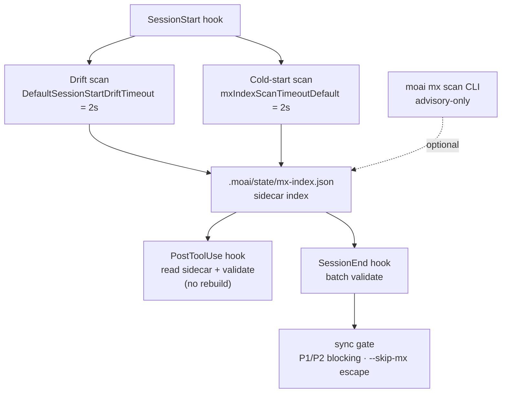

`moai mx` 스캐너는 코드베이스를 읽어 `@MX:` 태그와 결합된 인덱스를 만들고, 여러 시점에 걸쳐 검증을 수행합니다. 이 문서는 태그 문법 뒤에 숨겨진 네 가지 동작 — rotRisk 점수, LSP fan-in 엔진 선택, CGO 게이트된 복잡도 측정, 그리고 스캔 자동화 시점 — 을 코드베이스 기준으로 설명합니다. 태그 작성법은 [MX 태그](/ko/advanced/mx-tags)를, 명령 형태는 [`moai mx`](/ko/utility-commands/moai-mx)를 함께 참고하세요.

## rotRisk 점수

`rotRisk`는 `@MX:DEBT` 태그에만 존재하는 필드입니다. 스캐너는 DEBT 태그를 파싱할 때 항상 이 필드를 채우며, 다른 태그 종류에는 이 필드가 없습니다.

값은 `@MX:UPGRADE` 하위 라인의 존재에 따라 결정됩니다.

- `@MX:UPGRADE`가 없으면 `rotRisk`는 문자열 `"no-trigger"`로 설정됩니다. 부패 신호는 "지금 당장 위험하다"가 아니라 "업그레이드 계획이 없는 부채"라는 점입니다.
- `@MX:UPGRADE`가 뒤따르면 `rotRisk`는 빈 문자열로 초기화되어 사이드카에서 생략됩니다. 업그레이드가 계획된 부채는 더 이상 rot 후보가 아닙니다.

 `@MX:CEILING` 유무는 rot 판정 기준이 아닙니다. CEILING은 "이 한계치를 알고 있다"는 품질 메모일 뿐, 부패 게이트와는 별개입니다. rot 게이트는 오직 `@MX:UPGRADE` 유무로만 결정됩니다.

`moai mx query --kind DEBT --json` 결과에서 `"rotRisk": "no-trigger"`로 표시되는 항목이 바로 업그레이드 계획이 없는 부채입니다. 태그 시맨틱은 [MX 태그 - DEBT](/ko/advanced/mx-tags#debt)에서 다시 확인할 수 있습니다.

## LSP fan-in 엔진

`@MX:ANCHOR`가 "fan_in ≥ 3" 임계값을 만족하는지 검증할 때 스캐너는 두 가지 방식으로 호출 횟수를 셉니다.

- **LSP 우선**: 활성화된 언어 서버가 있으면 `textDocument/references`를 호출해 정확한 참조 위치를 수집합니다. 이 결과는 사이드카의 `fan_in_method` 필드에 `"lsp"`로 기록됩니다.
- **textual 폴백**: LSP를 사용할 수 없으면 정규식 기반 grep으로 폴백합니다. 사이드카에는 `fan_in_method: "textual"`로 표시됩니다.

기본 non-strict 모드에서 LSP가 누락되면 스캐너는 조용히 textual 폴백으로 넘어갑니다. 쿼리 결과의 `fan_in_method` 필드가 이 사실을 공개하므로, 결과를 해석할 때 항상 이 필드를 함께 확인해야 합니다.

 LSP를 강제하려면 환경변수 `MOAI_MX_QUERY_STRICT=1`을 설정하세요. 이 모드에서 LSP를 사용할 수 없으면 스캐너는 `LSPRequiredError`를 반환하고 폴백하지 않습니다. CI처럼 정확성이 폴백보다 중요한 환경에서 사용합니다.

## CGO 복잡도 측정

순환 복잡도와 if 분기 수는 tree-sitter로 측정하며, tree-sitter는 CGO를 필요로 합니다. 그래서 빌드 태그에 따라 동작이 크게 달라집니다.

- **non-CGO 빌드**: `//go:build !cgo` 스텁 파일이 모든 언어 입력에 대해 `Result{Supported: false}`를 반환합니다. 이것은 폴백 heuristic이 아니라 하드 스텁입니다 — non-CGO 빌드에서는 어떤 언어도 복잡도 측정을 지원하지 않습니다.
- **CGO 빌드**: tree-sitter가 활성화되지만, 다음 경우에도 결과는 `Supported: false`가 됩니다 — 아직 scaffold만 된 언어, 1 MiB(1,048,576 바이트)를 초과하는 파일, 파싱 에러, 쿼리 컴파일 에러, 함수 본문을 찾지 못한 경우.

 `Supported: false`는 조용한 스킵입니다. 스캐너는 해당 파일의 복잡도를 "측정할 수 없다"로 분류하고 다음 파일로 넘어갑니다. 에러를 발생시키지 않으며, 로그는 `slog.Debug` 레벨에서만 남겨 상위로 전파되지 않습니다.

## 스캔 자동화 시점

스캐너는 다섯 시점에 걸쳐 실행되며, 각 시점은 서로 다른 목적과 제약을 가집니다.

1. **명시적 CLI**: `moai mx scan`을 실행하면 전체 코드베이스를 스캔해 인덱스를 재구성합니다. advisory-only이며 어떤 흐름도 차단하지 않습니다.
2. **SessionStart 지연 콜드스타트 스캔**: 세션 시작 시 백그라운드에서 실행됩니다. 큰 저장소에서는 시간이 걸릴 수 있어 **서로 다른 두 개의 2초 상한**으로 보호됩니다 — `mxIndexScanTimeoutDefault`(콜드스타트 스캔 자체의 상한)과 `DefaultSessionStartDriftTimeout`(드리프트 검사의 상한). 두 상한은 우연히 같은 2s 값을 가질 뿐 같은 게이트가 아닙니다. 실패하면 fail-open으로 처리됩니다.
3. **PostToolUse 검증**: 파일 편집 후 사이드카(`.moai/state/mx-index.json`)를 읽어 영향받은 태그를 검증합니다. 이 시점에서는 인덱스를 다시 빌드하지 않습니다.
4. **SessionEnd 일괄 검증**: 세션 종료 시점에 일괄 검증을 수행합니다.
5. **sync 게이트**: `/moai sync` 실행 시 P1(exported 함수 fan_in ≥ 3인데 ANCHOR 누락)과 P2(고루틴인데 WARN 누락)은 차단 동작, P3·P4는 advisory입니다. `--skip-mx`로 탈출할 수 있습니다.

다음 다이어그램은 다섯 시점이 사이드카 인덱스를 중심으로 어떻게 연결되는지 보여줍니다. 다이어그램 소스는 4개 로케일에서 바이트 단위로 동일하게 보존됩니다 — 번역은 다이어그램 주변의 prose에만 적용됩니다.

## 다음 단계

- [MX 태그](/ko/advanced/mx-tags) — 각 태그 종류의 문법과 하위 라인
- [`moai mx`](/ko/utility-commands/moai-mx) — scan/query/validate 하위 명령 형태
