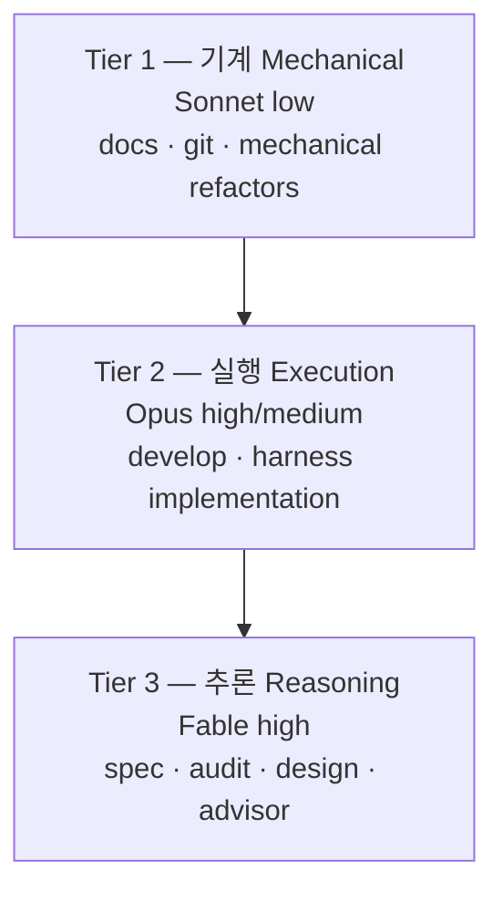

MoAI-ADK v3.0은 Haiku를 라우팅 모델 세트에서 배제하고, 3-티어 구조(Sonnet / Opus / Fable)로 작업을 분산합니다. 이 설계는 DeepSWE 리더보드의 실측 데이터에 근거합니다. 이 페이지는 왜 Haiku를 배제했는지, 3-티어가 어떻게 구성되는지, 그리고 설계 의도와 구현된 동작을 구분해서 설명합니다.

## 왜 Haiku를 배제했는가

DeepSWE 리더보드(deepswe.datacurve.ai, 113 tasks, 2026-07-09)의 핵심 발견은 **"약한 모델 + 높은 effort = 가용성의 적"**이라는 점입니다. max effort에서 Sonnet 5는 268스텝, 214k 출력 토큰을 소모하며, 이는 과도한 재시도 루프로 이어집니다.

| 모델 [effort] | Pass@1 | 과제당 비용 | $/해결과제 | 토큰/해결과제 | 스텝 |
|---|---|---|---|---|---|
| Fable 5 [max] | 70% | $21.63 | $30.9 | 170k | 88 |
| Opus 4.8 [max] | 59% | $13.22 | $22.4 | 229k | 120 |
| Sonnet 5 [max] | 54% | $26.40 | $48.9 | 396k | 268 |

 **단가 역전**: Sonnet의 명목 단가($3/$15)는 Opus($5/$25)의 절반이지만, 과제당 비용은 Opus $13.22 < Sonnet $26.40으로 역전합니다. Sonnet이 토큰을 1.6배, 스텝을 2.2배 더 소모하기 때문입니다. "싼 모델로 돌리면 쿼터가 절약된다"는 통념은 성립하지 않습니다.

이 데이터를 볼 때 Haiku를 라우팅에 포함하면 기계적 작업에 불필요한 스텝 낭비가 발생합니다. 대신, 기계 작업에는 Sonnet low effort를 배정하여 스텝 수를 최소화합니다.

## 3-티어 정의

작업 성격에 따라 3개 티어로 모델과 effort를 배정합니다.

### Tier 1 — 기계 (Mechanical)

 문서 작업, git 조작, 기계적 리팩토링은 추론이 불필요합니다. Sonnet low effort로 스텝 수를 최소화합니다. 담당 에이전트: manager-docs, manager-git.

### Tier 2 — 실행 (Execution)

 구현, 하네스 생성은 좋은 계획이 주어지면 실행 난도가 낮아집니다. Opus high(API) 또는 Sonnet high(구독)를 배정하여 max-effort 루프 낭비를 차단합니다. 담당 에이전트: manager-develop, builder-harness.

### Tier 3 — 추론 (Reasoning)

 계획, 감사, 설계, 자문은 하류 재작업(= 토큰 낭비)을 결정하는 단계입니다. Fable high(API) 또는 Opus high(구독)에 최고 추론 모델을 배정합니다. 담당 에이전트: manager-spec, plan-auditor, sync-auditor, manager-design, super-advisor.

## DeepSWE 리더보드 근거

리더보드 실측에서 도출된 4가지 결론:

1. **Sonnet 5 max는 Claude 계열 최악의 가성비** — Opus 4.8 max보다 비싸고($26.40 vs $13.22) 점수는 낮습니다(54% vs 59%). 원인은 268스텝의 과도한 재시도 루프입니다. 높은 effort가 높은 가치를 의미하지 않습니다.
2. **API 가성비 1위는 Opus 4.8** ($22.4/해결과제). 품질 1위는 Fable 5 (70%). Fable의 프리미엄은 해결과제당 +$8.5입니다.
3. **가용성 관점에서도 Fable(170k) < Opus(229k) < Sonnet(396k)** — 구독 주간 한도는 토큰 기반이므로 약한 모델이 오히려 쿼터를 더 태웁니다.
4. **스텝 수 = 속도** — Fable 88 < Opus 120 < Sonnet 268. 벽시계 시간에서도 상위 모델이 유리합니다.

 **한계 고지**: 리더보드에는 Claude 모델의 effort 변형(low/medium/high/xhigh) 데이터가 없습니다(전부 max). 따라서 "Sonnet xhigh vs high 품질 차이"는 직접 실증 불가하며, effort 하향은 (a) Sonnet 5 max 루프 낭비 실측, (b) Opus 4.8 기본 effort가 high라는 Anthropic 공식 포지셔닝, (c) effort가 출력 토큰에 준선형이라는 일반 특성에서 추정한 것입니다.

## 설계 보고서 vs 구현

 **REQ-DA-061 정직성 구분**: 이 페이지의 내용 중 설계 단계와 구현된 동작을 명확히 구분해야 합니다.

**설계 단계** (`.moai/reports/agent-architecture-redesign-v2-20260709.html`) — v2 아키텍처 설계 의도. 3-티어 모델 정책의 원칙과 DeepSWE 근거를 제시합니다.

**구현된 동작** — 단일 프로필 매트릭스가 실제 라우팅을 수행합니다. 활성 프로필(`max`/`medium`/`low`)이 매트릭스의 한 열을 선택하고, 리졸버가 각 에이전트의 `{model, effort}`를 결정하여 spawn 시점에 model을 런타임 인자로 주입합니다. 상세한 매트릭스는 [프로필 매트릭스](/ko/advanced/profile-matrix/) 페이지를 참조하세요.

독자는 설계 의도(이 페이지의 DeepSWE 근거)와 구현된 동작(단일 프로필 매트릭스)을 구분할 수 있어야 합니다.

## 하네스 자가 진화와의 연결

3-티어 아키텍처는 하네스 자가 진화의 기반입니다. 진화 루프(관찰 → 반추 → 승격)가 효과를 발휘하려면 관찰 단계의 라우팅 결정이 올바른 모델에 올바른 effort로 이루어져야 합니다. 자세한 내용은 [하네스 자가 진화](/ko/advanced/self-evolving/) 페이지를 참조하세요.

## 다음 단계

- [프로필 매트릭스](/ko/advanced/profile-matrix/) — 단일 3-열 per-agent 프로필 매트릭스 (10 에이전트 × 3 프로필)
- [토크노믹스 개요](/ko/advanced/tokenomics-overview/) — 4-층 토크노믹스 구조의 B층 라우팅
