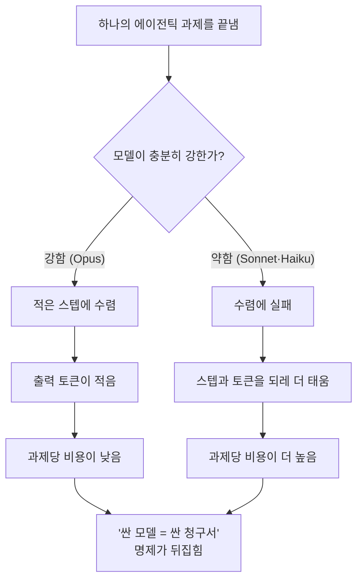
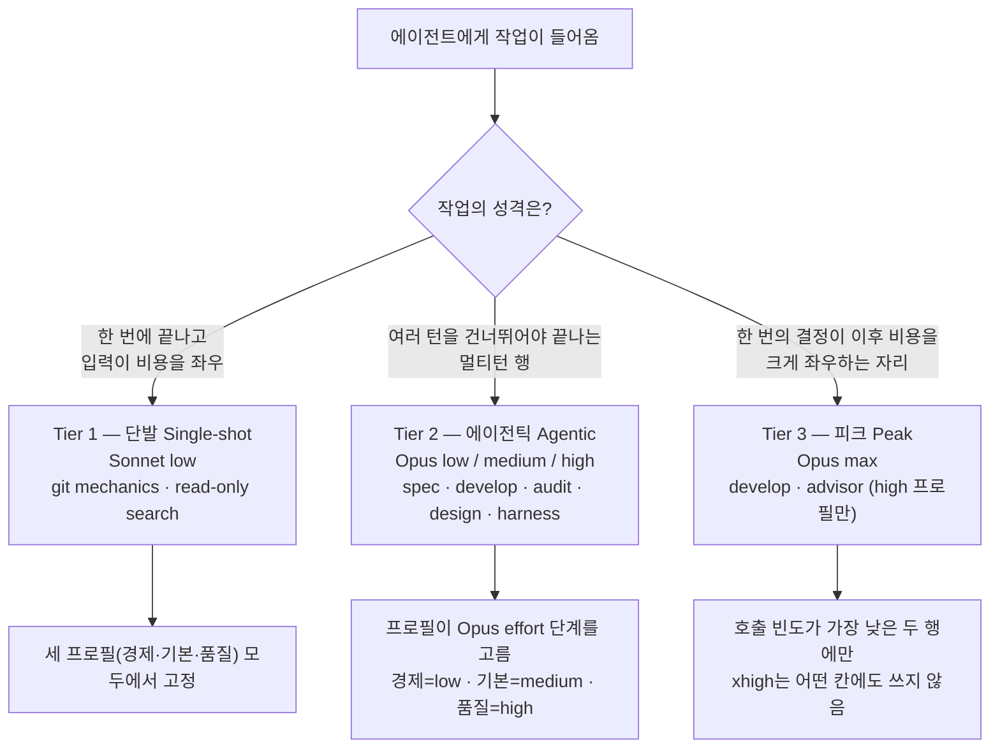

MoAI-ADK는 라우팅 모델 세트에서 Haiku를 빼고, 남은 모델들을 작업의 성격에 맞춰 세 단계로 나눠 씁니다. 이 페이지는 친구에게 이렇게 설명할 수 있도록 쓴 페이지입니다 — *"싼 모델을 바쁜 자리에 끼워 넣으면 비용이 절약될 것 같지만, 긴 호흡의 과제에서는 정반대가 된다. 그래서 MoAI는 비싼 모델을 더 자주 쓰는 쪽이 오히려 청구서를 줄인다는 걸 데이터로 확인하고, 그 위에서 작업 종류별로 세 단계의 배정 규칙을 정했다."*

여기서 **에이전트** (agent, 스스로 판단해 일하는 AI 도우미) 가 과제를 끝내는 데 쓰는 모델과 **effort** (추론 깊이, 한 번의 답을 위해 모델이 얼마나 깊이 생각할지를 정하는 다섯 단계 `low` → `medium` → `high` → `xhigh` → `max`) 는 비용을 가르는 두 축입니다. 이 페이지는 왜 이 두 축을 이렇게 배정했는지, 왜 Haiku는 아예 빼었는지, 그리고 이 '티어'가 자율성 등급과는 다른 개념이라는 점까지 다룹니다.

## 직관과 현실이 갈라지는 지점

흔히 드는 가정은 이렇습니다. "토큰당 단가가 싼 모델(가령 Sonnet·Haiku)을 바쁜 자리에 돌리고, 비싼 모델(Opus)은 중요한 자리에만 아껴 쓰면 전체 비용이 줄 것이다." 토큰(token, 모델이 글을 읽고 쓰는 과금 단위) 의 단가표만 놓고 보면 이 가정은 옳아 보입니다.

그런데 이 가정이 성립하려면 한 가지 전제가 필요합니다 — *약한 모델도 결국 같은 과제를 같은 횟수 안에 끝낸다*는 전제입니다. 긴 호흡의 에이전틱 과제(여러 번 도구를 부르고, 스스로 계획을 고치며, 끝까지 가야 끝나는 과제)에서는 이 전제가 무너집니다. 약한 모델은 수렴에 실패하고, 실패한 만큼 스텝을 더 돌리고 출력 토큰을 더 뿜으면서 과제를 끝내지 못합니다. 토큰당 단가는 싸되, *태우는 토큰 양*이 훨씬 많아 과제당 청구서는 오히려 더 커집니다.

이것이 이 페이지 전체의 출발점입니다. **청구서를 정하는 것은 단가가 아니라 완주 효율입니다.**

## 데이터가 말하는 것 — DeepSWE 리더보드

위 직관을 확인한 출처는 DeepSWE 리더보드의 **"All effort levels"** 뷰입니다 (113 tasks / 91 repos / 5 languages, mini-swe-agent 하네스). effort를 단계별로 보고하므로 운용점 하나가 아니라 각 모델의 비용·점수 곡선 모양에서 티어를 도출할 수 있습니다.

| 모델 | effort | 점수 | $/과제 | 출력 토큰 | 스텝 |
|---|---|---|---|---|---|
| Opus 5 | low | 58% | $1.66 | 20k | 36 |
| Opus 5 | medium | 69% | $3.29 | 37k | 52 |
| Opus 5 | high | 73% | $6.08 | 64k | 73 |
| Opus 5 | xhigh | 73% | $9.07 | 92k | 89 |
| Opus 5 | max | 74% | $11.84 | 118k | 99 |
| Sonnet 5 | low | 31% | $2.19 | 36k | 77 |
| Sonnet 5 | medium | 40% | $4.08 | 57k | 108 |
| Sonnet 5 | high | 48% | $7.43 | 87k | 147 |
| Sonnet 5 | xhigh | 50% | $11.89 | 121k | 186 |
| Sonnet 5 | max | 54% | $26.40 | 214k | 268 |
| Fable 5 | high | 69% | $9.18 | 57k | 59 |
| Fable 5 | max | 70% | $21.63 | 119k | 88 |

MTok당 정가(입력/출력): Opus 5 $5/$25 · Sonnet 5 $2/$10 (도입 가격, 2026-08-31까지, 이후 $3/$15) · Fable 5 $10/$50.

 **단가 역전**: Sonnet의 토큰당 단가는 Opus보다 *낮지만*, 비교 가능한 모든 지점에서 과제당 비용은 오히려 더 듭니다 — Opus 5 `low`는 $1.66에 58%를 받고, Sonnet 5 `max`는 $26.40에 54%를 받습니다. "싼 모델로 돌리면 쿼터가 절약된다"는 통념은 긴 호흡의 에이전틱 작업에서는 성립하지 않습니다. 청구서를 정하는 것이 단가가 아니라 완주 효율이기 때문입니다.

데이터에서 읽히는 결론은 네 가지입니다.

1. **Opus 5는 모든 effort에서 Sonnet 5를 파레토 지배합니다.** Opus `low` (58%, $1.66) 가 Sonnet의 다섯 지점을 점수와 비용 두 축 모두에서 앞서며, Sonnet `max` (54%, $26.40) 도 예외가 아닙니다. "바쁜 에이전트는 싼 모델로 보낸다"는 라우팅 명제는 긴 호흡의 에이전틱 작업에서는 반증됩니다.
2. **원인은 단가가 아니라 완주 효율입니다.** Sonnet은 같은 과제 세트를 끝내는 데 스텝을 약 2.7배 씁니다. 과제를 비싸게 만드는 것은 토큰당 요율이 아니라, 그렇게 더 든 스텝과 출력 토큰입니다.
3. **`xhigh`는 Opus에서 순손실입니다.** `high`와 `xhigh` 모두 73%인데, `xhigh`는 비용이 49% 더 들고 스텝도 22% 더 씁니다. Fable에서도 같은 자리에서 천장이 평평해집니다. 무릎을 넘긴 effort는 점수가 아니라 토큰만 더 씁니다.
4. **`medium`이 무릎입니다.** 점수 1점당 한계 비용은 `low` → `medium` $0.15, `medium` → `high` $0.70 (4.7배), `xhigh` → `max` $2.77 (18.6배) 입니다. 기본 프로필이 핵심 구현 에이전트를 `medium`에 고정하는 이유가 여기에 있습니다.

## 왜 Haiku를 아예 빼는가

Sonnet조차 긴 호흡의 과제에서는 Opus보다 과제당 비용이 더 듭니다. Haiku는 Sonnet보다 더 약합니다. 그러니 Haiku를 라우팅에 넣어봐야 역량은 늘지 않고 스텝 낭비만 늘어납니다 — Sonnet에서 이미 관측된 완주 실패 패턴이 Haiku에서는 더 가파르게 나타납니다.

그래서 MoAI는 Haiku를 라우팅 모델 세트에서 완전히 제외합니다 (No-Haiku 정책, SPEC-AGENT-ARCH-V2-001 §D). Haiku는 모델 enum에서 여전히 유효한 값이라 문서·예시 YAML에는 등장하지만, 실제 에이전트 배정 매트릭스의 어떤 칸에도 들어가지 않습니다. Haiku를 빼고도 비용을 줄이는 축은 남습니다 — 모델 클래스를 바꾸는 대신 effort(추론 깊이)를 단계별로 조절하는 쪽입니다. 이것이 3-티어 구조의 출발점입니다.

## 3-티어 배정 규칙

남은 모델(Opus, Sonnet)과 effort를 작업의 성격에 따라 세 단계로 배정합니다. '티어'는 여기서 *작업 종류에 따른 모델·effort 배정 단계*를 뜻합니다.

### Tier 1 — 단발 (Single-shot)

 한 번에 끝나고, 반복보다 입력이 비용을 좌우하는 작업입니다. 약한 모델을 비싸게 만드는 원인, 즉 멀티스텝 완주 실패가 여기서는 나타나지 않으므로 Sonnet의 낮은 입력 단가가 실질적인 변수가 됩니다. Sonnet `low` effort로 스텝 수를 최소로 줄입니다. 담당 에이전트는 `manager-git`, `Explore`이며, 이 두 행은 세 프로필(경제·기본·품질) 모두에서 고정입니다.

### Tier 2 — 에이전틱 (Agentic)

 계획, 구현, 감사, 설계, 하네스 생성, 문서화, E2E — 멀티턴 행 전부입니다. Opus `low`가 이미 어떤 effort의 Sonnet보다 점수가 높으면서 과제당 비용은 낮으므로 이 행 전부를 Opus가 맡습니다. 프로필은 각 행을 Opus effort 단계 가운데 어디에 앉힐지 고릅니다 — 경제 열은 `low`, 기본 열은 `medium`, 품질 열은 `high`입니다. 담당 에이전트: `manager-spec`, `manager-develop`, `plan-auditor`, `sync-auditor`, `manager-design`, `builder-harness`, `manager-docs`, `e2e-tester`.

### Tier 3 — 피크 (Peak)

 `max` effort는 `high` 프로필에서 호출 빈도가 가장 낮은 두 행, 즉 `manager-develop`과 `super-advisor`에만 씁니다. `medium` 위로는 점수 1점당 한계 비용이 가파르게 오르기 때문입니다 (`low` → `medium`은 점당 $0.15, `medium` → `high`는 점당 $0.70). 그래서 한 번의 결정이 이후 비용을 크게 좌우하는 자리에만 피크 effort를 배정합니다. `xhigh`는 어디에도 쓰지 않습니다 — Opus에서 `high`와 점수가 같으면서 비용만 49% 더 듭니다.

## 모델 티어와 자율성 티어는 다릅니다

이 페이지의 '티어'는 *어떤 모델을 어떤 추론 깊이로 어떤 작업에 배정할지*에 대한 배정 단계입니다. 이름이 비슷해 헷갈리기 쉽지만, MoAI에는 이와 **다른** '티어'가 하나 더 있습니다.


**이름만 같고 대상이 다른 두 티어**
- **모델 티어** (이 페이지) — 에이전트가 *어떤 모델·effort*로 일할지를 작업 종류별로 정합니다. 대상은 **비용·품질**입니다.
- **자율성 티어** (`MOAI_AUTONOMY_TIER`) — 에이전트가 *사람 승인 없이 어디까지 자율적으로* 행동할 수 있는지의 등급입니다. 대상은 **권한·통제**입니다.


둘은 직교합니다. 한 에이전트가 비싼 모델·높은 effort로 일한다고 해서 (모델 티어가 높다고 해서) 사람 승인 없이 자율적으로 행동할 수 있는 것은 아니며, 반대도 마찬가지입니다. 자율성 티어는 별도의 환경변수와 3단계 모드 선택으로 다뤄지며, 자세한 내용은 [자율성 티어](/ko/advanced/autonomy-tier/) 페이지에서 다룹니다.

## 설계 의도와 구현된 동작을 갈라 읽기

 **정직성 구분**: 이 페이지는 설계 단계의 의도와 실제 구현된 동작을 분명히 갈라 둡니다.

**설계 단계** (`.moai/reports/agent-architecture-redesign-v2-20260709.html`) — v2 아키텍처의 설계 의도입니다. 3-티어 모델 정책의 원칙과 DeepSWE 근거를 제시합니다.

**구현된 동작** — 실제 라우팅은 단일 프로필 매트릭스가 수행합니다. 활성 프로필 (`high` / `medium` / `low`) 이 매트릭스의 한 열을 고르면 리졸버가 각 에이전트의 `{model, effort}` 를 정하고, spawn 시점에 model을 런타임 인자로 넣습니다. 자세한 매트릭스는 [프로필 매트릭스](/ko/advanced/profile-matrix/) 페이지를 보세요.

읽는 쪽에서도 설계 의도 (이 페이지의 DeepSWE 근거) 와 구현된 동작 (단일 프로필 매트릭스) 을 구분해서 봐야 합니다.

## 이 벤치마크가 재지 못하는 것

 **한계 고지**: 이 벤치마크가 측정하는 대상은 **코딩** 에이전트입니다. 문서 저작, 감사 판단, SPEC(요구사항 명세서) 저작 품질은 직접 측정하지 않았으므로, 해당 행 배치는 관측이 아니라 멀티턴 에이전틱 작업과 비슷하리라는 추론에 기댑니다. 신뢰구간도 함께 봐야 합니다 — `medium` (69%±1) 과 `high` (73%±2) 는 겹치지 않지만 `max` (74%±4) 는 `high`와 겹칩니다. 이것이 `max`를 거의 호출되지 않는 두 셀로 묶어둔 이유입니다. 모든 기본값은 `llm.agent_overrides`로 에이전트마다 되돌릴 수 있습니다.

 **Fable 5에 대하여**: Fable은 코딩 작업에서 모든 effort에 걸쳐 밀립니다. Fable `high` (69%, $9.18) 는 Opus `medium` (69%, $3.29) 과 같은 점수를 거의 3배 비용에 냅니다. 그래서 어떤 매트릭스 칸에도 넣지 않았습니다. 모델 enum에서는 여전히 유효한 값이고 GLM 백엔드의 Fable 슬롯 배선도 그대로 살아 있습니다 — 바뀐 것은 기본값뿐입니다.

## 하네스 자가 진화와의 연결

3-티어 배정은 하네스가 스스로 나아지는 루프의 바탕입니다. 관찰 → 반추 → 승격으로 이어지는 진화 루프가 제 몫을 하려면, 관찰 단계의 라우팅 결정부터 알맞은 모델에 알맞은 effort로 이뤄져야 합니다. 잘못 배정된 라우팅은 관찰 자체를 오염시키고, 오염된 관찰은 승격 단계에서 잘못된 규칙을 낳습니다. 자세한 내용은 [하네스 자가 진화](/ko/advanced/self-evolving/) 페이지를 보세요.

## 다음 단계

- [프로필 매트릭스](/ko/advanced/profile-matrix/) — 단일 3-열 per-agent 프로필 매트릭스 (11 에이전트 × 3 프로필 = 33 셀)
- [자율성 티어](/ko/advanced/autonomy-tier/) — 모델 티어와 직교하는, 권한·통제 대상의 자율성 등급
- [토크노믹스 개요](/ko/advanced/tokenomics-overview/) — 4-층 토크노믹스 구조의 라우팅 층
